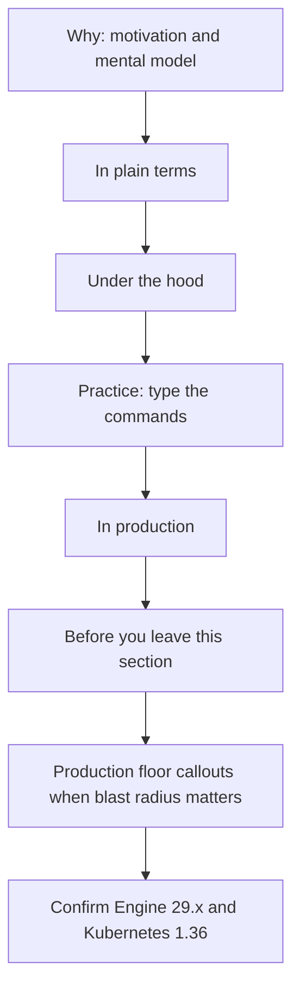
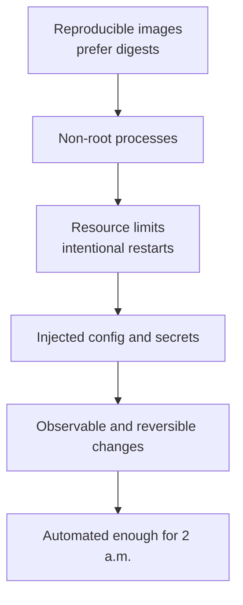
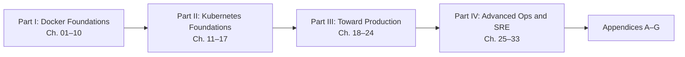
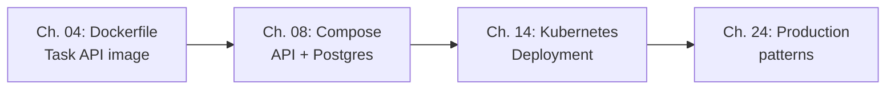

# Preface

> **Learning Objectives**
>
> By the end of this preface, you will be able to:
>
> - Explain who this book is for and how the four parts build on each other
> - Adopt a “why before how” habit that transfers beyond Docker and Kubernetes
> - State what “production-ready” means in this curriculum
> - Choose a reading path that matches your time and goals
> - Confirm the version baseline (Docker Engine 29.x, Kubernetes 1.36)

---

## A Shipping Container, Not a Magic Box

In 1956, Malcolm McLean’s first container ship did not invent cargo—it reinvented *packaging*. Before standardized containers, loading a ship meant custom labor for every crate size and fragility. After containers, the same metal box could move from truck to crane to ship without anyone unpacking the contents.


*Figure 00.A: Containers standardize packaging the way shipping containers standardized cargo.*

Software had the same problem for decades. An app that “worked on my machine” failed on a teammate’s laptop, then again on staging, then again in production—different OS packages, different library versions, different environment variables. Containers are the shipping containers of software: a standard way to package an application *and* the runtime it needs so it can move from laptop to cloud with far fewer surprises.

This book teaches you that packaging system—**Docker**—and the modern yard that schedules thousands of those containers—**Kubernetes**—from first principles to production habits.

---

## Who This Book Is For

You are in the right place if you:

- Can open a terminal and edit a text file
- Have written at least a little code (any language)
- Want a coherent path from “what is a container?” to “how do I ship safely?”

You are still welcome if you already use Docker casually. Part I will fill gaps; Parts II–IV will raise the bar toward operational and SRE maturity.

This book is **not** a vendor certification dump or a reference manual of every flag. It is a *textbook*: explanations, realistic examples, exercises, and check questions.

> 💡 **Tip:** If you can install packages and read HTTP status codes, you have enough background to start Chapter 01. Linux fluency helps but is not required—Windows and macOS paths are covered where they differ.

---

## What You Will Build Toward

By the end of the main chapters you will be able to:

1. Explain containers versus virtual machines without hand-waving
2. Build efficient, secure Docker images with multi-stage Dockerfiles and BuildKit
3. Run, debug, and limit containers on a single host
4. Compose multi-service local environments
5. Deploy and operate workloads on Kubernetes using declarative YAML
6. Apply production patterns: health probes, rollouts, RBAC, observability, and safe image promotion

Chapter 04 introduces a small **Task API** (Python Flask) that recurs as a running example. You will containerize it, harden the image, wire it into Compose, and later run it as a Kubernetes Deployment—so concepts stay concrete instead of abstract.

---

## How to Learn From These Pages

**Why before how.** Every major technique is motivated first. If you skip the motivation, the flags will feel arbitrary and you will forget them.

**Type the commands.** Reading alone creates familiarity; typing creates muscle memory. Use the `$` prompt lines as your checklist.

**Fail on purpose occasionally.** Stop a container wrongly, pull a bad tag, mis-set a port—then recover using the debugging chapters. Recovery skill is production skill.

**Keep versions in mind.** This book assumes **Docker Engine 29.x** (Compose V2, BuildKit and buildx by default) and **Kubernetes 1.36**. If a command fails oddly, check `docker version` and `kubectl version` before assuming the book is wrong.

### The reading method: plain → hood → production floor

Most major concepts are written in **three depth tiers**. Read them in order the first time through a chapter. On later passes, jump to the tier that matches the job you are doing.

| Tier | Heading | What it is for |
|------|---------|----------------|
| 1 | **In plain terms** | Intuition, the problem being solved, and one common misconception |
| 2 | **Under the hood** | Mechanism, realistic commands or YAML, sample output, and what breaks if you get a detail wrong |
| 3 | **In production** | Who owns it, how failures show up, how you mitigate, and a concrete do / don’t |

**Simple first, exact second.** Tier 1 uses everyday words on purpose. Each new term is defined the first time you meet it, so you never have to already know the vocabulary to follow the idea. Tier 2 then gives you the precise mechanism, and Tier 3 gives you the operating rules. If a plain-terms paragraph ever feels too basic, that is by design—it is the ramp, not the destination.

For the densest ideas you will also see a one-line summary you can carry away even on a fast skim:

```markdown
> 💡 **In one line:** …
```

After those three tiers you will often see a short micro-checklist:

```markdown
**Before you leave this section**

- **Understand:** the idea you must be able to explain aloud
- **Try:** a small command or experiment on your machine
- **Watch in prod:** the signal an on-call engineer would notice first
```

Treat that checklist as a gate, not decoration. If you cannot complete **Understand**, re-read plain terms. If **Try** fails oddly, stay in under the hood until the sample output makes sense. If you skip **Watch in prod**, you will memorize flags without building an operational eye.

Occasionally you will see a heavier callout:

```markdown
> 🏭 **Production floor:** …
```

Those are reserved for **change safety**, **blast radius**, **digest pinning**, and similar rules that an MNC platform mentor would put on a team wiki—not for everyday tips. When you see one, slow down: it is usually about what one bad change can take down, and what evidence you paste into an incident ticket.



*Figure 00.1: A durable learning loop — plain intuition, hood mechanism, production ownership, then a leave-section gate before you move on.*

> ⚠️ **Common Pitfall:** Reading only *In production* to “save time.”  
> Without the plain-terms mental model, production checklists become superstition. Without under-the-hood evidence (`docker inspect`, digests, events), you cannot tell whether a checklist item actually passed.

**Before you leave this section**

- **Understand:** The three tiers answer *what / how / who owns and what fails*, in that order.
- **Try:** Skim Chapter 01’s first major concept and identify its three tiers plus the leave-section checklist.
- **Watch in prod:** Whether your team’s runbooks cite evidence (digests, inspect output, events) or only folklore.

---

## What “Production” Means Here

“Production” in this book does **not** mean “runs on the biggest cloud” or “uses every CNCF project.” It means a set of operational habits you can defend in an incident review:

- Images are **reproducible** and preferably pinned by **digest** when promoting across environments
- Processes run as **non-root** when possible
- Resources have **limits**; restarts are intentional, not accidental loops
- Configuration and secrets are **injected**, not baked into layers
- Changes are **observable** (logs, events, health) and **reversible** (rollbacks)
- Deployments are **automated** enough that humans are not copy-pasting by memory at 2 a.m.

You will meet these ideas gradually. Early chapters prioritize clarity over perfection; later chapters tighten the screws. When *In production* sections talk about **ownership**, they mean: who changes the image versus who owns the Deployment versus who owns the cluster—and how far one bad change can blast.

A useful mental pipeline for any lasting change:

```text
PR → CI build + scan → promote by digest → rollout → watch signals → rollback if needed
```

If your personal workflow skips digests, skips a reversible path, or has no first signal to watch, you are practicing demos—not production—even if the app is “in the cloud.”



*Figure 00.2: “Production” in this curriculum is a stack of operational habits, not a cloud vendor badge.*

> 🏭 **Production floor:** Prefer promoting an immutable digest over rebuilding “the same tag” in each environment. Tags move; digests do not. Incident tickets should record the digest you intended to run and the digest `docker inspect` / cluster status actually shows.

**Before you leave this section**

- **Understand:** Production here is habits (reproducible, limited, observable, reversible)—not a vendor badge.
- **Try:** Write one sentence naming the first signal you would watch after a container deploy (logs, health, restart count, or error rate).
- **Watch in prod:** Deploys that cannot answer “which digest is live?” within a minute.

---

## Parts of the Book

| Part | Focus | Outcome |
|------|-------|---------|
| **I — Docker Foundations** (Ch. 01–10) | Images, containers, networks, volumes, Compose, Swarm intro, security | Confident local containerization |
| **II — Kubernetes Foundations** (Ch. 11–17) | Cluster model, workloads, Services, Ingress/Gateway, config/secrets | Confident cluster basics |
| **III — Toward Production** (Ch. 18–24) | Storage, CNI/policies, scheduling, RBAC, observability, Helm, production patterns | A production-minded workflow |
| **IV — Advanced Ops & SRE** (Ch. 25–33) | Build/supply chain, Engine ops, kubeadm, extensions, governance, day-2 SRE | Platform and SRE readiness |
| **Appendices A–G** | Cheatsheets, resources, answers, glossary, docs map, version migration | Fast lookup while you work |



*Figure 00.3: The book roadmap moves from Docker foundations through Kubernetes, production patterns, and advanced SRE topics.*



*Figure 00.4: The Task API running example threads through Chapters 04, 08, 14, and 24 so the same app deepens with each part.*

---

## A Note on Tools and Platforms

Examples favor portable commands. Where Windows PowerShell differs from bash (paths, line continuation), chapters call it out or use forms that work in both Git Bash and modern PowerShell. Docker Desktop on Windows and macOS runs a Linux engine in a lightweight VM—that is normal and explained in Chapter 02.

Official documentation is the source of truth for flags that change between minor releases. Every chapter ends with an **Official documentation map** linking to the canonical pages on [docs.docker.com](https://docs.docker.com/) and, later, [kubernetes.io/docs](https://kubernetes.io/docs/home/).

---

## Common Pitfalls While Studying

> ⚠️ **Common Pitfall:** Treating Docker as “just run `docker run`.”  
> Without understanding images and layers, you will struggle to shrink images, debug failed starts, or trust what you deploy.

> ⚠️ **Common Pitfall:** Jumping to Kubernetes on day one.  
> Orchestration amplifies confusion if you do not yet know how a single container behaves. Finish Part I first unless you already have that foundation.

> ⚠️ **Common Pitfall:** Copying YAML from the internet without reading it.  
> Production incidents often start as “a snippet that worked somewhere.” This book trains you to read every field you apply.

---

## Hands-On Exercises

1. Skim the [README table of contents](README.md) and mark the chapter where you personally want to be in two weeks.
2. Confirm you have a terminal and a text editor ready. Create a folder named `docker-k8s-lab` somewhere convenient for future exercises.
3. Write three sentences answering: “What problem do I hope containers solve for me?” Keep the note; revisit it after Chapter 05.
4. Open [Get started with Docker](https://docs.docker.com/get-started/) in a browser and skim the overview page—no need to follow every tutorial yet.

---

## Check Your Understanding

**Q1.** In one sentence, what problem do containers primarily solve?

<details>
<summary>Show answer</summary>

They package an application with its runtime dependencies into a portable unit so it behaves more consistently across machines and environments.

</details>

**Q2.** True or false: This book’s idea of “production” requires you to use a specific cloud vendor.

<details>
<summary>Show answer</summary>

False. Production here means operational habits—reproducible images, limits, secrets hygiene, observability, and reversible deploys—independent of vendor.

</details>

**Q3.** Why does the curriculum place Docker before Kubernetes?

<details>
<summary>Show answer</summary>

Kubernetes schedules and manages containers. If you do not understand images, processes, ports, volumes, and failure modes of a single container, cluster concepts become abstract and error-prone.

</details>

**Q4.** What Docker Engine and Kubernetes versions does this book target?

<details>
<summary>Show answer</summary>

Docker Engine / Desktop **29.x** and Kubernetes **1.36**.

</details>

**Q5.** In what order should you read the three depth tiers the first time you meet a major concept?

<details>
<summary>Show answer</summary>

In plain terms → Under the hood → In production, then complete the Before you leave this section checklist (Understand / Try / Watch in prod).

</details>

---

## Key Takeaways

- Containers standardize how software is packaged and moved—like shipping containers for cargo.
- This book is a beginner-friendly textbook with objectives, stories, exercises, and self-checks.
- Learn *why* before *how*; practice on a real mini-app (Task API) as concepts deepen.
- Read major concepts as **plain → hood → production**, then pass the **Before you leave this section** gate; treat **Production floor** callouts as blast-radius rules.
- Target versions are Docker Engine 29.x and Kubernetes 1.36.
- “Production” means safe, observable, reversible operations—prefer digests when promoting—not buzzword tooling.

---

## Official documentation map

| Topic | Official page |
|-------|---------------|
| Docker overview / get started | [Get started](https://docs.docker.com/get-started/) |
| Docker Engine documentation | [Docker Engine](https://docs.docker.com/engine/) |
| Kubernetes documentation home | [Kubernetes docs](https://kubernetes.io/docs/home/) |
| What is a container? | [What is a container?](https://docs.docker.com/get-started/docker-concepts/the-basics/what-is-a-container/) |

**Previous:** — | **Next:** [Chapter 01 — Docker: Why and What](01-docker-why-and-what.md)
