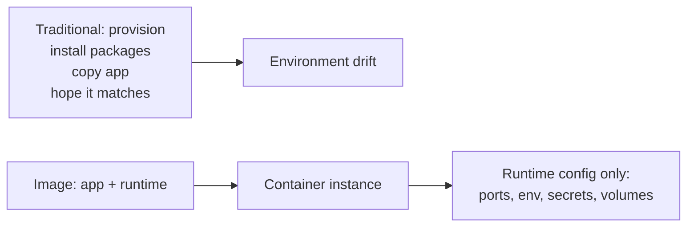
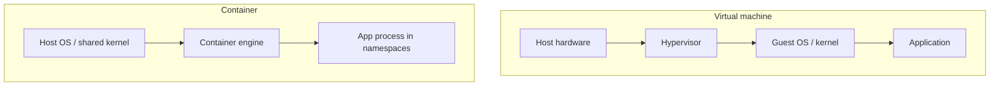
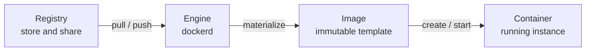
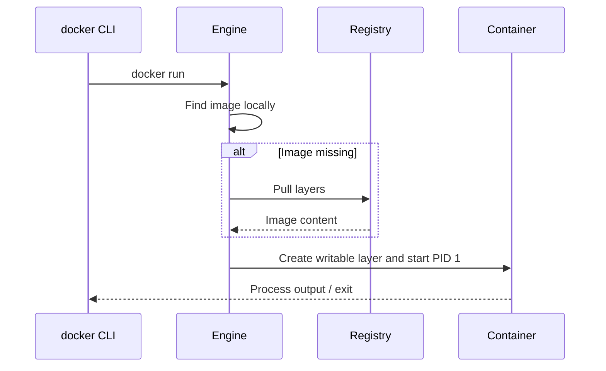
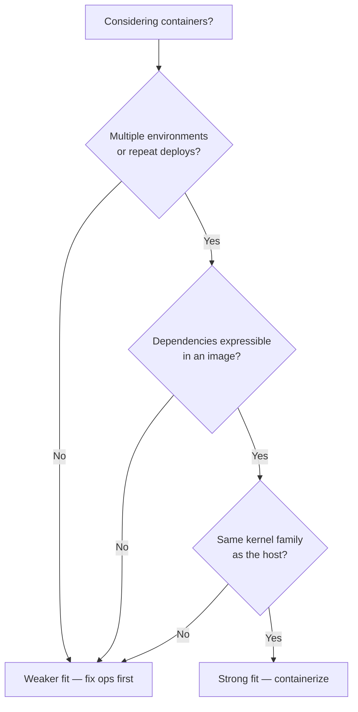

# Chapter 01 — Docker: Why and What

> **Learning Objectives**
>
> By the end of this chapter, you will be able to:
>
> - Explain the “it works on my machine” problem in concrete terms
> - Contrast virtual machines and containers with accurate boundaries
> - Define image, container, registry, and engine in plain language
> - Describe what Docker provides—and what it does not
> - Recognize when containers are a good fit and when they are not

---

## 01.1 Monday Morning, Three Environments

Alex finishes a feature Friday night. On Alex’s laptop the API returns `200 OK`. Monday, the staging server returns `500`. The logs complain about a missing system library. Ops installs the library. Staging works. Production still fails—same library, different *version*. Someone pins the version. Now a cron job on the host breaks because it needed the old one.


*Figure 01.A: Like cargo boxes that move unchanged from truck to ship, container images move apps between machines.*

Nobody was careless. The *unit of deployment* was wrong. The team shipped source code into environments that were each a unique snowflake of OS packages, language runtimes, and side effects.

Containers attack that mismatch: ship the **application plus a known filesystem and process setup**, not “hope the server already has what we need.”

---

## 01.2 The Problem Containers Solve

### In plain terms

Traditional deployment often looks like this:

1. Provision a machine (physical or VM)
2. Install language runtimes, OS packages, and agents
3. Copy application files
4. Configure environment-specific settings
5. Start the process and pray the next machine matches

Drift between steps 2–4 is inevitable. Each environment accumulates one-off fixes—“just this OpenSSL,” “just that locale,” “just bump Node on staging”—until nobody can recreate production from scratch. The Monday-morning story in §01.1 is not bad luck; it is what happens when the *unit of deployment* is source code plus a snowflake host.

Containers flip the model: build an **image** that already contains the runtime and app, run that image as a **container** on any host with a compatible engine, and configure only the *differences* (ports, env vars, secrets, volumes) at run time. The image becomes the thing you test, scan, and promote. The host still supplies a kernel and resources, but it stops being a treasure chest of undocumented packages.



*Figure 01.1: Containers move dependency soup into a rebuildable image and leave only environment-specific knobs for runtime.*

> ⚠️ **Common Pitfall:** You might think containers “eliminate environment differences entirely.” They do not. Kernel version, cgroup limits, DNS, certificates injected at runtime, and volume contents still differ. Containers shrink *dependency drift*; they do not abolish ops.

### Under the hood

The host still matters—kernel version, available resources, and security policy—but the bulk of “dependency soup” moves into a versioned, rebuildable artifact. When you later run:

```bash
$ docker run --rm -p 8080:80 nginx:alpine
```

you are asking an engine to materialize a filesystem from image layers, create isolated namespaces for the process, and start the image’s default command. Chapters 02–05 unpack each of those steps. For now, notice the separation: **image** (what to run) versus **runtime options** (how this instance should behave).

Sample pull output (abbreviated):

```text
Unable to find image 'nginx:alpine' locally
alpine: Pulling from library/nginx
...
Status: Downloaded newer image for nginx:alpine
/docker-entrypoint.sh: Configuration complete; ready for start up
```

**What breaks if you still install app libraries on the host “just in case”:** you reintroduce the snowflake. Two hosts diverge again; the image is no longer the full story; debugging becomes “is it the image or the host package?” Prefer baking dependencies into the image and keeping the host lean.

### In production

**Ownership:** app teams own the application image contents; platform teams own the engine/runtime baseline and registry policy. Both share the promotion contract: what digest left CI is what staging and production pull.

Treat the image as the unit you promote: build once in CI, scan it, push it to a registry, and pull the *same* digest into staging and production. Configuration that differs per environment (URLs, credentials, feature flags) should enter at runtime—not as a rebuilt “prod image” that silently diverges from what you tested.

**Failure mode:** staging runs `myapp:1.4.2` built Monday; production “uses the same tag” rebuilt Thursday with a different base patch. **Detect:** compare digests (`RepoDigests` / deploy manifests), not tag strings. **Mitigate:** promote by digest; ban floating tags in prod deploy configs.

> 🏭 **Production floor:** If you cannot answer “which image digest is running in production?”, you do not yet have a reproducible deploy story—even if containers are involved. Paste digest + change ticket into the incident notes before debating application code.

**Do:** build once, promote the digest. **Don’t:** rebuild “the same Dockerfile” separately per environment and call them identical.

**Before you leave this section**

- **Understand:** Containers move dependency soup into a rebuildable image; runtime config stays outside.
- **Try:** Run `docker run --rm -p 8080:80 nginx:alpine` and hit the published port once Docker is installed (Chapter 02).
- **Watch in prod:** Tag-only deploys with no recorded digest.

---

## 01.3 Virtual Machines vs Containers

### In plain terms

A **virtual machine** is like renting an entire apartment: its own kitchen, plumbing, and front door (a full guest operating system). A **container** is like a locked room in a shared building: private space for your stuff, but you share the building’s foundation (the host kernel).

That analogy answers the density question teams actually care about. Ten apartments mean ten kitchens. Ten hotel rooms share one boiler room. Containers pack denser because they do not each carry a kernel and a full OS userspace. The trade-off is isolation: a broken pipe in the foundation can affect every room. Kernel bugs, hostile syscalls, and misconfigured privileges matter more when the kernel is shared.



*Figure 01.2: A VM stacks a guest OS under each app; a container isolates the process on a shared host kernel.*

| Dimension | Virtual machine | Container |
|-----------|-----------------|-----------|
| Isolation unit | Full guest OS | Process + namespaces/cgroups |
| Typical startup | Seconds to minutes | Milliseconds to a few seconds |
| Disk footprint | GBs common | Often tens to hundreds of MBs (base dependent) |
| Kernel | Guest has its own (virtualized) | Shares host kernel |
| Best at | Different OS needs, strong isolation boundaries | Dense packaging of apps with the same kernel family |

> ⚠️ **Common Pitfall:** Calling a container “a lightweight VM.” Kernel exploits and sysctl differences matter because the kernel is shared. “Lightweight” describes packing density, not VM-grade isolation.

### Under the hood

A VM virtualizes hardware. Each guest typically includes a full operating system and, from the guest’s point of view, its own kernel. Hypervisors give strong isolation and flexible OS choices at the cost of heavier startup and larger footprints.

A container virtualizes the *operating system’s user space* using kernel features (on Linux: namespaces, cgroups, and a union filesystem). Containers on one host share the host kernel. Each container gets an isolated view of process IDs, network stack, mount points, and resource limits—but not a second kernel.

```bash
$ docker run --rm alpine uname -r
```

```text
6.x.x-...   # the *host* (or Desktop VM) kernel, not a guest kernel baked into Alpine
```

**What breaks if you need a different kernel family than the host provides:** Linux containers will not give you a Windows kernel (or vice versa) on that host. You need a VM (or a different node pool) with the right kernel. Docker Desktop on Mac and Windows *uses a Linux VM* under the hood to run Linux containers—containers and VMs cooperate rather than compete.

In cloud platforms you often run containers *inside* VMs for multi-tenant isolation: VMs separate tenants; containers pack services densely inside a tenant’s boundary.

### In production

**Ownership:** security/platform sets the isolation bar (shared-kernel OK vs mandatory VM/sandbox per tenant); app teams choose packaging (containers) within that bar.

Choose the boundary that matches your threat model. Multi-tenant untrusted workloads often still need VM (or stronger) isolation around groups of containers. Same-team microservices on a controlled cluster usually accept shared-kernel container isolation plus Kubernetes security controls (later chapters).

**Failure mode:** a privileged container or kernel exploit affects neighbors on the same node. **Detect:** runtime security alerts, unexpected host-level changes, noisy-neighbor CPU/memory on the node. **Mitigate:** drop capabilities, avoid privileged mode, separate trust tiers onto different node pools or VMs, keep engines patched.

**Do:** document whether a workload is “same-tenant shared kernel” or “needs stronger isolation.” **Don’t:** assume “we use containers” means PCI/multi-tenant isolation is solved.

> 🏭 **Production floor:** Never put mutually untrusted tenants on the same shared-kernel node without an explicit security review. Blast radius of a container breakout is “every workload on that kernel,” not “just this app.”

**Before you leave this section**

- **Understand:** VMs virtualize hardware (own kernel); containers isolate processes on a shared kernel.
- **Try:** After install, run `docker run --rm alpine uname -r` and compare to the host/Desktop kernel story in Chapter 02.
- **Watch in prod:** Privileged containers and mixed-trust workloads on one node pool.

---

## 01.4 Core Vocabulary

Learn these four words thoroughly; everything else is elaboration.



*Figure 01.3: The core vocabulary — registries store images; the engine runs containers created from those images.*

### Image

#### In plain terms

An **image** is an immutable template—like a class definition or a biscuit cutter. You *build* or *pull* images; you do not “log into” an image. The problem an image solves is repeatability: the same bytes (ideally the same digest) should start the same way on every machine that can run them.

You might think of an image as “the running app.” It is not. An image is inert until an engine creates a container from it. Confusing the two leads to people “SSH-ing into images,” tagging chaos, and deleting the wrong thing during cleanup.

> ⚠️ **Common Pitfall:** Saying “I restarted the image.” You restart a *container*; you rebuild or re-pull an *image*.

#### Under the hood

An image is layered filesystem snapshots plus metadata: default command, environment, exposed ports, working directory, user, labels, and more. Layers are content-addressed and shared across images and containers when identical.

```bash
$ docker image ls
$ docker inspect nginx:alpine --format 'ID={{.Id}} Digests={{json .RepoDigests}} Cmd={{json .Config.Cmd}}'
```

**What breaks if you treat a mutable tag as identity:** yesterday’s `myapp:prod` is not today’s `myapp:prod`. CI and prod can disagree while everyone swears they deployed “the same tag.”

#### In production

**Ownership:** app teams own image contents and tags; platform owns registry retention, scan gates, and which digests may enter prod.

Prefer tags that encode version (`1.4.2`) for humans, and digests (`sha256:…`) for machines that promote artifacts. Treat `latest` as a demo convenience, not a release pin (Chapter 03).

**Do:** record digests in release notes or GitOps. **Don’t:** promote only `:latest` or a floating `:prod` tag.

### Container

#### In plain terms

A **container** is a *running* (or stopped) instance created from an image—like an object created from a class, or a biscuit cut from the cutter. It has a thin writable layer, runtime config, and a process tree. Stopping it keeps the writable layer; removing it deletes that instance.

The misconception: a container is a little VM you customize forever. In healthy teams, containers are cattle. Hand-editing a long-lived container creates a pet that nobody can rebuild.

> ⚠️ **Common Pitfall:** Installing packages with `docker exec` and calling the problem fixed. The next replaceable instance will not have those packages—bake fixes into a new image.

#### Under the hood

```bash
$ docker create --name demo nginx:alpine
$ docker start demo
$ docker ps --filter name=demo
$ docker rm -f demo
```

**What breaks if you remove an image while containers still reference it:** `docker rmi` refuses (or you force and strand yourself). Remove or recreate containers first; understand references with `docker ps -a`.

#### In production

**Ownership:** whoever deploys owns container runtime flags (ports, env, limits); the image owner owns what is inside.

Prefer disposable cattle over pets. Debug with logs and controlled reproduction; bake lasting fixes into a new image rather than hand-editing a long-lived container.

**Failure mode:** snowflake container that only works on one host. **Detect:** “works after exec install” but fails on fresh `docker run`. **Mitigate:** rebuild image; redeploy clean instances.

### Registry

#### In plain terms

A **registry** is a library warehouse for images—Docker Hub, GitHub Container Registry, Amazon ECR, Google Artifact Registry, or a self-hosted registry. Without a registry, images live only on the laptop that built them—fine for a demo, fatal for a team.

> ⚠️ **Common Pitfall:** Treating Docker Hub anonymous pulls as an infinite free CDN for CI. Rate limits and flaky networks are production incidents waiting to happen—use authenticated pulls and caches.

#### Under the hood

You **push** images to share them and **pull** them to run elsewhere. References look like `registry/namespace/repository:tag` or `…@sha256:…`. Authentication, rate limits, and mirroring appear again in later security and CI chapters.

```bash
$ docker pull python:3.12-slim
$ docker tag python:3.12-slim registry.example.com/team/python:3.12-slim
# $ docker push registry.example.com/team/python:3.12-slim   # when you have a registry
```

**What breaks if registry auth expires mid-deploy:** nodes cannot pull; new replicas stay `ImagePullBackOff` (Kubernetes) or fail create (Docker). Keep pull credentials rotated and monitored—not only push credentials.

#### In production

**Ownership:** platform/security owns registry policy; app teams own repositories for their services.

Use a private registry (or org namespace) for internal apps. Control who can push, scan on push, and retain digests of what you deployed.

### Engine (Daemon)

#### In plain terms

The **Docker Engine** is the kitchen that actually cooks. The `docker` command is usually a waiter (client) placing orders. If the kitchen is down, the waiter’s menu still looks fine—every order fails.

#### Under the hood

`dockerd` is the background service that builds images, runs containers, manages networks and volumes, and speaks the Docker API. Modern engines delegate low-level runtime work to **containerd** and an OCI runtime such as **runc** (Chapter 02).

```bash
$ docker version
$ docker info
```

**What breaks if untrusted workloads get the Docker socket:** they can start privileged containers and often reach root on the host. Treat socket mount as root-equivalent.

#### In production

**Ownership:** platform owns engine install, upgrades, and socket exposure; developers own images and container specs within policy.

Monitor engine health, disk usage for images and logs, and API exposure.

**Do:** restrict who can talk to the socket; monitor disk. **Don’t:** mount `docker.sock` into random app containers “for convenience.”

**Before you leave this section**

- **Understand:** Image = template; container = instance; registry = warehouse; engine = runtime kitchen.
- **Try:** Write one sentence each for the four terms without looking back.
- **Watch in prod:** Socket mounts into app containers; tag-only identity with no digests.

---

## 01.5 What Docker Is (and Is Not)

### In plain terms

**Docker** is a platform—and a set of tools—for building, shipping, and running containers. In day-to-day practice you will use the Docker CLI, the Engine, Dockerfiles, and often Compose for multi-container apps on one host.

The problem Docker solved historically was not inventing isolation from scratch—it was making a coherent *workflow* popular: Dockerfile → image → registry → `docker run`. Teams could share a portable unit without inventing their own packaging ritual every quarter.

> ⚠️ **Common Pitfall:** Equating “we use Docker” with “we are cloud-native / production-ready.” Docker is packaging and a runtime. Production still needs limits, health checks, secrets hygiene, digests, and an operational plan.

### Under the hood

Docker popularized a workflow so strongly that people say “Docker” when they mean “OCI containers.” Under the hood, modern Docker builds and runs images that follow open standards (OCI image and runtime specs). Other tools exist; the concepts transfer.

A first mental model of `docker run`:

1. The client asks the engine for an image
2. If missing locally, the engine **pulls** it from a registry
3. The engine creates a container with a writable layer and network settings
4. Port publishing maps host ports to container ports when requested
5. The image’s default process starts as PID 1 inside the container
6. Flags like `--rm` control cleanup when the process exits



*Figure 01.4: A first mental model of `docker run` — resolve the image, create the instance, start the process.*

```bash
$ docker run --rm hello-world
```

```text
Hello from Docker!
This message shows that your installation appears to be working correctly.
...
```

**What breaks if the daemon cannot reach the registry:** step 2 fails; you see pull/TLS/timeout errors, not an application stack trace. Diagnose network and auth before rewriting the app.

### In production

**Ownership:** developers own Dockerfiles and app images; platform owns Engine/Desktop baselines, registry integrations, and what “approved base images” means.

Docker is packaging and a single-host (or Desktop) runtime. It is **not**:

- A full cluster orchestrator (that is Kubernetes, Nomad, Swarm mode, and friends)
- A substitute for application architecture (a messy monolith in a container is still messy)
- Automatic security (privileged containers and root processes are still dangerous)
- A VM replacement for every workload (different kernels, some devices, and specialized hardware need care)

**Failure mode:** treating Docker Desktop on a laptop as the production topology. **Detect:** “works on my Mac” with bind mounts and published ports that do not match Linux CI or cluster networking. **Mitigate:** CI on Linux runners that match prod architecture; promote digests; learn orchestration separately (Part II).

**Do:** use Docker to standardize the artifact. **Don’t:** stop at `docker run` on one VM and call the platform done.

> 📘 **Deep Dive (optional):** The Open Container Initiative (OCI) defines image and runtime specs. Learning OCI vocabulary makes it easier to evaluate alternatives (Podman, containerd directly, nerdctl) without relearning the whole world.

**Before you leave this section**

- **Understand:** Docker popularized a packaging workflow; it is not an orchestrator or a security free lunch.
- **Try:** Sketch the six `docker run` steps from memory, then check Figure 01.4.
- **Watch in prod:** Laptop-only success used as proof that production topology is fine.

---

## 01.6 When Containers Shine—and When They Do Not

### In plain terms

Containers excel when you deploy the same app across environments, need dense packing of many services, want immutable artifacts (build once, promote the image), practice clear process boundaries, or care about reproducible CI.

They are a weaker fit when you need a different kernel than the host provides, depend on highly specialized host devices without container support, only ever run one long-lived pet server with no repeat deploys, or face policies that forbid container runtimes.

The honest question is not “are containers cool?” It is “does packaging + shared-kernel isolation solve *our* pain?” If your pain is a single pet server with no second environment, containers may add ceremony without payoff. If your pain is Monday-morning drift across five environments, they are aimed squarely at you.



*Figure 01.5: A quick fitness check before containerizing everything — packaging wins when environments repeat and the kernel matches.*

> ⚠️ **Common Pitfall:** Containerizing everything on day one—including a GUI tool, a kernel module workflow, and a one-off laptop script—then blaming Docker when the fit was wrong.

### Under the hood

Fit often tracks isolation and packaging needs:

| Strong fit | Weaker fit |
|------------|------------|
| Stateless or carefully stateful services with volumes | Kernel modules or custom kernels |
| Microservices with clear process boundaries | Desktop GUI apps (possible, not the focus here) |
| CI jobs that must match production shape | One-off scripts on a single laptop with no handoff |
| Horizontal scale of identical replicas | Workloads forbidden by policy from using container runtimes |

```bash
# Strong-fit smoke: same image name runs the same way after a rebuild/pull
$ docker run --rm -p 8080:80 nginx:alpine
```

**What breaks if you force-fit a wrong workload:** endless privileged mode, hostPath mounts of the entire machine, or “just use the host network for everything”—you keep the complexity of containers and lose the isolation benefits.

### In production

**Ownership:** architecture/platform steers the fitness decision; app teams execute containerization within the approved pattern.

Do a short fitness check before containerizing everything: Will multiple environments run this? Can we express dependencies in an image? Do we have a plan for logs, health, and data? If the answer is “no” three times, fix those first—or accept that containers alone will not deliver the win.

**Failure mode:** a “containerized” monolith that still requires hand-crafted host packages and host networking. **Detect:** runbooks that say “also install X on the node.” **Mitigate:** either finish moving dependencies into the image, or keep the workload on VMs until the plan is real.

**Do:** containerize repeatable services with clear process boundaries. **Don’t:** equate “Dockerfile exists” with “fit is proven.”

**Before you leave this section**

- **Understand:** Containers shine for repeatable, same-kernel-family app packaging—not for every workload.
- **Try:** Apply Figure 01.5 to one app you know and write the yes/no answers down.
- **Watch in prod:** Services that still need special host packages after “containerization.”

---

## 01.7 Common Pitfalls

> ⚠️ **Common Pitfall:** Calling a container “a lightweight VM.”  
> It shares the host kernel. Isolation is strong for many app threats, not identical to a VM boundary.

> ⚠️ **Common Pitfall:** Assuming one container equals one “server with SSH.”  
> Prefer one main process per container and treat containers as disposable. Debug with `docker logs` and `docker exec` (or `docker debug` where available), not by SSHing in to customize by hand.

> ⚠️ **Common Pitfall:** Equating “uses Docker” with “is cloud-native / production-ready.”  
> Docker is packaging. Production still needs limits, health checks, secrets hygiene, and an operational plan (later chapters).

> ⚠️ **Common Pitfall:** Confusing “image” with “container.”  
> You build and pull images; you start, stop, and remove containers. Mixing the words leads to confusing cleanup and tagging mistakes.

---

## 01.8 Hands-On Exercises

1. Write down three environment differences that have bitten you (or a team you know): library versions, OS packages, env vars, timezone, locale, language runtime version, and so on. Mark which would live inside an *image* versus which are pure *runtime config*.
2. In your own words, complete: “An image is ____; a container is ____.” Limit each blank to one sentence.
3. Read Docker’s official [What is a container?](https://docs.docker.com/get-started/docker-concepts/the-basics/what-is-a-container/) page. List two phrases that match this chapter and one that is new to you.
4. (Optional if Docker is already installed) Run `docker version` and note Client versus Server sections. If Server is missing, installation is incomplete—jump to Chapter 02.

---

## 01.9 Check Your Understanding

**Q1.** Why can two containers on the same Linux host be much lighter than two VMs?

<details>
<summary>Show answer</summary>

They share the host kernel and typically reuse image layers on disk. VMs usually each carry a full guest OS and virtualize more of the hardware stack.

</details>

**Q2.** Is a stopped container the same thing as an image?

<details>
<summary>Show answer</summary>

No. An image is the immutable template. A stopped container is an *instance* that still has its own writable layer and runtime metadata; it can be started again unless removed.

</details>

**Q3.** Where do shared images usually live so other machines can pull them?

<details>
<summary>Show answer</summary>

In a container registry (for example Docker Hub or a private registry).

</details>

**Q4.** Name one thing Docker does *not* automatically solve for you.

<details>
<summary>Show answer</summary>

Any of: cluster multi-host scheduling, application design quality, secrets discipline, or security hardening. Docker packages and runs containers; production practices are still your responsibility.

</details>

---

## 01.10 Key Takeaways

- Containers reduce environment drift by packaging the app with its dependency filesystem.
- VMs virtualize hardware; containers isolate processes using shared-kernel OS features.
- Master the quartet: **image**, **container**, **registry**, **engine**.
- Docker is the popular toolkit for that workflow—not magic, not a full orchestrator.
- Use containers for portable, repeatable app deployment; know their isolation limits.

---

## 01.11 Official documentation map

| Topic | Official page |
|-------|---------------|
| Get started overview | [Get started](https://docs.docker.com/get-started/) |
| What is a container? | [What is a container?](https://docs.docker.com/get-started/docker-concepts/the-basics/what-is-a-container/) |
| What is an image? | [What is an image?](https://docs.docker.com/get-started/docker-concepts/the-basics/what-is-an-image/) |
| Docker Engine | [Engine overview](https://docs.docker.com/engine/) |
| OCI / container concepts (Docker blog/docs hub) | [Container docs hub](https://docs.docker.com/get-started/docker-concepts/) |

**Previous:** [Preface](00-preface.md) | **Next:** [Chapter 02 — Installation and Architecture](02-docker-installation-and-architecture.md)
