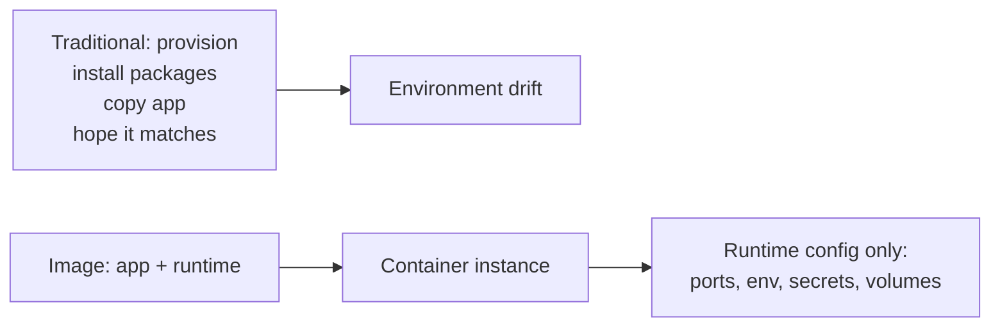
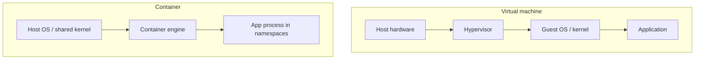
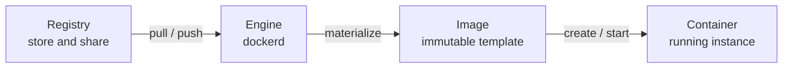
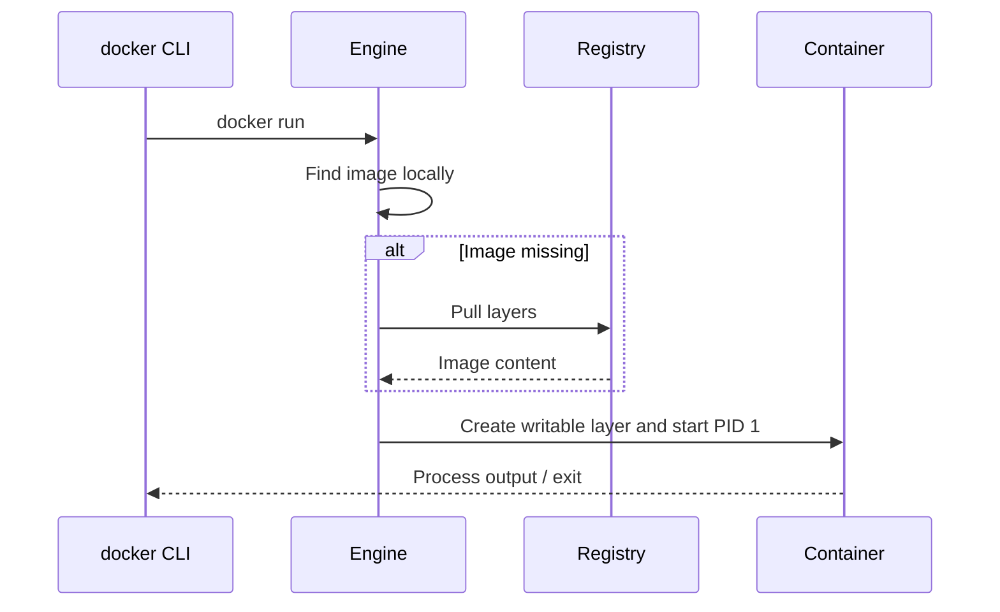
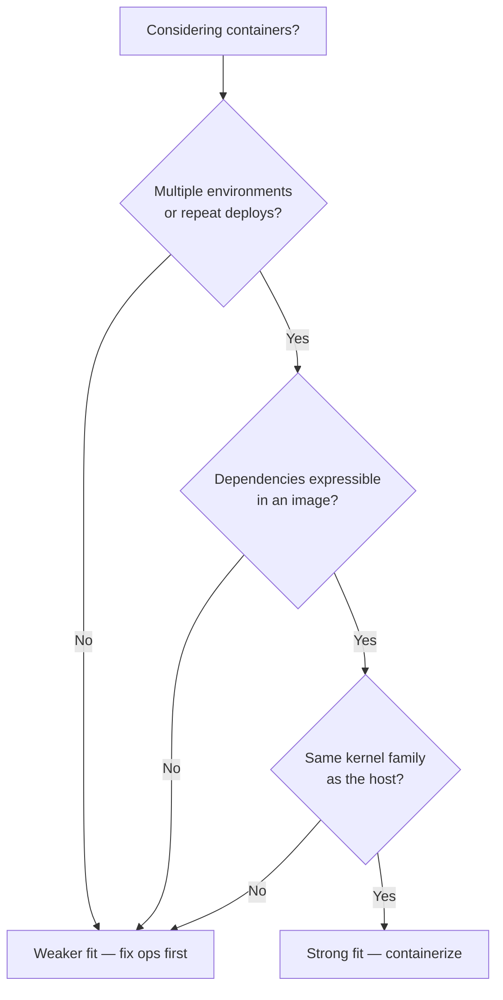

# Chapter 01 — Docker: Why and What

> **Learning Objectives**
>
> By the end of this chapter, you will be able to:
>
> - Explain the “it works on my machine” problem in concrete terms
> - Contrast virtual machines and containers with accurate boundaries
> - Define image, container, registry, and engine in plain language
> - Describe what Docker provides—and what it does not
> - Recognize when containers are a good fit and when they are not

---

## 01.1 Monday Morning, Three Environments

Alex finishes a feature Friday night. On Alex’s laptop the API returns `200 OK`. Monday, the staging server returns `500`. The logs complain about a missing system library. Ops installs the library. Staging works. Production still fails—same library, different *version*. Someone pins the version. Now a cron job on the host breaks because it needed the old one.


*Figure 01.A: Like cargo boxes that move unchanged from truck to ship, container images move apps between machines.*

Nobody was careless. The *unit of deployment* was wrong. The team shipped source code into environments that were each a unique snowflake of OS packages, language runtimes, and side effects.

Containers attack that mismatch: ship the **application plus a known filesystem and process setup**, not “hope the server already has what we need.”

---

## 01.2 The Problem Containers Solve

### In plain terms

Traditional deployment often looks like this:

1. Provision a machine (physical or VM)
2. Install language runtimes, OS packages, and agents
3. Copy application files
4. Configure environment-specific settings
5. Start the process and pray the next machine matches

Drift between steps 2–4 is inevitable. Containers flip the model: build an **image** that already contains the runtime and app, run that image as a **container** on any host with a compatible engine, and configure only the *differences* (ports, env vars, secrets, volumes) at run time.



*Figure 01.1: Containers move dependency soup into a rebuildable image and leave only environment-specific knobs for runtime.*

### Under the hood

The host still matters—kernel version, available resources, and security policy—but the bulk of “dependency soup” moves into a versioned, rebuildable artifact. When you later run:

```bash
$ docker run --rm -p 8080:80 nginx:alpine
```

you are asking an engine to materialize a filesystem from image layers, create isolated namespaces for the process, and start the image’s default command. Chapters 02–05 unpack each of those steps. For now, notice the separation: **image** (what to run) versus **runtime options** (how this instance should behave).

Sample pull output (abbreviated):

```text
Unable to find image 'nginx:alpine' locally
alpine: Pulling from library/nginx
...
Status: Downloaded newer image for nginx:alpine
/docker-entrypoint.sh: Configuration complete; ready for start up
```

### In production

Treat the image as the unit you promote: build once in CI, scan it, push it to a registry, and pull the *same* digest into staging and production. Configuration that differs per environment (URLs, credentials, feature flags) should enter at runtime—not as a rebuilt “prod image” that silently diverges from what you tested.

> 💡 **Tip:** If you cannot answer “which image digest is running in production?”, you do not yet have a reproducible deploy story—even if containers are involved.

---

## 01.3 Virtual Machines vs Containers

### In plain terms

A **virtual machine** is like renting an entire apartment: its own kitchen, plumbing, and front door (a full guest operating system). A **container** is like a locked room in a shared building: private space for your stuff, but you share the building’s foundation (the host kernel).



*Figure 01.2: A VM stacks a guest OS under each app; a container isolates the process on a shared host kernel.*

| Dimension | Virtual machine | Container |
|-----------|-----------------|-----------|
| Isolation unit | Full guest OS | Process + namespaces/cgroups |
| Typical startup | Seconds to minutes | Milliseconds to a few seconds |
| Disk footprint | GBs common | Often tens to hundreds of MBs (base dependent) |
| Kernel | Guest has its own (virtualized) | Shares host kernel |
| Best at | Different OS needs, strong isolation boundaries | Dense packaging of apps with the same kernel family |

### Under the hood

A VM virtualizes hardware. Each guest typically includes a full operating system and, from the guest’s point of view, its own kernel. Hypervisors give strong isolation and flexible OS choices at the cost of heavier startup and larger footprints.

A container virtualizes the *operating system’s user space* using kernel features (on Linux: namespaces, cgroups, and a union filesystem). Containers on one host share the host kernel. Each container gets an isolated view of process IDs, network stack, mount points, and resource limits—but not a second kernel.

Containers and VMs are not enemies. Docker Desktop on Mac and Windows *uses a Linux VM* under the hood to run Linux containers. In cloud platforms you often run containers *inside* VMs for multi-tenant isolation.

### In production

Choose the boundary that matches your threat model. Multi-tenant untrusted workloads often still need VM (or stronger) isolation around groups of containers. Same-team microservices on a controlled cluster usually accept shared-kernel container isolation plus Kubernetes security controls (later chapters). Never assume “container” equals “VM-grade isolation.”

> ⚠️ **Warning:** Calling a container “a lightweight VM” is a common misconception. Kernel exploits and sysctl differences matter because the kernel is shared.

---

## 01.4 Core Vocabulary

Learn these four words thoroughly; everything else is elaboration.



*Figure 01.3: The core vocabulary — registries store images; the engine runs containers created from those images.*

### Image

#### In plain terms

An **image** is an immutable template—like a class definition or a biscuit cutter. You *build* or *pull* images; you do not “log into” an image.

#### Under the hood

An image is layered filesystem snapshots plus metadata: default command, environment, exposed ports, working directory, user, labels, and more. Layers are content-addressed and shared across images and containers when identical.

#### In production

Prefer tags that encode version (`1.4.2`) for humans, and digests (`sha256:…`) for machines that promote artifacts. Treat `latest` as a demo convenience, not a release pin (Chapter 03).

### Container

#### In plain terms

A **container** is a *running* (or stopped) instance created from an image—like an object created from a class, or a biscuit cut from the cutter.

#### Under the hood

A container has a thin writable layer on top of the image layers, its own process tree (from the container’s point of view), and runtime config (name, ports, mounts, env, restart policy). Stopping a container keeps the writable layer; removing it deletes that instance.

#### In production

Prefer disposable cattle over pets. Debug with logs and controlled reproduction; bake lasting fixes into a new image rather than hand-editing a long-lived container.

### Registry

#### In plain terms

A **registry** is a library warehouse for images—Docker Hub, GitHub Container Registry, Amazon ECR, Google Artifact Registry, or a self-hosted registry.

#### Under the hood

You **push** images to share them and **pull** them to run elsewhere. References look like `registry/namespace/repository:tag` or `…@sha256:…`. Authentication, rate limits, and mirroring appear again in later security and CI chapters.

#### In production

Use a private registry (or org namespace) for internal apps. Control who can push, scan on push, and retain digests of what you deployed.

### Engine (Daemon)

#### In plain terms

The **Docker Engine** is the kitchen that actually cooks. The `docker` command is usually a waiter (client) placing orders.

#### Under the hood

`dockerd` is the background service that builds images, runs containers, manages networks and volumes, and speaks the Docker API. Modern engines delegate low-level runtime work to **containerd** and an OCI runtime such as **runc** (Chapter 02).

#### In production

Monitor engine health, disk usage for images and logs, and API exposure. Binding the Docker socket to untrusted workloads is effectively handing out root on the host.

---

## 01.5 What Docker Is (and Is Not)

### In plain terms

**Docker** is a platform—and a set of tools—for building, shipping, and running containers. In day-to-day practice you will use the Docker CLI, the Engine, Dockerfiles, and often Compose for multi-container apps on one host.

### Under the hood

Docker popularized a workflow so strongly that people say “Docker” when they mean “OCI containers.” Under the hood, modern Docker builds and runs images that follow open standards (OCI image and runtime specs). Other tools exist; the concepts transfer.

A first mental model of `docker run`:

1. The client asks the engine for an image
2. If missing locally, the engine **pulls** it from a registry
3. The engine creates a container with a writable layer and network settings
4. Port publishing maps host ports to container ports when requested
5. The image’s default process starts as PID 1 inside the container
6. Flags like `--rm` control cleanup when the process exits



*Figure 01.4: A first mental model of `docker run` — resolve the image, create the instance, start the process.*

### In production

Docker is packaging and a single-host (or Desktop) runtime. It is **not**:

- A full cluster orchestrator (that is Kubernetes, Nomad, Swarm mode, and friends)
- A substitute for application architecture (a messy monolith in a container is still messy)
- Automatic security (privileged containers and root processes are still dangerous)
- A VM replacement for every workload (different kernels, some devices, and specialized hardware need care)

> 📘 **Deep Dive (optional):** The Open Container Initiative (OCI) defines image and runtime specs. Learning OCI vocabulary makes it easier to evaluate alternatives (Podman, containerd directly, nerdctl) without relearning the whole world.

---

## 01.6 When Containers Shine—and When They Do Not

### In plain terms

Containers excel when you deploy the same app across environments, need dense packing of many services, want immutable artifacts (build once, promote the image), practice clear process boundaries, or care about reproducible CI.

They are a weaker fit when you need a different kernel than the host provides, depend on highly specialized host devices without container support, only ever run one long-lived pet server with no repeat deploys, or face policies that forbid container runtimes.



*Figure 01.5: A quick fitness check before containerizing everything — packaging wins when environments repeat and the kernel matches.*

### Under the hood

Fit often tracks isolation and packaging needs:

| Strong fit | Weaker fit |
|------------|------------|
| Stateless or carefully stateful services with volumes | Kernel modules or custom kernels |
| Microservices with clear process boundaries | Desktop GUI apps (possible, not the focus here) |
| CI jobs that must match production shape | One-off scripts on a single laptop with no handoff |
| Horizontal scale of identical replicas | Workloads forbidden by policy from using container runtimes |

### In production

Do a short fitness check before containerizing everything: Will multiple environments run this? Can we express dependencies in an image? Do we have a plan for logs, health, and data? If the answer is “no” three times, fix those first—or accept that containers alone will not deliver the win.

---

## 01.7 Common Pitfalls

> ⚠️ **Common Pitfall:** Calling a container “a lightweight VM.”  
> It shares the host kernel. Isolation is strong for many app threats, not identical to a VM boundary.

> ⚠️ **Common Pitfall:** Assuming one container equals one “server with SSH.”  
> Prefer one main process per container and treat containers as disposable. Debug with `docker logs` and `docker exec` (or `docker debug` where available), not by SSHing in to customize by hand.

> ⚠️ **Common Pitfall:** Equating “uses Docker” with “is cloud-native / production-ready.”  
> Docker is packaging. Production still needs limits, health checks, secrets hygiene, and an operational plan (later chapters).

> ⚠️ **Common Pitfall:** Confusing “image” with “container.”  
> You build and pull images; you start, stop, and remove containers. Mixing the words leads to confusing cleanup and tagging mistakes.

---

## 01.8 Hands-On Exercises

1. Write down three environment differences that have bitten you (or a team you know): library versions, OS packages, env vars, timezone, locale, language runtime version, and so on. Mark which would live inside an *image* versus which are pure *runtime config*.
2. In your own words, complete: “An image is ____; a container is ____.” Limit each blank to one sentence.
3. Read Docker’s official [What is a container?](https://docs.docker.com/get-started/docker-concepts/the-basics/what-is-a-container/) page. List two phrases that match this chapter and one that is new to you.
4. (Optional if Docker is already installed) Run `docker version` and note Client versus Server sections. If Server is missing, installation is incomplete—jump to Chapter 02.

---

## 01.9 Check Your Understanding

**Q1.** Why can two containers on the same Linux host be much lighter than two VMs?

<details>
<summary>Show answer</summary>

They share the host kernel and typically reuse image layers on disk. VMs usually each carry a full guest OS and virtualize more of the hardware stack.

</details>

**Q2.** Is a stopped container the same thing as an image?

<details>
<summary>Show answer</summary>

No. An image is the immutable template. A stopped container is an *instance* that still has its own writable layer and runtime metadata; it can be started again unless removed.

</details>

**Q3.** Where do shared images usually live so other machines can pull them?

<details>
<summary>Show answer</summary>

In a container registry (for example Docker Hub or a private registry).

</details>

**Q4.** Name one thing Docker does *not* automatically solve for you.

<details>
<summary>Show answer</summary>

Any of: cluster multi-host scheduling, application design quality, secrets discipline, or security hardening. Docker packages and runs containers; production practices are still your responsibility.

</details>

---

## 01.10 Key Takeaways

- Containers reduce environment drift by packaging the app with its dependency filesystem.
- VMs virtualize hardware; containers isolate processes using shared-kernel OS features.
- Master the quartet: **image**, **container**, **registry**, **engine**.
- Docker is the popular toolkit for that workflow—not magic, not a full orchestrator.
- Use containers for portable, repeatable app deployment; know their isolation limits.

---

## 01.11 Official documentation map

| Topic | Official page |
|-------|---------------|
| Get started overview | [Get started](https://docs.docker.com/get-started/) |
| What is a container? | [What is a container?](https://docs.docker.com/get-started/docker-concepts/the-basics/what-is-a-container/) |
| What is an image? | [What is an image?](https://docs.docker.com/get-started/docker-concepts/the-basics/what-is-an-image/) |
| Docker Engine | [Engine overview](https://docs.docker.com/engine/) |
| OCI / container concepts (Docker blog/docs hub) | [Container docs hub](https://docs.docker.com/get-started/docker-concepts/) |

**Previous:** [Preface](00-preface.md) | **Next:** [Chapter 02 — Installation and Architecture](02-docker-installation-and-architecture.md)
