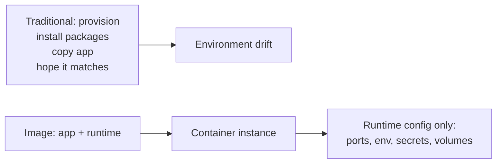
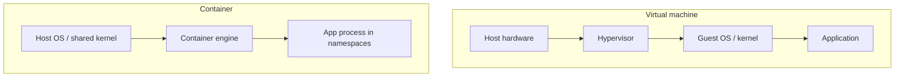
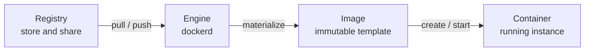
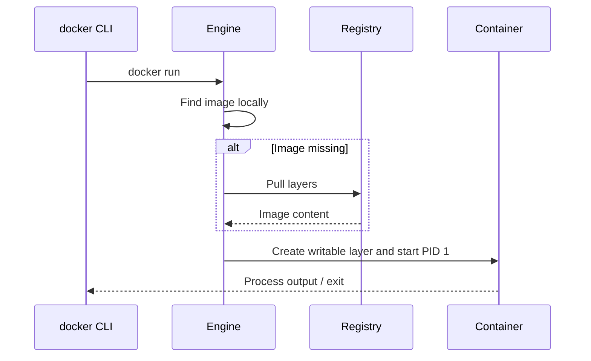
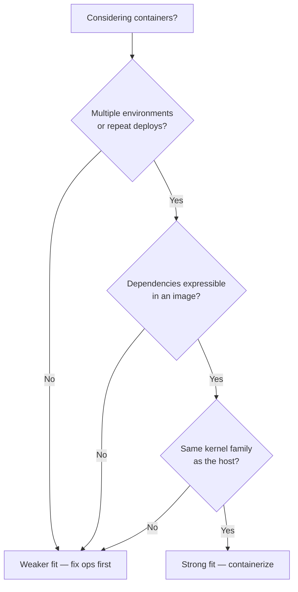

# Chapter 01 — Docker: Why and What

> **Learning Objectives**
>
> By the end of this chapter, you will be able to:
>
> - Explain the “it works on my machine” problem with a real example
> - Say how virtual machines and containers differ, and where each one stops
> - Define image, container, registry, and engine in your own words
> - Describe what Docker gives you—and what it leaves for you to do
> - Decide when containers fit a job, and when they do not

---

## 01.1 Monday Morning, Three Environments

Alex finishes a feature on Friday night. On Alex’s laptop the API answers `200 OK`. Every test passes. Alex goes home happy.

Monday morning, the staging server answers `500` instead. The logs blame a missing system library. Ops installs the library, and staging starts working.

Production still fails. It has the same library, but a different *version*. Someone pins the version to match staging. Now a scheduled job on that same server breaks, because it needed the old version.


*Figure 01.A: Like cargo boxes that move unchanged from truck to ship, container images move apps between machines.*

Nobody on this team was careless. The wrong thing was the **unit of deployment**—the package a team actually hands to a server. Alex’s team handed over source code alone.

Every machine that received that code had been set up by hand over the years. Each one had its own mix of operating system packages, language versions, and leftover settings. Engineers call such a machine a **snowflake**, because no two are alike and nobody can rebuild one exactly.

Containers attack that mismatch directly. You ship the **application plus a known set of files and a known startup command**. You stop hoping the server already has what your app needs.

---

## 01.2 The Problem Containers Solve

### In plain terms

A **container** is one app running from its own private, pre-packed set of files, isolated from the rest of the machine. The pre-packed files come from an **image**, which is the recipe and the ingredients saved together as one downloadable artifact.

You should care because of the alternative. Without containers, you install the app’s needs onto the machine by hand, one machine at a time. Traditional deployment often looks like this:

1. Provision a machine (physical or virtual)
2. Install language runtimes, OS packages, and agents
3. Copy application files
4. Configure environment-specific settings
5. Start the process and hope the next machine matches

Steps 2 through 4 drift apart over time. **Drift** means two machines that should be identical slowly stop being identical. Each environment collects one-off fixes: “just this OpenSSL,” “just that locale,” “just bump Node on staging.” After a year, nobody can rebuild production from scratch.

That is the real lesson of the Monday-morning story in §01.1. It was not bad luck. It is what happens when you ship source code onto hand-built hosts.

Containers flip the order of work. You build an **image** that already holds the app and everything it runs on. You run that image as a **container** on any machine with a compatible engine. Then you set only the *differences* at start time: ports, environment variables, secrets, and storage.

Think of it like a food truck versus a rented kitchen. The rented kitchen might have the pans you need, or it might not. The food truck brings its own. The image is the food truck; the host machine just supplies power and a parking space—a kernel and some CPU and memory.



*Figure 01.1: Containers move dependency soup into a rebuildable image and leave only environment-specific knobs for runtime.*

The image becomes the one thing you test, scan for security problems, and move forward to production. The host still gives you a kernel and resources. It stops being a mystery box of packages nobody documented.

> 💡 **In one line:** An image is a packed-up app you can copy anywhere; a container is that image actually running as an isolated process on a machine.

> ⚠️ **Common Pitfall:** You might think containers “remove environment differences entirely.” They do not. The kernel version, the memory and CPU limits, DNS settings, certificates handed in at start time, and the contents of attached storage still differ between machines. Containers shrink *dependency drift*. They do not abolish operations work.

### Under the hood

Here is what actually happens on the machine. The host still matters—kernel version, available resources, and security policy—but the bulk of the “dependency soup” now lives inside a versioned artifact you can rebuild on demand. When you later run:

```bash
$ docker run --rm -p 8080:80 nginx:alpine
```

you are asking an engine to do three things: build the container’s filesystem out of the image’s stored layers (**materialize** them), give the process its own isolated view of the system, and start the command the image was built to run. Chapters 02–05 unpack each step. For now, notice the split: the **image** says *what* to run, and the **runtime options** say *how this one instance* should behave.

Sample pull output (abbreviated):

```text
Unable to find image 'nginx:alpine' locally
alpine: Pulling from library/nginx
...
Status: Downloaded newer image for nginx:alpine
/docker-entrypoint.sh: Configuration complete; ready for start up
```

**What breaks if you still install app libraries on the host “just in case”:** you bring the snowflake back. Two hosts drift apart again, the image is no longer the full story, and every debugging session starts with “is it the image or the host package?” Bake dependencies into the image and keep the host lean.

### In production

**Ownership:** app teams own what goes inside the application image. Platform teams own the engine baseline and the registry rules. Both sides share one promise: the exact artifact that left CI is the artifact staging and production pull.

Treat the image as the unit you move forward. Build it once in CI, scan it, push it to a registry, and pull the *same* digest into staging and production. A **digest** is a `sha256:…` fingerprint of exact image content, so two identical digests are guaranteed to be identical bytes. Settings that differ per environment—URLs, credentials, feature flags—should arrive when the container starts, not as a rebuilt “prod image” that quietly differs from the one you tested.

**Failure mode:** staging runs `myapp:1.4.2` built Monday; production “uses the same tag” rebuilt Thursday on a different base patch. **Detect:** compare digests (`RepoDigests` / deploy manifests), not tag strings. **Mitigate:** promote by digest; ban floating tags in prod deploy configs.

> 🏭 **Production floor:** If you cannot answer “which image digest is running in production?”, you do not yet have a reproducible deploy story—even if containers are involved. Paste digest + change ticket into the incident notes before debating application code.

**Do:** build once, promote the digest. **Don’t:** rebuild “the same Dockerfile” separately per environment and call them identical.

**Before you leave this section**

- **Understand:** Containers move dependency soup into a rebuildable image; runtime config stays outside.
- **Try:** Run `docker run --rm -p 8080:80 nginx:alpine` and hit the published port once Docker is installed (Chapter 02).
- **Watch in prod:** Tag-only deploys with no recorded digest.

---

## 01.3 Virtual Machines vs Containers

### In plain terms

A **virtual machine**, or VM, is a whole fake computer running inside a real one, complete with its own operating system. A container is only an isolated process on the operating system that is already there.

Why should you care about the difference? Because it decides how many workloads fit on one server, how fast they start, and how well one workload is walled off from the next. Those three answers drive most cost and security conversations.

Here is the analogy. A VM is like renting an entire apartment: your own kitchen, your own plumbing, your own front door. A container is like a locked room in a shared building. You get private space for your things, but you share the building’s foundation and pipes—the **kernel**, which is the part of the operating system that talks to hardware.

That picture also answers the density question teams argue about. Ten apartments mean ten kitchens. Ten hotel rooms share one boiler room. Containers pack tighter because each one does not carry its own kernel and its own full set of operating system files.

The trade-off is isolation. A broken pipe in the shared foundation can reach every room. Kernel bugs, hostile system calls, and over-generous permissions matter more when everyone shares one kernel.

> 💡 **In one line:** A VM copies the whole computer; a container copies only the app’s files and borrows the host’s kernel.



*Figure 01.2: A VM stacks a guest OS under each app; a container isolates the process on a shared host kernel.*

| Dimension | Virtual machine | Container |
|-----------|-----------------|-----------|
| Isolation unit | Full guest OS | Process + namespaces/cgroups |
| Typical startup | Seconds to minutes | Milliseconds to a few seconds |
| Disk footprint | GBs common | Often tens to hundreds of MBs (base dependent) |
| Kernel | Guest has its own (virtualized) | Shares host kernel |
| Best at | Different OS needs, strong isolation boundaries | Dense packaging of apps with the same kernel family |

> ⚠️ **Common Pitfall:** Calling a container “a lightweight VM.” Because the kernel is shared, kernel exploits and kernel tuning settings (`sysctl`) reach across containers. “Lightweight” describes how densely you can pack them, not how strong the wall is.

### Under the hood

Here is what actually happens on the machine. A VM fakes the hardware itself. Each guest usually carries a full operating system and believes it has its own kernel. The **hypervisor**, the software that creates and supervises VMs, gives you strong isolation and free choice of operating system. You pay for that with slower startup and much larger disk use.

A container fakes only the *user space*—everything above the kernel—using features the Linux kernel already provides: **namespaces** (separate views of processes, network, and mounts), **cgroups** (limits on CPU, memory, and other resources), and a union filesystem that stacks image layers into one view. Every container on a host shares that host’s kernel. Each container sees its own process IDs, network stack, mount points, and resource limits, but never a second kernel.

```bash
$ docker run --rm alpine uname -r
```

```text
6.x.x-...   # the *host* (or Desktop VM) kernel, not a guest kernel baked into Alpine
```

**What breaks if you need a different kernel family than the host provides:** Linux containers will not give you a Windows kernel (or vice versa) on that host. You need a VM (or a different node pool) with the right kernel. Docker Desktop on Mac and Windows *uses a Linux VM* under the hood to run Linux containers—containers and VMs cooperate rather than compete.

In cloud platforms you often run containers *inside* VMs for multi-tenant isolation: VMs separate tenants; containers pack services densely inside a tenant’s boundary.

### In production

**Ownership:** the security and platform teams set the isolation bar—whether a shared kernel is acceptable, or every tenant needs its own VM or sandbox. App teams then pick packaging (containers) inside that bar.

Choose the boundary that matches the threat you actually face. Untrusted code from many different customers usually still needs VM-level isolation, or stronger, wrapped around groups of containers. Microservices owned by one company on a controlled cluster usually accept shared-kernel isolation plus the Kubernetes security controls covered in later chapters.

**Failure mode:** a privileged container or kernel exploit affects neighbors on the same node. **Detect:** runtime security alerts, unexpected host-level changes, noisy-neighbor CPU/memory on the node. **Mitigate:** drop capabilities, avoid privileged mode, separate trust tiers onto different node pools or VMs, keep engines patched.

**Do:** document whether a workload is “same-tenant shared kernel” or “needs stronger isolation.” **Don’t:** assume “we use containers” means PCI/multi-tenant isolation is solved.

> 🏭 **Production floor:** Never put mutually untrusted tenants on the same shared-kernel node without an explicit security review. Blast radius of a container breakout is “every workload on that kernel,” not “just this app.”

**Before you leave this section**

- **Understand:** VMs virtualize hardware (own kernel); containers isolate processes on a shared kernel.
- **Try:** After install, run `docker run --rm alpine uname -r` and compare to the host/Desktop kernel story in Chapter 02.
- **Watch in prod:** Privileged containers and mixed-trust workloads on one node pool.

---

## 01.4 Core Vocabulary

Four words carry most of this book: image, container, registry, and engine. Learn them well. Almost everything later is detail added on top.



*Figure 01.3: The core vocabulary — registries store images; the engine runs containers created from those images.*

### Image

#### In plain terms

An **image** is a read-only package that holds an app and every file it needs to start. It never changes after it is built; the word for that is **immutable**.

Why care? Because an image gives you repeatability. The same bytes—ideally checked by the same digest—should start the same way on every machine that can run them. That is what makes “build once, run anywhere with the same engine” true instead of a slogan.

Think of a biscuit cutter, or a class definition in code. The cutter shapes the biscuits, but you never eat the cutter. You *build* images or *pull* them from a registry. You do not log into an image.

You might picture an image as “the running app.” It is not. An image just sits on disk until an engine creates a container from it. Mixing up the two words is how people end up trying to SSH into images, making a mess of tags, and deleting the wrong thing during cleanup.

> ⚠️ **Common Pitfall:** Saying “I restarted the image.” You restart a *container*. You rebuild or re-pull an *image*.

#### Under the hood

Here is what actually happens on the machine. An image is a stack of filesystem snapshots (**layers**) plus metadata: default command, environment, exposed ports, working directory, user, labels, and more. Layers are content-addressed, meaning each one is named by a hash of its contents, so identical layers are stored once and shared across images and containers.

```bash
$ docker image ls
$ docker inspect nginx:alpine --format 'ID={{.Id}} Digests={{json .RepoDigests}} Cmd={{json .Config.Cmd}}'
```

**What breaks if you treat a movable tag as identity:** a **tag** is only a label someone can repoint at any time, so yesterday’s `myapp:prod` is not today’s `myapp:prod`. CI and production can be running different code while everyone insists they deployed “the same tag.”

#### In production

**Ownership:** app teams own image contents and tags. The platform team owns how long the registry keeps images, which security scans must pass, and which digests are allowed into production.

Use tags that carry a version number (`1.4.2`) for humans, and digests (`sha256:…`) for the systems that move artifacts forward. Treat `latest` as a demo convenience, never as a release pin (Chapter 03).

**Do:** record digests in release notes or GitOps. **Don’t:** promote only `:latest` or a floating `:prod` tag.

### Container

#### In plain terms

A **container** is one instance created from an image, either running or stopped. If the image is the biscuit cutter, the container is the biscuit.

Why care? Because the container is the thing that can be replaced without ceremony. You can start ten of them from one image, kill any of them, and start fresh ones in seconds. That is what makes scaling and quick rollback possible.

Each container gets a thin **writable layer**—scratch space stacked on top of the read-only image, where any file the app changes is stored. It also gets its own runtime settings and its own tree of processes. Stopping a container keeps that writable layer. Removing the container deletes it.

The common misconception is that a container is a small VM you keep tweaking forever. Healthy teams treat containers as cattle, not pets: interchangeable, replaceable, never hand-fed. Editing a long-lived container by hand creates a pet that nobody can rebuild from scratch.

> 💡 **In one line:** A container is one disposable, running copy of an image, plus a scratch layer that dies with it.

> ⚠️ **Common Pitfall:** Installing packages with `docker exec` and calling the problem fixed. The next instance that replaces this one will not have those packages. Bake the fix into a new image.

#### Under the hood

Here is the whole lifecycle in four commands:

```bash
$ docker create --name demo nginx:alpine
$ docker start demo
$ docker ps --filter name=demo
$ docker rm -f demo
```

**What breaks if you remove an image while containers still reference it:** `docker rmi` refuses (or you force it and strand yourself with containers pointing at nothing). Remove or recreate the containers first. Use `docker ps -a` to see which containers still point at the image.

#### In production

**Ownership:** whoever deploys owns the container’s runtime flags—ports, environment variables, and resource limits. The image owner owns what is inside.

Keep containers disposable. Debug with logs and by reproducing the fault on purpose. Put lasting fixes into a new image instead of editing a long-lived container by hand.

**Failure mode:** snowflake container that only works on one host. **Detect:** “works after exec install” but fails on fresh `docker run`. **Mitigate:** rebuild image; redeploy clean instances.

### Registry

#### In plain terms

A **registry** is a server that stores images so other machines can download them. Docker Hub, GitHub Container Registry, Amazon ECR, and Google Artifact Registry are registries, and you can also run your own.

Why care? Because without a registry, an image lives only on the laptop that built it. That is fine for a demo and fatal for a team. The registry is how the artifact you built travels to CI, to staging, and to every production node.

Picture a library warehouse. Anyone with a card can borrow a copy, and every copy is identical to the one on the shelf.

> ⚠️ **Common Pitfall:** Treating anonymous Docker Hub pulls as an unlimited free download service for CI. Pull limits and flaky networks turn into outages. Log in for pulls and keep a local cache or mirror.

#### Under the hood

Here is what actually happens on the machine. You **push** an image to share it and **pull** an image to run it somewhere else. A reference looks like `registry/namespace/repository:tag`, or `…@sha256:…` when you name the exact digest. Authentication, pull limits, and mirroring come back in the later security and CI chapters.

```bash
$ docker pull python:3.12-slim
$ docker tag python:3.12-slim registry.example.com/team/python:3.12-slim
# $ docker push registry.example.com/team/python:3.12-slim   # when you have a registry
```

**What breaks if registry credentials expire in the middle of a deploy:** nodes cannot download the image. New replicas sit in `ImagePullBackOff` on Kubernetes, or fail to be created on Docker. Rotate and monitor the credentials used for *pulls*, not just the ones used for pushes.

#### In production

**Ownership:** platform and security own registry policy. App teams own the repositories for their own services.

Use a private registry, or at least your organization’s namespace, for internal apps. Control who may push, scan every image on push, and keep a record of the digests you deployed.

### Engine (Daemon)

#### In plain terms

The **Docker Engine** is the background program that does the real work of building images and running containers.

Why care? Because the `docker` command you type is not the thing doing the work. It only sends requests. When something “does not work,” knowing which half is broken saves you an hour.

The engine is the kitchen that actually cooks. The `docker` command is the waiter taking your order to that kitchen. If the kitchen is closed, the menu still looks perfectly fine—and every order fails. Chapter 02 takes this split apart in detail.

#### Under the hood

Here is what actually happens on the machine. `dockerd` is the background service that builds images, runs containers, manages networks and volumes, and answers the Docker API. Modern engines hand the low-level work of starting a process to **containerd** and to an OCI runtime such as **runc** (Chapter 02).

```bash
$ docker version
$ docker info
```

**What breaks if untrusted workloads reach the Docker socket:** the **socket** is the file the CLI uses to talk to the engine, so anything that can write to it can start a fully privileged container and usually become root on the host. Mounting the socket is the same as handing out root.

#### In production

**Ownership:** the platform team owns engine installation, upgrades, and who can reach the socket. Developers own images and container settings within that policy.

Watch engine health, disk usage for images and logs, and who can reach the API.

**Do:** restrict who can talk to the socket, and monitor disk. **Don’t:** mount `docker.sock` into app containers “for convenience.”

**Before you leave this section**

- **Understand:** Image = template; container = instance; registry = warehouse; engine = runtime kitchen.
- **Try:** Write one sentence each for the four terms without looking back.
- **Watch in prod:** Socket mounts into app containers; tag-only identity with no digests.

---

## 01.5 What Docker Is (and Is Not)

### In plain terms

**Docker** is a set of tools for building, shipping, and running containers. Day to day you will use four of them: the `docker` command line, the Engine, **Dockerfiles** (text files that describe how to build an image), and often **Compose** (a tool for running several containers together on one machine).

Why care about the name? Because “Docker” gets used loosely, and that vagueness hides what you still have to do yourself. Docker gives you packaging and a way to run things. It does not give you a running platform.

Docker did not invent container isolation. The Linux kernel features already existed. What Docker did was make one clear workflow popular: Dockerfile, then image, then registry, then `docker run`. Suddenly teams could share a portable unit instead of inventing a new packaging ritual every quarter.

> ⚠️ **Common Pitfall:** Reading “we use Docker” as “we are cloud-native and production-ready.” Docker is packaging plus a way to run containers. Production still needs resource limits, health checks, careful secret handling, digests, and a plan for operating the thing.

### Under the hood

Here is what actually happens on the machine. Docker made its workflow so popular that people say “Docker” when they really mean “OCI containers.” **OCI**, the Open Container Initiative, is the group that writes the open standards for image format and runtime behavior. Modern Docker builds and runs images that follow those standards, so other tools can read the same images and the concepts carry over.

A first mental model of `docker run`:

1. The client asks the engine for an image
2. If missing locally, the engine **pulls** it from a registry
3. The engine creates a container with a writable layer and network settings
4. Port publishing maps host ports to container ports when requested
5. The image’s default process starts as PID 1 inside the container
6. Flags like `--rm` control cleanup when the process exits



*Figure 01.4: A first mental model of `docker run` — resolve the image, create the instance, start the process.*

```bash
$ docker run --rm hello-world
```

```text
Hello from Docker!
This message shows that your installation appears to be working correctly.
...
```

**What breaks if the daemon cannot reach the registry:** step 2 fails. You get pull, TLS, or timeout errors instead of an application stack trace. Check the network and your credentials before you start rewriting the app.

### In production

**Ownership:** developers own Dockerfiles and application images. The platform team owns Engine and Desktop versions, registry integration, and the list of approved base images.

Docker is packaging plus a way to run containers on one machine. It is **not**:

- A full cluster orchestrator (that is Kubernetes, Nomad, Swarm mode, and friends)
- A substitute for application architecture (a messy monolith in a container is still messy)
- Automatic security (privileged containers and root processes are still dangerous)
- A VM replacement for every workload (different kernels, some devices, and specialized hardware need care)

**Failure mode:** treating Docker Desktop on a laptop as if it were the production layout. **Detect:** “works on my Mac,” with folder mounts and published ports that behave differently on Linux CI or in a cluster. **Mitigate:** run CI on Linux machines that match the production CPU architecture, promote by digest, and learn orchestration on its own (Part II).

**Do:** use Docker to standardize the artifact. **Don’t:** stop at `docker run` on one VM and call the platform finished.

> 📘 **Deep Dive (optional):** The Open Container Initiative (OCI) defines image and runtime specs. Learning OCI vocabulary makes it easier to evaluate alternatives (Podman, containerd directly, nerdctl) without relearning the whole world.

**Before you leave this section**

- **Understand:** Docker popularized a packaging workflow; it is not an orchestrator or a security free lunch.
- **Try:** Sketch the six `docker run` steps from memory, then check Figure 01.4.
- **Watch in prod:** Laptop-only success used as proof that production topology is fine.

---

## 01.6 When Containers Shine—and When They Do Not

### In plain terms

Containers are a tool with a shape, and not every job has that shape. This section is the honest fit check.

Why care? Because forcing the wrong workload into a container costs you weeks and gives back nothing. Knowing the boundary early is cheaper than discovering it during a migration.

Containers work well when you deploy the same app to several environments, pack many services onto shared machines, want an unchanging artifact you build once and promote, keep clear boundaries between processes, or need CI runs that match production.

They fit poorly when you need a different kernel than the host runs, when you depend on unusual hardware the container cannot reach, when you run exactly one long-lived hand-tuned server that is never redeployed, or when policy forbids container runtimes outright.

The real question is not “are containers cool?” It is “does packaging plus shared-kernel isolation fix *our* pain?” One hand-tuned server with no second environment gets ceremony and no payoff. Monday-morning drift across five environments is exactly the pain containers were built for.



*Figure 01.5: A quick fitness check before containerizing everything — packaging wins when environments repeat and the kernel matches.*

> ⚠️ **Common Pitfall:** Containerizing everything on day one—a desktop GUI tool, a kernel module workflow, a one-off laptop script—and then blaming Docker when the fit was wrong from the start.

### Under the hood

Fit usually follows two questions: how much isolation you need, and whether the dependencies can be packed into an image.

| Strong fit | Weaker fit |
|------------|------------|
| Stateless or carefully stateful services with volumes | Kernel modules or custom kernels |
| Microservices with clear process boundaries | Desktop GUI apps (possible, not the focus here) |
| CI jobs that must match production shape | One-off scripts on a single laptop with no handoff |
| Horizontal scale of identical replicas | Workloads forbidden by policy from using container runtimes |

```bash
# Strong-fit smoke: same image name runs the same way after a rebuild/pull
$ docker run --rm -p 8080:80 nginx:alpine
```

**What breaks if you force the wrong workload into a container:** you end up running everything in privileged mode, mounting the whole machine into the container, or putting every service on the host network. You keep all the complexity of containers and throw away the isolation you were paying for.

### In production

**Ownership:** architecture and platform decide whether a workload should be containerized. App teams then do the work inside the approved pattern.

Run a short fit check first. Will more than one environment run this? Can the dependencies live inside an image? Is there a plan for logs, health checks, and data? Three “no” answers mean you fix those things first, or accept that containers alone will not pay off.

**Failure mode:** a “containerized” monolith that still needs packages installed on the node by hand and still uses host networking. **Detect:** runbooks that say “also install X on the node.” **Mitigate:** either finish moving the dependencies into the image, or leave the workload on VMs until the plan is real.

**Do:** containerize repeatable services with clear process boundaries. **Don’t:** treat “a Dockerfile exists” as proof that the fit is right.

**Before you leave this section**

- **Understand:** Containers shine for repeatable, same-kernel-family app packaging—not for every workload.
- **Try:** Apply Figure 01.5 to one app you know and write the yes/no answers down.
- **Watch in prod:** Services that still need special host packages after “containerization.”

---

## 01.7 Common Pitfalls

> ⚠️ **Common Pitfall:** Calling a container “a lightweight VM.”  
> It shares the host kernel. Isolation is strong for many app threats, not identical to a VM boundary.

> ⚠️ **Common Pitfall:** Assuming one container equals one “server with SSH.”  
> Prefer one main process per container and treat containers as disposable. Debug with `docker logs` and `docker exec` (or `docker debug` where available), not by SSHing in to customize by hand.

> ⚠️ **Common Pitfall:** Equating “uses Docker” with “is cloud-native / production-ready.”  
> Docker is packaging. Production still needs limits, health checks, secrets hygiene, and an operational plan (later chapters).

> ⚠️ **Common Pitfall:** Confusing “image” with “container.”  
> You build and pull images; you start, stop, and remove containers. Mixing the words leads to confusing cleanup and tagging mistakes.

---

## 01.8 Hands-On Exercises

1. Write down three environment differences that have bitten you (or a team you know): library versions, OS packages, env vars, timezone, locale, language runtime version, and so on. Mark which would live inside an *image* versus which are pure *runtime config*.
2. In your own words, complete: “An image is ____; a container is ____.” Limit each blank to one sentence.
3. Read Docker’s official [What is a container?](https://docs.docker.com/get-started/docker-concepts/the-basics/what-is-a-container/) page. List two phrases that match this chapter and one that is new to you.
4. (Optional if Docker is already installed) Run `docker version` and note Client versus Server sections. If Server is missing, installation is incomplete—jump to Chapter 02.

---

## 01.9 Check Your Understanding

**Q1.** Why can two containers on the same Linux host be much lighter than two VMs?

<details>
<summary>Show answer</summary>

They share the host kernel and typically reuse image layers on disk. VMs usually each carry a full guest OS and virtualize more of the hardware stack.

</details>

**Q2.** Is a stopped container the same thing as an image?

<details>
<summary>Show answer</summary>

No. An image is the immutable template. A stopped container is an *instance* that still has its own writable layer and runtime metadata; it can be started again unless removed.

</details>

**Q3.** Where do shared images usually live so other machines can pull them?

<details>
<summary>Show answer</summary>

In a container registry (for example Docker Hub or a private registry).

</details>

**Q4.** Name one thing Docker does *not* automatically solve for you.

<details>
<summary>Show answer</summary>

Any of: cluster multi-host scheduling, application design quality, secrets discipline, or security hardening. Docker packages and runs containers; production practices are still your responsibility.

</details>

---

## 01.10 Key Takeaways

- Ship the app **with its files**, not just the source code. That is what kills environment drift.
- **Image = the package. Container = the package running.** Never swap the two words.
- A **VM brings its own kernel. A container borrows the host’s.** That is the whole difference.
- **Registry = where images live** so other machines can pull them. **Engine = what actually runs them.**
- Docker is packaging plus a runtime—**not** an orchestrator, and **not** security for free.
- Promote by **digest**, not by tag. A tag can be repointed; a digest cannot.
- Containers fit repeatable, same-kernel apps. If you need another kernel, use a VM.

---

## 01.11 Official documentation map

| Topic | Official page |
|-------|---------------|
| Get started overview | [Get started](https://docs.docker.com/get-started/) |
| What is a container? | [What is a container?](https://docs.docker.com/get-started/docker-concepts/the-basics/what-is-a-container/) |
| What is an image? | [What is an image?](https://docs.docker.com/get-started/docker-concepts/the-basics/what-is-an-image/) |
| Docker Engine | [Engine overview](https://docs.docker.com/engine/) |
| OCI / container concepts (Docker blog/docs hub) | [Container docs hub](https://docs.docker.com/get-started/docker-concepts/) |

**Previous:** [Preface](00-preface.md) | **Next:** [Chapter 02 — Installation and Architecture](02-docker-installation-and-architecture.md)
