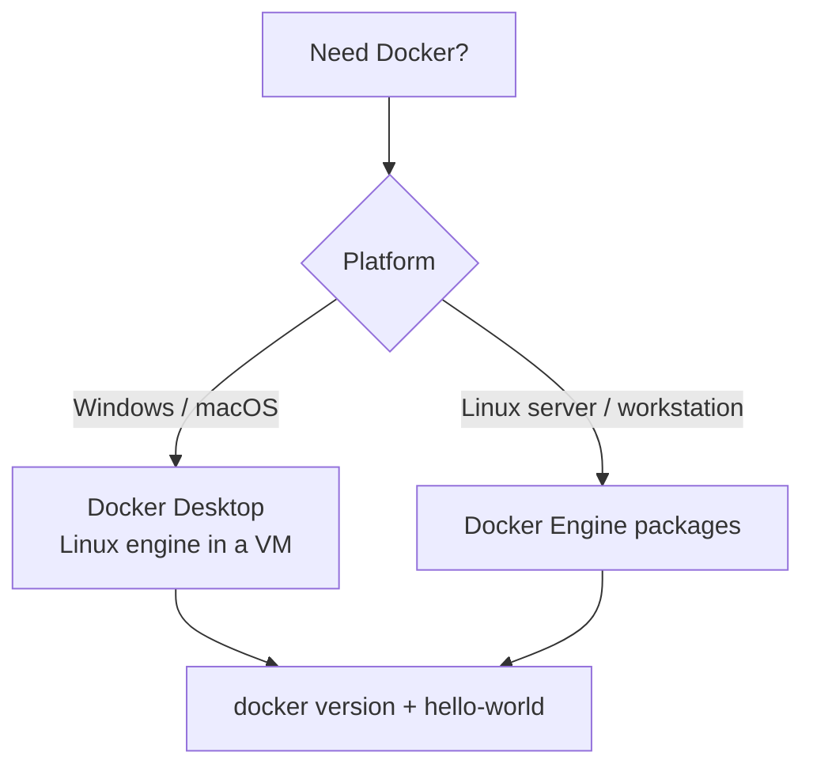
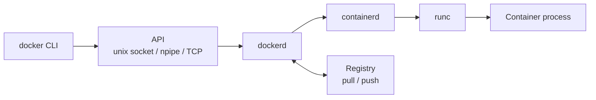
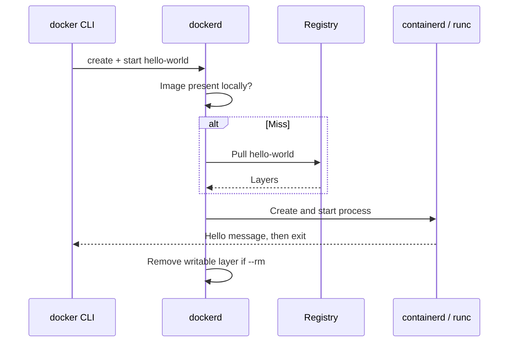
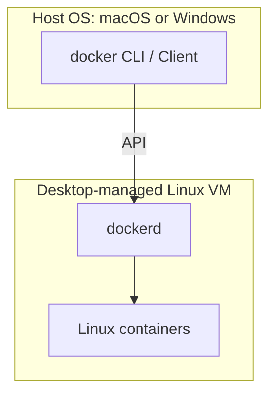

# Chapter 02 — Docker Installation and Architecture

> **Learning Objectives**
>
> By the end of this chapter, you will be able to:
>
> - Install Docker on your computer and check that the engine answers
> - Tell apart the Docker client, the engine (`dockerd`), containerd, and runc
> - Follow what happens, step by step, when you run a simple container
> - Read `docker version` and `docker info` and know what to look for
> - Spot the differences between Docker Desktop and Engine on Linux

---

## 02.1 The Restaurant Kitchen

Picture a restaurant. You sit at a table and give your order to a waiter. The waiter is the **client**—the `docker` command you type.

The waiter carries the order to the kitchen. The kitchen is the **engine**, also called the **daemon**, a program that runs quietly in the background all day. The kitchen follows recipes (**images**) and sends out plates (**containers**).

Customers never walk in and use the stove themselves. They ask the waiter. Docker works the same way.


*Figure 02.A: The Docker client is the waiter; the daemon is the kitchen that actually cooks.*

If the kitchen is closed, the waiter still smiles and takes your order. No food ever arrives. That is exactly what a beginner sees when Docker Desktop was installed but never started: the `docker` command runs, and every request fails.

This chapter opens the kitchen and shows you the floor plan.

Two things should be true when you finish. First, `docker version` shows a **Server** section running Engine **29.x**, or a Desktop version that ships that engine. Second, you can describe a failure precisely: daemon down, pull failed, create failed, start failed, or the app exited. Naming the step is the difference between guessing and debugging.

> ⚠️ **Common Pitfall:** You might think reinstalling Desktop is the first fix for every error. Instead, check three things: is the daemon running, which context is active, and did the image fail to download or did the app itself exit? Reinstalling is a last resort, not step one.

---
## 02.2 Installation Paths

### In plain terms

There are two normal ways to get Docker: **Docker Desktop**, an app with a graphical window, and **Docker Engine**, the plain background service you install on a Linux machine.

Why does the choice matter? Both give you the same `docker` command talking to the same kind of Linux engine, so your commands work either way. The difference is what surrounds it. Desktop wraps the engine in a virtual machine it manages for you and adds a window with settings. Engine on Linux is leaner and is what real servers run.

The goal here is not picking a nicer logo. The goal is a Linux engine your commands can actually reach. Beginners often install something that merely looks like a CLI, or forget to start Desktop, or mix an outdated package from their Linux distribution with modern documentation. Then they lose a day chasing a problem that was never in their code.

| Path | Best for | Notes |
|------|----------|-------|
| **Docker Desktop** | Windows, macOS, and many Linux learners | GUI, optional Kubernetes, manages a Linux VM/engine for you |
| **Docker Engine** on Linux | Servers and Linux workstations | Install engine packages directly; no Desktop required |

Every command in this book assumes a working Linux container engine that you can reach by typing `docker`. On Desktop you get that automatically, as soon as Docker is actually running.



*Figure 02.1: Beginners usually pick Desktop on Windows/macOS or Engine on Linux — both end at the same verify step.*

> ⚠️ **Common Pitfall:** You might think “I installed Docker” is the same as “Docker is running.” It is not. Until `docker version` prints a **Server** section, you have only a client—or a Desktop app that is installed but stopped.

### Under the hood

Here are the exact steps for each platform.

#### Windows (Docker Desktop)

1. Enable virtualization in BIOS/UEFI (Intel VT-x / AMD-V).
2. Install a supported backend: **WSL 2** is the usual recommendation on Windows 11.
3. Download and install Docker Desktop from Docker’s official site.
4. Start Docker Desktop and wait until it reports **Running**.
5. Open PowerShell, Windows Terminal, or WSL and verify:

```bash
$ docker version
$ docker run --rm hello-world
```

#### macOS (Docker Desktop)

1. Install Docker Desktop for Mac (Apple silicon or Intel build as appropriate).
2. Launch Docker Desktop; wait for the engine to start.
3. Verify with the same two commands as above.

#### Linux (Engine)

Use your distribution’s supported method from Docker’s official docs (apt/yum/dnf packages from Docker’s repositories—not outdated distro copies when possible). After install:

```bash
$ sudo systemctl enable --now docker
$ sudo docker run --rm hello-world
```

To run without `sudo`, add your user to the `docker` group, then log out and back in:

```bash
$ sudo usermod -aG docker $USER
```

> ⚠️ **Warning:** Being in the `docker` group gives a user the same power as root on that host. Grant it deliberately, even on a personal lab machine.

Always use the install guides on [docs.docker.com](https://docs.docker.com/engine/install/) for package names and repository setup. Those details change far more often than the architecture ideas in this chapter.

**What breaks if virtualization is turned off, or WSL 2 is unhealthy:** Desktop never reaches Running. `docker version` shows only the Client section, or fails to connect. Fix the VM or WSL backend first; nothing about your Dockerfile is the problem yet.

### In production

**Ownership:** the platform or SRE team owns which Engine version runs on servers and which Desktop version laptops should use. Developers own checking that their local client reaches that version.

- Write the required Desktop or Engine version into team docs, so “works on my machine” includes the engine minor version (**29.x** in this book).
- On servers, install from Docker’s official repositories, start the service at boot, and limit who can talk to the Docker socket.
- Treat company proxies and SSL inspection as real configuration you must get right. Broken TLS settings stop image downloads far more often than a broken Docker does.

**Failure mode:** half the team runs an old Engine that lacks the BuildKit defaults the docs assume. **Detect:** compare the `docker version` Server lines collected during onboarding. **Mitigate:** document a minimum Engine version and enforce it; fail CI on unsupported clients when practical.

**Do:** install from the official docs, confirm the Server section appears, and record the versions. **Don’t:** hunt down random `docker-compose` binaries from old blog posts.

**Before you leave this section**

- **Understand:** Desktop vs Engine both end at a Linux engine; install ≠ running.
- **Try:** Complete install for your OS until `docker run --rm hello-world` succeeds.
- **Watch in prod:** Untracked Engine skew across laptops and CI runners.

---

## 02.3 Verify the Install

### In plain terms

Verifying the install means proving two things with two commands. `docker version` answers “can my client reach a server?” `docker run --rm hello-world` answers “can that server download an image and run it?”

Why bother, when you could just start working? Because these two commands split one vague complaint into four specific ones: the CLI is missing, the daemon is down, the download failed, or the runtime failed. Each has a different fix. Skipping this step is how people spend an afternoon editing a Dockerfile while the engine was never running.

> ⚠️ **Common Pitfall:** Celebrating because `docker` printed its help text. Help text only proves the command exists. Without a Server section, that client cannot build or run anything.

### Under the hood

Here is what each command shows you.

#### `docker version`

```bash
$ docker version
```

You should see both a **Client** and a **Server** section. If Client appears but Server reports “Cannot connect to the Docker daemon,” then either the engine is not running, or the client cannot reach the socket or named pipe it uses to talk to the engine.

Sample shape (versions will differ; this book targets **29.x**):

```text
Client:
 Version:           29.x.x
 API version:       1.xx
 Go version:        go1.xx.x
 OS/Arch:           windows/amd64
 Context:           desktop-linux

Server: Docker Desktop
 Engine:
  Version:          29.x.x
  API version:      1.xx (minimum version 1.24)
  OS/Arch:          linux/amd64
```

Notice that **Client OS/Arch** may say Windows or macOS while **Server OS/Arch** says `linux/amd64` or `linux/arm64`. That is normal on Desktop. Your command line runs on your own operating system, and your containers run inside a Linux engine.

#### `docker info`

```bash
$ docker info
```

Skim for the server version, the storage driver or image store, the logging driver, the CPU count, total memory, and whether BuildKit is active. Nobody memorizes this output. You just learn where to look when something is wrong.

#### The classic smoke test

```bash
$ docker run --rm hello-world
```

```text
Hello from Docker!
This message shows that your installation appears to be working correctly.
...
```

`--rm` deletes the container once it exits, so you do not pile up dozens of one-shot containers.

**What breaks if only the Client half of `docker version` works:** every `run`, `build`, and `pull` fails with daemon connection errors. Start Desktop, or run `systemctl start docker`, then check for the Server section again.

### In production

**Ownership:** whoever sets up the machine owns the health check that follows the install. The developer owns pasting Client and Server versions into the first support ticket.

Put a health check into your onboarding docs and run it every time: `docker version`, `docker info`, and one pull you know should work. Record the client version, the engine version, and the server OS/Arch, so support tickets start with facts instead of guesses.

**Failure mode:** “Docker doesn’t work” tickets with no version output attached. **Detect:** a missing Server section, or an Engine that is not 29.x when the runbook assumes 29.x. **Mitigate:** put those three commands directly into the ticket template.

**Do:** capture version output before you start deep debugging. **Don’t:** upgrade at random during an incident without writing down the before and after versions.

**Before you leave this section**

- **Understand:** Client ≠ Server; both must appear for a working install.
- **Try:** Run `docker version`, `docker info`, and `hello-world`; save the Server Engine version.
- **Watch in prod:** Onboarding machines that never recorded Engine version or OS/Arch.

---

## 02.4 Architecture: Client, Engine, and Friends

### In plain terms

Docker is not one program. It is a short chain of programs, and each link can fail on its own.

You type `docker …`. The client turns that into an API request and sends it. The engine, which has been running in the background the whole time, accepts the request. The engine then asks smaller, lower-level programs to create the isolated process. Registries sit off to the side, used only for downloads and uploads.

Why should you care about the chain? Because “Docker is broken” is never true. One link is broken. It is the wrong context, or the daemon is down, or the registry cannot be reached, or the runtime could not create the container, or your app crashed on its own. Knowing the chain replaces “restart Desktop and pray” with an actual diagnosis.

> 💡 **In one line:** The `docker` command only sends messages; a background service called `dockerd` does all the real work, so always ask which of the two is broken.



*Figure 02.2: A `docker` request travels from the CLI through the Engine API, dockerd, containerd, and runc to the container process.*

> ⚠️ **Common Pitfall:** You might think the `docker` program itself creates the container’s isolation. It does not. If it cannot reach the daemon’s API, the `docker` command is just a messenger with nobody to deliver to.

### Under the hood

Here is what actually happens on the machine, layer by layer.

#### Docker Client

The `docker` program reads your command, checks it, and sends an API request to the engine. It never creates namespaces or starts processes itself. Everything it appears to do, it does by asking the daemon.

#### Docker Engine (`dockerd`)

The long-running daemon that:

- Accepts API calls
- Manages images, containers, networks, and volumes
- Coordinates pulls/pushes with registries
- Delegates low-level runtime work

#### containerd and runc

Modern Docker hands the container work to **containerd**, a service that manages the container lifecycle. containerd in turn calls **runc**, a small program that actually starts the isolated process. You will rarely run either one yourself. You do need to recognize their names, because error messages mention them.

On a fresh Docker Engine **29.x** install, the **containerd image store** is normally the default place image content is kept, using snapshotters such as `overlayfs`. Engines that were upgraded from older versions may still report the older graph drivers until they are migrated. Check `docker info` when disk usage or multi-platform behavior looks strange. Chapters 03 and 07 go further into what this means for storage.

```bash
$ docker info --format 'ServerVersion={{.ServerVersion}} Driver={{.Driver}} LoggingDriver={{.LoggingDriver}}'
```

#### Images, Containers, Networks, Volumes

The engine keeps local state:

| Object | Role |
|--------|------|
| Images | Immutable templates (layered) |
| Containers | Instances with writable layers + config |
| Networks | How containers reach each other and the host |
| Volumes | Persistent data managed by Docker |

Chapter 03 covers images, Chapter 05 covers containers, and Chapters 06 and 07 cover networks and volumes.

**What breaks if the disk fills up with images and logs:** creates and pulls fail with confusing I/O errors, and the application looks guilty when it is not. Run `docker system df` and check log rotation before you touch application code.

### In production

**Ownership:** the platform team owns daemon configuration, who can reach the socket, and engine upgrades. App teams own their images and containers inside that boundary.

Learn this stack so every failure lands on a layer: a CLI or context problem, a daemon that is down, a registry that cannot be reached, a runtime that could not create or start the container, or an application that crashed.

**Failure mode:** the Docker API exposed over TCP, on a public network address, with no authentication. **Detect:** a remote `docker ps` that unexpectedly succeeds, or a security scan that finds open daemon ports. **Mitigate:** use the local socket only. If you truly need a remote API, require TLS and authentication. Never put the raw daemon API on the internet.

> 🏭 **Production floor:** Anyone who can talk to the Docker socket can usually take root-level control of the host. Treat socket access like sudo. When a suspicious container appears, the incident ticket must record *which* identity had socket access.

**Do:** map every error to a layer in Figure 02.2. **Don’t:** mount the socket into untrusted app containers.

> 📘 **Deep Dive (optional):** Other tools speak the Docker API too—language SDKs, CI plugins, and dashboards like Portainer. Anything that reaches the socket can do everything the CLI can do. Treat socket access as privileged access, no matter what is holding it.

**Before you leave this section**

- **Understand:** CLI → API → dockerd → containerd/runc → process; registries sit beside dockerd.
- **Try:** Run the `docker info --format` one-liner and note driver + logging driver.
- **Watch in prod:** Socket mounts and open daemon ports.

---

## 02.5 Contexts and Endpoints

### In plain terms

A **context** is a saved setting that tells the `docker` client which engine to send commands to. In restaurant terms: which kitchen am I ordering from?

Why care? Because you can have more than one engine available—the one on your laptop, one on a remote build server, one in CI. Contexts let you point at a specific engine on purpose, by name. Without them, people set environment variables by hand and then forget they did.

Most beginners never leave the default Desktop or local context, and that is fine. Just know the setting exists, so that when commands hit the wrong machine you know where to look.

> ⚠️ **Common Pitfall:** Setting `DOCKER_HOST` in a terminal profile and forgetting about it. Weeks later builds run on another machine, or fail outright, and it looks like “my images disappeared.”

### Under the hood

Here is what actually happens on the machine.

```bash
$ docker context ls
```

```text
NAME              DESCRIPTION                               DOCKER ENDPOINT
default           Current DOCKER_HOST based configuration   npipe:////./pipe/docker_engine
desktop-linux *   Docker Desktop                            npipe:////./pipe/dockerDesktopLinuxEngine
```

On Linux, the default place the client sends requests is the Unix socket `unix:///var/run/docker.sock`—a special file used for local communication between programs. On Docker Desktop for Windows, it is usually an `npipe://` named pipe, which does the same job on Windows. You almost never set this by hand.

If commands suddenly reach the wrong machine, check the active context:

```bash
$ docker context show
```

**What breaks if the active context points at an endpoint that is gone:** every command fails with connection errors, even though Desktop is healthy under a different context. Switch back with `docker context use …`.

### In production

**Ownership:** the platform team documents which contexts are approved for remote engines. Developers own not leaving experimental `DOCKER_HOST` values behind in shared shells.

Write down which context developers use and which one CI uses. Use named contexts for remote engines instead of one-off `DOCKER_HOST` changes that stay set long after you forget them. Never put an unauthenticated Docker API on the public internet.

**Do:** run `docker context show` before any command that deletes things, such as `prune`. **Don’t:** point a laptop context at a production engine without strong authentication and a change process.

**Before you leave this section**

- **Understand:** Context selects which engine the CLI talks to.
- **Try:** Run `docker context ls` and note the `*` active row.
- **Watch in prod:** Lingering `DOCKER_HOST` / wrong-context prunes.

---

## 02.6 What Happens During `docker run hello-world`

### In plain terms

`docker run hello-world` looks like one action, but it is a short assembly line: talk to the engine, find or download the image, create a container, start a process, print a message, exit, and maybe clean up.

Why learn the assembly line? Because it turns one useless error message into a specific one. Instead of “it failed,” you can say the download failed, or the create step failed, or the app exited on its own. Each of those has a different owner and a different fix.

> ⚠️ **Common Pitfall:** Reading an application crash as “Docker is broken.” If the image downloaded and the container was created, Docker did its job. Your process exited with a non-zero code, and that is an application problem.

### Under the hood

Here is what actually happens on the machine, in order:

1. **CLI** validates arguments and calls the Engine API “create + start.”
2. **Engine** checks for the `hello-world` image locally.
3. On miss, Engine **pulls** from the configured registry (Docker Hub by default).
4. Engine creates a container config (hostname, networking, mounts, command).
5. Runtime starts the process defined by the image.
6. The process prints the hello message and exits.
7. With `--rm`, Engine deletes the container’s writable layer.



*Figure 02.3: The `docker run hello-world` pipeline — pull if needed, start the process, optionally clean up.*

```bash
$ docker run --rm hello-world
$ docker images hello-world
```

**What breaks if the image was built for a different CPU architecture than the engine runs:** create or start fails with `exec format error`. Pull with `--platform`, or build an image for the architecture you are targeting (Chapter 03).

Once you know these steps, later failures stop being mysterious. Every one of them lands on a step: the download, the create, the start, or the app itself.

### In production

**Ownership:** on-call engineers use these step names in tickets. The platform team owns whether the registry is reachable. App owners own their process exit codes.

Teach on-call the same steps. A failed deploy is usually registry credentials, a full disk, an image missing for this CPU architecture, or a process that exited with code 1. It is almost never a ghost in Docker.

**Failure mode:** CI cannot download base images through a company proxy. **Detect:** failures at step 3 with TLS errors, timeouts, `403`, or `429`. **Mitigate:** run a mirror or cache, log in for pulls, and document the proxy settings.

**Do:** name the failing step in the incident summary. **Don’t:** restart the daemon as your first move every time something exits 1.

**Before you leave this section**

- **Understand:** run = resolve image → create → start → process lifecycle → optional rm.
- **Try:** Run `hello-world` twice; note the second run skips the pull.
- **Watch in prod:** Tickets that say “Docker broken” without naming the pipeline step.

---

## 02.7 Desktop-Specific Realities

### In plain terms

On Mac and Windows, your containers do not run on your computer’s own kernel. Docker Desktop quietly runs a small Linux virtual machine, and your containers live inside that.

Why care? Because this one fact explains most of the surprises: why Desktop has CPU and memory sliders, why sharing folders is slow or has odd permissions, and why `docker version` shows one operating system for the client and another for the server.

The common misconception is “Docker on Mac is slow because containers are slow.” Usually the real limit is the memory and CPU you gave the virtual machine, or the cost of passing every file read across the boundary between your host and that VM. The container idea is not the slow part.

> 💡 **In one line:** On Mac and Windows, Docker runs a hidden Linux VM, so your containers are always one boundary away from your own filesystem.



*Figure 02.4: On Desktop, the client runs on the host OS while containers run inside a managed Linux engine.*

> ⚠️ **Common Pitfall:** Mounting a huge Windows home directory into a container and then blaming Flask for file reads that take seconds. On Windows, keep project files inside the WSL2 Linux filesystem instead.

### Under the hood

Here is what actually happens on the machine.

- **Resources:** Desktop hands a fixed amount of CPU, memory, and disk to the Linux VM. If builds crawl or containers get killed for using too much memory (**OOM**, out of memory), raise those limits in Desktop settings.
- **File sharing:** Mounting a host directory into a container requires that path to be shared with the VM, and permissions behave oddly on Mac and Windows. On Windows, work inside the WSL2 filesystem when you can.
- **Linux containers vs Windows containers:** This book uses **Linux containers** everywhere. On Windows, make sure Desktop is in Linux container mode.
- **Optional Kubernetes:** Desktop can turn on a single-node cluster. That is handy in Part II and not needed for Part I.
- **Compose V2:** On Docker Engine 29.x, use `docker compose` (the built-in plugin) rather than the old standalone `docker-compose` program.

```bash
$ docker version --format 'Client={{.Client.Os}}/{{.Client.Arch}} Server={{.Server.Os}}/{{.Server.Arch}}'
```

**What breaks if Desktop’s virtual disk fills up:** pulls and builds fail, and containers may refuse to start. Free space with `docker system df` and a prune, then raise the disk limit in Desktop settings.

### In production

**Ownership:** the developer-experience or platform team publishes the recommended Desktop settings. CI owns Linux runners that match the production architecture.

To match Linux servers closely on your laptop, develop inside WSL2 or a Linux VM whenever file paths or speed start to matter. For CI, use Linux runners with the same CPU architecture as production—`linux/amd64` or `linux/arm64`.

**Do:** treat Desktop as a lab that comes close to Linux Engine. **Don’t:** use Desktop’s default resource sliders as the basis for sizing servers.

**Before you leave this section**

- **Understand:** Desktop client OS ≠ container OS; a Linux VM sits in the middle.
- **Try:** Print Client vs Server OS/Arch with the format string above.
- **Watch in prod:** “Works on Mac” bind-mount workflows that never ran on Linux CI.

---

## 02.8 Common Pitfalls

> ⚠️ **Common Pitfall:** Installing an old `docker-compose` standalone and mixing it with Compose V2.  
> Prefer `docker compose` (plugin) on modern Docker Engine 29.x.

> ⚠️ **Common Pitfall:** Daemon not running.  
> Symptoms: `Cannot connect to the Docker daemon`. Fix: start Docker Desktop or `systemctl start docker`, then retry.

> ⚠️ **Common Pitfall:** Using `sudo docker` sometimes and unsudo’d Docker other times with different contexts.  
> Pick one deliberate setup. Mixed modes confuse image visibility (“Where did my image go?”).

> ⚠️ **Common Pitfall:** Corporate proxies and SSL inspection breaking pulls.  
> If `docker pull` fails with TLS or timeout errors only on company networks, configure proxy settings in Desktop/daemon carefully—do not disable TLS globally as a “fix.”

> ⚠️ **Common Pitfall:** Treating Client version alone as proof the lab matches the book.  
> Record **Server** Engine version and OS/Arch. A 29.x client talking to an ancient remote engine is still an ancient kitchen.

> 🏭 **Production floor:** On shared Linux builders, membership in the `docker` group is root-equivalent. Prefer rootless where policy allows, or tightly controlled CI service accounts—never “add everyone to docker” as onboarding convenience.

---

## 02.9 Hands-On Exercises

1. Run `docker version` and record: Client version, Server Engine version, and Server OS/Arch. Confirm Server is present and note whether you are on a 29.x engine.
2. Run `docker info` and note your CPUs, Total Memory, Logging Driver, and storage/image-store related fields.
3. Run `docker run --rm hello-world` twice. The second run should be faster and should not re-download layers if the image is cached—observe the difference.
4. Run `docker ps -a` and `docker images`. Confirm `hello-world` appears in images. If a container remains, you likely omitted `--rm`; remove it with `docker rm <id>`.
5. Intentionally quit/stop Docker Desktop (or stop the service), run `docker ps`, read the error, then restart and confirm recovery.
6. Run `docker context ls` and note the active context marked with `*`.
7. Write one sentence naming which architecture layer (CLI, dockerd, registry, runtime, app) failed the last time Docker surprised you—or invent a realistic example.

---

## 02.10 Check Your Understanding

**Q1.** What is the difference between the Docker Client and the Docker Engine?

<details>
<summary>Show answer</summary>

The client is the CLI (and other API consumers) that sends requests. The engine (`dockerd`) is the background service that builds images, runs containers, and manages Docker objects.

</details>

**Q2.** On Docker Desktop for Mac, why might Client OS/Arch differ from Server OS/Arch?

<details>
<summary>Show answer</summary>

The client runs on macOS; Linux containers run inside a Linux virtual machine that hosts the engine. Server OS/Arch therefore shows linux/amd64 or linux/arm64.

</details>

**Q3.** What does a successful `docker run --rm hello-world` prove?

<details>
<summary>Show answer</summary>

That the client can reach a working engine, that the engine can pull (or already has) an image, and that it can create and start a container successfully.

</details>

**Q4.** Why is the `docker` group powerful on Linux?

<details>
<summary>Show answer</summary>

Anyone who can talk to the Docker socket can often escalate to root-equivalent control of the host by running privileged containers or mounting the host filesystem.

</details>

**Q5.** Name the pipeline steps hidden inside `docker run hello-world`.

<details>
<summary>Show answer</summary>

Talk to the engine → find or pull the image → create the container → start the process → print/exit → optionally remove with `--rm`. Failures should be named at the step that broke.

</details>

---

## 02.11 Key Takeaways

- **Installed is not running.** You do not have Docker until `docker version` shows a **Server** section.
- The chain is **client → API → dockerd → containerd → runc → your process**. Failures belong to one link.
- The `docker` command **only sends messages**. `dockerd` does the work.
- On Mac and Windows, containers run in a **hidden Linux VM**. That is why client OS and server OS differ.
- Name the broken step: daemon down, pull failed, create failed, or the app exited.
- **The Docker socket is sudo.** Guard it that way.
- Use `docker compose`, the plugin. The old standalone `docker-compose` is not what this book assumes.
- Put **Server engine version and OS/Arch** in every support ticket you open.

---

## 02.12 Official documentation map

| Topic | Official page |
|-------|---------------|
| Install Docker Engine | [Install Docker Engine](https://docs.docker.com/engine/install/) |
| Install Docker Desktop | [Docker Desktop](https://docs.docker.com/desktop/) |
| Docker Engine overview | [Engine](https://docs.docker.com/engine/) |
| `docker version` / CLI | [docker CLI reference](https://docs.docker.com/reference/cli/docker/) |
| Daemon configuration | [dockerd](https://docs.docker.com/reference/cli/dockerd/) |
| Contexts | [Docker contexts](https://docs.docker.com/engine/manage-resources/contexts/) |

**Previous:** [Chapter 01 — Docker: Why and What](01-docker-why-and-what.md) | **Next:** [Chapter 03 — Images Deep Dive](03-docker-images-deep-dive.md)
