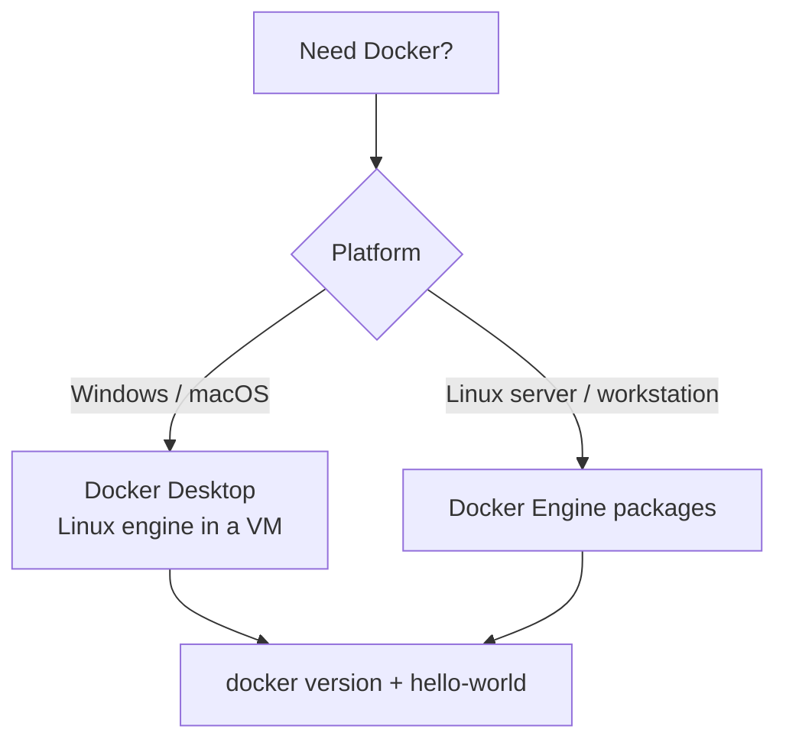
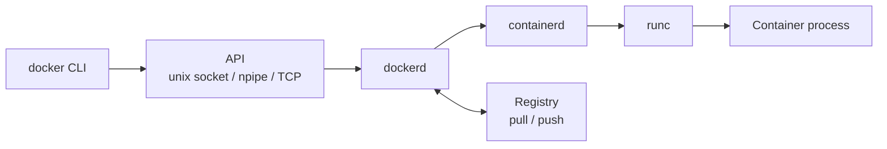
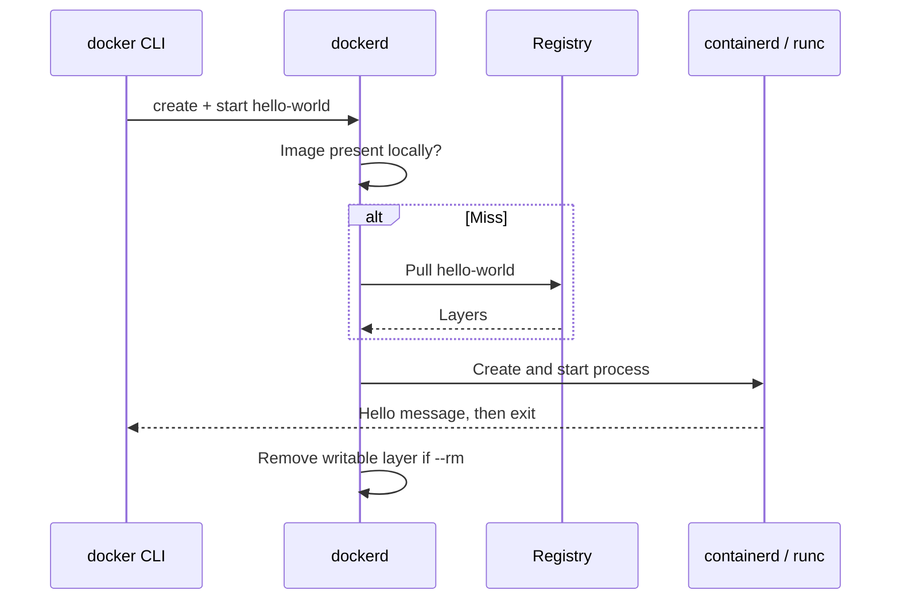
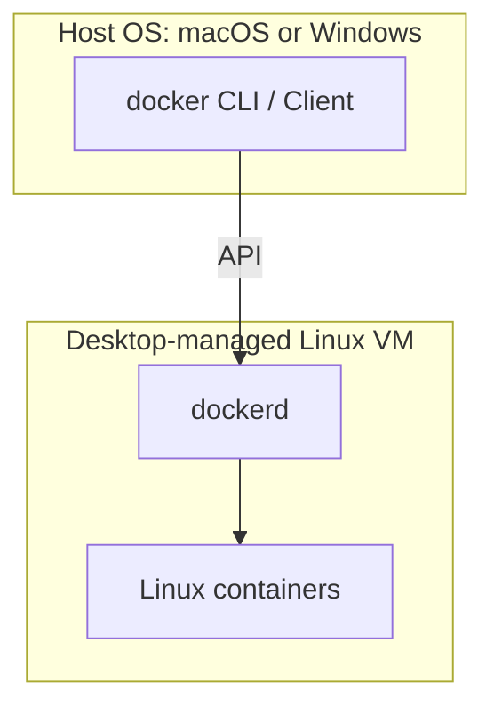

# Chapter 02 — Docker Installation and Architecture

> **Learning Objectives**
>
> By the end of this chapter, you will be able to:
>
> - Install Docker on your platform and verify the engine responds
> - Distinguish Docker Client, Docker Engine (`dockerd`), containerd, and runc
> - Trace what happens when you run a simple container
> - Read `docker version` and `docker info` with confidence
> - Recognize Desktop versus Engine-on-Linux differences that affect beginners

---

## 02.1 The Restaurant Kitchen

Think of Docker as a restaurant. You (the **client**) place orders with a waiter. The **kitchen** (the **engine/daemon**) prepares dishes according to recipes (**images**) and serves plates (**containers**). Walk-in customers never flip burners themselves; they talk to the waiter API.


*Figure 02.A: The Docker client is the waiter; the daemon is the kitchen that actually cooks.*

If the kitchen is down, the waiter can still smile—but no food arrives. Beginners often install only a CLI-looking tool or forget to *start* Docker Desktop, then wonder why every command says the daemon is not running. This chapter gets the kitchen open and shows you the floor plan.

Two outcomes matter by the end of the chapter. First, `docker version` must show a **Server** section on Engine **29.x** (or Desktop shipping that engine). Second, you should be able to narrate a failure as “daemon / pull / create / start / app exit” instead of “Docker is weird.” That vocabulary is the difference between flailing and debugging.

> ⚠️ **Common Pitfall:** You might think reinstalling Desktop is the first fix for every error. Check whether the daemon is running, which context is active, and whether the failure is a pull or an app exit—reinstall is a last resort, not step one.

---
## 02.2 Installation Paths

### In plain terms

You have two common beginner paths: **Docker Desktop** (Windows, macOS, and many Linux learners) and **Docker Engine** installed directly on Linux servers. Both give you a `docker` CLI talking to a Linux container engine. Desktop wraps that engine in a managed VM and adds a GUI; Engine-on-Linux is leaner for servers.

The problem this chapter solves is not “which brand logo looks nicer”—it is getting a reachable Linux engine so every later command has somewhere to land. Beginners often install a CLI-looking tool, forget to start Desktop, or mix an ancient distro package with modern Compose docs, then spend a day chasing ghosts.

| Path | Best for | Notes |
|------|----------|-------|
| **Docker Desktop** | Windows, macOS, and many Linux learners | GUI, optional Kubernetes, manages a Linux VM/engine for you |
| **Docker Engine** on Linux | Servers and Linux workstations | Install engine packages directly; no Desktop required |

This book’s commands assume a working Linux container engine reachable as `docker`. On Desktop, that is automatic once Docker is running.



*Figure 02.1: Beginners usually pick Desktop on Windows/macOS or Engine on Linux — both end at the same verify step.*

> ⚠️ **Common Pitfall:** You might think “I installed Docker” means the engine is running. Installation and *running* are different. Until `docker version` shows a **Server** section, you only have a client (or a stopped Desktop).

### Under the hood

#### Windows (Docker Desktop)

1. Enable virtualization in BIOS/UEFI (Intel VT-x / AMD-V).
2. Install a supported backend: **WSL 2** is the usual recommendation on Windows 11.
3. Download and install Docker Desktop from Docker’s official site.
4. Start Docker Desktop and wait until it reports **Running**.
5. Open PowerShell, Windows Terminal, or WSL and verify:

```bash
$ docker version
$ docker run --rm hello-world
```

#### macOS (Docker Desktop)

1. Install Docker Desktop for Mac (Apple silicon or Intel build as appropriate).
2. Launch Docker Desktop; wait for the engine to start.
3. Verify with the same two commands as above.

#### Linux (Engine)

Use your distribution’s supported method from Docker’s official docs (apt/yum/dnf packages from Docker’s repositories—not outdated distro copies when possible). After install:

```bash
$ sudo systemctl enable --now docker
$ sudo docker run --rm hello-world
```

To run without `sudo`, add your user to the `docker` group, then log out and back in:

```bash
$ sudo usermod -aG docker $USER
```

> ⚠️ **Warning:** Membership in the `docker` group is effectively root-equivalent on the host. Use it on personal lab machines thoughtfully.

Always prefer the install guides on [docs.docker.com](https://docs.docker.com/engine/install/) for package names and repository setup—they change more often than conceptual architecture.

**What breaks if virtualization is disabled or WSL 2 is unhealthy:** Desktop never reaches Running; `docker version` shows Client only or connection errors. Fix the VM/WSL backend before debugging Dockerfiles.

### In production

**Ownership:** platform/SRE owns Engine versions on servers and golden Desktop recommendations for laptops; developers own verifying their local client can reach that baseline.

- Pin Desktop or Engine versions in team docs so “works on my machine” includes engine minor version (**29.x** in this book).
- On servers, install from Docker’s official repositories, enable the service at boot, and restrict who can talk to the Docker socket.
- Treat corporate proxies and SSL inspection as first-class configuration: misconfigured TLS breaks pulls more often than “Docker is broken.”

**Failure mode:** half the team on an old Engine that lacks BuildKit defaults the docs assume. **Detect:** compare `docker version` Server lines in onboarding tickets. **Mitigate:** document and enforce a minimum Engine minor; fail CI on unsupported clients when practical.

**Do:** install from official docs, verify Server section, record versions. **Don’t:** scavenger-hunt random `docker-compose` binaries from old blog posts.

**Before you leave this section**

- **Understand:** Desktop vs Engine both end at a Linux engine; install ≠ running.
- **Try:** Complete install for your OS until `docker run --rm hello-world` succeeds.
- **Watch in prod:** Untracked Engine skew across laptops and CI runners.

---

## 02.3 Verify the Install

### In plain terms

Two commands tell you almost everything at the start: `docker version` (can the client reach a server?) and `docker run --rm hello-world` (can that server pull and run?). Verification is not bureaucracy—it is the fastest way to separate “CLI missing,” “daemon down,” “pull broken,” and “runtime broken.”

> ⚠️ **Common Pitfall:** Declaring victory after `docker` prints help text. A client without a Server section cannot build or run anything.

### Under the hood

#### `docker version`

```bash
$ docker version
```

You should see **Client** and **Server** sections. If Client appears but Server errors with “Cannot connect to the Docker daemon,” the engine is not running or the client cannot reach its socket/pipe.

Sample shape (versions will differ; this book targets **29.x**):

```text
Client:
 Version:           29.x.x
 API version:       1.xx
 Go version:        go1.xx.x
 OS/Arch:           windows/amd64
 Context:           desktop-linux

Server: Docker Desktop
 Engine:
  Version:          29.x.x
  API version:      1.xx (minimum version 1.24)
  OS/Arch:          linux/amd64
```

Notice **Client OS/Arch** may be Windows/macOS while **Server OS/Arch** is `linux/amd64` or `linux/arm64`. That is expected on Desktop: your CLI runs on the host OS; containers run in a Linux engine.

#### `docker info`

```bash
$ docker info
```

Skim for: server version, storage driver / image store, logging driver, CPUs, total memory, and whether BuildKit is active. You do not memorize this output—you learn where to look when troubleshooting.

#### The classic smoke test

```bash
$ docker run --rm hello-world
```

```text
Hello from Docker!
This message shows that your installation appears to be working correctly.
...
```

`--rm` removes the container after it exits so your system does not accumulate one-off containers.

**What breaks if only `docker version` Client works:** every `run`/`build`/`pull` fails with daemon connection errors. Start Desktop or `systemctl start docker`, then re-check Server.

### In production

**Ownership:** whoever provisions the machine owns the post-install health check; the developer owns pasting Client/Server versions into the first support ticket.

Automate a post-install health check in onboarding docs: `docker version`, `docker info`, and a known-good pull. Record Client version, Engine version, and Server OS/Arch so support tickets start with facts.

**Failure mode:** “Docker doesn’t work” tickets with no version output. **Detect:** missing Server section or non-29.x Engine when the book/runbook assumes 29.x. **Mitigate:** template the three commands into the ticket form.

**Do:** capture version output before deep debugging. **Don’t:** upgrade randomly mid-incident without noting the before/after versions.

**Before you leave this section**

- **Understand:** Client ≠ Server; both must appear for a working install.
- **Try:** Run `docker version`, `docker info`, and `hello-world`; save the Server Engine version.
- **Watch in prod:** Onboarding machines that never recorded Engine version or OS/Arch.

---

## 02.4 Architecture: Client, Engine, and Friends

### In plain terms

You type `docker …`. A client sends an API request. A long-running engine accepts it, then asks lower-level runtimes to create the actual isolated process. Registries sit on the side for pull and push.

Think of failures as layered too. “Docker is broken” almost always means one layer: wrong context, daemon down, registry unreachable, runtime cannot create, or the app process crashed. Architecture gives you a map so you stop restarting Desktop as the only trick.



*Figure 02.2: A `docker` request travels from the CLI through the Engine API, dockerd, containerd, and runc to the container process.*

> ⚠️ **Common Pitfall:** You might think the `docker` binary itself creates namespaces. It does not. Without a reachable daemon API, the CLI is only a client.

### Under the hood

#### Docker Client

The `docker` binary parses your command and sends an API request to the engine. It does not itself create namespaces or start processes (except by talking to the daemon).

#### Docker Engine (`dockerd`)

The long-running daemon that:

- Accepts API calls
- Manages images, containers, networks, and volumes
- Coordinates pulls/pushes with registries
- Delegates low-level runtime work

#### containerd and runc

Modern Docker uses **containerd** as a core container runtime component, which in turn often uses **runc** (or another OCI runtime) to spawn the actual container process. You rarely invoke these directly as a beginner, but error messages sometimes mention them—now you know they sit under the hood.

On fresh Docker Engine **29.x** installs, the **containerd image store** is typically the default for image content (snapshotters such as `overlayfs`). Upgraded daemons may still report legacy graph drivers until migrated—check `docker info` when disk or multi-platform behavior looks odd (Chapter 03 and 07 expand storage implications).

```bash
$ docker info --format 'ServerVersion={{.ServerVersion}} Driver={{.Driver}} LoggingDriver={{.LoggingDriver}}'
```

#### Images, Containers, Networks, Volumes

The engine keeps local state:

| Object | Role |
|--------|------|
| Images | Immutable templates (layered) |
| Containers | Instances with writable layers + config |
| Networks | How containers reach each other and the host |
| Volumes | Persistent data managed by Docker |

Chapter 03 focuses on images; Chapter 05 on containers; Chapters 06 and 07 cover networks and volumes.

**What breaks if disk fills with images/logs:** creates and pulls fail with obscure I/O errors; the “app” looks guilty. Check `docker system df` and logging rotation before rewriting application code.

### In production

**Ownership:** platform owns daemon config, socket exposure, and engine upgrades; app teams own images/containers within that sandbox.

Know this stack so failures map to layers: CLI/context problems, daemon down, pull/registry failures, runtime create/start failures, or application crashes.

**Failure mode:** unauthenticated TCP Docker API on a public interface. **Detect:** unexpected remote `docker ps` success; security scans finding open daemon ports. **Mitigate:** local socket only; TLS + auth if remote API is required; never expose raw daemon API to the internet.

> 🏭 **Production floor:** Anyone who can talk to the Docker socket can usually escalate to root-equivalent control of the host. Treat socket access like sudo. Incident tickets should note *which* identity had socket access when a suspicious container appeared.

**Do:** map errors to the layer in Figure 02.2. **Don’t:** mount the socket into untrusted app containers.

> 📘 **Deep Dive (optional):** The Docker API can be spoken by other clients (SDKs, CI plugins, Portainer). Anything with access to the socket can do what the CLI can do—treat socket exposure as privileged access.

**Before you leave this section**

- **Understand:** CLI → API → dockerd → containerd/runc → process; registries sit beside dockerd.
- **Try:** Run the `docker info --format` one-liner and note driver + logging driver.
- **Watch in prod:** Socket mounts and open daemon ports.

---

## 02.5 Contexts and Endpoints

### In plain terms

A **context** is a named “which kitchen am I ordering from?” setting for the client. Beginners usually stay on the default Desktop or local context. The problem contexts solve is intentional targeting: laptop versus remote jump-host engine versus CI—without editing shell profiles by accident every week.

> ⚠️ **Common Pitfall:** Exporting `DOCKER_HOST` in a terminal profile and forgetting it. Suddenly builds land on another machine (or fail), and “my images disappeared.”

### Under the hood

```bash
$ docker context ls
```

```text
NAME              DESCRIPTION                               DOCKER ENDPOINT
default           Current DOCKER_HOST based configuration   npipe:////./pipe/docker_engine
desktop-linux *   Docker Desktop                            npipe:////./pipe/dockerDesktopLinuxEngine
```

On Linux the default API endpoint is often the Unix socket `unix:///var/run/docker.sock`. On Docker Desktop for Windows it may be an `npipe://` named pipe. You normally do not configure this by hand.

If commands suddenly hit the wrong machine, check the active context:

```bash
$ docker context show
```

**What breaks if the active context points at a dead endpoint:** every command fails with connection errors even though Desktop looks fine on another context. Switch back with `docker context use …`.

### In production

**Ownership:** platform documents approved contexts for remote engines; developers own not leaving experimental `DOCKER_HOST` values in shared shells.

Document which context developers and CI use. Prefer explicit contexts for remote engines over ad-hoc `DOCKER_HOST` changes that linger in shells. Never expose an unauthenticated Docker API over the public internet.

**Do:** `docker context show` before destructive prune commands. **Don’t:** point a laptop context at production Engine without strong auth and change control.

**Before you leave this section**

- **Understand:** Context selects which engine the CLI talks to.
- **Try:** Run `docker context ls` and note the `*` active row.
- **Watch in prod:** Lingering `DOCKER_HOST` / wrong-context prunes.

---

## 02.6 What Happens During `docker run hello-world`

### In plain terms

One command hides a pipeline: talk to the engine, find or pull an image, create a container, start a process, print a message, exit, maybe clean up. Learning the pipeline turns opaque failures into categorized ones—pull versus create versus start versus app exit.

> ⚠️ **Common Pitfall:** Reading an application crash as “Docker is broken.” If the image pulled and the container was created, Docker did its job; the process exited non-zero.

### Under the hood

Layered view:

1. **CLI** validates arguments and calls the Engine API “create + start.”
2. **Engine** checks for the `hello-world` image locally.
3. On miss, Engine **pulls** from the configured registry (Docker Hub by default).
4. Engine creates a container config (hostname, networking, mounts, command).
5. Runtime starts the process defined by the image.
6. The process prints the hello message and exits.
7. With `--rm`, Engine deletes the container’s writable layer.



*Figure 02.3: The `docker run hello-world` pipeline — pull if needed, start the process, optionally clean up.*

```bash
$ docker run --rm hello-world
$ docker images hello-world
```

**What breaks if the image architecture does not match the engine:** create/start can fail with `exec format error`. Pull with `--platform` or build for the target arch (Chapter 03).

Understanding this pipeline makes later failures diagnosable: pull problems versus create problems versus start problems versus app crashes.

### In production

**Ownership:** on-call uses the same pipeline language in tickets; platform owns registry reachability; app owners own process exit codes.

Teach on-call the same pipeline. A failed deploy is often “registry auth,” “disk full,” “image missing for this architecture,” or “process exited 1”—not a mysterious Docker ghost.

**Failure mode:** CI cannot pull base images behind a proxy. **Detect:** failures at step 3 with TLS/timeout/`403`/`429`. **Mitigate:** mirror/cache, authenticated pulls, document proxy settings.

**Do:** name the failing step in the incident summary. **Don’t:** restart the daemon as step zero for every exit code 1.

**Before you leave this section**

- **Understand:** run = resolve image → create → start → process lifecycle → optional rm.
- **Try:** Run `hello-world` twice; note the second run skips the pull.
- **Watch in prod:** Tickets that say “Docker broken” without naming the pipeline step.

---

## 02.7 Desktop-Specific Realities

### In plain terms

On Mac and Windows, your containers do not run directly on the host kernel. They run inside a Linux environment Desktop manages. That explains resource knobs, file-sharing quirks, and why Client OS and Server OS differ.

The misconception is “Docker on Mac is slower because containers are slow.” Often the bottleneck is the VM’s CPU/RAM ceiling or bind-mount chatiness across the VM boundary—not the container idea itself.



*Figure 02.4: On Desktop, the client runs on the host OS while containers run inside a managed Linux engine.*

> ⚠️ **Common Pitfall:** Bind-mounting huge Windows home directories into containers and blaming Flask for multi-second file I/O. Prefer project files inside WSL2’s Linux filesystem when on Windows.

### Under the hood

- **Resources:** Desktop allocates CPU/RAM/disk to the Linux VM. If builds are slow or containers OOM, raise resources in Desktop settings.
- **File sharing:** Bind-mounting host directories requires shared paths; permission quirks are common on Mac/Windows. Prefer working inside WSL2 filesystems on Windows when possible.
- **Linux containers vs Windows containers:** This book uses **Linux containers**. On Windows, ensure Desktop is in Linux container mode.
- **Optional Kubernetes:** Desktop can enable a single-node cluster—useful later in Part II, not required for Part I.
- **Compose V2:** Prefer `docker compose` (plugin) on Docker Engine 29.x over the legacy `docker-compose` standalone binary.

```bash
$ docker version --format 'Client={{.Client.Os}}/{{.Client.Arch}} Server={{.Server.Os}}/{{.Server.Arch}}'
```

**What breaks if Desktop’s disk image fills:** pulls and builds fail; containers may refuse to start. Reclaim space (`docker system df`, prune) and raise the disk limit in Desktop settings.

### In production

**Ownership:** developer experience / platform publishes Desktop settings baselines; CI owns Linux runners that match production architecture.

For local parity with Linux servers, develop inside WSL2 or a Linux VM when path and performance quirks matter. For CI, prefer Linux runners that match production architecture (`linux/amd64` versus `linux/arm64`).

**Do:** treat Desktop as a lab that approximates Linux Engine. **Don’t:** use Desktop resource defaults as capacity planning for servers.

**Before you leave this section**

- **Understand:** Desktop client OS ≠ container OS; a Linux VM sits in the middle.
- **Try:** Print Client vs Server OS/Arch with the format string above.
- **Watch in prod:** “Works on Mac” bind-mount workflows that never ran on Linux CI.

---

## 02.8 Common Pitfalls

> ⚠️ **Common Pitfall:** Installing an old `docker-compose` standalone and mixing it with Compose V2.  
> Prefer `docker compose` (plugin) on modern Docker Engine 29.x.

> ⚠️ **Common Pitfall:** Daemon not running.  
> Symptoms: `Cannot connect to the Docker daemon`. Fix: start Docker Desktop or `systemctl start docker`, then retry.

> ⚠️ **Common Pitfall:** Using `sudo docker` sometimes and unsudo’d Docker other times with different contexts.  
> Pick one deliberate setup. Mixed modes confuse image visibility (“Where did my image go?”).

> ⚠️ **Common Pitfall:** Corporate proxies and SSL inspection breaking pulls.  
> If `docker pull` fails with TLS or timeout errors only on company networks, configure proxy settings in Desktop/daemon carefully—do not disable TLS globally as a “fix.”

> ⚠️ **Common Pitfall:** Treating Client version alone as proof the lab matches the book.  
> Record **Server** Engine version and OS/Arch. A 29.x client talking to an ancient remote engine is still an ancient kitchen.

> 🏭 **Production floor:** On shared Linux builders, membership in the `docker` group is root-equivalent. Prefer rootless where policy allows, or tightly controlled CI service accounts—never “add everyone to docker” as onboarding convenience.

---

## 02.9 Hands-On Exercises

1. Run `docker version` and record: Client version, Server Engine version, and Server OS/Arch. Confirm Server is present and note whether you are on a 29.x engine.
2. Run `docker info` and note your CPUs, Total Memory, Logging Driver, and storage/image-store related fields.
3. Run `docker run --rm hello-world` twice. The second run should be faster and should not re-download layers if the image is cached—observe the difference.
4. Run `docker ps -a` and `docker images`. Confirm `hello-world` appears in images. If a container remains, you likely omitted `--rm`; remove it with `docker rm <id>`.
5. Intentionally quit/stop Docker Desktop (or stop the service), run `docker ps`, read the error, then restart and confirm recovery.
6. Run `docker context ls` and note the active context marked with `*`.
7. Write one sentence naming which architecture layer (CLI, dockerd, registry, runtime, app) failed the last time Docker surprised you—or invent a realistic example.

---

## 02.10 Check Your Understanding

**Q1.** What is the difference between the Docker Client and the Docker Engine?

<details>
<summary>Show answer</summary>

The client is the CLI (and other API consumers) that sends requests. The engine (`dockerd`) is the background service that builds images, runs containers, and manages Docker objects.

</details>

**Q2.** On Docker Desktop for Mac, why might Client OS/Arch differ from Server OS/Arch?

<details>
<summary>Show answer</summary>

The client runs on macOS; Linux containers run inside a Linux virtual machine that hosts the engine. Server OS/Arch therefore shows linux/amd64 or linux/arm64.

</details>

**Q3.** What does a successful `docker run --rm hello-world` prove?

<details>
<summary>Show answer</summary>

That the client can reach a working engine, that the engine can pull (or already has) an image, and that it can create and start a container successfully.

</details>

**Q4.** Why is the `docker` group powerful on Linux?

<details>
<summary>Show answer</summary>

Anyone who can talk to the Docker socket can often escalate to root-equivalent control of the host by running privileged containers or mounting the host filesystem.

</details>

**Q5.** Name the pipeline steps hidden inside `docker run hello-world`.

<details>
<summary>Show answer</summary>

Talk to the engine → find or pull the image → create the container → start the process → print/exit → optionally remove with `--rm`. Failures should be named at the step that broke.

</details>

---

## 02.11 Key Takeaways

- Install Docker Desktop (Mac/Windows) or Docker Engine (Linux), then verify with `docker version` and `hello-world`.
- Architecture: **Client → Engine API → dockerd → containerd/runc → process**.
- Desktop runs a Linux engine in a VM; that split explains many path and resource quirks.
- Distinguish failures: daemon down, pull failed, container exited—architecture tells you where to look.
- Compose V2 via `docker compose` matches this book’s Docker Engine 29.x assumptions.
- Treat the Docker socket like sudo; record Server Engine version and OS/Arch in every support ticket.

---

## 02.12 Official documentation map

| Topic | Official page |
|-------|---------------|
| Install Docker Engine | [Install Docker Engine](https://docs.docker.com/engine/install/) |
| Install Docker Desktop | [Docker Desktop](https://docs.docker.com/desktop/) |
| Docker Engine overview | [Engine](https://docs.docker.com/engine/) |
| `docker version` / CLI | [docker CLI reference](https://docs.docker.com/reference/cli/docker/) |
| Daemon configuration | [dockerd](https://docs.docker.com/reference/cli/dockerd/) |
| Contexts | [Docker contexts](https://docs.docker.com/engine/manage-resources/contexts/) |

**Previous:** [Chapter 01 — Docker: Why and What](01-docker-why-and-what.md) | **Next:** [Chapter 03 — Images Deep Dive](03-docker-images-deep-dive.md)
