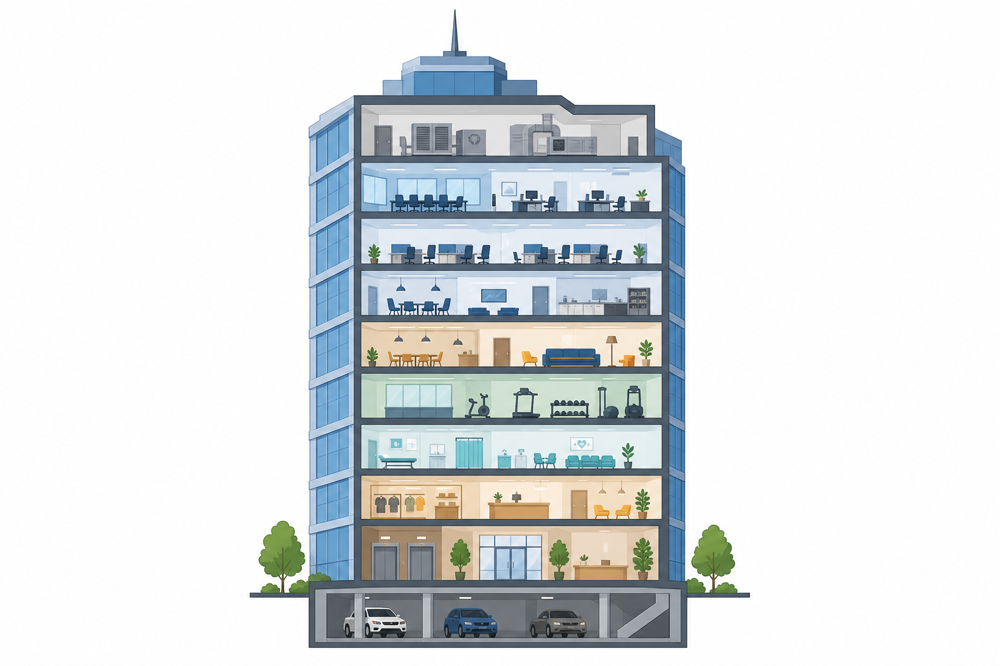
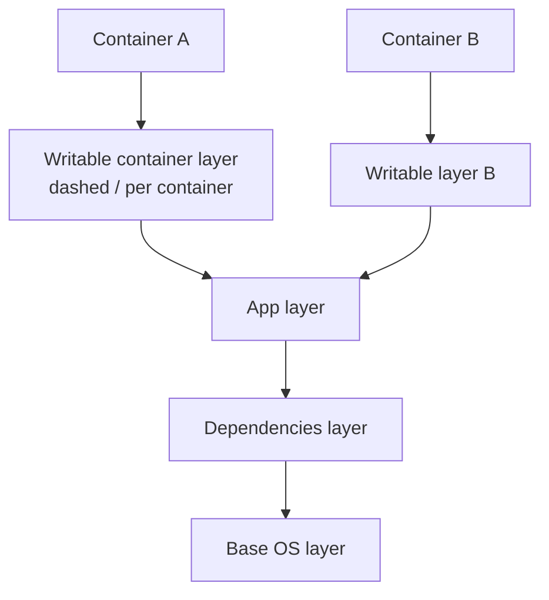
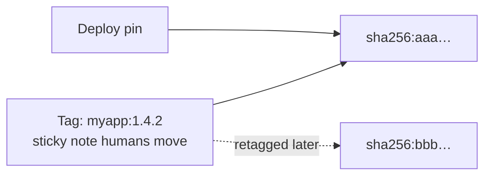
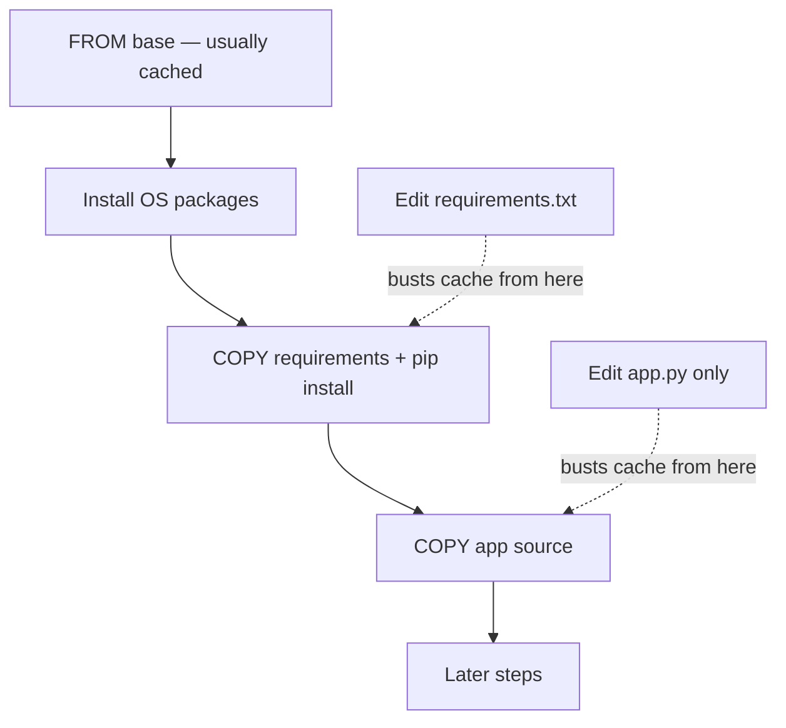
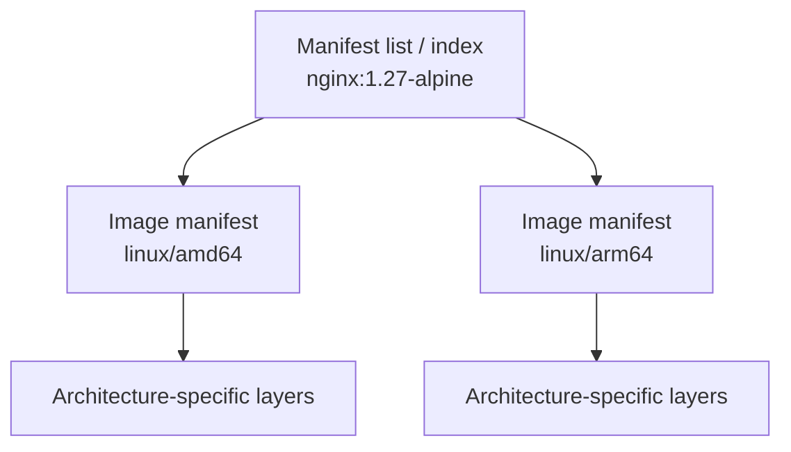

# Chapter 03 — Docker Images Deep Dive

> **Learning Objectives**
>
> By the end of this chapter, you will be able to:
>
> - Explain what image layers are and how they stack into one filesystem
> - Read an image name part by part: registry, repository, tag, and digest
> - Pull, list, inspect, tag, and remove images without breaking things
> - Say why a rebuild was fast or slow, and why an image got bigger
> - Build and pull images for more than one CPU type using `docker buildx`
> - Explain why `latest` is fine for a demo and wrong for production

---

## 03.1 Skyscrapers Built From Floors

Imagine a skyscraper built from pre-made floors, dropped into place one at a time. The ground floor is a small set of Linux files. The next floor adds a language runtime, such as Python. The floor above that holds your application code.

Two buildings can share the same lower floors and still differ at the top. You only rebuild a floor when that floor changes, and every floor above it.



*Figure 03.A: Image layers stack like floors of a building—shared below, unique on top.*

Docker **images** are built the same way. Each step of a build usually adds one **layer**, a saved set of file changes. Containers made from the same image share those read-only layers on disk, which saves both space and download time.

Once layers click, three other things stop being mysterious: why images are the size they are, why some rebuilds take seconds and others take ten minutes, and what a security scanner is actually looking at.

This is also the chapter where “ship the exact same thing everywhere” becomes real. By the end you should refuse to treat a movable tag as an identity, read `RepoDigests` without flinching, and ask “which CPU type?” before every build.

> ⚠️ **Common Pitfall:** You might think image commands are optional because CI builds everything for you. They are not. When a server cannot download an image, when two environments disagree, or when you see `exec format error`, this is the knowledge that ends the outage.

---

## 03.2 What an Image Contains

### In plain terms

An image is a stack of saved file changes plus a small settings file that says how to start the app. Each saved set of changes is a **layer**, and each layer records only what that build step added, changed, or deleted.

Why not just one big folder? Because stacking gives you two things at once. The first is **sharing**: ten containers can use the same base layers on disk instead of ten copies. The second is **immutability**: the lower layers never change, so a container writing a log file cannot alter the image other containers are using.

When a container starts, Docker adds a thin writable layer on top—a rooftop patio built on floors that stay read-only. Anything the app writes lands on the patio, not in the building.

If your mental model stays at “an image is a zip file of my app,” three things will keep surprising you: why some rebuilds skip most steps, why a digest is a stronger name than a tag, and why deleting one container does not free the base operating system layer.

> 💡 **In one line:** An image is a stack of read-only layers shared by every container that uses it; each container only owns the thin writable layer on top.

> ⚠️ **Common Pitfall:** You might think editing a file inside a running container changes the image. It does not. You changed that container’s writable layer only. A new container from the same image starts clean, unless you rebuild the image (or run `docker commit`, which is discouraged).

### Under the hood

Here is what actually sits inside an image:

- A stack of **filesystem layers**, where each layer is a set of file changes (a **diff**)
- A **config JSON** file: default command, entrypoint, environment variables, working directory, user, exposed ports, volumes, and labels
- **Metadata** the registry and engine use: CPU architecture, operating system, and digests

When a container starts, Docker adds a thin **writable layer** on top. Every change made inside the running container lands there, unless you mounted a volume for it. The image layers below never change.



*Figure 03.1: Read-only image layers stack under a thin writable container layer; multiple containers can share the same lower layers.*

Inspect config fields after you pull an image:

```bash
$ docker pull python:3.12-slim
$ docker inspect python:3.12-slim --format '{{.Os}}/{{.Architecture}} Cmd={{json .Config.Cmd}} User={{.Config.User}}'
```

```text
linux/amd64 Cmd=["python3"] User=
```

An empty `User` field usually means the container runs as root. Write that down; you will fix it when you harden the image.

**What breaks if you read `SIZE` in `docker images` as disk space used by that image alone:** images share layers, so adding the SIZE column up counts the same bytes many times. Use `docker system df` for the real number.

### In production

**Ownership:** app teams own what goes into their application layers. The platform team owns which base images are approved and which scans the final artifact must pass.

What is inside an image is both your attack surface and your deploy contract. Smaller images with fewer packages download faster, give an attacker less to work with, and produce a cleaner **SBOM**—a software bill of materials, the list of everything shipped inside. Promote one unchanging digest rather than rebuilding “the same tag” once per environment.

**Failure mode:** a “slim” image that still ships a compiler in the final stage. **Detect:** `docker history` and scanners show build packages, and image size jumps in CI. **Mitigate:** use multi-stage builds (Chapter 04) and fail the pipeline when size or vulnerability budgets are exceeded.

**Do:** check `Cmd`, `User`, and the digest before you promote. **Don’t:** treat an image made by hand with `docker commit` as a release artifact. Nobody can rebuild it.

**Before you leave this section**

- **Understand:** Image = read-only layers + config; container adds a writable layer.
- **Try:** Pull `python:3.12-slim` and inspect Os/Arch, Cmd, and User.
- **Watch in prod:** Final images that still contain build toolchains.

---

## 03.3 Image Names, Tags, and Digests

### In plain terms

An image has two kinds of names. A **tag** is a label a human attaches, like `1.27-alpine`. A **digest** is a `sha256:…` fingerprint calculated from the image’s exact contents.

Why does the difference matter so much? Because anyone can move a tag to different content tomorrow, and nobody can move a digest. A tag is a sticky note. A digest is a fingerprint. Sticky notes get peeled off and stuck somewhere else; fingerprints do not.

That is the trust problem digests solve, across time and across machines. Humans want to say `1.4.2` in a conversation. Machines and auditors need to say “these exact bytes, and no others.” If your release process only says “deploy `myapp:prod`,” you wrote down a nickname, not an identity.

> 💡 **In one line:** A tag says what someone called it; a digest proves what it actually is—so humans read tags and deploys pin digests.

> ⚠️ **Common Pitfall:** You might think `latest` means “the newest stable release.” It does not. It is only a naming habit. It moves whenever someone pushes with that tag, and it may not be recent or stable at all.

### Under the hood

Here is how a real image reference is put together. A familiar one looks like:

```text
nginx:1.27-alpine
python:3.12-slim
ghcr.io/acme/task-api:1.4.2
```

General form:

```text
[registry/][namespace/]repository[:tag]
```

| Part | Example | Meaning |
|------|---------|---------|
| Registry | `ghcr.io` | Where to pull from (default: Docker Hub / `docker.io`) |
| Namespace/repo | `library/nginx` or `acme/task-api` | Image path |
| Tag | `1.27-alpine` | Mutable pointer humans maintain |

A **digest** (`sha256:…`) names the content itself, and it can never point at anything else:

```bash
$ docker pull nginx@sha256:DIGEST_HERE
```

After a pull, find digests you actually have:

```bash
$ docker inspect nginx:alpine --format '{{json .RepoDigests}}'
```

```text
["nginx@sha256:aaaaaaaaaaaaaaaaaaaaaaaaaaaaaaaaaaaaaaaaaaaaaaaaaaaaaaaaaaaaaaaa"]
```

#### The `latest` trap

Writing `nginx` means `nginx:latest`. That word is only a habit, not a promise. Nothing guarantees it is the newest release, nothing guarantees it is stable, and it changes whenever someone pushes. Fine for a quick demo. Dangerous as the only thing naming your production image.

| Pointer | Mutable? | Best for |
|---------|----------|----------|
| Tag (`1.4.2`, `alpine`) | Yes — can be moved | Human-friendly names |
| Digest (`sha256:…`) | No — content identity | Promotion and audit |
| `latest` | Yes — and ambiguous | Demos only |



*Figure 03.2: Tags are movable pointers; digests identify exact bytes you promote.*

**What breaks if two environments pull the same tag a week apart:** they can end up running different bytes while every dashboard shows the same tag. The incident turns into “but we both run 1.4.2!” Compare digests and the argument ends.

### In production

**Ownership:** app teams create the version tags. Release engineering or the platform team enforces digest pins on the production deploy path and decides how long images are kept.

- Use version tags for humans (`1.4.2`, `1.4.2-alpine`).
- Record digests in release notes, GitOps manifests, or your deploy system.
- Ban moving tags such as `:latest` in production deploy configs.
- When you move a release from one environment to the next, move the digest you tested. Do not move a name that someone could have repointed.

**Failure mode:** someone retags `prod` after a hotfix, and staging quietly falls behind. **Detect:** the digests in each environment’s manifest no longer match; a registry webhook fires when a tag moves. **Mitigate:** make tags immutable in the registry, reference digests in deploy manifests, and block `:latest` by policy.

> 🏭 **Production floor:** Promote by digest. In regulated environments, deploy specs must reference `image@sha256:…`, or a tag the registry refuses to overwrite. Incident tickets record the intended digest and the observed digest before anyone argues about application code.

**Do:** pin exactly what you tested. **Don’t:** let `:latest`, or a `:prod` tag that anyone can move, be the only name production knows.

**Before you leave this section**

- **Understand:** Tags move; digests identify bytes.
- **Try:** Pull an image and save its `RepoDigests` value to a text file.
- **Watch in prod:** Deploy configs that only mention floating tags.

---

## 03.4 Working With Images on Your Machine

### In plain terms

Working with images day to day takes only five moves: list what you already have, pull what you need, look inside, add a name, and delete what you no longer want.

Why practice these? Because neglected images fill disks, and a full disk stops builds and deploys with errors that look nothing like “out of space.” The same five commands also answer the daily question “wait, where did my image go?”

> ⚠️ **Common Pitfall:** Copying the `IMAGE ID` into a production manifest. That ID is local to one machine. Use the registry digest from `RepoDigests` when you need a name that means the same thing everywhere.

### Under the hood

Here is each command and what its output tells you.

#### List images

```bash
$ docker images
```

```text
REPOSITORY   TAG       IMAGE ID       CREATED       SIZE
nginx        alpine    3f8a3b2c1d0e   2 weeks ago   43.2MB
hello-world  latest    d2c94e258dcb   3 months ago  9.14kB
```

`IMAGE ID` is a short identifier that only means something on this machine. It is not a replacement for a registry digest when you are coordinating across teams.

#### Pull explicitly

```bash
$ docker pull python:3.12-slim
```

```text
3.12-slim: Pulling from library/python
...
Status: Downloaded newer image for python:3.12-slim
docker.io/library/python:3.12-slim
```

#### Inspect

```bash
$ docker inspect python:3.12-slim
```

Useful fields: `Architecture`, `Os`, `Config.Env`, `Config.Cmd`, `Config.Entrypoint`, `Config.WorkingDir`, `RootFS.Layers`, `RepoDigests`.

#### History (layers as humans see them)

```bash
$ docker history python:3.12-slim
```

```text
IMAGE          CREATED       CREATED BY                                      SIZE
abcdefghijkl   10 days ago   CMD ["python3"]                                 0B
abcdefghijkl   10 days ago   # buildkit …                                    15MB
...
```

After BuildKit optimizes a build, the rows will not line up one-to-one with your Dockerfile lines. History still shows you which steps added the most weight, which is what you came for.

#### Tag (rename / retarget)

Tagging adds another **name** pointing at the same image ID. It copies no layers and uses almost no extra disk.

```bash
$ docker tag python:3.12-slim my-python:dev
$ docker images my-python
```

#### Remove

```bash
$ docker rmi hello-world
```

You cannot remove an image while any container still points at it, including a stopped one. Remove those containers first with `docker rm`, or clean them up with `docker container prune`.

```bash
$ docker image prune
```

This deletes **dangling** images—leftover images that no longer have any tag pointing at them. Be careful on a machine other people share.

```bash
$ docker system df
```

This shows the real disk usage of images, containers, and volumes. Trust it over adding up the `SIZE` column, because that column double-counts shared layers.

**What breaks if you run `docker rmi -f` without checking containers first:** the force flag removes the image anyway, and a stopped container that needed it can no longer start until you pull the image again.

### In production

**Ownership:** the platform team decides the cleanup rules on CI machines. Developers avoid deleting the last local copy of a production image when no registry has it.

Automate cleanup on CI agents and developer laptops with `docker image prune` and retention rules in the registry. Never delete “old” images when they are the only remaining copy of a digest production expects and no registry holds a backup.

**Failure mode:** an aggressive prune on a jump host that was caching the only copy of an image for a disconnected network. **Detect:** image pull failures that start right after a cleanup window. **Mitigate:** make the registry the single source of truth. Nodes must pull from the registry, never from another machine’s accidental cache.

**Do:** run `docker system df` before any large prune. **Don’t:** run `docker system prune -a` on a shared build machine outside a change window.

**Before you leave this section**

- **Understand:** tag renames; rmi refuses when containers reference; `system df` beats summing SIZE.
- **Try:** Tag an image, confirm shared IMAGE ID, remove only the extra tag.
- **Watch in prod:** Unscheduled prune jobs on shared builders.

---

## 03.5 Layers, Caching, and Sharing

### In plain terms

The **build cache** is Docker’s habit of reusing a layer it already built, as long as that step’s inputs did not change.

Why care? Because it decides whether your rebuild takes eight seconds or eight minutes. Go back to the skyscraper. If the lower floors did not change, the crew reuses them and starts near the top. Change a lower floor, and everything above it has to be rebuilt.

That is exactly why the order of steps in a Dockerfile matters. Put slow, rarely changing work early. Put your application code, which changes many times a day, last.

Caching is a speed feature with a sharp edge. When you understand what feeds each step, rebuilds fly. When you do not, you either keep an old layer longer than you should, or you wonder why editing one file rebuilt half the image.

> ⚠️ **Common Pitfall:** Copying the whole repository into the image before installing dependencies. After that, editing any single source file throws away the dependency layer and reinstalls everything.

### Under the hood

Here is what actually happens on the machine. The builder **reuses a layer** whenever that step’s inputs are unchanged. Chapter 04 goes much deeper on Dockerfiles; three rules matter now:

1. Put rarely changing steps early (base OS packages).
2. Copy dependency manifests before full source so dependency layers cache across code edits.
3. Expect any changed file in a `COPY` to invalidate that step *and* all following steps.



*Figure 03.3: Put stable work early — a source edit should not rebuild dependency layers.*

Sharing works across images too. Ten services that all start `FROM python:3.12-slim` do not store ten copies of that base on the engine. Layers are stored by a hash of their contents, so identical layers are kept once.

```bash
$ docker history --human myapp:1.0
```

**What breaks if the base image tag moves under you:** both your cache and your security position change, while the text of your Dockerfile looks exactly the same. Pin base images by digest when you need identical output every time.

### In production

**Ownership:** app teams arrange their Dockerfiles so the cache works. The platform team provides shared BuildKit cache storage in CI, so build agents do not start cold on every run.

A cache hit is fast, and it is also a risk when you do not know what feeds a step. Pin base images by digest when you need identical rebuilds. Throw the cache away on purpose when a security patch lands.

**Failure mode:** CI passes using a week-old cached base that carries a critical vulnerability. **Detect:** scan the final digest on every promotion, and rebuild with `--no-cache` on a schedule or whenever the base digest changes. **Mitigate:** pin bases by digest, rebuild on a schedule, and drop the cache when an advisory is published.

**Do:** order Dockerfile steps stable-first so the cache helps you. **Don’t:** read “cache hit” as “still patched.” They are unrelated.

**Before you leave this section**

- **Understand:** Changed COPY inputs invalidate that step and everything after.
- **Try:** Sketch where `requirements.txt` vs `app.py` edits bust cache on Figure 03.3.
- **Watch in prod:** Long-lived CI caches with no base-image refresh policy.

---

## 03.6 Registries in Practice

### In plain terms

A **registry** is a server that stores images so any machine can download them. Docker Hub is the public one Docker uses by default, and most companies also run or rent a private one.

Why care? Because an image that exists only on your laptop cannot be deployed. The registry is the bridge between “it works on my machine” and “it works on the server.” It is also where access control, scanning, and retention rules live.

> ⚠️ **Common Pitfall:** Letting CI download from Docker Hub without logging in. It works fine until you hit the anonymous download limit, and that always happens on release day.

### Under the hood

Here is what actually happens on the machine. Pulls go to **Docker Hub** (`docker.io`) unless the name says otherwise. Docker Official Images live under `library/`, which is why you can type `nginx` with no user prefix in front.

Common operations:

```bash
$ docker login
$ docker tag myapp:1.0 registry.example.com/team/myapp:1.0
$ docker push registry.example.com/team/myapp:1.0
```

```text
The push refers to repository [registry.example.com/team/myapp]
...
1.0: digest: sha256:bbbb... size: 1234
```

Download limits, logins, and private registries come back in Chapter 10. For now, remember one thing: if a pull fails with `429` or an authentication error, the problem is registry access. Your Dockerfile is innocent.

**What breaks if push credentials can overwrite any tag:** one stolen laptop is enough to replace the bytes behind `prod`. Keep push permissions separate and narrow, make release tags immutable, and check the digest at deploy time.

### In production

**Ownership:** the platform team owns registry uptime, authentication, and mirrors. App teams own their repositories and decide who may push to them.

- Use your organization’s registry, or a private one, for internal apps.
- Run a pull-through cache or mirror when Docker Hub limits slow CI down.
- Sign and scan images as part of promotion (Chapter 10 and the later CI chapters).

**Do:** log in for CI pulls, and mirror the base images you depend on. **Don’t:** depend on anonymous Docker Hub access from short-lived CI runners.

> 🏭 **Production floor:** The registry is inside your blast radius. When it is down, autoscaling cannot pull images, so it cannot add capacity. Give the registry uptime targets like a database, not like an optional developer tool.

**Before you leave this section**

- **Understand:** Push/pull via registry is how images leave your laptop.
- **Try:** `docker login` against a registry you use (or Hub) and pull an authenticated image.
- **Watch in prod:** CI 429s and missing mirrors for hot base images.

---

## 03.7 Multi-Platform Images and buildx Basics

### In plain terms

A **multi-platform image** is one name that covers several CPU types. Behind that name sits a table of contents, called a **manifest list** or **index**, pointing at one real image per architecture.

Why does this exist? Because programs are compiled for a specific CPU. Your Mac may be **arm64**, while your server is **amd64**, and a binary built for one will not run on the other. The multi-platform index lets both machines use the name `python:3.12-slim` and each get the right build. The engine picks the match automatically, or you name a platform yourself.

Here is the misconception to drop: “I pulled `python:3.12-slim`, so every machine now has the same bytes.” You pulled *your* CPU’s version of that name. The tag is shared. The layers underneath often are not.

> 💡 **In one line:** One image tag can hide several builds, one per CPU type—so “it pulled fine on my laptop” proves nothing about your server.

> ⚠️ **Common Pitfall:** Building only for your laptop’s CPU and pushing that as `:latest`. Your amd64 production nodes then fail with `exec format error`.

### Under the hood

Here is what actually happens on the machine. Many Docker Hub images are **manifest lists** that point at `linux/amd64`, `linux/arm64`, and other variants. On an Apple silicon Mac, `docker pull` normally picks `arm64` for you. When you deploy to an `amd64` server, name that platform yourself:

```bash
$ docker pull --platform linux/amd64 python:3.12-slim
$ docker inspect python:3.12-slim --format '{{.Os}}/{{.Architecture}}'
```

```text
linux/amd64
```

**Buildx** is the build client that `docker build` uses on Docker Engine 29.x. It drives **BuildKit**, the build engine that runs the steps. Multi-platform *builds* usually look like this:

```bash
$ docker buildx version
$ docker buildx ls
```

```bash
$ docker buildx build --platform linux/amd64,linux/arm64 -t myapp:1.0 --push .
```

Notes that save hours:

- Fresh Docker Engine **29.x** and Desktop installs normally use the **containerd image store**, which can hold multi-platform images locally. Older or upgraded setups may need the `docker-container` buildx driver, and may need `--push` to a registry instead of `--load` for multi-architecture output.
- Building for a foreign CPU usually runs through **QEMU** emulation, which imitates the other CPU and is slow. Cross-compiling inside a multi-stage Dockerfile is often much faster when your language supports it (Chapter 04).
- Build arguments that BuildKit fills in for you, such as `BUILDPLATFORM` and `TARGETPLATFORM`, let one Dockerfile work for several architectures.



*Figure 03.4: A multi-platform tag is an index that points at per-architecture manifests and their layers.*

**What breaks if you use `--load` for a multi-platform build on an older graph-driver setup:** the load is rejected, because that store cannot hold more than one architecture under one name. Push the manifest list to a registry, or switch to a builder driver that supports it.

### In production

**Ownership:** CI owns the explicit list of platforms every release builds for. App teams confirm that their binaries and packages really work on each architecture they claim to support.

- Build and test on every architecture you deploy to. “It pulled on my M-series Mac” says nothing about the amd64 node pool.
- In release pipelines, always pass `--platform` explicitly instead of relying on a default.
- When auditing where your software came from, pin base images by digest *for each platform*. A multi-architecture index can move even though it feels like one fixed name.

> 💡 **Tip:** If a container dies with `exec format error`, you almost certainly ran an image built for a different CPU architecture than the host.

**Do:** run at least one container per released architecture before shipping. **Don’t:** treat a successful pull on your laptop as proof for the server.

**Before you leave this section**

- **Understand:** A multi-arch tag is an index; each arch has its own layers.
- **Try:** `docker pull --platform linux/amd64 python:3.12-slim` and inspect Architecture.
- **Watch in prod:** `exec format error` after Mac-only builds.

---

## 03.8 Image Size Literacy

### In plain terms

Image size is how many megabytes a machine must download and store before your app can start.

Why care about a number on a screen? Because size turns into three real costs. A smaller image downloads faster, so a new instance starts sooner when traffic spikes. It uses less disk on every node running it. And it ships fewer unused programs that an attacker could use once inside. Size is not vanity. It is startup time, disk, and attack surface.

> ⚠️ **Common Pitfall:** Switching to Alpine just because it is small, without checking which C library your dependencies expect. Some Python packages ship prebuilt files for **glibc**, the C library on Debian `slim`, and misbehave on Alpine’s **musl**.

### Under the hood

Here is what actually reduces size. Chapter 04 expands each one: choose slim bases deliberately, use multi-stage builds, keep compilers out of the final image, add a `.dockerignore` file, and delete package caches in the same layer that created them.

Alpine is small, but it uses musl instead of glibc, and some Python packages behave differently there. For many Python apps, a Debian `slim` base is the more predictable choice unless you specifically want Alpine.

```bash
$ docker images --format 'table {{.Repository}}\t{{.Tag}}\t{{.Size}}'
$ docker history --human --no-trunc myapp:1.0
```

**What breaks if you delete caches in a later layer than the one that created them:** the heavy layer is still there underneath, and the final image barely shrinks. A layer can only add to the stack; a later delete just hides files. Clean up inside the same `RUN` that made the mess.

### In production

**Ownership:** app teams keep the final build stage lean. The platform team may set size budgets that CI checks.

Track image size in CI as a budget, not a hard rule. Investigate sudden jumps. They usually mean a debug toolchain or a package cache leaked into the final stage.

**Failure mode:** a 1.5 GB debug image promoted to production because “it worked.” **Detect:** alerts on size changes between builds, and `docker history` showing compilers in the final stage. **Mitigate:** use multi-stage builds, and block promotion above the budget unless someone signs off.

**Do:** treat size budgets as seriously as your vulnerability policy. **Don’t:** shave megabytes off the base image while still shipping `build-essential` in the runtime image.

**Before you leave this section**

- **Understand:** Size affects pull time, disk, and attack surface; cleanup must be same-layer.
- **Try:** Compare `docker history` of a fat vs slim base you already pulled.
- **Watch in prod:** Sudden image size jumps on otherwise small commits.

---

## 03.9 Common Pitfalls

> ⚠️ **Common Pitfall:** Treating tags as immutable.  
> `myapp:prod` can point to different bytes next week. Record digests in release notes or deploy by digest.

> ⚠️ **Common Pitfall:** Deleting “old” images that are still the base of running containers.  
> Remove containers first; understand dependencies with `docker ps -a` and `docker inspect`.

> ⚠️ **Common Pitfall:** Assuming `SIZE` in `docker images` is uniquely occupied disk.  
> Shared layers mean summing the SIZE column overcounts actual disk usage. Prefer `docker system df`.

> ⚠️ **Common Pitfall:** Pulling `:latest` in scripts.  
> Yesterday’s successful deploy can become tomorrow’s surprise upgrade.

> ⚠️ **Common Pitfall:** Ignoring platform.  
> Building only for your laptop’s arch and pushing `:latest` breaks the other arch in production with cryptic exec errors.

---

## 03.10 Hands-On Exercises

1. Pull two tagged variants of the same product, for example `nginx:alpine` and `nginx:stable-alpine` (or similar current tags). Compare `docker history` and reported sizes.
2. Run `docker inspect nginx:alpine` and write down `Config.Cmd`, `Config.ExposedPorts`, and `RepoDigests`.
3. Tag `nginx:alpine` as `local/nginx:lab`, confirm both names share the same IMAGE ID, then `docker rmi local/nginx:lab` and confirm the underlying image remains if still tagged `nginx:alpine`.
4. Pull `python:3.12-slim` and save a digest from `RepoDigests` into a text file as practice for pinning.
5. Run `docker pull --platform linux/amd64 python:3.12-slim` (on any machine) and compare `Architecture` via `docker inspect` to a default pull on an arm64 Mac if you have one.
6. Run `docker buildx ls` and `docker system df`. Note your default builder and image disk usage.

---

## 03.11 Check Your Understanding

**Q1.** What is the relationship between an image layer and a container’s writable layer?

<details>
<summary>Show answer</summary>

Image layers are read-only and shared. Each container gets its own thin writable layer on top where filesystem changes are stored (unless redirected to mounts).

</details>

**Q2.** Why are digests safer than tags for production promotion?

<details>
<summary>Show answer</summary>

Tags are mutable pointers and can be moved to new content. Digests identify exact bytes, so the same digest always refers to the same image content.

</details>

**Q3.** Does `docker tag` copy all layer data?

<details>
<summary>Show answer</summary>

No. It adds another name referencing the same image ID and layers.

</details>

**Q4.** Why might `docker rmi` refuse to delete an image?

<details>
<summary>Show answer</summary>

Because one or more containers still reference it. Remove those containers first, or force only when you understand the consequences.

</details>

**Q5.** What problem do multi-platform images solve?

<details>
<summary>Show answer</summary>

They let one name (tag) resolve to architecture-specific image variants—for example amd64 and arm64—so clients pull (or run) the correct binary for their CPU without maintaining separate unrelated names.

</details>

---

## 03.12 Key Takeaways

- An image is **read-only layers plus config**. The container adds one thin writable layer on top.
- **Tags move. Digests do not.** Humans read tags; deploys pin digests.
- Read a name in parts: `registry/namespace/repository:tag`, or `…@sha256:…`.
- Five daily commands: `pull`, `images`, `inspect`, `history`, `tag`, and `rmi`.
- **Change a step and every step after it rebuilds.** That is why stable work goes first.
- A **cache hit is not a security patch.** Rebuild bases on a schedule.
- One tag can hide **one image per CPU type**. Build for the architecture you deploy to.
- Never let `latest` be the only name for something you must reproduce.
- Size is **download time, disk, and attack surface**—clean up in the same `RUN` that made the mess.

---

## 03.13 Official documentation map

| Topic | Official page |
|-------|---------------|
| What is an image? | [What is an image?](https://docs.docker.com/get-started/docker-concepts/the-basics/what-is-an-image/) |
| docker image CLI | [docker image](https://docs.docker.com/reference/cli/docker/image/) |
| Build overview / BuildKit | [Docker Build overview](https://docs.docker.com/build/concepts/overview/) |
| Multi-platform builds | [Multi-platform images](https://docs.docker.com/build/building/multi-platform/) |
| buildx build | [docker buildx build](https://docs.docker.com/reference/cli/docker/buildx/build/) |
| Docker Hub / registries | [Docker Hub](https://docs.docker.com/docker-hub/) |

**Previous:** [Chapter 02 — Installation and Architecture](02-docker-installation-and-architecture.md) | **Next:** [Chapter 04 — Dockerfiles and Builds](04-dockerfiles-and-builds.md)
