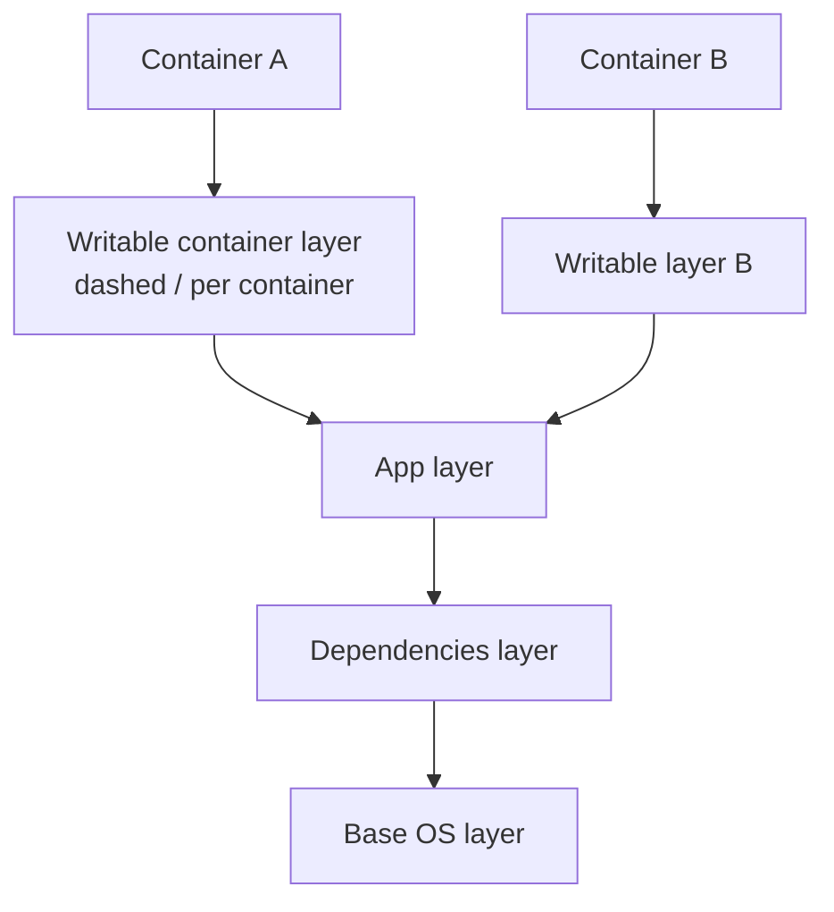
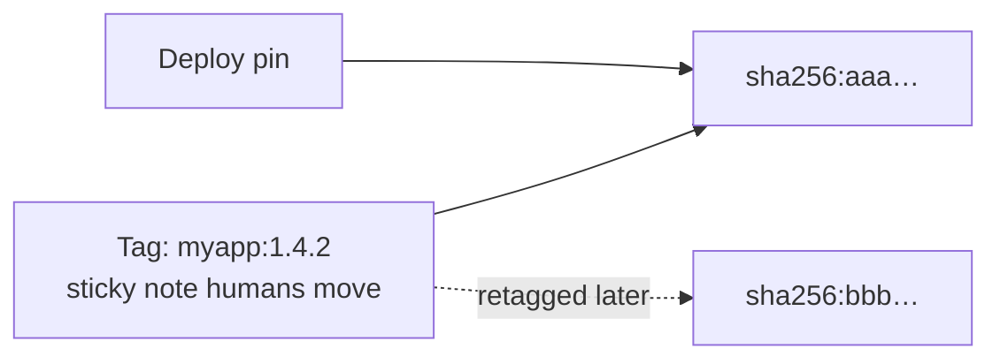
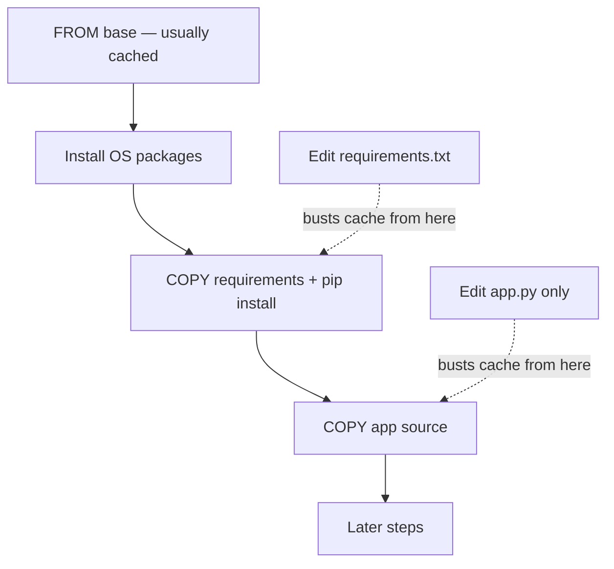
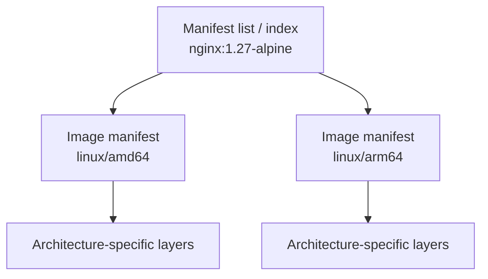

# Chapter 03 — Docker Images Deep Dive

> **Learning Objectives**
>
> By the end of this chapter, you will be able to:
>
> - Explain what image layers are and how they stack into one filesystem
> - Read an image name part by part: registry, repository, tag, and digest
> - Pull, list, inspect, tag, and remove images without breaking things
> - Say why a rebuild was fast or slow, and why an image got bigger
> - Build and pull images for more than one CPU type using `docker buildx`
> - Explain why `latest` is fine for a demo and wrong for production

---

## 03.1 Skyscrapers Built From Floors

Imagine a skyscraper built from pre-made floors, dropped into place one at a time. The ground floor is a small set of Linux files. The next floor adds a language runtime, such as Python. The floor above that holds your application code.

Two buildings can share the same lower floors and still differ at the top. You only rebuild a floor when that floor changes, and every floor above it.


*Figure 03.A: Image layers stack like floors of a building—shared below, unique on top.*

Docker **images** are built the same way. Each step of a build usually adds one **layer**, a saved set of file changes. Containers made from the same image share those read-only layers on disk, which saves both space and download time.

Once layers click, three other things stop being mysterious: why images are the size they are, why some rebuilds take seconds and others take ten minutes, and what a security scanner is actually looking at.

This is also the chapter where “ship the exact same thing everywhere” becomes real. By the end you should refuse to treat a movable tag as an identity, read `RepoDigests` without flinching, and ask “which CPU type?” before every build.

> ⚠️ **Common Pitfall:** You might think image commands are optional because CI builds everything for you. They are not. When a server cannot download an image, when two environments disagree, or when you see `exec format error`, this is the knowledge that ends the outage.

---

## 03.2 What an Image Contains

### In plain terms

An image is a stack of saved file changes plus a small settings file that says how to start the app. Each saved set of changes is a **layer**, and each layer records only what that build step added, changed, or deleted.

Why not just one big folder? Because stacking gives you two things at once. The first is **sharing**: ten containers can use the same base layers on disk instead of ten copies. The second is **immutability**: the lower layers never change, so a container writing a log file cannot alter the image other containers are using.

When a container starts, Docker adds a thin writable layer on top—a rooftop patio built on floors that stay read-only. Anything the app writes lands on the patio, not in the building.

If your mental model stays at “an image is a zip file of my app,” three things will keep surprising you: why some rebuilds skip most steps, why a digest is a stronger name than a tag, and why deleting one container does not free the base operating system layer.

> 💡 **In one line:** An image is a stack of read-only layers shared by every container that uses it; each container only owns the thin writable layer on top.

> ⚠️ **Common Pitfall:** You might think editing a file inside a running container changes the image. It does not. You changed that container’s writable layer only. A new container from the same image starts clean, unless you rebuild the image (or run `docker commit`, which is discouraged).

### Under the hood

Here is what actually sits inside an image:

- A stack of **filesystem layers**, where each layer is a set of file changes (a **diff**)
- A **config JSON** file: default command, entrypoint, environment variables, working directory, user, exposed ports, volumes, and labels
- **Metadata** the registry and engine use: CPU architecture, operating system, and digests

When a container starts, Docker adds a thin **writable layer** on top. Every change made inside the running container lands there, unless you mounted a volume for it. The image layers below never change.



*Figure 03.1: Read-only image layers stack under a thin writable container layer; multiple containers can share the same lower layers.*

Inspect config fields after you pull an image:

```bash
$ docker pull python:3.12-slim
$ docker inspect python:3.12-slim --format '{{.Os}}/{{.Architecture}} Cmd={{json .Config.Cmd}} User={{.Config.User}}'
```

```text
linux/amd64 Cmd=["python3"] User=
```

Empty `User` usually means root unless the image set another user—note it for later hardening.

**What breaks if you assume `SIZE` in `docker images` is unique disk:** shared layers mean summing sizes overcounts. Use `docker system df` for real consumption.

### In production

**Ownership:** app teams own what goes into application layers; platform owns approved base images and scan policy for the final artifact.

Treat image contents as your attack surface and your deploy contract. Smaller images with fewer packages usually mean faster pulls, smaller blast radius, and clearer SBOMs. Prefer promoting an immutable digest over rebuilding “the same tag” on every environment.

**Failure mode:** a “slim” image that still ships a compiler toolchain in the final stage. **Detect:** `docker history` and scanners show build packages; size jumps in CI. **Mitigate:** multi-stage builds (Chapter 04); fail the pipeline on unexpected size/CVE budgets.

**Do:** inspect `Cmd`, `User`, and digests before promoting. **Don’t:** treat an unreproducible local `docker commit` as a release artifact.

**Before you leave this section**

- **Understand:** Image = read-only layers + config; container adds a writable layer.
- **Try:** Pull `python:3.12-slim` and inspect Os/Arch, Cmd, and User.
- **Watch in prod:** Final images that still contain build toolchains.

---

## 03.3 Image Names, Tags, and Digests

### In plain terms

A tag is a sticky note humans move around (“this is version 1.27-alpine”). A digest is a fingerprint of the exact bytes. Sticky notes can be moved; fingerprints cannot.

The problem digests solve is trust across time and machines. Humans like `1.4.2`; machines and auditors need “these exact bytes.” If your promotion story only says “deploy `myapp:prod`,” you have a nickname, not an identity.

> ⚠️ **Common Pitfall:** You might think `latest` means “newest stable.” It is only a convention. It moves when someone pushes, and it may not be what you think.

### Under the hood

A familiar reference looks like:

```text
nginx:1.27-alpine
python:3.12-slim
ghcr.io/acme/task-api:1.4.2
```

General form:

```text
[registry/][namespace/]repository[:tag]
```

| Part | Example | Meaning |
|------|---------|---------|
| Registry | `ghcr.io` | Where to pull from (default: Docker Hub / `docker.io`) |
| Namespace/repo | `library/nginx` or `acme/task-api` | Image path |
| Tag | `1.27-alpine` | Mutable pointer humans maintain |

A **digest** (`sha256:…`) identifies content immutably:

```bash
$ docker pull nginx@sha256:DIGEST_HERE
```

After a pull, find digests you actually have:

```bash
$ docker inspect nginx:alpine --format '{{json .RepoDigests}}'
```

```text
["nginx@sha256:aaaaaaaaaaaaaaaaaaaaaaaaaaaaaaaaaaaaaaaaaaaaaaaaaaaaaaaaaaaaaaaa"]
```

#### The `latest` trap

`nginx` means `nginx:latest`. **latest** is only a convention—it is not guaranteed to be the newest stable, and it moves. Fine for quick demos; risky as your only production pin.

| Pointer | Mutable? | Best for |
|---------|----------|----------|
| Tag (`1.4.2`, `alpine`) | Yes — can be moved | Human-friendly names |
| Digest (`sha256:…`) | No — content identity | Promotion and audit |
| `latest` | Yes — and ambiguous | Demos only |



*Figure 03.2: Tags are movable pointers; digests identify exact bytes you promote.*

**What breaks if two environments pull the same tag a week apart:** they can run different bytes while dashboards still show the same tag string. Incidents become “but we both run 1.4.2!” arguments. Compare digests.

### In production

**Ownership:** app teams mint version tags; release engineering / platform enforces digest pins in prod deploy paths and retention.

- Use versioned tags for humans (`1.4.2`, `1.4.2-alpine`).
- Record digests in release notes, GitOps manifests, or deploy systems.
- Ban floating `:latest` in production deploy configs.
- When promoting across environments, promote the digest you tested—not a retagged name that might have moved.

**Failure mode:** someone retags `prod` after a hotfix and staging silently drifts. **Detect:** digest mismatch between env manifests; registry webhook on tag move. **Mitigate:** immutable tags + digest references in deploy manifests; deny `:latest` via policy.

> 🏭 **Production floor:** Promote by digest. In regulated environments, deploy specs should reference `image@sha256:…` (or an immutable tag that is never overwritten). Incident tickets list intended digest vs observed digest before debating application code.

**Do:** pin what you tested. **Don’t:** let `:latest` or a movable `:prod` be the only identifier in production.

**Before you leave this section**

- **Understand:** Tags move; digests identify bytes.
- **Try:** Pull an image and save its `RepoDigests` value to a text file.
- **Watch in prod:** Deploy configs that only mention floating tags.

---

## 03.4 Working With Images on Your Machine

### In plain terms

Your daily toolkit is short: list what you have, pull what you need, inspect what is inside, tag for renaming, remove what you no longer need. Fluency here pays rent every day—slow image hygiene becomes disk-full outages and “where did my image go?” confusion.

> ⚠️ **Common Pitfall:** Treating `IMAGE ID` as something you paste into production manifests. Prefer registry digests (`RepoDigests`) for cross-machine identity.

### Under the hood

#### List images

```bash
$ docker images
```

```text
REPOSITORY   TAG       IMAGE ID       CREATED       SIZE
nginx        alpine    3f8a3b2c1d0e   2 weeks ago   43.2MB
hello-world  latest    d2c94e258dcb   3 months ago  9.14kB
```

`IMAGE ID` is a short local ID—not a substitute for a registry digest when coordinating teams.

#### Pull explicitly

```bash
$ docker pull python:3.12-slim
```

```text
3.12-slim: Pulling from library/python
...
Status: Downloaded newer image for python:3.12-slim
docker.io/library/python:3.12-slim
```

#### Inspect

```bash
$ docker inspect python:3.12-slim
```

Useful fields: `Architecture`, `Os`, `Config.Env`, `Config.Cmd`, `Config.Entrypoint`, `Config.WorkingDir`, `RootFS.Layers`, `RepoDigests`.

#### History (layers as humans see them)

```bash
$ docker history python:3.12-slim
```

```text
IMAGE          CREATED       CREATED BY                                      SIZE
abcdefghijkl   10 days ago   CMD ["python3"]                                 0B
abcdefghijkl   10 days ago   # buildkit …                                    15MB
...
```

Not every Dockerfile line equals one neat row after BuildKit optimizations, but history still teaches what contributed weight.

#### Tag (rename / retarget)

Tagging creates an additional **name** for the same image ID—it does not duplicate layers.

```bash
$ docker tag python:3.12-slim my-python:dev
$ docker images my-python
```

#### Remove

```bash
$ docker rmi hello-world
```

You cannot remove an image while a container (even stopped) still references it—remove or prune containers first (`docker rm`, or `docker container prune`).

```bash
$ docker image prune
```

Removes dangling images (untagged intermediates). Use with care on shared machines.

```bash
$ docker system df
```

Shows real disk use for images, containers, and volumes—more trustworthy than summing the `SIZE` column.

**What breaks if you `docker rmi -f` without checking containers:** you can force-remove and leave yourself unable to restart a stopped container that needed that image until you re-pull.

### In production

**Ownership:** platform sets prune policies on CI agents; developers avoid deleting the only local copy of a prod digest without a registry backup.

Automate cleanup in CI agents and developer laptops (`docker image prune`, retention policies on registries). Never delete “old” images that are still the only local copy of what production digests expect without a registry backup story.

**Failure mode:** aggressive prune on a bastion that was caching the only copy of an air-gapped image. **Detect:** sudden ImagePull failures after cleanup windows. **Mitigate:** registry is source of truth; nodes pull from registry, not from a peer’s accidental cache.

**Do:** `docker system df` before big prunes. **Don’t:** `docker system prune -a` on shared builders without a change window.

**Before you leave this section**

- **Understand:** tag renames; rmi refuses when containers reference; `system df` beats summing SIZE.
- **Try:** Tag an image, confirm shared IMAGE ID, remove only the extra tag.
- **Watch in prod:** Unscheduled prune jobs on shared builders.

---

## 03.5 Layers, Caching, and Sharing

### In plain terms

If the lower floors of the skyscraper did not change, builders can reuse them. That is why Dockerfile order matters: put slow, stable work early; put frequently changing app code late.

Cache is a performance feature with a correctness edge. When it works, rebuilds are fast. When you misunderstand inputs, you can ship stale layers or be surprised that “I changed a file” rebuilt half the world.

> ⚠️ **Common Pitfall:** Copying the entire repo before installing dependencies. Any code edit busts the dependency layer—every time.

### Under the hood

Builders try to **reuse layers** when inputs have not changed (Chapter 04 goes deep on Dockerfiles):

1. Put rarely changing steps early (base OS packages).
2. Copy dependency manifests before full source so dependency layers cache across code edits.
3. Expect any changed file in a `COPY` to invalidate that step *and* all following steps.



*Figure 03.3: Put stable work early — a source edit should not rebuild dependency layers.*

Shared base layers across images also mean ten services `FROM python:3.12-slim` do not store ten full copies of the base on the daemon—storage is content-addressed.

```bash
$ docker history --human myapp:1.0
```

**What breaks if a base tag moves under you:** cache keys and security posture change while your Dockerfile text looks unchanged. Pin bases by digest when you need bit-for-bit reproducibility.

### In production

**Ownership:** app teams structure Dockerfiles for cache; platform provides BuildKit cache backends in CI so agents are not cold every run.

Cache hits are a performance feature and a correctness hazard if you misunderstand inputs. Pin base digests when you need bit-for-bit reproducibility; invalidate deliberately when security patches land.

**Failure mode:** CI “green” using a week-old cached base with a critical CVE. **Detect:** scan the final digest every promote; periodically `--no-cache` or rebuild on base digest change. **Mitigate:** digest-pin bases; scheduled rebuilds; cache bust on advisories.

**Do:** order Dockerfiles for stable-first caching. **Don’t:** confuse “cache hit” with “still patched.”

**Before you leave this section**

- **Understand:** Changed COPY inputs invalidate that step and everything after.
- **Try:** Sketch where `requirements.txt` vs `app.py` edits bust cache on Figure 03.3.
- **Watch in prod:** Long-lived CI caches with no base-image refresh policy.

---

## 03.6 Registries in Practice

### In plain terms

A registry is where images live when they are not only on your laptop. Docker Hub is the default public warehouse; companies usually add a private one. Without a registry strategy, “it works on my machine” never becomes “it works on the node.”

> ⚠️ **Common Pitfall:** Anonymous Hub pulls in CI until you hit rate limits at the worst possible time (release day).

### Under the hood

Default pulls use **Docker Hub** (`docker.io`). Official images often live under `library/` (shown as `nginx` without a user prefix).

Common operations:

```bash
$ docker login
$ docker tag myapp:1.0 registry.example.com/team/myapp:1.0
$ docker push registry.example.com/team/myapp:1.0
```

```text
The push refers to repository [registry.example.com/team/myapp]
...
1.0: digest: sha256:bbbb... size: 1234
```

Rate limits, authentication, and private registries appear again in Chapter 10. For now: if pulls fail with `429` or auth errors, the problem is registry access—not your Dockerfile.

**What breaks if push credentials can overwrite any tag:** a compromised laptop can replace `prod` bytes. Separate push roles; prefer immutable tags; require digest verification on deploy.

### In production

**Ownership:** platform owns registry HA, auth, and mirrors; app teams own repositories and who can push to them.

- Prefer org or private registries for internal apps.
- Enforce pull-through caches or mirrors when Hub rate limits hurt CI.
- Sign and scan images as part of promotion (Chapter 10 and later CI chapters).

**Do:** authenticate CI pulls; mirror critical bases. **Don’t:** rely on anonymous Hub from ephemeral runners.

> 🏭 **Production floor:** The registry is part of your blast radius. If it is down, autoscaling cannot pull. Budget registry SLOs like you budget the database—not like optional developer tooling.

**Before you leave this section**

- **Understand:** Push/pull via registry is how images leave your laptop.
- **Try:** `docker login` against a registry you use (or Hub) and pull an authenticated image.
- **Watch in prod:** CI 429s and missing mirrors for hot base images.

---

## 03.7 Multi-Platform Images and buildx Basics

### In plain terms

Your Mac might be arm64 while your server is amd64. A multi-platform image is a “table of contents” (manifest list / index) that points to the right architecture variant. The engine picks the matching one—or you ask for a specific platform explicitly.

The misconception: “I pulled `python:3.12-slim` so every machine has the same bytes.” You pulled *your* platform’s variant of that name. The tag is shared; the layers often are not.

> ⚠️ **Common Pitfall:** Building only for your laptop’s arch and pushing `:latest`. Production amd64 nodes fail with `exec format error`.

### Under the hood

Many Hub images are **manifest lists** pointing to `linux/amd64`, `linux/arm64`, and other variants. On an Apple silicon Mac, `docker pull` typically selects `arm64` automatically. When you deploy to an `amd64` server, build or pull for that platform explicitly:

```bash
$ docker pull --platform linux/amd64 python:3.12-slim
$ docker inspect python:3.12-slim --format '{{.Os}}/{{.Architecture}}'
```

```text
linux/amd64
```

**Buildx** is the modern BuildKit client used by `docker build` on Docker Engine 29.x. Multi-platform *builds* usually look like:

```bash
$ docker buildx version
$ docker buildx ls
```

```bash
$ docker buildx build --platform linux/amd64,linux/arm64 -t myapp:1.0 --push .
```

Notes that save hours:

- Fresh Docker Engine **29.x** / Desktop installs typically use the **containerd image store**, which supports multi-platform images locally. Older or upgraded setups may need a `docker-container` buildx driver and `--push` to a registry instead of `--load` for multi-arch outputs.
- Emulation (QEMU) can build foreign architectures slowly; cross-compilation in multi-stage Dockerfiles is often faster when your language supports it (Chapter 04).
- Automatic platform build-args such as `BUILDPLATFORM` and `TARGETPLATFORM` help write portable Dockerfiles.



*Figure 03.4: A multi-platform tag is an index that points at per-architecture manifests and their layers.*

**What breaks if you `--load` a multi-platform build on an old graph-driver setup:** the load may be rejected. Push a manifest list to a registry or use a compatible builder driver.

### In production

**Ownership:** CI owns explicit `--platform` matrices; app teams confirm their binaries/wheels support each arch they claim.

- Build and test for every architecture you deploy to—do not assume “it pulled on my M-series Mac” means “it runs on the amd64 node pool.”
- In CI, set `--platform` explicitly for release pipelines.
- Pin base images by digest *per platform* when auditing supply chain; remember a tag’s multi-arch index can move even when you think of it as one name.

> 💡 **Tip:** If a container crashes with `exec format error`, you almost always ran the wrong CPU architecture for the host.

**Do:** test one container per release arch. **Don’t:** treat laptop pulls as proof for server arch.

**Before you leave this section**

- **Understand:** A multi-arch tag is an index; each arch has its own layers.
- **Try:** `docker pull --platform linux/amd64 python:3.12-slim` and inspect Architecture.
- **Watch in prod:** `exec format error` after Mac-only builds.

---

## 03.8 Image Size Literacy

### In plain terms

Smaller images usually pull faster, start sooner under autoscaling, and carry fewer unused packages an attacker could abuse. Size is not vanity—it is pull latency, node disk, and attack surface.

> ⚠️ **Common Pitfall:** Switching to Alpine “because small” without checking libc assumptions. Some Python wheels expect glibc (Debian `slim`) and misbehave on musl.

### Under the hood

Strategies (expanded in Chapter 04): slim bases carefully, multi-stage builds, no compilers in final images, `.dockerignore`, and deleting package caches in the same layer that created them.

Alpine is small but uses musl libc—some Python wheels behave differently than on Debian `slim`. Prefer predictable `slim` bases for many Python apps unless you know you want Alpine.

```bash
$ docker images --format 'table {{.Repository}}\t{{.Tag}}\t{{.Size}}'
$ docker history --human --no-trunc myapp:1.0
```

**What breaks if you delete caches in a later layer than you created them:** the fat layer still exists underneath; final size barely shrinks. Cleanup must happen in the same `RUN` that dirtied the filesystem.

### In production

**Ownership:** app teams keep final stages lean; platform may enforce soft size budgets in CI.

Track image size in CI as a soft budget. Investigate sudden size jumps—they often mean a debug toolchain or cache directory leaked into the final stage.

**Failure mode:** a 1.5 GB debug image promoted because “it worked.” **Detect:** size delta alerts; history shows compilers in final stage. **Mitigate:** multi-stage; block promote over budget without waiver.

**Do:** budget size next to CVE policy. **Don’t:** optimize Alpine micro-savings while shipping build-essential in runtime.

**Before you leave this section**

- **Understand:** Size affects pull time, disk, and attack surface; cleanup must be same-layer.
- **Try:** Compare `docker history` of a fat vs slim base you already pulled.
- **Watch in prod:** Sudden image size jumps on otherwise small commits.

---

## 03.9 Common Pitfalls

> ⚠️ **Common Pitfall:** Treating tags as immutable.  
> `myapp:prod` can point to different bytes next week. Record digests in release notes or deploy by digest.

> ⚠️ **Common Pitfall:** Deleting “old” images that are still the base of running containers.  
> Remove containers first; understand dependencies with `docker ps -a` and `docker inspect`.

> ⚠️ **Common Pitfall:** Assuming `SIZE` in `docker images` is uniquely occupied disk.  
> Shared layers mean summing the SIZE column overcounts actual disk usage. Prefer `docker system df`.

> ⚠️ **Common Pitfall:** Pulling `:latest` in scripts.  
> Yesterday’s successful deploy can become tomorrow’s surprise upgrade.

> ⚠️ **Common Pitfall:** Ignoring platform.  
> Building only for your laptop’s arch and pushing `:latest` breaks the other arch in production with cryptic exec errors.

---

## 03.10 Hands-On Exercises

1. Pull two tagged variants of the same product, for example `nginx:alpine` and `nginx:stable-alpine` (or similar current tags). Compare `docker history` and reported sizes.
2. Run `docker inspect nginx:alpine` and write down `Config.Cmd`, `Config.ExposedPorts`, and `RepoDigests`.
3. Tag `nginx:alpine` as `local/nginx:lab`, confirm both names share the same IMAGE ID, then `docker rmi local/nginx:lab` and confirm the underlying image remains if still tagged `nginx:alpine`.
4. Pull `python:3.12-slim` and save a digest from `RepoDigests` into a text file as practice for pinning.
5. Run `docker pull --platform linux/amd64 python:3.12-slim` (on any machine) and compare `Architecture` via `docker inspect` to a default pull on an arm64 Mac if you have one.
6. Run `docker buildx ls` and `docker system df`. Note your default builder and image disk usage.

---

## 03.11 Check Your Understanding

**Q1.** What is the relationship between an image layer and a container’s writable layer?

<details>
<summary>Show answer</summary>

Image layers are read-only and shared. Each container gets its own thin writable layer on top where filesystem changes are stored (unless redirected to mounts).

</details>

**Q2.** Why are digests safer than tags for production promotion?

<details>
<summary>Show answer</summary>

Tags are mutable pointers and can be moved to new content. Digests identify exact bytes, so the same digest always refers to the same image content.

</details>

**Q3.** Does `docker tag` copy all layer data?

<details>
<summary>Show answer</summary>

No. It adds another name referencing the same image ID and layers.

</details>

**Q4.** Why might `docker rmi` refuse to delete an image?

<details>
<summary>Show answer</summary>

Because one or more containers still reference it. Remove those containers first, or force only when you understand the consequences.

</details>

**Q5.** What problem do multi-platform images solve?

<details>
<summary>Show answer</summary>

They let one name (tag) resolve to architecture-specific image variants—for example amd64 and arm64—so clients pull (or run) the correct binary for their CPU without maintaining separate unrelated names.

</details>

---

## 03.12 Key Takeaways

- Images are immutable layered templates plus config; containers add a writable layer.
- Read references as registry/repository:tag and prefer digests for immutable identity.
- `pull`, `images`, `inspect`, `history`, `tag`, and `rmi` are your daily image toolkit.
- Layer caching and sharing explain build speed and disk behavior.
- Multi-platform awareness (and buildx) prevents “works on my Mac, fails on the server” surprises.
- Avoid relying on `latest` for anything you care about reproducing.
- In production, promote digests, mirror registries for CI, and treat size + CVE budgets as first-class gates.

---

## 03.13 Official documentation map

| Topic | Official page |
|-------|---------------|
| What is an image? | [What is an image?](https://docs.docker.com/get-started/docker-concepts/the-basics/what-is-an-image/) |
| docker image CLI | [docker image](https://docs.docker.com/reference/cli/docker/image/) |
| Build overview / BuildKit | [Docker Build overview](https://docs.docker.com/build/concepts/overview/) |
| Multi-platform builds | [Multi-platform images](https://docs.docker.com/build/building/multi-platform/) |
| buildx build | [docker buildx build](https://docs.docker.com/reference/cli/docker/buildx/build/) |
| Docker Hub / registries | [Docker Hub](https://docs.docker.com/docker-hub/) |

**Previous:** [Chapter 02 — Installation and Architecture](02-docker-installation-and-architecture.md) | **Next:** [Chapter 04 — Dockerfiles and Builds](04-dockerfiles-and-builds.md)
