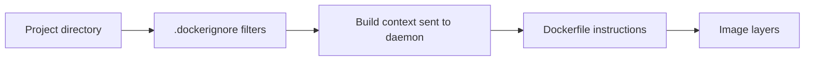
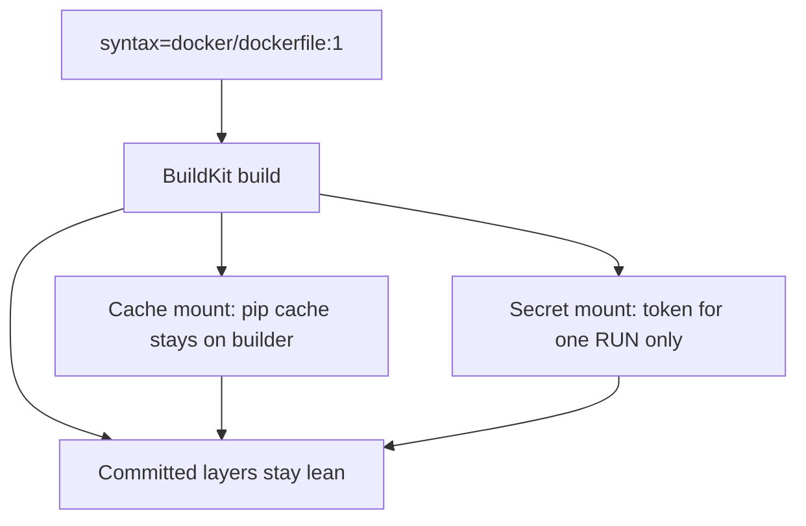
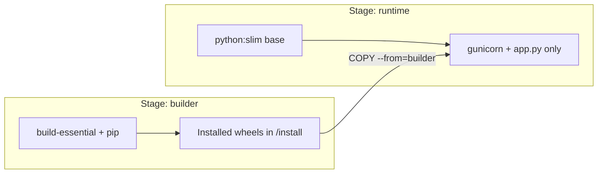
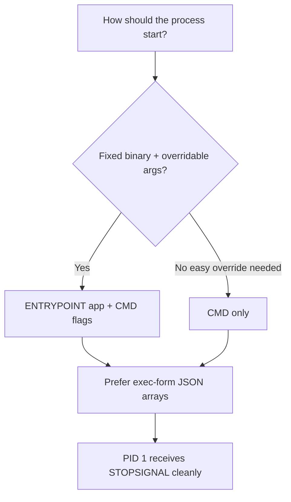

# Chapter 04 — Dockerfiles and Builds

> **Learning Objectives**
>
> By the end of this chapter, you will be able to:
>
> - Author a clear Dockerfile and explain each major instruction
> - Build a small Flask **Task API** with sensible image hygiene
> - Use `.dockerignore`, multi-stage builds, BuildKit cache mounts, and build secrets
> - Apply `ONBUILD`, `STOPSIGNAL`, and `SHELL` when they earn their place
> - Build for multiple platforms with buildx basics
> - Distinguish `CMD` versus `ENTRYPOINT` and `COPY` versus `ADD`

---

## 04.1 From Recipe Card to Kitchen Line

A **Dockerfile** is a recipe. The build engine follows instructions in order, committing filesystem layers as it goes. A sloppy recipe—copy the entire home directory, install compilers you never need at runtime, run as root forever—produces a slow, fragile, oversized dish. A careful recipe produces something you would actually serve to guests (production).

In this chapter you will build a tiny but real service: a **Task API** in Python Flask. The app is intentionally small so every Dockerfile line stays visible and meaningful.

---

## 04.2 The Task API (Application Code)

### In plain terms

Before optimizing the recipe, you need ingredients: a small HTTP API with a health endpoint and a task list. You will run it with Gunicorn in the container (production-like) while keeping a simple `__main__` block for local runs without Docker.

A tiny app is not a toy here—it is a controlled surface. Every Dockerfile line in this chapter maps to a file you can see. If you start with a sprawling monolith, layer caching and multi-stage wins get lost in noise.

> ⚠️ **Common Pitfall:** You might think Flask’s built-in server is “good enough in the image.” It is a development server. Under concurrency and signals, Gunicorn (or another production WSGI server) is the honest default for this book’s container.

### Under the hood

Create a project directory:

```bash
$ mkdir task-api && cd task-api
```

#### `requirements.txt`

```text
flask==3.0.3
gunicorn==22.0.0
```

#### `app.py`

```python
import os
from flask import Flask, jsonify, request

app = Flask(__name__)

tasks = [
    {"id": 1, "title": "Learn Dockerfiles", "done": False},
    {"id": 2, "title": "Build the Task API image", "done": False},
]

@app.get("/healthz")
def healthz():
    return jsonify({"status": "ok"}), 200

@app.get("/tasks")
def list_tasks():
    return jsonify(tasks), 200

@app.post("/tasks")
def create_task():
    data = request.get_json(silent=True) or {}
    title = data.get("title")
    if not title:
        return jsonify({"error": "title is required"}), 400
    new_id = max((t["id"] for t in tasks), default=0) + 1
    task = {"id": new_id, "title": title, "done": False}
    tasks.append(task)
    return jsonify(task), 201

if __name__ == "__main__":
    port = int(os.environ.get("PORT", "8000"))
    app.run(host="0.0.0.0", port=port)
```

#### `seed.json`

A tiny static file used later to demonstrate the `ADD` instruction (prefer `COPY` for ordinary source; `ADD` is shown deliberately for completeness):

```json
{
  "source": "dockerfile-demo",
  "note": "Loaded only to illustrate ADD"
}
```

Why Gunicorn in requirements if `__main__` uses Flask’s dev server? The **container** will run Gunicorn for a production-like process; the `__main__` block remains handy for local runs without Docker.

Quick local sanity check (optional):

```bash
$ python -m venv .venv
$ source .venv/bin/activate   # Windows: .venv\Scripts\activate
$ pip install -r requirements.txt
$ python app.py
```

```bash
$ curl -s http://127.0.0.1:8000/healthz
```

```json
{"status":"ok"}
```

**What breaks if `/healthz` depends on the database:** orchestrators mark you unready during DB blips even when you wanted a cheap liveness signal. Keep this health endpoint dependency-light; deeper checks belong in readiness later (Kubernetes chapters).

### In production

**Ownership:** app teams own the API code and pinned dependencies; platform owns base-image and scan expectations once it is containerized.

Pin dependency versions in `requirements.txt` (or a lock file). Do not rely on Flask’s development server under load. Keep the health endpoint cheap and dependency-light—orchestrators will call it often later in Kubernetes.

**Failure mode:** unpinned `flask` floats to a breaking major mid-rebuild. **Detect:** lockfile drift; reproducible build digests change unexpectedly. **Mitigate:** pin versions; regenerate locks in PRs.

**Do:** pin deps; keep `/healthz` cheap. **Don’t:** ship the Flask dev server as PID 1 in shared environments.

**Before you leave this section**

- **Understand:** Task API is the running example; container PID 1 will be Gunicorn.
- **Try:** Create the files and hit `/healthz` locally or skip ahead to the image run in §04.10.
- **Watch in prod:** Unpinned Python deps and heavyweight “health” checks.

---

## 04.3 Build Context and `.dockerignore`

### In plain terms

The build context is the set of files you hand the kitchen. If you hand over your entire home directory—including `.git`, virtualenvs, and `.env` secrets—builds get slow and dangerous.

`.dockerignore` is not optional polish. It is the difference between a 2 MB context and a 2 GB context, and between “secrets never entered the daemon” versus “secrets sat in an intermediate layer.”

> ⚠️ **Common Pitfall:** Relying on `.dockerignore` alone while still storing production secrets in the project folder “just for local runs.” Prefer secret mounts and runtime injection; absence is safer than exclusion.

### Under the hood

Before the Dockerfile, exclude noise from the build context. The client sends the context directory to the daemon; huge contexts slow builds and risk leaking secrets.

#### `.dockerignore`

```text
.git
.venv
__pycache__
*.pyc
*.pyo
.env
.env.*
.pytest_cache
.mypy_cache
.DS_Store
README.md
```

Never rely on `.dockerignore` alone for secrets—do not put secrets in the directory at all if you can avoid it. Prefer BuildKit **secret mounts** (section 04.8) when a build step truly needs a token.



*Figure 04.1: The build context is everything you hand the daemon — `.dockerignore` keeps junk and secrets out before `COPY` ever runs.*

```bash
$ docker build -t task-api:ctx-check .
# Watch the "transferring context" size in BuildKit output — huge numbers mean ignore rules failed
```

**What breaks if `.env` is copied then deleted in a later layer:** the secret still exists in the earlier layer and in history. Exclusion and secret mounts beat “delete later.”

### In production

**Ownership:** app teams maintain `.dockerignore` beside the Dockerfile; security/platform may CI-scan final images for credential patterns.

Review `.dockerignore` in code review the same way you review `.gitignore`. CI should fail builds that accidentally copy `.env` or cloud credential files into layers.

**Failure mode:** a developer’s cloud key in context lands in an image pushed to a shared registry. **Detect:** secret scanning on images; unexpected context size metrics. **Mitigate:** ignore rules, pre-commit checks, deny push on scan hits.

**Do:** code-review `.dockerignore`. **Don’t:** `COPY . .` as the first habit without ignore rules.

> 🏭 **Production floor:** Treat build context as a trust boundary. Anything transferred can end up in a layer someone else can pull. Blast radius of a leaked CI token in an image is “every environment that can pull that repo.”

**Before you leave this section**

- **Understand:** Context is what the client sends; `.dockerignore` filters before COPY.
- **Try:** Add `.dockerignore`, build, and note context transfer size in the build log.
- **Watch in prod:** Images that scan-hit on `.env` or cloud key patterns.

---

## 04.4 Dockerfile Instructions You Must Know

### In plain terms

Each instruction is a step on the recipe card. Some change files (`RUN`, `COPY`), some set defaults for later (`ENV`, `WORKDIR`, `USER`), and some document intent (`EXPOSE`, `LABEL`). Learning the *why* of each instruction prevents cargo-cult Dockerfiles that copy flags from Stack Overflow without knowing which layers they create.

> ⚠️ **Common Pitfall:** You might think `EXPOSE` publishes a port to your laptop. It documents intent only. Publishing still requires `-p` / Compose ports / a Service.

### Under the hood

Here is a **teaching Dockerfile** that intentionally exercises the major instructions. Comments explain *why*. In real services you may omit `ADD` and `VOLUME` unless needed; you should still recognize them.

#### `Dockerfile`

```dockerfile
# syntax=docker/dockerfile:1

############################
# Stage 1 — build deps
############################
ARG PYTHON_VERSION=3.12
FROM python:${PYTHON_VERSION}-slim AS builder

ENV PYTHONDONTWRITEBYTECODE=1 \
    PYTHONUNBUFFERED=1

WORKDIR /build

RUN apt-get update \
    && apt-get install -y --no-install-recommends build-essential \
    && rm -rf /var/lib/apt/lists/*

COPY requirements.txt .
RUN --mount=type=cache,target=/root/.cache/pip \
    pip install --prefix=/install -r requirements.txt

############################
# Stage 2 — runtime image
############################
ARG PYTHON_VERSION=3.12
FROM python:${PYTHON_VERSION}-slim AS runtime

ARG APP_VERSION=0.1.0
LABEL org.opencontainers.image.title="task-api" \
      org.opencontainers.image.version="${APP_VERSION}"

ENV PYTHONDONTWRITEBYTECODE=1 \
    PYTHONUNBUFFERED=1 \
    PORT=8000 \
    APP_HOME=/app

WORKDIR ${APP_HOME}

# Prefer COPY for ordinary local files. ADD can also fetch remote URLs and
# auto-extract local archives—powerful, and easy to misuse.
COPY --from=builder /install /usr/local
COPY app.py .
ADD seed.json ./seed.json

RUN useradd --create-home --uid 10001 --shell /usr/sbin/nologin appuser \
    && mkdir -p /var/lib/task-api \
    && chown -R appuser:appuser ${APP_HOME} /var/lib/task-api

# Declare a mount point for future persistent data (metadata + auto-created volume).
VOLUME ["/var/lib/task-api"]

# Prefer SIGTERM for graceful Gunicorn shutdown (docker stop default).
STOPSIGNAL SIGTERM

USER appuser

EXPOSE 8000

HEALTHCHECK --interval=30s --timeout=3s --start-period=10s --retries=3 \
  CMD python -c "import urllib.request; urllib.request.urlopen('http://127.0.0.1:8000/healthz')" || exit 1

# ENTRYPOINT is the fixed executable; CMD supplies default args.
ENTRYPOINT ["gunicorn"]
CMD ["--bind", "0.0.0.0:8000", "--workers", "2", "app:app"]
```

#### Instruction field guide

| Instruction | Why it exists | Notes |
|-------------|---------------|-------|
| `FROM` | Sets the base image (starts a stage) | First non-comment instruction; multi-stage uses multiple `FROM`s |
| `ARG` | Build-time variables | Unavailable at runtime unless you also `ENV` them |
| `ENV` | Runtime environment defaults | Persist in image config |
| `WORKDIR` | Sets cwd for later instructions and at runtime | Creates the directory if needed |
| `RUN` | Executes commands at **build** time | Chain cleanup in the same layer |
| `COPY` | Copies local build-context files | Prefer over `ADD` for ordinary files |
| `ADD` | Copy plus extras (remote URL, auto-tar extract) | Easy foot-gun; use sparingly |
| `USER` | Switches user for later steps and runtime | Prefer non-root |
| `VOLUME` | Declares mount points | Anonymous volumes can surprise you |
| `EXPOSE` | Documents intended ports | Does not publish ports by itself |
| `ENTRYPOINT` | Primary executable | Often paired with `CMD` as default args |
| `CMD` | Default args or default command | Overridden easily at `docker run` |
| `LABEL` | Metadata for humans and tools | Use OCI annotation keys when possible |
| `HEALTHCHECK` | Engine-level liveness probe | Complements—not replaces—orchestrator probes |
| `STOPSIGNAL` | Signal used for `docker stop` | Match what your PID 1 expects |
| `SHELL` | Changes the shell for shell-form instructions | Rare; see section 04.7 |
| `ONBUILD` | Triggers for *downstream* images | Powerful; easy to surprise consumers—see 04.7 |

```bash
$ docker build -t task-api:0.1.0 .
$ docker inspect task-api:0.1.0 --format 'User={{.Config.User}} Entrypoint={{json .Config.Entrypoint}} Cmd={{json .Config.Cmd}}'
```

```text
User=appuser Entrypoint=["gunicorn"] Cmd=["--bind","0.0.0.0:8000","--workers","2","app:app"]
```

**What breaks if you omit `USER`:** the process runs as root inside the container by default on many bases—larger blast radius after a remote code execution bug.

### In production

**Ownership:** app teams author Dockerfiles; platform defines baseline hygiene (non-root, approved bases, scan gates) enforced in CI.

Baseline hygiene checklist:

1. Prefer specific base tags (`3.12-slim`), not floating mystery tags alone.
2. Run as non-root (`USER`).
3. Multi-stage to drop build tools.
4. `.dockerignore` to keep secrets and junk out of context.
5. Do not `curl | bash` unpinned scripts in Dockerfiles.
6. Pin language packages.
7. Scan images in CI before promotion.
8. Least privilege: no `--privileged` for this API.

**Failure mode:** floating `FROM python:latest` plus root user ships a surprise base upgrade as root. **Detect:** inspect `User` and base digest in CI; admission/policy later in Kubernetes. **Mitigate:** pin bases (ideally by digest); require `USER` non-root.

**Do:** make the inspect one-liner part of review. **Don’t:** treat `EXPOSE` as networking.

> 🏭 **Production floor:** Pin the *runtime* base by digest for release builds when you need bit-for-bit promotion. A floating `python:3.12-slim` tag can move between the build you tested and the rebuild someone runs “the same way” on Friday.

**Before you leave this section**

- **Understand:** Major instructions either mutate layers, set config, or document intent.
- **Try:** Build the teaching Dockerfile and inspect User / Entrypoint / Cmd.
- **Watch in prod:** Root-default images and unpinned `FROM` lines in release Dockerfiles.

---

## 04.5 Build With BuildKit and Cache Mounts

### In plain terms

BuildKit is the modern oven. It builds faster, understands cache mounts and secrets, and powers `docker build` / `docker buildx` on Docker Engine 29.x. The problem it solves is the old builder’s awkwardness: slow rebuilds, secrets leaking into layers, and weak cache control.

> ⚠️ **Common Pitfall:** Confusing a **cache mount** (may persist on the builder) with a **secret mount** (must not land in layers). They both use `--mount`, but their trust models differ.

### Under the hood

The `# syntax=docker/dockerfile:1` directive enables modern Dockerfile features (cache mounts, better heredocs, secret mounts, and so on).

```bash
$ docker build -t task-api:0.1.0 .
```

Sample output (truncated):

```text
[+] Building 24.3s (14/14) FINISHED
 => [internal] load build definition from Dockerfile
 => [builder 1/5] FROM docker.io/library/python:3.12-slim
 => [builder 4/5] COPY requirements.txt .
 => [builder 5/5] RUN pip install --prefix=/install -r requirements.txt
 => [runtime 5/6] COPY app.py .
 => exporting to image
 => => naming to docker.io/library/task-api:0.1.0
```

Pass build-time version:

```bash
$ docker build --build-arg APP_VERSION=0.1.0 -t task-api:0.1.0 .
```

The `RUN --mount=type=cache,target=/root/.cache/pip` line keeps a pip cache *across builds* without committing cache files into image layers. That is BuildKit’s “why”: faster rebuilds without fatter images.



*Figure 04.2: BuildKit separates ephemeral mounts (cache, secrets) from what gets committed into image layers.*

```bash
$ docker history task-api:0.1.0
```

**What breaks if BuildKit is disabled or an ancient builder is forced:** cache mounts and secret mounts fail or are ignored; builds get slower and riskier. On Engine 29.x, BuildKit is the expected default—investigate if someone set `DOCKER_BUILDKIT=0`.

### In production

**Ownership:** platform enables BuildKit and registry cache exporters in CI; app teams write Dockerfiles that use mounts correctly.

Keep BuildKit enabled (default on current Desktop/Engine). In CI, use cache exporters or registry cache backends so agents do not cold-start every pipeline. Never confuse “cache mount” with “secret mount”—caches can persist on builders; secrets must not land in layers.

**Failure mode:** shared CI builder cache retains a secret because someone used a cache mount for credentials. **Detect:** secret scanning; audit Dockerfile mounts in review. **Mitigate:** secrets only via `type=secret`; scrub builders; rotate on suspicion.

**Do:** keep `# syntax=docker/dockerfile:1` and cache mounts for package managers. **Don’t:** set `DOCKER_BUILDKIT=0` “to make it work” without understanding what you lose.

**Before you leave this section**

- **Understand:** BuildKit separates ephemeral mounts from committed layers.
- **Try:** Build twice and confirm the second build reuses cached steps.
- **Watch in prod:** CI agents with cold caches every run, or `DOCKER_BUILDKIT=0`.

---

## 04.6 Multi-Stage Builds

### In plain terms

**Why:** Compilers and build tooling are needed to *install* dependencies, not to *serve* HTTP. If you leave `build-essential` in the final image, you ship extra attack surface and megabytes.

**How:** Stage `builder` installs into `/install`; stage `runtime` copies only `/install` and `app.py`. The final image never contains the compiler packages from the builder stage.

Multi-stage is the clearest “production floor” habit in Dockerfiles: the image you run should not be the image you compiled in.



*Figure 04.3: Multi-stage builds compile or install in a heavy stage, then copy only runtime artifacts into a slim final image.*

> ⚠️ **Common Pitfall:** Copying the entire builder filesystem into runtime “to be safe.” You just dragged the toolchain back in.

### Under the hood

Contrast with a simpler single-stage file (larger / less ideal):

```dockerfile
FROM python:3.12-slim
WORKDIR /app
COPY requirements.txt .
RUN pip install --no-cache-dir -r requirements.txt
COPY app.py .
EXPOSE 8000
CMD ["gunicorn", "--bind", "0.0.0.0:8000", "app:app"]
```

This works—and is fine for the first five minutes—but keeps you root by default and mixes concerns. Prefer the multi-stage version as your baseline habit.

```bash
$ docker history task-api:0.1.0
# Confirm build-essential is not in the final stage history
```

**What breaks if `COPY --from=builder` paths are wrong:** runtime missing modules at start; `ModuleNotFoundError` in logs. Fix the install prefix and copy path—not by installing compilers into runtime.

### In production

**Ownership:** app teams structure stages; platform may fail CI if scanners find compilers in the final stage.

Make “final stage has no compiler/toolchain” a review checkbox. For compiled languages, copy only the binary and required runtime libs—not the entire build tree.

**Failure mode:** “multi-stage” Dockerfile that still `apt-get install build-essential` in the final stage. **Detect:** history/scan; size budget. **Mitigate:** checklist + automated grep/scan for toolchain packages in the promoted digest.

**Do:** name stages (`AS builder`, `AS runtime`) and copy narrowly. **Don’t:** use single-stage root images as the long-term default.

**Before you leave this section**

- **Understand:** Builder tools stay in an intermediate stage; runtime copies artifacts only.
- **Try:** Compare image size of single-stage vs multi-stage Task API builds.
- **Watch in prod:** Final-stage toolchains showing up in CVE and size reports.

---

## 04.7 STOPSIGNAL, SHELL, and ONBUILD

### In plain terms

These three instructions are specialty tools. `STOPSIGNAL` tells Docker which doorbell to ring when stopping. `SHELL` changes which shell interprets shell-form commands. `ONBUILD` leaves a sticky note for *future* Dockerfiles that use your image as a base.

### Under the hood

#### `STOPSIGNAL`

```dockerfile
STOPSIGNAL SIGTERM
```

`docker stop` sends this signal (default is `SIGTERM`), waits for the grace period, then `SIGKILL`. Set it when your PID 1 expects something else (rare for Gunicorn; more common for custom runtimes). Prefer fixing the app to handle `SIGTERM` over inventing exotic stop signals.

#### `SHELL`

```dockerfile
SHELL ["/bin/bash", "-c"]
RUN echo "shell form now uses bash"
```

`SHELL` changes the default shell used by shell-form `RUN`, `CMD`, and `ENTRYPOINT`. Prefer **exec form** JSON arrays for `CMD`/`ENTRYPOINT` so you do not depend on a shell for PID 1. Use `SHELL` when a Windows container build needs `cmd` versus PowerShell, or when a complex shell-form `RUN` truly needs bash features.

#### `ONBUILD`

```dockerfile
ONBUILD COPY . /app
ONBUILD RUN pip install -r /app/requirements.txt
```

Instructions registered with `ONBUILD` execute later, when *another* Dockerfile uses `FROM` your image. They are powerful for base images (“everyone who inherits me will copy their app here”) and infamous for surprising consumers who did not read the parent Dockerfile.

```bash
$ docker inspect my-base:1 --format '{{json .Config.OnBuild}}'
```

### In production

- Document any `ONBUILD` triggers loudly in the base image README; prefer explicit child Dockerfiles over hidden triggers when teams are large.
- Keep `STOPSIGNAL` aligned with how your process manager expects shutdown.
- Avoid relying on `SHELL` for runtime `CMD`—exec form handles signals better.

> ⚠️ **Warning:** An innocent `FROM company-python:3` can suddenly run unexpected `ONBUILD` copy/install steps. Always `docker inspect` unfamiliar bases.

**Do:** inspect `OnBuild` on shared bases. **Don’t:** surprise downstream teams with heavy hidden triggers.

**Before you leave this section**

- **Understand:** STOPSIGNAL pairs with graceful stop; ONBUILD runs in *child* builds.
- **Try:** `docker inspect` a base image for `Config.OnBuild`.
- **Watch in prod:** Mystery build steps after changing a company base image.

---
## 04.8 Build Secrets (and Why Not `ARG` for Passwords)

### In plain terms

Sometimes a build needs a token—to download a private package, for example. If you pass that token as a normal build-arg or `ENV`, it can end up in image history forever. **Build secrets** let BuildKit mount the credential for one `RUN` without baking it into a layer.

The misconception is “I’ll delete the env var in the next layer.” Layer history still has the secret. Mounts fix the model: the credential was never a committed filesystem diff.

> ⚠️ **Common Pitfall:** `ARG PIP_TOKEN=…` or `ENV PIP_TOKEN=…` for private indexes. Anyone with the image can often recover it from history or config.

### Under the hood

Create a local secret file (never commit it):

```bash
$ echo 'my-private-token' > ./secret-token.txt
```

Dockerfile fragment (illustrative—Task API does not need this for public PyPI):

```dockerfile
# syntax=docker/dockerfile:1
RUN --mount=type=secret,id=pip_token \
    PIP_TOKEN=$(cat /run/secrets/pip_token) \
    && pip install --index-url "https://pypi.example.com/simple" -r requirements.txt
```

Build with:

```bash
$ docker build --secret id=pip_token,src=./secret-token.txt -t task-api:0.1.0 .
```

Or from an environment variable:

```bash
$ export PIP_TOKEN=my-private-token
$ docker build --secret id=pip_token,env=PIP_TOKEN -t task-api:0.1.0 .
```

SSH agent forwarding for private Git deps uses `--ssh` mounts (related pattern):

```bash
$ docker build --ssh default -t task-api:0.1.0 .
```

**What breaks if you forget `# syntax=docker/dockerfile:1`:** secret mounts may not parse as expected on older frontend behavior. Keep the syntax directive.

### In production

**Ownership:** security/platform owns CI vaults and secret injection; app teams own Dockerfile mount IDs matching CI configuration.

- Never use `ARG PASSWORD=…` for credentials you care about—build-args can leak via `docker history` and intermediate cache.
- Store CI secrets in the CI vault; pass them with `--secret`; scrub agent disks.
- Prefer runtime secret injection (Compose secrets, Kubernetes Secrets) for values the *running* app needs—not only build-time tokens.

**Failure mode:** token in image config discovered months later in a mirror. **Detect:** secret scanners on pushed digests; history audit. **Mitigate:** rebuild without the arg; rotate the token; block `ARG` patterns in policy.

**Do:** `--secret` for build-time creds. **Don’t:** bake runtime DB passwords into images at all—inject at run.

> 🏭 **Production floor:** A leaked build token’s blast radius is every private package feed it could read—and every image built with it. Rotate first, debate blame later. Record the affected digest range in the incident ticket.

**Before you leave this section**

- **Understand:** Secret mounts avoid committing credentials; ARG/ENV can leak via history.
- **Try:** Run the optional secret-mount exercise in §04.14 with a dummy file.
- **Watch in prod:** Dockerfiles that still pass tokens as build-args.

---
## 04.9 Multi-Platform Builds With buildx

### In plain terms

Chapter 03 explained multi-platform *images*. Here you *produce* them. One build command can target `linux/amd64` and `linux/arm64` so the same tag works on servers and Apple silicon laptops.

### Under the hood

```bash
$ docker buildx ls
$ docker buildx build \
    --platform linux/amd64,linux/arm64 \
    -t registry.example.com/team/task-api:0.1.0 \
    --push .
```

Useful automatic build-args inside Dockerfiles:

| ARG | Meaning |
|-----|---------|
| `BUILDPLATFORM` | Platform of the node executing the build |
| `TARGETPLATFORM` | Platform you are building for |
| `TARGETOS` / `TARGETARCH` | Split forms of the target |

Example pattern for cross-compilation-friendly tools:

```dockerfile
# syntax=docker/dockerfile:1
FROM --platform=$BUILDPLATFORM python:3.12-slim AS builder
ARG TARGETPLATFORM
# install/build for $TARGETPLATFORM when your toolchain supports it
```

On Engine 29.x with the containerd image store, loading multi-platform results locally is more capable than older graph-driver setups. If `--load` rejects multi-platform output, push to a registry or use a `docker-container` builder driver as documented in Docker’s multi-platform guide.

### In production

CI release jobs should build every architecture you run in production and push a single multi-arch manifest list. Test at least one container per arch in the pipeline.

**Ownership:** CI owns the platform matrix; app teams confirm native deps work per arch.

**Do:** `--platform` explicitly in release jobs. **Don’t:** assume Mac pulls prove server arch.

**Before you leave this section**

- **Understand:** buildx can emit multi-arch indexes; load vs push depends on image store/driver.
- **Try:** `docker buildx ls` and note your default builder.
- **Watch in prod:** Single-arch pushes to multi-arch node pools.

---

## 04.10 Run the Task API Container

### In plain terms

Building is half the job. Running proves the recipe works: publish a port, hit the API, then practice overriding `CMD` versus `ENTRYPOINT`.

> ⚠️ **Common Pitfall:** Overriding with a string that accidentally replaces ENTRYPOINT when you only meant to change flags—know which flag you are using.

### Under the hood

```bash
$ docker run --rm -d --name task-api -p 8000:8000 task-api:0.1.0
$ curl -s http://127.0.0.1:8000/tasks
```

```json
[{"id":1,"title":"Learn Dockerfiles","done":false},{"id":2,"title":"Build the Task API image","done":false}]
```

```bash
$ curl -s -X POST http://127.0.0.1:8000/tasks \
    -H "Content-Type: application/json" \
    -d "{\"title\":\"Ship to staging\"}"
```

Override `CMD` arguments while keeping `ENTRYPOINT`:

```bash
$ docker run --rm task-api:0.1.0 --bind 0.0.0.0:8000 --workers 1 app:app
```

Replace the whole process by overriding entrypoint:

```bash
$ docker run --rm --entrypoint python task-api:0.1.0 -c "print('hello from override')"
```

Stop the detached container when finished:

```bash
$ docker stop task-api
```

**What breaks if the app binds to `127.0.0.1` inside the container:** host port publishing cannot reach it. Bind to `0.0.0.0` inside the container (as Gunicorn does here).

### In production

**Ownership:** developers verify the image locally; release owns the promoted digest that staging/prod pull.

Keep `ENTRYPOINT` stable (the binary) and override `CMD` for flags. That pattern survives Kubernetes `command` / `args` mapping with fewer surprises.

**Do:** smoke-test `/healthz` on the digest you will promote. **Don’t:** promote an untested local tag that never ran.

**Before you leave this section**

- **Understand:** CMD overrides args; `--entrypoint` replaces the binary.
- **Try:** Run Task API, hit `/tasks`, then stop the container.
- **Watch in prod:** Images that never had a smoke test on the promoted digest.

---

## 04.11 COPY vs ADD, CMD vs ENTRYPOINT

### In plain terms

**COPY** is the boring, safe way to add local files. **ADD** has extras (URLs, auto-extract) that surprise people. **ENTRYPOINT** is the fixed program; **CMD** is the default arguments (or the whole command if there is no entrypoint).

Boring is a feature. Surprises in packaging become surprises at 2 a.m.

> ⚠️ **Common Pitfall:** Shell-form `CMD gunicorn ...` wrapping PID 1 in a shell so `docker stop` signals never reach Gunicorn cleanly.

### Under the hood

| Goal | Pattern |
|------|---------|
| Easy full override (`docker run img bash`) | `CMD ["app"]` only |
| Fixed binary + overridable args | `ENTRYPOINT ["app"]` + `CMD ["--flag"]` |
| Shell form wrapping | Avoid when possible; exec form (`JSON` array) handles signals better |

Exec form is preferred so PID 1 receives signals correctly (graceful stop). Pair with `STOPSIGNAL` and a long enough `docker stop -t` grace period when draining requests.



*Figure 04.4: Prefer exec-form `ENTRYPOINT`/`CMD` so overrides stay predictable and signals reach the real process.*

**What breaks if you `ADD http://…` in CI:** builds become network-dependent and harder to audit; the remote bytes can change under the same Dockerfile text.

### In production

Ban casual `ADD http://…` in Dockerfiles—network-dependent builds are harder to audit and reproduce. Vendor dependencies into the context or use a locked package manager instead.

**Do:** COPY + exec-form ENTRYPOINT/CMD. **Don’t:** remote ADD for production dependencies.

**Before you leave this section**

- **Understand:** COPY vs ADD; ENTRYPOINT vs CMD; exec form for signals.
- **Try:** Override CMD once and entrypoint once on Task API; observe the difference.
- **Watch in prod:** Shell-form PID 1 and remote ADD in release Dockerfiles.

---

## 04.12 Image Scanning and Safe Practices

### In plain terms

After you can bake a cake, check it for contaminants. Scanning does not replace secure coding, but it catches known CVEs in base packages early.

> ⚠️ **Common Pitfall:** Treating a green scan as “secure forever.” New CVEs appear; rebuild when bases patch.

### Under the hood

```bash
$ docker scout quickview task-api:0.1.0
```

If Scout is unavailable in your environment, use another scanner you have (Trivy, Grype, and similar):

```bash
$ trivy image task-api:0.1.0
```

**What breaks if you only scan the builder stage:** runtime still ships vulnerable packages you never looked at. Scan the **final** digest you promote.

### In production

**Ownership:** security sets severity gates; app teams fix or waive with expiry; platform blocks promote on gate fail.

Gate merges on scan policy (fail on criticals in the final stage). Rebuild regularly when base images patch. Scanning is necessary but not sufficient—still run as non-root, drop capabilities later (Chapter 10), and keep secrets out of layers.

**Do:** scan the promoted digest. **Don’t:** waive criticals without an expiry and owner.

**Before you leave this section**

- **Understand:** Scan the final image; scanning ≠ complete security.
- **Try:** Run scout or trivy once on `task-api:0.1.0`.
- **Watch in prod:** Promotions that skip scanning or only scan builder stages.

---
## 04.13 Common Pitfalls

> ⚠️ **Common Pitfall:** Copying the entire repo before installing dependencies.  
> Any code edit busts the dependency layer cache. Copy `requirements.txt` first, install, then copy source.

> ⚠️ **Common Pitfall:** Using shell form `CMD gunicorn ...` without exec form.  
> Signal handling and `docker stop` grace periods behave worse; prefer JSON exec form.

> ⚠️ **Common Pitfall:** Assuming `EXPOSE` publishes a port.  
> You still need `docker run -p host:container`.

> ⚠️ **Common Pitfall:** Baking `.env` secrets into layers with `COPY . .` or `ARG` passwords.  
> Even if deleted later, secrets can remain in earlier layers. Exclude them; use secret mounts; inject at runtime.

> ⚠️ **Common Pitfall:** Treating `VOLUME` as mandatory for all apps.  
> Unnecessary `VOLUME` lines create anonymous volumes that persist data you did not intend to keep.

> ⚠️ **Common Pitfall:** Surprising consumers with heavy `ONBUILD` triggers.  
> Prefer explicit child Dockerfiles unless you maintain a carefully documented base-image contract.

---

## 04.14 Hands-On Exercises

1. Create `task-api/` with `app.py`, `seed.json`, `requirements.txt`, `.dockerignore`, and the multi-stage `Dockerfile` from this chapter.
2. Build: `docker build -t task-api:0.1.0 .` Confirm the image lists with `docker images`.
3. Run on port 8000 and exercise `GET /healthz`, `GET /tasks`, and `POST /tasks`.
4. Change only a string in `app.py`, rebuild, and observe that dependency layers are reused (BuildKit cache).
5. Confirm `STOPSIGNAL` and `Health` via `docker inspect task-api` after running detached.
6. Run a scanner (`docker scout` or `trivy`) and note the highest severity count—even if zero.
7. Deliberately rebuild with `--build-arg PYTHON_VERSION=3.12` and confirm the build still succeeds.
8. (Optional) Try a no-op secret mount build: `docker build --secret id=demo,src=./secret-token.txt -t task-api:secret-demo .` after creating a dummy secret file, then delete the secret file.
9. (Optional) Run `docker buildx build --platform linux/amd64 -t task-api:amd64 --load .` and confirm architecture with `docker inspect`.

---

## 04.15 Check Your Understanding

**Q1.** Why put `COPY requirements.txt` and `pip install` before `COPY app.py`?

<details>
<summary>Show answer</summary>

So dependency installation layers stay cached when only application source changes, speeding rebuilds.

</details>

**Q2.** What is the difference between `ARG` and `ENV`?

<details>
<summary>Show answer</summary>

`ARG` is available at build time and does not persist unless re-exported. `ENV` sets environment variables that remain in the image and container runtime by default.

</details>

**Q3.** Does `EXPOSE 8000` make the app reachable from your host browser?

<details>
<summary>Show answer</summary>

Not by itself. It documents the port. Publishing requires runtime mapping such as `-p 8000:8000`.

</details>

**Q4.** Why prefer exec-form `ENTRYPOINT`/`CMD`?

<details>
<summary>Show answer</summary>

Exec form runs the process directly as PID 1 without a wrapping shell, which improves signal handling for graceful shutdowns.

</details>

**Q5.** What problem do multi-stage builds solve for the Task API?

<details>
<summary>Show answer</summary>

They allow compiling/installing with build tools in an intermediate stage while copying only the installed runtime artifacts into a slim final image—smaller and safer.

</details>

**Q6.** Why use `RUN --mount=type=secret` instead of `ARG` for a private registry token?

<details>
<summary>Show answer</summary>

Secret mounts expose the credential to a build step without storing it in image layers or build history the way build-args can. That reduces the chance of leaking tokens to anyone who can inspect the image.

</details>

---

## 04.16 Key Takeaways

- Dockerfiles are ordered recipes; layer caching rewards stable-first ordering.
- Know the core instructions plus `STOPSIGNAL`, `SHELL`, and `ONBUILD`.
- Multi-stage builds + `.dockerignore` + non-root users + BuildKit cache mounts are baseline hygiene.
- Build secrets keep credentials out of layers; never treat `ARG` as a vault.
- buildx multi-platform builds align laptop and server architectures.
- Scan images and pin dependencies; never confuse `EXPOSE` with publishing ports.

---

## 04.17 Official documentation map

| Topic | Official page |
|-------|---------------|
| Dockerfile reference | [Dockerfile reference](https://docs.docker.com/reference/dockerfile/) |
| Docker Build overview | [Build overview](https://docs.docker.com/build/concepts/overview/) |
| Build secrets | [Build secrets](https://docs.docker.com/build/building/secrets/) |
| Multi-platform builds | [Multi-platform images](https://docs.docker.com/build/building/multi-platform/) |
| buildx build | [docker buildx build](https://docs.docker.com/reference/cli/docker/buildx/build/) |
| Multi-stage builds | [Multi-stage builds](https://docs.docker.com/build/building/multi-stage/) |
| .dockerignore | [dockerignore](https://docs.docker.com/build/building/context/#dockerignore-files) |
| Get started — build images | [Building images](https://docs.docker.com/get-started/docker-concepts/building-images/) |

**Previous:** [Chapter 03 — Images Deep Dive](03-docker-images-deep-dive.md) | **Next:** [Chapter 05 — Container Management](05-docker-containers-management.md)
