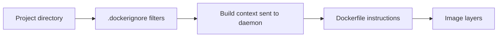
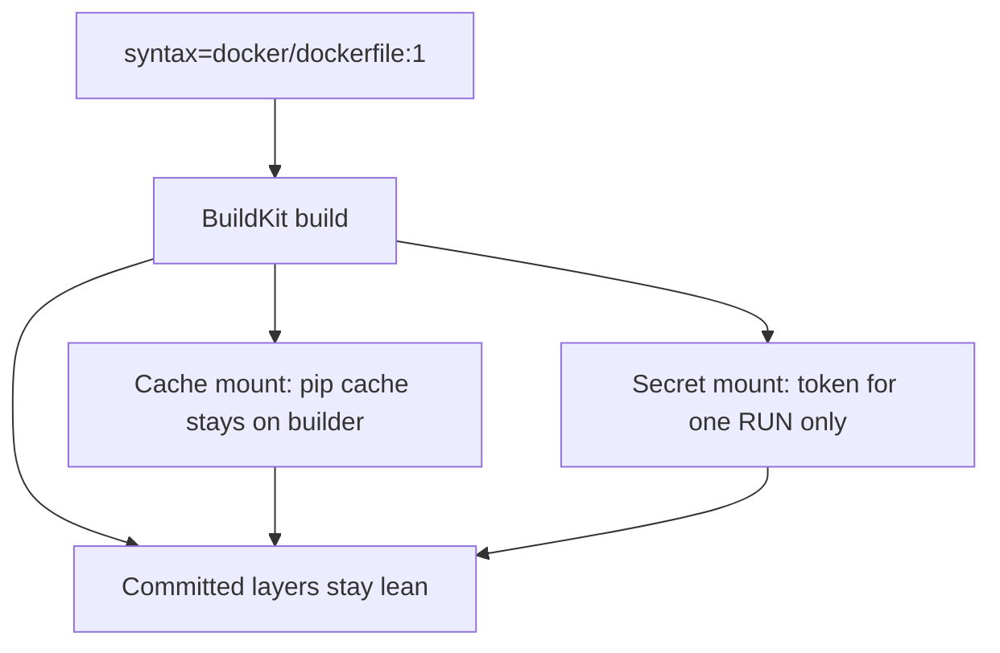
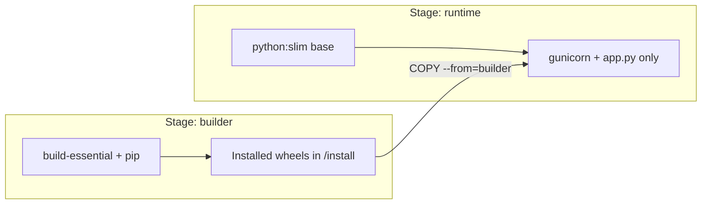
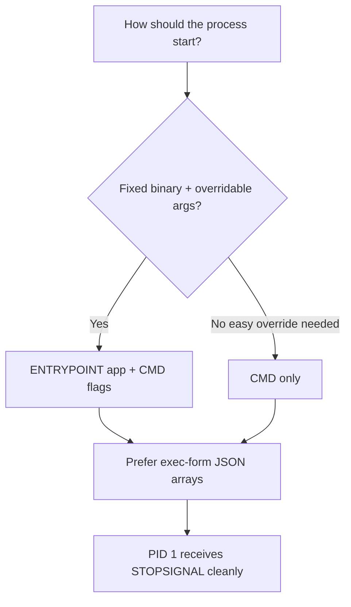

# Chapter 04 — Dockerfiles and Builds

> **Learning Objectives**
>
> By the end of this chapter, you will be able to:
>
> - Write a clear Dockerfile and say what each instruction is for
> - Build a small Flask **Task API** image that is safe to run
> - Use `.dockerignore`, multi-stage builds, BuildKit cache mounts, and build secrets
> - Know when `ONBUILD`, `STOPSIGNAL`, and `SHELL` are worth using
> - Build one image that works on more than one CPU type
> - Tell `CMD` apart from `ENTRYPOINT`, and `COPY` apart from `ADD`

---

## 04.1 From Recipe Card to Kitchen Line

A **Dockerfile** is a recipe card for an image. It is a plain text file, and the build engine reads it from top to bottom. After most steps, the engine saves the file changes as a new layer.

A sloppy recipe copies your whole home folder into the image, installs compilers the app never uses, and leaves everything running as root. The result is slow to build, huge to download, and risky to run.

A careful recipe produces something you would happily serve to guests. In this book, guests means production.

In this chapter you build a small but real service: a **Task API** written in Python with Flask. It stays small on purpose. Every line of the Dockerfile should map to a file you can open and read.

---

## 04.2 The Task API (Application Code)

### In plain terms

The Task API is a small web service with two things in it: a health endpoint that says “I am alive,” and a list of tasks you can read and add to.

Why start with something this small? Because you need ingredients before you can practice the recipe, and a small app keeps every Dockerfile line visible. Start with a sprawling application instead, and the lessons about caching and multi-stage builds disappear into the noise.

Inside the container, the app will run under **Gunicorn**, a production-grade Python web server that handles many requests at once. The file also keeps a plain `if __name__ == "__main__"` block, so you can still run it directly on your laptop without Docker.

> ⚠️ **Common Pitfall:** You might think Flask’s built-in server is good enough inside the image. It is a development server. Under real traffic, and when the container is asked to shut down, Gunicorn (or another production WSGI server) is the honest choice.

### Under the hood

Here are the files. Create a project directory:

```bash
$ mkdir task-api && cd task-api
```

#### `requirements.txt`

```text
flask==3.0.3
gunicorn==22.0.0
```

#### `app.py`

```python
import os
from flask import Flask, jsonify, request

app = Flask(__name__)

tasks = [
    {"id": 1, "title": "Learn Dockerfiles", "done": False},
    {"id": 2, "title": "Build the Task API image", "done": False},
]

@app.get("/healthz")
def healthz():
    return jsonify({"status": "ok"}), 200

@app.get("/tasks")
def list_tasks():
    return jsonify(tasks), 200

@app.post("/tasks")
def create_task():
    data = request.get_json(silent=True) or {}
    title = data.get("title")
    if not title:
        return jsonify({"error": "title is required"}), 400
    new_id = max((t["id"] for t in tasks), default=0) + 1
    task = {"id": new_id, "title": title, "done": False}
    tasks.append(task)
    return jsonify(task), 201

if __name__ == "__main__":
    port = int(os.environ.get("PORT", "8000"))
    app.run(host="0.0.0.0", port=port)
```

#### `seed.json`

A tiny static file used later to demonstrate the `ADD` instruction (prefer `COPY` for ordinary source; `ADD` is shown deliberately for completeness):

```json
{
  "source": "dockerfile-demo",
  "note": "Loaded only to illustrate ADD"
}
```

Why list Gunicorn in the requirements when the `__main__` block uses Flask’s development server? Because the two run in different places. The **container** starts Gunicorn, which is what you want in production. The `__main__` block is only there for quick local runs without Docker.

Quick local sanity check (optional):

```bash
$ python -m venv .venv
$ source .venv/bin/activate   # Windows: .venv\Scripts\activate
$ pip install -r requirements.txt
$ python app.py
```

```bash
$ curl -s http://127.0.0.1:8000/healthz
```

```json
{"status":"ok"}
```

**What breaks if `/healthz` also checks the database:** a brief database hiccup makes the platform mark every instance unhealthy, even though the process is fine. Keep this endpoint cheap and free of dependencies. Deeper checks belong in readiness probes, covered in the Kubernetes chapters.

### In production

**Ownership:** app teams own the API code and the pinned dependency versions. The platform team owns which base images are allowed and which scans must pass once the app is containerized.

Pin exact dependency versions in `requirements.txt`, or use a lock file. Do not serve real traffic with Flask’s development server. Keep the health endpoint cheap, because Kubernetes will call it every few seconds for the life of the pod.

**Failure mode:** an unpinned `flask` jumps to a new major version during a rebuild and breaks the app. **Detect:** the lock file no longer matches, and build digests change when nothing in your code did. **Mitigate:** pin versions, and regenerate lock files inside pull requests where reviewers can see them.

**Do:** pin dependencies and keep `/healthz` cheap. **Don’t:** run the Flask development server as the main process in any shared environment.

**Before you leave this section**

- **Understand:** Task API is the running example; container PID 1 will be Gunicorn.
- **Try:** Create the files and hit `/healthz` locally or skip ahead to the image run in §04.10.
- **Watch in prod:** Unpinned Python deps and heavyweight “health” checks.

---

## 04.3 Build Context and `.dockerignore`

### In plain terms

The **build context** is the set of files you hand to the build engine when you run `docker build`. Usually it is the folder you point the command at, including everything inside it.

Why does that matter? Because those files get sent to the daemon before the first instruction runs. Hand over your whole home directory, complete with `.git` history, a virtual environment, and a `.env` file full of passwords, and the build turns slow and unsafe at the same time.

The `.dockerignore` file lists what to leave out. It works like `.gitignore`, and it is not decoration. It is the difference between sending 2 MB and sending 2 GB. It is also the difference between “the secret never left my laptop” and “the secret is sitting in a layer someone else can download.”

> 💡 **In one line:** The build context is everything you hand the engine before the build starts, so `.dockerignore` decides what never gets shipped at all.

> ⚠️ **Common Pitfall:** Trusting `.dockerignore` while keeping real production secrets in the project folder “just for local runs.” Use secret mounts and inject values at run time. A file that is not there cannot leak.

### Under the hood

Here is what actually happens on the machine. Before any Dockerfile instruction runs, the client packages the context directory and sends it to the daemon. A large context slows every build, and any file inside it can end up in a layer.

#### `.dockerignore`

```text
.git
.venv
__pycache__
*.pyc
*.pyo
.env
.env.*
.pytest_cache
.mypy_cache
.DS_Store
README.md
```

Never let `.dockerignore` be your only defense for secrets. Keep secrets out of the directory in the first place. When a build step genuinely needs a token, use a BuildKit **secret mount** instead (section 04.8).



*Figure 04.1: The build context is everything you hand the daemon — `.dockerignore` keeps junk and secrets out before `COPY` ever runs.*

```bash
$ docker build -t task-api:ctx-check .
# Watch the "transferring context" size in BuildKit output — huge numbers mean ignore rules failed
```

**What breaks if `.env` is copied and then deleted in a later layer:** the secret is still sitting in the earlier layer and in the image history. Anyone who pulls the image can read it. Leaving the file out, or using a secret mount, beats deleting it later.

### In production

**Ownership:** app teams keep `.dockerignore` next to the Dockerfile and up to date. Security or platform teams may scan final images in CI for credential patterns.

Review `.dockerignore` in code review, exactly the way you review `.gitignore`. CI should fail any build that copies a `.env` file or cloud credentials into a layer.

**Failure mode:** a developer’s cloud key sits in the context and ends up in an image pushed to a shared registry. **Detect:** secret scanning on images, and a build context that suddenly grew. **Mitigate:** ignore rules, checks that run before commit, and blocking the push when a scan finds something.

**Do:** review `.dockerignore` like code. **Don’t:** reach for `COPY . .` before the ignore rules exist.

> 🏭 **Production floor:** The build context is a trust boundary. Anything you send can end up in a layer that other people can download. A CI token leaked into an image reaches every environment allowed to pull that repository.

**Before you leave this section**

- **Understand:** Context is what the client sends; `.dockerignore` filters before COPY.
- **Try:** Add `.dockerignore`, build, and note context transfer size in the build log.
- **Watch in prod:** Images that scan-hit on `.env` or cloud key patterns.

---

## 04.4 Dockerfile Instructions You Must Know

### In plain terms

A Dockerfile instruction is one step of the recipe. There are only about fifteen you need, and they fall into three groups.

Some instructions change files, such as `RUN` and `COPY`. Those create layers. Some set defaults the container will use later, such as `ENV`, `WORKDIR`, and `USER`. Those change the config, not the files. And a few only record intent for other humans and tools, such as `EXPOSE` and `LABEL`.

Why learn which group an instruction belongs to? Because that tells you whether it grows the image, changes how the container starts, or does nothing at run time. Without that, you end up copying flags from a forum post into a Dockerfile you cannot explain, and you cannot tell why the image is 900 MB.

> ⚠️ **Common Pitfall:** You might think `EXPOSE` opens a port on your laptop. It does not. It is documentation. To actually reach the port you still need `-p` on `docker run`, a `ports` entry in Compose, or a Kubernetes Service.

### Under the hood

Here is a **teaching Dockerfile** that uses the major instructions on purpose, with comments explaining why each one is there. Real services often skip `ADD` and `VOLUME`, but you should still recognize them when you see them.

#### `Dockerfile`

```dockerfile
# syntax=docker/dockerfile:1

############################
# Stage 1 — build deps
############################
ARG PYTHON_VERSION=3.12
FROM python:${PYTHON_VERSION}-slim AS builder

ENV PYTHONDONTWRITEBYTECODE=1 \
    PYTHONUNBUFFERED=1

WORKDIR /build

RUN apt-get update \
    && apt-get install -y --no-install-recommends build-essential \
    && rm -rf /var/lib/apt/lists/*

COPY requirements.txt .
RUN --mount=type=cache,target=/root/.cache/pip \
    pip install --prefix=/install -r requirements.txt

############################
# Stage 2 — runtime image
############################
ARG PYTHON_VERSION=3.12
FROM python:${PYTHON_VERSION}-slim AS runtime

ARG APP_VERSION=0.1.0
LABEL org.opencontainers.image.title="task-api" \
      org.opencontainers.image.version="${APP_VERSION}"

ENV PYTHONDONTWRITEBYTECODE=1 \
    PYTHONUNBUFFERED=1 \
    PORT=8000 \
    APP_HOME=/app

WORKDIR ${APP_HOME}

# Prefer COPY for ordinary local files. ADD can also fetch remote URLs and
# auto-extract local archives—powerful, and easy to misuse.
COPY --from=builder /install /usr/local
COPY app.py .
ADD seed.json ./seed.json

RUN useradd --create-home --uid 10001 --shell /usr/sbin/nologin appuser \
    && mkdir -p /var/lib/task-api \
    && chown -R appuser:appuser ${APP_HOME} /var/lib/task-api

# Declare a mount point for future persistent data (metadata + auto-created volume).
VOLUME ["/var/lib/task-api"]

# Prefer SIGTERM for graceful Gunicorn shutdown (docker stop default).
STOPSIGNAL SIGTERM

USER appuser

EXPOSE 8000

HEALTHCHECK --interval=30s --timeout=3s --start-period=10s --retries=3 \
  CMD python -c "import urllib.request; urllib.request.urlopen('http://127.0.0.1:8000/healthz')" || exit 1

# ENTRYPOINT is the fixed executable; CMD supplies default args.
ENTRYPOINT ["gunicorn"]
CMD ["--bind", "0.0.0.0:8000", "--workers", "2", "app:app"]
```

#### Instruction field guide

| Instruction | Why it exists | Notes |
|-------------|---------------|-------|
| `FROM` | Sets the base image (starts a stage) | First non-comment instruction; multi-stage uses multiple `FROM`s |
| `ARG` | Build-time variables | Unavailable at runtime unless you also `ENV` them |
| `ENV` | Runtime environment defaults | Persist in image config |
| `WORKDIR` | Sets cwd for later instructions and at runtime | Creates the directory if needed |
| `RUN` | Executes commands at **build** time | Chain cleanup in the same layer |
| `COPY` | Copies local build-context files | Prefer over `ADD` for ordinary files |
| `ADD` | Copy plus extras (remote URL, auto-tar extract) | Easy foot-gun; use sparingly |
| `USER` | Switches user for later steps and runtime | Prefer non-root |
| `VOLUME` | Declares mount points | Anonymous volumes can surprise you |
| `EXPOSE` | Documents intended ports | Does not publish ports by itself |
| `ENTRYPOINT` | Primary executable | Often paired with `CMD` as default args |
| `CMD` | Default args or default command | Overridden easily at `docker run` |
| `LABEL` | Metadata for humans and tools | Use OCI annotation keys when possible |
| `HEALTHCHECK` | Engine-level liveness probe | Complements—not replaces—orchestrator probes |
| `STOPSIGNAL` | Signal used for `docker stop` | Match what your PID 1 expects |
| `SHELL` | Changes the shell for shell-form instructions | Rare; see section 04.7 |
| `ONBUILD` | Triggers for *downstream* images | Powerful; easy to surprise consumers—see 04.7 |

```bash
$ docker build -t task-api:0.1.0 .
$ docker inspect task-api:0.1.0 --format 'User={{.Config.User}} Entrypoint={{json .Config.Entrypoint}} Cmd={{json .Config.Cmd}}'
```

```text
User=appuser Entrypoint=["gunicorn"] Cmd=["--bind","0.0.0.0:8000","--workers","2","app:app"]
```

**What breaks if you leave out `USER`:** on most base images the process runs as root inside the container. If an attacker finds a way to run code in your app, they now have root inside that container, which is a much bigger problem to contain.

### In production

**Ownership:** app teams write the Dockerfiles. The platform team sets the baseline every image must meet—non-root user, approved base images, passing scans—and CI enforces it.

Baseline checklist:

1. Use a specific base tag such as `3.12-slim`, not a tag that can move under you.
2. Run as a non-root user with `USER`.
3. Use multi-stage builds so build tools never reach the final image.
4. Use `.dockerignore` to keep secrets and junk out of the build context.
5. Never pipe an unpinned script from the internet into a shell inside a Dockerfile.
6. Pin your language package versions.
7. Scan images in CI before promoting them.
8. Give the container the least privilege it needs. This API never needs `--privileged`.

**Failure mode:** a `FROM python:latest` that can move, combined with a root user, quietly ships a new base image running as root. **Detect:** check `User` and the base digest in CI, and add admission policy once you reach Kubernetes. **Mitigate:** pin bases, ideally by digest, and require a non-root `USER`.

**Do:** make the `docker inspect` one-liner part of code review. **Don’t:** read `EXPOSE` as networking.

> 🏭 **Production floor:** For release builds, pin the *runtime* base image by digest when promotion must be byte-for-byte identical. A `python:3.12-slim` tag can move between the build you tested on Tuesday and the rebuild someone runs “exactly the same way” on Friday.

**Before you leave this section**

- **Understand:** Major instructions either mutate layers, set config, or document intent.
- **Try:** Build the teaching Dockerfile and inspect User / Entrypoint / Cmd.
- **Watch in prod:** Root-default images and unpinned `FROM` lines in release Dockerfiles.

---

## 04.5 Build With BuildKit and Cache Mounts

### In plain terms

**BuildKit** is the engine that actually runs your build steps. On Docker Engine 29.x it powers both `docker build` and `docker buildx`, so you are already using it.

Why should you care which builder runs? Because BuildKit fixes three real problems from the old one. Rebuilds were slow because nothing could be reused between builds. Secrets leaked, because the only way to pass a token was to bake it into a layer. And you had little control over what was cached.

BuildKit gives you two new tools for that, both written as `--mount` on a `RUN` line. A **cache mount** keeps a folder, such as the pip download cache, on the build machine between builds without putting it in the image. A **secret mount** hands a credential to one step and never writes it to a layer.

> ⚠️ **Common Pitfall:** Treating a **cache mount** and a **secret mount** as the same thing because both use `--mount`. A cache can stick around on a shared builder for days. A secret must never be stored anywhere. Never put credentials in a cache mount.

### Under the hood

Here is what actually happens on the machine. The `# syntax=docker/dockerfile:1` line at the top of the Dockerfile turns on modern Dockerfile features, including cache mounts, secret mounts, and better multi-line syntax.

```bash
$ docker build -t task-api:0.1.0 .
```

Sample output (truncated):

```text
[+] Building 24.3s (14/14) FINISHED
 => [internal] load build definition from Dockerfile
 => [builder 1/5] FROM docker.io/library/python:3.12-slim
 => [builder 4/5] COPY requirements.txt .
 => [builder 5/5] RUN pip install --prefix=/install -r requirements.txt
 => [runtime 5/6] COPY app.py .
 => exporting to image
 => => naming to docker.io/library/task-api:0.1.0
```

Pass build-time version:

```bash
$ docker build --build-arg APP_VERSION=0.1.0 -t task-api:0.1.0 .
```

The `RUN --mount=type=cache,target=/root/.cache/pip` line keeps pip’s download cache *between builds*, while never writing those cached files into an image layer. That is BuildKit in one line: faster rebuilds without a fatter image.



*Figure 04.2: BuildKit separates ephemeral mounts (cache, secrets) from what gets committed into image layers.*

```bash
$ docker history task-api:0.1.0
```

**What breaks if BuildKit is turned off, or an old builder is forced:** cache mounts and secret mounts either fail or are silently ignored. Builds get slower, and credentials can end up in layers. On Engine 29.x, BuildKit is the default, so find out who set `DOCKER_BUILDKIT=0` and why.

### In production

**Ownership:** the platform team turns on BuildKit and provides shared cache storage in CI. App teams write Dockerfiles that use mounts correctly.

Leave BuildKit on; it is the default on current Desktop and Engine. In CI, export the cache to a registry so agents do not start cold on every pipeline run. Keep the two mount types straight: a cache can live on the builder for a long time, and a secret must never be written into a layer.

**Failure mode:** a shared CI builder keeps a credential because someone passed it through a cache mount. **Detect:** secret scanning, plus reviewing every `--mount` line in code review. **Mitigate:** pass secrets only with `type=secret`, wipe the builder, and rotate the credential whenever you suspect exposure.

**Do:** keep `# syntax=docker/dockerfile:1` at the top, and use cache mounts for package managers. **Don’t:** set `DOCKER_BUILDKIT=0` to make an error go away without understanding what you just gave up.

**Before you leave this section**

- **Understand:** BuildKit separates ephemeral mounts from committed layers.
- **Try:** Build twice and confirm the second build reuses cached steps.
- **Watch in prod:** CI agents with cold caches every run, or `DOCKER_BUILDKIT=0`.

---

## 04.6 Multi-Stage Builds

### In plain terms

A **multi-stage build** is one Dockerfile with more than one `FROM` line. Each `FROM` starts a fresh stage, and the last stage becomes your image. Earlier stages are thrown away, except for the files you explicitly copy forward.

Why go to that trouble? Because the tools that *install* your dependencies are not the tools that *serve* traffic. A C compiler is needed to build some Python packages, and it is useless once the app is running. Leave `build-essential` in the final image and you ship hundreds of extra megabytes plus a compiler an attacker would love to find.

Here is how it works in this chapter’s Dockerfile. The `builder` stage installs everything into `/install`. The `runtime` stage starts from a clean slim base and copies in only `/install` and `app.py`. The compiler never exists in the image you ship.

Multi-stage is the clearest production habit in a Dockerfile: the image you run should never be the image you compiled in.

> 💡 **In one line:** Build in a big messy stage, then copy only the finished files into a small clean stage—the shipped image never sees your compiler.



*Figure 04.3: Multi-stage builds compile or install in a heavy stage, then copy only runtime artifacts into a slim final image.*

> ⚠️ **Common Pitfall:** Copying the whole builder filesystem into the runtime stage “to be safe.” That drags the compiler and every build package right back in, and you get none of the benefit.

### Under the hood

Here is what the simpler single-stage version looks like. It is bigger and less safe:

```dockerfile
FROM python:3.12-slim
WORKDIR /app
COPY requirements.txt .
RUN pip install --no-cache-dir -r requirements.txt
COPY app.py .
EXPOSE 8000
CMD ["gunicorn", "--bind", "0.0.0.0:8000", "app:app"]
```

This works, and it is fine for your first five minutes with Docker. It also runs as root by default and mixes building with running. Make the multi-stage version your normal habit instead.

```bash
$ docker history task-api:0.1.0
# Confirm build-essential is not in the final stage history
```

**What breaks if the `COPY --from=builder` paths are wrong:** the runtime image is missing Python modules, and the container dies with `ModuleNotFoundError` in the logs. Fix the install prefix and the copy path. Do not fix it by installing compilers into the runtime stage.

### In production

**Ownership:** app teams decide how the stages are split. The platform team may fail CI when a scanner finds compilers in the final stage.

Add “the final stage contains no compiler or build tools” to your review checklist. For compiled languages, copy the finished binary and the libraries it needs at run time, not the whole build tree.

**Failure mode:** a Dockerfile that looks multi-stage but still runs `apt-get install build-essential` in the final stage. **Detect:** `docker history`, a scanner, or a size budget in CI. **Mitigate:** the checklist plus an automated search for build packages in the digest you promote.

**Do:** name your stages (`AS builder`, `AS runtime`) and copy as little as possible. **Don’t:** keep a single-stage root image as your long-term default.

**Before you leave this section**

- **Understand:** Builder tools stay in an intermediate stage; runtime copies artifacts only.
- **Try:** Compare image size of single-stage vs multi-stage Task API builds.
- **Watch in prod:** Final-stage toolchains showing up in CVE and size reports.

---

## 04.7 STOPSIGNAL, SHELL, and ONBUILD

### In plain terms

These three instructions are specialty tools. You will not need them most days, and you will be glad you recognize them when you do.

`STOPSIGNAL` sets which signal Docker sends when it asks the container to stop. A **signal** is a short message the operating system delivers to a process, and `SIGTERM` is the polite “please finish up and exit.” `SHELL` changes which shell interprets commands written in shell form. `ONBUILD` records instructions that do nothing now and run later, inside any image built `FROM` yours.

Why care about instructions you rarely write? Because each one explains a confusing symptom. A container that takes exactly ten seconds to stop every time is usually a signal problem. A build that mysteriously copies files you never mentioned is usually an `ONBUILD` trigger hiding in the base image.

### Under the hood

Here is what each one does.

#### `STOPSIGNAL`

```dockerfile
STOPSIGNAL SIGTERM
```

`docker stop` sends this signal, waits out the grace period, and then sends `SIGKILL`, which cannot be caught or ignored. The default is `SIGTERM`. Change it only when your main process expects something else, which is rare for Gunicorn and more common for custom runtimes. Fixing the app to handle `SIGTERM` is almost always better than picking an unusual stop signal.

#### `SHELL`

```dockerfile
SHELL ["/bin/bash", "-c"]
RUN echo "shell form now uses bash"
```

`SHELL` changes the default shell used by the shell form of `RUN`, `CMD`, and `ENTRYPOINT`. For `CMD` and `ENTRYPOINT`, prefer the **exec form**—a JSON array like `["gunicorn", "app:app"]`—so your main process starts directly with no shell wrapped around it. Reach for `SHELL` when a Windows container build needs PowerShell instead of `cmd`, or when a complicated `RUN` genuinely needs bash features.

#### `ONBUILD`

```dockerfile
ONBUILD COPY . /app
ONBUILD RUN pip install -r /app/requirements.txt
```

Instructions written with `ONBUILD` do nothing while your image builds. They run later, in someone else’s build, the moment another Dockerfile says `FROM` your image. They are useful for a shared base image—“everyone who builds on me copies their app to the same place”—and notorious for surprising people who never read the parent Dockerfile.

```bash
$ docker inspect my-base:1 --format '{{json .Config.OnBuild}}'
```

### In production

**Ownership:** whoever publishes a shared base image owns documenting its `ONBUILD` triggers. Teams that build on it own checking before they adopt it.

- Document every `ONBUILD` trigger prominently in the base image README. In a large organization, an explicit child Dockerfile beats a hidden trigger every time.
- Set `STOPSIGNAL` to match the signal your process actually listens for when shutting down.
- Do not depend on `SHELL` for the runtime `CMD`. Exec form delivers signals to your process correctly.

> ⚠️ **Warning:** An innocent-looking `FROM company-python:3` can quietly run copy and install steps you never wrote. Run `docker inspect` on any base image you do not already know.

**Do:** inspect `OnBuild` on shared base images before adopting them. **Don’t:** surprise the teams downstream of you with heavy hidden triggers.

**Before you leave this section**

- **Understand:** STOPSIGNAL pairs with graceful stop; ONBUILD runs in *child* builds.
- **Try:** `docker inspect` a base image for `Config.OnBuild`.
- **Watch in prod:** Mystery build steps after changing a company base image.

---
## 04.8 Build Secrets (and Why Not `ARG` for Passwords)

### In plain terms

A **build secret** is a credential BuildKit hands to one build step and then throws away, without ever writing it into the image.

Why do you need a special mechanism? Because builds sometimes need a token—to download a package from a private repository, for example. If you pass that token as a build argument (`ARG`) or an environment variable (`ENV`), it is stored in the image and its history. Anyone who can pull the image can read it, possibly years later.

The tempting fix is “I will just unset it in the next step.” That does not work. Layers only stack, so the earlier layer still holds the value. A secret mount changes the situation instead of patching it: the credential appears at a temporary path for one `RUN`, and no layer ever records it.

> ⚠️ **Common Pitfall:** Using `ARG PIP_TOKEN=…` or `ENV PIP_TOKEN=…` to reach a private package index. Anyone holding that image can usually recover the token from the image history or config.

### Under the hood

Here is what actually happens on the machine. Create a local secret file, and never commit it:

```bash
$ echo 'my-private-token' > ./secret-token.txt
```

Dockerfile fragment (illustrative—Task API does not need this for public PyPI):

```dockerfile
# syntax=docker/dockerfile:1
RUN --mount=type=secret,id=pip_token \
    PIP_TOKEN=$(cat /run/secrets/pip_token) \
    && pip install --index-url "https://pypi.example.com/simple" -r requirements.txt
```

Build with:

```bash
$ docker build --secret id=pip_token,src=./secret-token.txt -t task-api:0.1.0 .
```

Or from an environment variable:

```bash
$ export PIP_TOKEN=my-private-token
$ docker build --secret id=pip_token,env=PIP_TOKEN -t task-api:0.1.0 .
```

Pulling private Git dependencies uses the same idea with `--ssh`, which lends the build your SSH keys without copying them in:

```bash
$ docker build --ssh default -t task-api:0.1.0 .
```

**What breaks if you forget the `# syntax=docker/dockerfile:1` line:** secret mounts may not be understood, because older Dockerfile syntax does not include them. Keep that line at the top.

### In production

**Ownership:** the security or platform team owns the CI secret store and how secrets reach a build. App teams own making the mount IDs in the Dockerfile match what CI provides.

- Never use `ARG PASSWORD=…` for a credential you care about. Build arguments show up in `docker history` and in cached layers.
- Keep CI secrets in the CI secret store, pass them with `--secret`, and wipe agent disks between jobs.
- For values the *running* app needs, inject them at run time with Compose secrets or Kubernetes Secrets. Build secrets are only for build time.

**Failure mode:** a token sitting in image config, found months later in a mirrored copy of the registry. **Detect:** secret scanners on every pushed digest, plus an audit of image history. **Mitigate:** rebuild without the argument, rotate the token immediately, and block that `ARG` pattern by policy.

**Do:** use `--secret` for build-time credentials. **Don’t:** bake a runtime database password into an image at all. Inject it when the container starts.

> 🏭 **Production floor:** A leaked build token reaches every private package feed it could read, and every image built with it. Rotate the token first and discuss how it happened afterward. Record the range of affected digests in the incident ticket.

**Before you leave this section**

- **Understand:** Secret mounts avoid committing credentials; ARG/ENV can leak via history.
- **Try:** Run the optional secret-mount exercise in §04.14 with a dummy file.
- **Watch in prod:** Dockerfiles that still pass tokens as build-args.

---
## 04.9 Multi-Platform Builds With buildx

### In plain terms

A multi-platform build produces one image name that works on more than one CPU type. Chapter 03 explained what those images are. Here you make them.

Why does this land in the build chapter? Because the fix has to happen at build time. If you build only for your laptop’s CPU, no amount of retrying on the server will help; the binary simply cannot run there. One `buildx` command can target `linux/amd64` and `linux/arm64` together, so the same tag works on your Apple silicon laptop and on the amd64 servers.

### Under the hood

Here is what actually happens on the machine.

```bash
$ docker buildx ls
$ docker buildx build \
    --platform linux/amd64,linux/arm64 \
    -t registry.example.com/team/task-api:0.1.0 \
    --push .
```

BuildKit fills in these build arguments for you, and you can read them inside the Dockerfile:

| ARG | Meaning |
|-----|---------|
| `BUILDPLATFORM` | Platform of the node executing the build |
| `TARGETPLATFORM` | Platform you are building for |
| `TARGETOS` / `TARGETARCH` | Split forms of the target |

Example pattern for cross-compilation-friendly tools:

```dockerfile
# syntax=docker/dockerfile:1
FROM --platform=$BUILDPLATFORM python:3.12-slim AS builder
ARG TARGETPLATFORM
# install/build for $TARGETPLATFORM when your toolchain supports it
```

On Engine 29.x with the containerd image store, you can keep multi-platform results locally, which older graph-driver setups could not do. If `--load` refuses your multi-platform output, push to a registry instead, or switch to a `docker-container` builder driver as described in Docker’s multi-platform guide.

### In production

**Ownership:** CI owns the list of platforms every release builds for. App teams confirm that dependencies with compiled code work on each architecture.

Release jobs in CI must build every architecture you run in production and push one manifest list covering all of them. Run at least one container per architecture in the pipeline before the release is allowed through.

**Do:** pass `--platform` explicitly in release jobs. **Don’t:** treat a successful pull on a Mac as evidence about the server.

**Before you leave this section**

- **Understand:** buildx can emit multi-arch indexes; load vs push depends on image store/driver.
- **Try:** `docker buildx ls` and note your default builder.
- **Watch in prod:** Single-arch pushes to multi-arch node pools.

---

## 04.10 Run the Task API Container

### In plain terms

Running the image is the other half of the job. A build that succeeds proves the recipe was valid. Only a run proves the dish is edible.

Why do this now, before the container management chapter? Because three specific things go wrong on the first run, and you should meet them here: the port is not published, the app listens on the wrong address inside the container, or you override the start command incorrectly. In this section you publish a port, call the API, and practice changing `CMD` and `ENTRYPOINT` on purpose so an accidental override is easy to recognize later.

> ⚠️ **Common Pitfall:** Replacing the whole program when you only meant to change a flag. `docker run image <args>` replaces `CMD`. `--entrypoint` replaces the program itself. Know which one you typed.

### Under the hood

Here is what actually happens on the machine.

```bash
$ docker run --rm -d --name task-api -p 8000:8000 task-api:0.1.0
$ curl -s http://127.0.0.1:8000/tasks
```

```json
[{"id":1,"title":"Learn Dockerfiles","done":false},{"id":2,"title":"Build the Task API image","done":false}]
```

```bash
$ curl -s -X POST http://127.0.0.1:8000/tasks \
    -H "Content-Type: application/json" \
    -d "{\"title\":\"Ship to staging\"}"
```

Override `CMD` arguments while keeping `ENTRYPOINT`:

```bash
$ docker run --rm task-api:0.1.0 --bind 0.0.0.0:8000 --workers 1 app:app
```

Replace the whole process by overriding entrypoint:

```bash
$ docker run --rm --entrypoint python task-api:0.1.0 -c "print('hello from override')"
```

Stop the detached container when finished:

```bash
$ docker stop task-api
```

**What breaks if the app listens on `127.0.0.1` inside the container:** that address means “only this machine,” and inside a container it means “only this container.” Published host ports cannot reach it. Listen on `0.0.0.0` inside the container, as Gunicorn does here.

### In production

**Ownership:** developers verify the image runs before it leaves their machine. Release owns the digest that staging and production pull.

Keep `ENTRYPOINT` fixed as the program, and change `CMD` when you need different flags. That split maps cleanly onto Kubernetes `command` and `args` later, with far fewer surprises.

**Do:** call `/healthz` on the exact digest you are about to promote. **Don’t:** promote a locally built tag that nobody ever ran.

**Before you leave this section**

- **Understand:** CMD overrides args; `--entrypoint` replaces the binary.
- **Try:** Run Task API, hit `/tasks`, then stop the container.
- **Watch in prod:** Images that never had a smoke test on the promoted digest.

---

## 04.11 COPY vs ADD, CMD vs ENTRYPOINT

### In plain terms

These are two pairs of instructions that look interchangeable and are not.

**COPY** copies files from your build context into the image. **ADD** does that too, and then adds surprises: it can download a URL, and it automatically unpacks local tar archives. **ENTRYPOINT** names the program the container runs. **CMD** supplies the default arguments to that program, or the whole command when there is no entrypoint.

Why be picky about this? Because both surprises show up at the worst time. An `ADD` that downloads from the internet makes your build depend on a server you do not control, and the bytes can change while your Dockerfile does not. A `CMD` written in shell form starts your app underneath a shell, and that shell often swallows the stop signal, so `docker stop` waits the full grace period and then kills your app mid-request.

Boring is a feature here. A surprise in how you package the app becomes a surprise at 2 a.m.

> 💡 **In one line:** `ENTRYPOINT` is the program, `CMD` is its default arguments—and writing them as JSON arrays is what lets your app shut down cleanly.

> ⚠️ **Common Pitfall:** Writing `CMD gunicorn ...` in shell form. That wraps your app in a shell as the container’s main process, and `docker stop` signals never reach Gunicorn properly.

### Under the hood

Here is how to choose between them.

| Goal | Pattern |
|------|---------|
| Easy full override (`docker run img bash`) | `CMD ["app"]` only |
| Fixed binary + overridable args | `ENTRYPOINT ["app"]` + `CMD ["--flag"]` |
| Shell form wrapping | Avoid when possible; exec form (`JSON` array) handles signals better |

Use exec form so your program becomes **PID 1**, the container’s first and main process, and receives stop signals directly. Pair it with `STOPSIGNAL` and a `docker stop -t` grace period long enough to finish in-flight requests.



*Figure 04.4: Prefer exec-form `ENTRYPOINT`/`CMD` so overrides stay predictable and signals reach the real process.*

**What breaks if you use `ADD http://…` in CI:** the build now depends on a remote server staying up and serving the same bytes. Nothing in your Dockerfile records what it downloaded, so the build is neither reproducible nor auditable.

### In production

**Ownership:** app teams write the instructions. Reviewers block remote `ADD` and shell-form entrypoints before they reach the main branch.

Ban casual `ADD http://…` in Dockerfiles. A build that reaches out to the internet is harder to audit and impossible to reproduce exactly. Commit the dependency into the context, or fetch it through a package manager with a lock file.

**Do:** use `COPY`, and write `ENTRYPOINT` and `CMD` in exec form. **Don’t:** use remote `ADD` for anything production depends on.

**Before you leave this section**

- **Understand:** COPY vs ADD; ENTRYPOINT vs CMD; exec form for signals.
- **Try:** Override CMD once and entrypoint once on Task API; observe the difference.
- **Watch in prod:** Shell-form PID 1 and remote ADD in release Dockerfiles.

---

## 04.12 Image Scanning and Safe Practices

### In plain terms

Image scanning means running a tool that compares every package inside your image against public lists of known security problems. Those published problems are called **CVEs**, short for Common Vulnerabilities and Exposures.

Why bother, when you wrote careful code? Because most of an image is not your code. It is the base operating system and the libraries you installed. A scanner reads the package list and tells you which of those already have known holes, before an attacker does the same thing.

Scanning does not replace writing secure code, and it does not prove an image is safe. It catches the known problems cheaply and early, which is exactly what you want from a gate that runs on every build.

> ⚠️ **Common Pitfall:** Reading a clean scan as “secure forever.” New CVEs are published every week against packages you already shipped. Rebuild when your base image is patched.

### Under the hood

Here is what actually happens on the machine.

```bash
$ docker scout quickview task-api:0.1.0
```

If Docker Scout is not available where you work, use whichever scanner you have, such as Trivy or Grype:

```bash
$ trivy image task-api:0.1.0
```

**What breaks if you only scan the builder stage:** the image you actually ship still contains packages nobody looked at. Scan the **final** digest, the one you are about to promote.

### In production

**Ownership:** the security team sets which severity levels block a release. App teams fix findings, or record an exception with an owner and an expiry date. The platform team blocks promotion when the gate fails.

Block merges on scan policy: critical findings in the final stage stop the build. Rebuild on a schedule so you pick up patched base images. Scanning is necessary and not sufficient. You still run as a non-root user, remove privileges the container does not need (Chapter 10), and keep secrets out of layers.

**Do:** scan the exact digest you promote. **Don’t:** waive a critical finding without both an owner and an expiry date.

**Before you leave this section**

- **Understand:** Scan the final image; scanning ≠ complete security.
- **Try:** Run scout or trivy once on `task-api:0.1.0`.
- **Watch in prod:** Promotions that skip scanning or only scan builder stages.

---
## 04.13 Common Pitfalls

> ⚠️ **Common Pitfall:** Copying the entire repo before installing dependencies.  
> Any code edit busts the dependency layer cache. Copy `requirements.txt` first, install, then copy source.

> ⚠️ **Common Pitfall:** Using shell form `CMD gunicorn ...` without exec form.  
> Signal handling and `docker stop` grace periods behave worse; prefer JSON exec form.

> ⚠️ **Common Pitfall:** Assuming `EXPOSE` publishes a port.  
> You still need `docker run -p host:container`.

> ⚠️ **Common Pitfall:** Baking `.env` secrets into layers with `COPY . .` or `ARG` passwords.  
> Even if deleted later, secrets can remain in earlier layers. Exclude them; use secret mounts; inject at runtime.

> ⚠️ **Common Pitfall:** Treating `VOLUME` as mandatory for all apps.  
> Unnecessary `VOLUME` lines create anonymous volumes that persist data you did not intend to keep.

> ⚠️ **Common Pitfall:** Surprising consumers with heavy `ONBUILD` triggers.  
> Prefer explicit child Dockerfiles unless you maintain a carefully documented base-image contract.

---

## 04.14 Hands-On Exercises

1. Create `task-api/` with `app.py`, `seed.json`, `requirements.txt`, `.dockerignore`, and the multi-stage `Dockerfile` from this chapter.
2. Build: `docker build -t task-api:0.1.0 .` Confirm the image lists with `docker images`.
3. Run on port 8000 and exercise `GET /healthz`, `GET /tasks`, and `POST /tasks`.
4. Change only a string in `app.py`, rebuild, and observe that dependency layers are reused (BuildKit cache).
5. Confirm `STOPSIGNAL` and `Health` via `docker inspect task-api` after running detached.
6. Run a scanner (`docker scout` or `trivy`) and note the highest severity count—even if zero.
7. Deliberately rebuild with `--build-arg PYTHON_VERSION=3.12` and confirm the build still succeeds.
8. (Optional) Try a no-op secret mount build: `docker build --secret id=demo,src=./secret-token.txt -t task-api:secret-demo .` after creating a dummy secret file, then delete the secret file.
9. (Optional) Run `docker buildx build --platform linux/amd64 -t task-api:amd64 --load .` and confirm architecture with `docker inspect`.

---

## 04.15 Check Your Understanding

**Q1.** Why put `COPY requirements.txt` and `pip install` before `COPY app.py`?

<details>
<summary>Show answer</summary>

So dependency installation layers stay cached when only application source changes, speeding rebuilds.

</details>

**Q2.** What is the difference between `ARG` and `ENV`?

<details>
<summary>Show answer</summary>

`ARG` is available at build time and does not persist unless re-exported. `ENV` sets environment variables that remain in the image and container runtime by default.

</details>

**Q3.** Does `EXPOSE 8000` make the app reachable from your host browser?

<details>
<summary>Show answer</summary>

Not by itself. It documents the port. Publishing requires runtime mapping such as `-p 8000:8000`.

</details>

**Q4.** Why prefer exec-form `ENTRYPOINT`/`CMD`?

<details>
<summary>Show answer</summary>

Exec form runs the process directly as PID 1 without a wrapping shell, which improves signal handling for graceful shutdowns.

</details>

**Q5.** What problem do multi-stage builds solve for the Task API?

<details>
<summary>Show answer</summary>

They allow compiling/installing with build tools in an intermediate stage while copying only the installed runtime artifacts into a slim final image—smaller and safer.

</details>

**Q6.** Why use `RUN --mount=type=secret` instead of `ARG` for a private registry token?

<details>
<summary>Show answer</summary>

Secret mounts expose the credential to a build step without storing it in image layers or build history the way build-args can. That reduces the chance of leaking tokens to anyone who can inspect the image.

</details>

---

## 04.16 Key Takeaways

- A Dockerfile runs **top to bottom**. Put stable steps first so the cache can help you.
- **Copy `requirements.txt` and install before you copy the source.** That one habit saves minutes per build.
- The **build context is everything you hand the engine.** Write `.dockerignore` before you write `COPY . .`.
- **Build in one stage, ship from another.** No compilers in the final image.
- **Run as a non-root `USER`.** Root in a container is still root in that container.
- **`ARG` is not a vault.** Use `--secret` for build-time tokens, and inject runtime secrets at run time.
- **`EXPOSE` publishes nothing.** You still need `-p`, a Compose port, or a Service.
- **`ENTRYPOINT` is the program, `CMD` is the arguments.** Write both as JSON arrays.
- **Build for the CPU you deploy to**, not just the one on your desk.
- Scan the digest you promote, and rebuild when the base image is patched.

---

## 04.17 Official documentation map

| Topic | Official page |
|-------|---------------|
| Dockerfile reference | [Dockerfile reference](https://docs.docker.com/reference/dockerfile/) |
| Docker Build overview | [Build overview](https://docs.docker.com/build/concepts/overview/) |
| Build secrets | [Build secrets](https://docs.docker.com/build/building/secrets/) |
| Multi-platform builds | [Multi-platform images](https://docs.docker.com/build/building/multi-platform/) |
| buildx build | [docker buildx build](https://docs.docker.com/reference/cli/docker/buildx/build/) |
| Multi-stage builds | [Multi-stage builds](https://docs.docker.com/build/building/multi-stage/) |
| .dockerignore | [dockerignore](https://docs.docker.com/build/building/context/#dockerignore-files) |
| Get started — build images | [Building images](https://docs.docker.com/get-started/docker-concepts/building-images/) |

**Previous:** [Chapter 03 — Images Deep Dive](03-docker-images-deep-dive.md) | **Next:** [Chapter 05 — Container Management](05-docker-containers-management.md)
