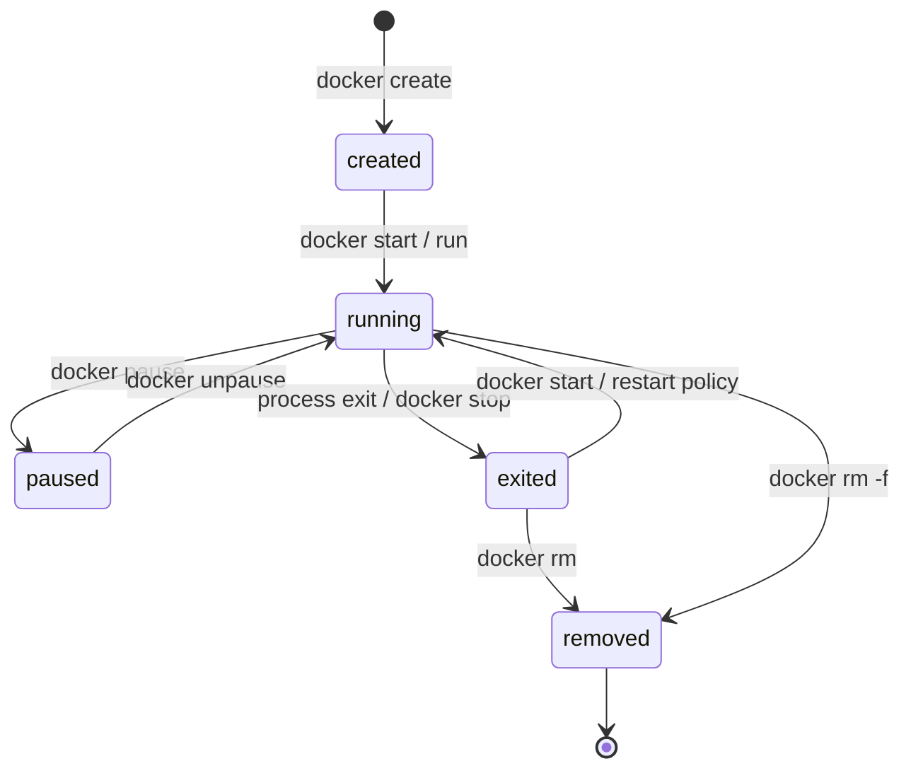
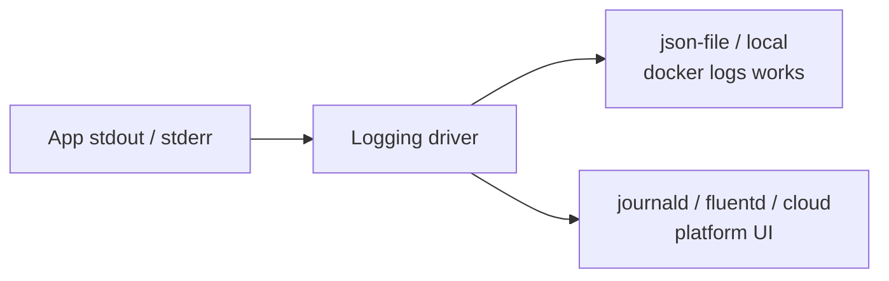
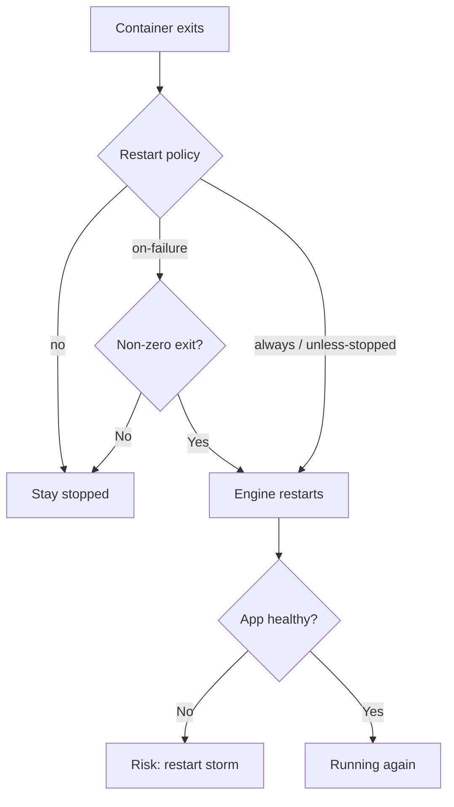
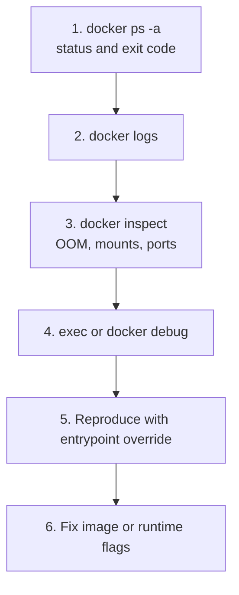

# Chapter 05 — Docker Containers Management

> **Learning Objectives**
>
> By the end of this chapter, you will be able to:
>
> - Move a container through its whole life: create, start, stop, restart, pause, remove
> - Find out why a container failed using logs, `inspect`, `exec`, `docker debug`, and port checks
> - Set memory and CPU limits, and recognize what running out of each looks like
> - Pick a restart policy on purpose instead of copying one
> - Tell which files disappear when a container is removed, and which data you must keep

---

## 05.1 Pets, Cattle, and a Stubborn Process

Old-school servers were pets. Each one had a name, its own quirks, and a team that nursed it back to health whenever it got sick.

Containers work better as cattle. When one misbehaves, you read its logs, learn what went wrong, and replace it with a fresh copy from the same image. Nobody logs in to hand-repair it.

That changes which skill matters. It is not “connect to the box and edit files until it works.” It is controlling the container’s life cycle and diagnosing failures from the outside.

You built `task-api:0.1.0` in Chapter 04. This chapter uses it to practice real container operations on one machine. If you skipped that chapter, `nginx:alpine` works as a stand-in.

---

## 05.2 Lifecycle at a Glance

### In plain terms

The **container lifecycle** is the short list of states a container can be in, and the commands that move it from one to the next. It is created, then running, then possibly paused, then exited, and finally removed.

Why memorize a state list? Because almost every question you will ask about a container is really a question about which state it is in. “Is it up?” “Why did it stop?” “Why can I not reuse this name?” Most small outages are not exotic. They are a container that quietly exited, a name still held by a dead container, or a container restarting in a loop that nobody looked at.

One shortcut is worth knowing right away. `docker run` is not a separate state. It creates the container and starts it in a single step, which is why beginners rarely see the created state at all.

> 💡 **In one line:** A container is always in exactly one state—created, running, paused, exited, or removed—and every command you type is just a move between two of them.



*Figure 05.1: Container lifecycle states — create, run, pause, exit, restart, and remove.*

| State (simplified) | Meaning |
|--------------------|---------|
| Created | Settings exist; the process has not started |
| Running | The main process is alive |
| Paused | The process is frozen in place by the kernel’s cgroup freezer |
| Exited / Stopped | The process ended, with any exit code |
| Removed | Gone from the daemon entirely |

> ⚠️ **Common Pitfall:** Running every experiment with plain `docker run`, without `--rm` or `--name`. Exited containers pile up invisibly, and the next `run --name` fails because a dead container still holds the name.

### Under the hood

Here is the full lifecycle, one command at a time:

```bash
$ docker create --name task-api -p 8000:8000 task-api:0.1.0
$ docker start task-api
$ docker stop task-api
$ docker start task-api
$ docker restart task-api
$ docker pause task-api
$ docker unpause task-api
$ docker rm task-api          # must be stopped unless -f
```

One-shot convenience:

```bash
$ docker run --rm --name task-api -p 8000:8000 task-api:0.1.0
```

`docker run` equals create plus start, and it pulls the image first if the machine does not have it. The `--rm` flag deletes the container the moment it exits. That is perfect for experiments and wrong for anything you want to `docker start` again later.

List running versus all:

```bash
$ docker ps
$ docker ps -a
```

```text
CONTAINER ID   IMAGE            COMMAND                  STATUS         PORTS                                         NAMES
a1b2c3d4e5f6   task-api:0.1.0   "gunicorn --bind ..."    Up 2 minutes   0.0.0.0:8000->8000/tcp                        task-api
```

**What breaks if you `docker rm` a container whose logs you still needed:** the writable layer goes away, and with the `json-file` driver its log files go with it. Save `docker logs` output before you delete anything during an investigation.

### In production

**Ownership:** whoever runs the host decides the cleanup schedule. App owners decide their container names and whether a container should restart.

Give containers explicit names with `--name` in scripts, and use `--rm` for one-shot CI jobs. On a shared daemon, exited containers pile up and cause confusing name conflicts. Clean them on a schedule, not in a panic.

**Failure mode:** the disk fills with exited containers and log files that never rotate. **Detect:** `docker system df`, plus disk alerts on the host. **Mitigate:** a scheduled prune and log rotation (§05.4).

**Do:** run `docker ps -a` before assuming a name is free. **Don’t:** run `rm -f` on a production container before you have captured its exit code and logs.

**Before you leave this section**

- **Understand:** run = create+start; stop keeps the instance; rm deletes it.
- **Try:** create/start/stop/rm Task API once through the long form.
- **Watch in prod:** Name conflicts and disk growth from exited containers.

---

## 05.3 Detached Mode, Attach, and Ports

### In plain terms

Three separate things decide whether you can reach your app: whether it runs in the background, whether your terminal is connected to it, and whether a port is published.

**Detached mode** is the `-d` flag. It starts the container in the background and gives you your prompt back, the way starting a service does. **Attaching** connects your terminal to the container’s main process output. **Publishing a port** is the `-p` flag, and it is the only reason a request from your host can reach the app inside.

Why separate them so carefully? Because of one very common misreading: “the container says Up, so the API must be on localhost.” Up only means the process is alive. It says nothing about whether you published the right port, or whether the app inside is listening on an address the outside world can reach.

> ⚠️ **Common Pitfall:** Leaving out `-p` and then blaming the application. Listening inside the container is not the same as publishing to the host.

### Under the hood

Here is what actually happens on the machine.

```bash
$ docker run -d --name task-api -p 8000:8000 task-api:0.1.0
$ docker logs -f task-api
```

Attach to the main process streams:

```bash
$ docker attach task-api
```

To leave an attached session without stopping the container, press `Ctrl-P` then `Ctrl-Q`. Do not press `Ctrl-C`, which sends a signal to the process and often stops it. For most debugging, `docker logs` is the safer tool.

```bash
$ docker port task-api
```

```text
8000/tcp -> 0.0.0.0:8000
```

```bash
$ curl -s http://127.0.0.1:8000/healthz
```

```json
{"status":"ok"}
```

If curl fails while `docker ps` shows Up, check three things in order. You may have published the wrong host port. The app inside may be listening on `127.0.0.1`, which means “this machine only” and blocks published traffic, when it should listen on `0.0.0.0`. Or a firewall or Docker Desktop file-and-port sharing setting may be in the way.

**What breaks if two containers publish the same host port:** the second `run` fails, because only one process can hold a port. Choose a different host port, or stop the first container.

### In production

**Ownership:** developers decide what to publish on their own laptops. The platform team limits host-port publishing on shared servers and points teams at user-defined networks instead.

Publish only what you must. For container-to-container traffic, put the containers on a user-defined network (Chapter 06) rather than publishing each one to the host. In Kubernetes, Services and probes replace the habit of adding `-p` to everything. The other lesson carries over unchanged: inside the container, listen on `0.0.0.0`.

**Do:** confirm with `docker port` and a curl before you debug anything else. **Don’t:** publish a database to `0.0.0.0` from a laptop on shared Wi-Fi.

**Before you leave this section**

- **Understand:** `-d` backgrounds; `-p` publishes; attach ≠ logs.
- **Try:** Run detached Task API, `docker port`, curl `/healthz`.
- **Watch in prod:** Unnecessary published ports on shared hosts.

---
## 05.4 Logs and Logging Drivers

### In plain terms

In the container world, an app should print its logs to **stdout** and **stderr**—the two output streams every process already has, normally shown on your terminal. Docker captures both.

A **logging driver** is the piece that decides where Docker sends those captured streams: local files on the host, the system journal, or a central logging platform. The `docker logs` command shows you whatever the active driver keeps for that container.

Why does this matter more than it sounds? Because if the app writes only to a file such as `/var/log/app.log` inside the container, `docker logs` shows nothing at all. The operator sees silence, assumes the app is dead, and starts inventing theories. Containers standardize the output stream, but you still have to point your logging at it.

> ⚠️ **Common Pitfall:** Leaving `json-file` logs with no size limit on a busy host. The disk fills, and then unrelated-looking failures appear when Docker cannot create containers or pull images.

### Under the hood

Here is what actually happens on the machine.

#### Everyday log commands

```bash
$ docker logs task-api
$ docker logs --tail 100 task-api
$ docker logs --since 10m task-api
$ docker logs -f --timestamps task-api
```

Exit codes matter:

```bash
$ docker ps -a --filter name=task-api
```

A status of `Exited (1)`, or any non-zero number, means the process crashed or failed while starting. Read the logs before you restart it again and again.

#### Which driver is active?

```bash
$ docker info --format '{{.LoggingDriver}}'
$ docker inspect -f '{{.HostConfig.LogConfig.Type}}' task-api
```

The default driver is usually **`json-file`**, which writes JSON log files onto the Docker host. Other common drivers:

| Driver | Role |
|--------|------|
| `json-file` | Default; local JSON files; supports `docker logs` |
| `local` | Compact local format; also supports `docker logs` |
| `journald` | Send to systemd journal (Linux) |
| `syslog` / `fluentd` / `awslogs` / `gcplogs` / … | Forward to external systems |

Per-container override with rotation options:

```bash
$ docker run -d --name task-api \
    --log-driver json-file \
    --log-opt max-size=10m \
    --log-opt max-file=3 \
    -p 8000:8000 \
    task-api:0.1.0
```

Daemon defaults (Linux example `/etc/docker/daemon.json`; on Desktop use Settings → Docker Engine):

```json
{
  "log-driver": "json-file",
  "log-opts": {
    "max-size": "10m",
    "max-file": "3"
  }
}
```

> ⚠️ **Warning:** Unlimited `json-file` logs can fill the disk. Always set rotation (`max-size` / `max-file`) on busy hosts.



*Figure 05.2: Applications should log to stdout/stderr; the driver decides whether `docker logs` or an external platform is the reader.*

If an app writes only to a file inside the container, `docker logs` will never show it unless you mount or copy that file out. Avoid that design; print to stdout and stderr instead.

**What breaks if a remote driver does not support `docker logs`:** the command that on-call reaches for first returns nothing. Use the logging platform’s own interface, and write the active driver into the runbook so nobody has to guess at 3 a.m.

### In production

**Ownership:** the platform team sets the default driver and how long logs are kept. App teams make sure their apps print structured logs to stdout and stderr.

- Pick one logging strategy and apply it consistently: local files with rotation on laptops, forwarding drivers or log agents in clusters.
- Remember that some remote drivers do not serve `docker logs` the same way. Use the log platform’s interface there.
- Plan for log volume the way you plan for image storage. `docker system df` shows both.
- Send logs to two places at once only when you have accounted for the duplicate storage and the cost of keeping both.

**Failure mode:** logs fill the disk, and the node goes NotReady or the daemon becomes unhealthy. **Detect:** disk alerts, plus `docker system df`. **Mitigate:** rotation on by default, central logging, and an alert that fires well before the disk is full.

**Do:** set `max-size` and `max-file` on every shared host. **Don’t:** run `docker restart` before you have read the logs.

> 🏭 **Production floor:** Container logs with no size limit are a host-wide risk. One chatty service can take down every neighbor by filling the disk. Rotation protects storage the way a change window protects a deploy; it is not optional.

> 📘 **Deep Dive (optional):** The `local` driver costs less overhead than `json-file` and still works with `docker logs`. Read Docker’s logging driver docs when you are tuning a busy service on a single host.

**Before you leave this section**

- **Understand:** Apps log to stdout/stderr; drivers store/forward; rotation protects disk.
- **Try:** Recreate Task API with `max-size=1m` and confirm the log driver via inspect.
- **Watch in prod:** Hosts without log rotation hitting disk alerts.

---

## 05.5 `exec` and `docker debug`

### In plain terms

`docker exec` starts an extra process inside a container that is already running, so it sees the same files, network, and process list as the app. That is how you get a quick shell, or run a single command, inside a live container.

**`docker debug`** goes further. It attaches a toolbox of debugging programs to a container even when the image itself contains no shell at all. That happens with **distroless** images, which ship only your app and its libraries, with no package manager and no `sh`. Docker Debug comes with Docker Desktop on supported subscriptions.

Why the strong warning below? Because these are investigation tools, not configuration tools. A package you install with `exec` lives only in that one container. The moment it is replaced—by a deploy, a crash, a scale-up—your fix is gone.

> ⚠️ **Common Pitfall:** Believing something installed with `exec` survives. It does not survive a restart from a new container, and it certainly does not survive a rebuild. Put the fix in a new image.

### Under the hood

Here is what actually happens on the machine.

#### Classic `exec`

```bash
$ docker exec -it task-api /bin/sh
```

If the image has bash:

```bash
$ docker exec -it task-api /bin/bash
```

Useful one-liners without an interactive shell:

```bash
$ docker exec task-api python -c "import app; print('ok')"
$ docker exec task-api ps aux
```

`exec` starts a **new** process next to the app, sharing the container’s isolated view of the system. Use it to look around, not to install packages. Packages belong in the image build.

#### `docker debug`

```bash
$ docker debug task-api
```

Or debug an image that is not even running:

```bash
$ docker debug task-api:0.1.0
```

Non-interactive command form:

```bash
$ docker debug -c "curl -s http://127.0.0.1:8000/healthz" task-api
```

Things to remember about it:

- It works when `docker exec … bash` fails because the image has no shell.
- It brings its own toolbox—editors, `curl`, process tools—and you can customize what is in it.
- It ships with the Docker Desktop CLI and GUI on Pro, Team, and Business subscriptions. It is not part of every standalone Engine install.
- Use it to investigate. Lasting repairs go into the image or the runtime flags.

> 💡 **Tip:** If `docker debug` is not recognized, you are probably on Engine-only Linux without the Desktop debug component, or on a Desktop plan that does not include it. Fall back to `exec`, to a throwaway container started with `--entrypoint sh`, or to a debug sidecar next to a distroless container.

**What breaks if the container is not running:** plain `exec` fails, because there is no live process to join. Read the logs, run `docker inspect`, run `docker debug` against the image itself, or reproduce the start with `docker run --entrypoint`.

### In production

**Ownership:** on-call engineers use `exec` and `debug` under the normal change rules. App teams turn what they learn into a pull request against the Dockerfile or the runtime settings.

Use `exec` and `debug` to find out what happened, never to configure a service. Anything you install in a running container is gone the moment that container is replaced. Put the fix in a new image, tag it, and redeploy.

**Failure mode:** a host where only one container has the hotfix package, and nobody remembers installing it. **Detect:** newly created instances fail while the old one works, and configuration reviews turn up differences. **Mitigate:** rebuild the image and redeploy every replica.

**Do:** write the commands you ran into the incident notes. **Don’t:** leave a hand-patched container running in production and call it fixed.

**Before you leave this section**

- **Understand:** exec is a new process for diagnosis; lasting fixes belong in the image.
- **Try:** `docker exec` a one-liner against Task API; try `docker debug` if available.
- **Watch in prod:** Hotfixes that exist only inside a long-lived container.

---

## 05.6 Inspect: The Source of Truth

### In plain terms

`docker inspect` prints the engine’s own record of a container: every setting it was given, and its current state. It is not a summary. It is the configuration itself.

Why lean on it so hard? Because during an incident, the documentation, the dashboard, and everyone’s memory will disagree. A dashboard shows an average across many things and can hide the one that is broken. Inspect shows this exact container, right now, and settles the argument.

The trick is asking for specific fields instead of reading the whole thing. Under pressure, scrolling through megabytes of JSON is how you miss the one line that mattered.

> ⚠️ **Common Pitfall:** Dumping the full JSON during an incident instead of pulling the five fields that matter with `-f`. The answer is usually in `State.Status`, `OOMKilled`, or `RestartCount`.

### Under the hood

Here is what actually happens on the machine.

```bash
$ docker inspect task-api
```

Query specific fields:

```bash
$ docker inspect -f '{{.State.Status}}' task-api
$ docker inspect -f '{{.RestartCount}}' task-api
$ docker inspect -f '{{.State.OOMKilled}}' task-api
$ docker inspect -f '{{json .HostConfig.Memory}}' task-api
$ docker inspect -f '{{.HostConfig.LogConfig.Type}}' task-api
$ docker inspect -f '{{range .NetworkSettings.Networks}}{{.IPAddress}}{{end}}' task-api
```

```text
running
0
false
268435456
json-file
172.17.0.2
```

**What breaks if you ignore `OOMKilled`:** you keep restarting a container that the kernel killed for using too much memory. The real problem is either a limit set too low or a memory leak. Check this flag before you call an app “flaky.”

### In production

**Ownership:** on-call owns the inspect checklist. The platform team may wrap the common `-f` queries into aliases or runbook snippets.

Give on-call a short checklist to run every time: status, exit code, `OOMKilled`, `RestartCount`, mounts, port bindings, and log driver. Environment variables are useful too, but read them carefully, because secrets can appear there. Ask for named fields with `-f` instead of scrolling raw JSON.

**Do:** paste the key inspect fields into the ticket. **Don’t:** paste a full environment block into a chat channel, secrets and all.

**Before you leave this section**

- **Understand:** inspect is ground truth for runtime config and state flags.
- **Try:** Run the six `-f` queries against a running Task API container.
- **Watch in prod:** Incidents that never checked `OOMKilled` or `RestartCount`.

---
## 05.7 Resource Limits

### In plain terms

A **resource limit** is a ceiling you set on how much memory or CPU one container may use.

Why bother? Because containers on a host share one pool of memory and CPU. One container with a memory leak can eat everything, and then the kernel starts killing processes to survive. That is an **OOM kill**, short for out of memory, and the kernel does not care which container you needed most. A CPU-hungry container does something similar and slower: it starves its neighbors of processor time.

Without limits, packing many containers onto one machine means every service shares the fate of the worst-behaved one. Limits are the fence that lets them share the field safely.

> ⚠️ **Common Pitfall:** Raising the memory limit again and again without checking `OOMKilled` or looking for a leak. You are trading a cheap crash today for an expensive one later.

### Under the hood

Here is what actually happens on the machine.

```bash
$ docker run -d --name task-api \
    -p 8000:8000 \
    --memory 256m \
    --memory-swap 256m \
    --cpus 0.50 \
    task-api:0.1.0
```

| Flag | Effect |
|------|--------|
| `--memory` / `-m` | Hard memory ceiling; exceeding it gets the process killed |
| `--memory-swap` | Ceiling for memory plus swap; set it equal to `--memory` to forbid swap |
| `--cpus` | How much CPU time the container may use (0.5 is about half a CPU) |
| `--cpu-shares` | Relative priority when containers compete; a preference, not a hard cap |

Watch live usage:

```bash
$ docker stats task-api
```

```text
CONTAINER ID   NAME       CPU %     MEM USAGE / LIMIT     MEM %     NET I/O
a1b2c3d4e5f6   task-api   0.12%     45MiB / 256MiB        17.5%     1.2kB / 648B
```

When the kernel kills a container for memory, `docker inspect` reports `OOMKilled` as true, and the logs usually stop mid-sentence with no error. Then decide honestly: does the app genuinely need more memory, or is it leaking? Raising the number forever without answering that only delays the crash.

**What breaks if swap is unlimited while memory is limited:** the container slows to a crawl instead of failing clearly, and the behavior under pressure becomes hard to predict. Many production setups set `--memory-swap` equal to `--memory`, which turns swap off for that container.

### In production

**Ownership:** the platform team sets default limit rules for shared hosts. App teams pick their actual numbers from load tests and from what `docker stats` and their metrics show.

Never run a workload on a shared host without a memory limit. Add CPU limits wherever one service can slow down others. Kubernetes expresses the same ideas as requests and limits, so learn the symptoms here first.

**Failure mode:** one container exhausts memory and takes the whole node with it. **Detect:** the host’s OOM killer messages, several containers dying at once, and `OOMKilled` set to true. **Mitigate:** a memory limit on every workload, spare capacity on the node, and time spent finding the leak.

**Do:** put memory limits in your Compose files and run scripts from the start. **Don’t:** run without a memory limit on shared CI or a shared lab machine.

> 🏭 **Production floor:** Leaving out a memory limit is a decision about blast radius. You are allowing one service to endanger every other container on that kernel. Require limits in review exactly the way you require a non-root user.

**Before you leave this section**

- **Understand:** Memory/CPU limits protect neighbors; OOMKilled is a first-class signal.
- **Try:** Run Task API with `--memory 128m` and watch `docker stats`.
- **Watch in prod:** Unlimited containers on shared hosts; ignored OOMKilled flags.

---

## 05.8 Restart Policies

### In plain terms

A **restart policy** is a standing instruction to the engine about what to do when a container exits: leave it alone, or start it again.

Why choose deliberately instead of copying whatever the tutorial used? Because the right policy keeps a service alive through a one-off crash, and the wrong one hides a broken deploy behind a container that restarts a hundred times a minute. That is a **restart storm**: the engine burns CPU starting a container that immediately dies, and the logs fill with the same error.

Say this out loud once: restarting is not healing. It is retrying. If the image itself is broken, `always` does not fix anything. It only automates the failure.

> ⚠️ **Common Pitfall:** Setting `always` on a container that crashes at startup. You get a restart storm—wasted CPU, flooded logs, and a dashboard that flickers between Up and Exited.

### Under the hood

Here is what actually happens on the machine.

```bash
$ docker run -d --name task-api \
    --restart unless-stopped \
    -p 8000:8000 \
    task-api:0.1.0
```

| Policy | Behavior |
|--------|----------|
| `no` | Never restart; this is the default |
| `on-failure[:max]` | Restart only after a non-zero exit, with an optional retry limit |
| `always` | Always restart, and start again after the daemon itself reboots |
| `unless-stopped` | Same as `always`, except it stays down if you stopped it on purpose |

Update an existing container’s policy:

```bash
$ docker update --restart=on-failure:5 task-api
```

```bash
$ docker inspect -f '{{.RestartCount}} {{.HostConfig.RestartPolicy.Name}}' task-api
```

**What breaks if you never look at `RestartCount`:** a dashboard can show “Up” during the brief moments between crashes, while the service is effectively down the whole time. Read restart counts alongside the logs.

### In production

**Ownership:** app owners decide what the policy should be for their service. The platform team prefers restarts handled by the orchestrator once several services are involved.

Pair a restart policy with a healthy image and a habit of checking `RestartCount`. For multi-service apps, let Compose, Swarm, or Kubernetes handle restarts. An `always` loop on a broken image is fake availability: requests fail while the daemon burns CPU.

**Failure mode:** a restart storm right after a bad image is promoted. **Detect:** `RestartCount` climbing, CPU spinning, and the same error repeating in the logs. **Mitigate:** stop the container explicitly, redeploy the previous digest, fix the image, then bring it back.

**Do:** use `on-failure` with a retry limit for jobs you expect to fail sometimes. **Don’t:** treat constant restarting as high availability.



*Figure 05.3: Restart policies close the gap after exit — pair them with healthy images so you do not automate a crash loop.*

**Before you leave this section**

- **Understand:** Restart policies retry exits; they do not fix bad images.
- **Try:** Set `on-failure:3`, inspect RestartCount and policy name.
- **Watch in prod:** Rising RestartCount after a deploy with “Up” status flicker.

---

## 05.9 Stopping Gracefully vs Forcing

### In plain terms

There are two ways to end a container, and the difference matters to whoever is using your app right now.

`docker stop` is the polite one. It sends `SIGTERM`, a signal that means “please finish and exit,” waits a grace period, and only then forces the process to die. `docker kill` skips straight to `SIGKILL`, which the process cannot catch, ignore, or clean up after.

Why prefer the polite one? Because during those grace seconds, your app can finish the requests it already accepted, flush its logs, and close its database connections. That is called **draining**. A forced kill in the middle of that shows up as broken responses to real users. Save `kill` for a process that is genuinely stuck.

> ⚠️ **Common Pitfall:** A main process started through a shell, which never passes `SIGTERM` along. Every stop then waits out the full grace period and ends in a kill anyway. Exec-form `ENTRYPOINT` and `CMD` from Chapter 04 prevent this.

### Under the hood

Here is what actually happens on the machine.

```bash
$ docker stop task-api
```

This sends the container’s configured stop signal, which is whatever `STOPSIGNAL` says, or `SIGTERM` by default. It then waits a grace period of 10 seconds, and finally sends `SIGKILL`.

```bash
$ docker kill task-api
```

This sends `SIGKILL` right away, unless you name a different signal. Prefer `stop`, so Gunicorn’s workers can finish the requests they are holding.

```bash
$ docker stop -t 30 task-api
```

This waits 30 seconds instead of 10. Your app still has to listen for `SIGTERM` and act on it, which is one more reason exec-form `ENTRYPOINT` and `CMD` matter (Chapter 04).

**What breaks if the grace period is shorter than the time it takes to drain:** clients get cut-off responses and reset connections during every deploy. Raise `-t` to match how long draining actually takes, and later do the same with `terminationGracePeriodSeconds` in Kubernetes.

### In production

**Ownership:** app teams write the signal handling. Operators set grace periods based on how long draining actually takes in practice.

Measure the real drain time—finishing in-flight requests and closing connections—and set the grace period above it. In Kubernetes the same idea appears as `terminationGracePeriodSeconds` plus preStop hooks. Getting signal handling right now pays off there.

**Do:** use `stop`, and measure the grace period you need. **Don’t:** make `kill` part of your normal deploy.

**Before you leave this section**

- **Understand:** stop = SIGTERM + grace + SIGKILL; kill = immediate by default.
- **Try:** `docker stop -t 30` on Task API while curling.
- **Watch in prod:** Deploys that reset connections because grace is too short.

---

## 05.10 Cleaning Up and Copying Files

### In plain terms

Cleanup means two related jobs: deleting containers you no longer need, and getting files out of a container before it disappears.

Why treat something this routine as a real topic? Because cleanup commands are the most destructive commands most engineers run casually. **Pruning**—deleting everything currently unused—is fast, quiet, and permanent. Teams have deleted the only copy of data they assumed was “just a container,” and only found out days later.

The other half is `docker cp`, which copies a file out of a container to your machine. Do that before you delete anything you might need to examine.

> ⚠️ **Common Pitfall:** Running `docker system prune -a` on a shared build machine in the middle of the workday, with no change window and no warning to anyone else using it.

### Under the hood

Here is what actually happens on the machine.

```bash
$ docker rm task-api
$ docker rm -f task-api    # force stop + remove
```

Bulk hygiene:

```bash
$ docker container prune
$ docker system prune
```

`system prune` deletes unused networks and untagged images. Add `-a` only when you also mean to delete every image that no container is currently using.

```bash
$ docker cp task-api:/app/app.py ./app.py.copied
```

**What breaks if volumes are anonymous and you prune carelessly:** data you believed lived “in the container” may actually live in an unnamed **volume**, a separate storage area Docker manages, and prune rules treat those differently. Read Chapter 07 before running aggressive cleanup on any host that stores data.

### In production

**Ownership:** the platform team schedules cleanup on CI machines. Nobody runs destructive prunes on production data nodes on their own initiative.

Put cleanup on a schedule for CI agents. Never run a destructive prune on a production node until you have confirmed which volumes and named resources are still needed (Chapter 07).

**Do:** run `docker system df` before any prune. **Don’t:** prune production without a ticket and a volume check.

**Before you leave this section**

- **Understand:** rm vs prune vs system prune -a; cp for forensics.
- **Try:** `docker cp` one file out of Task API, then remove the container.
- **Watch in prod:** Unscheduled prune -a on shared or stateful hosts.

---

## 05.11 A Practical Debugging Loop

### In plain terms

A debugging loop is a fixed order of steps you follow every time a container misbehaves: check the status, read the logs, inspect the settings, look inside, reproduce the failure, then fix the image or the flags.

Why insist on a fixed order? Because under stress, people jump between tools at random, and each jump costs minutes. Following the same six steps every time means you never skip the cheap check that would have answered the question. The order is the skill; the commands are easy.

> ⚠️ **Common Pitfall:** Reaching for `docker restart` as the only move, without reading the logs. You can restart into the same crash all afternoon and learn nothing.

### Under the hood

Here is the loop in full.

When a container misbehaves:



*Figure 05.4: A fixed debugging order prevents thrashing — status, logs, inspect, then controlled reproduce.*

1. **`docker ps -a`** — Is it running, restarting, or exited? What is the exit code?
2. **`docker logs`** — An application error, a missing module, a failure to bind a port? Confirm the logging driver actually supports this command.
3. **`docker inspect`** — Was it `OOMKilled`? Check environment variables, mounts, port bindings, and `RestartCount`.
4. **`docker exec` or `docker debug`** — Only while it is still running, or against the image with debug. Check files, DNS, and a local curl from inside.
5. **Reproduce** the startup with `docker run --rm -it --entrypoint sh image` so you can try the command by hand.
6. **Fix the image or the runtime flags.** Patching a running container is never the long-term answer.

Interactive override example:

```bash
$ docker run --rm -it --entrypoint /bin/sh task-api:0.1.0
```

**What breaks if you skip the CPU architecture check:** `exec format error` looks like a baffling startup failure until you inspect `Architecture` and realize the image was built for a different CPU.

### In production

**Ownership:** on-call follows the loop. App teams close it out by shipping a new image digest.

Put this loop in your runbook. Add two standing checks to it: look at disk usage for log growth, and check the CPU architecture whenever you see `exec format error`. Once you move to Kubernetes in Part II, add cluster events to the same loop.

**Do:** say which step failed in the ticket. **Don’t:** make restarting your permanent first move.

**Before you leave this section**

- **Understand:** The six-step order beats random thrashing.
- **Try:** Break a container on purpose (bad command), walk the loop once.
- **Watch in prod:** Tickets that only say “restarted it” with no logs/inspect.

---

## 05.12 Ephemeral Filesystems

### In plain terms

**Ephemeral** means short-lived and disposable. Everything a container writes to its own filesystem is ephemeral: it lives in the thin writable layer, and it is deleted along with the container.

Why is this the section people learn the hard way? Because the container’s disk feels like a normal disk. Files save, directories persist, restarts keep working. Then the container is replaced during a routine deploy, and the files are simply gone.

Think of the container disk as a whiteboard in a rented room. You can write on it all week. The moment you give up the room, the whiteboard is wiped. “Our database files are inside the container, so redeploying is fine” is the sentence that precedes the incident. Redeploying gives up the room.

> 💡 **In one line:** Anything a container writes to its own filesystem dies with that container—if the data must outlive the container, it belongs in a volume or an external store.

> ⚠️ **Common Pitfall:** Depending on the writable layer for data you actually need to keep. This is the single most common cause of “we lost data when we redeployed.”

### Under the hood

The Task API keeps its task list in memory, so that data already disappears whenever the process restarts. Databases and uploaded files need **volumes**, which are storage areas that live outside the container and survive it (Chapter 07). Until then, treat every container disk as temporary.

```bash
$ docker run --rm task-api:0.1.0 python -c "open('/tmp/x','w').write('hi')"
# container removed: /tmp/x is gone with it
```

**What breaks if you store user uploads only in the writable layer:** the next container that replaces this one starts with empty storage, and users find their files missing after a deploy that looked completely routine.

### In production

**Ownership:** whoever designs the application decides, per data path, whether it is throwaway, a volume, or an external store. The platform team supplies the storage options later.

Make that decision explicitly for every path the app writes to: ephemeral, a bind mount for development, or a named volume for real data. Depending on the writable layer by accident is a leading cause of “we lost the database when we redeployed.”

**Do:** write down every data path before go-live. **Don’t:** find out what needed to be durable during your first rollback.

> 🏭 **Production floor:** Before promoting any container that stores data, record the data path decision in the change ticket: ephemeral, volume, or managed service. Leaving it unstated is how a routine deploy turns into a data incident.

**Before you leave this section**

- **Understand:** Writable layer dies with `rm`; durable data needs volumes or external stores.
- **Try:** Write a file in a `--rm` container and confirm it is gone after exit.
- **Watch in prod:** Services whose “disk” is only the container writable layer.

---
## 05.13 Common Pitfalls

> ⚠️ **Common Pitfall:** Using `docker restart` as the only fix.  
> Without reading logs, you may restart forever into the same crash.

> ⚠️ **Common Pitfall:** `docker run` every experiment without `--rm` or names.  
> You accumulate exited containers and confusing name conflicts (`Conflict. The container name ... is already in use`).

> ⚠️ **Common Pitfall:** Forgetting `-p` then blaming the app.  
> Listening inside the container is not the same as publishing to the host.

> ⚠️ **Common Pitfall:** Setting `always` on a broken container.  
> Stop it explicitly (`docker stop`) and fix the image; watch `RestartCount`.

> ⚠️ **Common Pitfall:** Believing `exec` installs survive image rebuilds.  
> Anything not in the image or a volume is gone when the container is replaced.

> ⚠️ **Common Pitfall:** Leaving `json-file` logs unbounded.  
> Busy containers can exhaust disk; set `max-size` / `max-file`.

---

## 05.14 Hands-On Exercises

1. Run `task-api:0.1.0` detached with `-p 8000:8000`, verify `/healthz`, then practice `stop`, `start`, and `restart`.
2. Trigger logs with a few API requests; run `docker logs --tail 20 --timestamps task-api`.
3. Inspect the logging driver: `docker inspect -f '{{.HostConfig.LogConfig.Type}}' task-api`. Recreate the container with `--log-opt max-size=1m --log-opt max-file=2`.
4. `docker exec -it task-api /bin/sh` and run `ps aux` and a local request to `/healthz`. Exit the shell without stopping the container.
5. If `docker debug` is available in your Desktop edition, run `docker debug task-api` and try `curl` from the debug toolbox. If not available, note that in your lab journal and continue with `exec`.
6. Recreate the container with `--memory 128m --cpus 0.25 --restart on-failure:3` and observe `docker stats` and `docker inspect -f '{{.HostConfig.RestartPolicy.Name}}' task-api`.
7. Stop and `docker rm` the container; confirm `docker ps -a` no longer lists it.
8. Start a container that exits immediately, diagnose with `ps -a` and logs, then remove it.

---

## 05.15 Check Your Understanding

**Q1.** What is the difference between `docker stop` and `docker kill`?

<details>
<summary>Show answer</summary>

`stop` sends the configured stop signal (usually SIGTERM) and allows a grace period before SIGKILL. `kill` defaults to SIGKILL immediately, giving the process no chance to shut down cleanly.

</details>

**Q2.** Why might `docker logs` be empty even though the app “logs” somewhere?

<details>
<summary>Show answer</summary>

The application may be writing to a file inside the container instead of stdout/stderr. Also, some logging drivers forward elsewhere and may not support `docker logs` the same way as `json-file` or `local`.

</details>

**Q3.** What does `--restart unless-stopped` do after a Docker daemon reboot?

<details>
<summary>Show answer</summary>

The container is started again after reboot unless you had explicitly stopped it before the reboot.

</details>

**Q4.** Does publishing `-p 8000:8000` require `EXPOSE 8000` in the Dockerfile?

<details>
<summary>Show answer</summary>

No. `EXPOSE` documents intent. `-p` publishes ports at runtime independently. Including both is still good practice for clarity.

</details>

**Q5.** When would you reach for `docker debug` instead of `docker exec`?

<details>
<summary>Show answer</summary>

When the image is slim/distroless (no shell/tools), when you want the debug toolbox, or when you need to investigate an image/container where classic `exec … sh` cannot work. Availability depends on Docker Desktop / licensing; otherwise use entrypoint overrides or other debug patterns.

</details>

**Q6.** Why are memory limits a production concern on shared hosts?

<details>
<summary>Show answer</summary>

Without limits, one container can consume available memory, cause OOM conditions, and destabilize other containers or the host.

</details>

---

## 05.16 Key Takeaways

- A container is always in **one state**: created, running, paused, exited, or removed. `run` = create + start.
- Debug in a **fixed order**: status, logs, inspect, exec or debug, reproduce, fix the image.
- **Apps log to stdout and stderr.** A log file inside the container is invisible to `docker logs`.
- **Always rotate logs.** Unbounded logs fill the disk and take the whole host down.
- **Up does not mean reachable.** Check `-p`, and make sure the app listens on `0.0.0.0`.
- **`inspect` is the truth.** Check `OOMKilled` and `RestartCount` before blaming the app.
- **Always set a memory limit** on a shared host. One leak can kill every neighbor.
- **Restarting is retrying, not healing.** A broken image restarts just as broken.
- **`stop` drains, `kill` cuts.** Give the app enough grace time to finish its requests.
- **The container filesystem dies with the container.** Real data needs a volume (Chapter 07).

---

## 05.17 Official documentation map

| Topic | Official page |
|-------|---------------|
| `docker run` reference | [docker container run](https://docs.docker.com/reference/cli/docker/container/run/) |
| `docker logs` | [docker container logs](https://docs.docker.com/reference/cli/docker/container/logs/) |
| Configure logging drivers | [Configure logging drivers](https://docs.docker.com/engine/logging/configure/) |
| json-file driver | [JSON File logging driver](https://docs.docker.com/engine/logging/drivers/json-file/) |
| `docker debug` | [docker debug](https://docs.docker.com/reference/cli/docker/debug/) |
| Resource constraints | [Runtime options — resources](https://docs.docker.com/engine/containers/resource_constraints/) |
| Start containers automatically | [Start containers automatically](https://docs.docker.com/engine/containers/start-containers-automatically/) |
| Container concepts | [What is a container?](https://docs.docker.com/get-started/docker-concepts/the-basics/what-is-a-container/) |

**Previous:** [Chapter 04 — Dockerfiles and Builds](04-dockerfiles-and-builds.md) | **Next:** [Chapter 06 — Docker Networking](06-docker-networking.md)
