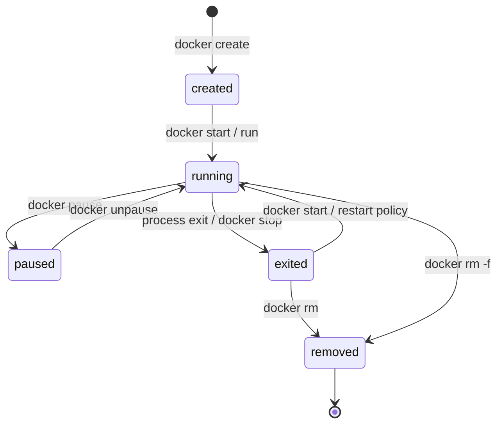
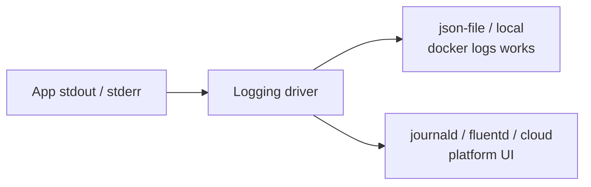
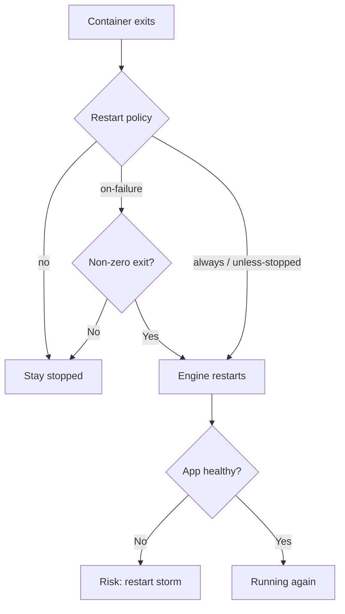
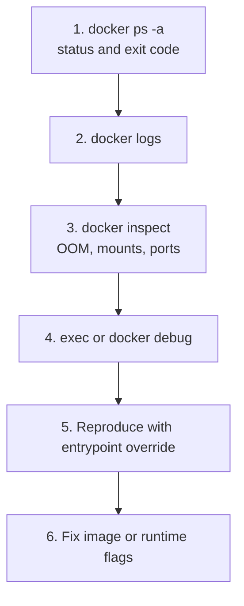

# Chapter 05 — Docker Containers Management

> **Learning Objectives**
>
> By the end of this chapter, you will be able to:
>
> - Manage the full container lifecycle: create, start, stop, restart, pause, remove
> - Debug with logs, logging drivers, `exec`, `docker debug`, inspect, and port mappings
> - Apply CPU/memory limits and understand basic pressure symptoms
> - Choose restart policies intentionally
> - Distinguish ephemeral container filesystems from data you must persist

---

## 05.1 Pets, Cattle, and a Stubborn Process

Old-school servers were pets: named, unique, nursed back to health. Containers work better as cattle: if one is sick, you check the logs, then replace it from the same image. The skill is not “SSH in and edit until it works”—it is **lifecycle control + diagnosis**.

You already built `task-api:0.1.0` in Chapter 04. This chapter uses it (or `nginx:alpine` if you need a stand-in) to practice professional container operations on a single host.

---

## 05.2 Lifecycle at a Glance

### In plain terms

A container is born (created), can run, pause, stop, restart, and eventually be removed. `docker run` is a convenience that creates and starts in one step.

Lifecycle fluency is what separates “I can follow a tutorial” from “I can operate a host.” Most outages are not exotic—they are exited containers, name conflicts, or restart storms that nobody inspected.



*Figure 05.1: Container lifecycle states — create, run, pause, exit, restart, and remove.*

| State (simplified) | Meaning |
|--------------------|---------|
| Created | Config exists; process not started |
| Running | Main process is alive |
| Paused | Process frozen via cgroups freezer |
| Exited / Stopped | Process ended (any exit code) |
| Removed | No longer present on the daemon |

> ⚠️ **Common Pitfall:** Using `docker run` for every experiment without `--rm` or `--name`. Exited containers pile up and the next `run --name` fails with a conflict.

### Under the hood

```bash
$ docker create --name task-api -p 8000:8000 task-api:0.1.0
$ docker start task-api
$ docker stop task-api
$ docker start task-api
$ docker restart task-api
$ docker pause task-api
$ docker unpause task-api
$ docker rm task-api          # must be stopped unless -f
```

One-shot convenience:

```bash
$ docker run --rm --name task-api -p 8000:8000 task-api:0.1.0
```

`docker run` = create + start (plus pull if needed). `--rm` removes the container when it exits—great for experiments, wrong for something you want to `docker start` again later.

List running versus all:

```bash
$ docker ps
$ docker ps -a
```

```text
CONTAINER ID   IMAGE            COMMAND                  STATUS         PORTS                                         NAMES
a1b2c3d4e5f6   task-api:0.1.0   "gunicorn --bind ..."    Up 2 minutes   0.0.0.0:8000->8000/tcp                        task-api
```

**What breaks if you `docker rm` a container you still needed for logs:** the writable layer and its local log files (for `json-file`) may be gone. Collect `docker logs` before destructive cleanup when investigating.

### In production

**Ownership:** whoever runs the host owns prune policy; app owners own naming and restart intent for their containers.

Name containers deliberately in scripts (`--name`) and prefer `--rm` for CI one-shots. On shared daemons, exited containers accumulate and confuse name conflicts—prune on a schedule, not by panic.

**Failure mode:** disk full of exited containers and unbounded logs. **Detect:** `docker system df`; host disk alerts. **Mitigate:** scheduled prune + log rotation (§05.4).

**Do:** `docker ps -a` before assuming a name is free. **Don’t:** `rm -f` production containers without capturing exit code and logs.

**Before you leave this section**

- **Understand:** run = create+start; stop keeps the instance; rm deletes it.
- **Try:** create/start/stop/rm Task API once through the long form.
- **Watch in prod:** Name conflicts and disk growth from exited containers.

---

## 05.3 Detached Mode, Attach, and Ports

### In plain terms

Detached mode (`-d`) runs in the background—like starting a service. Attaching connects your terminal to the main process streams. Publishing ports (`-p`) is how the host reaches the app inside.

The misconception: “the container is Up, so the API must be reachable on localhost.” Up means the process is alive—not that you published the right port or that the app listens on `0.0.0.0`.

> ⚠️ **Common Pitfall:** Forgetting `-p` then blaming the application. Listening inside the container is not the same as publishing to the host.

### Under the hood

```bash
$ docker run -d --name task-api -p 8000:8000 task-api:0.1.0
$ docker logs -f task-api
```

Attach to the main process streams:

```bash
$ docker attach task-api
```

Detach from an attached session without stopping the container: the default sequence is `Ctrl-P` then `Ctrl-Q` (not `Ctrl-C`, which may signal the process). Prefer `docker logs` for most debugging.

```bash
$ docker port task-api
```

```text
8000/tcp -> 0.0.0.0:8000
```

```bash
$ curl -s http://127.0.0.1:8000/healthz
```

```json
{"status":"ok"}
```

If curl fails but `docker ps` shows Up, check: wrong host port, app bound to `127.0.0.1` inside the container (should be `0.0.0.0`), or firewall/Desktop port sharing issues.

**What breaks if two containers publish the same host port:** the second `run` fails with a bind error. Pick another host port or stop the first container.

### In production

**Ownership:** developers choose what to publish on laptops; platform restricts host-port publishing on shared servers in favor of overlay/user-defined networks.

Publish only what you must. Prefer user-defined networks for container-to-container traffic (Chapter 06) instead of publishing every service to the host. In Kubernetes later, Services and probes replace ad-hoc `-p` habits—but the “listen on 0.0.0.0 inside the container” lesson remains.

**Do:** verify with `docker port` + curl. **Don’t:** publish databases to `0.0.0.0` on a laptop that shares Wi-Fi without intent.

**Before you leave this section**

- **Understand:** `-d` backgrounds; `-p` publishes; attach ≠ logs.
- **Try:** Run detached Task API, `docker port`, curl `/healthz`.
- **Watch in prod:** Unnecessary published ports on shared hosts.

---
## 05.4 Logs and Logging Drivers

### In plain terms

Applications should write to **stdout/stderr**. Docker’s logging driver decides where those streams go—local files, a journal, a log platform, or elsewhere. `docker logs` reads what the driver exposes for that container.

If the app only writes to `/var/log/app.log` inside the container, operators looking at `docker logs` see silence—and then invent folklore. Containers standardize the *stream*; you still have to aim your logging at it.

> ⚠️ **Common Pitfall:** Leaving `json-file` logs unbounded on busy hosts. Disk fills; then “mysterious” create/pull failures appear.

### Under the hood

#### Everyday log commands

```bash
$ docker logs task-api
$ docker logs --tail 100 task-api
$ docker logs --since 10m task-api
$ docker logs -f --timestamps task-api
```

Exit codes matter:

```bash
$ docker ps -a --filter name=task-api
```

Non-zero `Exited (1)` means the process crashed or failed at startup—read logs before restarting in a loop.

#### Which driver is active?

```bash
$ docker info --format '{{.LoggingDriver}}'
$ docker inspect -f '{{.HostConfig.LogConfig.Type}}' task-api
```

The default driver is typically **`json-file`**, which stores JSON log files on the Docker host. Other common drivers include:

| Driver | Role |
|--------|------|
| `json-file` | Default; local JSON files; supports `docker logs` |
| `local` | Compact local format; also supports `docker logs` |
| `journald` | Send to systemd journal (Linux) |
| `syslog` / `fluentd` / `awslogs` / `gcplogs` / … | Forward to external systems |

Per-container override with rotation options:

```bash
$ docker run -d --name task-api \
    --log-driver json-file \
    --log-opt max-size=10m \
    --log-opt max-file=3 \
    -p 8000:8000 \
    task-api:0.1.0
```

Daemon defaults (Linux example `/etc/docker/daemon.json`; on Desktop use Settings → Docker Engine):

```json
{
  "log-driver": "json-file",
  "log-opts": {
    "max-size": "10m",
    "max-file": "3"
  }
}
```

> ⚠️ **Warning:** Unlimited `json-file` logs can fill the disk. Always set rotation (`max-size` / `max-file`) on busy hosts.



*Figure 05.2: Applications should log to stdout/stderr; the driver decides whether `docker logs` or an external platform is the reader.*

If an app only writes to an internal file, you will not see it with `docker logs` unless you mount/copy that file—an anti-pattern for containers.

**What breaks if a remote driver does not support `docker logs`:** on-call muscle memory fails. Use the platform UI; document the driver in the runbook.

### In production

**Ownership:** platform sets default drivers and retention; app teams emit structured logs to stdout/stderr.

- Standardize on a driver strategy: local rotation for laptops; forwarding drivers or sidecars/agents for clusters.
- Remember: some remote drivers **do not** support `docker logs` the same way—use your log platform’s UI.
- Treat log volume as a capacity plan item alongside image storage (`docker system df`).
- Dual-ship carefully (local + remote) only when you understand duplication and retention costs.

**Failure mode:** disk full from logs → node NotReady / daemon unhealthy. **Detect:** disk alerts; `docker system df`. **Mitigate:** rotation defaults; central logging; alert before 100% full.

**Do:** set `max-size`/`max-file` on shared hosts. **Don’t:** `docker restart` without reading logs first.

> 🏭 **Production floor:** Unbounded container logs are a host-level blast radius—one chatty service can take down neighbors by filling the disk. Rotation is change-safety for storage, not a nice-to-have.

> 📘 **Deep Dive (optional):** The `local` driver is optimized for lower overhead than `json-file` while still supporting `docker logs`. See Docker’s logging driver docs when tuning high-churn services on a single host.

**Before you leave this section**

- **Understand:** Apps log to stdout/stderr; drivers store/forward; rotation protects disk.
- **Try:** Recreate Task API with `max-size=1m` and confirm the log driver via inspect.
- **Watch in prod:** Hosts without log rotation hitting disk alerts.

---

## 05.5 `exec` and `docker debug`

### In plain terms

`docker exec` starts a new process inside a *running* container’s namespaces—handy for a quick shell or one-liner. **`docker debug`** (Docker Desktop / supported subscriptions) goes further: it can give you a toolbox shell even when the image is slim or distroless and has no shell of its own.

The misconception: exec is how you configure production. It is forensics. Anything you install vanishes when the cattle container is replaced.

> ⚠️ **Common Pitfall:** Believing `exec` installs survive image rebuilds. Bake fixes into a new image digest.

### Under the hood

#### Classic `exec`

```bash
$ docker exec -it task-api /bin/sh
```

If the image has bash:

```bash
$ docker exec -it task-api /bin/bash
```

Useful one-liners without an interactive shell:

```bash
$ docker exec task-api python -c "import app; print('ok')"
$ docker exec task-api ps aux
```

`exec` starts a **new** process in the container’s namespaces. It is for diagnosis, not for installing permanent packages—those belong in the image build.

#### `docker debug`

```bash
$ docker debug task-api
```

Or debug an image that is not even running:

```bash
$ docker debug task-api:0.1.0
```

Non-interactive command form:

```bash
$ docker debug -c "curl -s http://127.0.0.1:8000/healthz" task-api
```

Characteristics to remember:

- Works as an alternative when `docker exec … bash` fails because the image has no shell
- Ships a customizable toolbox (editors, `curl`, process tools, and more)
- Available via Docker Desktop CLI/GUI for Pro / Team / Business subscriptions; not a built-in of every standalone Engine install
- Prefer fixing images and runtime flags for lasting repairs—debug sessions are for investigation

> 💡 **Tip:** If `docker debug` is not a recognized command, you are likely on Engine-only Linux without the Desktop debug component—or without a licensed Desktop feature set. Fall back to `exec`, ephemeral `--entrypoint sh` containers, or distroless-friendly debug sidecar patterns.

**What breaks if the container is not running:** classic `exec` fails. Use logs/inspect, `docker debug` on the image, or `docker run --entrypoint` to reproduce.

### In production

**Ownership:** on-call uses exec/debug under change control; app teams turn findings into Dockerfile/runtime PRs.

Use `exec`/`debug` for forensics, not configuration management. Anything you install in a running container disappears when the container is replaced. Bake fixes into a new image tag/digest and redeploy.

**Failure mode:** snowflake host where “only this container” has the hotfix package. **Detect:** fresh instances fail; config drift reviews. **Mitigate:** rebuild image; redeploy all replicas.

**Do:** capture commands you ran in the incident notes. **Don’t:** leave interactive roots in prod containers as the permanent fix.

**Before you leave this section**

- **Understand:** exec is a new process for diagnosis; lasting fixes belong in the image.
- **Try:** `docker exec` a one-liner against Task API; try `docker debug` if available.
- **Watch in prod:** Hotfixes that exist only inside a long-lived container.

---

## 05.6 Inspect: The Source of Truth

### In plain terms

When docs, dashboards, and memory disagree, `docker inspect` shows what the engine actually configured. Dashboards lie by aggregation; inspect shows the object.

> ⚠️ **Common Pitfall:** Scrolling megabytes of JSON under pressure instead of templated `-f` queries for the five fields that matter.

### Under the hood

```bash
$ docker inspect task-api
```

Query specific fields:

```bash
$ docker inspect -f '{{.State.Status}}' task-api
$ docker inspect -f '{{.RestartCount}}' task-api
$ docker inspect -f '{{.State.OOMKilled}}' task-api
$ docker inspect -f '{{json .HostConfig.Memory}}' task-api
$ docker inspect -f '{{.HostConfig.LogConfig.Type}}' task-api
$ docker inspect -f '{{range .NetworkSettings.Networks}}{{.IPAddress}}{{end}}' task-api
```

```text
running
0
false
268435456
json-file
172.17.0.2
```

**What breaks if you ignore `OOMKilled`:** you keep raising restarts while the real issue is a memory limit or leak. Always check OOM before blaming application “flakiness.”

### In production

**Ownership:** on-call owns the inspect checklist; platform may wrap common `-f` queries in aliases/runbooks.

Teach on-call a short inspect checklist: status, exit code, OOMKilled, RestartCount, mounts, port bindings, log driver, env (careful—secrets may appear). Prefer templated `-f` queries over scrolling megabytes of JSON under pressure.

**Do:** paste key inspect fields into the ticket. **Don’t:** paste entire env blocks with secrets into chat.

**Before you leave this section**

- **Understand:** inspect is ground truth for runtime config and state flags.
- **Try:** Run the six `-f` queries against a running Task API container.
- **Watch in prod:** Incidents that never checked `OOMKilled` or `RestartCount`.

---
## 05.7 Resource Limits

### In plain terms

**Why:** A single runaway container can consume all memory and force the kernel to kill processes (OOM), or starve neighbors of CPU. Limits protect the host and other workloads.

Without limits, “dense packing” becomes “shared fate with the noisiest neighbor.” Limits are how cattle share a field without one bull flattening the fence.

> ⚠️ **Common Pitfall:** Raising memory forever without checking `OOMKilled` or fixing leaks. You trade a crash for a more expensive crash later.

### Under the hood

```bash
$ docker run -d --name task-api \
    -p 8000:8000 \
    --memory 256m \
    --memory-swap 256m \
    --cpus 0.50 \
    task-api:0.1.0
```

| Flag | Effect |
|------|--------|
| `--memory` / `-m` | Hard memory limit |
| `--memory-swap` | Total memory+swap ceiling (set equal to memory to disable swap use) |
| `--cpus` | CPU time allowance (0.5 ≈ half a CPU) |
| `--cpu-shares` | Relative weight when contending (soft) |

Watch live usage:

```bash
$ docker stats task-api
```

```text
CONTAINER ID   NAME       CPU %     MEM USAGE / LIMIT     MEM %     NET I/O
a1b2c3d4e5f6   task-api   0.12%     45MiB / 256MiB        17.5%     1.2kB / 648B
```

If the app is OOM-killed, `docker inspect` shows `OOMKilled` true and logs may end abruptly—raise memory *or* fix a leak; do not only raise forever without understanding.

**What breaks if swap is unlimited while memory is limited:** behavior becomes harder to reason about under pressure. Many production setups set `--memory-swap` equal to `--memory` to disable swap use for that container.

### In production

**Ownership:** platform sets default limit policies on shared hosts; app teams size limits from load tests and `docker stats` / metrics.

Never run shared-host workloads without memory limits. Set CPU limits where noisy neighbors matter. In Kubernetes you will express the same ideas as requests/limits—learn the symptoms now on Docker.

**Failure mode:** one container OOMs the node. **Detect:** host OOM killer logs; multiple containers dying; `OOMKilled` true. **Mitigate:** memory limits on every workload; capacity headroom; find the leak.

**Do:** ship with memory limits in Compose/run scripts. **Don’t:** run unlimited memory on shared CI or shared lab daemons.

> 🏭 **Production floor:** A missing memory limit is a blast-radius decision: you are allowing one service to endanger every other container on the kernel. Require limits in review the same way you require non-root.

**Before you leave this section**

- **Understand:** Memory/CPU limits protect neighbors; OOMKilled is a first-class signal.
- **Try:** Run Task API with `--memory 128m` and watch `docker stats`.
- **Watch in prod:** Unlimited containers on shared hosts; ignored OOMKilled flags.

---

## 05.8 Restart Policies

### In plain terms

Restart policies tell the **engine** what to do when the container exits—handy for daemons on a single host, dangerous when they turn a crash loop into a CPU furnace.

Restarts are not healing. They are retries. If the image is broken, `always` only automates pain.

> ⚠️ **Common Pitfall:** `always` on a container that crashes instantly creates a restart storm—CPU churn and log spam.

### Under the hood

```bash
$ docker run -d --name task-api \
    --restart unless-stopped \
    -p 8000:8000 \
    task-api:0.1.0
```

| Policy | Behavior |
|--------|----------|
| `no` | Do not restart (default) |
| `on-failure[:max]` | Restart on non-zero exit, optional max retries |
| `always` | Always restart; also starts after daemon reboot |
| `unless-stopped` | Like `always`, unless you explicitly stopped it |

Update an existing container’s policy:

```bash
$ docker update --restart=on-failure:5 task-api
```

```bash
$ docker inspect -f '{{.RestartCount}} {{.HostConfig.RestartPolicy.Name}}' task-api
```

**What breaks if you never look at `RestartCount`:** dashboards may show “Up” during brief windows while the service is effectively down. Correlate restarts with logs.

### In production

**Ownership:** app owners choose policy intent; platform prefers orchestrator-level restarts for multi-service stacks.

Pair restarts with healthy images and attention to `RestartCount`. Prefer orchestrator-level restarts (Compose, Swarm, Kubernetes) for multi-service apps. A tight `always` loop on a broken image is an availability illusion—traffic fails while the daemon churns.

**Failure mode:** restart storm after a bad image promote. **Detect:** rising RestartCount; CPU spin; log spam. **Mitigate:** `docker stop` (explicit), pin previous digest, fix image, then bring back.

**Do:** prefer `on-failure` with a max for fragile jobs. **Don’t:** equate continuous restarts with high availability.



*Figure 05.3: Restart policies close the gap after exit — pair them with healthy images so you do not automate a crash loop.*

**Before you leave this section**

- **Understand:** Restart policies retry exits; they do not fix bad images.
- **Try:** Set `on-failure:3`, inspect RestartCount and policy name.
- **Watch in prod:** Rising RestartCount after a deploy with “Up” status flicker.

---

## 05.9 Stopping Gracefully vs Forcing

### In plain terms

`docker stop` knocks politely (SIGTERM), waits, then forces. `docker kill` kicks the door in. Prefer polite.

Graceful stop is how you drain in-flight work. Kill is for stuck processes—not a default habit.

> ⚠️ **Common Pitfall:** Shell-form PID 1 that never receives SIGTERM, so every stop becomes an effective kill after the grace period.

### Under the hood

```bash
$ docker stop task-api
```

Sends the configured stop signal (`STOPSIGNAL` / default SIGTERM), waits a grace period (default 10s), then SIGKILL.

```bash
$ docker kill task-api
```

Sends SIGKILL immediately (unless you choose another signal). Prefer `stop` so Gunicorn workers can finish requests.

```bash
$ docker stop -t 30 task-api
```

Your app must handle SIGTERM—another reason exec-form `ENTRYPOINT`/`CMD` matters (Chapter 04).

**What breaks if grace time is shorter than request drain:** clients see truncated responses and connection resets during deploys. Raise `-t` (and later `terminationGracePeriodSeconds`) to match reality.

### In production

**Ownership:** app teams implement signal handling; operators tune grace periods to observed drain times.

Tune grace periods to match drain time (in-flight requests, connection cleanup). In Kubernetes, the same idea becomes `terminationGracePeriodSeconds` plus preStop hooks—practice good signal handling now.

**Do:** prefer `stop`; measure needed grace. **Don’t:** `kill` as the everyday deploy step.

**Before you leave this section**

- **Understand:** stop = SIGTERM + grace + SIGKILL; kill = immediate by default.
- **Try:** `docker stop -t 30` on Task API while curling.
- **Watch in prod:** Deploys that reset connections because grace is too short.

---

## 05.10 Cleaning Up and Copying Files

### In plain terms

Remove containers you do not need. Prune carefully on shared machines. Copy files out when you need forensics.

Cleanup is operational hygiene. Panic pruning without checking volumes is how teams delete the only copy of data they thought was “just a container.”

> ⚠️ **Common Pitfall:** `docker system prune -a` on a shared builder mid-day without a change window.

### Under the hood

```bash
$ docker rm task-api
$ docker rm -f task-api    # force stop + remove
```

Bulk hygiene:

```bash
$ docker container prune
$ docker system prune
```

`system prune` can delete unused networks and dangling images; add `-a` only when you intend to remove unused images too.

```bash
$ docker cp task-api:/app/app.py ./app.py.copied
```

**What breaks if volumes are anonymous and you prune carelessly:** data you thought was in “the container” may be in a volume that prune policies touch differently—learn volumes in Chapter 07 before aggressive cleanup on stateful hosts.

### In production

**Ownership:** platform schedules cleanup on CI; nobody freelances destructive prunes on production data nodes.

Schedule cleanup for CI agents. Never run destructive prunes on production nodes without confirming volumes and named resources you still need (Chapter 07).

**Do:** `docker system df` before prune. **Don’t:** prune production without a ticket and volume check.

**Before you leave this section**

- **Understand:** rm vs prune vs system prune -a; cp for forensics.
- **Try:** `docker cp` one file out of Task API, then remove the container.
- **Watch in prod:** Unscheduled prune -a on shared or stateful hosts.

---

## 05.11 A Practical Debugging Loop

### In plain terms

Follow a fixed order so you do not thrash: status → logs → inspect → exec/debug → reproduce → fix the image or flags.

The loop is the product. Random tool flipping under stress is how incidents get longer.

> ⚠️ **Common Pitfall:** Using `docker restart` as the only fix without reading logs—you may restart forever into the same crash.

### Under the hood

When a container misbehaves:



*Figure 05.4: A fixed debugging order prevents thrashing — status, logs, inspect, then controlled reproduce.*

1. **`docker ps -a`** — Is it running, restarting, or exited? Exit code?
2. **`docker logs`** — App error, missing module, bind failure? (Confirm logging driver supports this.)
3. **`docker inspect`** — OOMKilled, env vars, mounts, port bindings, RestartCount?
4. **`docker exec` or `docker debug`** — Only if still running (or via debug-on-image); check files, DNS, local curl.
5. **Reproduce** with `docker run --rm -it --entrypoint sh image` to debug startup.
6. **Fix the image or runtime flags**, do not “hotfix” a running cattle container as the long-term solution.

Interactive override example:

```bash
$ docker run --rm -it --entrypoint /bin/sh task-api:0.1.0
```

**What breaks if you skip platform/arch checks:** `exec format error` looks like a mysterious startup failure until you inspect Architecture.

### In production

**Ownership:** on-call follows the loop; app teams close the loop with a digest bump.

Write this loop into your runbook. Add “check disk for log growth” and “check platform/arch” (`exec format error`) as standing items. Escalate to orchestrator events once you move to Kubernetes (Part II).

**Do:** name which step failed in the ticket. **Don’t:** restart-as-step-zero forever.

**Before you leave this section**

- **Understand:** The six-step order beats random thrashing.
- **Try:** Break a container on purpose (bad command), walk the loop once.
- **Watch in prod:** Tickets that only say “restarted it” with no logs/inspect.

---

## 05.12 Ephemeral Filesystems

### In plain terms

Writes to the container’s writable layer vanish when the container is removed. Treat the container disk like a whiteboard in a rented room.

The misconception: “the database files are in the container, so redeploying is fine.” Redeploying removes the room—and the whiteboard.

> ⚠️ **Common Pitfall:** Accidental reliance on the writable layer for durable state—leading cause of “we lost data when we redeployed.”

### Under the hood

For the Task API’s in-memory task list, data already resets on process restart. For databases and uploads you will need **volumes** (Chapter 07). Until then, treat container disks as temporary.

```bash
$ docker run --rm task-api:0.1.0 python -c "open('/tmp/x','w').write('hi')"
# container removed: /tmp/x is gone with it
```

**What breaks if you store uploads only in the writable layer:** the next replaceable instance has empty storage; users see missing files after a routine redeploy.

### In production

**Ownership:** app architects decide ephemeral vs volume vs external store; platform provides volume classes later.

Decide explicitly for every path: ephemeral, bind mount (dev), or named volume (data). Accidental reliance on the writable layer is a leading cause of “we lost the database when we redeployed.”

**Do:** document data paths before go-live. **Don’t:** discover durability requirements during the first rollback.

> 🏭 **Production floor:** Before promoting any stateful container, write the data path decision in the change ticket: ephemeral, volume, or managed service. Ambiguity here is how routine deploys become data incidents.

**Before you leave this section**

- **Understand:** Writable layer dies with `rm`; durable data needs volumes or external stores.
- **Try:** Write a file in a `--rm` container and confirm it is gone after exit.
- **Watch in prod:** Services whose “disk” is only the container writable layer.

---
## 05.13 Common Pitfalls

> ⚠️ **Common Pitfall:** Using `docker restart` as the only fix.  
> Without reading logs, you may restart forever into the same crash.

> ⚠️ **Common Pitfall:** `docker run` every experiment without `--rm` or names.  
> You accumulate exited containers and confusing name conflicts (`Conflict. The container name ... is already in use`).

> ⚠️ **Common Pitfall:** Forgetting `-p` then blaming the app.  
> Listening inside the container is not the same as publishing to the host.

> ⚠️ **Common Pitfall:** Setting `always` on a broken container.  
> Stop it explicitly (`docker stop`) and fix the image; watch `RestartCount`.

> ⚠️ **Common Pitfall:** Believing `exec` installs survive image rebuilds.  
> Anything not in the image or a volume is gone when the container is replaced.

> ⚠️ **Common Pitfall:** Leaving `json-file` logs unbounded.  
> Busy containers can exhaust disk; set `max-size` / `max-file`.

---

## 05.14 Hands-On Exercises

1. Run `task-api:0.1.0` detached with `-p 8000:8000`, verify `/healthz`, then practice `stop`, `start`, and `restart`.
2. Trigger logs with a few API requests; run `docker logs --tail 20 --timestamps task-api`.
3. Inspect the logging driver: `docker inspect -f '{{.HostConfig.LogConfig.Type}}' task-api`. Recreate the container with `--log-opt max-size=1m --log-opt max-file=2`.
4. `docker exec -it task-api /bin/sh` and run `ps aux` and a local request to `/healthz`. Exit the shell without stopping the container.
5. If `docker debug` is available in your Desktop edition, run `docker debug task-api` and try `curl` from the debug toolbox. If not available, note that in your lab journal and continue with `exec`.
6. Recreate the container with `--memory 128m --cpus 0.25 --restart on-failure:3` and observe `docker stats` and `docker inspect -f '{{.HostConfig.RestartPolicy.Name}}' task-api`.
7. Stop and `docker rm` the container; confirm `docker ps -a` no longer lists it.
8. Start a container that exits immediately, diagnose with `ps -a` and logs, then remove it.

---

## 05.15 Check Your Understanding

**Q1.** What is the difference between `docker stop` and `docker kill`?

<details>
<summary>Show answer</summary>

`stop` sends the configured stop signal (usually SIGTERM) and allows a grace period before SIGKILL. `kill` defaults to SIGKILL immediately, giving the process no chance to shut down cleanly.

</details>

**Q2.** Why might `docker logs` be empty even though the app “logs” somewhere?

<details>
<summary>Show answer</summary>

The application may be writing to a file inside the container instead of stdout/stderr. Also, some logging drivers forward elsewhere and may not support `docker logs` the same way as `json-file` or `local`.

</details>

**Q3.** What does `--restart unless-stopped` do after a Docker daemon reboot?

<details>
<summary>Show answer</summary>

The container is started again after reboot unless you had explicitly stopped it before the reboot.

</details>

**Q4.** Does publishing `-p 8000:8000` require `EXPOSE 8000` in the Dockerfile?

<details>
<summary>Show answer</summary>

No. `EXPOSE` documents intent. `-p` publishes ports at runtime independently. Including both is still good practice for clarity.

</details>

**Q5.** When would you reach for `docker debug` instead of `docker exec`?

<details>
<summary>Show answer</summary>

When the image is slim/distroless (no shell/tools), when you want the debug toolbox, or when you need to investigate an image/container where classic `exec … sh` cannot work. Availability depends on Docker Desktop / licensing; otherwise use entrypoint overrides or other debug patterns.

</details>

**Q6.** Why are memory limits a production concern on shared hosts?

<details>
<summary>Show answer</summary>

Without limits, one container can consume available memory, cause OOM conditions, and destabilize other containers or the host.

</details>

---

## 05.16 Key Takeaways

- Master lifecycle commands: `run`, `ps`, `stop`, `start`, `restart`, `pause`, `rm`.
- Debug in order: status → logs → inspect → exec/debug → controlled reproduce.
- Configure logging drivers and rotation; apps must log to stdout/stderr.
- Publish ports explicitly; use `docker stats` and memory/CPU flags to protect the host.
- Pick restart policies deliberately; avoid restart storms on broken images.
- Container filesystems are ephemeral—persist important data with volumes (Chapter 07).

---

## 05.17 Official documentation map

| Topic | Official page |
|-------|---------------|
| `docker run` reference | [docker container run](https://docs.docker.com/reference/cli/docker/container/run/) |
| `docker logs` | [docker container logs](https://docs.docker.com/reference/cli/docker/container/logs/) |
| Configure logging drivers | [Configure logging drivers](https://docs.docker.com/engine/logging/configure/) |
| json-file driver | [JSON File logging driver](https://docs.docker.com/engine/logging/drivers/json-file/) |
| `docker debug` | [docker debug](https://docs.docker.com/reference/cli/docker/debug/) |
| Resource constraints | [Runtime options — resources](https://docs.docker.com/engine/containers/resource_constraints/) |
| Start containers automatically | [Start containers automatically](https://docs.docker.com/engine/containers/start-containers-automatically/) |
| Container concepts | [What is a container?](https://docs.docker.com/get-started/docker-concepts/the-basics/what-is-a-container/) |

**Previous:** [Chapter 04 — Dockerfiles and Builds](04-dockerfiles-and-builds.md) | **Next:** [Chapter 06 — Docker Networking](06-docker-networking.md)
