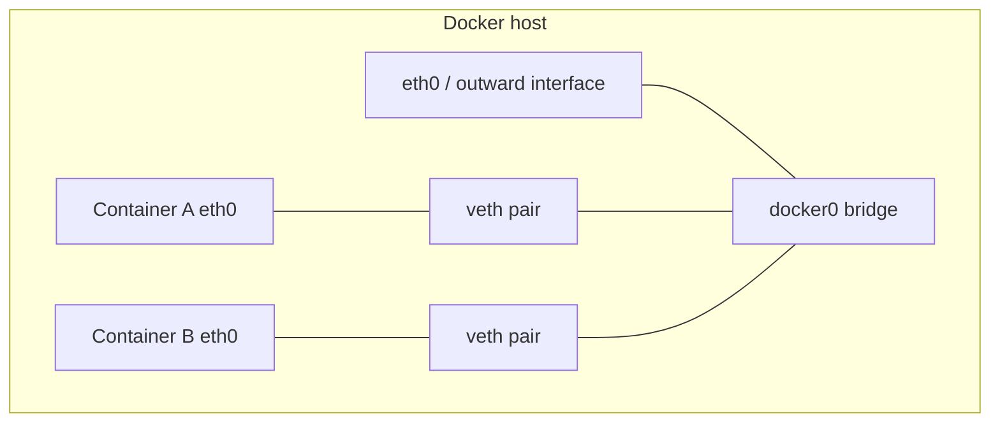
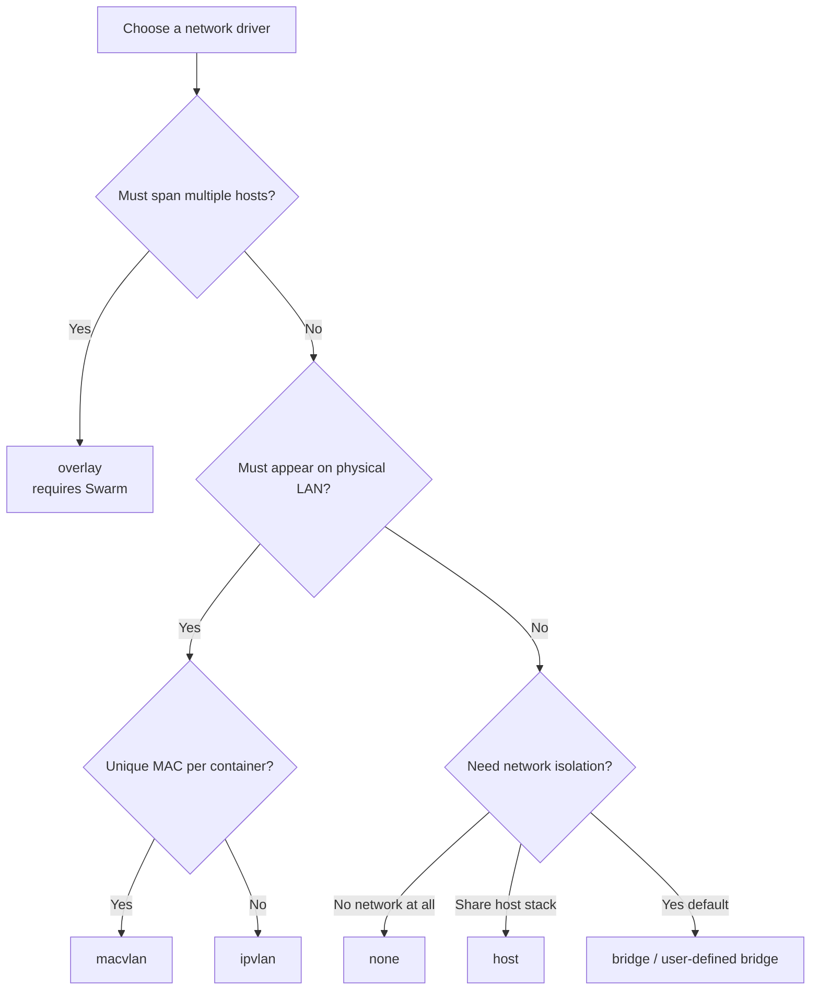
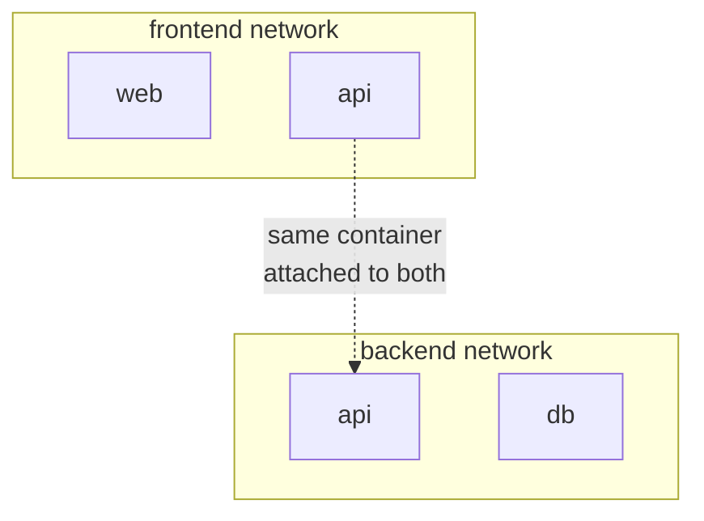
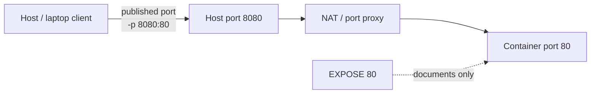

# Chapter 06 — Docker Networking

> **Learning Objectives**
>
> By the end of this chapter, you will be able to:
>
> - Describe how a container gets a network connection, and why Docker walls it off by default
> - Pick the right driver for a job: `bridge`, `host`, `none`, `overlay`, `macvlan`, or `ipvlan`
> - Build your own networks and let containers find each other by name using Docker's built-in DNS
> - Open a container port to the outside world with `-p` and `-P`, and say what `EXPOSE` does not do
> - Swap the old `--link` flag for a network you created yourself

---

## 06.1 The apartment building

Picture a large apartment building. Every apartment is a container. Each one has its own door, its own wiring, and its own phone extension.

Residents call each other through the building's internal switchboard. They never dial an outside line to do it. But when someone on the street wants apartment 4B, the front desk has to forward that call on purpose. The front desk is the Docker host.


*Figure 06.A: Each apartment (container) has private wiring; the front desk publishes only chosen doors.*

Docker networking works the same way:

- Each container gets its own **network namespace** — a private set of network interfaces, routes, and firewall rules that belongs to that container alone.
- Containers on the same network talk to each other over Docker's virtual networks and its built-in name lookup (DNS).
- The outside world reaches a container only when the host **publishes** a port, which means forwarding one host port to one container port.

Isolation is the default for a good reason. A noisy or hacked container should never see traffic that was meant for someone else. You open exactly the doors you need, and no more.

---

## 06.2 What happens when a container starts

### In plain terms

When a container starts, Docker gives it a private network connection and a private IP address of its own.

Why should you care? Because you will run many containers on one machine — maybe ten on a laptop, maybe a hundred on a build server. You do not want them all sharing one flat network where any process can listen to another one's traffic or pretend to be it. So Docker hands each container its own **network namespace**, meaning a private copy of the network interfaces, the routing table, and the firewall rules. Docker then plugs that namespace into a virtual switch. The container behaves as if it owned an entire network stack, because as far as the kernel is concerned, it does.

The apartment picture still fits. Starting a container is like assigning a new apartment. Docker wires up a private phone, plugs it into the switchboard on that floor (a network), and hands over an extension number (an IP address). Outsiders cannot ring that apartment until you ask the front desk to publish a port.

> ⚠️ **Common Pitfall:** You might think a container's IP address (say `172.17.0.2`) is something you can send to a colleague or paste into a config file. It is not stable. Docker picks that address from the bridge's subnet when the container starts, and the next `docker run` may pick a different one. Containers should find each other by **name** on a network you created yourself (Section 06.6), never by an IP address you copied down.

### Under the hood

Here is what actually happens on the machine. When you run a container, Docker:

1. Creates a network namespace for it.
2. Attaches it to a network — by default, the built-in bridge named `bridge`.
3. Assigns a private IP from that network's subnet (for example, `172.17.0.2`).

To wire that up, the daemon creates a **veth pair** — a virtual Ethernet cable with two ends. One end appears inside the container's namespace as `eth0`. The other end plugs into the `docker0` bridge on the host. The bridge acts like a small unmanaged switch: frames from one container reach the bridge, and the host's iptables/nftables rules decide what may leave through **NAT** (network address translation, which rewrites addresses on packets as they pass). Outbound packets are source-NATed to the host's IP. That is why a container can reach the internet even though nothing on the internet can reach it back without a published port.

```bash
$ docker network ls
NETWORK ID     NAME      DRIVER    SCOPE
9f3c2a1b4d5e   bridge    bridge    local
1a2b3c4d5e6f   host      host      local
7g8h9i0j1k2l   none      null      local
```

```bash
$ docker run -d --name web nginx:1.27
$ docker inspect web --format '{{.NetworkSettings.IPAddress}}'
172.17.0.2
```



*Figure 06.1: On the default bridge, containers connect through veth pairs to `docker0`; outbound traffic NATs via the host.*

You can watch this happen. `docker inspect` shows the assigned address, and `ip addr` on the host lists the transient `veth…` interface that appears when the container starts and disappears when it stops:

```bash
$ docker inspect web --format '{{range $k,$v := .NetworkSettings.Networks}}{{$k}}={{$v.IPAddress}}{{end}}'
bridge=172.17.0.2
```

**What breaks if you ignore this:** a container that lands on the default `bridge` cannot resolve another container by name (the default bridge has no embedded DNS), so an app configured with `db` as its database host fails with a name-resolution error even though both containers are healthy and on the "same" bridge.

### In production

Always know which network a workload lands on. A container that falls onto the default `bridge` by accident is a common cause of broken name lookups and a wider blast radius than you intended. Name the network with `--network` (or a Compose network) for every multi-container app.

**Who owns this:** the platform team owns the network layout — which named networks exist, their subnets, and their trust boundaries. The app team owns *which* network each service attaches to, written down in Compose or in the run command. When those two drift apart — for example, a service quietly falling back to `bridge` because someone dropped the `--network` flag — you get an app that works in one environment and cannot reach its database in another.

**Failure mode and detection:** the first signal is usually a connection-refused or name-resolution error in the application's own logs, not a Docker error, because Docker did exactly what you asked. Check where the container actually landed with `docker inspect <ctr> --format '{{json .NetworkSettings.Networks}}'` before you assume the app is broken. **Do** name the network in every long-lived definition; **don't** rely on the default bridge for anything beyond a throwaway `docker run` you type by hand.

**Before you leave this section**

- **Understand:** each container gets its own network namespace and a NATed private IP; that IP is not stable and is not a service address.
- **Try:** run a container, read its IP with `docker inspect`, stop and restart it, and confirm the address may change.
- **Watch in prod:** connection or DNS failures that trace back to a workload silently landing on the default `bridge` instead of its intended network.

---

## 06.3 Bridge, host, and none

### In plain terms

`bridge`, `host`, and `none` are three built-in **network drivers** — the parts of Docker that decide how a container's network gets wired — and all three work on a single machine.

You should care because this one setting decides how much of the host's network a container can see. Picking the wrong end of that range is one of the most common early mistakes. The three drivers run from "fully walled off" to "no wall at all":

- **Bridge** — a private virtual switch on one machine; the usual default for apps that talk to each other and occasionally to the outside world via published ports.
- **Host** — the container shares the host's network stack: no private IP, no NAT, maximum speed, zero network isolation.
- **None** — only loopback; the container is deliberately unplugged.

Think of it as choosing how an apartment connects to the world. Bridge is the normal apartment with a private line through the building switchboard. Host means knocking down the wall between the apartment and the building's own phone system. That is fast and direct, but now the guest answers the landlord's phone. None is an apartment with the phone jack pulled out.

> 💡 **In one line:** `bridge` means a private network plus the ports you choose to publish, `host` means the host's own network with no isolation, and `none` means no network at all.

> ⚠️ **Common Pitfall:** You might reach for `--network host` because "it's simpler — no port mapping to think about." That convenience is exactly the trap. You also inherit every port conflict on the host, and you lose the wall that makes containers safe to run side by side. Host networking is a deliberate choice about speed or compatibility, not a shortcut around learning `-p`.

### Under the hood

Here is what each driver actually does on the machine:

**Bridge.** The `bridge` driver creates a Linux bridge (default: `docker0`). Containers on the same bridge reach each other by IP; outbound traffic is NATed through the host.

```bash
$ docker run -d --name web nginx:1.27
$ docker inspect web --format '{{range .NetworkSettings.Networks}}{{.IPAddress}}{{end}}'
172.17.0.2
```

**Host.**

```bash
$ docker run -d --network host --name fastweb nginx:1.27
$ curl -s -o /dev/null -w "%{http_code}\n" http://127.0.0.1:80
200
```

There is no `-p` mapping: if the process listens on port 80, it is the host's port 80. Host networking is native on Linux. On Docker Desktop (macOS/Windows) it is supported in recent Desktop versions but runs through the Desktop Linux VM, so behavior can differ from bare-metal Linux.

**None.**

```bash
$ docker run --rm --network none alpine:3.20 ip addr
1: lo: <LOOPBACK,UP,LOWER_UP> mtu 65536 qdisc noqueue state UNKNOWN
    link/loopback 00:00:00:00:00:00 brd 00:00:00:00:00:00
    inet 127.0.0.1/8 scope host lo
```

Useful for batch jobs that only touch local files, or for workloads where zero network access is a security requirement.

**What breaks if X:** if a host-networked container listens on port 80 and the host — or another host-networked container — already owns port 80, the second process fails to bind with `address already in use`. There is no NAT layer to remap it, because with host networking the container *is* using the host's real port. This is the failure that most surprises people migrating a `-p 80:80` service to `--network host`.

### In production

| Driver | Scope | Isolation | Typical use | Port publishing |
|--------|-------|-----------|-------------|-----------------|
| `bridge` | Single host | Yes (NAT) | Most single-host apps | Yes (`-p` / `-P`) |
| `host` | Single host | No | Latency-sensitive tools, host-facing daemons | No (shares host ports) |
| `none` | Single host | Total | Offline jobs, lockdown | Not applicable |

Use bridge plus published ports for ordinary services. Use host networking only when you have measured a real need, and write down the isolation you gave up. Use `none` when the threat model says "this process must not talk to the network."

**Who owns this:** whoever approves the run configuration owns this trade-off. Host networking must never be a silent default buried in a script. It is a security decision that belongs in a review, because a hacked host-networked container can reach services bound to loopback — databases, metrics endpoints, the Docker socket proxy — that the operator assumed no container could touch.

**Failure mode and detection:** the classic host-networking incident is a port collision that only shows up when you scale out, such as two replicas of the same host-networked service landing on one node. Catch it early by never assuming a host port is free; check with `ss -ltnp` on the host. **Do** keep latency-sensitive tools and tools that must see real host interfaces (some monitoring agents, VPN clients) on host networking, with a written note saying why; **don't** put an internet-facing application there just to skip a `-p` flag.

> 🏭 **Production floor:** Host networking removes the container's network isolation entirely — one process now shares the host's ports, loopback, and interface list. Treat switching a service to `--network host` as a change-managed decision: record *why*, confirm no port collisions with `ss -ltnp`, and note the expanded blast radius (a container escape now starts with full visibility of host-local services). Never flip an internet-facing service to host mode to "fix" a port mapping problem.

**Before you leave this section**

- **Understand:** bridge isolates with NAT, host shares the whole stack with zero isolation, none removes networking; the right choice is a trade-off, not a preference.
- **Try:** run the same image on `bridge`, `host`, and `none`; compare `docker inspect` output and whether the app is reachable.
- **Watch in prod:** host-networked services colliding on a shared host port, and host mode quietly widening a container's blast radius.



*Figure 06.2: A driver decision path — start from multi-host and underlay needs, then fall back to bridge, host, or none.*

> ⚠️ **Warning:** Two host-networked containers cannot both bind the same host port. Treat the host port namespace as shared scarce resource.

---

## 06.4 Overlay networks

### In plain terms

An **overlay** network is a virtual switch that stretches across several Docker hosts at once.

You should care because a bridge lives on exactly one machine. The moment your application outgrows a single host — three web copies on one server, a database on another — a bridge cannot reach across the gap. An overlay builds a software network *on top of* whatever physical network already connects your hosts. Containers on `node-1` and `node-2` then share one subnet and talk to each other by name, as if the machines underneath did not exist. That is why every real orchestrator has something overlay-shaped inside it.

Here is the trick that makes it work. Each host wraps container traffic inside ordinary packets addressed to the peer host, a technique called **tunneling**. Docker normally tunnels with **VXLAN**, a standard way to carry one network's frames inside another network's UDP packets. Containers on different machines then act as if they were plugged into the same **LAN** (local area network — one shared local network segment).

> ⚠️ **Common Pitfall:** You might think overlay is "just another driver you pick with `--driver overlay`" on any Docker install. It is not available on a standalone daemon: overlay needs a control plane to distribute network state and encryption keys to every participating host, and on Docker that control plane is Swarm mode.

### Under the hood

Overlay networks require **Swarm mode** (Chapter 09). On a standalone daemon:

```bash
$ docker network create --driver overlay --attachable my-overlay
Error response from daemon: This node is not a swarm manager. Use "docker swarm init" ... to create one.
```

That error is expected — and useful. After `docker swarm init`, you create overlay networks for multi-host services; Swarm's routing mesh (Chapter 09) publishes service ports across the cluster.

Under the covers, each host encapsulates container traffic in **VXLAN** frames (UDP port 4789) and sends them to the peer host that hosts the destination container. Swarm distributes the mapping of "which container IP lives behind which host" through its Raft-backed control plane, and can encrypt the data plane with IPsec when you pass `--opt encrypted`. **What breaks if X:** if a firewall between your hosts blocks the VXLAN port (4789/udp) or the Swarm control ports (2377/tcp, 7946/tcp+udp), the network is created successfully but cross-host traffic silently black-holes — containers on the same host talk fine, cross-host calls time out. That asymmetry is the tell.

### In production

Use overlay when services must run across several nodes under Swarm. In Kubernetes (Part II), CNI plugins do the same multi-host job — do not expect Docker overlay on its own to wire up a Kubernetes cluster.

**Who owns this:** the platform/network team owns the firewall rules and the **MTU** budget (maximum transmission unit — the largest packet size a network path will carry) that make overlay work. The app team only owns which services attach to which overlay. **Failure mode and detection:** the telltale symptom is "works within a node, times out across nodes," which points at blocked VXLAN/control ports or an MTU mismatch (VXLAN adds ~50 bytes of overhead, so a path that only passes 1500-byte frames can drop the wrapped packets). Detect with a cross-node `ping`/`curl` between tasks and by checking `docker network inspect` on each node. **Do** open 2377/tcp, 7946/tcp+udp, and 4789/udp between nodes and consider `--opt encrypted` for links you do not trust; **don't** assume overlay alone secures traffic — plain VXLAN is readable by anyone on the underlying network.

**Before you leave this section**

- **Understand:** overlay stretches one virtual L2 network across many hosts using VXLAN, and it requires Swarm's control plane to exist.
- **Try:** run `docker network create --driver overlay …` on a non-Swarm daemon and read the error; then re-run after `docker swarm init`.
- **Watch in prod:** cross-node connectivity that breaks when VXLAN/control ports are firewalled or the path MTU is too small for encapsulated frames.

---

## 06.5 Macvlan and ipvlan

### In plain terms

**Macvlan** and **ipvlan** are drivers that place a container directly on the physical network the host sits on, instead of behind Docker's NAT.

Why would you want that? Some applications need to look like a real machine on the office or data-center network. A router, a firewall rule, or an older monitoring tool expects to see the app at its own address on the **underlay** — the real physical network your hosts plug into. Behind Docker NAT the container only has a private address that none of those tools can reach. Macvlan and ipvlan attach the container to a **parent interface**, meaning a real network card on the host such as `eth0`, so the container appears on that physical network with an address of its own.

The two drivers differ in one detail: the hardware address each container shows to the network.

- **Macvlan** assigns each container its **own MAC address** (the hardware address an Ethernet device uses), so neighbors see distinct Ethernet devices.
- **Ipvlan** shares the **parent interface's MAC** and distinguishes containers mainly by IP (and mode). Prefer ipvlan when the network or NIC limits how many MACs you may attach.

> ⚠️ **Common Pitfall:** You might assume Docker knows about the rest of your network once a container sits on the LAN. It does not. Docker's address assignment (**IPAM**, or IP address management) hands out addresses from the range you gave it. It has no idea which addresses your DHCP server already leased or which ones are set statically on other machines. Let those ranges overlap and you get an IP collision: two devices claim one address, and both start dropping traffic. Reserve a range that nothing else will ever hand out.

### Under the hood

Here is what this looks like on a real machine. Neither driver is supported on Docker Desktop or in rootless mode in the usual beginner setups. Use a Linux host with a real parent NIC (for example `eth0` or a VLAN sub-interface).

**Macvlan (bridge mode):**

```bash
$ docker network create -d macvlan \
    --subnet=192.168.1.0/24 \
    --gateway=192.168.1.1 \
    -o parent=eth0 \
    lan-macvlan

$ docker run -d --name lan-web --network lan-macvlan nginx:1.27
$ docker inspect lan-web --format '{{range .NetworkSettings.Networks}}{{.IPAddress}}{{end}}'
192.168.1.2
```

**Ipvlan L2** (closest cousin to macvlan without unique MACs):

```bash
$ docker network create -d ipvlan \
    --subnet=192.168.210.0/24 \
    --gateway=192.168.210.254 \
    -o ipvlan_mode=l2 \
    -o parent=eth0 \
    ipvlan210
```

Ipvlan also supports **L3** mode for routing-oriented designs; choose L2 when you want same-subnet LAN presence.

> 💡 **Tip:** By default the host itself often cannot reach macvlan/ipvlan container IPs on the same parent without an extra shim interface. Plan host-to-container access deliberately (another network, a proxy, or documented host config) — do not assume `curl` from the host "just works."

### In production

| Driver | Unique MAC per container? | Best when |
|--------|---------------------------|-----------|
| `macvlan` | Yes | Legacy apps / appliances that must look like physical hosts on the LAN |
| `ipvlan` | No (shares parent MAC) | MAC exhaustion, switch port security limits, or L3 underlay integration |

Checklist:

1. Confirm the parent interface and VLAN tagging with your network team.
2. Reserve IP ranges so Docker IPAM does not collide with DHCP or static hosts.
3. Document that Desktop/rootless learners cannot reproduce this lab as-is.
4. For Swarm-scoped macvlan, node-specific `--config-only` networks are often required so each node uses a non-overlapping `--ip-range` — IPAM is not centrally coordinated the way overlay is.

**Who owns this:** because macvlan and ipvlan put containers straight onto the physical LAN, they cross into the network team's territory. IP ranges, VLAN IDs, and switch port security are now shared with Docker's IPAM. The worst failure here is an **IP collision**: Docker hands a container an address that a static host or a DHCP lease already uses, and both ends start dropping traffic on and off. Detect it with duplicate-address complaints in switch logs or `arping` on the parent subnet. **Do** carve out a dedicated, documented range that DHCP will never lease; **don't** let two hosts' macvlan IPAM ranges overlap.

**Before you leave this section**

- **Understand:** macvlan gives each container its own MAC on the LAN; ipvlan shares the parent MAC and leans on IP (and L2/L3 mode) instead.
- **Try:** on a Linux host with a spare subnet, create a macvlan network and confirm whether the host can reach the container without a shim.
- **Watch in prod:** IP collisions with existing DHCP/static hosts, and MAC-count limits on cloud NICs or security-locked switch ports.

---

## 06.6 User-defined networks and embedded DNS

### In plain terms

A **user-defined network** is a network you create yourself with `docker network create`, instead of accepting the built-in one Docker gives you by default.

You should care because of the problem you met in Section 06.2. Container IP addresses are unstable, and the default `bridge` cannot look up names. So any app that points at a peer by IP address breaks the moment that peer restarts with a different address. A network you create yourself fixes this at the root. Docker runs a tiny **embedded DNS** server — a name lookup service built into Docker — at `127.0.0.11` inside every container on that network. It turns container and service names into whatever IP address they hold right now.

That makes the rule short: do not leave a multi-container app on the default `bridge`. Create your own network and refer to peers **by name** — `db`, `api`, `cache` — instead of by fragile IP addresses. You write `db` in the connection string once and never touch it again, even after the container behind that name is recreated a hundred times.

> ⚠️ **Common Pitfall:** You might assume the built-in `bridge` network gives you name lookups "because it's still a bridge." It does not. Automatic DNS between containers only works on networks *you* create. This single difference is why so many first multi-container setups without Compose fail with "could not resolve host db."

### Under the hood

Here is the whole pattern on one machine — create the network, then start both containers on it:

```bash
$ docker network create app-net
$ docker run -d --name db --network app-net postgres:16
$ docker run -d --name api --network app-net --env DATABASE_URL=postgres://tasks:dev@db:5432/tasks task-api:0.1.0
$ docker exec api ping -c 1 db
PING db (172.19.0.2): 56 data bytes
64 bytes from 172.19.0.2: seq=0 ttl=64 time=0.089 ms
```

User-defined networks also give you:

- **Isolation** — containers on different networks cannot see each other unless you attach them to both.
- **Live attach/detach** — `docker network connect` / `disconnect` on running containers.
- **Custom subnets** — `docker network create --subnet 10.5.0.0/24 mynet` when addressing must be predictable.



*Figure 06.3: Dual-network attachment — the API bridges trust zones while the database stays on the backend network only.*

| Need | Prefer |
|------|--------|
| Multi-container DNS by name | User-defined bridge |
| Default catch-all for lonely containers | Built-in `bridge` |
| Attach one service to two zones | `docker network connect` (API on frontend + backend) |

### Legacy links

Older tutorials use `--link`:

```bash
$ docker run -d --name api --link db:database my-api:1.0
```

**`--link` is legacy and deprecated.** It only works on the default bridge, injects brittle `/etc/hosts` and env vars, and does not survive recreation cleanly. Replace it with a user-defined network and DNS names.

**What breaks if X:** if two containers on the same user-defined network share a `--network-alias`, Docker's embedded DNS returns *all* matching IPs and round-robins between them. That is a feature for simple load balancing, but it surprises people who assumed a name maps to exactly one container — a stale replica still holding the alias will receive a share of traffic until it is removed.

### In production

Segment by trust boundary: put databases on a backend network, frontends on a frontend network, and attach the API to both. Publish only the ports that must leave the host. Compose (Chapter 08) makes this pattern the default.

**Who owns this:** the app team owns the network segmentation because it encodes the application's trust model — which components are allowed to talk to the datastore at all. A flat single network where everything can reach everything is the networking equivalent of running every process as root: convenient until one compromised frontend can open a socket straight to the database.

**Failure mode and detection:** the quiet failure is *over-connection* — a service that works fine but is reachable by more peers than it should be, widening blast radius without ever throwing an error. Audit with `docker network inspect <net>` to list attached containers, and treat any datastore attached to a frontend-facing network as a finding. **Do** keep databases on a backend-only network and bridge just the API across zones; **don't** attach everything to one network for convenience.

**Before you leave this section**

- **Understand:** user-defined bridges add embedded DNS (`127.0.0.11`) so containers resolve each other by name; the default bridge does not.
- **Try:** create a network, start `db` and `api` on it, and `docker exec api getent hosts db` to see name resolution work; repeat on the default bridge and watch it fail.
- **Watch in prod:** datastores that end up attached to frontend-facing networks, silently widening the trust boundary.

---

## 06.7 Publishing ports

### In plain terms

Bridge-network containers can talk to peers, but your laptop browser cannot reach them until you **publish** a port — the front desk forwarding an outside call to apartment 4B.

Publishing is where the *isolation* you have been building meets the *exposure* you actually need. A container is unreachable from outside by design; publishing punches a deliberate hole through the host's firewall to forward one host port to one container port. That is exactly what you want for the one API a service should expose — and exactly what you do *not* want for the database, the admin UI, or the metrics endpoint sitting behind it. Every published port is a door you are choosing to leave unlocked to whatever can reach the host's address.

> ⚠️ **Common Pitfall:** You might read `-p 8080:80` and think the numbers are interchangeable or that the container port comes first. The order is always **`HOST:CONTAINER`**. Reversing it (`-p 80:8080`) silently "works" — it just opens the wrong host port and forwards to a container port nothing is listening on, so you get connection-refused and blame the app.

### Under the hood

**Explicit `-p` (`--publish`)** — `HOST:CONTAINER` order:

```bash
$ docker run -d --name web -p 8080:80 nginx:1.27
$ curl -s -o /dev/null -w "%{http_code}\n" http://127.0.0.1:8080
200
```

Useful variants:

```bash
$ docker run -d -p 127.0.0.1:8080:80 nginx:1.27   # localhost only on the host
$ docker run -d -p 8080:80/udp my-udp-app:1.0     # UDP
$ docker run -d -p 80:80 -p 443:443 nginx:1.27    # multiple mappings
```

**`-P` (`--publish-all`)** publishes every `EXPOSE`d port to a random high host port:

```bash
$ docker run -d --name web2 -P nginx:1.27
$ docker port web2
80/tcp -> 0.0.0.0:32768
80/tcp -> [::]:32771
```

| Flag | Host port | Best for |
|------|-----------|----------|
| `-p 8080:80` | You choose | Everyday use |
| `-p 127.0.0.1:8080:80` | Localhost-only | Dev databases, local tools |
| `-P` | Random per `EXPOSE` | Throwaway tests, parallel CI |

> ⚠️ **Common Pitfall:** `EXPOSE` in a Dockerfile does **not** publish anything. It is documentation (and a hint for `-P`). Only `-p` / `-P` at run time open a host port.



*Figure 06.4: Publishing opens a host door; `EXPOSE` alone documents intent and does not forward traffic.*

**What breaks if X:** the most dangerous default is `-p 5432:5432` (or any bare `-p HOST:CONTAINER`). Docker binds to `0.0.0.0` — *all* host interfaces — not just loopback. On a cloud VM with a public IP, that publishes your database to the entire internet, and Docker's rule insertion can bypass a `ufw`/`firewalld` policy you thought was protecting it, because Docker programs its own iptables/nftables chains ahead of many host firewall rules. Bind explicitly to `127.0.0.1:5432:5432` when only host-local tools need it.

### In production

Bind management ports to `127.0.0.1` or protect them with a reverse proxy and firewall. Prefer explicit `-p` over `-P` for anything humans bookmark. On Docker Desktop, remember published ports land on the VM/host forwarding path — firewall and VPN clients can still block you.

**Who owns this:** publishing a port is a shared decision between the app team (what needs to be reachable) and the platform/security team (what the host's firewall and network expose). The person who adds `-p` owns the consequence: a published port on an internet-facing host is an internet-facing service, full stop.

**Failure mode and detection:** the classic incident is a "dev only" database or dashboard published with a bare `-p` on a public VM and discovered by internet-wide scanners within hours. Detect exposure from the host with `ss -ltnp` (what is listening) and from outside with an external port scan or your cloud provider's security-group view — never trust that a host firewall alone hides a Docker-published port. **Do** bind management and datastore ports to `127.0.0.1` and front real traffic with a reverse proxy; **don't** leave `0.0.0.0` publishes on anything with a public address.

> 🏭 **Production floor:** A published port is the single largest blast-radius decision in single-host Docker. `-p 5432:5432` on a public host can expose a database to the whole internet and can sit *in front of* a host firewall you assumed was blocking it, because Docker writes its own packet-filter rules. Change-manage every new publish: justify it, bind to `127.0.0.1` unless external traffic is truly required, verify from outside the host with a real port scan, and prefer a reviewed reverse proxy over ad-hoc `-p` for anything internet-facing. When in doubt, publish nothing and reach the service over its user-defined network instead.

**Before you leave this section**

- **Understand:** `-p HOST:CONTAINER` opens a real host door bound to `0.0.0.0` by default; `-P` randomizes host ports for `EXPOSE`d ports; `EXPOSE` itself publishes nothing.
- **Try:** publish nginx with `-p 127.0.0.1:8080:80`, confirm `curl` works locally, then confirm another host on the network cannot reach it.
- **Watch in prod:** bare `0.0.0.0` publishes on public hosts, Docker's rules bypassing the host firewall, and databases/admin UIs exposed by habit.

---

## 06.8 Common pitfalls

1. **Default bridge and broken DNS.** Name resolution between containers works on user-defined networks, not the default `bridge`.
2. **Reversing `-p` order.** Always `HOST:CONTAINER`.
3. **`localhost` inside a container.** That is the container itself. Use service/container names on a shared network, or `host.docker.internal` (Docker Desktop) to reach the host.
4. **Expecting `EXPOSE` to open ports.** It does not.
5. **Copy-pasting `--link`.** Use user-defined networks.
6. **Trying macvlan on Desktop.** Use a Linux Engine host with a real parent interface.
7. **Assuming the host can ping macvlan IPs.** Plan host access separately.

---

## 06.9 Hands-on exercises

1. **Explore the defaults.** Run `docker network ls` and `docker network inspect bridge`. Note the subnet and gateway.
2. **Prove the DNS difference.** Start two Alpine containers on the default bridge; confirm `ping` by name fails. Recreate them on a user-defined network; confirm ping succeeds.
3. **Publish and verify.** Run nginx with `-p 8080:80`, then a second with `-P`. Use `docker port` to discover the random mapping.
4. **Segment an application.** Create `frontend` and `backend` networks. Attach `db` only to `backend`, `api` to both. Prove a frontend-only container cannot reach `db`.
5. **Go offline.** Run `docker run --rm --network none alpine:3.20 wget -T 3 https://example.com` and explain why the failure is intentional.
6. **Macvlan sketch (Linux lab).** If you have a spare subnet and parent NIC, create a macvlan network and attach a container. Document whether the host can reach the container IP without extra configuration.

---

## 06.10 Check Your Understanding

**Q1.** Why should you prefer user-defined bridge networks over the default `bridge` network?

<details>
<summary>Show answer</summary>

User-defined networks provide automatic DNS-based name resolution between containers, cleaner isolation from unrelated workloads, and support for connecting or disconnecting running containers. The default bridge does not offer that name resolution and dumps every unassigned container into one shared space.

</details>

**Q2.** What is the difference between `-p 5000:80` and `-P`?

<details>
<summary>Show answer</summary>

`-p 5000:80` maps host port 5000 to container port 80 explicitly. `-P` publishes every port the image declared with `EXPOSE` to random high-numbered host ports, which you discover with `docker port`.

</details>

**Q3.** A teammate's app inside a container tries `localhost:5432` for the database and fails even though the `db` container is running. What is wrong?

<details>
<summary>Show answer</summary>

Inside a container, `localhost` is that container's own network namespace. The app should use the database container's DNS name (for example `db:5432`) with both containers on the same user-defined network.

</details>

**Q4.** When is `--network host` appropriate, and what do you give up?

<details>
<summary>Show answer</summary>

Host networking suits latency-sensitive workloads or tools that must see real host interfaces, because it removes NAT. You give up network isolation and port flexibility: the container competes with the host and other host-networked containers for the same ports.

</details>

**Q5.** How do macvlan and ipvlan differ, and when might you prefer ipvlan?

<details>
<summary>Show answer</summary>

Macvlan gives each container its own MAC address on the parent interface's LAN. Ipvlan shares the parent MAC and distinguishes endpoints primarily by IP (and mode). Prefer ipvlan when MAC count is limited by switches, cloud NICs, or security policy, or when you need ipvlan's L3 routing modes.

</details>

**Q6.** Why does creating an overlay network fail on a fresh single-machine Docker install?

<details>
<summary>Show answer</summary>

Overlay networks span hosts and rely on Swarm mode's control plane. A standalone daemon is not a Swarm manager, so Docker refuses until you run `docker swarm init` (Chapter 09).

</details>

---

## 06.11 Key takeaways

- Containers are network-isolated by default; publish only what you need.
- Core drivers: `bridge`, `host`, `none`, `overlay` (Swarm), plus `macvlan` / `ipvlan` for underlay LAN attachment.
- Always prefer **user-defined networks** for multi-container apps — DNS by name and clearer isolation.
- Legacy `--link` is deprecated; user-defined networks replace it.
- `-p HOST:CONTAINER` publishes explicitly; `-P` publishes all `EXPOSE`d ports randomly; `EXPOSE` alone publishes nothing.

---

## 06.12 Official documentation map

| Topic | Official page |
|-------|---------------|
| Network drivers overview | [Network drivers](https://docs.docker.com/engine/network/drivers/) |
| Bridge driver | [Bridge network driver](https://docs.docker.com/engine/network/drivers/bridge/) |
| Host driver | [Host network driver](https://docs.docker.com/engine/network/drivers/host/) |
| Overlay driver | [Overlay network driver](https://docs.docker.com/engine/network/drivers/overlay/) |
| Macvlan driver | [Macvlan network driver](https://docs.docker.com/engine/network/drivers/macvlan/) |
| Ipvlan driver | [Ipvlan network driver](https://docs.docker.com/engine/network/drivers/ipvlan/) |
| Networking overview | [Networking](https://docs.docker.com/engine/network/) |
| `docker network create` | [docker network create](https://docs.docker.com/reference/cli/docker/network/create/) |
| Publish ports | [Publish container ports](https://docs.docker.com/get-started/docker-concepts/running-containers/publishing-ports/) |

**Previous:** [Chapter 05 — Docker Containers Management](05-docker-containers-management.md) | **Next:** [Chapter 07 — Docker Volumes and Data Persistence](07-docker-volumes-and-data.md)
