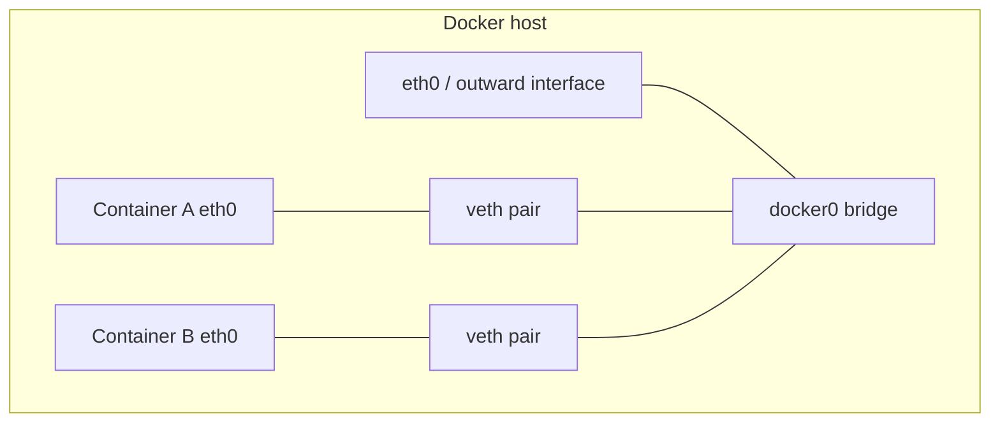
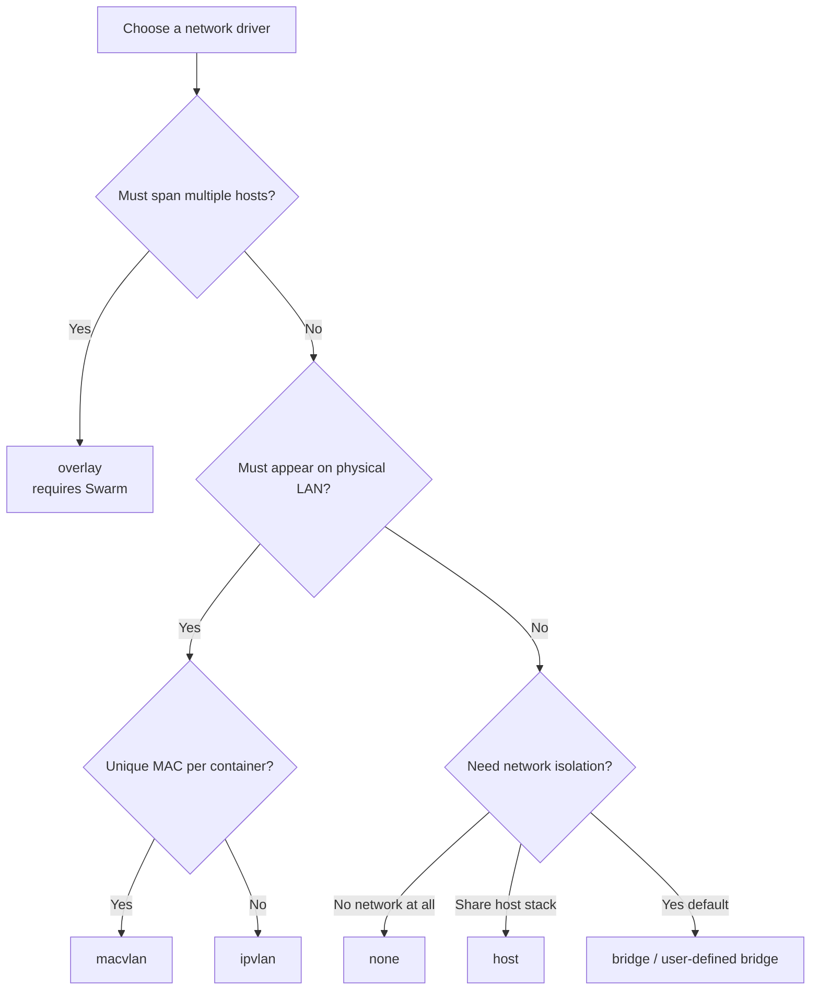
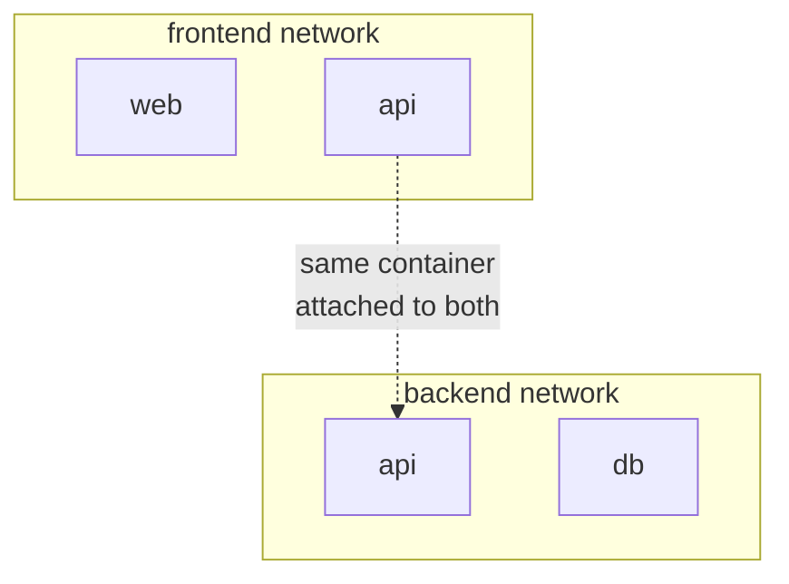
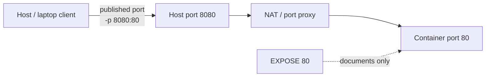

# Chapter 06 — Docker Networking

> **Learning Objectives**
>
> By the end of this chapter, you will be able to:
>
> - Explain how containers get network connectivity and why isolation is the default
> - Choose among the `bridge`, `host`, `none`, `overlay`, `macvlan`, and `ipvlan` drivers
> - Create user-defined networks and use Docker's embedded DNS for service discovery
> - Publish container ports with `-p` and `-P`, and explain what `EXPOSE` does not do
> - Replace legacy `--link` with user-defined networks

---

## 06.1 The apartment building

Imagine a large apartment building. Every apartment (container) has its own door, its own internal wiring, and its own private phone extension. Residents can call each other through the building's internal switchboard without dialing an outside line. If someone from the street wants apartment 4B, the front desk (the Docker host) must explicitly forward that call.


*Figure 06.A: Each apartment (container) has private wiring; the front desk publishes only chosen doors.*

Docker networking works the same way:

- Each container gets its own **network namespace** — private interfaces, routes, and firewall rules.
- Containers on the same network can talk through Docker's virtual networks and DNS.
- The outside world reaches a container only if the host **publishes** a port.

Isolation is the default so one noisy or compromised container cannot see traffic that was never meant for it. You open exactly the doors you need.

---

## 06.2 What happens when a container starts

### In plain terms

Starting a container is like assigning a new apartment: Docker wires a private phone, plugs it into a floor switchboard (a network), and hands out an extension number (an IP). Until you ask the front desk to publish a port, outsiders cannot ring that apartment.

### Under the hood

When you run a container, Docker:

1. Creates a network namespace for it.
2. Attaches it to a network — by default, the built-in bridge named `bridge`.
3. Assigns a private IP from that network's subnet (for example, `172.17.0.2`).

```bash
$ docker network ls
NETWORK ID     NAME      DRIVER    SCOPE
9f3c2a1b4d5e   bridge    bridge    local
1a2b3c4d5e6f   host      host      local
7g8h9i0j1k2l   none      null      local
```

```bash
$ docker run -d --name web nginx:1.27
$ docker inspect web --format '{{.NetworkSettings.IPAddress}}'
172.17.0.2
```



*Figure 06.1: On the default bridge, containers connect through veth pairs to `docker0`; outbound traffic NATs via the host.*

### In production

Know which network a workload lands on. Unintentional attachment to the default `bridge` is a common source of broken DNS and overly shared blast radius. Prefer explicit `--network` (or Compose networks) for every multi-container app.

---

## 06.3 Bridge, host, and none

### In plain terms

- **Bridge** — a private virtual switch on one machine; the usual default for apps that talk to each other and occasionally to the outside world via published ports.
- **Host** — the container shares the host's network stack: no private IP, no NAT, maximum speed, zero network isolation.
- **None** — only loopback; the container is deliberately unplugged.

### Under the hood

**Bridge.** The `bridge` driver creates a Linux bridge (default: `docker0`). Containers on the same bridge reach each other by IP; outbound traffic is NATed through the host.

```bash
$ docker run -d --name web nginx:1.27
$ docker inspect web --format '{{range .NetworkSettings.Networks}}{{.IPAddress}}{{end}}'
172.17.0.2
```

**Host.**

```bash
$ docker run -d --network host --name fastweb nginx:1.27
$ curl -s -o /dev/null -w "%{http_code}\n" http://127.0.0.1:80
200
```

There is no `-p` mapping: if the process listens on port 80, it is the host's port 80. Host networking is native on Linux. On Docker Desktop (macOS/Windows) it is supported in recent Desktop versions but runs through the Desktop Linux VM, so behavior can differ from bare-metal Linux.

**None.**

```bash
$ docker run --rm --network none alpine:3.20 ip addr
1: lo: <LOOPBACK,UP,LOWER_UP> mtu 65536 qdisc noqueue state UNKNOWN
    link/loopback 00:00:00:00:00:00 brd 00:00:00:00:00:00
    inet 127.0.0.1/8 scope host lo
```

Useful for batch jobs that only touch local files, or for workloads where zero network access is a security requirement.

### In production

| Driver | Scope | Isolation | Typical use | Port publishing |
|--------|-------|-----------|-------------|-----------------|
| `bridge` | Single host | Yes (NAT) | Most single-host apps | Yes (`-p` / `-P`) |
| `host` | Single host | No | Latency-sensitive tools, host-facing daemons | No (shares host ports) |
| `none` | Single host | Total | Offline jobs, lockdown | Not applicable |

Prefer bridge plus published ports for ordinary services. Reserve host networking for measured need; document the lost isolation. Use `none` when the threat model says "this process must not talk to the network."



*Figure 06.2: A driver decision path — start from multi-host and underlay needs, then fall back to bridge, host, or none.*

> ⚠️ **Warning:** Two host-networked containers cannot both bind the same host port. Treat the host port namespace as shared scarce resource.

---

## 06.4 Overlay networks

### In plain terms

An **overlay** network is a virtual switch that stretches across *multiple* Docker hosts. Containers on different machines behave as if they were plugged into the same LAN. The traffic is tunneled (typically VXLAN) between hosts.

### Under the hood

Overlay networks require **Swarm mode** (Chapter 09). On a standalone daemon:

```bash
$ docker network create --driver overlay --attachable my-overlay
Error response from daemon: This node is not a swarm manager. Use "docker swarm init" ... to create one.
```

That error is expected — and useful. After `docker swarm init`, you create overlay networks for multi-host services; Swarm's routing mesh (Chapter 09) publishes service ports across the cluster.

### In production

Use overlay when services must span nodes under Swarm. For Kubernetes (Part II), CNI plugins play the analogous multi-host role — do not expect Docker overlay alone to wire a Kubernetes cluster.

---

## 06.5 Macvlan and ipvlan

### In plain terms

Sometimes an application expects to sit on the **physical LAN** like a bare-metal host or VM — with its own address visible to routers, firewalls, and legacy monitoring — rather than behind Docker NAT. **Macvlan** and **ipvlan** plug containers into a parent host interface so they appear on that underlay network.

- **Macvlan** assigns each container its **own MAC address**, so neighbors see distinct Ethernet devices.
- **Ipvlan** shares the **parent interface's MAC** and distinguishes containers mainly by IP (and mode). Prefer ipvlan when the network or NIC limits how many MACs you may attach.

### Under the hood

Neither driver is supported on Docker Desktop or in rootless mode in the usual beginner setups. Use a Linux host with a real parent NIC (for example `eth0` or a VLAN sub-interface).

**Macvlan (bridge mode):**

```bash
$ docker network create -d macvlan \
    --subnet=192.168.1.0/24 \
    --gateway=192.168.1.1 \
    -o parent=eth0 \
    lan-macvlan

$ docker run -d --name lan-web --network lan-macvlan nginx:1.27
$ docker inspect lan-web --format '{{range .NetworkSettings.Networks}}{{.IPAddress}}{{end}}'
192.168.1.2
```

**Ipvlan L2** (closest cousin to macvlan without unique MACs):

```bash
$ docker network create -d ipvlan \
    --subnet=192.168.210.0/24 \
    --gateway=192.168.210.254 \
    -o ipvlan_mode=l2 \
    -o parent=eth0 \
    ipvlan210
```

Ipvlan also supports **L3** mode for routing-oriented designs; choose L2 when you want same-subnet LAN presence.

> 💡 **Tip:** By default the host itself often cannot reach macvlan/ipvlan container IPs on the same parent without an extra shim interface. Plan host-to-container access deliberately (another network, a proxy, or documented host config) — do not assume `curl` from the host "just works."

### In production

| Driver | Unique MAC per container? | Best when |
|--------|---------------------------|-----------|
| `macvlan` | Yes | Legacy apps / appliances that must look like physical hosts on the LAN |
| `ipvlan` | No (shares parent MAC) | MAC exhaustion, switch port security limits, or L3 underlay integration |

Checklist:

1. Confirm the parent interface and VLAN tagging with your network team.
2. Reserve IP ranges so Docker IPAM does not collide with DHCP or static hosts.
3. Document that Desktop/rootless learners cannot reproduce this lab as-is.
4. For Swarm-scoped macvlan, node-specific `--config-only` networks are often required so each node uses a non-overlapping `--ip-range` — IPAM is not centrally coordinated the way overlay is.

---

## 06.6 User-defined networks and embedded DNS

### In plain terms

Do not leave multi-container apps on the default `bridge`. Create your own network. On a **user-defined** bridge, Docker's embedded DNS lets containers find each other **by name** — `db`, `api`, `cache` — instead of brittle IPs.

### Under the hood

```bash
$ docker network create app-net
$ docker run -d --name db --network app-net postgres:16
$ docker run -d --name api --network app-net --env DATABASE_URL=postgres://tasks:dev@db:5432/tasks task-api:0.1.0
$ docker exec api ping -c 1 db
PING db (172.19.0.2): 56 data bytes
64 bytes from 172.19.0.2: seq=0 ttl=64 time=0.089 ms
```

User-defined networks also give you:

- **Isolation** — containers on different networks cannot see each other unless you attach them to both.
- **Live attach/detach** — `docker network connect` / `disconnect` on running containers.
- **Custom subnets** — `docker network create --subnet 10.5.0.0/24 mynet` when addressing must be predictable.



*Figure 06.3: Dual-network attachment — the API bridges trust zones while the database stays on the backend network only.*

| Need | Prefer |
|------|--------|
| Multi-container DNS by name | User-defined bridge |
| Default catch-all for lonely containers | Built-in `bridge` |
| Attach one service to two zones | `docker network connect` (API on frontend + backend) |

### Legacy links

Older tutorials use `--link`:

```bash
$ docker run -d --name api --link db:database my-api:1.0
```

**`--link` is legacy and deprecated.** It only works on the default bridge, injects brittle `/etc/hosts` and env vars, and does not survive recreation cleanly. Replace it with a user-defined network and DNS names.

### In production

Segment by trust boundary: put databases on a backend network, frontends on a frontend network, and attach the API to both. Publish only the ports that must leave the host. Compose (Chapter 08) makes this pattern the default.

---

## 06.7 Publishing ports

### In plain terms

Bridge-network containers can talk to peers, but your laptop browser cannot reach them until you **publish** a port — the front desk forwarding an outside call to apartment 4B.

### Under the hood

**Explicit `-p` (`--publish`)** — `HOST:CONTAINER` order:

```bash
$ docker run -d --name web -p 8080:80 nginx:1.27
$ curl -s -o /dev/null -w "%{http_code}\n" http://127.0.0.1:8080
200
```

Useful variants:

```bash
$ docker run -d -p 127.0.0.1:8080:80 nginx:1.27   # localhost only on the host
$ docker run -d -p 8080:80/udp my-udp-app:1.0     # UDP
$ docker run -d -p 80:80 -p 443:443 nginx:1.27    # multiple mappings
```

**`-P` (`--publish-all`)** publishes every `EXPOSE`d port to a random high host port:

```bash
$ docker run -d --name web2 -P nginx:1.27
$ docker port web2
80/tcp -> 0.0.0.0:32768
80/tcp -> [::]:32771
```

| Flag | Host port | Best for |
|------|-----------|----------|
| `-p 8080:80` | You choose | Everyday use |
| `-p 127.0.0.1:8080:80` | Localhost-only | Dev databases, local tools |
| `-P` | Random per `EXPOSE` | Throwaway tests, parallel CI |

> ⚠️ **Common Pitfall:** `EXPOSE` in a Dockerfile does **not** publish anything. It is documentation (and a hint for `-P`). Only `-p` / `-P` at run time open a host port.



*Figure 06.4: Publishing opens a host door; `EXPOSE` alone documents intent and does not forward traffic.*

### In production

Bind management ports to `127.0.0.1` or protect them with a reverse proxy and firewall. Prefer explicit `-p` over `-P` for anything humans bookmark. On Docker Desktop, remember published ports land on the VM/host forwarding path — firewall and VPN clients can still block you.

---

## 06.8 Common pitfalls

1. **Default bridge and broken DNS.** Name resolution between containers works on user-defined networks, not the default `bridge`.
2. **Reversing `-p` order.** Always `HOST:CONTAINER`.
3. **`localhost` inside a container.** That is the container itself. Use service/container names on a shared network, or `host.docker.internal` (Docker Desktop) to reach the host.
4. **Expecting `EXPOSE` to open ports.** It does not.
5. **Copy-pasting `--link`.** Use user-defined networks.
6. **Trying macvlan on Desktop.** Use a Linux Engine host with a real parent interface.
7. **Assuming the host can ping macvlan IPs.** Plan host access separately.

---

## 06.9 Hands-on exercises

1. **Explore the defaults.** Run `docker network ls` and `docker network inspect bridge`. Note the subnet and gateway.
2. **Prove the DNS difference.** Start two Alpine containers on the default bridge; confirm `ping` by name fails. Recreate them on a user-defined network; confirm ping succeeds.
3. **Publish and verify.** Run nginx with `-p 8080:80`, then a second with `-P`. Use `docker port` to discover the random mapping.
4. **Segment an application.** Create `frontend` and `backend` networks. Attach `db` only to `backend`, `api` to both. Prove a frontend-only container cannot reach `db`.
5. **Go offline.** Run `docker run --rm --network none alpine:3.20 wget -T 3 https://example.com` and explain why the failure is intentional.
6. **Macvlan sketch (Linux lab).** If you have a spare subnet and parent NIC, create a macvlan network and attach a container. Document whether the host can reach the container IP without extra configuration.

---

## 06.10 Check Your Understanding

**Q1.** Why should you prefer user-defined bridge networks over the default `bridge` network?

<details>
<summary>Show answer</summary>

User-defined networks provide automatic DNS-based name resolution between containers, cleaner isolation from unrelated workloads, and support for connecting or disconnecting running containers. The default bridge does not offer that name resolution and dumps every unassigned container into one shared space.

</details>

**Q2.** What is the difference between `-p 5000:80` and `-P`?

<details>
<summary>Show answer</summary>

`-p 5000:80` maps host port 5000 to container port 80 explicitly. `-P` publishes every port the image declared with `EXPOSE` to random high-numbered host ports, which you discover with `docker port`.

</details>

**Q3.** A teammate's app inside a container tries `localhost:5432` for the database and fails even though the `db` container is running. What is wrong?

<details>
<summary>Show answer</summary>

Inside a container, `localhost` is that container's own network namespace. The app should use the database container's DNS name (for example `db:5432`) with both containers on the same user-defined network.

</details>

**Q4.** When is `--network host` appropriate, and what do you give up?

<details>
<summary>Show answer</summary>

Host networking suits latency-sensitive workloads or tools that must see real host interfaces, because it removes NAT. You give up network isolation and port flexibility: the container competes with the host and other host-networked containers for the same ports.

</details>

**Q5.** How do macvlan and ipvlan differ, and when might you prefer ipvlan?

<details>
<summary>Show answer</summary>

Macvlan gives each container its own MAC address on the parent interface's LAN. Ipvlan shares the parent MAC and distinguishes endpoints primarily by IP (and mode). Prefer ipvlan when MAC count is limited by switches, cloud NICs, or security policy, or when you need ipvlan's L3 routing modes.

</details>

**Q6.** Why does creating an overlay network fail on a fresh single-machine Docker install?

<details>
<summary>Show answer</summary>

Overlay networks span hosts and rely on Swarm mode's control plane. A standalone daemon is not a Swarm manager, so Docker refuses until you run `docker swarm init` (Chapter 09).

</details>

---

## 06.11 Key takeaways

- Containers are network-isolated by default; publish only what you need.
- Core drivers: `bridge`, `host`, `none`, `overlay` (Swarm), plus `macvlan` / `ipvlan` for underlay LAN attachment.
- Always prefer **user-defined networks** for multi-container apps — DNS by name and clearer isolation.
- Legacy `--link` is deprecated; user-defined networks replace it.
- `-p HOST:CONTAINER` publishes explicitly; `-P` publishes all `EXPOSE`d ports randomly; `EXPOSE` alone publishes nothing.

---

## 06.12 Official documentation map

| Topic | Official page |
|-------|---------------|
| Network drivers overview | [Network drivers](https://docs.docker.com/engine/network/drivers/) |
| Bridge driver | [Bridge network driver](https://docs.docker.com/engine/network/drivers/bridge/) |
| Host driver | [Host network driver](https://docs.docker.com/engine/network/drivers/host/) |
| Overlay driver | [Overlay network driver](https://docs.docker.com/engine/network/drivers/overlay/) |
| Macvlan driver | [Macvlan network driver](https://docs.docker.com/engine/network/drivers/macvlan/) |
| Ipvlan driver | [Ipvlan network driver](https://docs.docker.com/engine/network/drivers/ipvlan/) |
| Networking overview | [Networking](https://docs.docker.com/engine/network/) |
| `docker network create` | [docker network create](https://docs.docker.com/reference/cli/docker/network/create/) |
| Publish ports | [Publish container ports](https://docs.docker.com/get-started/docker-concepts/running-containers/publishing-ports/) |

**Previous:** [Chapter 05 — Docker Containers Management](05-docker-containers-management.md) | **Next:** [Chapter 07 — Docker Volumes and Data Persistence](07-docker-volumes-and-data.md)
