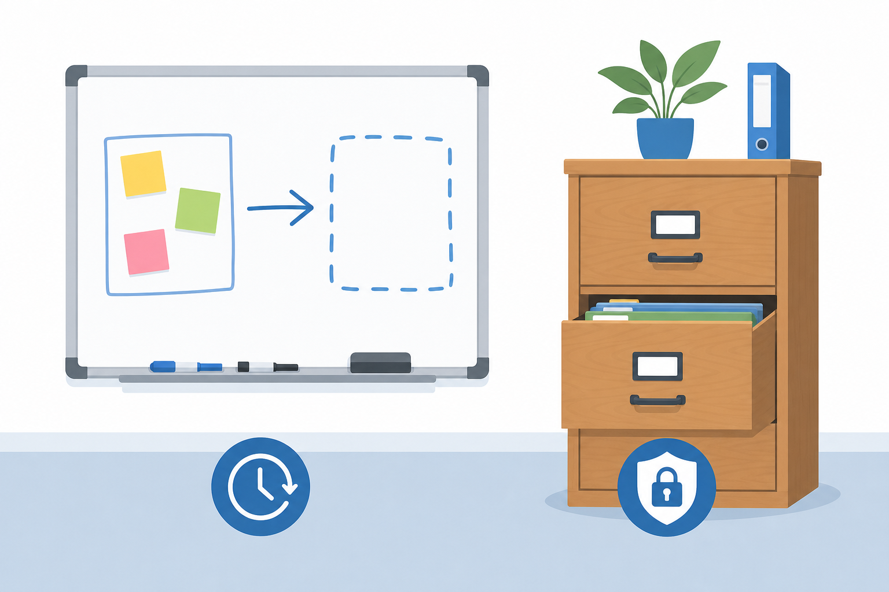
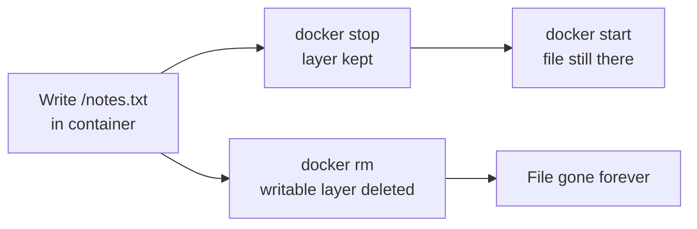
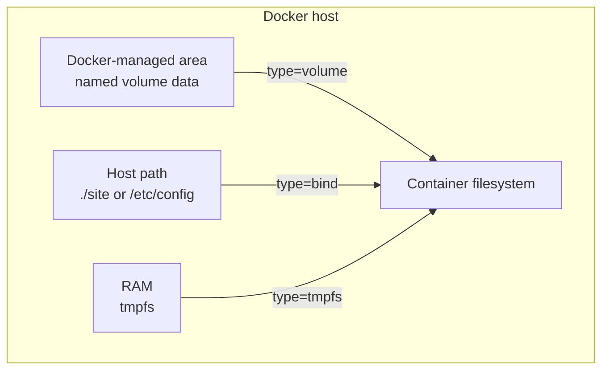
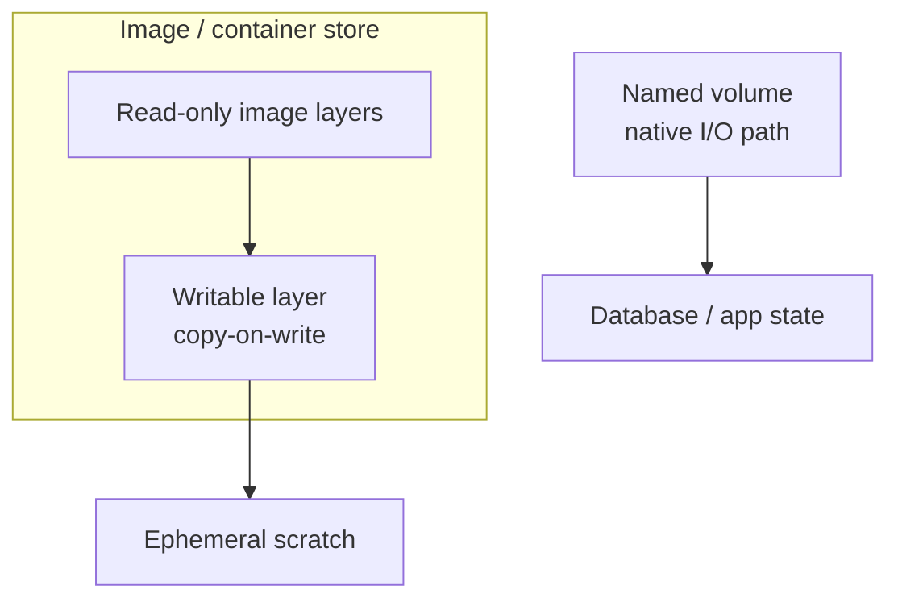
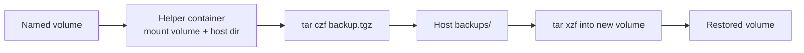

# Chapter 07 — Docker Volumes and Data Persistence

> **Learning Objectives**
>
> By the end of this chapter, you will be able to:
>
> - Say why files written inside a container vanish once you delete that container
> - Pick the right mount for a job: a named volume, a bind mount, or a tmpfs mount
> - Create, list, inspect, and delete volumes with the `docker volume` commands
> - Tell apart the **containerd image store** (the default on fresh Engine 29.x installs) and older **graph drivers** such as `overlay2`
> - Copy volume data out for a backup and put it back again, using a pattern you can trust

---

## 07.1 The whiteboard and the filing cabinet

Think of a container's **writable layer** — the private scratch space where a running container's file changes land — as a whiteboard in a rented meeting room. You can scribble on it all through the meeting. When the booking ends and the room is reset, the board is wiped clean. Deleting a container wipes its writable layer in exactly the same way.



*Figure 07.A: Whiteboards wipe clean; filing cabinets keep records after the meeting ends.*

A **volume** is a filing cabinet that lives *outside* the meeting room. Wheel it in, store your documents, wheel it back out. Reset the room a hundred times and the cabinet is still full.

Containers are meant to be thrown away. You want to delete and recreate them freely for upgrades and fixes. So any data that must outlive a single container needs a home that Docker's cleanup cannot reach. Picking the right home — and knowing what still lives inside the image store — is the skill of this chapter.

---

## 07.2 Watching data disappear

### In plain terms

Write a file inside a container, run `docker rm` on that container, and the file is gone for good.

This matters because deleting and recreating containers is normal, everyday work. You do it for upgrades, config changes, and new image versions. So any data that lives only in the writable layer is on borrowed time. It will survive all your `stop` and `start` testing, then disappear the first time a deploy runs `docker rm` and starts a fresh container from a newer image.

The detail that trips people up is **stopped versus removed**. A stopped container keeps its writable layer. A removed container does not. A stopped container is a parked car: the luggage in the trunk is still there when you start it again. A removed container is a car sent to the crusher, trunk and all.

> ⚠️ **Common Pitfall:** After a `docker restart` you might conclude "my data survived, so the container filesystem is fine." Restart keeps the same container and the same writable layer, so the test passes and gives you false confidence. The data loss only shows up on *removal* — which is exactly what your upgrade pipeline does.

### Under the hood

Here is what actually happens on the machine, in four commands:

```bash
$ docker run -it --name scratch alpine:3.20 sh
/ # echo "important data" > /notes.txt
/ # exit

$ docker rm scratch
scratch

$ docker run -it --name scratch alpine:3.20 sh
/ # cat /notes.txt
cat: can't open '/notes.txt': No such file or directory
```

Same image, same name — brand-new writable layer. The file is gone.



*Figure 07.1: Stopping keeps the writable layer; removing the container deletes it — and any data that lived only there.*

**What breaks if X:** the writable layer is per-container, so even "same image, same name" gives you a brand-new empty layer after removal. There is no hidden merge, no recovery flag, no `--keep-data`. Once the container is removed, the writable layer is deleted by the storage backend and the space is reclaimed — the file is not in a trash can, it is gone.

### In production

Treat the container filesystem as throwaway scratch space. Keep data on purpose, using volumes (or bind mounts in carefully controlled cases). A database that writes only to the writable layer is a production incident waiting to happen.

**Who owns this:** the app team decides *what* must be kept. The platform team decides *where* it is kept — which volume, which backing storage, which backup job. The incident that crosses both is a stateful service — a database, an upload directory, a queue — that was never given a volume, ran fine for weeks, and lost everything the day an unrelated image bump recreated the container.

**Failure mode and detection:** you rarely get a warning, because the container looks healthy right up to the moment it is removed. Catch this in review, not in production. Check that every stateful service declares a `-v` or `--mount`, and treat "database with no volume" as a blocking finding. **Do** map every path where a service writes real data onto a named volume; **don't** treat surviving a `docker restart` as proof that data is safe.

**Before you leave this section**

- **Understand:** writes land in a per-container writable layer that survives stop/start but is destroyed by `docker rm`.
- **Try:** write a file in an Alpine container, `restart` it (file survives), then `rm` and recreate it (file gone) — feel the difference.
- **Watch in prod:** stateful services with no volume that pass restart tests and lose data on the next recreate/upgrade.

---

## 07.3 Named volumes

### In plain terms

A **named volume** is storage that Docker creates and manages for you, which you refer to by a plain name such as `app-data`.

You should care because it splits the life of your data away from the life of any container. You never need to know where the files sit on disk. Docker keeps them under its own data root and handles the path, the permissions plumbing, and the cleanup rules. That means you can stop the database, delete its container, start a new container on a newer Postgres image, point it at the same `app-data`, and every row is still there. This split is exactly what the writable layer could not give you.

Picture the filing cabinet from the opening story. The label on the drawer is all you need. You never have to ask which warehouse shelf the cabinet is parked on.

> ⚠️ **Common Pitfall:** You might think "volume" and "writable layer" are two names for one thing. They are not. The writable layer is copy-on-write scratch space tied to one container's life, and it dies with that container. A named volume is a separate store that Docker manages, outlives containers, and reads and writes over a faster, direct path (Section 07.7). Mixing up the two is why people put databases in the wrong place.

### Under the hood

Here is what actually happens on the machine — create the volume, then hand it to a container:

```bash
$ docker volume create app-data
app-data

$ docker run -d --name db \
    -v app-data:/var/lib/postgresql/data \
    -e POSTGRES_PASSWORD=devsecret \
    postgres:16
```

```bash
$ docker volume ls
DRIVER    VOLUME NAME
local     app-data

$ docker volume inspect app-data
```

```json
[
    {
        "CreatedAt": "2026-07-25T17:10:42Z",
        "Driver": "local",
        "Labels": null,
        "Mountpoint": "/var/lib/docker/volumes/app-data/_data",
        "Name": "app-data",
        "Options": null,
        "Scope": "local"
    }
]
```

If you mount a *new, empty* named volume over a directory that already contains files in the image, Docker copies those image files into the volume first. Bind mounts do not — they simply hide the image content.

Prefer the explicit `--mount` form in scripts:

```bash
$ docker run -d --name db \
    --mount type=volume,source=app-data,target=/var/lib/postgresql/data \
    -e POSTGRES_PASSWORD=devsecret \
    postgres:16
```

If you mount the same named volume into a second container, both see the same files — useful for a sidecar backup job, dangerous if two writers assume exclusive access. **What breaks if X:** two Postgres containers pointed at one `app-data` volume will corrupt it; a database expects to be the sole owner of its data directory. Volume sharing is safe for read-mostly content, not for two processes that both write the same files.

### In production

Give every volume that holds real data a name. Use named volumes for databases and application state. Stay away from anonymous volumes created by a bare `VOLUME` instruction when you will need to find and back up that data later. They are easy to lose track of, and `docker rm -v` deletes them along with the container.

**Who owns this:** the app team owns the names and knows which volume holds which dataset. The platform team owns where the Docker data root lives, how much disk it has, and whether it is backed up. The failure that keeps recurring is the **anonymous volume** — a volume with no name, created by a bare `VOLUME /data` in an image or a `-v /data` with no source. Docker gives it a random hex name that nobody can match to an app later, so it is never backed up and never cleaned up. It just piles up until the disk fills.

**Failure mode and detection:** run `docker volume ls` and look for a growing list of hex-named volumes that no one claims. Those are anonymous volumes eating disk. Watch for capacity trouble by monitoring the filesystem under the Docker data root. **Do** give every real dataset a name and a label (`--label app=tasks`); **don't** keep anything you would miss in an anonymous volume.

**Before you leave this section**

- **Understand:** named volumes are Docker-managed, name-addressable, and outlive containers; they take a native I/O path, unlike the writable layer.
- **Try:** create `app-data`, write to it from one container, remove that container, mount the same volume in a fresh container, and confirm the data survived.
- **Watch in prod:** anonymous volumes piling up unnamed and unbacked-up, and two writers sharing one volume corrupting it.

---

## 07.4 Bind mounts

### In plain terms

A **bind mount** maps one exact folder from the host machine into a container.

You want this while you are writing code. Save a file on your laptop and the container sees the new version instantly, with no rebuild and no copy step. That fast loop is why bind mounts dominate local development.

The trade-off is that a bind mount ties the container to one machine's folder layout. A named volume says "give me managed storage, I do not care where it lives." A bind mount says "use exactly `/home/dev/project/site` on this machine." That is perfect for development, where your editor and the container share the same files in real time. It is fragile in production, because the path may not exist on another host. The container also reads and writes as the host's raw **UID/GID** — the numeric user and group IDs Linux uses for file ownership — so the host's own permissions apply directly.

> 💡 **In one line:** A **named volume** is storage Docker owns and you address by name, and it is the right home for real data. A **bind mount** is a folder *you* own on one specific host, and it is the right tool for editing code live.

> ⚠️ **Common Pitfall:** When the target directory already holds files from the image, you might expect a bind mount to copy them out first, the way a named volume does. It does not. A bind mount *covers* the target. Whatever sits on the host path wins, and the image's content at that path becomes invisible. Mount an empty host folder over `/etc/nginx` and nginx sees an empty config directory.

### Under the hood

Here is what actually happens on the machine:

```bash
$ docker run -d --name devweb \
    -v "$(pwd)/site:/usr/share/nginx/html:ro" \
    -p 8080:80 \
    nginx:1.27
```

The `:ro` suffix mounts read-only — a good habit when the container only needs to read.

Verbose form (fails loudly if the source path is missing):

```bash
$ docker run -d --mount type=bind,source="$(pwd)/site",target=/usr/share/nginx/html,readonly nginx:1.27
```

`--mount` is preferred in scripts and docs; `-v` is fine at the keyboard.

### In production

Bind mounts depend on the host's folder layout, skip the copy-on-first-mount behavior, and share raw UID/GID with the host. That makes them less portable and more sensitive to permissions than named volumes. Use them for live source code and host config files in development. Use named volumes (or Kubernetes PVCs later) for production state.

**Who owns this:** whoever writes the run command or Compose file owns the assumption about the host path. A bind mount ties the container to one machine's filesystem. So the app team must document it, and the platform team must guarantee the path exists with the right ownership on every host that runs the workload.

**Failure mode and detection:** two failures dominate. First, **permission mismatches**: the container process runs as UID 1000 but the host directory belongs to root, so writes fail with `permission denied`. On SELinux hosts you also need `:z`/`:Z` labels or the mount is silently unreadable. Second, a bind mount of a sensitive host path (`/`, `/var/run/docker.sock`, `/etc`) hands the container far more of the host than you intended. Find the first in the app's own error logs plus `ls -ln` on the host path. Find the second in review. **Do** keep bind mounts read-only (`:ro`) whenever the container only reads; **don't** bind-mount the Docker socket or the host root into application containers.

> 🏭 **Production floor:** Bind mounts read and write the host filesystem directly with the container's UID/GID and no Docker-managed boundary. Mounting a sensitive host path — the Docker socket, `/etc`, or `/` — gives a compromised container a direct lever on the host, so treat any such mount as a change-managed, security-reviewed decision. Default to `:ro`, scope the path as narrowly as possible, and prefer named volumes for anything that is real production state rather than live-edited source.

**Before you leave this section**

- **Understand:** bind mounts map a specific host path in, share host UID/GID, skip copy-on-first-mount, and hide image content at the target.
- **Try:** serve `./site/index.html` with `-v "$(pwd)/site:/usr/share/nginx/html:ro"`, edit on the host, refresh, and watch the change appear live.
- **Watch in prod:** permission/SELinux-label failures and over-broad host paths (socket, `/etc`, `/`) mounted into app containers.

---

## 07.5 tmpfs mounts

### In plain terms

A **tmpfs** mount is a directory that lives in the machine's memory (RAM) instead of on a disk.

You reach for it in two very different situations. The first is speed for throwaway files, such as a scratch or cache directory that a batch job rewrites constantly. The second is disk hygiene: a decrypted password or a session token that must not be left on the host's disk, where a stray backup or a forensic tool could recover it later.

The question that decides everything here is where the bytes physically live. Named volumes and bind mounts keep bytes on disk. A tmpfs mount is memory that merely looks like a directory. So it is fast, it is never written to disk, and it is gone the moment the container stops.

> ⚠️ **Common Pitfall:** You might treat tmpfs as "just a fast volume" and forget that it competes for the machine's real RAM. Under load, a tmpfs with no size cap can eat enough memory to trigger the kernel's OOM killer, which then kills *some other* container. The result is a confusing incident where the victim is not the culprit. Always cap the mount with `size=`.

### Under the hood

Here is what actually happens on the machine:

```bash
$ docker run -d --name worker \
    --tmpfs /scratch:rw,size=100m \
    my-batch-job:1.0
```

tmpfs mounts are Linux-oriented in classic Engine usage and cannot be shared between containers the way named volumes can — each container gets its own private in-memory filesystem, and it evaporates when that container stops. **What breaks if X:** anything written to a tmpfs path is gone on stop, restart, or crash, so treating it as durable storage loses data by design; and because it is per-container, you cannot use it to hand files between containers.

### In production

Pair tmpfs with a `--read-only` root filesystem (Chapter 10) so temporary paths still work. Always set a size. A tmpfs with no cap can starve the host of memory under load.

**Who owns this:** the app team decides which paths are scratch and which must last, and sets the `size=` cap from real measurements of how much the app writes. **Failure mode and detection:** watch host memory and container OOM events (`docker events`, OOM lines in `dmesg`). A runaway tmpfs shows up as memory pressure, not as a disk-full error. **Do** size every tmpfs and use it to keep secrets off disk; **don't** store data you need to keep there, and don't leave it uncapped.

**Before you leave this section**

- **Understand:** tmpfs is RAM-backed, per-container, non-persistent, and counts against host memory.
- **Try:** run a container with `--tmpfs /scratch:rw,size=100m`, write a file, stop and restart it, and confirm the file is gone.
- **Watch in prod:** uncapped or oversized tmpfs mounts driving memory pressure and OOM kills that hit an innocent bystander container.



*Figure 07.2: Three mount styles — Docker-managed volumes, host bind paths, and RAM-backed tmpfs.*

---

## 07.6 Choosing the right mount

| | Named volume | Bind mount | tmpfs |
|---|---|---|---|
| Managed by | Docker | You (host path) | Kernel (RAM) |
| Survives container removal | Yes | Yes (host files remain) | No |
| Portable across hosts | Yes (by name) | No (path-based) | Not applicable |
| Pre-populated from image | Yes (if empty) | No (hides image files) | No |
| Best for | Databases, app state | Live source in dev, host configs | Secrets, caches, temp files |
| Example | `-v data:/path` | `-v /host:/path` | `--tmpfs /path` |

**Rule of thumb:** volumes for data you care about, bind mounts for development convenience, tmpfs for data you explicitly do not want persisted.

---

## 07.7 Image storage: containerd image store vs overlay2

Volumes hold the data you deliberately persist. Image layers and the container's writable layer are managed by Docker's **image/storage backend** — a different concern that changed significantly in **Docker Engine 29.x**.

### In plain terms

The **image store** is the part of Docker that keeps image layers on disk and hands each container its writable layer.

You should care for three reasons. It decides how much disk your images use, how fast writes inside a container are, and which migration work you owe your hosts on Docker Engine 29.x. For everyday work you never touch it. It matters the day you migrate a host, chase down disk usage, or hit the `userns-remap` conflict described below.

Think of image layers as the floors of a building, and the running container as a temporary rooftop patio. The patio can change. The floors underneath stay shared and read-only until someone rewrites a tile, and at that moment Docker copies the tile up onto the patio first. That behavior is called **copy-on-write**. Volumes are a separate filing cabinet bolted onto the outside of the building. They skip the copy-on-write path entirely, which is why their reads and writes run at native speed.

Which component manages those floors and that patio is what changed in Docker Engine 29.x. It used to be a Docker-specific piece called a **graph driver**, such as `overlay2`. The default on fresh installs is now the **containerd image store**, the same storage machinery Kubernetes nodes already use underneath.

> 💡 **In one line:** Fresh Engine 29.x installs default to the containerd image store, while hosts upgraded from an older Engine usually stay on the deprecated `overlay2` graph driver until you migrate — so run `docker info` to find out which one a machine is actually using.

> ⚠️ **Common Pitfall:** You might assume every Docker 29 host uses the containerd image store. Only *fresh* Engine 29.x installs default to it. A host **upgraded** from an older Engine normally keeps the legacy `overlay2` graph driver until you deliberately migrate. Never assume — check with `docker info` before you make claims about a given machine.



*Figure 07.3: Persist write-heavy data on volumes — leave copy-on-write for ephemeral container filesystem changes.*

### Under the hood

Here is what actually sits on the machine, and how you check which backend you are on:

#### Fresh Engine 29.x installs: containerd image store

On **fresh installs of Docker Engine 29.0 and later**, the default backend is the **containerd image store**, which uses containerd **snapshotters** (commonly `overlayfs`) instead of the classic Docker **graph drivers**.

```bash
$ docker info --format 'Driver={{.Driver}}'
Driver=overlayfs
```

Content for the containerd image store typically lives under **`/var/lib/containerd`** (plus related Docker state under `/var/lib/docker`). Multi-platform images and attestations are first-class citizens on this path.

Enable or confirm via `/etc/docker/daemon.json` when migrating an older daemon:

```json
{
  "features": {
    "containerd-snapshotter": true
  }
}
```

After changing daemon configuration, restart Docker and re-check `docker info`.

#### Upgrades and legacy graph drivers

If you **upgraded** from an earlier Engine, the daemon often continues using the classic **`overlay2`** graph driver until you migrate:

```bash
$ docker info --format 'Driver={{.Driver}}'
Driver=overlay2
```

Legacy graph drivers remain available for compatibility but are **deprecated**. New installs can still opt out and force a classic driver if required, but plan on the containerd image store as the future default.

> 📘 **Deep Dive (optional):** Classic storage-driver docs still describe `overlay2`, `btrfs`, and friends for upgraded systems. Treat that material as migration context, not as the Engine 29 greenfield default.

#### Migration side effect: hidden local images

When you switch to the containerd image store, existing images and containers from `overlay2` **remain on disk but become hidden**. They reappear if you switch back. To keep using them under the new store, **push to a registry** first or use `docker save` / `docker load`.

#### Incompatibility: userns-remap

The containerd image store is **incompatible with `userns-remap`**. If your security posture depends on user namespace remapping, either stay on a supported classic graph-driver configuration for now, move to **rootless Docker**, or redesign remapping before enabling the containerd image store. Do not flip the feature flag on a remapped daemon without a tested plan.

### In production

1. **Write-heavy workloads belong on volumes.** Copy-on-write in the image store is the wrong place for database files and queues that change constantly.
2. **Plan migrations.** Push or save local images before you enable the containerd image store, and expect `docker images` to look empty right after the switch.
3. **Know your data roots.** Monitor disk on both `/var/lib/docker` and `/var/lib/containerd` after a fresh Engine 29 install or a migration.
4. **Do not reconfigure weekly.** Spend your effort on volumes and registry workflows instead of chasing small storage-driver tuning wins.
5. **Document remapping.** If `userns-remap` is required, block any change that enables the containerd image store until remapping is retired or replaced.

> 💡 **Tip:** On Docker Desktop, the containerd image store is already the default on modern clean installs. Desktop users usually do not edit graph-driver settings the way Linux Engine admins do.

**Who owns this:** the platform team owns the choice of storage backend, the migration plan, and disk monitoring on the data roots. App teams must never flip `containerd-snapshotter` on a shared daemon on a whim. **Failure mode and detection:** two surprises show up during migration. First, local images look like they vanished after the switch — they are hidden, not deleted, and they come back if you switch again, so push them or run `docker save` first. Second, enabling the containerd image store on a `userns-remap` daemon is an **unsupported combination**. Check the backend with `docker info --format '{{.Driver}}'` (`overlayfs` means the containerd image store, `overlay2` means the legacy graph driver) and confirm whether `userns-remap` is on before any migration. **Do** push or save local images before switching; **don't** enable it on a remapped daemon until remapping is retired or replaced.

**Before you leave this section**

- **Understand:** fresh Engine 29.x installs default to the containerd image store (snapshotters like `overlayfs`, content under paths such as `/var/lib/containerd`); many upgraded hosts stay on deprecated `overlay2`; volumes bypass copy-on-write either way.
- **Try:** run `docker info --format '{{.Driver}}'` and record whether you are on `overlayfs` or `overlay2`, and note which data roots exist.
- **Watch in prod:** local images "disappearing" after switching stores (hidden, not deleted), and the unsupported containerd-image-store + `userns-remap` combination.

---

## 07.8 Backup and restore

### In plain terms

Backing up a volume means starting one short-lived helper container, mounting both the volume and a host folder into it, and copying the data across with `tar`.

Why not just copy the files off the host directly? Because where a volume sits on disk is Docker's business, not yours. Reaching into `/var/lib/docker/volumes/...` by hand is fragile, does not hold up across storage backends, and can corrupt data if you touch files a running container is using.

The helper container avoids all of that. It mounts the volume the normal, supported way, right next to a host directory, and `tar` carries files between the two. The pattern behaves the same on every storage backend and never assumes a path, so the same commands work on your laptop and on a server.

> ⚠️ **Common Pitfall:** You might expect `docker volume prune` to only remove truly junk volumes. By default it removes unused *anonymous* volumes — but `--all` also sweeps unused *named* volumes, and "unused" only means "no container currently references it." A database volume whose container is temporarily stopped or recreated can look unused and get deleted. This is an irreversible, data-losing command.

### Under the hood

Here is what actually happens on the machine, in both directions:

**Backup:**

```bash
$ docker run --rm \
    -v app-data:/source:ro \
    -v "$(pwd)/backups:/backup" \
    alpine:3.20 \
    tar czf /backup/app-data-2026-07-25.tar.gz -C /source .

$ ls backups/
app-data-2026-07-25.tar.gz
```

**Restore:**

```bash
$ docker volume create app-data-restored

$ docker run --rm \
    -v app-data-restored:/target \
    -v "$(pwd)/backups:/backup:ro" \
    alpine:3.20 \
    tar xzf /backup/app-data-2026-07-25.tar.gz -C /target
```

Then start the application against `app-data-restored` and verify.



*Figure 07.4: Backup and restore with a throwaway container — archive the volume to the host, then extract into a fresh volume.*

**Housekeeping:**

```bash
$ docker volume rm old-data
$ docker volume prune
```

`docker volume prune` removes unused *anonymous* volumes by default; `--all` also removes unused *named* volumes — think twice.

**What breaks if X:** there is no undo. `docker volume rm app-data` or a too-broad `docker volume prune --all` deletes the backing data immediately; unlike `docker rm` on a container, nothing about the image or a registry can reconstruct volume contents. The only recovery is the backup you took beforehand — which is the entire point of this section.

### In production

Copying the files of a *running* database can capture a half-written, inconsistent state. Stop the container first, or better, use the database's own tools (`pg_dump`, `mysqldump`) and archive that output instead. Automate the backups. Test the restores on a schedule, not on the day of an incident.

**Who owns this:** the platform/on-call team owns backup automation and restore drills. The app team owns knowing which volumes are precious and how to produce a clean dump for its datastore. The incident nobody forgets is a reflex `docker volume prune --all`, or a pasted `docker system prune --volumes` on the wrong host, that wipes a production database with no tested way back.

**Failure mode and detection:** the loss is total and instant, so the only real "detection" is prevention plus backups you have proven work. Test restores on a schedule, and raise an alert if a backup job stops producing files. **Do** keep bulk prune commands away from production hosts and keep a copy of backups off the host; **don't** type `prune --all` or `system prune --volumes` by hand on anything holding real data.

> 🏭 **Production floor:** `docker volume rm` and `docker volume prune --all` (and `docker system prune --volumes`) are irreversible data-deletion commands with no image or registry to fall back on. Treat them as change-managed on any host with production data: require an explicit named target rather than a blanket prune, confirm a fresh tested backup exists first, and never run bulk prune commands on a shared or production host out of habit. A single misfired prune is a full data-loss incident, not a cleanup.

**Before you leave this section**

- **Understand:** back up volumes with a throwaway container + `tar` (backend-agnostic), and volume deletion is irreversible with no fallback but your backup.
- **Try:** back up `notes-data` to the host, delete the volume, restore into a fresh volume, and verify the contents match.
- **Watch in prod:** bulk `prune --all`/`system prune --volumes` on hosts with real data, and backups that silently stop or were never restore-tested.

---

## 07.9 Common pitfalls

1. **Database files in the writable layer.** Works until `docker rm` — then everything is gone.
2. **Assuming volumes always survive.** Anonymous volumes are easy to lose; `docker rm -v` deletes them.
3. **Bind-mounting over required image paths.** Empty host dirs hide image content.
4. **UID/GID clashes on bind mounts.** Match container user to host ownership (and SELinux `:z` / `:Z` when applicable).
5. **Backing up a live database at the file level.** Use dumps or stop first.
6. **Casual `docker volume prune --all`.** Unused does not mean unwanted.
7. **Enabling the containerd image store without migrating images.** Local images appear to vanish.
8. **Enabling the containerd image store with `userns-remap`.** Unsupported combination.

---

## 07.10 Hands-on exercises

1. **Reproduce data loss.** Write a file in Alpine, remove the container, recreate, confirm the file is gone.
2. **Persist with a named volume.** Create `notes-data`, write under `/notes`, remove the container, start another with the same mount, confirm survival.
3. **Live-edit with a bind mount.** Serve a local `site/index.html` with nginx (`:ro` mount, `-p 8080:80`), edit on the host, refresh.
4. **Full backup/restore cycle.** Tar-backup `notes-data`, delete the volume, restore into a new volume, verify contents.
5. **Observe copy-on-first-mount.** Mount a new named volume at `/etc/nginx` in nginx; list the volume contents. Repeat with an empty bind mount and compare.
6. **Identify your backend.** Run `docker info --format 'Driver={{.Driver}}'` and record whether you are on `overlayfs` (containerd image store) or legacy `overlay2`. Note which data directories exist under `/var/lib/docker` and `/var/lib/containerd` on a Linux Engine host.

---

## 07.11 Check Your Understanding

**Q1.** Why does data written inside a container disappear, and when exactly is it lost?

<details>
<summary>Show answer</summary>

Writes go to the container's writable layer, which belongs to that specific container. The data survives stops and restarts of the same container but is destroyed when the container is *removed* (`docker rm`), because the writable layer is deleted with it.

</details>

**Q2.** You're developing a Node.js app and want code changes on your laptop to appear in the container immediately. Volume, bind mount, or tmpfs?

<details>
<summary>Show answer</summary>

A bind mount. It maps your working directory straight into the container. Named volumes are Docker-managed and awkward to edit from the host; tmpfs does not persist or share host files.

</details>

**Q3.** What's the key behavioral difference when mounting an *empty* named volume versus an *empty* bind-mounted directory over a path that contains files in the image?

<details>
<summary>Show answer</summary>

An empty named volume is pre-populated from the image on first mount. An empty bind mount simply covers the path, so the application sees an empty directory.

</details>

**Q4.** What is the default image storage backend on a fresh Docker Engine 29.x install, and how does that differ from many upgraded daemons?

<details>
<summary>Show answer</summary>

Fresh Engine 29.x installs default to the **containerd image store** (snapshotters such as `overlayfs`, content often under `/var/lib/containerd`). Many upgraded daemons still run the legacy **`overlay2`** graph driver until you migrate. Graph drivers are deprecated; plan the move and note that the containerd image store is incompatible with `userns-remap`.

</details>

**Q5.** Why should databases use a volume rather than the writable layer, even ignoring persistence?

<details>
<summary>Show answer</summary>

Performance. The writable layer goes through copy-on-write machinery on the image store, which is slow for frequent or large writes. Volume I/O bypasses that path and behaves like native host filesystem access.

</details>

**Q6.** Sketch the backup pattern for a named volume in one sentence.

<details>
<summary>Show answer</summary>

Run a temporary container that mounts the volume read-only and bind-mounts a host directory, then run `tar` inside it to archive the volume into the host directory (and reverse the mounts and extract to restore).

</details>

---

## 07.12 Key takeaways

- The writable layer is throwaway. Anything that must outlive the container belongs in a mount.
- Stopping a container keeps its files. Removing it deletes them, with no undo.
- **Named volumes** hold real data. **Bind mounts** are for editing code live. **tmpfs** is RAM-only scratch — cap it with `size=`.
- An empty named volume gets pre-filled from the image. An empty bind mount hides the image's files instead.
- Name every volume you care about. Anonymous volumes are the ones nobody backs up.
- Fresh **Engine 29.x** installs default to the **containerd image store** (`overlayfs`, content under paths such as `/var/lib/containerd`). Many upgraded hosts still run **`overlay2`**, which is **deprecated**. The containerd image store is **incompatible with `userns-remap`**. Run `docker info` to see which you have.
- Back up a volume with a throwaway container plus `tar`. For databases, use the native dump tool or stop the container first.
- `docker volume rm` and `prune --all` delete data for good. Your backup is the only way back.

---

## 07.13 Official documentation map

| Topic | Official page |
|-------|---------------|
| Volumes | [Volumes](https://docs.docker.com/engine/storage/volumes/) |
| Bind mounts | [Bind mounts](https://docs.docker.com/engine/storage/bind-mounts/) |
| tmpfs mounts | [tmpfs mounts](https://docs.docker.com/engine/storage/tmpfs/) |
| Storage overview | [Storage](https://docs.docker.com/engine/storage/) |
| containerd image store | [containerd image store](https://docs.docker.com/engine/storage/containerd/) |
| Select a storage driver (classic) | [Select a storage driver](https://docs.docker.com/engine/storage/drivers/select-storage-driver/) |
| Deprecated Engine features | [Deprecated features](https://docs.docker.com/engine/deprecated/) |
| `docker volume` CLI | [docker volume](https://docs.docker.com/reference/cli/docker/volume/) |

**Previous:** [Chapter 06 — Docker Networking](06-docker-networking.md) | **Next:** [Chapter 08 — Docker Compose](08-docker-compose.md)
