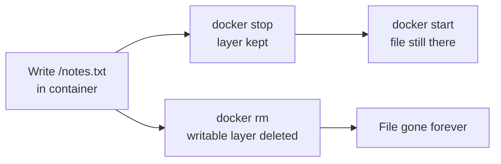
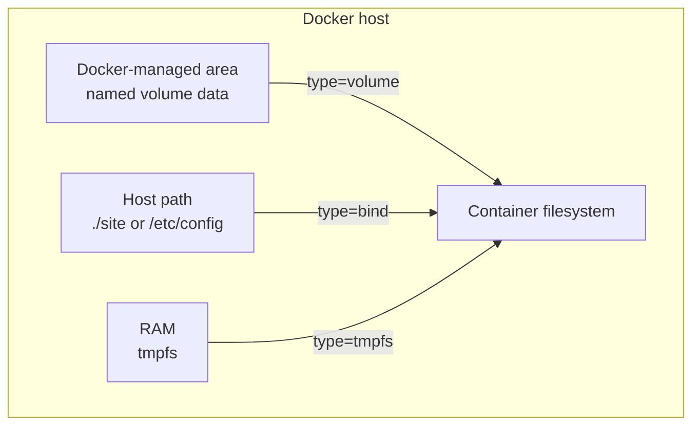
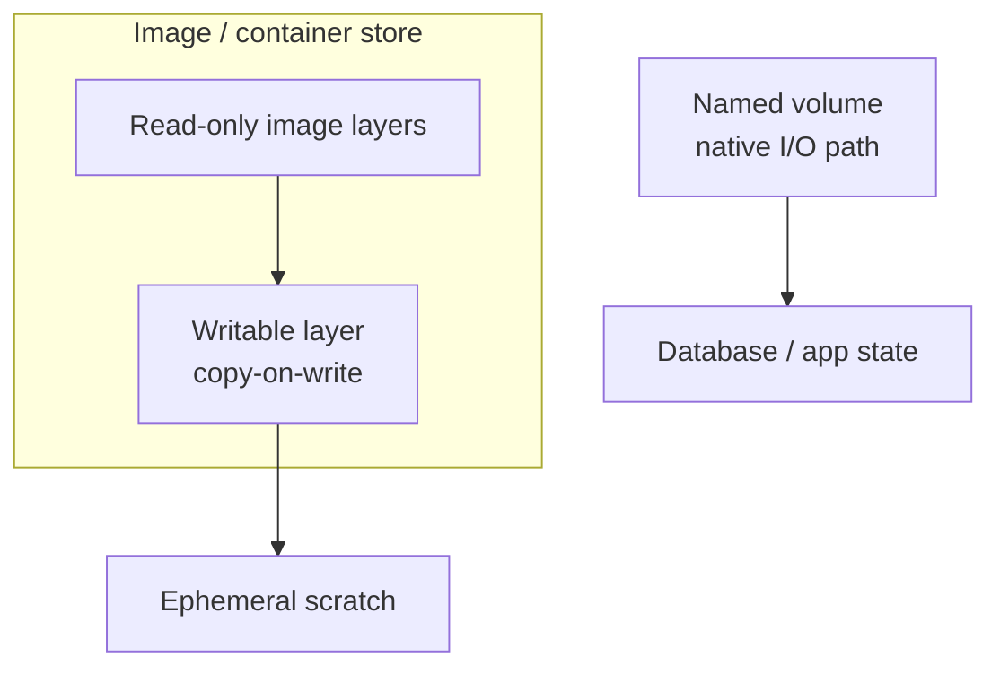
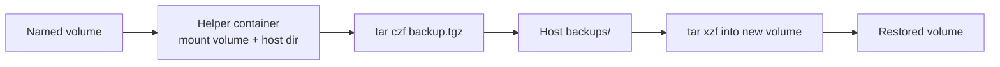

# Chapter 07 — Docker Volumes and Data Persistence

> **Learning Objectives**
>
> By the end of this chapter, you will be able to:
>
> - Explain why data written inside a container disappears when the container is removed
> - Choose among named volumes, bind mounts, and tmpfs mounts for a given job
> - Manage volumes with the `docker volume` command family
> - Contrast the **containerd image store** (Engine 29.x default on fresh installs) with legacy **graph drivers** such as `overlay2`
> - Back up and restore volume data with a dependable pattern

---

## 07.1 The whiteboard and the filing cabinet

Think of a container's writable layer as a **whiteboard in a rented meeting room**. You can scribble during the meeting; when the booking ends and the room resets, the board is wiped. Removing a container deletes its writable layer the same way.


*Figure 07.A: Whiteboards wipe clean; filing cabinets keep records after the meeting ends.*

A **volume** is a filing cabinet that lives *outside* the meeting room. Wheel it in, store documents, wheel it out. Reset the room a hundred times — the cabinet survives.

Containers are disposable on purpose. You want to delete and recreate freely for upgrades and fixes. Data that must outlive any single container therefore needs a mount Docker's lifecycle cannot erase. Choosing the right mount — and understanding what still lives under the image store — is the skill of this chapter.

---

## 07.2 Watching data disappear

### In plain terms

If you write a file inside a container and then `docker rm` that container, the file is gone. A *stopped* container keeps its writable layer; a *removed* container does not.

The distinction that trips people up is **stopped versus removed**. A stopped container is a parked car — the luggage in the trunk is still there when you start it again. A removed container is a car sent to the crusher — trunk and all. Because the whole point of containers is that you delete and recreate them freely (for upgrades, config changes, image bumps), any data living only in that writable layer is on borrowed time. It will survive your `stop`/`start` testing and then vanish the first time a deploy does `docker rm` and `docker run` with a new image.

> ⚠️ **Common Pitfall:** You might conclude "my data persisted, so the container filesystem is fine" after a `docker restart`. Restart keeps the same container and its writable layer, so the test passes — and gives false confidence. The data loss only shows up on *removal*, which is exactly what your upgrade pipeline does.

### Under the hood

```bash
$ docker run -it --name scratch alpine:3.20 sh
/ # echo "important data" > /notes.txt
/ # exit

$ docker rm scratch
scratch

$ docker run -it --name scratch alpine:3.20 sh
/ # cat /notes.txt
cat: can't open '/notes.txt': No such file or directory
```

Same image, same name — brand-new writable layer. The file is gone.



*Figure 07.1: Stopping keeps the writable layer; removing the container deletes it — and any data that lived only there.*

**What breaks if X:** the writable layer is per-container, so even "same image, same name" gives you a brand-new empty layer after removal. There is no hidden merge, no recovery flag, no `--keep-data`. Once the container is removed, the writable layer is deleted by the storage backend and the space is reclaimed — the file is not in a trash can, it is gone.

### In production

Treat the container filesystem as ephemeral scratch. Persist deliberately with volumes (or bind mounts in carefully controlled cases). Databases that write only to the writable layer are a production incident waiting to happen.

**Who owns this:** the app team owns the decision of *what* must persist; the platform team owns *where* it persists (which volume, which backing storage, which backup job). The incident that crosses both is a stateful service — a database, an upload directory, a queue — that was never given a volume, ran fine for weeks, and lost everything the day an unrelated image bump triggered a recreate.

**Failure mode and detection:** you rarely get a warning; the container is healthy right up to removal. Catch it in review, not in prod: audit that every stateful service declares a `-v`/`--mount`, and treat "database with no volume" as a blocking finding. **Do** map every path a service writes real data to onto a named volume; **don't** trust `docker restart` survival as evidence of persistence.

**Before you leave this section**

- **Understand:** writes land in a per-container writable layer that survives stop/start but is destroyed by `docker rm`.
- **Try:** write a file in an Alpine container, `restart` it (file survives), then `rm` and recreate it (file gone) — feel the difference.
- **Watch in prod:** stateful services with no volume that pass restart tests and lose data on the next recreate/upgrade.

---

## 07.3 Named volumes

### In plain terms

A **named volume** is Docker-managed storage you refer to by name. You do not care where it lives on disk; Docker places it under its data root and keeps it when containers come and go.

The value of "you do not care where it lives" is portability and safety. You reference `app-data` by a stable name; Docker handles the on-disk path, permissions plumbing, and lifecycle. The volume has an independent life from any container — you can stop the database, delete its container, start a new container on a newer Postgres image, point it at the same `app-data`, and your rows are still there. That decoupling is precisely what the writable layer could not give you.

> ⚠️ **Common Pitfall:** You might think "volume" and "the writable layer" are two names for the same thing. They are not: the writable layer is copy-on-write scratch tied to one container's lifecycle, while a named volume is a separate, Docker-managed store that outlives containers and takes a faster, direct I/O path (Section 07.7). Confusing them is why people put databases in the wrong place.

### Under the hood

```bash
$ docker volume create app-data
app-data

$ docker run -d --name db \
    -v app-data:/var/lib/postgresql/data \
    -e POSTGRES_PASSWORD=devsecret \
    postgres:16
```

```bash
$ docker volume ls
DRIVER    VOLUME NAME
local     app-data

$ docker volume inspect app-data
```

```json
[
    {
        "CreatedAt": "2026-07-25T17:10:42Z",
        "Driver": "local",
        "Labels": null,
        "Mountpoint": "/var/lib/docker/volumes/app-data/_data",
        "Name": "app-data",
        "Options": null,
        "Scope": "local"
    }
]
```

If you mount a *new, empty* named volume over a directory that already contains files in the image, Docker copies those image files into the volume first. Bind mounts do not — they simply hide the image content.

Prefer the explicit `--mount` form in scripts:

```bash
$ docker run -d --name db \
    --mount type=volume,source=app-data,target=/var/lib/postgresql/data \
    -e POSTGRES_PASSWORD=devsecret \
    postgres:16
```

If you mount the same named volume into a second container, both see the same files — useful for a sidecar backup job, dangerous if two writers assume exclusive access. **What breaks if X:** two Postgres containers pointed at one `app-data` volume will corrupt it; a database expects to be the sole owner of its data directory. Volume sharing is safe for read-mostly content, not for two processes that both write the same files.

### In production

Name every volume that holds real data. Prefer named volumes for databases and application state. Avoid anonymous volumes from bare `VOLUME` instructions when you care about finding and backing up the data later — they are easy to lose track of, and `docker rm -v` deletes them with the container.

**Who owns this:** the app team owns naming and knowing which volume holds which dataset; the platform team owns where the Docker data root lives, its disk capacity, and whether it is backed up. The recurring failure is the **anonymous volume**: a bare `VOLUME /data` in an image or a `-v /data` with no name creates a random-hashed volume that nobody can identify later, so it is neither backed up nor cleaned up — it just accumulates until disk fills.

**Failure mode and detection:** run `docker volume ls` and look for a growing list of hex-named volumes with no owner; those are anonymous volumes leaking disk. Detect capacity pressure by monitoring the filesystem under the Docker data root. **Do** give every real dataset an explicit name and label (`--label app=tasks`); **don't** rely on anonymous volumes for anything you would miss.

**Before you leave this section**

- **Understand:** named volumes are Docker-managed, name-addressable, and outlive containers; they take a native I/O path, unlike the writable layer.
- **Try:** create `app-data`, write to it from one container, remove that container, mount the same volume in a fresh container, and confirm the data survived.
- **Watch in prod:** anonymous volumes piling up unnamed and unbacked-up, and two writers sharing one volume corrupting it.

---

## 07.4 Bind mounts

### In plain terms

A **bind mount** maps a specific host path into the container. Edit files on your laptop; the container sees the change immediately. That tight loop is why bind mounts dominate local development.

The trade-off is that a bind mount ties the container to a *specific host's directory layout*. Where a named volume says "give me managed storage, I don't care where," a bind mount says "use exactly `/home/dev/project/site` on this machine." That is perfect for development — your editor and the container share the same files in real time — and fragile for production, because the path may not exist on another host, and the container now reads and writes with the host's raw UID/GID and permissions.

> ⚠️ **Common Pitfall:** You might expect a bind mount to behave like a named volume when the target directory has files in the image — copying them out first. It does not. A bind mount *covers* the target: whatever is on the host path wins, and image content at that path becomes invisible. Mount an empty host dir over `/etc/nginx` and nginx sees an empty config directory.

### Under the hood

```bash
$ docker run -d --name devweb \
    -v "$(pwd)/site:/usr/share/nginx/html:ro" \
    -p 8080:80 \
    nginx:1.27
```

The `:ro` suffix mounts read-only — a good habit when the container only needs to read.

Verbose form (fails loudly if the source path is missing):

```bash
$ docker run -d --mount type=bind,source="$(pwd)/site",target=/usr/share/nginx/html,readonly nginx:1.27
```

`--mount` is preferred in scripts and docs; `-v` is fine at the keyboard.

### In production

Bind mounts depend on host directory layout, skip copy-on-first-mount, and share raw UID/GID with the host. That makes them less portable and more permission-sensitive than named volumes. Use them for live source and host config in development; prefer named volumes (or Kubernetes PVCs later) for production state.

**Who owns this:** whoever writes the run/Compose definition owns the host-path assumption. A bind mount is a coupling between the container and one machine's filesystem, so it is the app team's job to document it and the platform team's job to guarantee the path exists with the right ownership on every host that runs the workload.

**Failure mode and detection:** two failure shapes dominate. First, **permission mismatches** — the container process runs as UID 1000 but the host directory is owned by root, so writes fail with `permission denied`; on SELinux hosts you also need `:z`/`:Z` labels or the mount is silently unreadable. Second, a bind mount of a sensitive host path (`/`, `/var/run/docker.sock`, `/etc`) hands the container far more of the host than intended. Detect the first with the app's own error logs and `ls -ln` on the host path; detect the second in review. **Do** keep bind mounts read-only (`:ro`) whenever the container only reads; **don't** bind-mount the Docker socket or host root into application containers.

> 🏭 **Production floor:** Bind mounts read and write the host filesystem directly with the container's UID/GID and no Docker-managed boundary. Mounting a sensitive host path — the Docker socket, `/etc`, or `/` — gives a compromised container a direct lever on the host, so treat any such mount as a change-managed, security-reviewed decision. Default to `:ro`, scope the path as narrowly as possible, and prefer named volumes for anything that is real production state rather than live-edited source.

**Before you leave this section**

- **Understand:** bind mounts map a specific host path in, share host UID/GID, skip copy-on-first-mount, and hide image content at the target.
- **Try:** serve `./site/index.html` with `-v "$(pwd)/site:/usr/share/nginx/html:ro"`, edit on the host, refresh, and watch the change appear live.
- **Watch in prod:** permission/SELinux-label failures and over-broad host paths (socket, `/etc`, `/`) mounted into app containers.

---

## 07.5 tmpfs mounts

### In plain terms

A **tmpfs** mount lives in RAM. Fast, never written to disk, gone when the container stops. Ideal for scratch, caches, or secrets you do not want lingering on disk.

The deciding property is *where the bytes physically live*. Named volumes and bind mounts persist on disk; a tmpfs mount is memory that merely looks like a directory. That makes it the natural home for two very different needs: throwaway speed (a scratch or cache directory a batch job rewrites constantly) and disk hygiene (a decrypted secret or session token you specifically do not want surviving on the host's disk, where forensics or a stray backup could recover it).

> ⚠️ **Common Pitfall:** You might treat tmpfs as "just a fast volume" and forget it competes for real RAM. An unbounded or oversized tmpfs under load can consume enough memory to trigger the kernel OOM killer, which then reaps *some other* container — a confusing incident where the victim is not the culprit. Always cap it with `size=`.

### Under the hood

```bash
$ docker run -d --name worker \
    --tmpfs /scratch:rw,size=100m \
    my-batch-job:1.0
```

tmpfs mounts are Linux-oriented in classic Engine usage and cannot be shared between containers the way named volumes can — each container gets its own private in-memory filesystem, and it evaporates when that container stops. **What breaks if X:** anything written to a tmpfs path is gone on stop, restart, or crash, so treating it as durable storage loses data by design; and because it is per-container, you cannot use it to hand files between containers.

### In production

Pair tmpfs with `--read-only` root filesystems (Chapter 10) so temporary paths still work. Size the mount; unbounded tmpfs can pressure host memory under load.

**Who owns this:** the app team owns which paths are scratch versus durable and sets the `size=` cap based on real working-set measurements. **Failure mode and detection:** watch host memory and container OOM events (`docker events`, `dmesg` OOM lines) — a runaway tmpfs shows up as memory pressure rather than a disk-full error. **Do** size every tmpfs and use it to keep secrets off disk; **don't** point durable state at it or leave it uncapped.

**Before you leave this section**

- **Understand:** tmpfs is RAM-backed, per-container, non-persistent, and counts against host memory.
- **Try:** run a container with `--tmpfs /scratch:rw,size=100m`, write a file, stop and restart it, and confirm the file is gone.
- **Watch in prod:** uncapped or oversized tmpfs mounts driving memory pressure and OOM kills that hit an innocent bystander container.



*Figure 07.2: Three mount styles — Docker-managed volumes, host bind paths, and RAM-backed tmpfs.*

---

## 07.6 Choosing the right mount

| | Named volume | Bind mount | tmpfs |
|---|---|---|---|
| Managed by | Docker | You (host path) | Kernel (RAM) |
| Survives container removal | Yes | Yes (host files remain) | No |
| Portable across hosts | Yes (by name) | No (path-based) | Not applicable |
| Pre-populated from image | Yes (if empty) | No (hides image files) | No |
| Best for | Databases, app state | Live source in dev, host configs | Secrets, caches, temp files |
| Example | `-v data:/path` | `-v /host:/path` | `--tmpfs /path` |

**Rule of thumb:** volumes for data you care about, bind mounts for development convenience, tmpfs for data you explicitly do not want persisted.

---

## 07.7 Image storage: containerd image store vs overlay2

Volumes hold the data you deliberately persist. Image layers and the container's writable layer are managed by Docker's **image/storage backend** — a different concern that changed significantly in **Docker Engine 29.x**.

### In plain terms

Think of image layers as floors of a building and the running container as a temporary rooftop patio. The patio can change; the floors underneath stay shared and read-only until someone rewrites a tile — then Docker copies that tile onto the patio first (**copy-on-write**). Volumes are a separate filing cabinet bolted on from outside the building: they bypass that copy-on-write path for native-speed I/O.

The backend that manages those floors and the patio is what changed in Docker Engine 29.x. It used to be a Docker-specific component (a **graph driver** such as `overlay2`); the modern default on fresh installs is the **containerd image store**, the same storage machinery Kubernetes nodes already use under the hood. For everyday work you rarely touch it — but knowing which backend you are on matters the day you migrate, debug disk usage, or hit the `userns-remap` incompatibility below.

> ⚠️ **Common Pitfall:** You might assume every Docker 29 host uses the containerd image store. Only *fresh* Engine 29.x installs default to it; a host **upgraded** from an older Engine typically keeps the legacy `overlay2` graph driver until you deliberately migrate. Never assume — check with `docker info` before making claims about a given machine.



*Figure 07.3: Persist write-heavy data on volumes — leave copy-on-write for ephemeral container filesystem changes.*

### Under the hood

#### Fresh Engine 29.x installs: containerd image store

On **fresh installs of Docker Engine 29.0 and later**, the default backend is the **containerd image store**, which uses containerd **snapshotters** (commonly `overlayfs`) instead of the classic Docker **graph drivers**.

```bash
$ docker info --format 'Driver={{.Driver}}'
Driver=overlayfs
```

Content for the containerd image store typically lives under **`/var/lib/containerd`** (plus related Docker state under `/var/lib/docker`). Multi-platform images and attestations are first-class citizens on this path.

Enable or confirm via `/etc/docker/daemon.json` when migrating an older daemon:

```json
{
  "features": {
    "containerd-snapshotter": true
  }
}
```

After changing daemon configuration, restart Docker and re-check `docker info`.

#### Upgrades and legacy graph drivers

If you **upgraded** from an earlier Engine, the daemon often continues using the classic **`overlay2`** graph driver until you migrate:

```bash
$ docker info --format 'Driver={{.Driver}}'
Driver=overlay2
```

Legacy graph drivers remain available for compatibility but are **deprecated**. New installs can still opt out and force a classic driver if required, but plan on the containerd image store as the future default.

> 📘 **Deep Dive (optional):** Classic storage-driver docs still describe `overlay2`, `btrfs`, and friends for upgraded systems. Treat that material as migration context, not as the Engine 29 greenfield default.

#### Migration side effect: hidden local images

When you switch to the containerd image store, existing images and containers from `overlay2` **remain on disk but become hidden**. They reappear if you switch back. To keep using them under the new store, **push to a registry** first or use `docker save` / `docker load`.

#### Incompatibility: userns-remap

The containerd image store is **incompatible with `userns-remap`**. If your security posture depends on user namespace remapping, either stay on a supported classic graph-driver configuration for now, move to **rootless Docker**, or redesign remapping before enabling the containerd image store. Do not flip the feature flag on a remapped daemon without a tested plan.

### In production

1. **Write-heavy workloads belong on volumes.** Copy-on-write on the image store is the wrong place for database files and high-churn queues.
2. **Plan migrations.** Push or save local images before enabling the containerd image store; expect a temporary empty `docker images` list after the switch.
3. **Know your data roots.** Monitor disk on both `/var/lib/docker` and `/var/lib/containerd` after Engine 29 fresh installs or migrations.
4. **Do not reconfigure weekly.** Prefer volumes and registry workflows over chasing storage-driver micro-optimizations.
5. **Document remapping.** If `userns-remap` is required, treat containerd image store enablement as a blocked change until remapping is retired or replaced.

> 💡 **Tip:** On Docker Desktop, the containerd image store is already the default on modern clean installs. Desktop users usually do not edit graph-driver settings the way Linux Engine admins do.

**Who owns this:** the platform team owns the storage backend decision, the migration plan, and disk monitoring on the data roots; app teams should never flip `containerd-snapshotter` on a shared daemon on a whim. **Failure mode and detection:** the two migration surprises are (1) local images appearing to vanish after the switch — they are hidden, not deleted, and reappear if you switch back or after you push/`docker save` them first — and (2) enabling the containerd image store on a `userns-remap` daemon, an **unsupported combination**. Detect the backend with `docker info --format '{{.Driver}}'` (`overlayfs` = containerd image store, `overlay2` = legacy graph driver) and confirm `userns-remap` status before any migration. **Do** push or save local images before switching; **don't** enable it on a remapped daemon without first retiring or replacing remapping.

**Before you leave this section**

- **Understand:** fresh Engine 29.x installs default to the containerd image store (snapshotters like `overlayfs`, content under paths such as `/var/lib/containerd`); many upgraded hosts stay on deprecated `overlay2`; volumes bypass copy-on-write either way.
- **Try:** run `docker info --format '{{.Driver}}'` and record whether you are on `overlayfs` or `overlay2`, and note which data roots exist.
- **Watch in prod:** local images "disappearing" after switching stores (hidden, not deleted), and the unsupported containerd-image-store + `userns-remap` combination.

---

## 07.8 Backup and restore

### In plain terms

Do not dig through `/var/lib/docker` by hand. Run a short-lived helper container that mounts the volume and a host backup directory, then archive with `tar`.

The reason for the helper-container pattern is that a volume's on-disk location is an implementation detail Docker owns — poking at `/var/lib/docker/volumes/...` directly is brittle, breaks under the containerd image store, and risks corrupting data if you touch files a running container is using. Instead you let a throwaway container mount the volume the normal way, alongside a host directory, and `tar` bridges the two. It is portable, works the same on every backend, and never assumes a path.

> ⚠️ **Common Pitfall:** You might expect `docker volume prune` to only remove truly junk volumes. By default it removes unused *anonymous* volumes — but `--all` also sweeps unused *named* volumes, and "unused" only means "no container currently references it." A database volume whose container is temporarily stopped or recreated can look unused and get deleted. This is an irreversible, data-losing command.

### Under the hood

**Backup:**

```bash
$ docker run --rm \
    -v app-data:/source:ro \
    -v "$(pwd)/backups:/backup" \
    alpine:3.20 \
    tar czf /backup/app-data-2026-07-25.tar.gz -C /source .

$ ls backups/
app-data-2026-07-25.tar.gz
```

**Restore:**

```bash
$ docker volume create app-data-restored

$ docker run --rm \
    -v app-data-restored:/target \
    -v "$(pwd)/backups:/backup:ro" \
    alpine:3.20 \
    tar xzf /backup/app-data-2026-07-25.tar.gz -C /target
```

Then start the application against `app-data-restored` and verify.



*Figure 07.4: Backup and restore with a throwaway container — archive the volume to the host, then extract into a fresh volume.*

**Housekeeping:**

```bash
$ docker volume rm old-data
$ docker volume prune
```

`docker volume prune` removes unused *anonymous* volumes by default; `--all` also removes unused *named* volumes — think twice.

**What breaks if X:** there is no undo. `docker volume rm app-data` or a too-broad `docker volume prune --all` deletes the backing data immediately; unlike `docker rm` on a container, nothing about the image or a registry can reconstruct volume contents. The only recovery is the backup you took beforehand — which is the entire point of this section.

### In production

A file-level copy of a *running* database can capture a torn, inconsistent state. Stop the container first, or — better — use the database's own tooling (`pg_dump`, `mysqldump`) and archive that output. Automate backups; test restores on a schedule, not on incident day.

**Who owns this:** the platform/on-call team owns backup automation and restore drills; the app team owns knowing which volumes are precious and how to produce a consistent dump for its datastore. The incident nobody forgets is a reflexive `docker volume prune --all` or a copy-pasted `docker system prune --volumes` on the wrong host that wipes a production database with no tested restore path.

**Failure mode and detection:** the failure is total and instantaneous, so the only meaningful "detection" is prevention plus verified backups. Test restores on a schedule and alert if a backup job stops producing artifacts. **Do** protect prod hosts from bulk prune commands and keep an off-host copy of backups; **don't** run `prune --all`/`system prune --volumes` interactively on anything holding real data.

> 🏭 **Production floor:** `docker volume rm` and `docker volume prune --all` (and `docker system prune --volumes`) are irreversible data-deletion commands with no image or registry to fall back on. Treat them as change-managed on any host with production data: require an explicit named target rather than a blanket prune, confirm a fresh tested backup exists first, and never run bulk prune commands on a shared or production host out of habit. A single misfired prune is a full data-loss incident, not a cleanup.

**Before you leave this section**

- **Understand:** back up volumes with a throwaway container + `tar` (backend-agnostic), and volume deletion is irreversible with no fallback but your backup.
- **Try:** back up `notes-data` to the host, delete the volume, restore into a fresh volume, and verify the contents match.
- **Watch in prod:** bulk `prune --all`/`system prune --volumes` on hosts with real data, and backups that silently stop or were never restore-tested.

---

## 07.9 Common pitfalls

1. **Database files in the writable layer.** Works until `docker rm` — then everything is gone.
2. **Assuming volumes always survive.** Anonymous volumes are easy to lose; `docker rm -v` deletes them.
3. **Bind-mounting over required image paths.** Empty host dirs hide image content.
4. **UID/GID clashes on bind mounts.** Match container user to host ownership (and SELinux `:z` / `:Z` when applicable).
5. **Backing up a live database at the file level.** Use dumps or stop first.
6. **Casual `docker volume prune --all`.** Unused does not mean unwanted.
7. **Enabling the containerd image store without migrating images.** Local images appear to vanish.
8. **Enabling the containerd image store with `userns-remap`.** Unsupported combination.

---

## 07.10 Hands-on exercises

1. **Reproduce data loss.** Write a file in Alpine, remove the container, recreate, confirm the file is gone.
2. **Persist with a named volume.** Create `notes-data`, write under `/notes`, remove the container, start another with the same mount, confirm survival.
3. **Live-edit with a bind mount.** Serve a local `site/index.html` with nginx (`:ro` mount, `-p 8080:80`), edit on the host, refresh.
4. **Full backup/restore cycle.** Tar-backup `notes-data`, delete the volume, restore into a new volume, verify contents.
5. **Observe copy-on-first-mount.** Mount a new named volume at `/etc/nginx` in nginx; list the volume contents. Repeat with an empty bind mount and compare.
6. **Identify your backend.** Run `docker info --format 'Driver={{.Driver}}'` and record whether you are on `overlayfs` (containerd image store) or legacy `overlay2`. Note which data directories exist under `/var/lib/docker` and `/var/lib/containerd` on a Linux Engine host.

---

## 07.11 Check Your Understanding

**Q1.** Why does data written inside a container disappear, and when exactly is it lost?

<details>
<summary>Show answer</summary>

Writes go to the container's writable layer, which belongs to that specific container. The data survives stops and restarts of the same container but is destroyed when the container is *removed* (`docker rm`), because the writable layer is deleted with it.

</details>

**Q2.** You're developing a Node.js app and want code changes on your laptop to appear in the container immediately. Volume, bind mount, or tmpfs?

<details>
<summary>Show answer</summary>

A bind mount. It maps your working directory straight into the container. Named volumes are Docker-managed and awkward to edit from the host; tmpfs does not persist or share host files.

</details>

**Q3.** What's the key behavioral difference when mounting an *empty* named volume versus an *empty* bind-mounted directory over a path that contains files in the image?

<details>
<summary>Show answer</summary>

An empty named volume is pre-populated from the image on first mount. An empty bind mount simply covers the path, so the application sees an empty directory.

</details>

**Q4.** What is the default image storage backend on a fresh Docker Engine 29.x install, and how does that differ from many upgraded daemons?

<details>
<summary>Show answer</summary>

Fresh Engine 29.x installs default to the **containerd image store** (snapshotters such as `overlayfs`, content often under `/var/lib/containerd`). Many upgraded daemons still run the legacy **`overlay2`** graph driver until you migrate. Graph drivers are deprecated; plan the move and note that the containerd image store is incompatible with `userns-remap`.

</details>

**Q5.** Why should databases use a volume rather than the writable layer, even ignoring persistence?

<details>
<summary>Show answer</summary>

Performance. The writable layer goes through copy-on-write machinery on the image store, which is slow for frequent or large writes. Volume I/O bypasses that path and behaves like native host filesystem access.

</details>

**Q6.** Sketch the backup pattern for a named volume in one sentence.

<details>
<summary>Show answer</summary>

Run a temporary container that mounts the volume read-only and bind-mounts a host directory, then run `tar` inside it to archive the volume into the host directory (and reverse the mounts and extract to restore).

</details>

---

## 07.12 Key takeaways

- The container writable layer is disposable; data that must outlive a container belongs in a mount.
- **Named volumes** for real data, **bind mounts** for development convenience, **tmpfs** for RAM-only scratch.
- An empty named volume can be pre-populated from the image; a bind mount hides image content instead.
- **Engine 29.x fresh installs** default to the **containerd image store**; legacy **`overlay2`** graph drivers remain on many upgrades but are **deprecated**. Content lives under paths such as `/var/lib/containerd`; the store is **incompatible with `userns-remap`**.
- Back up volumes with a throwaway container plus `tar`; for databases, prefer native dump tools or stop first.

---

## 07.13 Official documentation map

| Topic | Official page |
|-------|---------------|
| Volumes | [Volumes](https://docs.docker.com/engine/storage/volumes/) |
| Bind mounts | [Bind mounts](https://docs.docker.com/engine/storage/bind-mounts/) |
| tmpfs mounts | [tmpfs mounts](https://docs.docker.com/engine/storage/tmpfs/) |
| Storage overview | [Storage](https://docs.docker.com/engine/storage/) |
| containerd image store | [containerd image store](https://docs.docker.com/engine/storage/containerd/) |
| Select a storage driver (classic) | [Select a storage driver](https://docs.docker.com/engine/storage/drivers/select-storage-driver/) |
| Deprecated Engine features | [Deprecated features](https://docs.docker.com/engine/deprecated/) |
| `docker volume` CLI | [docker volume](https://docs.docker.com/reference/cli/docker/volume/) |

**Previous:** [Chapter 06 — Docker Networking](06-docker-networking.md) | **Next:** [Chapter 08 — Docker Compose](08-docker-compose.md)
