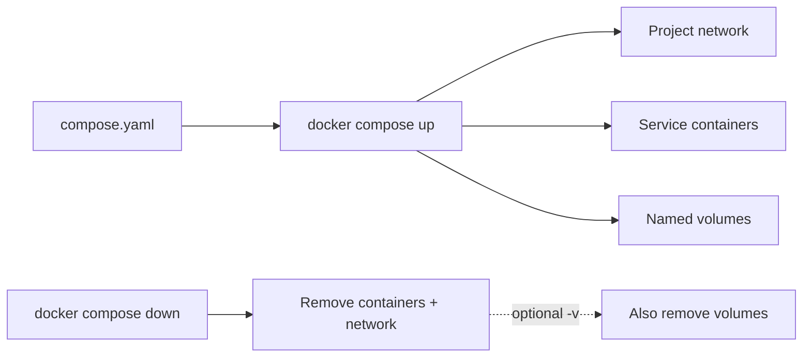
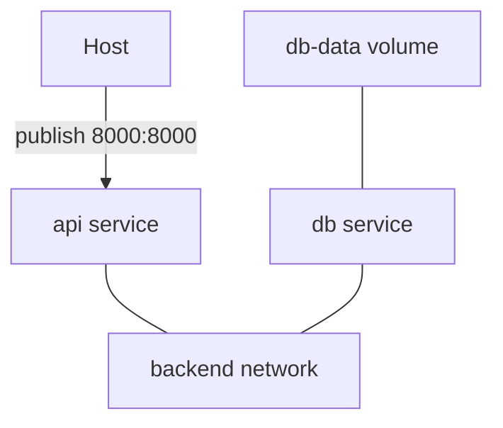
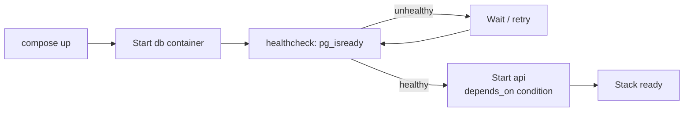
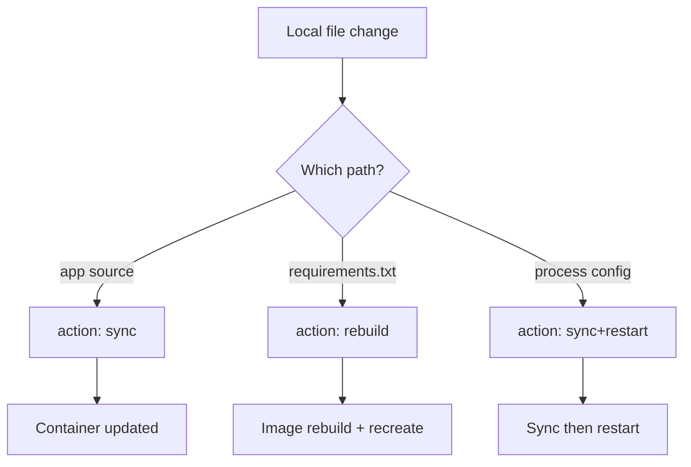

# Chapter 08 — Docker Compose

> **Learning Objectives**
>
> By the end of this chapter, you will be able to:
>
> - Explain what problem Compose solves and why a declarative file beats a pile of `docker run` commands
> - Write a `compose.yaml` using the modern **Compose Specification** (not obsolete "v3 syntax" framing)
> - Define services, networks, and volumes, and wire them together
> - Manage configuration with environment variables, `.env` files, profiles, and overrides
> - Add health checks and readiness-based startup ordering
> - Use Compose **Watch** (`develop.watch`) for a hands-off local edit loop
> - Build and run a realistic multi-service Task API with Postgres

---

## 08.1 The orchestra score

By now you can run a container the way a musician plays an instrument. A real application is an orchestra: a web API, a database, a cache, maybe a worker — each needing the right networks, volumes, ports, and environment, started in a sensible order.


*Figure 08.A: Compose is the conductor that starts each section when the score (compose.yaml) says so.*

You *could* conduct by shouting individual `docker run` lines every time. Or you could hand everyone a **score**: one document that describes each player and how they fit together.

Docker Compose is that score. You describe the application in YAML; `docker compose up` performs it. The file is *declarative and versionable* — it lives in Git, documents architecture, and makes "works on my machine" mean "works on every machine with Docker."

---

## 08.2 First contact with Compose

### In plain terms

Compose V2 ships with modern Docker as the `docker compose` subcommand (the old standalone `docker-compose` Python binary is history). One file, one command, a whole stack.

The problem Compose solves is *reproducibility of a whole system*. A single `docker run` is fine for one container, but a real app is a set of containers plus the networks and volumes that wire them together, started in the right order with the right environment. Doing that by hand means a growing pile of shell commands that only live in one person's terminal history — the definition of "works on my machine." Compose moves that entire description into one declarative file you commit to Git, so the stack is the same on your laptop, a teammate's, and CI.

> ⚠️ **Common Pitfall:** You might type `docker-compose` (with a hyphen) out of muscle memory from old tutorials. That was the standalone Python V1 tool, now retired. Modern Compose is the `docker compose` *subcommand* (space, not hyphen), built into the Docker CLI; commands and file format have moved on, so follow V2 docs, not V1 blog posts.

### Under the hood

Create `compose.yaml`:

```yaml
services:
  web:
    image: nginx:1.27
    ports:
      - "8080:80"
```

```bash
$ docker compose up -d
[+] Running 2/2
 ✔ Network myapp_default  Created
 ✔ Container myapp-web-1  Started

$ docker compose ps
NAME          IMAGE        COMMAND                  SERVICE   CREATED          STATUS          PORTS
myapp-web-1   nginx:1.27   "/docker-entrypoint.…"   web       10 seconds ago   Up 9 seconds    0.0.0.0:8080->80/tcp

$ docker compose down
[+] Running 2/2
 ✔ Container myapp-web-1  Removed
 ✔ Network myapp_default  Removed
```

Compose created a dedicated user-defined network for the project (so services can find each other by name, as in Chapter 06) and named resources after the project (directory name by default).



*Figure 08.1: Compose turns one declarative file into networks, services, and volumes — and tears them down as a unit.*

### Clearing up "version 3": an important correction

Many tutorials start with `version: "3.8"` and talk about "v2 vs v3 syntax." **That framing is outdated.**

- Historically there were two file-format families: Compose file version 2 (standalone) and version 3 (Swarm-oriented). The top-level `version:` key selected between them.
- Those families merged into one evolving standard: the **Compose Specification**.
- Under the spec, the top-level `version:` key is **obsolete**. Modern Compose ignores it (and may warn). Features come from your Compose tool version, not a number in the file.
- Preferred filename: `compose.yaml` (`docker-compose.yml` still works for compatibility).

Write spec-style files: no `version:` key, `compose.yaml` as the name.

### In production

Commit `compose.yaml` next to the app. Treat Compose as the local and CI contract for "how this stack runs." Production at scale may move to Swarm stacks (Chapter 09) or Kubernetes (Part II), but the *declarative multi-service* habit starts here.

**Who owns this:** the app team owns `compose.yaml` as source — it is code, reviewed and versioned like any other file. **Failure mode and detection:** the quiet trap is treating Compose as a *deployment* tool for production traffic when it has no multi-host scheduling, self-healing across nodes, or rolling-update guarantees; a single host running `docker compose up` is a single point of failure. Detect the mismatch when someone asks "what happens when this host dies?" and the answer is "the whole app is down." **Do** use Compose as the local/CI contract and the on-ramp to Swarm/Kubernetes semantics; **don't** treat one `compose up` on one VM as a resilient production platform.

**Before you leave this section**

- **Understand:** Compose turns a multi-container app into one declarative, version-controlled file run with `docker compose up`; it is the V2 subcommand, not the retired `docker-compose` binary.
- **Try:** write the two-line nginx `compose.yaml`, run `docker compose up -d`, inspect with `docker compose ps`, then `docker compose down`.
- **Watch in prod:** Compose on a single host being mistaken for a resilient, multi-node production platform.

---

## 08.3 Services, networks, and volumes

### In plain terms

A Compose file has three main pillars — containers to run, networks that connect them, and volumes that persist data — the same concepts from Chapters 05–07, written once.

Nothing new is being invented here — that is the point. `services` are the containers from Chapter 05, `networks` are the user-defined networks from Chapter 06, and `volumes` are the named volumes from Chapter 07. Compose just lets you declare all three in one place and wires them together automatically: it creates a project network, attaches every service to it, and gives each service a DNS name equal to its key in the file. That is why `api` can reach `db` with no IPs configured anywhere.

> ⚠️ **Common Pitfall:** You might expect to reach another service by `localhost` because "they're in the same Compose project." Inside a container `localhost` is that container itself. Services find each other by *service name* on the shared project network (`db`, `api`, `cache`) — the same lesson from Chapter 06, now automatic.

### Under the hood

```yaml
services:      # the containers to run, and how
networks:      # the user-defined networks connecting them
volumes:       # the named volumes persisting their data
```

```yaml
services:
  api:
    build: ./api
    ports:
      - "8000:8000"
    environment:
      DATABASE_URL: postgres://tasks:${DB_PASSWORD}@db:5432/tasks
    depends_on:
      - db
    networks:
      - backend

  db:
    image: postgres:16
    environment:
      POSTGRES_USER: tasks
      POSTGRES_PASSWORD: ${DB_PASSWORD}
      POSTGRES_DB: tasks
    volumes:
      - db-data:/var/lib/postgresql/data
    networks:
      - backend

networks:
  backend:

volumes:
  db-data:
```

The hostname `db` in the connection string works because Compose networks are user-defined networks with embedded DNS.



*Figure 08.2: A minimal Compose topology — API and database on a private network, volume on the database, published API port only.*

Notice what the `db` service does **not** have: a `ports:` entry. It does not need one. The API reaches Postgres over the private `backend` network on port 5432; nothing on the host or the outside world can. **What breaks if X:** the moment you add `ports: ["5432:5432"]` to `db` "so I can connect from my SQL client," Compose binds 5432 on `0.0.0.0` of the host — on a cloud VM that is your production database exposed to the internet, and Docker's own firewall rules can sit ahead of a host firewall you assumed was protecting it (Chapter 06).

### In production

Do not publish database ports unless a human tool on the host truly needs them. Keep data stores on internal networks; publish only the API (or put a reverse proxy in front).

**Who owns this:** the app team owns which services declare `ports:`; every published port is a security-relevant line in the file that a reviewer should question. **Failure mode and detection:** a `ports:` on a datastore added for local debugging gets committed and rides to a shared or cloud host, where scanners find it within hours. Detect it by grepping the committed Compose files for datastore `ports:` entries and by scanning the host from outside with `ss -ltnp` / an external port check. **Do** keep databases and caches port-less on an internal network and reach them only from other services; **don't** publish a datastore port by habit — bind to `127.0.0.1` if a host tool genuinely needs it.

> 🏭 **Production floor:** Adding `ports:` to a database or cache service is a blast-radius decision, not a convenience. On a public host it can expose the datastore to the internet and may bypass the host firewall via Docker's own packet-filter rules. Review every `ports:` entry like a firewall change: justify it, bind to `127.0.0.1` for host-local tooling, and default to no published port so datastores stay reachable only over the internal project network.

**Before you leave this section**

- **Understand:** `services`/`networks`/`volumes` are Chapters 05–07 declared once; Compose auto-creates a project network with DNS by service name.
- **Try:** bring up the api+db snippet, `docker compose exec api getent hosts db` to see DNS work, and confirm the db has no published port.
- **Watch in prod:** datastore `ports:` entries committed for debugging and exposing databases on shared or public hosts.

---

## 08.4 Configuration: env, extends, overrides, profiles

### In plain terms

Keep secrets and environment-specific knobs *out of hard-coded YAML strings* where you can. Compose interpolates variables, merges files, and can gate optional services behind **profiles**.

The reason to externalize configuration is that one `compose.yaml` often has to serve many contexts — your laptop, a teammate's, CI, a demo environment — that differ only in a handful of values (a port, an image tag, a password). Hard-coding those values forks the file per environment and invites drift. Compose gives you three complementary tools: `${VAR}` interpolation fed by an auto-loaded `.env` file, per-service environment injection (`environment:` / `env_file:`), and file layering plus profiles to reshape *which* services and settings apply. Used well, one committed file plus a small uncommitted `.env` covers every environment.

> ⚠️ **Common Pitfall:** You might assume `.env` and `env_file:` do the same thing. They do not. `.env` is auto-loaded to fill `${VAR}` placeholders *inside the Compose file itself* (host-side interpolation). `env_file:` injects variables *into a service's container* at runtime. A value you need for `${DB_PASSWORD}` interpolation must be in `.env`; a value the app reads at runtime belongs in `env_file:`/`environment:`.

### Under the hood

**`.env` vs `env_file:` vs `environment:`**

| Mechanism | Affects | Typical use |
|-----------|---------|-------------|
| `.env` (auto-loaded) | Interpolation *inside the Compose file* | Ports, tags, passwords for local `${VAR}` |
| `env_file:` on a service | Environment *inside that container* | Bulk app configuration |
| `environment:` on a service | Environment *inside that container* | Explicit overrides |

```bash
# .env — loaded automatically for interpolation
DB_PASSWORD=devsecret
```

```yaml
services:
  api:
    build: ./api
    env_file:
      - ./api/app.env
    environment:
      LOG_LEVEL: debug
```

Commit `compose.yaml`; add `.env` to `.gitignore` when it holds secrets.

**`extends` and multiple files:**

```yaml
# compose.yaml
services:
  api:
    extends:
      file: common.yaml
      service: base-api
    environment:
      LOG_LEVEL: debug
```

```bash
$ docker compose -f compose.yaml -f compose.prod.yaml up -d
```

Compose also auto-loads `compose.override.yaml` when present — handy for personal local tweaks.

**Profiles** — optional services in one file:

```yaml
services:
  api:
    build: ./api

  pgadmin:
    image: dpage/pgadmin4:8
    profiles: ["debug"]
```

```bash
$ docker compose up -d                     # api only
$ docker compose --profile debug up -d     # api + pgadmin
```

### In production

Use profiles for debug UIs, seed jobs, and heavy optional components — not for secretly forking prod topology. Prefer overlay files when whole *environments* differ (dev vs staging settings for the same services).

**Who owns this:** the app team owns the layering scheme (which values live in `.env`, which in `environment:`, which in an overlay file) and the discipline of never committing real secrets. **Failure mode and detection:** the recurring incident is a `.env` with a real password committed to Git, where it lives in history forever even after deletion. Detect it with a secret scanner in CI and a pre-commit hook, and confirm `.env` is in `.gitignore`. A quieter failure is override precedence surprises — a later `-f` file or `compose.override.yaml` silently changing a value; use `docker compose config` to render the final merged file and see exactly what will run. **Do** commit `compose.yaml`, gitignore secret-bearing `.env`, and render `config` before deploying; **don't** paste production credentials into any committed file.

**Before you leave this section**

- **Understand:** `.env` feeds `${VAR}` interpolation in the file; `env_file:`/`environment:` inject into containers; overlay files and profiles reshape what runs.
- **Try:** put `DB_PASSWORD` in `.env`, reference `${DB_PASSWORD}` in the file, and run `docker compose config` to see the interpolated result.
- **Watch in prod:** real secrets committed in `.env`, and override/`-f` precedence silently changing values.

---

## 08.5 Health checks and real startup ordering

### In plain terms

`depends_on: [db]` only controls *start order*. Postgres's container can be "started" long before it accepts connections. Your API can race ahead, fail, and crash. A **health check** plus `condition: service_healthy` waits for readiness.

The gap this closes is the difference between *started* and *ready*. Compose can start the `db` container in milliseconds, but Postgres itself needs seconds more to initialize its data directory and open its socket. Plain `depends_on: [db]` only guarantees the db container was launched first — not that the database inside it answers. So the API connects to a port nothing is listening on yet, throws, and (depending on your restart policy) crash-loops. A health check turns "the container exists" into "the service actually works," and `condition: service_healthy` makes dependents wait for that stronger signal.

> ⚠️ **Common Pitfall:** You might read `depends_on: [db]` as "wait until the database is ready." It is not — it is purely start *ordering*. This is one of the most common Compose foot-guns: the stack works on a fast machine (db happens to be ready in time) and fails intermittently on a slow one or in CI, which looks like a flaky test but is really a readiness race.

### Under the hood

```yaml
services:
  db:
    image: postgres:16
    healthcheck:
      test: ["CMD-SHELL", "pg_isready -U tasks -d tasks"]
      interval: 5s
      timeout: 3s
      retries: 5
      start_period: 10s

  api:
    build: ./api
    depends_on:
      db:
        condition: service_healthy
```

`start_period` gives Postgres a grace window before failures count against `retries`.



*Figure 08.3: Health-aware dependency ordering — the API waits until Postgres is healthy, not merely started.*

> 📘 **Deep Dive (optional):** `depends_on.condition` existed in the old Compose file v2 format, was removed in classic "v3," and returned in the Compose Specification — a concrete reason the merged spec beats the old v3 framing.

### In production

Health checks are not a substitute for application retries, but they stop the most common "API started before DB" foot-gun in local and CI stacks. Mirror the same readiness idea later with Kubernetes probes (Chapter 13).

**Who owns this:** the app team owns each service's health check (the command, interval, and `start_period`) because only the app knows what "ready" means for it. **Failure mode and detection:** two shapes recur. A health check that is too strict or lacks a `start_period` marks a still-initializing service unhealthy and stalls the whole stack; a check that is too shallow (`exit 0` on a trivial command) reports healthy while the app is broken. Detect with `docker compose ps` (the STATUS column shows `healthy`/`unhealthy`) and `docker inspect --format '{{json .State.Health}}' <ctr>` for the probe history. **Do** give slow-starting services a realistic `start_period` and a check that exercises real readiness (`pg_isready`, an HTTP `/healthz`); **don't** rely on health checks alone — apps should still retry transient connection failures.

**Before you leave this section**

- **Understand:** `depends_on: [db]` orders startup only; `healthcheck` + `condition: service_healthy` waits for actual readiness.
- **Try:** run the stack with bare `depends_on: [db]` and watch the API race/fail, then add the health condition and watch it wait.
- **Watch in prod:** readiness races that pass on fast machines and flake in CI, and health checks that are too strict (stall) or too shallow (false healthy).

---

## 08.6 Compose Watch and the `develop` section

### In plain terms

Bind mounts are one way to live-reload code. **Compose Watch** is another: you declare which local paths to monitor and what to do when they change — sync files into the container, rebuild the image, restart, or run a command — then leave Compose running while you edit.

Watch exists because a bind mount is a blunt instrument for the dev loop: it maps a whole tree in and reflects file edits, but it does nothing intelligent about *what kind* of change happened. Editing a Python source file should just sync; changing `requirements.txt` needs a full image rebuild; changing a process config file needs a restart. Watch lets you declare that mapping per path, so Compose does the right thing automatically while you keep editing — without mounting the entire project or manually rebuilding.

> ⚠️ **Common Pitfall:** You might think Watch replaces your build for shipping. It does not. Watch is a *local developer velocity* tool; the `Dockerfile` and image build remain the source of truth for how the service ships to CI and production. Wiring Watch-style syncing into a production host would let arbitrary file changes mutate running containers outside your image pipeline.

### Under the hood

Add a `develop.watch` list under a service (Compose Specification `develop` attribute):

```yaml
services:
  api:
    build: ./api
    develop:
      watch:
        - path: ./api
          target: /app
          action: sync
          ignore:
            - .venv/
            - __pycache__/
        - path: ./api/requirements.txt
          action: rebuild
        - path: ./api/gunicorn.conf.py
          action: sync+restart
```

| Action | Behavior |
|--------|----------|
| `sync` | Copy changed files into the running container at `target` |
| `rebuild` | Rebuild the image (BuildKit) and recreate the service |
| `restart` | Restart the service container |
| `sync+restart` | Sync, then restart |
| `sync+exec` | Sync, then run a command inside the container |

Start watch mode:

```bash
$ docker compose up --watch --build
```

Or, if the stack is already up and you want watch events separate from build logs:

```bash
$ docker compose watch
```

Typical pattern for the Task API: **sync** Python source for instant edits; **rebuild** when dependency files change; **sync+restart** when process config changes.



*Figure 08.4: Compose Watch maps path changes to sync, rebuild, or restart actions for a fast local loop.*

> 💡 **Tip:** Watch does not replace a proper image build for CI or production. It is a developer velocity tool. Keep `Dockerfile` and `compose.yaml` as the source of truth for how the service *ships*.

### In production

Do not enable watch-based workflows against production hosts. Use Watch locally (and maybe in ephemeral preview environments). Ship immutable images built in CI for anything that faces real traffic.

**Who owns this:** the app team owns the `develop.watch` rules for the local loop; the platform team owns the guarantee that production runs immutable, CI-built images and nothing mutates containers in place. **Failure mode and detection:** the anti-pattern is a `sync`-based workflow creeping toward a real environment, breaking the "the image is the artifact" contract so that what runs no longer matches what was built and scanned. Detect it by ensuring deploy pipelines build and push images (never `compose watch`) and that production containers are recreated from digests, not patched live. **Do** keep Watch to laptops and ephemeral previews; **don't** point Watch at a shared or production host.

**Before you leave this section**

- **Understand:** `develop.watch` maps path changes to `sync`, `rebuild`, `restart`, or `sync+restart`/`sync+exec` for a fast, precise local loop.
- **Try:** run `docker compose up --watch`, edit `app.py` (watch a sync), then edit `requirements.txt` (watch a rebuild).
- **Watch in prod:** Watch-style live syncing leaking toward real environments and breaking image immutability.

---

## 08.7 Putting it together: Task API and Postgres

Create this layout:

```text
task-api/
├── compose.yaml
├── .env
└── api/
    ├── Dockerfile
    ├── requirements.txt
    └── app.py
```

`api/app.py`:

```python
import os
import psycopg
from flask import Flask, jsonify, request

app = Flask(__name__)
DB_URL = os.environ["DATABASE_URL"]

def db():
    return psycopg.connect(DB_URL)

with db() as conn:
    conn.execute(
        "CREATE TABLE IF NOT EXISTS tasks ("
        "id SERIAL PRIMARY KEY, title TEXT NOT NULL, done BOOLEAN DEFAULT FALSE)"
    )

@app.get("/tasks")
def list_tasks():
    with db() as conn:
        rows = conn.execute("SELECT id, title, done FROM tasks ORDER BY id").fetchall()
    return jsonify([{"id": r[0], "title": r[1], "done": r[2]} for r in rows])

@app.post("/tasks")
def create_task():
    title = request.get_json()["title"]
    with db() as conn:
        row = conn.execute(
            "INSERT INTO tasks (title) VALUES (%s) RETURNING id", (title,)
        ).fetchone()
    return jsonify({"id": row[0], "title": title, "done": False}), 201

@app.get("/healthz")
def healthz():
    return "ok"
```

`api/requirements.txt`:

```text
flask==3.0.3
psycopg[binary]==3.2.1
gunicorn==22.0.0
```

`api/Dockerfile`:

```dockerfile
FROM python:3.12-slim
WORKDIR /app
COPY requirements.txt .
RUN pip install --no-cache-dir -r requirements.txt
COPY app.py .
EXPOSE 8000
CMD ["gunicorn", "--bind", "0.0.0.0:8000", "app:app"]
```

`.env`:

```bash
DB_PASSWORD=devsecret
```

`compose.yaml`:

```yaml
services:
  api:
    build: ./api
    ports:
      - "8000:8000"
    environment:
      DATABASE_URL: postgres://tasks:${DB_PASSWORD}@db:5432/tasks
    depends_on:
      db:
        condition: service_healthy
    healthcheck:
      test: ["CMD-SHELL", "python -c \"import urllib.request; urllib.request.urlopen('http://127.0.0.1:8000/healthz')\""]
      interval: 10s
      timeout: 3s
      retries: 3
    develop:
      watch:
        - path: ./api
          target: /app
          action: sync
          ignore:
            - __pycache__/
        - path: ./api/requirements.txt
          action: rebuild
    networks:
      - backend

  db:
    image: postgres:16
    environment:
      POSTGRES_USER: tasks
      POSTGRES_PASSWORD: ${DB_PASSWORD}
      POSTGRES_DB: tasks
    volumes:
      - db-data:/var/lib/postgresql/data
    healthcheck:
      test: ["CMD-SHELL", "pg_isready -U tasks -d tasks"]
      interval: 5s
      timeout: 3s
      retries: 5
      start_period: 10s
    networks:
      - backend

  cache:
    image: redis:7-alpine
    profiles: ["cache"]
    networks:
      - backend

networks:
  backend:

volumes:
  db-data:
```

Bring it up and exercise it:

```bash
$ docker compose up -d --build
[+] Running 3/3
 ✔ Network task-api_backend   Created
 ✔ Container task-api-db-1    Healthy
 ✔ Container task-api-api-1   Started

$ curl -s -X POST http://127.0.0.1:8000/tasks \
    -H "Content-Type: application/json" \
    -d '{"title": "Finish chapter 8"}'
{"done":false,"id":1,"title":"Finish chapter 8"}

$ curl -s http://127.0.0.1:8000/tasks
[{"done":false,"id":1,"title":"Finish chapter 8"}]

$ docker compose logs --tail 2 api
task-api-api-1  | [2026-07-25 17:42:03 +0000] [1] [INFO] Listening at: http://0.0.0.0:8000 (1)
task-api-api-1  | [2026-07-25 17:42:03 +0000] [1] [INFO] Booting worker with pid: 7

$ docker compose down
```

For a live edit loop:

```bash
$ docker compose up --watch --build
```

Change `app.py`, save, and watch Compose sync into the container. Change `requirements.txt` and watch a rebuild.

Every concept from this chapter is in play: services, private DNS (`db`), named volume, `.env` interpolation, a profile-gated cache, health-checked ordering, and Watch for development.

---

## 08.8 Common pitfalls

1. **Cargo-culting `version: "3.8"`.** Obsolete mental model — omit `version:`.
2. **Assuming bare `depends_on` waits for readiness.** Use `condition: service_healthy`.
3. **Confusing `.env` with `env_file:`.** Interpolation vs container environment.
4. **Editing code without rebuild or Watch/bind mount.** `up -d` reuses the image until `--build`, sync, or a mount updates it.
5. **`docker compose down -v` reflexively.** Deletes project named volumes, including databases.
6. **Publishing the database port out of habit.** Prefer internal network access only.
7. **Treating Watch as a production deploy mechanism.** It is for local development.

---

## 08.9 Hands-on exercises

1. **Run the score.** Build the Task API project as shown, create three tasks with `curl`, and list them.
2. **Prove persistence.** `docker compose down` (no `-v`), then `up -d` again — tasks remain. Repeat with `down -v` and explain the difference.
3. **Break ordering, then fix it.** Use bare `depends_on: [db]` without a health check; observe API connection errors; restore the healthy condition.
4. **Use the profile.** Start with `--profile cache` and confirm Redis appears in `docker compose ps`.
5. **Layer an override.** Create `compose.override.yaml` that maps `9000:8000`, bring the stack up, verify port 9000.
6. **Watch in action.** Run `docker compose up --watch`, edit `app.py`, and confirm Compose reports a sync (or rebuild when you touch `requirements.txt`).

---

## 08.10 Check Your Understanding

**Q1.** What is wrong with starting a new Compose file with `version: "3.8"`?

<details>
<summary>Show answer</summary>

Nothing necessarily breaks, but it reflects an obsolete model. The separate v2/v3 file formats merged into the Compose Specification, and modern Compose ignores `version:` (often with a warning). Feature availability comes from your Compose version, not a number in the file.

</details>

**Q2.** Your API starts before Postgres is ready and crashes. `depends_on: [db]` is set. Why doesn't it help, and what's the fix?

<details>
<summary>Show answer</summary>

The list form only orders startup, not readiness. Add a `healthcheck` on `db` (for example `pg_isready`) and use `depends_on: { db: { condition: service_healthy } }`.

</details>

**Q3.** How does `api` reach hostname `db` with no IP addresses configured?

<details>
<summary>Show answer</summary>

Compose attaches both services to a user-defined network with embedded DNS, which resolves the service name `db` to the container IP.

</details>

**Q4.** What's the difference between `.env` and a file referenced by `env_file:`?

<details>
<summary>Show answer</summary>

`.env` supplies values for `${VARIABLE}` interpolation *within the Compose file*. `env_file:` injects environment variables *into that service's container*.

</details>

**Q5.** When would you use Compose Watch (`develop.watch`) instead of only bind mounts?

<details>
<summary>Show answer</summary>

When you want declarative, per-path behavior: sync interpreted source for fast edits, rebuild when dependency manifests change, or restart when process config changes — without always mounting the entire project tree. Bind mounts remain valid; Watch adds automated rebuild/restart/exec reactions Compose manages for you.

</details>

**Q6.** When would you reach for profiles instead of a second Compose file?

<details>
<summary>Show answer</summary>

When optional services belong to the same project and you just want to toggle them (debug UIs, seed jobs, optional caches). Separate override files fit better when whole environments differ for the same core services.

</details>

---

## 08.11 Key takeaways

- Compose turns a multi-container app into one declarative `compose.yaml`, run with `docker compose up`.
- The modern standard is the **Compose Specification**: no `version:` key, prefer `compose.yaml`, and retire "v3 syntax" as the organizing story.
- Pillars — `services`, `networks`, `volumes` — map to earlier chapters.
- Interpolate with `.env`, inject with `environment:` / `env_file:`, reshape with overrides, `extends`, and **profiles**.
- Health checks plus `depends_on.condition: service_healthy` give readiness-based ordering.
- **`develop.watch`** (Compose Watch) syncs, rebuilds, or restarts on local file changes for a fast development loop — not for production deploys.

---

## 08.12 Official documentation map

| Topic | Official page |
|-------|---------------|
| Compose overview | [Docker Compose](https://docs.docker.com/compose/) |
| Compose Specification | [Compose file reference](https://docs.docker.com/reference/compose-file/) |
| `develop` / watch attribute | [Compose file develop](https://docs.docker.com/reference/compose-file/develop/) |
| Use Compose Watch | [Use Compose Watch](https://docs.docker.com/compose/how-tos/file-watch/) |
| Profiles | [Using profiles with Compose](https://docs.docker.com/compose/how-tos/profiles/) |
| Healthcheck | [Compose services — healthcheck](https://docs.docker.com/reference/compose-file/services/#healthcheck) |
| `depends_on` | [Compose services — depends_on](https://docs.docker.com/reference/compose-file/services/#depends_on) |
| Networking in Compose | [Networking in Compose](https://docs.docker.com/compose/how-tos/networking/) |
| `docker compose` CLI | [docker compose](https://docs.docker.com/reference/cli/docker/compose/) |

**Previous:** [Chapter 07 — Docker Volumes and Data Persistence](07-docker-volumes-and-data.md) | **Next:** [Chapter 09 — Introduction to Docker Swarm](09-docker-swarm-intro.md)
