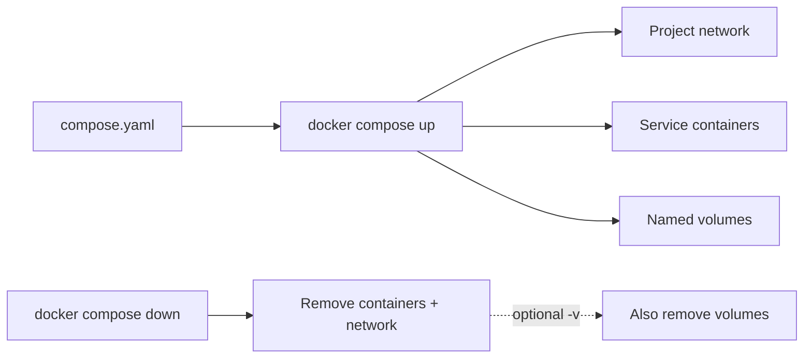
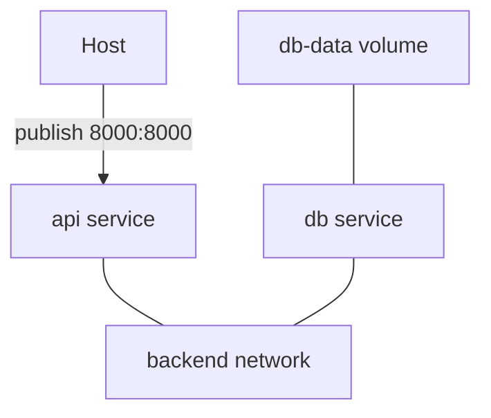
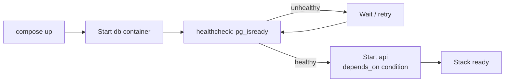
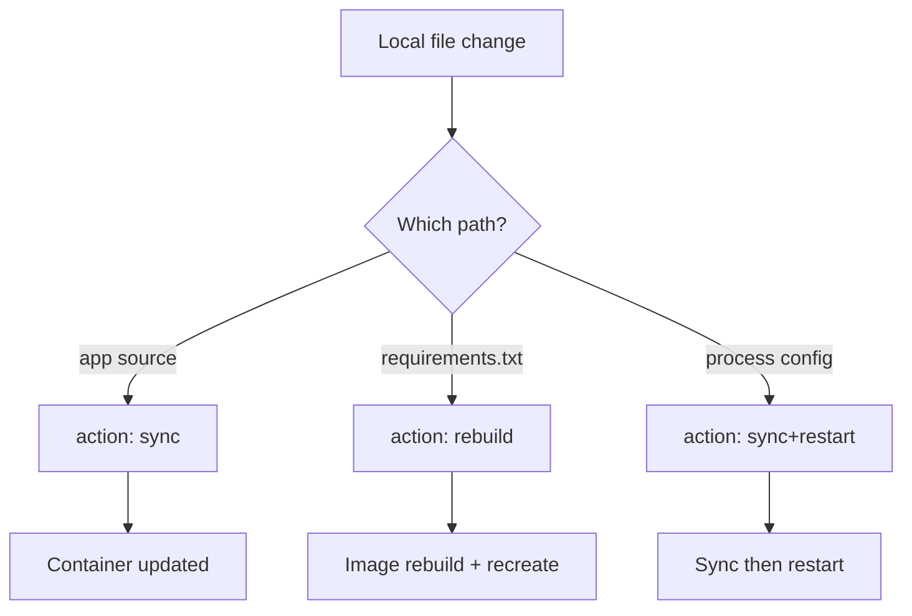

# Chapter 08 — Docker Compose

> **Learning Objectives**
>
> By the end of this chapter, you will be able to:
>
> - Say what problem Compose solves, and why one file beats a pile of `docker run` commands
> - Write a `compose.yaml` the modern way, following the **Compose Specification** instead of old "v3 syntax" advice
> - Describe services, networks, and volumes in one file and connect them together
> - Keep settings out of the file itself using environment variables, `.env` files, profiles, and overrides
> - Add health checks so one service waits until the service it needs is truly ready
> - Turn on Compose **Watch** (`develop.watch`) so your edits reach the container with no extra commands
> - Build and run a real two-service app: a Task API with Postgres

---

## 08.1 The orchestra score

By now you can run a container the way a musician plays one instrument. A real application is more like an orchestra. A web API, a database, a cache, maybe a background worker — each one needs the right network, volume, ports, and settings, started in a sensible order.


*Figure 08.A: Compose is the conductor that starts each section when the score (compose.yaml) says so.*

You *could* conduct that orchestra by shouting one `docker run` line at a time, every time. Or you could hand everyone a **score**: one document that describes each player and how they fit together.

Docker Compose is that score. You describe the application in YAML, and `docker compose up` performs it. The file is **declarative**, which means it states the result you want rather than the steps to get there. Because it is just a file, it lives in Git, records your architecture, and turns "works on my machine" into "works on every machine with Docker."

---

## 08.2 First contact with Compose

### In plain terms

Compose is a tool that reads one YAML file and then starts, stops, and connects every container your application needs.

You should care because a single `docker run` is fine for one container, but a real app is several containers plus the networks and volumes that join them, started in the right order with the right settings. Doing that by hand leaves you with a growing pile of shell commands that live only in one person's terminal history. That is the definition of "works on my machine." Compose moves the whole description into one file you commit to Git, so the stack comes up the same way on your laptop, on a teammate's laptop, and in CI.

Compose V2 ships with modern Docker as the `docker compose` subcommand. The old standalone `docker-compose` Python program is history. One file, one command, a whole stack.

> 💡 **In one line:** Compose is not magic. It reads your file and runs the same container, network, and volume operations you would type by hand — in the right order, every time, with names based on the project.

> ⚠️ **Common Pitfall:** You might type `docker-compose` with a hyphen out of muscle memory from old tutorials. That was the standalone Python V1 tool, now retired. Modern Compose is the `docker compose` *subcommand* — a space, not a hyphen — built into the Docker CLI. The commands and the file format have both moved on, so follow V2 docs rather than V1 blog posts.

### Under the hood

Create `compose.yaml`:

```yaml
services:
  web:
    image: nginx:1.27
    ports:
      - "8080:80"
```

```bash
$ docker compose up -d
[+] Running 2/2
 ✔ Network myapp_default  Created
 ✔ Container myapp-web-1  Started

$ docker compose ps
NAME          IMAGE        COMMAND                  SERVICE   CREATED          STATUS          PORTS
myapp-web-1   nginx:1.27   "/docker-entrypoint.…"   web       10 seconds ago   Up 9 seconds    0.0.0.0:8080->80/tcp

$ docker compose down
[+] Running 2/2
 ✔ Container myapp-web-1  Removed
 ✔ Network myapp_default  Removed
```

Compose created a dedicated user-defined network for the project (so services can find each other by name, as in Chapter 06) and named resources after the project (directory name by default).



*Figure 08.1: Compose turns one declarative file into networks, services, and volumes — and tears them down as a unit.*

### Clearing up "version 3": an important correction

Many tutorials start with `version: "3.8"` and talk about "v2 vs v3 syntax." **That framing is outdated.**

- Historically there were two file-format families: Compose file version 2 (standalone) and version 3 (Swarm-oriented). The top-level `version:` key selected between them.
- Those families merged into one evolving standard: the **Compose Specification**.
- Under the spec, the top-level `version:` key is **obsolete**. Modern Compose ignores it (and may warn). Features come from your Compose tool version, not a number in the file.
- Preferred filename: `compose.yaml` (`docker-compose.yml` still works for compatibility).

Write spec-style files: no `version:` key, `compose.yaml` as the name.

### In production

Commit `compose.yaml` next to the app. Treat Compose as the agreed answer to "how does this stack run?" for local work and CI. Production at scale may move on to Swarm stacks (Chapter 09) or Kubernetes (Part II), but the habit of describing many services in one file starts here.

**Who owns this:** the app team owns `compose.yaml` as source code. It gets reviewed and versioned like any other file. **Failure mode and detection:** the quiet trap is using Compose to run production traffic. Compose cannot schedule across several machines, cannot heal a workload when a node dies, and gives you no rolling-update guarantees. One host running `docker compose up` is a single point of failure. You spot the mismatch the moment someone asks "what happens when this host dies?" and the answer is "the whole app goes down." **Do** use Compose for local work, CI, and as your on-ramp to Swarm and Kubernetes ideas; **don't** treat one `compose up` on one VM as a resilient production platform.

**Before you leave this section**

- **Understand:** Compose turns a multi-container app into one declarative, version-controlled file run with `docker compose up`; it is the V2 subcommand, not the retired `docker-compose` binary.
- **Try:** write the two-line nginx `compose.yaml`, run `docker compose up -d`, inspect with `docker compose ps`, then `docker compose down`.
- **Watch in prod:** Compose on a single host being mistaken for a resilient, multi-node production platform.

---

## 08.3 Services, networks, and volumes

### In plain terms

A Compose file has three main parts: `services` are the containers to run, `networks` connect them, and `volumes` keep their data.

You should care because these are exactly the pieces you already learned, now written down in one place. `services` are the containers from Chapter 05. `networks` are the networks you created yourself in Chapter 06. `volumes` are the named volumes from Chapter 07. Nothing new is being invented here, and that is the point.

Compose also wires the three together for you. It creates one network for the project, attaches every service to it, and gives each service a DNS name equal to its key in the file. That is why `api` can reach `db` with no IP address configured anywhere.

> ⚠️ **Common Pitfall:** You might expect to reach another service at `localhost` because "they're in the same Compose project." Inside a container, `localhost` means that container itself. Services find each other by *service name* on the shared project network — `db`, `api`, `cache`. It is the same lesson from Chapter 06, except Compose now sets it up for you.

### Under the hood

Here is what the three top-level keys look like in a file:

```yaml
services:      # the containers to run, and how
networks:      # the user-defined networks connecting them
volumes:       # the named volumes persisting their data
```

```yaml
services:
  api:
    build: ./api
    ports:
      - "8000:8000"
    environment:
      DATABASE_URL: postgres://tasks:${DB_PASSWORD}@db:5432/tasks
    depends_on:
      - db
    networks:
      - backend

  db:
    image: postgres:16
    environment:
      POSTGRES_USER: tasks
      POSTGRES_PASSWORD: ${DB_PASSWORD}
      POSTGRES_DB: tasks
    volumes:
      - db-data:/var/lib/postgresql/data
    networks:
      - backend

networks:
  backend:

volumes:
  db-data:
```

The hostname `db` in the connection string works because Compose networks are user-defined networks with embedded DNS.



*Figure 08.2: A minimal Compose topology — API and database on a private network, volume on the database, published API port only.*

Notice what the `db` service does **not** have: a `ports:` entry. It does not need one. The API reaches Postgres over the private `backend` network on port 5432; nothing on the host or the outside world can. **What breaks if X:** the moment you add `ports: ["5432:5432"]` to `db` "so I can connect from my SQL client," Compose binds 5432 on `0.0.0.0` of the host — on a cloud VM that is your production database exposed to the internet, and Docker's own firewall rules can sit ahead of a host firewall you assumed was protecting it (Chapter 06).

### In production

Do not publish database ports unless a tool a human runs on the host truly needs them. Keep datastores on internal networks. Publish only the API, or put a reverse proxy in front of it.

**Who owns this:** the app team owns which services declare `ports:`. Every published port is a security decision written into the file, and a reviewer should question each one. **Failure mode and detection:** a `ports:` entry added to a datastore for local debugging gets committed, rides along to a shared or cloud host, and scanners find it within hours. Look for it by searching committed Compose files for `ports:` on datastores, and by checking the host from outside with `ss -ltnp` or an external port check. **Do** keep databases and caches with no published port on an internal network, reachable only from other services; **don't** publish a datastore port out of habit — bind to `127.0.0.1` if a host tool genuinely needs it.

> 🏭 **Production floor:** Adding `ports:` to a database or cache service is a blast-radius decision, not a convenience. On a public host it can expose the datastore to the internet and may bypass the host firewall via Docker's own packet-filter rules. Review every `ports:` entry like a firewall change: justify it, bind to `127.0.0.1` for host-local tooling, and default to no published port so datastores stay reachable only over the internal project network.

**Before you leave this section**

- **Understand:** `services`/`networks`/`volumes` are Chapters 05–07 declared once; Compose auto-creates a project network with DNS by service name.
- **Try:** bring up the api+db snippet, `docker compose exec api getent hosts db` to see DNS work, and confirm the db has no published port.
- **Watch in prod:** datastore `ports:` entries committed for debugging and exposing databases on shared or public hosts.

---

## 08.4 Configuration: env, extends, overrides, profiles

### In plain terms

Compose can pull values in from outside the file, stack several files on top of each other, and switch optional services on and off with **profiles**.

You need this because one `compose.yaml` usually has to serve many situations — your laptop, a teammate's laptop, CI, a demo box — that differ by only a handful of values, such as a port, an image tag, or a password. Hard-code those values and you end up with one copy of the file per environment. Copies drift apart, and then nobody knows which one is right.

Compose gives you three tools that work together. First, `${VAR}` placeholders filled in from a `.env` file that Compose loads on its own. Second, per-service settings pushed into the container with `environment:` or `env_file:`. Third, extra files layered on top, plus profiles, which change *which* services and settings apply at all. Used well, one committed file plus one small uncommitted `.env` covers every environment. Keep secrets and environment-specific values out of hard-coded YAML strings wherever you can.

> ⚠️ **Common Pitfall:** You might assume `.env` and `env_file:` do the same thing. They do not. Compose loads `.env` on the host to fill `${VAR}` placeholders *inside the Compose file itself*. `env_file:` sets variables *inside a service's container* when it runs. A value you need for `${DB_PASSWORD}` must be in `.env`. A value the app reads while running belongs in `env_file:` or `environment:`.

### Under the hood

Here is exactly what each mechanism touches:

**`.env` vs `env_file:` vs `environment:`**

| Mechanism | Affects | Typical use |
|-----------|---------|-------------|
| `.env` (auto-loaded) | Interpolation *inside the Compose file* | Ports, tags, passwords for local `${VAR}` |
| `env_file:` on a service | Environment *inside that container* | Bulk app configuration |
| `environment:` on a service | Environment *inside that container* | Explicit overrides |

```bash
# .env — loaded automatically for interpolation
DB_PASSWORD=devsecret
```

```yaml
services:
  api:
    build: ./api
    env_file:
      - ./api/app.env
    environment:
      LOG_LEVEL: debug
```

Commit `compose.yaml`; add `.env` to `.gitignore` when it holds secrets.

**`extends` and multiple files:**

```yaml
# compose.yaml
services:
  api:
    extends:
      file: common.yaml
      service: base-api
    environment:
      LOG_LEVEL: debug
```

```bash
$ docker compose -f compose.yaml -f compose.prod.yaml up -d
```

Compose also auto-loads `compose.override.yaml` when present — handy for personal local tweaks.

**Profiles** — optional services in one file:

```yaml
services:
  api:
    build: ./api

  pgadmin:
    image: dpage/pgadmin4:8
    profiles: ["debug"]
```

```bash
$ docker compose up -d                     # api only
$ docker compose --profile debug up -d     # api + pgadmin
```

### In production

Use profiles for debug UIs, seed jobs, and heavy optional components. Do not use them to quietly build a different production layout. Use extra layered files when whole *environments* differ, such as dev versus staging settings for the same services.

**Who owns this:** the app team owns the layering scheme — which values live in `.env`, which in `environment:`, which in a layered file — and the discipline of never committing a real secret. **Failure mode and detection:** the incident that keeps happening is a `.env` holding a real password committed to Git, where it stays in the history forever even after you delete the line. Catch it with a secret scanner in CI and a pre-commit hook, and confirm `.env` is listed in `.gitignore`. A quieter failure is a surprise about which file wins: a later `-f` file or `compose.override.yaml` silently changes a value. Run `docker compose config` to print the final merged file and see exactly what will run. **Do** commit `compose.yaml`, gitignore any `.env` holding secrets, and print `config` before you deploy; **don't** paste production credentials into any committed file.

**Before you leave this section**

- **Understand:** `.env` feeds `${VAR}` interpolation in the file; `env_file:`/`environment:` inject into containers; overlay files and profiles reshape what runs.
- **Try:** put `DB_PASSWORD` in `.env`, reference `${DB_PASSWORD}` in the file, and run `docker compose config` to see the interpolated result.
- **Watch in prod:** real secrets committed in `.env`, and override/`-f` precedence silently changing values.

---

## 08.5 Health checks and real startup ordering

### In plain terms

A **health check** is a command Compose runs inside a container again and again to decide whether the service inside is actually working.

You need it because *started* and *ready* are not the same thing. Compose can start the `db` container in milliseconds, but Postgres itself needs several more seconds to set up its data directory and open its socket. Plain `depends_on: [db]` only promises that the db container was launched first. It does not promise that the database answers. So your API connects to a port where nothing is listening yet, throws an error, and — depending on the restart policy — crash-loops.

A health check turns "the container exists" into "the service really works." Adding `condition: service_healthy` to `depends_on` makes the API wait for that stronger signal instead of racing ahead.

> 💡 **In one line:** `depends_on` on its own only sets start order. A `healthcheck` plus `condition: service_healthy` is what makes one service wait until another is genuinely ready.

> ⚠️ **Common Pitfall:** You might read `depends_on: [db]` as "wait until the database is ready." It is not that at all. It is purely start *order*. This is one of the most common Compose traps: the stack works on a fast machine, because the db happens to be ready in time, and then fails now and then on a slow machine or in CI. It looks like a flaky test, but it is a readiness race.

### Under the hood

Here is what actually happens on the machine when you add the check:

```yaml
services:
  db:
    image: postgres:16
    healthcheck:
      test: ["CMD-SHELL", "pg_isready -U tasks -d tasks"]
      interval: 5s
      timeout: 3s
      retries: 5
      start_period: 10s

  api:
    build: ./api
    depends_on:
      db:
        condition: service_healthy
```

`start_period` gives Postgres a grace window before failures count against `retries`.



*Figure 08.3: Health-aware dependency ordering — the API waits until Postgres is healthy, not merely started.*

> 📘 **Deep Dive (optional):** `depends_on.condition` existed in the old Compose file v2 format, was removed in classic "v3," and returned in the Compose Specification — a concrete reason the merged spec beats the old v3 framing.

### In production

Health checks do not replace retries in your application code, but they do stop the most common "API started before the database" trap in local and CI stacks. You will meet the same readiness idea again as Kubernetes probes (Chapter 13).

**Who owns this:** the app team owns each service's health check — the command, the interval, and the `start_period` — because only the app knows what "ready" means for it. **Failure mode and detection:** two shapes recur. A check that is too strict, or that has no `start_period`, marks a service unhealthy while it is still starting up and stalls the whole stack. A check that is too shallow, such as `exit 0` on a trivial command, reports healthy while the app is broken. Watch the STATUS column in `docker compose ps` for `healthy` and `unhealthy`, and read the probe history with `docker inspect --format '{{json .State.Health}}' <ctr>`. **Do** give slow-starting services a realistic `start_period` and a check that proves real readiness, such as `pg_isready` or an HTTP `/healthz` call; **don't** lean on health checks alone — the app should still retry a connection that fails once.

**Before you leave this section**

- **Understand:** `depends_on: [db]` orders startup only; `healthcheck` + `condition: service_healthy` waits for actual readiness.
- **Try:** run the stack with bare `depends_on: [db]` and watch the API race/fail, then add the health condition and watch it wait.
- **Watch in prod:** readiness races that pass on fast machines and flake in CI, and health checks that are too strict (stall) or too shallow (false healthy).

---

## 08.6 Compose Watch and the `develop` section

### In plain terms

**Compose Watch** is a Compose feature that watches folders on your machine and reacts to each change the way you asked: copy the file into the container, rebuild the image, restart the service, or run a command.

You want it because a bind mount is a blunt tool for the development loop. It maps a whole folder tree in and reflects your edits, but it does nothing clever about *what kind* of change happened. Editing a Python source file should just copy the file across. Changing `requirements.txt` needs a full image rebuild. Changing a process config file needs a restart.

Watch lets you declare that mapping one path at a time. Compose then does the right thing on its own while you keep editing, and you never mount the whole project or rebuild by hand.

> ⚠️ **Common Pitfall:** You might think Watch replaces your build when it is time to ship. It does not. Watch only exists to make local development fast. The `Dockerfile` and the image build stay the source of truth for how the service reaches CI and production. Wiring Watch-style syncing into a production host would let stray file changes alter running containers outside your image pipeline.

### Under the hood

Here is what you actually write. Add a `develop.watch` list under a service (the Compose Specification `develop` attribute):

```yaml
services:
  api:
    build: ./api
    develop:
      watch:
        - path: ./api
          target: /app
          action: sync
          ignore:
            - .venv/
            - __pycache__/
        - path: ./api/requirements.txt
          action: rebuild
        - path: ./api/gunicorn.conf.py
          action: sync+restart
```

| Action | Behavior |
|--------|----------|
| `sync` | Copy changed files into the running container at `target` |
| `rebuild` | Rebuild the image (BuildKit) and recreate the service |
| `restart` | Restart the service container |
| `sync+restart` | Sync, then restart |
| `sync+exec` | Sync, then run a command inside the container |

Start watch mode:

```bash
$ docker compose up --watch --build
```

Or, if the stack is already up and you want watch events separate from build logs:

```bash
$ docker compose watch
```

Typical pattern for the Task API: **sync** Python source for instant edits; **rebuild** when dependency files change; **sync+restart** when process config changes.



*Figure 08.4: Compose Watch maps path changes to sync, rebuild, or restart actions for a fast local loop.*

> 💡 **Tip:** Watch does not replace a proper image build for CI or production. It is a developer velocity tool. Keep `Dockerfile` and `compose.yaml` as the source of truth for how the service *ships*.

### In production

Never point a watch-based workflow at a production host. Use Watch locally, and at most in short-lived preview environments. Ship images built in CI, unchanged after the build, for anything that serves real traffic.

**Who owns this:** the app team owns the `develop.watch` rules for the local loop. The platform team owns the guarantee that production runs CI-built images and that nothing edits a running container in place. **Failure mode and detection:** the bad pattern is a `sync`-based workflow creeping toward a real environment. It breaks the rule that the image is the artifact, so what runs no longer matches what was built and scanned. Check that deploy pipelines build and push images — never `compose watch` — and that production containers are recreated from digests rather than patched while running. **Do** keep Watch on laptops and short-lived previews; **don't** point Watch at a shared or production host.

**Before you leave this section**

- **Understand:** `develop.watch` maps path changes to `sync`, `rebuild`, `restart`, or `sync+restart`/`sync+exec` for a fast, precise local loop.
- **Try:** run `docker compose up --watch`, edit `app.py` (watch a sync), then edit `requirements.txt` (watch a rebuild).
- **Watch in prod:** Watch-style live syncing leaking toward real environments and breaking image immutability.

---

## 08.7 Putting it together: Task API and Postgres

Create this layout:

```text
task-api/
├── compose.yaml
├── .env
└── api/
    ├── Dockerfile
    ├── requirements.txt
    └── app.py
```

`api/app.py`:

```python
import os
import psycopg
from flask import Flask, jsonify, request

app = Flask(__name__)
DB_URL = os.environ["DATABASE_URL"]

def db():
    return psycopg.connect(DB_URL)

with db() as conn:
    conn.execute(
        "CREATE TABLE IF NOT EXISTS tasks ("
        "id SERIAL PRIMARY KEY, title TEXT NOT NULL, done BOOLEAN DEFAULT FALSE)"
    )

@app.get("/tasks")
def list_tasks():
    with db() as conn:
        rows = conn.execute("SELECT id, title, done FROM tasks ORDER BY id").fetchall()
    return jsonify([{"id": r[0], "title": r[1], "done": r[2]} for r in rows])

@app.post("/tasks")
def create_task():
    title = request.get_json()["title"]
    with db() as conn:
        row = conn.execute(
            "INSERT INTO tasks (title) VALUES (%s) RETURNING id", (title,)
        ).fetchone()
    return jsonify({"id": row[0], "title": title, "done": False}), 201

@app.get("/healthz")
def healthz():
    return "ok"
```

`api/requirements.txt`:

```text
flask==3.0.3
psycopg[binary]==3.2.1
gunicorn==22.0.0
```

`api/Dockerfile`:

```dockerfile
FROM python:3.12-slim
WORKDIR /app
COPY requirements.txt .
RUN pip install --no-cache-dir -r requirements.txt
COPY app.py .
EXPOSE 8000
CMD ["gunicorn", "--bind", "0.0.0.0:8000", "app:app"]
```

`.env`:

```bash
DB_PASSWORD=devsecret
```

`compose.yaml`:

```yaml
services:
  api:
    build: ./api
    ports:
      - "8000:8000"
    environment:
      DATABASE_URL: postgres://tasks:${DB_PASSWORD}@db:5432/tasks
    depends_on:
      db:
        condition: service_healthy
    healthcheck:
      test: ["CMD-SHELL", "python -c \"import urllib.request; urllib.request.urlopen('http://127.0.0.1:8000/healthz')\""]
      interval: 10s
      timeout: 3s
      retries: 3
    develop:
      watch:
        - path: ./api
          target: /app
          action: sync
          ignore:
            - __pycache__/
        - path: ./api/requirements.txt
          action: rebuild
    networks:
      - backend

  db:
    image: postgres:16
    environment:
      POSTGRES_USER: tasks
      POSTGRES_PASSWORD: ${DB_PASSWORD}
      POSTGRES_DB: tasks
    volumes:
      - db-data:/var/lib/postgresql/data
    healthcheck:
      test: ["CMD-SHELL", "pg_isready -U tasks -d tasks"]
      interval: 5s
      timeout: 3s
      retries: 5
      start_period: 10s
    networks:
      - backend

  cache:
    image: redis:7-alpine
    profiles: ["cache"]
    networks:
      - backend

networks:
  backend:

volumes:
  db-data:
```

Bring it up and exercise it:

```bash
$ docker compose up -d --build
[+] Running 3/3
 ✔ Network task-api_backend   Created
 ✔ Container task-api-db-1    Healthy
 ✔ Container task-api-api-1   Started

$ curl -s -X POST http://127.0.0.1:8000/tasks \
    -H "Content-Type: application/json" \
    -d '{"title": "Finish chapter 8"}'
{"done":false,"id":1,"title":"Finish chapter 8"}

$ curl -s http://127.0.0.1:8000/tasks
[{"done":false,"id":1,"title":"Finish chapter 8"}]

$ docker compose logs --tail 2 api
task-api-api-1  | [2026-07-25 17:42:03 +0000] [1] [INFO] Listening at: http://0.0.0.0:8000 (1)
task-api-api-1  | [2026-07-25 17:42:03 +0000] [1] [INFO] Booting worker with pid: 7

$ docker compose down
```

For a live edit loop:

```bash
$ docker compose up --watch --build
```

Change `app.py`, save, and watch Compose sync into the container. Change `requirements.txt` and watch a rebuild.

Every concept from this chapter is in play: services, private DNS (`db`), named volume, `.env` interpolation, a profile-gated cache, health-checked ordering, and Watch for development.

---

## 08.8 Common pitfalls

1. **Cargo-culting `version: "3.8"`.** Obsolete mental model — omit `version:`.
2. **Assuming bare `depends_on` waits for readiness.** Use `condition: service_healthy`.
3. **Confusing `.env` with `env_file:`.** Interpolation vs container environment.
4. **Editing code without rebuild or Watch/bind mount.** `up -d` reuses the image until `--build`, sync, or a mount updates it.
5. **`docker compose down -v` reflexively.** Deletes project named volumes, including databases.
6. **Publishing the database port out of habit.** Prefer internal network access only.
7. **Treating Watch as a production deploy mechanism.** It is for local development.

---

## 08.9 Hands-on exercises

1. **Run the score.** Build the Task API project as shown, create three tasks with `curl`, and list them.
2. **Prove persistence.** `docker compose down` (no `-v`), then `up -d` again — tasks remain. Repeat with `down -v` and explain the difference.
3. **Break ordering, then fix it.** Use bare `depends_on: [db]` without a health check; observe API connection errors; restore the healthy condition.
4. **Use the profile.** Start with `--profile cache` and confirm Redis appears in `docker compose ps`.
5. **Layer an override.** Create `compose.override.yaml` that maps `9000:8000`, bring the stack up, verify port 9000.
6. **Watch in action.** Run `docker compose up --watch`, edit `app.py`, and confirm Compose reports a sync (or rebuild when you touch `requirements.txt`).

---

## 08.10 Check Your Understanding

**Q1.** What is wrong with starting a new Compose file with `version: "3.8"`?

<details>
<summary>Show answer</summary>

Nothing necessarily breaks, but it reflects an obsolete model. The separate v2/v3 file formats merged into the Compose Specification, and modern Compose ignores `version:` (often with a warning). Feature availability comes from your Compose version, not a number in the file.

</details>

**Q2.** Your API starts before Postgres is ready and crashes. `depends_on: [db]` is set. Why doesn't it help, and what's the fix?

<details>
<summary>Show answer</summary>

The list form only orders startup, not readiness. Add a `healthcheck` on `db` (for example `pg_isready`) and use `depends_on: { db: { condition: service_healthy } }`.

</details>

**Q3.** How does `api` reach hostname `db` with no IP addresses configured?

<details>
<summary>Show answer</summary>

Compose attaches both services to a user-defined network with embedded DNS, which resolves the service name `db` to the container IP.

</details>

**Q4.** What's the difference between `.env` and a file referenced by `env_file:`?

<details>
<summary>Show answer</summary>

`.env` supplies values for `${VARIABLE}` interpolation *within the Compose file*. `env_file:` injects environment variables *into that service's container*.

</details>

**Q5.** When would you use Compose Watch (`develop.watch`) instead of only bind mounts?

<details>
<summary>Show answer</summary>

When you want declarative, per-path behavior: sync interpreted source for fast edits, rebuild when dependency manifests change, or restart when process config changes — without always mounting the entire project tree. Bind mounts remain valid; Watch adds automated rebuild/restart/exec reactions Compose manages for you.

</details>

**Q6.** When would you reach for profiles instead of a second Compose file?

<details>
<summary>Show answer</summary>

When optional services belong to the same project and you just want to toggle them (debug UIs, seed jobs, optional caches). Separate override files fit better when whole environments differ for the same core services.

</details>

---

## 08.11 Key takeaways

- One file describes the whole app. `docker compose up` runs it.
- Use the **Compose Specification**: no `version:` key, name the file `compose.yaml`, and drop "v3 syntax" from your vocabulary.
- Three keys, three chapters: `services` (containers), `networks` (connections), `volumes` (data).
- Services reach each other by service name, never by `localhost` and never by IP.
- `.env` fills `${VAR}` in the file. `environment:` and `env_file:` set variables inside the container. Layered files and **profiles** change what runs.
- `depends_on` only orders startup. Add a `healthcheck` plus `condition: service_healthy` to wait for ready.
- Give a datastore no published port. It does not need one.
- **Compose Watch** (`develop.watch`) copies, rebuilds, or restarts as you edit. It is for your laptop, not for deploys.
- `docker compose down -v` deletes the project's named volumes, database included.

---

## 08.12 Official documentation map

| Topic | Official page |
|-------|---------------|
| Compose overview | [Docker Compose](https://docs.docker.com/compose/) |
| Compose Specification | [Compose file reference](https://docs.docker.com/reference/compose-file/) |
| `develop` / watch attribute | [Compose file develop](https://docs.docker.com/reference/compose-file/develop/) |
| Use Compose Watch | [Use Compose Watch](https://docs.docker.com/compose/how-tos/file-watch/) |
| Profiles | [Using profiles with Compose](https://docs.docker.com/compose/how-tos/profiles/) |
| Healthcheck | [Compose services — healthcheck](https://docs.docker.com/reference/compose-file/services/#healthcheck) |
| `depends_on` | [Compose services — depends_on](https://docs.docker.com/reference/compose-file/services/#depends_on) |
| Networking in Compose | [Networking in Compose](https://docs.docker.com/compose/how-tos/networking/) |
| `docker compose` CLI | [docker compose](https://docs.docker.com/reference/cli/docker/compose/) |

**Previous:** [Chapter 07 — Docker Volumes and Data Persistence](07-docker-volumes-and-data.md) | **Next:** [Chapter 09 — Introduction to Docker Swarm](09-docker-swarm-intro.md)
