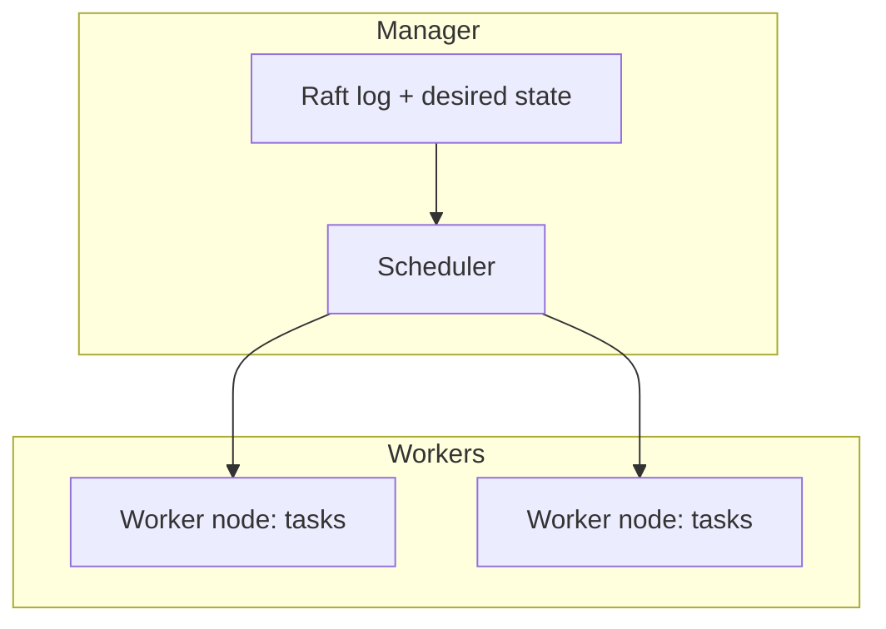
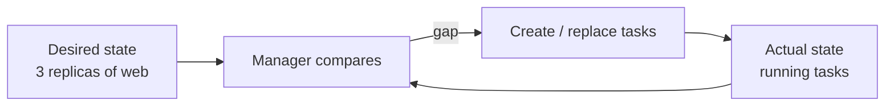
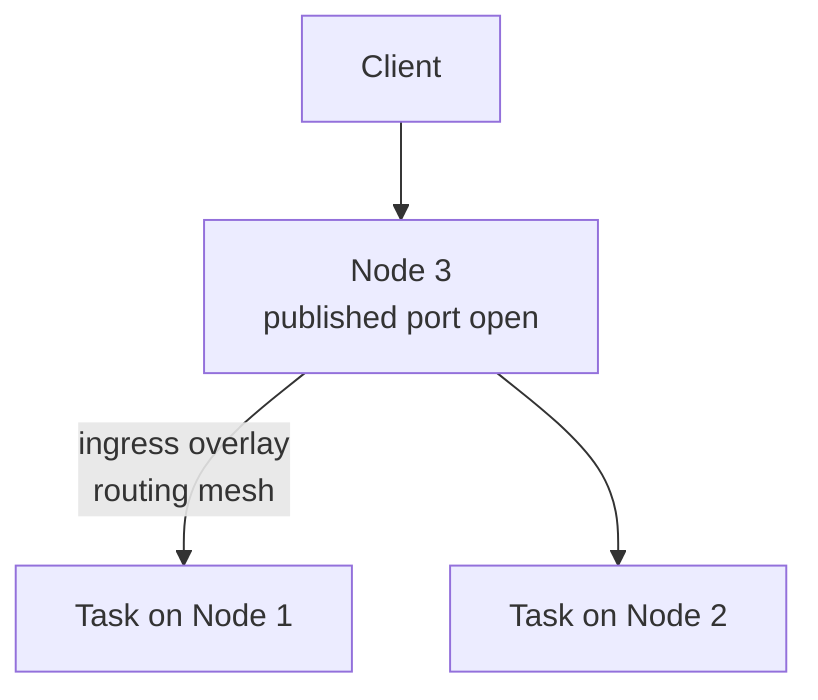
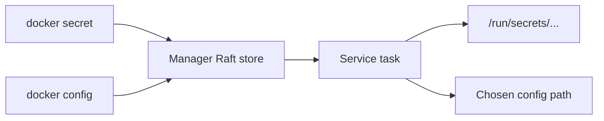

# Chapter 09 — Introduction to Docker Swarm

> **Learning Objectives**
>
> By the end of this chapter, you will be able to:
>
> - Explain what container orchestration is and why single-host Docker is not enough for production-scale systems
> - Initialize a Swarm and describe manager and worker roles
> - Deploy, scale, and update **services** instead of managing individual containers
> - Deploy whole applications as **stacks** using Compose files
> - Explain how the **routing mesh** makes any node answer for any published service
> - Use Swarm **secrets** and **configs** to inject credentials and non-sensitive files into services
> - Position Swarm honestly relative to Kubernetes, which the rest of this book covers

---

## 09.1 From chef to restaurant chain

So far you have been a chef in one kitchen. You know every pan (container): start it, watch it, restart it. That works for one kitchen.


*Figure 09.A: Managers plan; workers cook—the chain keeps serving if one kitchen stalls.*

Opening a restaurant chain means ten kitchens and hundreds of dishes. You need a *head office* that takes declarations like "every location serves the daily special, five stations at all times" and makes it happen — hiring, rebalancing, replacing failures — without you flying out.

That head office is an **orchestrator**. You stop issuing "start this container here" and start declaring **desired state** ("run five replicas of this service somewhere sensible"). The orchestrator continuously compares reality to the declaration and repairs drift.

Docker Swarm is Docker's built-in orchestrator. Even in a Kubernetes-centric world it matters: it is the gentlest introduction to orchestration (already inside Docker), and every idea — desired state, services, replicas, ingress load balancing — reappears in Kubernetes wearing different clothes.

---

## 09.2 Nodes: managers and workers

### In plain terms

A **swarm** is a group of Docker Engines (each machine is a **node**) acting as one cluster. **Managers** hold the brain; **workers** run the food.

### Under the hood

- **Managers** store desired state in a replicated **Raft** log, schedule work, and expose the Swarm API. Use an **odd** count (1, 3, or 5) so managers can keep quorum if one fails.
- **Workers** run the containers managers assign. Managers are workers by default, which is why a one-node swarm still runs workloads.

```bash
$ docker swarm init
Swarm initialized: current node (dxn1zf6l61qsb1josjja83ngz) is now a manager.

To add a worker to this swarm, run the following command:

    docker swarm join --token SWMTKN-1-... 192.168.65.3:2377
```

```bash
$ docker node ls
ID                            HOSTNAME   STATUS    AVAILABILITY   MANAGER STATUS   ENGINE VERSION
dxn1zf6l61qsb1josjja83ngz *   node-1     Ready     Active         Leader           29.0.0
9j68exjopxe7wfl6yuxml7a7j     node-2     Ready     Active                          29.0.0
b30lbji2z8yq2v9uwvuklk1ig     node-3     Ready     Active                          29.0.0
```

A one-node swarm is a perfectly good classroom.



*Figure 09.1: Managers store desired state and schedule work; workers run the assigned tasks.*

### In production

Never run an even number of managers "for luck." Two managers are *worse* than one: lose either and the survivor has no majority, freezing cluster changes. Plan join tokens and manager availability like you would plan etcd members later in Kubernetes.

---

## 09.3 Services: declaring instead of commanding

### In plain terms

In Swarm mode you stop babysitting containers and create **services**: declarations of image, replica count, and ports. The manager turns each replica into a **task** (one container on some node) and keeps the count honest forever.

### Under the hood

```bash
$ docker service create --name web --replicas 3 -p 8080:80 nginx:1.27
k0v5nxf8dmb3xrsuah4h1exmn
overall progress: 3 out of 3 tasks
verify: Service k0v5nxf8dmb3 converged

$ docker service ls
ID             NAME      MODE         REPLICAS   IMAGE        PORTS
k0v5nxf8dmb3   web       replicated   3/3        nginx:1.27   *:8080->80/tcp

$ docker service ps web
ID             NAME      IMAGE        NODE      DESIRED STATE   CURRENT STATE
xtvyzu1blhbn   web.1     nginx:1.27   node-1    Running         Running 40 seconds ago
qm2b6v3xn0d7   web.2     nginx:1.27   node-2    Running         Running 40 seconds ago
p9r0wl4hd82f   web.3     nginx:1.27   node-3    Running         Running 40 seconds ago
```

Kill one container by hand and watch healing:

```bash
$ docker service ps web
ID             NAME        IMAGE        NODE     DESIRED STATE  CURRENT STATE
xtvyzu1blhbn   web.1       nginx:1.27   node-1   Running        Running 5 minutes ago
w1kdrl8mp3c9   web.2       nginx:1.27   node-2   Running        Running 11 seconds ago
qm2b6v3xn0d7    \_ web.2   nginx:1.27   node-2   Shutdown       Failed 16 seconds ago
p9r0wl4hd82f   web.3       nginx:1.27   node-3   Running        Running 5 minutes ago
```

Nobody restarted anything. Reality (2 replicas) no longer matched the declaration (3); the manager fixed it. That **reconciliation loop** is the heart of every orchestrator, including Kubernetes.



*Figure 09.2: Swarm continuously reconciles declared replica counts with running tasks.*

```bash
$ docker service scale web=6
$ docker service update --image nginx:1.28 --update-parallelism 2 --update-delay 10s web
```

The update performs a **rolling update**: replace tasks in batches so the service never goes fully dark. Use `--rollback` if the new version misbehaves.

### In production

`docker run` still works on a swarm node but creates an **unmanaged** container — no healing, no scaling. If you want orchestration, it must be a service (or a stack that creates services). Treat replicated *stateful* apps carefully: three Postgres replicas are three independent databases unless you design clustering yourself.

---

## 09.4 The routing mesh

### In plain terms

When you publish a service port, Swarm opens that port on **every node**, not only where tasks run. Traffic arriving anywhere is forwarded to a healthy replica. Where the packet lands and where the container runs are deliberately decoupled.

### Under the hood

Publishing uses the **routing mesh** (ingress mode) over the built-in `ingress` overlay network:

```bash
$ curl -s -o /dev/null -w "%{http_code}\n" http://node-3:8080
200
```

Even if `node-3` runs zero `web` tasks, it answers and forwards.



*Figure 09.3: The routing mesh opens the published port on every node and forwards to healthy replicas wherever they run.*

| | Single-host `-p` (Chapter 06) | Swarm routing mesh |
|---|---|---|
| Port opens on | The one host | Every swarm node |
| Load balancing | None (one container) | Across replicas |
| Container moves | Mapping context breaks | Traffic follows |
| Backing network | Host bridge | `ingress` overlay |

Opt out with `--publish mode=host` when you need host-mode binding (performance or source-IP preservation). The mesh is the default and the right starting point.

Internally, services on a shared overlay also get DNS names and a virtual IP — `api` can call `http://db:5432` as in Compose, even when `db` spans machines.

### In production

Point external load balancers at a pool of node IPs without tracking scheduler placement. Remember: a listening port on a node does **not** mean the workload is local.

---

## 09.5 Secrets and configs

### In plain terms

Images should stay generic. **Secrets** deliver sensitive values (passwords, TLS keys) as in-memory files. **Configs** deliver non-sensitive files (nginx site configs, feature flags, static JSON) as ordinary files in the container filesystem — without baking them into the image or bind-mounting host paths on every node.

### Under the hood

**Secrets** (encrypted at rest in the managers' Raft store; mounted under `/run/secrets/` via a tmpfs-style path):

```bash
$ echo -n "s3cr3t-db-pass" | docker secret create db_password -
u7xkbq2v0e8zr7cwp4kn1fa9m

$ docker service create --name db \
    --secret db_password \
    -e POSTGRES_PASSWORD_FILE=/run/secrets/db_password \
    postgres:16
```

Well-built images accept `*_FILE` variants so they read from secret files instead of the environment.

**Configs** (similar API, **not** encrypted at rest the way secrets are; mounted as regular files — default `/<config-name>` on Linux):

```bash
$ cat > site.conf <<'EOF'
server {
    listen 80;
    server_name tasks.example.com;
    location / {
        proxy_pass http://api:8000;
    }
}
EOF

$ docker config create site.conf site.conf
dg426haahpi5ezmkkj5kyl3sn

$ docker service create --name edge \
    --config source=site.conf,target=/etc/nginx/conf.d/site.conf,mode=0440 \
    -p 8080:80 \
    nginx:1.27
```

| | Secrets | Configs |
|---|---------|---------|
| Intended data | Sensitive credentials, keys | Non-sensitive configuration files |
| At rest on managers | Stored in Raft (treat as sensitive path) | Stored in Raft; **not** secret-grade encryption of payload intent |
| In the task | File under `/run/secrets/` (tmpfs-style) | File in container filesystem at chosen target |
| Typical consumers | Databases, TLS material | nginx/redis config, app JSON, banners |

Combine them: secrets for keys and passwords, configs for everything else that should not force an image rebuild.



*Figure 09.4: Secrets and configs inject files into tasks without baking content into the image.*

> ⚠️ **Warning:** Do not put passwords in configs because "it's almost like a secret." Use `docker secret` for anything that would hurt if logged or copied casually. Chapter 10 deepens secrets hygiene; Kubernetes ConfigMaps/Secrets (Chapter 17) echo the same split.

### In production

Rotate by creating a new secret/config, updating the service to reference it, then removing the old object after convergence. Never bake prod credentials into images. For single-host Compose, `secrets:` / `configs:` in the Compose file are a reasonable *dev* approximation (often file-backed); Swarm's Raft-backed delivery is the cluster-grade version.

---

## 09.6 Stacks: Compose files meet the cluster

### In plain terms

Creating services one `docker service create` at a time recreates the problem Compose solved. A **stack** deploys an entire Compose file to the swarm.

### Under the hood

```yaml
# stack.yaml
services:
  api:
    image: registry.example.com/task-api:1.2.0
    ports:
      - "8000:8000"
    networks:
      - backend
    configs:
      - source: api_settings
        target: /etc/task-api/settings.json
        mode: 0444
    secrets:
      - db_password
    environment:
      DATABASE_PASSWORD_FILE: /run/secrets/db_password
    deploy:
      replicas: 3
      update_config:
        parallelism: 1
        delay: 10s
      restart_policy:
        condition: on-failure

  db:
    image: postgres:16
    environment:
      POSTGRES_PASSWORD_FILE: /run/secrets/db_password
    secrets:
      - db_password
    volumes:
      - db-data:/var/lib/postgresql/data
    networks:
      - backend
    deploy:
      replicas: 1
      placement:
        constraints:
          - node.role == worker

networks:
  backend:
    driver: overlay

volumes:
  db-data:

secrets:
  db_password:
    external: true

configs:
  api_settings:
    external: true
```

Versus Chapter 08:

1. The `deploy:` section (replicas, update strategy, restart, placement) — plain `docker compose up` largely ignores Swarm-only deploy semantics; Swarm honors them.
2. **`image:` everywhere** — stacks do not `build:`; build and push to a registry first.
3. **`secrets:` and `configs:`** — create them on the swarm (`docker secret create`, `docker config create`) when marked `external: true`, or define file-based sources as the platform supports.

```bash
$ echo -n "prodsecret" | docker secret create db_password -
$ echo '{"log_level":"info"}' | docker config create api_settings -
$ docker stack deploy -c stack.yaml tasks
Creating network tasks_backend
Creating service tasks_api
Creating service tasks_db

$ docker stack services tasks
ID             NAME        MODE         REPLICAS   IMAGE                                  PORTS
u2m3hxlqv0e8   tasks_api   replicated   3/3        registry.example.com/task-api:1.2.0    *:8000->8000/tcp
zr7cwp4kn1fa   tasks_db    replicated   1/1        postgres:16

$ docker stack rm tasks
```

### Swarm and Kubernetes, honestly

Swarm ships inside Docker, reuses Compose-shaped files, and can be learned in an afternoon. The industry consolidated around Kubernetes for production orchestration — larger ecosystem, managed offerings, operators. Learn Swarm as a conceptual on-ramp; invest production depth in Kubernetes starting in Chapter 11.

| | Docker Swarm | Kubernetes |
|---|---|---|
| Setup | One command, built into Docker | Cluster install or managed service |
| Learning curve | Gentle | Steep |
| App definition | Compose/stack file | Manifests (Pods, Deployments, Services…) |
| Ecosystem | Modest, maintenance-mode | Enormous, industry standard |
| Sweet spot | Small clusters, learning | Production at serious scale |

### In production

Prefer stacks over ad-hoc `service create` for anything you will revisit. Keep images in a registry. Treat Swarm as a teaching and niche tool unless your org deliberately standardized on it.

---

## 09.7 Common pitfalls

1. **Forgetting Swarm mode.** `docker run` creates unmanaged containers.
2. **Even number of managers.** Use 1, 3, or 5.
3. **Expecting `build:` in stacks.** Build and push first; reference `image:`.
4. **Confusing `docker service ps` with `docker ps`.** Cluster tasks vs local containers.
5. **Scaling stateful services casually.** Replicas are not automatic clustering.
6. **Assuming a published port means a local task.** The routing mesh forwards.
7. **Putting secrets in configs.** Use the right object for sensitivity.

---

## 09.8 Hands-on exercises

1. **Become a cluster.** `docker swarm init`, then inspect with `docker node ls` and `docker info` (`Swarm: active`).
2. **Self-healing.** Create `web` with 3 replicas, force-remove one container, watch `docker service ps web` replace it.
3. **Scale and roll.** Scale to 5; rolling-update the image with `--update-parallelism 1 --update-delay 15s`.
4. **Secret and config.** Create a secret and a config; attach both to a one-replica nginx or alpine service; `docker exec` into the task and confirm mount paths and that the secret is not in `env`.
5. **Deploy a stack.** Adapt the Task API into a stack (registry image, `deploy:`, external secret/config), deploy, inspect with `docker stack services`.
6. **Clean up.** Remove stack/services, then `docker swarm leave --force` on a one-node lab.

---

## 09.9 Check Your Understanding

**Q1.** What does "declarative desired state" mean, and how does it differ from `docker run`?

<details>
<summary>Show answer</summary>

With `docker run` you issue imperative commands; if the container dies, nothing brings it back. With a service you declare an end state ("3 replicas of nginx:1.27") and the swarm's reconciliation loop perpetually closes any gap between reality and that declaration.

</details>

**Q2.** Why should a production swarm run 3 or 5 managers rather than 2 or 4?

<details>
<summary>Show answer</summary>

Managers use Raft consensus, which needs a strict majority (quorum). An odd count maximizes failure tolerance: 3 managers tolerate 1 loss; 5 tolerate 2. With 2 managers, losing one leaves no majority.

</details>

**Q3.** A request hits node C on a published port, but all service containers run on A and B. What happens?

<details>
<summary>Show answer</summary>

The routing mesh answers. The port is open on every node; C accepts the connection and forwards it over the `ingress` overlay to a healthy task on A or B.

</details>

**Q4.** How do Swarm secrets and configs differ, and when do you use each?

<details>
<summary>Show answer</summary>

Both inject files into service tasks without baking content into the image. Secrets are for sensitive material (passwords, keys) and are delivered under `/run/secrets/` with secret-oriented handling. Configs are for non-sensitive configuration files mounted at a chosen path. Use secrets for anything confidential; use configs for ordinary settings that should still stay out of the image.

</details>

**Q5.** How does a stack file differ from the Compose file in Chapter 08?

<details>
<summary>Show answer</summary>

Same general Compose shape, but stacks honor `deploy:` (replicas, updates, placement), cannot rely on `build:` (prebuilt registry images), and commonly wire Swarm `secrets` and `configs` for cluster-wide injection.

</details>

---

## 09.10 Key takeaways

- Orchestration replaces imperative container commands with **declared desired state** and a reconciliation loop.
- A swarm is Docker Engines as one cluster: **managers** (odd count, Raft) decide; **workers** run tasks.
- **Services** give replicas, healing, scaling, and rolling updates; **stacks** deploy Compose-shaped files with `deploy:`.
- The **routing mesh** publishes ports on every node and load-balances to wherever replicas run.
- **Secrets** and **configs** keep images generic: secrets for sensitive values, configs for non-sensitive files.
- Swarm is the friendliest orchestration classroom; Kubernetes is where production has consolidated — and every concept here transfers.

---

## 09.11 Official documentation map

| Topic | Official page |
|-------|---------------|
| Swarm mode overview | [Swarm mode](https://docs.docker.com/engine/swarm/) |
| Administer a swarm | [Administer and maintain a swarm](https://docs.docker.com/engine/swarm/admin_guide/) |
| Deploy services | [Deploy services to a swarm](https://docs.docker.com/engine/swarm/services/) |
| Swarm networking / routing mesh | [Use overlay networks](https://docs.docker.com/engine/network/drivers/overlay/) |
| Stacks | [Deploy a stack to a swarm](https://docs.docker.com/engine/swarm/stack-deploy/) |
| Secrets | [Manage sensitive data with Docker secrets](https://docs.docker.com/engine/swarm/secrets/) |
| Configs | [Store configuration data using Docker configs](https://docs.docker.com/engine/swarm/configs/) |
| `docker service` CLI | [docker service](https://docs.docker.com/reference/cli/docker/service/) |
| `docker stack` CLI | [docker stack](https://docs.docker.com/reference/cli/docker/stack/) |

**Previous:** [Chapter 08 — Docker Compose](08-docker-compose.md) | **Next:** [Chapter 10 — Docker Security Basics](10-docker-security-basics.md)
