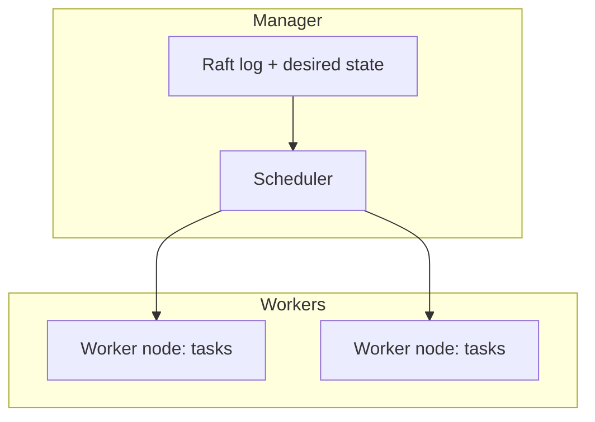
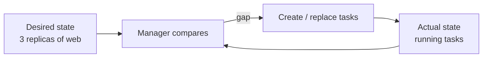
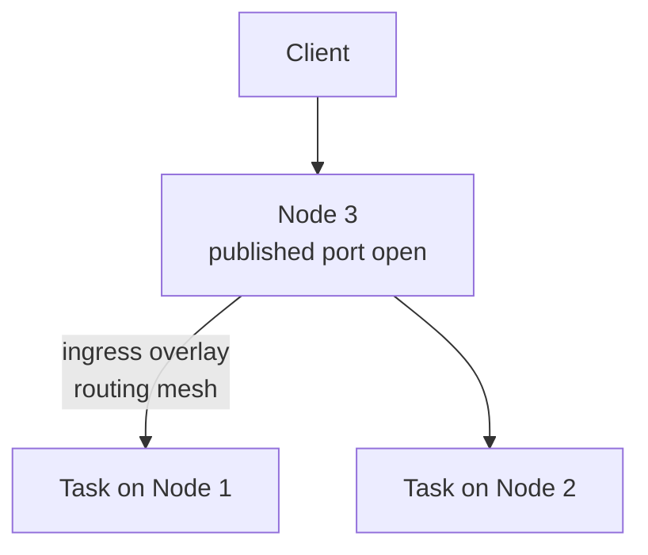
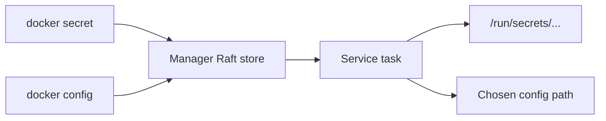

# Chapter 09 — Introduction to Docker Swarm

> **Learning Objectives**
>
> By the end of this chapter, you will be able to:
>
> - Say what orchestration means, and why one Docker host is not enough for a production system
> - Start a swarm and describe what managers do and what workers do
> - Create, scale, and update **services** instead of tending single containers by hand
> - Deploy a whole application as a **stack** from a Compose-shaped file
> - Explain how the **routing mesh** lets any node answer for a published service
> - Hand credentials and plain config files to services using Swarm **secrets** and **configs**
> - Place Swarm honestly next to Kubernetes, which the rest of this book covers

---

## 09.1 From chef to restaurant chain

So far you have been a chef in one kitchen. You know every pan, and every pan is a container. You start it, watch it, and restart it when it fails. That works for one kitchen.


*Figure 09.A: Managers plan; workers cook—the chain keeps serving if one kitchen stalls.*

Now open a restaurant chain: ten kitchens and hundreds of dishes. You need a *head office*. You tell it "every location serves the daily special, five stations running at all times," and it makes that true. It hires, moves people around, and replaces anyone who calls in sick. You never fly out.

That head office is an **orchestrator** — software that runs containers across many machines on your behalf. You stop saying "start this container here." You start declaring **desired state**, meaning the end result you want, such as "run five copies of this service somewhere sensible." The orchestrator keeps comparing reality against your declaration and fixes any difference it finds.

Docker Swarm is Docker's built-in orchestrator. It still matters in a Kubernetes world, for two reasons. It is the gentlest way into orchestration, because it already ships inside Docker. And every idea here — desired state, services, replicas, load balancing at the front door — comes back in Kubernetes wearing different clothes.

---

## 09.2 Nodes: managers and workers

### In plain terms

A **swarm** is a group of Docker Engines that act as one cluster. Each machine in the group is a **node**.

You should care about the two node roles because they decide what happens when a machine dies. **Managers** hold the brain: they store the desired state — the declarations of what should be running — and decide where the work goes. **Workers** are the hands: they run whatever the managers assign them. A manager is also a worker by default, which is why one machine can be a complete one-node swarm. It plans and it cooks.

That is the head-office and branch pattern from the opening story, made real. As you grow, you add managers to protect the brain and workers to add capacity for the hands. Those two needs grow independently of each other.

> ⚠️ **Common Pitfall:** You might reason "more managers means more resilience, so I'll run two." Two managers are strictly *worse* than one. Managers agree with each other using **Raft**, an algorithm that requires a majority of them — a **quorum** — before any decision counts. With two managers, the majority is still two. Lose either one and the survivor can decide nothing, which freezes every change to the cluster. Manager counts must be **odd**: 1, 3, or 5.

### Under the hood

Here is what each role actually does on the machine:

- **Managers** store desired state in a replicated **Raft** log, schedule work, and expose the Swarm API. Use an **odd** count (1, 3, or 5) so managers can keep quorum if one fails.
- **Workers** run the containers managers assign. Managers are workers by default, which is why a one-node swarm still runs workloads.

```bash
$ docker swarm init
Swarm initialized: current node (dxn1zf6l61qsb1josjja83ngz) is now a manager.

To add a worker to this swarm, run the following command:

    docker swarm join --token SWMTKN-1-... 192.168.65.3:2377
```

```bash
$ docker node ls
ID                            HOSTNAME   STATUS    AVAILABILITY   MANAGER STATUS   ENGINE VERSION
dxn1zf6l61qsb1josjja83ngz *   node-1     Ready     Active         Leader           29.0.0
9j68exjopxe7wfl6yuxml7a7j     node-2     Ready     Active                          29.0.0
b30lbji2z8yq2v9uwvuklk1ig     node-3     Ready     Active                          29.0.0
```

A one-node swarm is a perfectly good classroom.

**What breaks if X:** the join tokens printed by `docker swarm init` are effectively cluster credentials. The worker token lets any machine that has it enroll as a worker; the separate manager token (from `docker swarm join-token manager`) enrolls a machine into the *control plane*. Leak the manager token and an attacker can join a node that reads and writes desired state and the Raft store. Rotate with `docker swarm join-token --rotate` if one is exposed.



*Figure 09.1: Managers store desired state and schedule work; workers run the assigned tasks.*

### In production

Never run an even number of managers "for luck." Two managers are *worse* than one: lose either and the survivor has no majority, which freezes every cluster change. Plan your manager count and your join tokens as carefully as you will later plan etcd members in Kubernetes.

**Who owns this:** the platform/on-call team owns the manager count, quorum health, who holds the join tokens, and manager backups. **Failure mode and detection:** the frightening one is *quorum loss*. You drop below a majority of managers — say two of three managers are down — and the cluster freezes. Existing tasks keep running, but you cannot deploy, scale, or heal anything until the majority is back. Watch for unreachable managers in `docker node ls`, and treat manager availability as a signal you alert on. **Do** run 3 or 5 managers spread across separate failure domains, back up the Raft store, and guard the manager token; **don't** run 2 or 4 managers, and don't put all managers on one host or in one rack.

**Before you leave this section**

- **Understand:** managers hold desired state in a Raft log and need an odd count for quorum; workers just run assigned tasks; a manager is a worker by default.
- **Try:** `docker swarm init`, inspect with `docker node ls`, and read both the worker and `docker swarm join-token manager` outputs.
- **Watch in prod:** quorum loss from even/insufficient manager counts, and leaked join tokens (especially the manager token).

---

## 09.3 Services: declaring instead of commanding

### In plain terms

A **service** is a declaration: this image, this many copies, these ports. You hand it to a manager, and the manager keeps it true.

You should care because this takes you out of the loop as the person who restarts dead containers. With `docker run` you issue one command and own everything that follows. If the container dies, it stays dead until you notice and act. With a service you declare an end state — "three copies of `nginx:1.27`, port 8080 published" — and give the manager a standing order to make reality match that declaration, forever.

The manager splits the service into **tasks**. One task is one container running on one node. It then runs a **reconciliation loop**, which simply means it keeps comparing what should be running to what is running and closes any gap. That shift from giving commands to declaring an end state is what every orchestrator is built on.

> 💡 **In one line:** A **service** is what you declare — one image, N replicas. A **task** is one running container filling one of those replica slots. You manage the service, and Swarm manages the tasks.

> ⚠️ **Common Pitfall:** You might expect three replicas of Postgres to give you a highly available database. They give you three *separate* databases that share nothing. A replica count multiplies processes; it does not cluster data. A stateful app needs its own replication design, and Swarm will faithfully keep three separate databases running as their contents drift apart.

### Under the hood

Here is what actually happens on the machine:

```bash
$ docker service create --name web --replicas 3 -p 8080:80 nginx:1.27
k0v5nxf8dmb3xrsuah4h1exmn
overall progress: 3 out of 3 tasks
verify: Service k0v5nxf8dmb3 converged

$ docker service ls
ID             NAME      MODE         REPLICAS   IMAGE        PORTS
k0v5nxf8dmb3   web       replicated   3/3        nginx:1.27   *:8080->80/tcp

$ docker service ps web
ID             NAME      IMAGE        NODE      DESIRED STATE   CURRENT STATE
xtvyzu1blhbn   web.1     nginx:1.27   node-1    Running         Running 40 seconds ago
qm2b6v3xn0d7   web.2     nginx:1.27   node-2    Running         Running 40 seconds ago
p9r0wl4hd82f   web.3     nginx:1.27   node-3    Running         Running 40 seconds ago
```

Kill one container by hand and watch healing:

```bash
$ docker service ps web
ID             NAME        IMAGE        NODE     DESIRED STATE  CURRENT STATE
xtvyzu1blhbn   web.1       nginx:1.27   node-1   Running        Running 5 minutes ago
w1kdrl8mp3c9   web.2       nginx:1.27   node-2   Running        Running 11 seconds ago
qm2b6v3xn0d7    \_ web.2   nginx:1.27   node-2   Shutdown       Failed 16 seconds ago
p9r0wl4hd82f   web.3       nginx:1.27   node-3   Running        Running 5 minutes ago
```

Nobody restarted anything. Reality (2 replicas) no longer matched the declaration (3); the manager fixed it. That **reconciliation loop** is the heart of every orchestrator, including Kubernetes.



*Figure 09.2: Swarm continuously reconciles declared replica counts with running tasks.*

```bash
$ docker service scale web=6
$ docker service update --image nginx:1.28 --update-parallelism 2 --update-delay 10s web
```

The update performs a **rolling update**: replace tasks in batches so the service never goes fully dark. Use `--rollback` if the new version misbehaves. **What breaks if X:** without `--update-parallelism`/`--update-delay` tuned, an aggressive rollout can replace too many tasks at once and briefly drop capacity below what your traffic needs; and without a health check on the service, Swarm considers a task "up" as soon as the container starts, so a rolling update can happily roll out a broken image that starts but never serves.

### In production

`docker run` still works on a swarm node, but it creates an **unmanaged** container: nothing heals it, nothing scales it. If you want the cluster to look after a workload, it must be a service, or a stack that creates services. Handle replicated *stateful* apps carefully. Three Postgres replicas are three separate databases unless you design the clustering yourself.

**Who owns this:** the app team owns the service definition — image, replicas, update strategy, health check. The platform team owns cluster capacity and placement. **Failure mode and detection:** two failures recur. First, a rolling update ships a bad image because nothing checks health along the way. You will see tasks flapping in `docker service ps <svc>`, read the reason in `docker service logs`, and recover with `docker service rollback`. Second, a stray `docker run` on a swarm node leaves an unmanaged container that never heals and quietly competes for host resources. Find those by comparing `docker service ps` (managed tasks) with `docker ps` (every container). **Do** attach health checks, tune `--update-parallelism` and `--update-delay`, and keep every workload as a service; **don't** start containers by hand on swarm nodes, and don't scale a stateful service expecting free high availability.

**Before you leave this section**

- **Understand:** services declare desired state; the reconciliation loop turns replicas into tasks and continuously heals drift; replica count ≠ data clustering.
- **Try:** create a 3-replica service, force-kill one task's container, and watch `docker service ps` recreate it with no manual action.
- **Watch in prod:** health-less rolling updates shipping broken images, and unmanaged `docker run` containers on swarm nodes.

---

## 09.4 The routing mesh

### In plain terms

The **routing mesh** is the part of Swarm that opens a published port on *every* node and forwards each request to a healthy copy of the service, wherever that copy runs.

You need this so callers never have to track where containers are. On a single host, a published port lives on the one machine running the container. If the container moves, clients have to be told where it went. In a cluster, tasks move between nodes as machines fail and work rebalances, and you do not want your load balancer chasing the scheduler around.

The mesh breaks that link on purpose. Traffic can arrive at any node, and that node forwards it to a healthy copy running anywhere in the cluster. Your external load balancer points at all the node addresses and never needs to know which node holds which task.

> ⚠️ **Common Pitfall:** You might see the published port open on a node and conclude a task is running *there*. Not so — the mesh opens the port on **every** node, including nodes with zero replicas of that service. A node answering on `:8080` tells you nothing about where the container actually lives.

### Under the hood

Here is what actually happens on the machine. Publishing uses the **routing mesh** (ingress mode) over the built-in `ingress` overlay network:

```bash
$ curl -s -o /dev/null -w "%{http_code}\n" http://node-3:8080
200
```

Even if `node-3` runs zero `web` tasks, it answers and forwards.



*Figure 09.3: The routing mesh opens the published port on every node and forwards to healthy replicas wherever they run.*

| | Single-host `-p` (Chapter 06) | Swarm routing mesh |
|---|---|---|
| Port opens on | The one host | Every swarm node |
| Load balancing | None (one container) | Across replicas |
| Container moves | Mapping context breaks | Traffic follows |
| Backing network | Host bridge | `ingress` overlay |

Opt out with `--publish mode=host` when you need host-mode binding (performance or source-IP preservation). The mesh is the default and the right starting point.

Internally, services on a shared overlay also get DNS names and a virtual IP — `api` can call `http://db:5432` as in Compose, even when `db` spans machines. **What breaks if X:** the ingress routing mesh relies on the `ingress` overlay and its ports (2377/tcp, 7946/tcp+udp, 4789/udp) being open between nodes; block them and published ports appear open per node but forwarding to remote tasks silently fails. Also, because mesh ingress load-balances at L3/L4 and hides the client behind the mesh, source IPs are not preserved — apps that need the real client IP must use `--publish mode=host`.

### In production

Point external load balancers at a pool of node IPs and stop tracking where the scheduler placed anything. Remember one thing: a listening port on a node does **not** mean the workload is running there.

**Who owns this:** the platform team owns the pool of node addresses the external load balancer targets, plus the between-node firewall rules the mesh needs. The app team picks ingress mode or `mode=host` publishing for each service. **Failure mode and detection:** a common incident is health-checking one node and declaring the service down (or up), because the mesh hides the health of individual tasks. Read real task placement and health from `docker service ps` instead of trusting a port probe. Another is expecting real client IP addresses in your logs and getting mesh addresses instead. **Do** point the load balancer at all node IPs, open the mesh ports, and use `mode=host` when you need the real client IP or a per-node binding; **don't** guess where a task runs from an open published port.

**Before you leave this section**

- **Understand:** ingress mode opens the published port on every node and forwards over the `ingress` overlay to a healthy replica anywhere; placement is decoupled from where traffic lands.
- **Try:** publish a 3-replica service, `curl` a node you know runs zero replicas, and confirm it still answers.
- **Watch in prod:** blocked mesh ports black-holing cross-node forwarding, and lost client source IPs under ingress mode.

---

## 09.5 Secrets and configs

### In plain terms

A **secret** is a sensitive value — a password, a TLS key — that the cluster hands to a task as an in-memory file. A **config** is the same idea for a file that is not sensitive, such as an nginx site config, a feature flag list, or a static JSON file.

Both exist to keep environment-specific material out of your images. Bake a password or a site config into an image and that image becomes environment-specific, becomes sensitive, and has to be rebuilt to change one value. You want none of those three things. Swarm turns it around. The image ships generic, and the cluster injects the right file into each task as it starts, with no host paths to copy onto every node.

The two objects use nearly the same commands. What differs is intent and handling. Secrets carry material that would hurt if it leaked, and they arrive on a tmpfs-style path under `/run/secrets/`. Configs carry ordinary files that you simply do not want baked into the image, and they arrive as regular files at a path you pick.

> ⚠️ **Common Pitfall:** You might put a password in a **config** because "it's basically the same mechanism and it works." Configs are not intended as secret-grade protection for the payload — use `docker secret` for anything confidential. Choosing the object by convenience instead of sensitivity is exactly how credentials end up in the wrong, less-protected place.

### Under the hood

Here is what actually happens on the machine when you create each object and attach it to a service.

**Secrets** (encrypted at rest in the managers' Raft store; mounted under `/run/secrets/` via a tmpfs-style path):

```bash
$ echo -n "s3cr3t-db-pass" | docker secret create db_password -
u7xkbq2v0e8zr7cwp4kn1fa9m

$ docker service create --name db \
    --secret db_password \
    -e POSTGRES_PASSWORD_FILE=/run/secrets/db_password \
    postgres:16
```

Well-built images accept `*_FILE` variants so they read from secret files instead of the environment.

**Configs** (similar API, **not** encrypted at rest the way secrets are; mounted as regular files — default `/<config-name>` on Linux):

```bash
$ cat > site.conf <<'EOF'
server {
    listen 80;
    server_name tasks.example.com;
    location / {
        proxy_pass http://api:8000;
    }
}
EOF

$ docker config create site.conf site.conf
dg426haahpi5ezmkkj5kyl3sn

$ docker service create --name edge \
    --config source=site.conf,target=/etc/nginx/conf.d/site.conf,mode=0440 \
    -p 8080:80 \
    nginx:1.27
```

| | Secrets | Configs |
|---|---------|---------|
| Intended data | Sensitive credentials, keys | Non-sensitive configuration files |
| At rest on managers | Stored in Raft (treat as sensitive path) | Stored in Raft; **not** secret-grade encryption of payload intent |
| In the task | File under `/run/secrets/` (tmpfs-style) | File in container filesystem at chosen target |
| Typical consumers | Databases, TLS material | nginx/redis config, app JSON, banners |

Combine them: secrets for keys and passwords, configs for everything else that should not force an image rebuild.



*Figure 09.4: Secrets and configs inject files into tasks without baking content into the image.*

> ⚠️ **Warning:** Do not put passwords in configs because "it's almost like a secret." Use `docker secret` for anything that would hurt if logged or copied casually. Chapter 10 deepens secrets hygiene; Kubernetes ConfigMaps/Secrets (Chapter 17) echo the same split.

### In production

To rotate a value, create a new secret or config, update the service to point at it, and remove the old object once every task has switched over. Never bake production credentials into an image. On single-host Compose, the `secrets:` and `configs:` keys are a reasonable *development* stand-in and are often backed by plain files. Swarm's Raft-backed delivery is the cluster-grade version.

**Who owns this:** the platform/security team owns creating secrets, how often they rotate, and the consequence that secrets live in the managers' Raft store — which makes manager hosts and their backups sensitive assets. **Failure mode and detection:** Swarm secrets are **immutable**, meaning you cannot change one in place. So rotation means creating a new secret object, updating services to point at it, and removing the old one after every task has switched over. Trying to edit a secret in place, or deleting the old secret too early, breaks running tasks. Find stale references with `docker service inspect`, and confirm every task has switched with `docker service ps` before you delete the old object. **Do** rotate by add-new, update, then remove-old, and treat manager nodes and Raft backups as if they hold the secrets themselves — because they do; **don't** log secret values, bake them into images, or put credentials in configs.

> 🏭 **Production floor:** Swarm secrets are cluster credentials at rest in the managers' Raft log and mounted into tasks under `/run/secrets/`. That makes every manager node, its disk, and its Raft backups sensitive — a compromised manager or an unencrypted backup is a secret leak. Change-manage secret rotation (create new → update services → verify convergence → remove old), restrict who can run `docker secret`/reach the manager API, guard the manager join token, and never demote a manager or copy its state to a less-trusted host without accounting for the secrets it carries.

**Before you leave this section**

- **Understand:** secrets (sensitive, `/run/secrets/`, Raft-backed) and configs (non-sensitive files) both keep images generic; choose by sensitivity, not convenience.
- **Try:** create a secret and a config, attach both to a one-replica service, `docker exec` in, and confirm the secret is under `/run/secrets/` and absent from `env`.
- **Watch in prod:** credentials placed in configs, secret material in image layers or logs, and rotation that removes the old secret before tasks converge.

---

## 09.6 Stacks: Compose files meet the cluster

### In plain terms

A **stack** is a whole application deployed to the swarm from one Compose-shaped file.

You want this because creating services one `docker service create` at a time brings back the exact problem Compose solved. Typing a command per component means nothing is written down, nothing is reviewed, and the real cluster slowly drifts away from what anyone remembers.

A stack is the Chapter 08 habit pointed at a cluster instead of one host. You write one file, add a `deploy:` section to each service, and hand the file to `docker stack deploy`. The cluster then makes the whole application match what the file says. It is Compose's "one file describes the system" promise, now backed by Swarm's scheduling, healing, and rolling updates.

> 💡 **In one line:** A **stack** is one file describing every service of an application, deployed to the cluster with a single command — Compose's habit with Swarm's muscle behind it.

> ⚠️ **Common Pitfall:** You might copy a Chapter 08 `compose.yaml` that has a `build:` key straight into `docker stack deploy` and expect it to build the image. Stacks do **not** build images. They schedule images that already exist, by name. Build and push to a registry first, then reference the result with `image:`. A `build:` key is ignored, or errors, at stack-deploy time.

### Under the hood

Here is what a stack file actually looks like:

```yaml
# stack.yaml
services:
  api:
    image: registry.example.com/task-api:1.2.0
    ports:
      - "8000:8000"
    networks:
      - backend
    configs:
      - source: api_settings
        target: /etc/task-api/settings.json
        mode: 0444
    secrets:
      - db_password
    environment:
      DATABASE_PASSWORD_FILE: /run/secrets/db_password
    deploy:
      replicas: 3
      update_config:
        parallelism: 1
        delay: 10s
      restart_policy:
        condition: on-failure

  db:
    image: postgres:16
    environment:
      POSTGRES_PASSWORD_FILE: /run/secrets/db_password
    secrets:
      - db_password
    volumes:
      - db-data:/var/lib/postgresql/data
    networks:
      - backend
    deploy:
      replicas: 1
      placement:
        constraints:
          - node.role == worker

networks:
  backend:
    driver: overlay

volumes:
  db-data:

secrets:
  db_password:
    external: true

configs:
  api_settings:
    external: true
```

Versus Chapter 08:

1. The `deploy:` section (replicas, update strategy, restart, placement) — plain `docker compose up` largely ignores Swarm-only deploy semantics; Swarm honors them.
2. **`image:` everywhere** — stacks do not `build:`; build and push to a registry first.
3. **`secrets:` and `configs:`** — create them on the swarm (`docker secret create`, `docker config create`) when marked `external: true`, or define file-based sources as the platform supports.

```bash
$ echo -n "prodsecret" | docker secret create db_password -
$ echo '{"log_level":"info"}' | docker config create api_settings -
$ docker stack deploy -c stack.yaml tasks
Creating network tasks_backend
Creating service tasks_api
Creating service tasks_db

$ docker stack services tasks
ID             NAME        MODE         REPLICAS   IMAGE                                  PORTS
u2m3hxlqv0e8   tasks_api   replicated   3/3        registry.example.com/task-api:1.2.0    *:8000->8000/tcp
zr7cwp4kn1fa   tasks_db    replicated   1/1        postgres:16

$ docker stack rm tasks
```

### Swarm and Kubernetes, honestly

Swarm ships inside Docker, reuses Compose-shaped files, and can be learned in an afternoon. The industry consolidated around Kubernetes for production orchestration — larger ecosystem, managed offerings, operators. Learn Swarm as a conceptual on-ramp; invest production depth in Kubernetes starting in Chapter 11.

| | Docker Swarm | Kubernetes |
|---|---|---|
| Setup | One command, built into Docker | Cluster install or managed service |
| Learning curve | Gentle | Steep |
| App definition | Compose/stack file | Manifests (Pods, Deployments, Services…) |
| Ecosystem | Modest, maintenance-mode | Enormous, industry standard |
| Sweet spot | Small clusters, learning | Production at serious scale |

### In production

Use a stack, not one-off `service create` commands, for anything you will come back to. Keep your images in a registry. Treat Swarm as a teaching tool and a niche production choice unless your organization deliberately standardized on it.

**Who owns this:** the app team owns the stack file — images, `deploy:`, and the secret and config references — as source code in version control. The platform team owns the registry and the external objects, because any secret or config marked `external: true` must already exist on the swarm. **Failure mode and detection:** a stack that references an `external: true` secret or config nobody created never finishes deploying. You will see tasks stuck in `Rejected` or `Preparing` in `docker stack ps <stack>`, with the reason in the error column. A quieter version is an `image:` tag the nodes cannot pull, usually a private registry with no credentials — same symptom, different cause. **Do** create external secrets and configs before you deploy, pin images by digest in a registry every node can reach, and keep stack files in Git; **don't** run long-lived apps from one-off `service create` commands.

**Before you leave this section**

- **Understand:** a stack deploys a Compose-shaped file to the cluster with `deploy:` honored, `image:` (not `build:`), and Swarm `secrets`/`configs`.
- **Try:** create an external secret and config, `docker stack deploy -c stack.yaml tasks`, and inspect with `docker stack services tasks`.
- **Watch in prod:** stacks referencing missing external secrets/configs or unpullable images, leaving tasks stuck before convergence.

---

## 09.7 Common pitfalls

1. **Forgetting Swarm mode.** `docker run` creates unmanaged containers.
2. **Even number of managers.** Use 1, 3, or 5.
3. **Expecting `build:` in stacks.** Build and push first; reference `image:`.
4. **Confusing `docker service ps` with `docker ps`.** Cluster tasks vs local containers.
5. **Scaling stateful services casually.** Replicas are not automatic clustering.
6. **Assuming a published port means a local task.** The routing mesh forwards.
7. **Putting secrets in configs.** Use the right object for sensitivity.

---

## 09.8 Hands-on exercises

1. **Become a cluster.** `docker swarm init`, then inspect with `docker node ls` and `docker info` (`Swarm: active`).
2. **Self-healing.** Create `web` with 3 replicas, force-remove one container, watch `docker service ps web` replace it.
3. **Scale and roll.** Scale to 5; rolling-update the image with `--update-parallelism 1 --update-delay 15s`.
4. **Secret and config.** Create a secret and a config; attach both to a one-replica nginx or alpine service; `docker exec` into the task and confirm mount paths and that the secret is not in `env`.
5. **Deploy a stack.** Adapt the Task API into a stack (registry image, `deploy:`, external secret/config), deploy, inspect with `docker stack services`.
6. **Clean up.** Remove stack/services, then `docker swarm leave --force` on a one-node lab.

---

## 09.9 Check Your Understanding

**Q1.** What does "declarative desired state" mean, and how does it differ from `docker run`?

<details>
<summary>Show answer</summary>

With `docker run` you issue imperative commands; if the container dies, nothing brings it back. With a service you declare an end state ("3 replicas of nginx:1.27") and the swarm's reconciliation loop perpetually closes any gap between reality and that declaration.

</details>

**Q2.** Why should a production swarm run 3 or 5 managers rather than 2 or 4?

<details>
<summary>Show answer</summary>

Managers use Raft consensus, which needs a strict majority (quorum). An odd count maximizes failure tolerance: 3 managers tolerate 1 loss; 5 tolerate 2. With 2 managers, losing one leaves no majority.

</details>

**Q3.** A request hits node C on a published port, but all service containers run on A and B. What happens?

<details>
<summary>Show answer</summary>

The routing mesh answers. The port is open on every node; C accepts the connection and forwards it over the `ingress` overlay to a healthy task on A or B.

</details>

**Q4.** How do Swarm secrets and configs differ, and when do you use each?

<details>
<summary>Show answer</summary>

Both inject files into service tasks without baking content into the image. Secrets are for sensitive material (passwords, keys) and are delivered under `/run/secrets/` with secret-oriented handling. Configs are for non-sensitive configuration files mounted at a chosen path. Use secrets for anything confidential; use configs for ordinary settings that should still stay out of the image.

</details>

**Q5.** How does a stack file differ from the Compose file in Chapter 08?

<details>
<summary>Show answer</summary>

Same general Compose shape, but stacks honor `deploy:` (replicas, updates, placement), cannot rely on `build:` (prebuilt registry images), and commonly wire Swarm `secrets` and `configs` for cluster-wide injection.

</details>

---

## 09.10 Key takeaways

- You stop giving commands and start declaring the end state. A loop keeps reality matching it.
- A swarm is many Docker Engines acting as one cluster. **Managers** decide, **workers** run the work.
- Managers need an **odd** count: 1, 3, or 5. Two managers are worse than one.
- **Service** = what you declared. **Task** = one container filling one replica slot. **Stack** = every service of an app in one file.
- Three Postgres replicas are three separate databases. Replicas multiply processes, not data.
- The **routing mesh** opens a published port on every node, so an open port tells you nothing about where the container runs.
- **Secrets** for anything sensitive, **configs** for plain files. Both keep the image generic. Never put a password in a config.
- Stacks do not build. Push the image first, then reference it with `image:`.
- Swarm is the friendliest classroom for orchestration. Kubernetes is where production went, and every idea here carries over.

---

## 09.11 Official documentation map

| Topic | Official page |
|-------|---------------|
| Swarm mode overview | [Swarm mode](https://docs.docker.com/engine/swarm/) |
| Administer a swarm | [Administer and maintain a swarm](https://docs.docker.com/engine/swarm/admin_guide/) |
| Deploy services | [Deploy services to a swarm](https://docs.docker.com/engine/swarm/services/) |
| Swarm networking / routing mesh | [Use overlay networks](https://docs.docker.com/engine/network/drivers/overlay/) |
| Stacks | [Deploy a stack to a swarm](https://docs.docker.com/engine/swarm/stack-deploy/) |
| Secrets | [Manage sensitive data with Docker secrets](https://docs.docker.com/engine/swarm/secrets/) |
| Configs | [Store configuration data using Docker configs](https://docs.docker.com/engine/swarm/configs/) |
| `docker service` CLI | [docker service](https://docs.docker.com/reference/cli/docker/service/) |
| `docker stack` CLI | [docker stack](https://docs.docker.com/reference/cli/docker/stack/) |

**Previous:** [Chapter 08 — Docker Compose](08-docker-compose.md) | **Next:** [Chapter 10 — Docker Security Basics](10-docker-security-basics.md)
