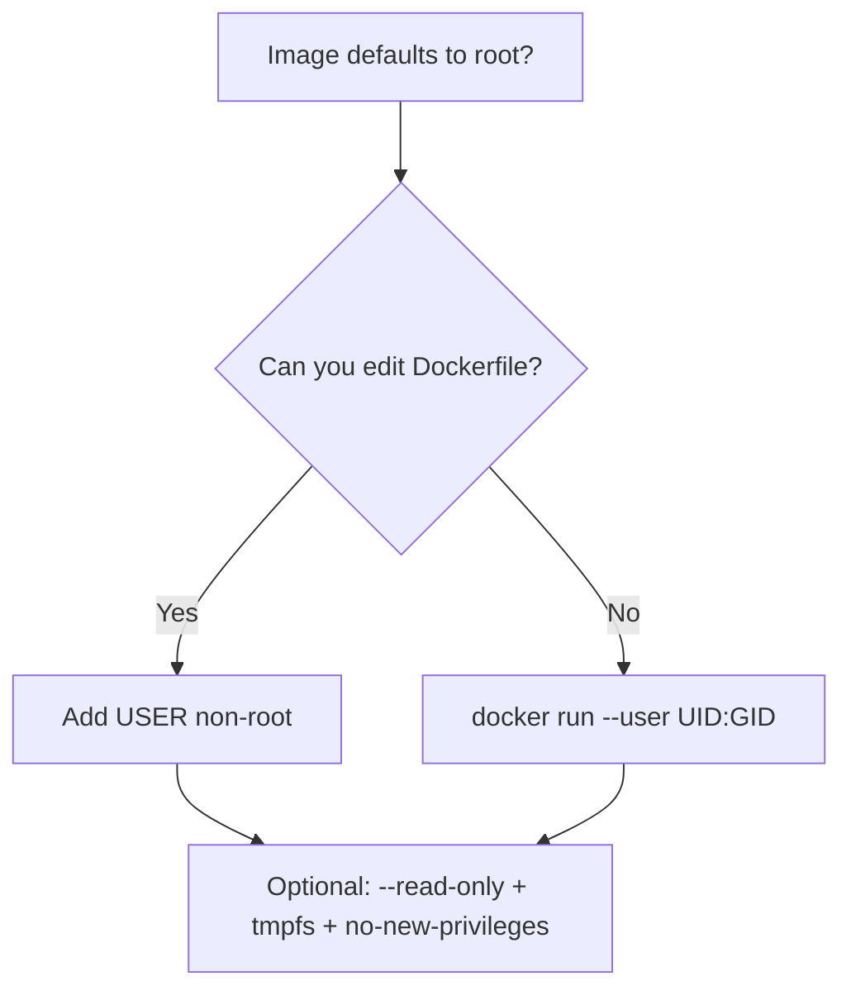
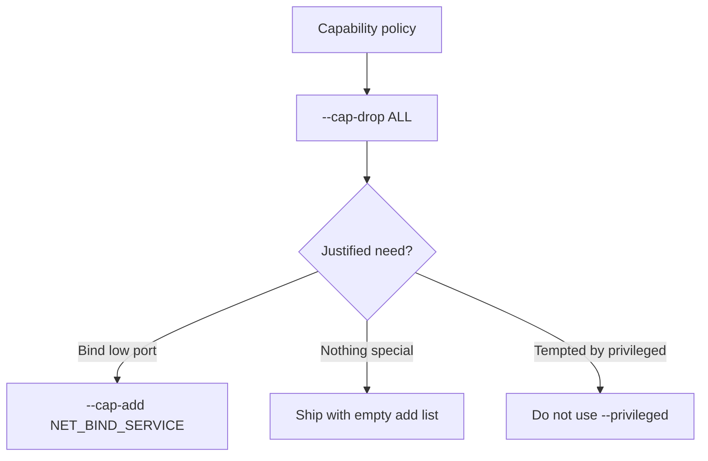
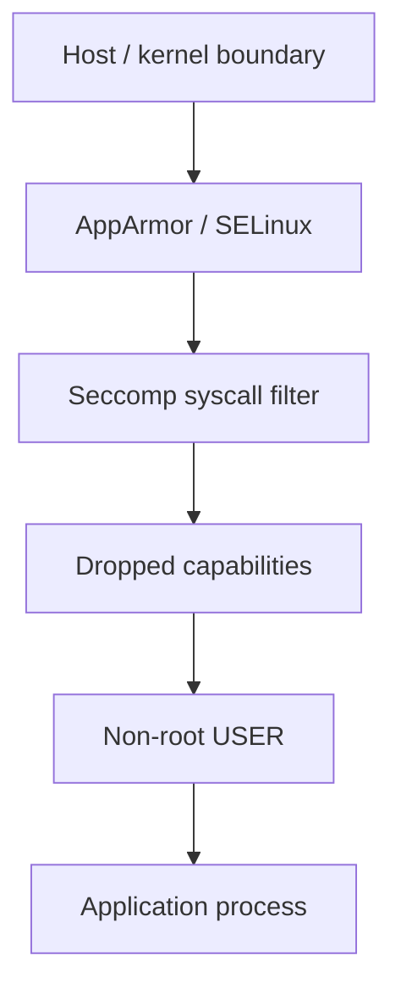
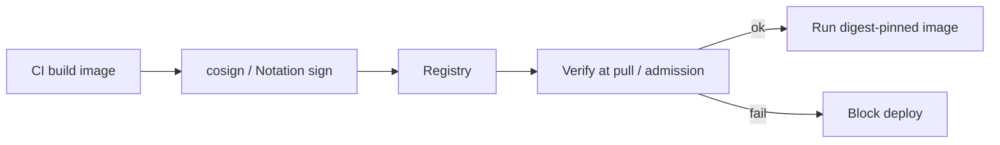
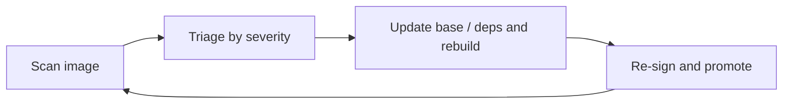

# Chapter 10 — Docker Security Basics

> **Learning Objectives**
>
> By the end of this chapter, you will be able to:
>
> - Explain Docker's security model and why "containers contain" is only as true as your configuration
> - Run containers as non-root users and explain why this habit matters most
> - Drop Linux capabilities to shrink what a containerized process may do
> - Describe how seccomp and AppArmor profiles restrict system calls and file/network access
> - Explain image signing: Docker Content Trust deprecation and modern tools (cosign, Notation)
> - Manage secrets without baking them into images or plain environment variables
> - Scan images for known vulnerabilities and act on the results
> - Recognize where this chapter stops and where Chapter 26 continues (Hardened Images and supply chain)

---

## 10.1 The hotel room

A container is like a hotel room. Guests (processes) get their own space and cannot casually wander into other rooms. Hotel security still depends on management decisions: Do room keys open maintenance corridors? Is the master key at the front desk? Do you check IDs at check-in?


*Figure 10.A: Guests get a keycard, not the master key—containers should not run as root by default.*

Namespaces and cgroups are the room walls. This chapter is about management decisions: what powers a guest checks in with, which master keys it can touch, and how you verify the guest is who they claim to be.

The guiding principle is **least privilege**: every permission a container does not have is an attack that fails automatically. Sobering fact: a process running as root *inside* a container is root *as far as the kernel is concerned*. The container boundary is strong but not magical — if it is breached, in-container root becomes host root. So we layer defenses.

> 💡 **Tip:** This chapter covers host-and-engine hardening you can apply today. **Chapter 26** goes deeper on **Docker Hardened Images**, attestations, SBOMs, and end-to-end supply-chain policy — treat that chapter as the sequel when you harden *what* you pull as carefully as *how* you run it.

---

## 10.2 Don't run as root

### In plain terms

Most images default to root. That is convenient and dangerous. Create an unprivileged user in the Dockerfile (best) or override the user at run time (for images you do not control).

### Under the hood

```bash
$ docker run --rm alpine:3.20 whoami
root
```

**In the Dockerfile:**

```dockerfile
FROM python:3.12-slim
RUN groupadd --gid 1001 app && useradd --uid 1001 --gid app --create-home app
WORKDIR /app
COPY --chown=app:app . .
USER app
CMD ["gunicorn", "--bind", "0.0.0.0:8000", "app:app"]
```

**At run time:**

```bash
$ docker run --rm --user 1001:1001 alpine:3.20 whoami
```

(Odd `whoami` output only means UID 1001 has no `/etc/passwd` entry — the process is still unprivileged.)

Cheap hardening pair:

```bash
$ docker run -d \
    --read-only \
    --tmpfs /tmp \
    --security-opt no-new-privileges \
    task-api:0.1.0
```

`--read-only` makes the container filesystem immutable (tmpfs for scratch). `no-new-privileges` blocks gaining privileges via setuid binaries. Deeper options: **`userns-remap`** and **rootless Docker** map even "root in the container" to an unprivileged host user — remember from Chapter 07 that **userns-remap is incompatible with the containerd image store**.

### In production

Require `USER` in every Dockerfile your team owns. Gate CI on "runs as non-root." Prefer rootless Engine where the platform supports your workload. Never treat Docker group membership lightly — it is effectively root-equivalent on the host.



*Figure 10.1: Prefer baking non-root into the image; override at run time when you must consume someone else's image.*

---

## 10.3 Capabilities: root, sliced thin

### In plain terms

Linux split root's power into discrete **capabilities** — bind low ports, change ownership, craft raw packets, and so on. Docker starts containers with a trimmed default set. Least privilege says: drop everything, add back only what you can justify.

### Under the hood

```bash
$ docker run -d \
    --cap-drop ALL \
    --cap-add NET_BIND_SERVICE \
    -p 80:80 \
    nginx:1.27
```

```bash
$ docker run --rm --cap-drop ALL alpine:3.20 ping -c 1 8.8.8.8
PING 8.8.8.8 (8.8.8.8): 56 data bytes
ping: permission denied (are you root?)
```

`ping` needs `NET_RAW`; dropping it shrinks the attack surface.

`--privileged` grants *all* capabilities plus device access and disables several confinements. Treat it as "this container owns the host."

| Flag | Effect | When |
|------|--------|------|
| (default) | ~12 capabilities | Everyday, not ideal |
| `--cap-drop ALL --cap-add X` | Exactly what you list | Production target |
| `--privileged` | Everything, weak confinement | Almost never |

### In production

Document every `--cap-add`. Prefer fixing volume ownership or listening on high ports over granting `SYS_ADMIN`. Ban `--privileged` in production policy except for carefully reviewed host tools.



*Figure 10.2: Drop everything, then add back only capabilities you can document.*

---

## 10.4 Seccomp and AppArmor

### In plain terms

Capabilities control *what a process is allowed to be*. **Seccomp** and **AppArmor** (or SELinux) control *what it may say to the kernel* and *which resources it may touch*.

### Under the hood

**Seccomp** filters **system calls**. Docker's default profile blocks a dangerous subset (including notorious calls such as unrestricted `mount` and kernel-tampering syscalls). Supply a stricter custom profile when needed:

```bash
$ docker run -d --security-opt seccomp=./my-profile.json task-api:0.1.0
```

Never casually disable it:

```bash
$ docker run -d --security-opt seccomp=unconfined task-api:0.1.0   # avoid in real service runs
```

**AppArmor** (Ubuntu/Debian; SELinux on Fedora/RHEL) is mandatory access control for files, paths, and network operations. Docker loads `docker-default` where AppArmor exists:

```bash
$ docker run -d --security-opt apparmor=my-nginx-profile nginx:1.27
```

| | Seccomp | AppArmor |
|---|---------|----------|
| Restricts | Which syscalls may be made | Which resources (files, paths, network) may be accessed |
| Docker default | Yes | Yes (`docker-default`, where available) |
| Custom | `--security-opt seccomp=profile.json` | `--security-opt apparmor=profile-name` |



*Figure 10.3: Defense in depth — each layer independently shrinks what an attacker can do if an inner boundary fails.*

### In production

Keep defaults on — they are free protection. Invest in custom profiles for high-value or internet-exposed workloads. Never leave `unconfined` on after a debugging session.

---

## 10.5 Trusting what you run: signing

### In plain terms

Hardening *how* containers run is half the story. You also need confidence that `nginx:1.27` (or your Task API tag) is the authentic artifact the publisher built — not a tampered substitute.

### Under the hood

**Docker Content Trust (DCT)** was Docker's original answer: Notary v1 signatures, enabled with:

```bash
$ export DOCKER_CONTENT_TRUST=1
$ docker pull nginx:1.27
```

You will still meet DCT in older docs and policies. Know its trajectory: **DCT is deprecated and being retired.** Notary v1 stagnated; signed Official Images are moving off that path; the Notary service timeline ends the old trust model. **Do not build new verification workflows on `DOCKER_CONTENT_TRUST`.**

Modern successors:

- **Sigstore / cosign** — `cosign sign` / `cosign verify`, optional keyless signing tied to CI identities and a transparency log. Dominant in cloud-native ecosystems.
- **Notation (Notary Project v2)** — OCI-native signatures as artifacts beside the image; common in several enterprise and Azure-centric toolchains.

```bash
$ cosign sign registry.example.com/task-api:1.2.0
$ cosign verify --certificate-identity-regexp '.*' \
    --certificate-oidc-issuer https://token.actions.githubusercontent.com \
    registry.example.com/task-api:1.2.0
```

```text
Verification for registry.example.com/task-api:1.2.0 --
The following checks were performed on each of these signatures:
  - The cosign claims were validated
  - The signatures were verified against the specified public key
```

### In production

Enforce verification in CI and at admission time (Kubernetes admission later in the book). Prefer digest pins (`image@sha256:…`) alongside signatures. For Docker Hub base images and a maintained minimal, signed catalog, see **Docker Hardened Images** and the broader supply-chain story in **Chapter 26** — including provenance, SBOMs, and continuous rebuilds when CVEs land.

> 📘 **Deep Dive (optional):** Chapter 26 covers Hardened Images, SLSA-style provenance, SBOM consumption, and how signing fits a full supply-chain program. This chapter only needs you to stop investing in DCT and start with cosign or Notation.



*Figure 10.4: Modern signing verifies provenance at promotion time — prefer cosign or Notation over deprecated DCT.*

---

## 10.6 Secrets

### In plain terms

Do not bake passwords into images. Do not sprinkle them in plain `-e` flags if you can avoid it. Deliver secrets as files (or a dedicated secret store) to processes that need them.

### Under the hood

Anti-patterns:

1. **`ENV API_KEY=...` or copied secret files in the image** — anyone who pulls the image (or reads layer history) has the secret forever.
2. **Plain `-e` environment variables** — visible in `docker inspect`, `/proc/<pid>/environ`, crash dumps, and child processes.

**Swarm secrets** (Chapter 09): encrypted in the manager Raft log, mounted at `/run/secrets/<name>`:

```bash
$ echo -n "s3cr3t-db-pass" | docker secret create db_password -
$ docker service create --name db \
    --secret db_password \
    -e POSTGRES_PASSWORD_FILE=/run/secrets/db_password \
    postgres:16
```

Prefer `*_FILE` configuration knobs. On single-host Compose, the `secrets:` key is a reasonable **dev** approximation (often file-backed). For production beyond Swarm, use Kubernetes Secrets (Chapter 17) or dedicated managers (Vault, cloud secret stores).

### In production

Rotate credentials on a schedule. Never commit `.env` files with real secrets. Scrub CI logs. Treat "temporary" plaintext env vars as permanent once they hit shell history or orchestration manifests.

---

## 10.7 Scanning

### In plain terms

Your image is more than your code: base OS, system libraries, language packages — each with CVE history. **Scanning** inventories packages and matches them against vulnerability databases.

### Under the hood

Docker **Scout**, **Trivy**, and **Grype** are common tools:

```bash
$ docker scout cves task-api:1.2.0
```

```text
  Target       │  task-api:1.2.0
    platform   │  linux/amd64
    vulnerabilities │ 1C 3H 12M 25L
    packages   │ 184

   0C  1H  0M  0L  openssl 3.0.11
      ✗ HIGH CVE-2024-XXXX
        Fixed version  : 3.0.14
```

Act on results:

- **Update the base image first** — most findings live in the OS layer.
- **Prefer minimal bases** — `slim`, Alpine, distroless, or Hardened Images (Chapter 26) ship fewer packages and less noise.
- **Scan in CI** — fail builds on new criticals.
- **Triage** by severity and exploitability, not raw CVE count alone.

### In production

Scanning once is theater. New CVEs publish against *existing* images daily. Rebuild on a cadence, re-scan continuously, and track base-image freshness as an SLO-ish habit. Pair scanning with signing so you know *which* remediated artifact is allowed to run.



*Figure 10.5: Scanning is a loop — remediate, rebuild, re-sign, and scan again as CVEs land.*

---

## 10.8 Common pitfalls

1. **Shipping root by default** because the base image does. Add `USER`.
2. **Reaching for `--privileged` to "fix" permissions.** Find the specific capability or ownership issue.
3. **Leaving seccomp/AppArmor `unconfined` after debugging.**
4. **Secrets in Dockerfiles or committed `.env` files.**
5. **Building new policy on `DOCKER_CONTENT_TRUST=1`.** Use cosign or Notation; see Chapter 26 for Hardened Images / supply chain.
6. **Scanning once and declaring victory.**
7. **Trusting `latest` from unknown publishers.** Prefer official/verified images; pin tags or digests.

---

## 10.9 Hands-on exercises

1. **Find the root.** `docker run --rm nginx:1.27 whoami`, then wrap a base image with `USER app`, rebuild, confirm.
2. **Break ping, then fix it.** `--cap-drop ALL` fails `ping`; add exactly one `--cap-add` to restore it.
3. **Immutable filesystem.** `--read-only --tmpfs /tmp`; show writes fail elsewhere and succeed in `/tmp`.
4. **Inspect defenses.** `docker inspect --format '{{.HostConfig.SecurityOpt}} {{.HostConfig.CapDrop}}' <container>`.
5. **Scan and remediate.** Compare Scout/Trivy results for an old vs current slim Python tag; write one sentence on base-image policy.
6. **Secret delivery (Swarm).** Create a secret, attach to a service, confirm `/run/secrets/<name>` exists and is absent from `env`.

---

## 10.10 Check Your Understanding

**Q1.** Why is running containers as a non-root user considered the highest-value hardening step?

<details>
<summary>Show answer</summary>

Root inside a container is root to the kernel; isolation is the only barrier to the host. If that barrier fails — kernel bug, over-broad mount — in-container root becomes host compromise. An unprivileged user turns many breaches and in-container exploits into dead ends.

</details>

**Q2.** What is the difference between dropping capabilities and applying a seccomp profile?

<details>
<summary>Show answer</summary>

Capabilities remove slices of root's *privilege* (bind low ports, change ownership, raw sockets). Seccomp filters which *system calls* the process may invoke at all. They stack: a process with no special capabilities can still be blocked by seccomp from calling `mount`.

</details>

**Q3.** A teammate proposes enabling `DOCKER_CONTENT_TRUST=1` everywhere as new supply-chain policy. What do you tell them?

<details>
<summary>Show answer</summary>

DCT verifies Notary v1 signatures and is deprecated/retiring; Official Images are moving off that path. Keep the *goal* (verify provenance) but implement with Sigstore/cosign or Notation, ideally enforced by registry or admission policy. For maintained signed minimal bases and deeper supply-chain controls, continue in Chapter 26 (Hardened Images and related practices).

</details>

**Q4.** Why are Swarm secrets safer than `-e PASSWORD=...`?

<details>
<summary>Show answer</summary>

Environment variables leak via `docker inspect`, `/proc/<pid>/environ`, child processes, logs, and crash reports. Secrets are stored in the managers' Raft log, delivered only to authorized services, and mounted as in-memory-style files under `/run/secrets/` that never land in image layers.

</details>

**Q5.** Your scanner reports 40 vulnerabilities though application code has not changed in months. How is that possible, and what's the first fix?

<details>
<summary>Show answer</summary>

CVE databases grow daily against *existing* packages in your image. Most findings often live in the base OS layer, so rebuild on the latest patch of a minimal base (or adopt Hardened Images as discussed in Chapter 26), then re-scan.

</details>

---

## 10.11 Key takeaways

- Container security is **least privilege, layered**: each mechanism independently turns attack classes into failures.
- Run as **non-root**, add `--read-only` and `no-new-privileges` where you can, and avoid `--privileged`.
- **Drop all capabilities** and add back only what is justified; keep default **seccomp** and **AppArmor** on.
- Verify provenance with **modern signing** (cosign, Notation); treat **DCT as deprecated history**, not the future.
- Deliver credentials with **secrets** (`/run/secrets/`, `*_FILE`), never baked into images or casual env vars.
- **Scan continuously**, remediate via fresh minimal bases, and gate CI on critical findings.
- Continue in **Chapter 26** for **Docker Hardened Images**, attestations, SBOMs, and full supply-chain hardening.

---

## 10.12 Official documentation map

| Topic | Official page |
|-------|---------------|
| Engine security overview | [Docker security](https://docs.docker.com/engine/security/) |
| Non-root / userns | [User namespace remapping](https://docs.docker.com/engine/security/userns-remap/) |
| Rootless mode | [Rootless mode](https://docs.docker.com/engine/security/rootless/) |
| Seccomp | [Seccomp security profiles](https://docs.docker.com/engine/security/seccomp/) |
| AppArmor | [AppArmor security profiles](https://docs.docker.com/engine/security/apparmor/) |
| Docker Content Trust (legacy) | [Content trust in Docker](https://docs.docker.com/engine/security/trust/) |
| DCT retirement context | [Retired features — DCT](https://docs.docker.com/retired/#docker-content-trust-dct) |
| Secrets | [Docker secrets](https://docs.docker.com/engine/swarm/secrets/) |
| Docker Scout | [Docker Scout](https://docs.docker.com/scout/) |
| Docker Hardened Images | [Docker Hardened Images](https://docs.docker.com/dhi/) |
| DHI supply chain concepts | [Software supply chain security](https://docs.docker.com/dhi/core-concepts/sscs/) |

**Previous:** [Chapter 09 — Introduction to Docker Swarm](09-docker-swarm-intro.md) | **Next:** [Chapter 11 — Introduction to Kubernetes](11-kubernetes-introduction.md)
