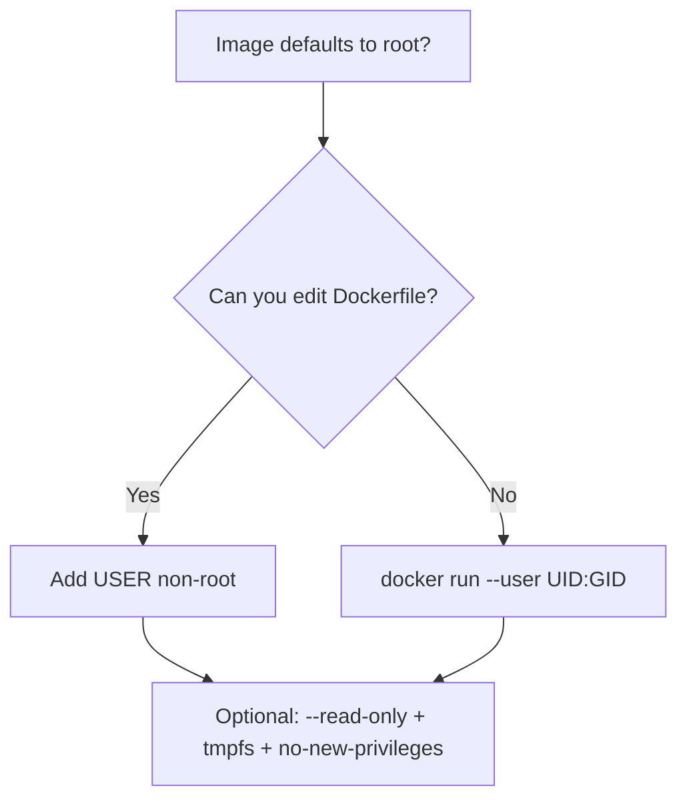
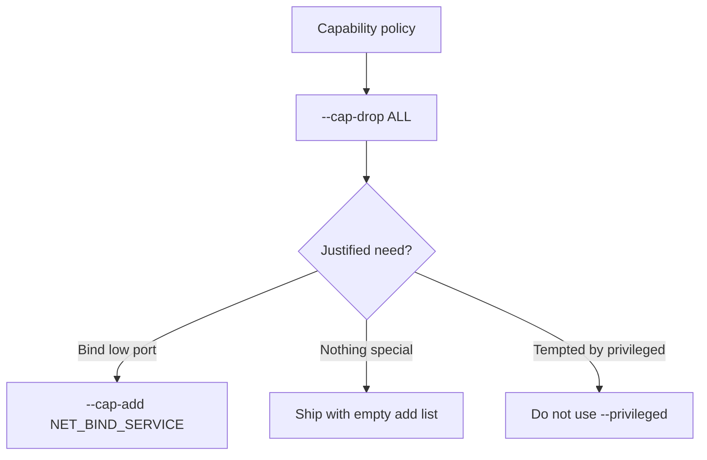
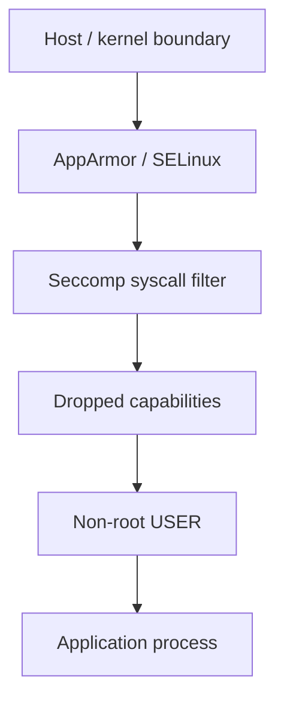
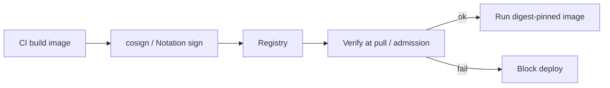
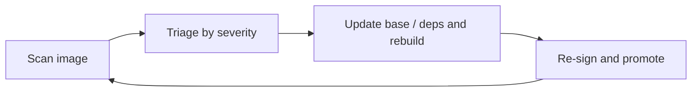

# Chapter 10 — Docker Security Basics

> **Learning Objectives**
>
> By the end of this chapter, you will be able to:
>
> - Describe how Docker keeps containers apart, and why that only holds as far as your settings allow
> - Run containers as an ordinary user instead of root, and say why this one habit matters most
> - Take Linux capabilities away so a container can do less
> - Explain how seccomp and AppArmor profiles limit which system calls a process makes and which files it touches
> - Check that an image is genuine: why Docker Content Trust is going away, and what to use now (cosign, Notation)
> - Hand secrets to a container without baking them into the image or passing them as plain variables
> - Scan an image for known vulnerabilities and decide what to do about the results
> - Know where this chapter stops and where Chapter 26 picks up (Hardened Images and the supply chain)

---

## 10.1 The hotel room

A container is like a hotel room. The guests are the processes inside. Each guest gets their own space and cannot casually wander into other rooms. But hotel security still depends on decisions management makes. Do room keys also open the maintenance corridors? Where does the master key sit? Does anyone check IDs at check-in?


*Figure 10.A: Guests get a keycard, not the master key—containers should not run as root by default.*

Namespaces and cgroups are the walls of the room. This chapter is about the management decisions: what powers a guest checks in with, which master keys it can reach, and how you confirm the guest is who they claim to be.

The guiding rule is **least privilege** — give a container only the powers it truly needs. Every permission it does not have is an attack that fails on its own, with no effort from you. Now a sobering fact. A process running as root *inside* a container is root *as far as the kernel is concerned*. The container wall is strong, but it is not magic. If that wall is breached, root in the container becomes root on the host. So we stack several defenses instead of trusting one.

> 💡 **Tip:** This chapter covers host-and-engine hardening you can apply today. **Chapter 26** goes deeper on **Docker Hardened Images**, attestations, SBOMs, and end-to-end supply-chain policy — treat that chapter as the sequel when you harden *what* you pull as carefully as *how* you run it.

---

## 10.2 Don't run as root

### In plain terms

Running a container as **non-root** means the process inside uses an ordinary user account instead of the all-powerful `root` account.

You should care because this is the highest-value habit in the whole chapter, and most images default to root. Root inside a container is *the same UID 0* that the kernel trusts on the host. **UID 0** is the numeric user ID Linux reserves for root. The container wall — namespaces and cgroups — is the only thing standing between root in the container and root on the host. That wall is strong but not infinite. A kernel bug, an over-broad mount, or a careless `--privileged` flag can turn in-container root into host root.

Run as an ordinary user and the picture changes completely. Even after an attacker gets code running inside your container, they start with almost nothing: they cannot write system files, install packages, or bind low-numbered ports. Many attack chains hit a dead end long before they ever reach the wall. So create an unprivileged user in the Dockerfile when you can, and override the user at run time for images you do not control.

> 💡 **In one line:** Root inside a container is real root to the kernel. A `USER` line in your Dockerfile, or `--user 1001:1001` at run time, is the cheapest security win you will ever ship.

> ⚠️ **Common Pitfall:** You might think "the app doesn't need root, so it probably isn't running as root." Unless the image sets `USER` or you override it, the process runs as UID 0. Most base images ship that way to make building easy. Convenience at build time becomes standing risk at run time. Check with `docker run --rm <image> whoami` instead of assuming.

### Under the hood

Here is what actually happens on the machine. Start by asking who you are:

```bash
$ docker run --rm alpine:3.20 whoami
root
```

**In the Dockerfile:**

```dockerfile
FROM python:3.12-slim
RUN groupadd --gid 1001 app && useradd --uid 1001 --gid app --create-home app
WORKDIR /app
COPY --chown=app:app . .
USER app
CMD ["gunicorn", "--bind", "0.0.0.0:8000", "app:app"]
```

**At run time:**

```bash
$ docker run --rm --user 1001:1001 alpine:3.20 whoami
```

(Odd `whoami` output only means UID 1001 has no `/etc/passwd` entry — the process is still unprivileged.)

Cheap hardening pair:

```bash
$ docker run -d \
    --read-only \
    --tmpfs /tmp \
    --security-opt no-new-privileges \
    task-api:0.1.0
```

`--read-only` makes the container filesystem immutable (tmpfs for scratch). `no-new-privileges` blocks gaining privileges via setuid binaries. Deeper options: **`userns-remap`** and **rootless Docker** map even "root in the container" to an unprivileged host user — remember from Chapter 07 that **userns-remap is incompatible with the containerd image store**.

**What breaks if X:** if a root container is also given a dangerous mount — the Docker socket (`/var/run/docker.sock`), the host root filesystem, or `--privileged` — the isolation argument collapses entirely. In-container root plus the Docker socket is *game over*: that process can launch a new container that mounts the host's `/` and writes anywhere, i.e., trivially become host root. This is why "non-root" and "no sensitive mounts" are one combined discipline, not two separate nice-to-haves.

### In production

Require a `USER` line in every Dockerfile your team owns. Make CI fail any image that runs as root. Use rootless Engine wherever the platform supports your workload. Never hand out Docker group membership lightly — on the host, it is the same as handing out root.

**Who owns this:** the app team owns the `USER` line in every Dockerfile it ships. The platform/security team owns the CI check that rejects root images and the policy on Docker group membership. **Failure mode and detection:** the finding that keeps coming back is a service quietly running as root because nobody added `USER`. It works fine, so it passes review unless something actually checks. Check at build time with a CI step that inspects the image config and asserts a non-root user. Check at run time with `docker inspect --format '{{.Config.User}}' <ctr>`, where an empty result means root. **Do** bake `USER` into images, fail CI on root, and pair it with `--read-only`, `--tmpfs`, and `no-new-privileges`; **don't** hand out Docker group membership casually — it is the same as root on the host.

> 🏭 **Production floor:** A root container is one misconfiguration away from being host root — especially if it also mounts the Docker socket, host paths, or runs `--privileged`. Treat "runs as root" as a blocking security finding, not a style nit: enforce non-root `USER` in CI, ban the Docker socket and `--privileged` from application containers by policy, and remember Docker group membership on the host is itself root-equivalent. The blast radius of one root+socket container is the entire host and every other container on it.

**Before you leave this section**

- **Understand:** in-container root is host UID 0 behind only the namespace boundary; non-root turns many post-exploitation steps into dead ends.
- **Try:** run `docker run --rm alpine:3.20 whoami` (root), then rebuild with a `USER app` line (or `--user 1001:1001`) and confirm the change.
- **Watch in prod:** services silently running as root, root containers with the Docker socket or host paths mounted, and casual Docker-group membership.



*Figure 10.1: Prefer baking non-root into the image; override at run time when you must consume someone else's image.*

---

## 10.3 Capabilities: root, sliced thin

### In plain terms

A **capability** is one slice of root's power — bind a low-numbered port, change file ownership, craft raw network packets, and so on. Linux splits root into roughly forty of them, and Docker starts every container with a trimmed-down set.

You should care because root used to be all-or-nothing: a process was either fully privileged or fully powerless. That fits containers badly. A web server may legitimately need *one* root-ish power, such as binding port 80, and none of the other forty. Slicing root into separate permissions lets you grant exactly the sliver a workload needs.

Docker already drops most capabilities for you. Least privilege goes further: drop **all** of them, then add back only the specific few you can name and justify. An attacker who takes over the process then inherits a deliberately tiny set of powers.

> 💡 **In one line:** Start from `--cap-drop ALL` and add back only the capabilities you can name out loud. `--privileged` is the opposite of that — it hands the container the whole host.

> ⚠️ **Common Pitfall:** You might reach for `--privileged` to make a permission error go away. `--privileged` is not "a few more capabilities." It grants *all* capabilities, adds device access, and switches off key confinements, which effectively gives the container ownership of the host. It is almost never the right fix. The right fix is finding the one capability — or the file-ownership or port problem — that you actually need to address.

### Under the hood

Here is what actually happens on the machine:

```bash
$ docker run -d \
    --cap-drop ALL \
    --cap-add NET_BIND_SERVICE \
    -p 80:80 \
    nginx:1.27
```

```bash
$ docker run --rm --cap-drop ALL alpine:3.20 ping -c 1 8.8.8.8
PING 8.8.8.8 (8.8.8.8): 56 data bytes
ping: permission denied (are you root?)
```

`ping` needs `NET_RAW`; dropping it shrinks the attack surface.

`--privileged` grants *all* capabilities plus device access and disables several confinements. Treat it as "this container owns the host."

| Flag | Effect | When |
|------|--------|------|
| (default) | ~12 capabilities | Everyday, not ideal |
| `--cap-drop ALL --cap-add X` | Exactly what you list | Production target |
| `--privileged` | Everything, weak confinement | Almost never |

**What breaks if X:** `--privileged` (or a broad `--cap-add SYS_ADMIN`) re-opens the exact attack surface the rest of this chapter closes — with it, seccomp/AppArmor confinement is weakened and a container can mount host devices and filesystems, so a single exploited privileged container is effectively a host compromise regardless of how carefully you dropped other things.

### In production

Write down a reason for every `--cap-add`. Fix volume ownership or listen on a high port instead of granting `SYS_ADMIN`. Ban `--privileged` in production policy, with the only exceptions being host tools you have reviewed carefully.

**Who owns this:** the app team writes down and justifies every `--cap-add`. The security team owns the policy that bans `--privileged` and reviews which capabilities are granted. **Failure mode and detection:** the quiet erosion is capability creep — someone adds a `--cap-add` to unblock work during an incident, and nobody ever removes it. Look for them with `docker inspect --format '{{.HostConfig.CapAdd}} {{.HostConfig.Privileged}}' <ctr>`, and treat any `Privileged=true` on an application container as a finding you must fix. **Do** drop `ALL` and add back a named, reviewed minimum; **don't** use `--privileged` to cover up a permission or file-ownership problem.

> 🏭 **Production floor:** `--privileged` and broad capabilities like `SYS_ADMIN` hand a container host-level power and weaken the confinement layers below. Make `--privileged` a policy-banned, explicitly-reviewed exception for a short list of host tools — never a default fix for permission errors. Every `--cap-add` widens blast radius, so require each one to be named, justified, and revisited; an exploited privileged container is a host incident, not a container one.

**Before you leave this section**

- **Understand:** capabilities slice root into granular powers; drop `ALL` and add back only a named, justified minimum.
- **Try:** run `--cap-drop ALL alpine ping` (fails), then add exactly `--cap-add NET_RAW` and watch `ping` work again.
- **Watch in prod:** capability creep from un-reverted `--cap-add`, and any `--privileged` on an application container.



*Figure 10.2: Drop everything, then add back only capabilities you can document.*

---

## 10.4 Seccomp and AppArmor

### In plain terms

**Seccomp** and **AppArmor** are two kernel features Docker uses to fence a container in further. Seccomp filters which **system calls** — the requests a program makes to the kernel — a process may make at all. AppArmor, or SELinux on Red Hat systems, limits which files, paths, and network operations it may touch.

You should care because these layers are independent of each other, and that independence is the whole point of defense in depth. Capabilities control *what a process is allowed to be*. Seccomp goes narrower: even a process that somehow holds a capability can be blocked from the one syscall that would abuse it. AppArmor and SELinux go sideways, limiting which resources the process may reach no matter which syscalls or capabilities it has.

Stack all three and an attacker has to defeat several separate boundaries. When one of them fails, the host is still not theirs.

> ⚠️ **Common Pitfall:** You might switch these off with `--security-opt seccomp=unconfined` while debugging and then forget to remove it. Docker's *default* seccomp and AppArmor profiles are free, always-on protection that blocks a dangerous set of syscalls. Running `unconfined` in a real service strips that protection quietly. Nothing throws an error. You are simply less safe than the defaults you started with.

### Under the hood

Here is what actually happens on the machine. **Seccomp** filters **system calls**. Docker's default profile blocks a dangerous subset (including notorious calls such as unrestricted `mount` and kernel-tampering syscalls). Supply a stricter custom profile when needed:

```bash
$ docker run -d --security-opt seccomp=./my-profile.json task-api:0.1.0
```

Never casually disable it:

```bash
$ docker run -d --security-opt seccomp=unconfined task-api:0.1.0   # avoid in real service runs
```

**AppArmor** (Ubuntu/Debian; SELinux on Fedora/RHEL) is mandatory access control for files, paths, and network operations. Docker loads `docker-default` where AppArmor exists:

```bash
$ docker run -d --security-opt apparmor=my-nginx-profile nginx:1.27
```

| | Seccomp | AppArmor |
|---|---------|----------|
| Restricts | Which syscalls may be made | Which resources (files, paths, network) may be accessed |
| Docker default | Yes | Yes (`docker-default`, where available) |
| Custom | `--security-opt seccomp=profile.json` | `--security-opt apparmor=profile-name` |



*Figure 10.3: Defense in depth — each layer independently shrinks what an attacker can do if an inner boundary fails.*

### In production

Leave the defaults on. They are free protection. Write custom profiles for high-value or internet-facing workloads. Never leave `unconfined` in place after a debugging session.

**Who owns this:** the platform/security team owns the default profiles and any custom ones. The app team owns knowing whether its workload needs a syscall the default profile blocks — rare, but some runtimes do. **Failure mode and detection:** two shapes. A leftover `seccomp=unconfined` or `apparmor=unconfined` from debugging ships weakened protection with no warning. Find it with `docker inspect --format '{{.HostConfig.SecurityOpt}}' <ctr>` and by searching run commands and Compose files for `unconfined`. The other shape is a custom profile that is too strict and blocks a syscall the app legitimately needs. That shows up as `Operation not permitted` errors; read the app logs and, on newer kernels, the seccomp audit logs to find the blocked call. **Do** keep the defaults on and version custom profiles like code; **don't** leave `unconfined` in any committed definition.

**Before you leave this section**

- **Understand:** seccomp filters syscalls, AppArmor/SELinux confines files/paths/network, capabilities remove privilege slices — three independent layers.
- **Try:** inspect a running container's `SecurityOpt` and confirm the default seccomp/AppArmor profiles are applied (not `unconfined`).
- **Watch in prod:** `unconfined` left behind after debugging, and overly strict custom profiles throwing `Operation not permitted`.

---

## 10.5 Trusting what you run: signing

### In plain terms

**Signing** attaches a cryptographic signature to an image, so you can prove the image is the exact artifact the publisher built.

You need this because hardening *how* a container runs does nothing if the image itself was swapped out. Something could have replaced it somewhere between the publisher and your host: a hacked registry, a hijacked tag, a name that differs from the real one by a single typo. A tag like `nginx:1.27` is only a pointer, and a pointer can be moved to point at anything.

The thing signing gives you is **provenance** — solid knowledge of where an artifact really came from. The publisher signs the exact artifact they built. You then verify, at pull time or when the cluster admits the workload, that what you are about to run is that artifact and not a substitute.

> ⚠️ **Common Pitfall:** You might set `DOCKER_CONTENT_TRUST=1` and call it your new supply-chain policy. That switch turns on **Docker Content Trust (Notary v1)**, which is **deprecated and being retired**, and Official Images are moving off it. Keep the *goal* of verifying provenance, but build it with the modern tools below. Do not build new workflows on DCT.

### Under the hood

Here is the history and the current tooling, in order. **Docker Content Trust (DCT)** was Docker's original answer: Notary v1 signatures, enabled with:

```bash
$ export DOCKER_CONTENT_TRUST=1
$ docker pull nginx:1.27
```

You will still meet DCT in older docs and policies. Know its trajectory: **DCT is deprecated and being retired.** Notary v1 stagnated; signed Official Images are moving off that path; the Notary service timeline ends the old trust model. **Do not build new verification workflows on `DOCKER_CONTENT_TRUST`.**

Modern successors:

- **Sigstore / cosign** — `cosign sign` / `cosign verify`, optional keyless signing tied to CI identities and a transparency log. Dominant in cloud-native ecosystems.
- **Notation (Notary Project v2)** — OCI-native signatures as artifacts beside the image; common in several enterprise and Azure-centric toolchains.

```bash
$ cosign sign registry.example.com/task-api:1.2.0
$ cosign verify --certificate-identity-regexp '.*' \
    --certificate-oidc-issuer https://token.actions.githubusercontent.com \
    registry.example.com/task-api:1.2.0
```

```text
Verification for registry.example.com/task-api:1.2.0 --
The following checks were performed on each of these signatures:
  - The cosign claims were validated
  - The signatures were verified against the specified public key
```

**What breaks if X:** a signature only protects you if something *verifies* it. Signing images in CI but never enforcing verification at pull or admission is security theater — the signatures exist, but nothing stops an unsigned or tampered image from running. And a valid signature on a *tag* still leaves the tag mutable; pin by digest (`image@sha256:…`) so the thing you verified is the exact thing you run.

### In production

Verify signatures in CI and again when the cluster admits the workload (Kubernetes admission comes later in the book). Pin images by digest (`image@sha256:…`) as well as signing them. For Docker Hub base images and a maintained catalog of minimal signed images, see **Docker Hardened Images** and the wider supply-chain story in **Chapter 26**, which covers provenance, SBOMs, and rebuilding continuously as new CVEs land.

**Who owns this:** the platform/security team owns the signing keys, or the keyless CI identities, plus the gate in CI and admission that enforces verification. App teams own producing signed, digest-pinned artifacts in their pipelines. **Failure mode and detection:** the common non-event is "we sign but never verify." Test for it by checking whether any gate actually rejects an unsigned image — try to deploy one and confirm it is blocked. **Do** verify at admission, pin digests, and move off DCT to cosign or Notation; **don't** build new policy on `DOCKER_CONTENT_TRUST`, and don't trust a signature that nothing checks.

**Before you leave this section**

- **Understand:** signing proves provenance; DCT (Notary v1) is deprecated — use cosign or Notation, and pair signatures with digest pins.
- **Try:** `cosign verify …` a signed image and read the checks it reports; note that verification, not signing, is what protects you.
- **Watch in prod:** signing with no enforcement gate, mutable tags that bypass what you verified, and lingering `DOCKER_CONTENT_TRUST` policy.

> 📘 **Deep Dive (optional):** Chapter 26 covers Hardened Images, SLSA-style provenance, SBOM consumption, and how signing fits a full supply-chain program. This chapter only needs you to stop investing in DCT and start with cosign or Notation.



*Figure 10.4: Modern signing verifies provenance at promotion time — prefer cosign or Notation over deprecated DCT.*

---

## 10.6 Secrets

### In plain terms

A **secret** is any value that would hurt you if it leaked: a database password, an API key, a TLS private key. Deliver each one to a container as a file, ideally from a dedicated secret store.

Why files rather than image layers or environment variables? Because of where each option leaves copies of the value behind. Bake a secret into an image and it lives in a layer forever. Anyone who pulls the image, or reads its history, has it. Rebuilding does not erase the old layer from registries or caches.

Pass the same value as `-e PASSWORD=…` and it leaks through a dozen side doors: `docker inspect`, `/proc/<pid>/environ`, child processes that inherit the environment, crash dumps, and any logging that echoes config. A file handed to just the process that needs it — ideally on a tmpfs-style path that never touches disk — stays out of image layers and out of every one of those side doors. So do not bake passwords into images, and avoid plain `-e` flags wherever a file-based path exists.

> ⚠️ **Common Pitfall:** You might treat an environment variable as "temporary," just for this one debug run. Once a secret reaches shell history, a CI log, or a deployment manifest, treat it as permanently compromised and rotate it. There is no clean "unset and forget." The value has already been copied somewhere you do not control.

### Under the hood

Here is what actually happens on the machine, starting with the two things not to do.

Anti-patterns:

1. **`ENV API_KEY=...` or copied secret files in the image** — anyone who pulls the image (or reads layer history) has the secret forever.
2. **Plain `-e` environment variables** — visible in `docker inspect`, `/proc/<pid>/environ`, crash dumps, and child processes.

**Swarm secrets** (Chapter 09): encrypted in the manager Raft log, mounted at `/run/secrets/<name>`:

```bash
$ echo -n "s3cr3t-db-pass" | docker secret create db_password -
$ docker service create --name db \
    --secret db_password \
    -e POSTGRES_PASSWORD_FILE=/run/secrets/db_password \
    postgres:16
```

Prefer `*_FILE` configuration knobs. On single-host Compose, the `secrets:` key is a reasonable **dev** approximation (often file-backed). For production beyond Swarm, use Kubernetes Secrets (Chapter 17) or dedicated managers (Vault, cloud secret stores).

### In production

Rotate credentials on a schedule. Never commit a `.env` file holding a real secret. Clean secrets out of CI logs. Treat a "temporary" plaintext environment variable as permanent the moment it reaches shell history or a deployment manifest.

**Who owns this:** the platform/security team owns the secret store — Swarm secrets, Kubernetes Secrets, Vault, a cloud secret manager — and the rotation policy. App teams own reading secrets from files and `*_FILE` settings instead of hard-coding them. **Failure mode and detection:** the incident that keeps recurring is a committed `.env`, or an `ENV SECRET=…` line in a Dockerfile, found by a secret scanner long after the fact — or worse, found by an attacker. Run a secret scanner in CI and over your Git history, and treat every hit as "rotate now," not "delete the line." **Do** deliver secrets as files, use `*_FILE` settings, and rotate on a schedule; **don't** bake secrets into images or pass them as a plain `-e` when a file-based path exists.

> 🏭 **Production floor:** A secret in an image layer or a plain `-e` flag has a blast radius far beyond the one container — image layers are pulled and cached widely, and env vars leak through `docker inspect`, `/proc`, child processes, logs, and crash dumps. Once exposed, a credential must be rotated, not just removed. Gate CI on secret scanning, deliver credentials as files from a real secret store, and treat any leaked value (shell history, CI log, committed `.env`) as compromised and rotate it immediately.

**Before you leave this section**

- **Understand:** secrets belong in files from a secret store, not image layers or plain env vars, which leave copies in layers, `docker inspect`, `/proc`, logs, and dumps.
- **Try:** create a Swarm secret, attach it to a service, and confirm it appears under `/run/secrets/<name>` but not in the container's `env`.
- **Watch in prod:** committed `.env`/`ENV` secrets, plaintext `-e` credentials, and "temporary" env secrets that were never rotated.

---

## 10.7 Scanning

### In plain terms

**Scanning** an image means listing every package inside it and checking each one against databases of known vulnerabilities, which are published as **CVEs** — entries in the public catalog of known security flaws.

You need this because you ship far more than you wrote. Your handful of application files rides on top of a base operating system, its system libraries, and your language's dependency tree. That is often hundreds of packages you never picked directly, and each one has its own vulnerability history.

New CVEs are published against versions that are *already* in your image, every single day. Scanning takes inventory and cross-references it, so you hear about the openssl or glibc problem in your base layer before an attacker does.

> ⚠️ **Common Pitfall:** You might scan once at build time, see a clean report, and file the image away as "secure." Vulnerability databases grow every day against packages that are already inside your image. A report that was clean last month can show critical findings today with *zero* code changes. Scanning is a loop you repeat, not a gate you pass once.

### Under the hood

Here is what actually happens when you scan. Docker **Scout**, **Trivy**, and **Grype** are common tools:

```bash
$ docker scout cves task-api:1.2.0
```

```text
  Target       │  task-api:1.2.0
    platform   │  linux/amd64
    vulnerabilities │ 1C 3H 12M 25L
    packages   │ 184

   0C  1H  0M  0L  openssl 3.0.11
      ✗ HIGH CVE-2024-XXXX
        Fixed version  : 3.0.14
```

Act on results:

- **Update the base image first** — most findings live in the OS layer.
- **Prefer minimal bases** — `slim`, Alpine, distroless, or Hardened Images (Chapter 26) ship fewer packages and less noise.
- **Scan in CI** — fail builds on new criticals.
- **Triage** by severity and exploitability, not raw CVE count alone.

**What breaks if X:** if you gate CI on raw CVE *count* rather than severity and exploitability, you get alert fatigue — hundreds of low/unreachable findings drown the one critical, reachable one, and teams start rubber-stamping "accept all." Triage by whether the vulnerable code path is actually reachable and how severe it is, not by a number.

### In production

Scanning once is theater. New CVEs are published against images that already exist, every day. Rebuild on a fixed schedule, re-scan continuously, and track how old your base images are as a number you actually watch. Pair scanning with signing so you know *which* fixed artifact is allowed to run.

**Who owns this:** the app team owns sorting through and fixing findings in the images it builds. The platform/security team owns the scanning infrastructure, the CI policy for which severity fails a build, and the re-scanning of images that were published long ago. **Failure mode and detection:** the quiet failure is a fleet of images that were clean when built and have since collected critical findings, because nothing re-scans or rebuilds them. Catch it by scanning the images in your registry and in production on a schedule, not just at build time, and by tracking base-image age. **Do** rebuild on a schedule, re-scan continuously, choose minimal bases, and pair scanning with signing so only fixed artifacts run; **don't** treat one clean scan as lasting proof, and don't fail builds on CVE count alone.



*Figure 10.5: Scanning is a loop — remediate, rebuild, re-sign, and scan again as CVEs land.*

**Before you leave this section**

- **Understand:** you ship a whole OS and dependency tree, not just your code; scanning is a recurring loop because CVEs land daily against existing packages.
- **Try:** `docker scout cves` (or Trivy/Grype) an old vs current `slim` base tag and compare the findings; write one sentence of base-image policy.
- **Watch in prod:** one-time "clean" scans treated as durable, CI gates on raw CVE count, and published images that are never re-scanned or rebuilt.

---

## 10.8 Common pitfalls

1. **Shipping root by default** because the base image does. Add `USER`.
2. **Reaching for `--privileged` to "fix" permissions.** Find the specific capability or ownership issue.
3. **Leaving seccomp/AppArmor `unconfined` after debugging.**
4. **Secrets in Dockerfiles or committed `.env` files.**
5. **Building new policy on `DOCKER_CONTENT_TRUST=1`.** Use cosign or Notation; see Chapter 26 for Hardened Images / supply chain.
6. **Scanning once and declaring victory.**
7. **Trusting `latest` from unknown publishers.** Prefer official/verified images; pin tags or digests.

---

## 10.9 Hands-on exercises

1. **Find the root.** `docker run --rm nginx:1.27 whoami`, then wrap a base image with `USER app`, rebuild, confirm.
2. **Break ping, then fix it.** `--cap-drop ALL` fails `ping`; add exactly one `--cap-add` to restore it.
3. **Immutable filesystem.** `--read-only --tmpfs /tmp`; show writes fail elsewhere and succeed in `/tmp`.
4. **Inspect defenses.** `docker inspect --format '{{.HostConfig.SecurityOpt}} {{.HostConfig.CapDrop}}' <container>`.
5. **Scan and remediate.** Compare Scout/Trivy results for an old vs current slim Python tag; write one sentence on base-image policy.
6. **Secret delivery (Swarm).** Create a secret, attach to a service, confirm `/run/secrets/<name>` exists and is absent from `env`.

---

## 10.10 Check Your Understanding

**Q1.** Why is running containers as a non-root user considered the highest-value hardening step?

<details>
<summary>Show answer</summary>

Root inside a container is root to the kernel; isolation is the only barrier to the host. If that barrier fails — kernel bug, over-broad mount — in-container root becomes host compromise. An unprivileged user turns many breaches and in-container exploits into dead ends.

</details>

**Q2.** What is the difference between dropping capabilities and applying a seccomp profile?

<details>
<summary>Show answer</summary>

Capabilities remove slices of root's *privilege* (bind low ports, change ownership, raw sockets). Seccomp filters which *system calls* the process may invoke at all. They stack: a process with no special capabilities can still be blocked by seccomp from calling `mount`.

</details>

**Q3.** A teammate proposes enabling `DOCKER_CONTENT_TRUST=1` everywhere as new supply-chain policy. What do you tell them?

<details>
<summary>Show answer</summary>

DCT verifies Notary v1 signatures and is deprecated/retiring; Official Images are moving off that path. Keep the *goal* (verify provenance) but implement with Sigstore/cosign or Notation, ideally enforced by registry or admission policy. For maintained signed minimal bases and deeper supply-chain controls, continue in Chapter 26 (Hardened Images and related practices).

</details>

**Q4.** Why are Swarm secrets safer than `-e PASSWORD=...`?

<details>
<summary>Show answer</summary>

Environment variables leak via `docker inspect`, `/proc/<pid>/environ`, child processes, logs, and crash reports. Secrets are stored in the managers' Raft log, delivered only to authorized services, and mounted as in-memory-style files under `/run/secrets/` that never land in image layers.

</details>

**Q5.** Your scanner reports 40 vulnerabilities though application code has not changed in months. How is that possible, and what's the first fix?

<details>
<summary>Show answer</summary>

CVE databases grow daily against *existing* packages in your image. Most findings often live in the base OS layer, so rebuild on the latest patch of a minimal base (or adopt Hardened Images as discussed in Chapter 26), then re-scan.

</details>

---

## 10.11 Key takeaways

- Give a container only what it needs, and stack several defenses. Each one turns whole classes of attack into failures on its own.
- Root inside a container is real root to the kernel. Run as **non-root**.
- Add `--read-only`, `--tmpfs`, and `no-new-privileges` when you can. They cost nothing.
- Drop **all** capabilities, then add back only the ones you can name and justify.
- Never use `--privileged` on an application container. It hands over the host.
- Leave the default **seccomp** and **AppArmor** profiles on. Never ship `unconfined`.
- Prove an image is genuine with **cosign** or **Notation**, and pin it by digest. **DCT is deprecated history.**
- Signing protects nothing until something verifies it.
- Deliver credentials as files (`/run/secrets/`, `*_FILE` settings). Never in image layers, never in a plain `-e`.
- A leaked secret must be rotated, not just deleted.
- **Scan continuously**, fix by rebuilding on a fresh minimal base, and fail CI on critical findings.
- Chapter 26 continues with **Docker Hardened Images**, attestations, SBOMs, and full supply-chain hardening.

---

## 10.12 Official documentation map

| Topic | Official page |
|-------|---------------|
| Engine security overview | [Docker security](https://docs.docker.com/engine/security/) |
| Non-root / userns | [User namespace remapping](https://docs.docker.com/engine/security/userns-remap/) |
| Rootless mode | [Rootless mode](https://docs.docker.com/engine/security/rootless/) |
| Seccomp | [Seccomp security profiles](https://docs.docker.com/engine/security/seccomp/) |
| AppArmor | [AppArmor security profiles](https://docs.docker.com/engine/security/apparmor/) |
| Docker Content Trust (legacy) | [Content trust in Docker](https://docs.docker.com/engine/security/trust/) |
| DCT retirement context | [Retired features — DCT](https://docs.docker.com/retired/#docker-content-trust-dct) |
| Secrets | [Docker secrets](https://docs.docker.com/engine/swarm/secrets/) |
| Docker Scout | [Docker Scout](https://docs.docker.com/scout/) |
| Docker Hardened Images | [Docker Hardened Images](https://docs.docker.com/dhi/) |
| DHI supply chain concepts | [Software supply chain security](https://docs.docker.com/dhi/core-concepts/sscs/) |

**Previous:** [Chapter 09 — Introduction to Docker Swarm](09-docker-swarm-intro.md) | **Next:** [Chapter 11 — Introduction to Kubernetes](11-kubernetes-introduction.md)
