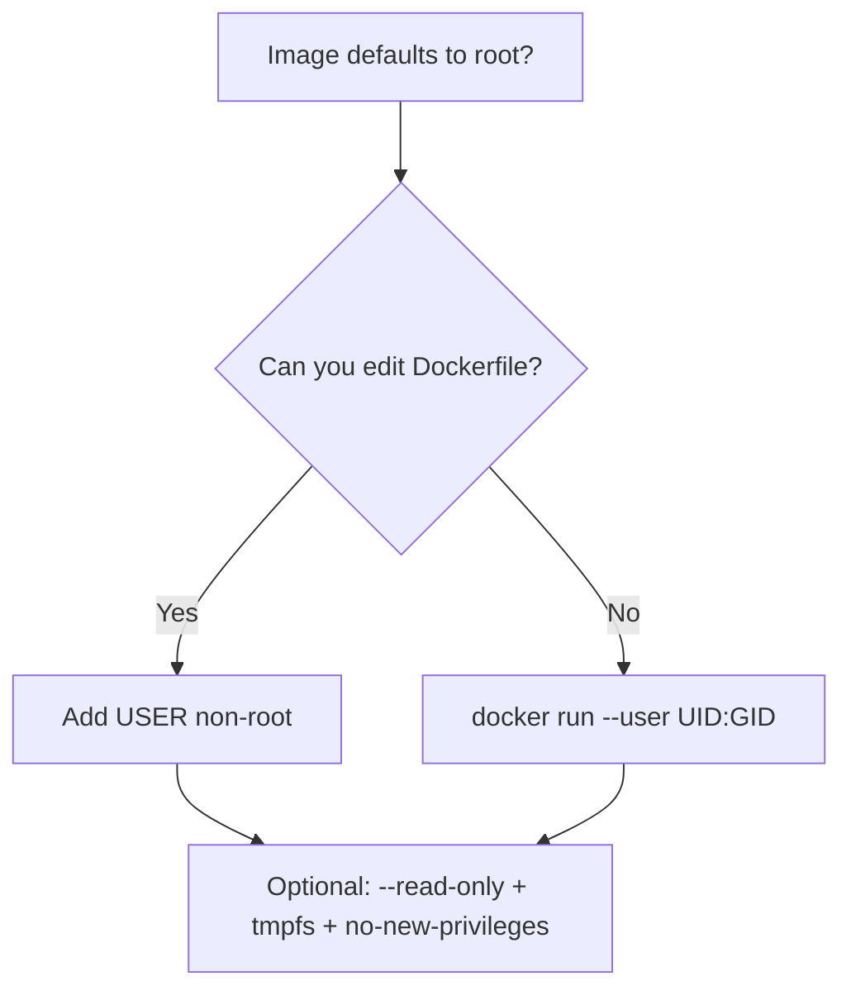
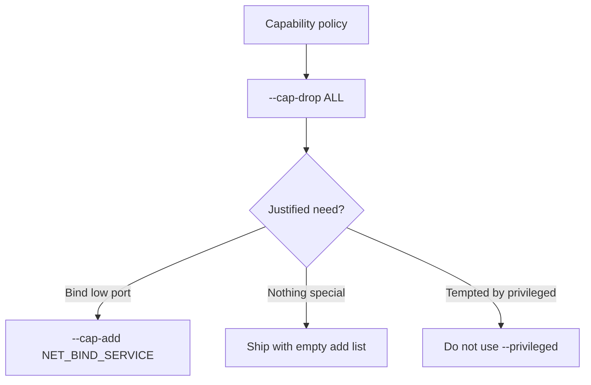
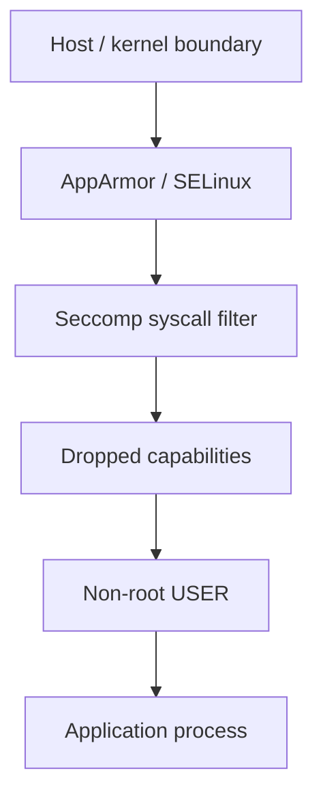
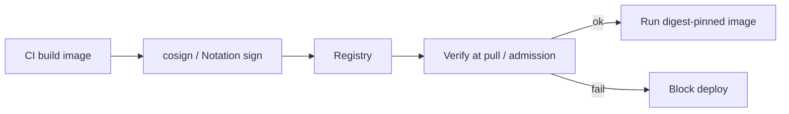
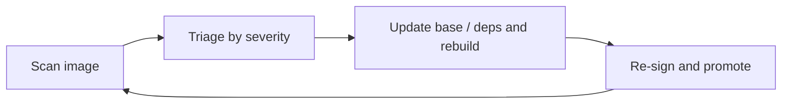

# Chapter 10 — Docker Security Basics

> **Learning Objectives**
>
> By the end of this chapter, you will be able to:
>
> - Explain Docker's security model and why "containers contain" is only as true as your configuration
> - Run containers as non-root users and explain why this habit matters most
> - Drop Linux capabilities to shrink what a containerized process may do
> - Describe how seccomp and AppArmor profiles restrict system calls and file/network access
> - Explain image signing: Docker Content Trust deprecation and modern tools (cosign, Notation)
> - Manage secrets without baking them into images or plain environment variables
> - Scan images for known vulnerabilities and act on the results
> - Recognize where this chapter stops and where Chapter 26 continues (Hardened Images and supply chain)

---

## 10.1 The hotel room

A container is like a hotel room. Guests (processes) get their own space and cannot casually wander into other rooms. Hotel security still depends on management decisions: Do room keys open maintenance corridors? Is the master key at the front desk? Do you check IDs at check-in?


*Figure 10.A: Guests get a keycard, not the master key—containers should not run as root by default.*

Namespaces and cgroups are the room walls. This chapter is about management decisions: what powers a guest checks in with, which master keys it can touch, and how you verify the guest is who they claim to be.

The guiding principle is **least privilege**: every permission a container does not have is an attack that fails automatically. Sobering fact: a process running as root *inside* a container is root *as far as the kernel is concerned*. The container boundary is strong but not magical — if it is breached, in-container root becomes host root. So we layer defenses.

> 💡 **Tip:** This chapter covers host-and-engine hardening you can apply today. **Chapter 26** goes deeper on **Docker Hardened Images**, attestations, SBOMs, and end-to-end supply-chain policy — treat that chapter as the sequel when you harden *what* you pull as carefully as *how* you run it.

---

## 10.2 Don't run as root

### In plain terms

Most images default to root. That is convenient and dangerous. Create an unprivileged user in the Dockerfile (best) or override the user at run time (for images you do not control).

Here is why this is the highest-value habit in the whole chapter. Root inside a container is *the same UID 0* the kernel trusts on the host — the container boundary (namespaces, cgroups) is the only thing standing between in-container root and host root. That boundary is strong but not infinite: a kernel bug, an over-broad mount, or a misconfigured `--privileged` flag can let in-container root become host root. Running as an unprivileged user means that even after an attacker gets code execution inside your container, they start with almost nothing — no ability to write system files, install packages, or bind privileged ports — turning many exploit chains into dead ends before they reach the host boundary at all.

> ⚠️ **Common Pitfall:** You might think "the app doesn't need root, so it probably isn't running as root." Unless the image sets `USER` or you override it, the default is UID 0 — most base images ship that way for build convenience. Convenience at build time becomes standing risk at run time; verify with `docker run --rm <image> whoami` rather than assuming.

### Under the hood

```bash
$ docker run --rm alpine:3.20 whoami
root
```

**In the Dockerfile:**

```dockerfile
FROM python:3.12-slim
RUN groupadd --gid 1001 app && useradd --uid 1001 --gid app --create-home app
WORKDIR /app
COPY --chown=app:app . .
USER app
CMD ["gunicorn", "--bind", "0.0.0.0:8000", "app:app"]
```

**At run time:**

```bash
$ docker run --rm --user 1001:1001 alpine:3.20 whoami
```

(Odd `whoami` output only means UID 1001 has no `/etc/passwd` entry — the process is still unprivileged.)

Cheap hardening pair:

```bash
$ docker run -d \
    --read-only \
    --tmpfs /tmp \
    --security-opt no-new-privileges \
    task-api:0.1.0
```

`--read-only` makes the container filesystem immutable (tmpfs for scratch). `no-new-privileges` blocks gaining privileges via setuid binaries. Deeper options: **`userns-remap`** and **rootless Docker** map even "root in the container" to an unprivileged host user — remember from Chapter 07 that **userns-remap is incompatible with the containerd image store**.

**What breaks if X:** if a root container is also given a dangerous mount — the Docker socket (`/var/run/docker.sock`), the host root filesystem, or `--privileged` — the isolation argument collapses entirely. In-container root plus the Docker socket is *game over*: that process can launch a new container that mounts the host's `/` and writes anywhere, i.e., trivially become host root. This is why "non-root" and "no sensitive mounts" are one combined discipline, not two separate nice-to-haves.

### In production

Require `USER` in every Dockerfile your team owns. Gate CI on "runs as non-root." Prefer rootless Engine where the platform supports your workload. Never treat Docker group membership lightly — it is effectively root-equivalent on the host.

**Who owns this:** the app team owns the `USER` line in every Dockerfile it ships; the platform/security team owns the CI gate that rejects root images and the policy on Docker group membership. **Failure mode and detection:** the recurring finding is a service quietly running as root because nobody added `USER` — it works fine, so it survives review unless something checks. Detect at build time (a CI step running `docker inspect`/config to assert a non-root user) and at runtime (`docker inspect --format '{{.Config.User}}' <ctr>` being empty means root). **Do** bake `USER` into images, gate CI on non-root, and pair it with `--read-only`, `--tmpfs`, and `no-new-privileges`; **don't** grant Docker group membership casually — it is root-equivalent on the host.

> 🏭 **Production floor:** A root container is one misconfiguration away from being host root — especially if it also mounts the Docker socket, host paths, or runs `--privileged`. Treat "runs as root" as a blocking security finding, not a style nit: enforce non-root `USER` in CI, ban the Docker socket and `--privileged` from application containers by policy, and remember Docker group membership on the host is itself root-equivalent. The blast radius of one root+socket container is the entire host and every other container on it.

**Before you leave this section**

- **Understand:** in-container root is host UID 0 behind only the namespace boundary; non-root turns many post-exploitation steps into dead ends.
- **Try:** run `docker run --rm alpine:3.20 whoami` (root), then rebuild with a `USER app` line (or `--user 1001:1001`) and confirm the change.
- **Watch in prod:** services silently running as root, root containers with the Docker socket or host paths mounted, and casual Docker-group membership.



*Figure 10.1: Prefer baking non-root into the image; override at run time when you must consume someone else's image.*

---

## 10.3 Capabilities: root, sliced thin

### In plain terms

Linux split root's power into discrete **capabilities** — bind low ports, change ownership, craft raw packets, and so on. Docker starts containers with a trimmed default set. Least privilege says: drop everything, add back only what you can justify.

Capabilities exist because "root" used to be all-or-nothing: a process was either fully privileged or fully unprivileged. That is a terrible fit for containers, where a web server might legitimately need *one* root-ish power (bind port 80) and none of the other forty. Capabilities slice root into granular permissions so you can grant exactly the sliver a workload needs. Docker already drops most of them by default; the mature posture goes further — drop **all**, then add back the specific few you can name and justify, so an attacker who takes over the process inherits a deliberately tiny set of powers.

> ⚠️ **Common Pitfall:** You might reach for `--privileged` to make a permission error go away. `--privileged` is not "a few more capabilities" — it grants *all* capabilities, adds device access, and disables key confinements, effectively giving the container ownership of the host. It is almost never the right fix; the right fix is identifying the one capability (or the ownership/port issue) actually needed.

### Under the hood

```bash
$ docker run -d \
    --cap-drop ALL \
    --cap-add NET_BIND_SERVICE \
    -p 80:80 \
    nginx:1.27
```

```bash
$ docker run --rm --cap-drop ALL alpine:3.20 ping -c 1 8.8.8.8
PING 8.8.8.8 (8.8.8.8): 56 data bytes
ping: permission denied (are you root?)
```

`ping` needs `NET_RAW`; dropping it shrinks the attack surface.

`--privileged` grants *all* capabilities plus device access and disables several confinements. Treat it as "this container owns the host."

| Flag | Effect | When |
|------|--------|------|
| (default) | ~12 capabilities | Everyday, not ideal |
| `--cap-drop ALL --cap-add X` | Exactly what you list | Production target |
| `--privileged` | Everything, weak confinement | Almost never |

**What breaks if X:** `--privileged` (or a broad `--cap-add SYS_ADMIN`) re-opens the exact attack surface the rest of this chapter closes — with it, seccomp/AppArmor confinement is weakened and a container can mount host devices and filesystems, so a single exploited privileged container is effectively a host compromise regardless of how carefully you dropped other things.

### In production

Document every `--cap-add`. Prefer fixing volume ownership or listening on high ports over granting `SYS_ADMIN`. Ban `--privileged` in production policy except for carefully reviewed host tools.

**Who owns this:** the app team documents and justifies every `--cap-add`; the security team owns the policy that bans `--privileged` and audits capability grants. **Failure mode and detection:** the quiet erosion is capability creep — a `--cap-add` added to unblock something during an incident and never removed. Detect with `docker inspect --format '{{.HostConfig.CapAdd}} {{.HostConfig.Privileged}}' <ctr>` and treat any `Privileged=true` on an application container as a finding. **Do** drop `ALL` and add back a named, reviewed minimum; **don't** use `--privileged` to paper over a permission or ownership problem.

> 🏭 **Production floor:** `--privileged` and broad capabilities like `SYS_ADMIN` hand a container host-level power and weaken the confinement layers below. Make `--privileged` a policy-banned, explicitly-reviewed exception for a short list of host tools — never a default fix for permission errors. Every `--cap-add` widens blast radius, so require each one to be named, justified, and revisited; an exploited privileged container is a host incident, not a container one.

**Before you leave this section**

- **Understand:** capabilities slice root into granular powers; drop `ALL` and add back only a named, justified minimum.
- **Try:** run `--cap-drop ALL alpine ping` (fails), then add exactly `--cap-add NET_RAW` and watch `ping` work again.
- **Watch in prod:** capability creep from un-reverted `--cap-add`, and any `--privileged` on an application container.



*Figure 10.2: Drop everything, then add back only capabilities you can document.*

---

## 10.4 Seccomp and AppArmor

### In plain terms

Capabilities control *what a process is allowed to be*. **Seccomp** and **AppArmor** (or SELinux) control *what it may say to the kernel* and *which resources it may touch*.

These are different, complementary layers — that is the whole point of defense in depth. Dropping capabilities removes categories of privilege. Seccomp goes narrower: it filters the individual **system calls** a process may make, so even a process that somehow has a capability can be blocked from the specific syscall that would abuse it. AppArmor/SELinux go sideways: they constrain which **files, paths, and network operations** the process may touch, regardless of syscalls or capabilities. Stacked, they mean an attacker must defeat several independent boundaries, and the failure of any one does not hand over the host.

> ⚠️ **Common Pitfall:** You might disable these with `--security-opt seccomp=unconfined` during debugging and forget to remove it. Docker's *default* seccomp and AppArmor profiles are free, always-on protection blocking a dangerous subset of syscalls; running `unconfined` in a real service strips that protection silently — nothing errors, you are just measurably less safe than the defaults.

### Under the hood

**Seccomp** filters **system calls**. Docker's default profile blocks a dangerous subset (including notorious calls such as unrestricted `mount` and kernel-tampering syscalls). Supply a stricter custom profile when needed:

```bash
$ docker run -d --security-opt seccomp=./my-profile.json task-api:0.1.0
```

Never casually disable it:

```bash
$ docker run -d --security-opt seccomp=unconfined task-api:0.1.0   # avoid in real service runs
```

**AppArmor** (Ubuntu/Debian; SELinux on Fedora/RHEL) is mandatory access control for files, paths, and network operations. Docker loads `docker-default` where AppArmor exists:

```bash
$ docker run -d --security-opt apparmor=my-nginx-profile nginx:1.27
```

| | Seccomp | AppArmor |
|---|---------|----------|
| Restricts | Which syscalls may be made | Which resources (files, paths, network) may be accessed |
| Docker default | Yes | Yes (`docker-default`, where available) |
| Custom | `--security-opt seccomp=profile.json` | `--security-opt apparmor=profile-name` |



*Figure 10.3: Defense in depth — each layer independently shrinks what an attacker can do if an inner boundary fails.*

### In production

Keep defaults on — they are free protection. Invest in custom profiles for high-value or internet-exposed workloads. Never leave `unconfined` on after a debugging session.

**Who owns this:** the platform/security team owns the default profiles and any custom ones; the app team owns knowing whether its workload needs a syscall the default profile blocks (rare, but some runtimes do). **Failure mode and detection:** two shapes. A left-behind `seccomp=unconfined`/`apparmor=unconfined` from debugging silently ships weakened confinement — detect with `docker inspect --format '{{.HostConfig.SecurityOpt}}' <ctr>` and grep run/Compose definitions for `unconfined`. The other is a too-strict custom profile that blocks a syscall the app legitimately needs, surfacing as `Operation not permitted` errors — read the app logs and, on newer kernels, seccomp audit logs to find the offending call. **Do** keep defaults on and version custom profiles like code; **don't** leave `unconfined` in any committed definition.

**Before you leave this section**

- **Understand:** seccomp filters syscalls, AppArmor/SELinux confines files/paths/network, capabilities remove privilege slices — three independent layers.
- **Try:** inspect a running container's `SecurityOpt` and confirm the default seccomp/AppArmor profiles are applied (not `unconfined`).
- **Watch in prod:** `unconfined` left behind after debugging, and overly strict custom profiles throwing `Operation not permitted`.

---

## 10.5 Trusting what you run: signing

### In plain terms

Hardening *how* containers run is half the story. You also need confidence that `nginx:1.27` (or your Task API tag) is the authentic artifact the publisher built — not a tampered substitute.

The gap signing closes is *provenance*. All the runtime hardening in the world does not help if the image you pulled was swapped for a malicious one somewhere between the publisher and your host — a compromised registry, a hijacked tag, a typo-squatted name. A tag like `nginx:1.27` is a mutable pointer; it can be repointed. Signing lets the publisher attach a cryptographic signature to the exact artifact they built, and lets you verify at pull or admission time that what you are about to run is that artifact and not a substitute.

> ⚠️ **Common Pitfall:** You might set `DOCKER_CONTENT_TRUST=1` as your shiny new supply-chain policy. That enables **Docker Content Trust (Notary v1)**, which is **deprecated and being retired** — Official Images are moving off it. Keep the *goal* (verify provenance) but implement it with the modern tools below; do not build new workflows on DCT.

### Under the hood

**Docker Content Trust (DCT)** was Docker's original answer: Notary v1 signatures, enabled with:

```bash
$ export DOCKER_CONTENT_TRUST=1
$ docker pull nginx:1.27
```

You will still meet DCT in older docs and policies. Know its trajectory: **DCT is deprecated and being retired.** Notary v1 stagnated; signed Official Images are moving off that path; the Notary service timeline ends the old trust model. **Do not build new verification workflows on `DOCKER_CONTENT_TRUST`.**

Modern successors:

- **Sigstore / cosign** — `cosign sign` / `cosign verify`, optional keyless signing tied to CI identities and a transparency log. Dominant in cloud-native ecosystems.
- **Notation (Notary Project v2)** — OCI-native signatures as artifacts beside the image; common in several enterprise and Azure-centric toolchains.

```bash
$ cosign sign registry.example.com/task-api:1.2.0
$ cosign verify --certificate-identity-regexp '.*' \
    --certificate-oidc-issuer https://token.actions.githubusercontent.com \
    registry.example.com/task-api:1.2.0
```

```text
Verification for registry.example.com/task-api:1.2.0 --
The following checks were performed on each of these signatures:
  - The cosign claims were validated
  - The signatures were verified against the specified public key
```

**What breaks if X:** a signature only protects you if something *verifies* it. Signing images in CI but never enforcing verification at pull or admission is security theater — the signatures exist, but nothing stops an unsigned or tampered image from running. And a valid signature on a *tag* still leaves the tag mutable; pin by digest (`image@sha256:…`) so the thing you verified is the exact thing you run.

### In production

Enforce verification in CI and at admission time (Kubernetes admission later in the book). Prefer digest pins (`image@sha256:…`) alongside signatures. For Docker Hub base images and a maintained minimal, signed catalog, see **Docker Hardened Images** and the broader supply-chain story in **Chapter 26** — including provenance, SBOMs, and continuous rebuilds when CVEs land.

**Who owns this:** the platform/security team owns the signing keys or keyless CI identities and the admission/CI enforcement gate; app teams own producing signed, digest-pinned artifacts in their pipelines. **Failure mode and detection:** the common non-event is "we sign but never verify" — detect it by checking whether any gate actually rejects an unsigned image (try to deploy one and confirm it is blocked). **Do** verify at admission, pin digests, and migrate off DCT to cosign/Notation; **don't** rely on `DOCKER_CONTENT_TRUST` for new policy or trust a signature you never enforce.

**Before you leave this section**

- **Understand:** signing proves provenance; DCT (Notary v1) is deprecated — use cosign or Notation, and pair signatures with digest pins.
- **Try:** `cosign verify …` a signed image and read the checks it reports; note that verification, not signing, is what protects you.
- **Watch in prod:** signing with no enforcement gate, mutable tags that bypass what you verified, and lingering `DOCKER_CONTENT_TRUST` policy.

> 📘 **Deep Dive (optional):** Chapter 26 covers Hardened Images, SLSA-style provenance, SBOM consumption, and how signing fits a full supply-chain program. This chapter only needs you to stop investing in DCT and start with cosign or Notation.



*Figure 10.4: Modern signing verifies provenance at promotion time — prefer cosign or Notation over deprecated DCT.*

---

## 10.6 Secrets

### In plain terms

Do not bake passwords into images. Do not sprinkle them in plain `-e` flags if you can avoid it. Deliver secrets as files (or a dedicated secret store) to processes that need them.

The reason files beat both images and env vars is *where the secret ends up leaving copies of itself*. Bake a secret into an image and it lives in a layer forever — anyone who pulls the image, or reads its history, has it, and rebuilding does not erase the old layer from registries or caches. Pass it as `-e PASSWORD=…` and it leaks through a dozen side channels: `docker inspect`, `/proc/<pid>/environ`, child processes that inherit the environment, crash dumps, and logging that echoes config. Delivering a secret as a file (ideally on a tmpfs-style path) to just the process that needs it keeps it out of image layers and out of those environment side channels.

> ⚠️ **Common Pitfall:** You might treat an environment variable as "temporary" — just for this one debug run. Once a secret hits shell history, a CI log, or an orchestration manifest, treat it as permanently compromised and rotate it. There is no clean "unset and forget"; the value has already been copied somewhere you do not control.

### Under the hood

Anti-patterns:

1. **`ENV API_KEY=...` or copied secret files in the image** — anyone who pulls the image (or reads layer history) has the secret forever.
2. **Plain `-e` environment variables** — visible in `docker inspect`, `/proc/<pid>/environ`, crash dumps, and child processes.

**Swarm secrets** (Chapter 09): encrypted in the manager Raft log, mounted at `/run/secrets/<name>`:

```bash
$ echo -n "s3cr3t-db-pass" | docker secret create db_password -
$ docker service create --name db \
    --secret db_password \
    -e POSTGRES_PASSWORD_FILE=/run/secrets/db_password \
    postgres:16
```

Prefer `*_FILE` configuration knobs. On single-host Compose, the `secrets:` key is a reasonable **dev** approximation (often file-backed). For production beyond Swarm, use Kubernetes Secrets (Chapter 17) or dedicated managers (Vault, cloud secret stores).

### In production

Rotate credentials on a schedule. Never commit `.env` files with real secrets. Scrub CI logs. Treat "temporary" plaintext env vars as permanent once they hit shell history or orchestration manifests.

**Who owns this:** the platform/security team owns the secret store (Swarm secrets, Kubernetes Secrets, Vault, cloud secret managers) and rotation policy; app teams own reading secrets from files/`*_FILE` knobs instead of hard-coding them. **Failure mode and detection:** the recurring incident is a committed `.env` or a `Dockerfile` `ENV SECRET=…` discovered by a secret scanner — or worse, by an attacker — long after the fact. Detect with a secret scanner in CI and history scans, and treat any hit as "rotate now," not "delete the line." **Do** deliver secrets as files, prefer `*_FILE` env knobs, and rotate on a schedule; **don't** bake secrets into images or pass them as plain `-e` when a file-based path exists.

> 🏭 **Production floor:** A secret in an image layer or a plain `-e` flag has a blast radius far beyond the one container — image layers are pulled and cached widely, and env vars leak through `docker inspect`, `/proc`, child processes, logs, and crash dumps. Once exposed, a credential must be rotated, not just removed. Gate CI on secret scanning, deliver credentials as files from a real secret store, and treat any leaked value (shell history, CI log, committed `.env`) as compromised and rotate it immediately.

**Before you leave this section**

- **Understand:** secrets belong in files from a secret store, not image layers or plain env vars, which leave copies in layers, `docker inspect`, `/proc`, logs, and dumps.
- **Try:** create a Swarm secret, attach it to a service, and confirm it appears under `/run/secrets/<name>` but not in the container's `env`.
- **Watch in prod:** committed `.env`/`ENV` secrets, plaintext `-e` credentials, and "temporary" env secrets that were never rotated.

---

## 10.7 Scanning

### In plain terms

Your image is more than your code: base OS, system libraries, language packages — each with CVE history. **Scanning** inventories packages and matches them against vulnerability databases.

The mental shift is that *you ship far more than you wrote*. Your handful of application files ride on top of a base OS, its libraries, and your language's dependency tree — often hundreds of packages you never chose directly. Each has its own vulnerability history, and new CVEs are published against *existing* versions every day. Scanning inventories everything in the image and cross-references it against vulnerability databases so you learn about the openssl or glibc issue in your base layer before an attacker does.

> ⚠️ **Common Pitfall:** You might scan once at build time, see a clean report, and consider the image "secure." Vulnerability databases grow daily against packages already in your image, so a report that was clean last month can show critical findings today with *zero* code changes. Scanning is a recurring loop, not a one-time gate.

### Under the hood

Docker **Scout**, **Trivy**, and **Grype** are common tools:

```bash
$ docker scout cves task-api:1.2.0
```

```text
  Target       │  task-api:1.2.0
    platform   │  linux/amd64
    vulnerabilities │ 1C 3H 12M 25L
    packages   │ 184

   0C  1H  0M  0L  openssl 3.0.11
      ✗ HIGH CVE-2024-XXXX
        Fixed version  : 3.0.14
```

Act on results:

- **Update the base image first** — most findings live in the OS layer.
- **Prefer minimal bases** — `slim`, Alpine, distroless, or Hardened Images (Chapter 26) ship fewer packages and less noise.
- **Scan in CI** — fail builds on new criticals.
- **Triage** by severity and exploitability, not raw CVE count alone.

**What breaks if X:** if you gate CI on raw CVE *count* rather than severity and exploitability, you get alert fatigue — hundreds of low/unreachable findings drown the one critical, reachable one, and teams start rubber-stamping "accept all." Triage by whether the vulnerable code path is actually reachable and how severe it is, not by a number.

### In production

Scanning once is theater. New CVEs publish against *existing* images daily. Rebuild on a cadence, re-scan continuously, and track base-image freshness as an SLO-ish habit. Pair scanning with signing so you know *which* remediated artifact is allowed to run.

**Who owns this:** the app team owns triaging and remediating findings in images it builds; the platform/security team owns the scanning infrastructure, the CI policy (what severity fails a build), and continuous re-scanning of already-published images. **Failure mode and detection:** the quiet failure is a fleet of images that were clean at build and have since accumulated criticals because nothing re-scans or rebuilds them — detect by scanning *running/registry* images on a schedule, not just at build, and tracking base-image age. **Do** rebuild on a cadence, re-scan continuously, prefer minimal bases, and pair scanning with signing so only remediated artifacts run; **don't** treat a one-time clean scan as durable or gate solely on CVE count.



*Figure 10.5: Scanning is a loop — remediate, rebuild, re-sign, and scan again as CVEs land.*

**Before you leave this section**

- **Understand:** you ship a whole OS and dependency tree, not just your code; scanning is a recurring loop because CVEs land daily against existing packages.
- **Try:** `docker scout cves` (or Trivy/Grype) an old vs current `slim` base tag and compare the findings; write one sentence of base-image policy.
- **Watch in prod:** one-time "clean" scans treated as durable, CI gates on raw CVE count, and published images that are never re-scanned or rebuilt.

---

## 10.8 Common pitfalls

1. **Shipping root by default** because the base image does. Add `USER`.
2. **Reaching for `--privileged` to "fix" permissions.** Find the specific capability or ownership issue.
3. **Leaving seccomp/AppArmor `unconfined` after debugging.**
4. **Secrets in Dockerfiles or committed `.env` files.**
5. **Building new policy on `DOCKER_CONTENT_TRUST=1`.** Use cosign or Notation; see Chapter 26 for Hardened Images / supply chain.
6. **Scanning once and declaring victory.**
7. **Trusting `latest` from unknown publishers.** Prefer official/verified images; pin tags or digests.

---

## 10.9 Hands-on exercises

1. **Find the root.** `docker run --rm nginx:1.27 whoami`, then wrap a base image with `USER app`, rebuild, confirm.
2. **Break ping, then fix it.** `--cap-drop ALL` fails `ping`; add exactly one `--cap-add` to restore it.
3. **Immutable filesystem.** `--read-only --tmpfs /tmp`; show writes fail elsewhere and succeed in `/tmp`.
4. **Inspect defenses.** `docker inspect --format '{{.HostConfig.SecurityOpt}} {{.HostConfig.CapDrop}}' <container>`.
5. **Scan and remediate.** Compare Scout/Trivy results for an old vs current slim Python tag; write one sentence on base-image policy.
6. **Secret delivery (Swarm).** Create a secret, attach to a service, confirm `/run/secrets/<name>` exists and is absent from `env`.

---

## 10.10 Check Your Understanding

**Q1.** Why is running containers as a non-root user considered the highest-value hardening step?

<details>
<summary>Show answer</summary>

Root inside a container is root to the kernel; isolation is the only barrier to the host. If that barrier fails — kernel bug, over-broad mount — in-container root becomes host compromise. An unprivileged user turns many breaches and in-container exploits into dead ends.

</details>

**Q2.** What is the difference between dropping capabilities and applying a seccomp profile?

<details>
<summary>Show answer</summary>

Capabilities remove slices of root's *privilege* (bind low ports, change ownership, raw sockets). Seccomp filters which *system calls* the process may invoke at all. They stack: a process with no special capabilities can still be blocked by seccomp from calling `mount`.

</details>

**Q3.** A teammate proposes enabling `DOCKER_CONTENT_TRUST=1` everywhere as new supply-chain policy. What do you tell them?

<details>
<summary>Show answer</summary>

DCT verifies Notary v1 signatures and is deprecated/retiring; Official Images are moving off that path. Keep the *goal* (verify provenance) but implement with Sigstore/cosign or Notation, ideally enforced by registry or admission policy. For maintained signed minimal bases and deeper supply-chain controls, continue in Chapter 26 (Hardened Images and related practices).

</details>

**Q4.** Why are Swarm secrets safer than `-e PASSWORD=...`?

<details>
<summary>Show answer</summary>

Environment variables leak via `docker inspect`, `/proc/<pid>/environ`, child processes, logs, and crash reports. Secrets are stored in the managers' Raft log, delivered only to authorized services, and mounted as in-memory-style files under `/run/secrets/` that never land in image layers.

</details>

**Q5.** Your scanner reports 40 vulnerabilities though application code has not changed in months. How is that possible, and what's the first fix?

<details>
<summary>Show answer</summary>

CVE databases grow daily against *existing* packages in your image. Most findings often live in the base OS layer, so rebuild on the latest patch of a minimal base (or adopt Hardened Images as discussed in Chapter 26), then re-scan.

</details>

---

## 10.11 Key takeaways

- Container security is **least privilege, layered**: each mechanism independently turns attack classes into failures.
- Run as **non-root**, add `--read-only` and `no-new-privileges` where you can, and avoid `--privileged`.
- **Drop all capabilities** and add back only what is justified; keep default **seccomp** and **AppArmor** on.
- Verify provenance with **modern signing** (cosign, Notation); treat **DCT as deprecated history**, not the future.
- Deliver credentials with **secrets** (`/run/secrets/`, `*_FILE`), never baked into images or casual env vars.
- **Scan continuously**, remediate via fresh minimal bases, and gate CI on critical findings.
- Continue in **Chapter 26** for **Docker Hardened Images**, attestations, SBOMs, and full supply-chain hardening.

---

## 10.12 Official documentation map

| Topic | Official page |
|-------|---------------|
| Engine security overview | [Docker security](https://docs.docker.com/engine/security/) |
| Non-root / userns | [User namespace remapping](https://docs.docker.com/engine/security/userns-remap/) |
| Rootless mode | [Rootless mode](https://docs.docker.com/engine/security/rootless/) |
| Seccomp | [Seccomp security profiles](https://docs.docker.com/engine/security/seccomp/) |
| AppArmor | [AppArmor security profiles](https://docs.docker.com/engine/security/apparmor/) |
| Docker Content Trust (legacy) | [Content trust in Docker](https://docs.docker.com/engine/security/trust/) |
| DCT retirement context | [Retired features — DCT](https://docs.docker.com/retired/#docker-content-trust-dct) |
| Secrets | [Docker secrets](https://docs.docker.com/engine/swarm/secrets/) |
| Docker Scout | [Docker Scout](https://docs.docker.com/scout/) |
| Docker Hardened Images | [Docker Hardened Images](https://docs.docker.com/dhi/) |
| DHI supply chain concepts | [Software supply chain security](https://docs.docker.com/dhi/core-concepts/sscs/) |

**Previous:** [Chapter 09 — Introduction to Docker Swarm](09-docker-swarm-intro.md) | **Next:** [Chapter 11 — Introduction to Kubernetes](11-kubernetes-introduction.md)
