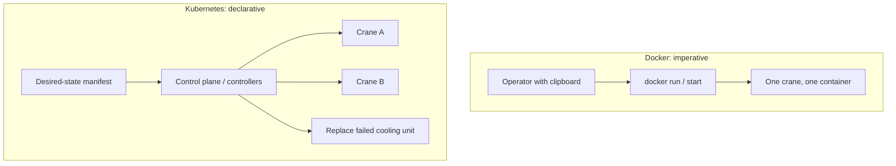
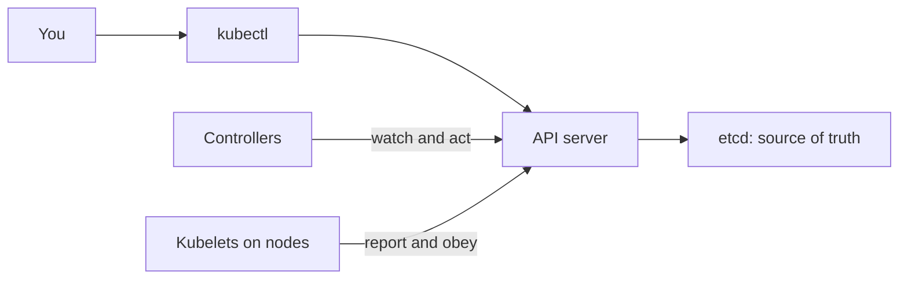
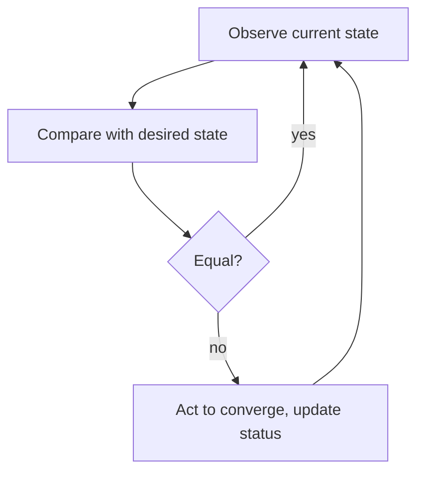
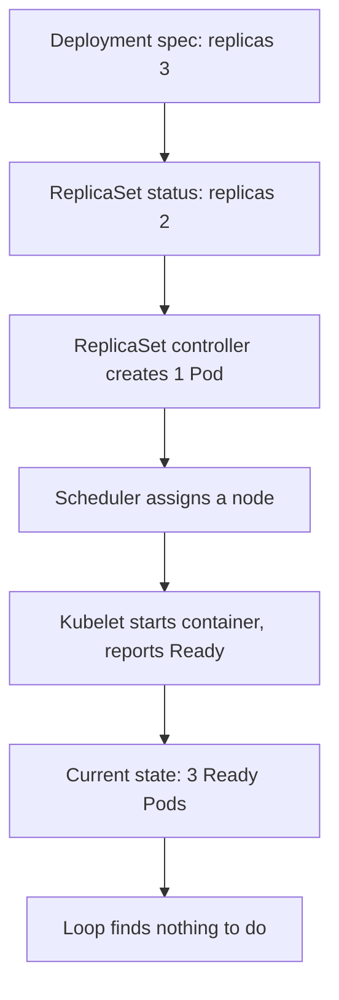
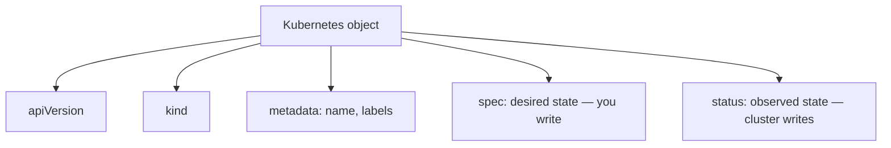

# Chapter 11 — Introduction to Kubernetes

> **Learning Objectives**
>
> By the end of this chapter, you will be able to:
>
> - Say which problems Kubernetes solves that Docker on one machine cannot
> - Tell the difference between giving commands and writing down what you want
> - Explain the repeating loop that lets Kubernetes fix things without you
> - Use the core words — cluster, node, control plane, Pod, object, controller — correctly
> - Build a local Kubernetes 1.36 cluster with kind and talk to it using `kubectl`
> - Run the Task API twice: once by command, once from a file you keep in Git
> - Name the jobs Kubernetes deliberately leaves to you

---

## 11.1 Three in the morning

Alex's phone buzzes at 03:12. The Task API is down. That is the small Flask service you packaged back in Chapter 04. A machine rebooted after a kernel update, and the container never came back. Alex logs in over SSH, runs `docker start task-api`, and goes back to bed.


*Figure 11.A: Kubernetes is the control tower that keeps many cranes moving toward declared desired state.*

At 03:40 the phone buzzes again. Different machine. Same story.

Nothing here is mysterious. The container worked. The image was fine. What was wrong is *how the service was operated*. Only one part of the system knew the Task API was supposed to be running, and that part was a person. Docker did exactly what it was told: start this container, once. Nothing more.

Now make it bigger. Forty services. Twelve machines. Traffic that triples in an hour on launch day. A bad release that must be undone without dropping requests. A machine that dies and never comes back. Each of those moments needs a decision. Decisions made by a tired human at 3 a.m. are usually bad decisions.

**Container orchestration** means handing those decisions to software instead of a person. **Kubernetes** is the orchestrator the industry settled on. People also write it **K8s** — the letter "K", then eight letters, then "s". This chapter is where your Docker knowledge starts paying off.

### The harbor master analogy

Picture a busy shipping port. Containers arrive by the thousand. Nobody wants a person running between cranes, shouting which box goes on which berth.

Instead the port has a **harbor master**, the one person who holds the written plan. The plan says: *"There must always be three refrigerated containers on the north dock, held at 4 °C."* Cranes, trucks, and cooling units get sent out automatically so reality matches that plan. If a cooling unit fails, the harbor master moves the container to a working berth. Nobody files a request first.

Kubernetes is that harbor master. You do not list the steps. You describe the **desired state**, which is the condition you want the system to be in. Kubernetes then works nonstop to make the world match your description. That one idea carries the rest of this book.

> 💡 **In one line:** You write down the state you want; Kubernetes keeps working until the cluster looks like that.



*Figure 11.1: Docker runs one command once; Kubernetes declares desired state and controllers converge the port continuously.*

---

## 11.2 What orchestration actually buys you

### In plain terms

**Orchestration** is software that decides where your containers run, restarts them when they die, and keeps the right number of copies alive. It watches many machines at once and takes action on its own.

Here is the problem it solves. Every restart, every choice of machine, every scale-up, and every rollback is a *decision*. On one machine you can make those decisions yourself. Across dozens of services and machines, you cannot. There are too many, they come at bad hours, and forgetting one causes an outage.

Think of it as the difference between hiring a contractor for one afternoon and hiring a building superintendent. The contractor does exactly what you ask, when you ask. The superintendent keeps the building in the agreed condition forever. He notices broken things before you do and fixes them without a conversation.

An orchestrator answers questions you would otherwise answer by hand:

| Question at 3 a.m. | Who answers it in Kubernetes |
|--------------------|------------------------------|
| The container exited. Who restarts it? | The kubelet, guided by the Pod's restart policy |
| This machine is gone. Who moves its work? | The node lifecycle and workload controllers, plus the scheduler |
| Traffic tripled. Who runs more copies? | A Deployment plus a HorizontalPodAutoscaler |
| Where should this new copy run? | The scheduler, using resource requests and constraints |
| How do callers find the healthy copies? | A Service, backed by EndpointSlices and cluster DNS |
| The new version is broken. Who rolls back? | The Deployment controller, from its revision history |

> ⚠️ **Common Pitfall:** You might think Kubernetes replaces Docker. It does not—you still build OCI images; Kubernetes schedules and runs them through a CRI runtime. Orchestration sits *above* containers.

### Under the hood

Here is what actually runs inside a cluster. Kubernetes is not one program. It is a small set of cooperating components plus many independent **controllers**, all coordinating through one shared, versioned datastore reached via one HTTP API.



*Figure 11.2: Every change flows through the API server; etcd holds truth while controllers and kubelets watch and act.*

Three properties come out of that design, and they explain most of what Kubernetes does:

1. **Everything is an object in the API.** Pods, Services, Secrets, even node heartbeats. If you can `GET` it, you can watch it, and if you can watch it, you can automate it.
2. **Nothing calls anything else directly.** Controllers do not call the scheduler. They write objects and let the scheduler notice. Because the parts are kept apart this way (**decoupling**), Kubernetes keeps working when a component restarts.
3. **Work is level-triggered, not edge-triggered.** Components look at the current state and work out what to do, instead of following a stream of events they must never miss. A missed event is not a disaster; the next check fixes it.

You will trace all of this concretely in Chapter 12.

### In production

Orchestration is not free, and teams get hurt when they pretend it is. Running Kubernetes means taking on four new jobs:

- **A second place things can break.** Your app can fail *and* the platform can fail. You must be able to tell which one broke (Chapter 22).
- **Capacity discipline.** Requests and limits are the numbers the scheduler uses to place work. Skip them and Pods get evicted for reasons nobody can explain (Chapter 13).
- **A regular upgrade habit.** Kubernetes ships about three minor releases a year and supports roughly the last four. This book targets **1.36**, with 1.33–1.36 as the practical support window. A cluster is a living system, not an appliance you install once.
- **Configuration kept as code.** If your cluster state only exists in your shell history, you have rebuilt the 3 a.m. problem with more moving parts.

A useful rule: pick Kubernetes when you have **many services, more than one machine, and real uptime expectations**. One container on one small VM belongs on plain Docker or a managed container service. Choosing the boring option there shows experience, not the lack of it.

> ⚠️ **Common Pitfall:** Adopting Kubernetes for a single container on one VM "to learn production." You learn the control plane's failure modes without the problems orchestration solves—prefer a real multi-service need, or keep the learning cluster explicitly non-production.

**Before you leave this section**

- **Understand:** Orchestration answers restart, place, scale, discover, and roll back—without a human clipboard.
- **Try:** Map each 3 a.m. question in the table to a later chapter you will open.
- **Watch in prod:** Teams running Kubernetes without requests, without Git, and without an upgrade plan.

---

## 11.3 Imperative and declarative

### In plain terms

**Imperative** means you give step-by-step commands: do this, then this. **Declarative** means you describe the end result you want and let the system work out the steps.

Why does this matter? Because commands are forgotten and results are remembered. When you write down the result, the cluster keeps that promise even after you close your laptop. When you only run commands, the knowledge lives in your head and in your shell history. That is the difference between a note nobody can find and a reviewed file in Git.

Here is the everyday version. Imperative is a *recipe*: "boil water, add pasta, drain after nine minutes." Declarative is an *order*: "I would like a plate of pasta, al dente." The recipe tells someone what to do. The order tells them what you want, and lets them handle the surprises — including the water boiling over.

With Docker you were imperative:

```bash
$ docker run -d -p 8000:8000 ghcr.io/mastering-k8s/task-api:1.0
$ docker stop task-api
$ docker rm task-api
```

Each command happens once, right now. The fact that "this service should be running" lives only in your head.

With Kubernetes you write down what you want, and the cluster keeps that promise:

```yaml
# Plain English version of a manifest:
# "There should always be three healthy copies of task-api:1.0."
```

> ⚠️ **Common Pitfall:** You might think imperative `kubectl run` is "just as good" if you write it down in a wiki. Wikis drift; `apply` from Git is the auditable desired state.

### Under the hood

Here is what the cluster stores in each case. Kubernetes accepts both styles, and the difference shows up in what gets remembered.

| Style | Command examples | What the cluster remembers |
|-------|------------------|----------------------------|
| Imperative commands | `kubectl run`, `kubectl scale`, `kubectl delete` | The resulting object, with no record of your intent |
| Imperative object config | `kubectl create -f file.yaml` | The object; fails if it already exists |
| Declarative object config | `kubectl apply -f file.yaml` | The object **plus** a record of the fields you claim to manage |

That last row is the important one. `kubectl apply` merges three things: your file, the live object, and the fields you managed the last time you applied. Those managed fields are recorded in `metadata.managedFields`, and the mechanism is called **server-side apply**. Because your intent is on record, `apply` can tell "you deleted this field" apart from "you never set this field." It also leaves fields owned by someone else alone — an autoscaler, or a policy that edits objects on the way in.

Run the same command twice and watch the verb change:

```bash
$ kubectl apply -f task-api-pod.yaml
```

```text
pod/task-api created
```

```bash
$ kubectl apply -f task-api-pod.yaml
```

```text
pod/task-api unchanged
```

> 💡 **Tip:** Use imperative commands to *learn* and to *generate*, not to operate. `kubectl create deployment task-api --image=ghcr.io/mastering-k8s/task-api:1.0 --dry-run=client -o yaml > deploy.yaml` gives you a valid starting manifest in one line, which you then edit, review, and commit.

### In production

Writing config declaratively is what makes every good cluster practice possible:

- **Code review for infrastructure.** A YAML diff in a pull request can be audited later. A Slack message saying "I scaled it" cannot.
- **Disaster recovery.** If your manifests are in Git, rebuilding a lost cluster takes an afternoon instead of a dig through history.
- **GitOps.** Tools such as Argo CD and Flux keep applying a Git repository to a cluster and report any **drift**, meaning differences between Git and the live cluster. This only works when Git is the source of truth.
- **Safe collaboration.** Server-side apply lets several controllers own different fields of the same object without overwriting each other.

> ⚠️ **Warning:** `kubectl edit` and `kubectl scale` change the cluster but not your files. The next `apply` will silently revert your change, usually at the worst possible moment. Treat live edits as emergency surgery: allowed, then immediately reflected back into the repository.

> 🏭 **Production floor:** Declarative Git is the audit trail. If an incident fix only exists as `kubectl edit`, the next apply or the next on-call will undo it. Paste the PR link and the `kubectl apply` revision into the ticket—not "I fixed it on the cluster."

**Before you leave this section**

- **Understand:** `apply` records managed fields; imperative edits fight Git.
- **Try:** Apply the same manifest twice and watch `created` vs `unchanged`.
- **Watch in prod:** Live edits that never land back in the repository.

---

## 11.4 The reconciliation loop

### In plain terms

A **reconciliation loop** is a small program that keeps comparing what you asked for with what exists, and then fixes the difference. In Kubernetes, each of these programs is called a **controller**.

Why should you care? Because this loop is the reason Kubernetes seems to repair itself. Nobody watches for a dead container and types a restart command. A loop notices the gap and closes it, at 3 a.m., without being asked.

A thermostat works the same way. You set 21 °C. It measures the room, compares, and acts — over and over, forever. It does not care *why* the room got cold: an open window, a broken radiator, winter. It only cares that reality differs from the setting. Kubernetes is built almost entirely out of thermostats.

> 💡 **In one line:** A controller loops forever: look at reality, compare it to your `spec`, and change reality until they match.

### Under the hood

Here is the loop each controller actually runs:

1. **Observe** current state (by watching the API server).
2. **Compare** it to desired state (the `spec` you wrote).
3. **Act** to close the gap (create, update, or delete objects).
4. **Report** what it sees in `status`.
5. Repeat forever.



*Figure 11.3: The reconciliation loop observes, compares, and acts until current state matches desired state.*

A concrete trace, in the language of objects:



*Figure 11.4: Self-healing is reconciliation: a shortfall becomes one new Pod without a human restart command.*

Nobody typed a "restart" command. One controller noticed it was one Pod short and wrote one object. That is why Kubernetes looks like it heals itself. Self-healing is just reconciliation happening while you were not watching.

### In production

The loop changes how you debug and how you design:

- **Read `status`, not just logs.** `kubectl describe` and `kubectl get -o yaml` show what the controller in charge believes. Conditions such as `Available`, `Progressing`, and `Ready` tell you where the loop is stuck.
- **Expect "soon," not "instantly."** Reconciliation happens in the background. "I applied it and nothing happened" usually means "wait a few seconds, then read the events."
- **Never fight a controller.** Deleting a Pod that a Deployment owns just gets you a new Pod. Change the desired state instead.
- **Fix causes, not symptoms.** If Pods restart over and over, the loop is doing its job correctly and your container is not.

> 💡 **Tip:** Whenever something in the rest of this book "just fixes itself," pause and name the controller responsible. That habit turns Kubernetes from magic into mechanism.

> ⚠️ **Common Pitfall:** Deleting a Pod owned by a Deployment and celebrating "I fixed it" when a replacement appears. You exercised reconciliation; you did not change desired state. Edit the Deployment (or scale) if the intent changed.

**Before you leave this section**

- **Understand:** Controllers observe, compare, act, and write status—forever.
- **Try:** Delete a Deployment-owned Pod and name the controller that recreates it.
- **Watch in prod:** Humans fighting controllers instead of changing `spec`.

---

## 11.5 The vocabulary, and the shape of every object

### In plain terms

Kubernetes has many words but very few rules for putting them together. Nine words carry you through most conversations, and you will meet each one again in its own chapter.

Learn these nine now and the rest of the book stops sounding like code names. Every one of them is an **object**, which is simply a record the cluster stores for you.

| Term | One-line meaning | Covered in |
|------|------------------|------------|
| **Cluster** | A set of machines managed as one pool | Chapter 12 |
| **Node** | One machine (VM or physical) in that pool | Chapter 12 |
| **Control plane** | The brain: API server, scheduler, controllers, datastore | Chapter 12 |
| **Pod** | Smallest deployable unit: one or more containers sharing a network and storage | Chapter 13 |
| **Object** | A persisted record of intent plus observed state | This chapter |
| **Controller** | A loop driving current state toward desired state | This chapter, Chapter 14 |
| **Deployment** | Controller for stateless replicas and rollouts | Chapter 14 |
| **Service** | A stable network identity for a set of Pods | Chapter 15 |
| **Namespace** | A virtual sub-cluster for grouping and isolating objects | Chapter 12 |

> ⚠️ **Common Pitfall:** You might think a Pod is just another name for a container. A Pod *holds* one or more containers and gives them a shared network address and shared storage. Chapter 13 shows why that difference matters.

### Under the hood

Here is the shape every object shares. A one-line ConfigMap and a sprawling StatefulSet both have the same four fields you write, plus one you never write:

```yaml
apiVersion: v1        # which API group and version defines this kind
kind: Pod             # what kind of object this is
metadata:             # identity: name, namespace, labels, annotations
  name: task-api
  labels:
    app: task-api
spec:                 # DESIRED state — you write this
  containers:
    - name: task-api
      image: ghcr.io/mastering-k8s/task-api:1.0
# status:             # OBSERVED state — Kubernetes writes this
```

Learn to read that shape and you can read any manifest — even ones for resource types that do not exist yet. Custom resources added by operators follow exactly the same four-field pattern.



*Figure 11.5: Every object shares the same grammar: identity in metadata, intent in spec, observation in status.*

`kubectl explain` is the built-in field reference. It is generated from the API your cluster actually serves, so it never goes out of date:

```bash
$ kubectl explain pod.spec.containers.image
```

```text
KIND:       Pod
VERSION:    v1

FIELD: image <string>

DESCRIPTION:
    Container image name. More info:
    https://kubernetes.io/docs/concepts/containers/images
    This field is optional to allow higher level config management to default or
    override container images in workload controllers like Deployments and
    StatefulSets.
```

### In production

- **A name is an identity.** Inside one namespace and kind, `metadata.name` is unique and cannot be changed. Renaming means delete and recreate. For a Service that means a new set of endpoints; for a StatefulSet it means new Pod identities.
- **Labels are how everything finds everything.** Services pick Pods by label, controllers own Pods by label, and dashboards group by label. Agree on a label scheme (`app`, `component`, `part-of`, `env`, `version`) on day one. Adding labels later is slow, manual work.
- **Annotations are for tools.** Anything that does not identify the object — checksums, controller hints, change-cause notes — belongs in annotations. Nothing selects objects by annotation.

> 📘 **Deep Dive (optional):** The `apiVersion` field encodes a group and a version, such as `apps/v1` (group `apps`) or plain `v1` (the legacy core group, whose group name is the empty string). Groups let Kubernetes evolve independently in different areas, and versions (`v1alpha1` → `v1beta1` → `v1`) encode stability promises. This book uses GA (`v1`) APIs everywhere; Chapter 12 shows how to list what your cluster serves.

**Before you leave this section**

- **Understand:** Every object shares apiVersion/kind/metadata/spec; status is observed.
- **Try:** `kubectl explain pod.spec.containers.image` on your cluster.
- **Watch in prod:** Label schemes that differ per team and break Service selectors.

---

## 11.6 A local cluster with kind

### In plain terms

**kind** is a tool that runs a full Kubernetes cluster on your own machine, using Docker containers as the cluster's machines. The name stands for "Kubernetes IN Docker."

You need this because you cannot learn Kubernetes by reading. You need a cluster you can break, delete, and rebuild in a minute, without a cloud bill. Several tools do this:

- **kind** — Each node is a Docker container. Fast, throwaway, and good for CI.
- **minikube** — A cluster in a VM or container, with many add-ons included.
- **k3d / k3s** — A small certified distribution, popular for edge and small clusters.
- **Docker Desktop** — A single-node Kubernetes you switch on in settings.

This book uses **kind**. You already have Docker Engine 29.x from Part I, and kind needs nothing else.

### Under the hood

You need two programs: `kubectl` (the client you type commands into) and `kind` (the tool that builds the cluster).

```bash
$ curl -LO "https://dl.k8s.io/release/v1.36.1/bin/linux/amd64/kubectl"
$ sudo install -m 0755 kubectl /usr/local/bin/kubectl
$ kubectl version --client
```

```text
Client Version: v1.36.1
Kustomize Version: v5.7.1
```

```bash
$ go install sigs.k8s.io/kind@v0.32.0    # or download the release binary
$ kind version
```

```text
kind v0.32.0 go1.25.3 linux/amd64
```

Create a three-node cluster — one control plane and two workers — so later chapters can show scheduling, DaemonSets, and topology:

```yaml
# kind-cluster.yaml
kind: Cluster
apiVersion: kind.x-k8s.io/v1alpha4
name: mastering-k8s
nodes:
  - role: control-plane
  - role: worker
  - role: worker
```

```bash
$ kind create cluster --config kind-cluster.yaml --image kindest/node:v1.36.0
```

```text
Creating cluster "mastering-k8s" ...
 ✓ Ensuring node image (kindest/node:v1.36.0) 🖼
 ✓ Preparing nodes 📦 📦 📦
 ✓ Writing configuration 📜
 ✓ Starting control-plane 🕹️
 ✓ Installing CNI 🔌
 ✓ Installing StorageClass 💾
 ✓ Joining worker nodes 🚜
Set kubectl context to "kind-mastering-k8s"
You can now use your cluster with:

kubectl cluster-info --context kind-mastering-k8s
```

```bash
$ kubectl get nodes
```

```text
NAME                          STATUS   ROLES           AGE   VERSION
mastering-k8s-control-plane   Ready    control-plane   71s   v1.36.0
mastering-k8s-worker          Ready    <none>          58s   v1.36.0
mastering-k8s-worker2         Ready    <none>          58s   v1.36.0
```

How did `kubectl` know where the cluster is? It read a **kubeconfig** file, the file that lists clusters and login credentials (by default `~/.kube/config`). A **context** is one named pairing of a cluster and a credential. kind added a context for your new cluster and made it the active one.

```bash
$ kubectl config current-context
```

```text
kind-mastering-k8s
```

> 💡 **Tip:** kind pins node images by digest in its release notes, and newer patch images (for example `kindest/node:v1.36.1`) appear over time. Pinning `--image kindest/node:v1.36.0@sha256:…` in CI makes cluster creation reproducible; the plain tag is fine while learning.

### In production

Your laptop cluster is a place to learn, not a small production cluster. Real clusters differ in ways worth knowing now:

| Concern | kind on a laptop | Production |
|---------|------------------|------------|
| Control plane | One container, no redundancy | Three or more replicas, etcd quorum, backups |
| Node lifecycle | You delete the cluster | Autoscaling groups, drain and cordon procedures |
| Load balancers | `Service type: LoadBalancer` stays `<pending>` | Cloud controller provisions a real load balancer |
| Storage | Local path provisioner | CSI drivers with real disks and snapshots |
| Access control | Your kubeconfig is cluster-admin | RBAC per team, short-lived credentials (Chapter 21) |

Start one habit today: check `kubectl config current-context` before you run anything that deletes or changes things. "I thought I was on staging" is the most expensive sentence in cluster operations.

> ⚠️ **Common Pitfall:** Treating kind as a tiny production cluster—single control plane, no real LB, local storage. Use it to learn APIs; do not invent HA stories from it.

**Before you leave this section**

- **Understand:** kind gives a real 1.36 API on your laptop; contexts select clusters.
- **Try:** Create the three-node kind cluster and verify `kubectl get nodes` shows v1.36.0.
- **Watch in prod:** Wrong-context deletes; pin kind node image digests in CI.

---

## 11.7 Your first workload, twice

### In plain terms

You will now run the Task API twice. First the quick command-driven way, so you see something work in ten seconds. Then the file-driven way, which is how the rest of the book works.

Doing it twice is the point. The first version teaches you the shape of a Pod. The second version teaches you the habit you will keep for the next twenty chapters.

### Under the hood

Here is the quick way first. **Imperatively**, one command creates a Pod:

```bash
$ kubectl run task-api --image=ghcr.io/mastering-k8s/task-api:1.0 --port=8000
```

```text
pod/task-api created
```

```bash
$ kubectl get pods
```

```text
NAME       READY   STATUS    RESTARTS   AGE
task-api   1/1     Running   0          14s
```

A Pod's IP address only works inside the cluster network. To reach it from your laptop, open a temporary tunnel:

```bash
$ kubectl port-forward pod/task-api 8000:8000
```

```text
Forwarding from 127.0.0.1:8000 -> 8000
Forwarding from [::1]:8000 -> 8000
```

In a second terminal:

```bash
$ curl -s localhost:8000/healthz
```

```text
{"status":"ok"}
```

Clean up, then do it properly:

```bash
$ kubectl delete pod task-api
```

```text
pod "task-api" deleted
```

**Declaratively**, write the manifest down:

```yaml
# task-api-pod.yaml
apiVersion: v1
kind: Pod
metadata:
  name: task-api
  labels:
    app: task-api
spec:
  containers:
    - name: task-api
      image: ghcr.io/mastering-k8s/task-api:1.0
      ports:
        - name: http
          containerPort: 8000
      env:
        - name: LOG_LEVEL
          value: "info"
```

```bash
$ kubectl apply -f task-api-pod.yaml
```

```text
pod/task-api created
```

Now add a label to the file and apply the *same command*:

```yaml
metadata:
  name: task-api
  labels:
    app: task-api
    tier: backend      # newly added
```

```bash
$ kubectl apply -f task-api-pod.yaml
```

```text
pod/task-api configured
```

The verb changed from `created` to `configured`. Kubernetes worked out the difference and changed only that. Now look at what it recorded, including the `status` you never wrote:

```bash
$ kubectl get pod task-api -o wide
```

```text
NAME       READY   STATUS    RESTARTS   AGE   IP           NODE                   NOMINATED NODE   READINESS GATES
task-api   1/1     Running   0          49s   10.244.1.4   mastering-k8s-worker   <none>           <none>
```

```bash
$ kubectl describe pod task-api
```

```text
Name:             task-api
Namespace:        default
Node:             mastering-k8s-worker/172.18.0.3
Labels:           app=task-api
                  tier=backend
Status:           Running
IP:               10.244.1.4
Containers:
  task-api:
    Image:          ghcr.io/mastering-k8s/task-api:1.0
    Port:           8000/TCP
    State:          Running
    Ready:          True
    Restart Count:  0
Events:
  Type    Reason     Age   From               Message
  ----    ------     ----  ----               -------
  Normal  Scheduled  50s   default-scheduler  Successfully assigned default/task-api to mastering-k8s-worker
  Normal  Pulled     49s   kubelet            Container image "ghcr.io/mastering-k8s/task-api:1.0" already present on machine
  Normal  Created    49s   kubelet            Created container: task-api
  Normal  Started    49s   kubelet            Started container task-api
```

When something goes wrong, read the **Events** block from the bottom up. It is the cluster telling you, in order, what it tried to do.

> ⚠️ **Warning:** A bare Pod is not self-healing. Delete it, or lose its node, and nothing brings it back — no controller ever recorded that it should exist. Production workloads are wrapped in a Deployment (Chapter 14). We used a raw Pod here to keep the first example honest and minimal.

### In production

This same workload, shaped for production, gains four things you will add over the next few chapters. A **Deployment** for copies and rollouts. A **Service** for a stable address. **Probes** so traffic only reaches healthy Pods. And **resource requests** so the scheduler knows how much room the Pod needs. The manifest you just wrote is the seed of all four.

Two habits to start now:

- **Keep manifests in Git next to the app.** The image tag and the manifest that deploys it should be reviewed in the same pull request.
- **Pin image tags.** With `:latest`, two nodes can run two different builds of "the same" version, and a rollback no longer means anything. This book always pins (`:1.0`). Digests (`@sha256:…`) are better still.

> 🏭 **Production floor:** Never leave bare Pods as the production shape—wrap them in a Deployment (Chapter 14). Pin images by **digest** for regulated paths: PR → scan → promote digest → apply → rollback to the previous digest. Paste digest and context name into the incident ticket.

**Before you leave this section**

- **Understand:** Imperative Pods teach; declarative controllers last.
- **Try:** Delete a bare Pod and confirm nothing replaces it; then try the same with a Deployment.
- **Watch in prod:** `:latest` tags and unmanaged Pods in app namespaces.

---

## 11.8 What Kubernetes is not

Knowing the limits up front prevents both disappointment and bad design:

- **Not a PaaS.** Kubernetes will not build your image, pick your database, or give you `git push` deploys. Those come from layers built on top (Helm in Chapter 23, CI in Chapter 24).
- **Not a fix for bad code.** A service that leaks memory gets restarted forever. That turns a bug into an outage with extra steps.
- **Not a security wall on its own.** Containers still share one kernel, Pods can still run as root, and a namespace is not a separate tenant. Chapters 19 and 21 cover what you must add.
- **Not a replacement for running databases carefully.** You *can* run databases on Kubernetes (Chapters 14 and 18), but the operational work does not disappear.
- **Not the simplest choice for something small.** One container on one VM does not need a control plane.

---

## 11.9 Common pitfalls

> ⚠️ **Common Pitfall:** **Running against the wrong cluster.** `kubectl` targets whatever context is active. Check `kubectl config current-context` before destructive commands, and consider a shell prompt that shows the context.

> ⚠️ **Common Pitfall:** **Creating bare Pods in production.** Unmanaged Pods do not reschedule after node failure. Use a Deployment (or another controller) so a loop owns the promise.

> ⚠️ **Common Pitfall:** **Editing live objects and forgetting the file.** `kubectl edit` changes the cluster only. The next `apply` reverts it. Push emergency edits back into Git the same day.

> ⚠️ **Common Pitfall:** **Using `:latest` tags.** Non-reproducible rollouts, meaningless rollbacks, and cache-dependent behavior. Pin versions.

> ⚠️ **Common Pitfall:** **Expecting Pod IPs to work from your laptop.** They are cluster-internal. Use `kubectl port-forward` for a peek and a Service or Ingress for real access (Chapters 15 and 16).

> ⚠️ **Common Pitfall:** **Assuming `apply` is instant.** It records intent; controllers converge afterward. Watch with `kubectl get pods -w` and read events instead of re-applying in frustration.

---

## 11.10 Hands-on exercises

1. **Build the cluster.** Create the three-node kind cluster from §11.6 with `kindest/node:v1.36.0`. Run `kubectl get nodes -o wide` and record each node's internal IP, OS image, and container runtime version.
2. **Apply and read status.** Apply `task-api-pod.yaml`, then run `kubectl get pod task-api -o yaml`. List five fields under `status` that you never wrote, and say which component you think set each one.
3. **Prove the limits of a bare Pod.** Delete the Pod with `kubectl delete pod task-api` and confirm with `kubectl get pods` that nothing replaces it. Write one sentence explaining this in terms of reconciliation.
4. **Generate, then commit.** Run `kubectl create deployment task-api --image=ghcr.io/mastering-k8s/task-api:1.0 --dry-run=client -o yaml > task-api-deploy.yaml`. Which of the four top-level fields are present? Apply it, run `kubectl get pods`, then delete the Deployment.
5. **Read a failure.** Apply a Pod whose image tag does not exist (`ghcr.io/mastering-k8s/task-api:does-not-exist`). Record the `STATUS` from `kubectl get pods` and the exact Event message from `kubectl describe pod` that explains the problem.
6. **Watch a loop.** With the generated Deployment running, run `kubectl get pods -w` in one terminal and `kubectl delete pod <one-pod-name>` in another. Describe what you observe and name the controller responsible.
7. **Extend the analogy.** In three sentences, describe what the harbor master does when you change the manifest from three refrigerated containers to five, and map each step to observe / compare / act.

---

## 11.11 Check Your Understanding

**Q1.** State the central idea of Kubernetes in one sentence.

<details>
<summary>Show answer</summary>

You declare the desired state of your workloads as objects in the API, and controllers run a continuous reconciliation loop that drives the cluster's current state toward that desired state.

</details>

**Q2.** Why is `kubectl apply` preferred over `kubectl create` for anything long-lived?

<details>
<summary>Show answer</summary>

`apply` is declarative and idempotent: it merges your manifest with the live object and records which fields you manage, so repeated runs are safe, updates work, and other controllers can own other fields. `create` is a one-shot imperative action that fails when the object exists, which makes it a poor fit for version-controlled workflows.

</details>

**Q3.** A bare Pod was running on a node that crashed. What happens, and why?

<details>
<summary>Show answer</summary>

The Pod is gone and is not recreated. No controller ever recorded that a replacement should exist, so no reconciliation loop notices a gap. A Deployment (through its ReplicaSet) would observe a shortfall in replicas and create a new Pod on a healthy node.

</details>

**Q4.** Which top-level field do you never write, and who writes it?

<details>
<summary>Show answer</summary>

`status`. Kubernetes components write it — controllers and the kubelet report observed state there. You write `apiVersion`, `kind`, `metadata`, and `spec`.

</details>

**Q5.** Name three problems orchestration solves that single-host Docker does not.

<details>
<summary>Show answer</summary>

Any three of: restarting and rescheduling workloads after container or machine failure; scaling replicas and load-balancing across them; zero-downtime rollouts with rollback; placing workloads across many machines according to available resources; providing stable network identities and service discovery; keeping desired state recorded so nothing depends on a human remembering it.

</details>

**Q6.** Why is level-triggered reconciliation more robust than reacting to a stream of events?

<details>
<summary>Show answer</summary>

Because controllers re-derive the correct action from the current state instead of depending on having seen every event. A dropped or duplicated event, a controller restart, or a network blip cannot leave the system permanently wrong: the next sync recomputes the gap and closes it.

</details>

**Q7.** You applied a manifest and nothing seems to have happened. What are the first two things to check?

<details>
<summary>Show answer</summary>

First, confirm you targeted the intended cluster and namespace (`kubectl config current-context`, `kubectl get pods -n <namespace>`). Second, read observed state and events (`kubectl describe …`), because reconciliation is asynchronous and the reason for a stall — image pull failure, unschedulable Pod, quota rejection — is almost always in the events or in a status condition.

</details>

---

## 11.12 Key takeaways

- Something has to hold the promise "this should be running." A human at 3 a.m. is the wrong something.
- Kubernetes is **declarative**: you write `spec`, controllers write `status`, and a loop closes the gap forever.
- Self-healing is not magic. It is that loop, running while you are not looking.
- Every object has the same four fields you write — `apiVersion`, `kind`, `metadata`, `spec` — so reading one manifest teaches you to read all of them.
- Use `kubectl apply` with files in Git. Use imperative commands to explore and to generate YAML, not to operate.
- **kind** gives you a real multi-node Kubernetes 1.36 cluster on a laptop. Check your context before every risky command.
- Bare Pods are for learning. Controllers are for production, plus Services, probes, and resource requests.
- Kubernetes is not a PaaS, not a security wall by itself, and not a cure for bad application design.

---

## 11.13 Official documentation map

| Topic | Official page |
|-------|---------------|
| What Kubernetes is | [Overview](https://kubernetes.io/docs/concepts/overview/) |
| Cluster components | [Kubernetes Components](https://kubernetes.io/docs/concepts/overview/components/) |
| The API and objects | [The Kubernetes API](https://kubernetes.io/docs/concepts/overview/kubernetes-api/) |
| Controllers and reconciliation | [Controllers](https://kubernetes.io/docs/concepts/architecture/controller/) |
| Installing `kubectl` and friends | [Install Tools](https://kubernetes.io/docs/tasks/tools/) |
| Local and production setup options | [Getting started](https://kubernetes.io/docs/setup/) |
| Declarative management | [Server-Side Apply](https://kubernetes.io/docs/reference/using-api/server-side-apply/) |
| Object management styles | [Managing Kubernetes Objects](https://kubernetes.io/docs/concepts/cluster-administration/manage-deployment/) |
| Guided walkthrough | [Kubernetes Basics tutorial](https://kubernetes.io/docs/tutorials/kubernetes-basics/) |
| Port forwarding for local access | [Use Port Forwarding](https://kubernetes.io/docs/tasks/access-application-cluster/port-forward-access-application-cluster/) |
| kind quick start | [kind — Quick Start](https://kind.sigs.k8s.io/docs/user/quick-start/) |
| Release notes for this baseline | [Kubernetes v1.36 release announcement](https://kubernetes.io/blog/2026/04/22/kubernetes-v1-36-release/) |

---

**Previous:** [Chapter 10 — Docker Security Basics](10-docker-security-basics.md) | **Next:** [Chapter 12 — Kubernetes Architecture](12-k8s-architecture.md)
