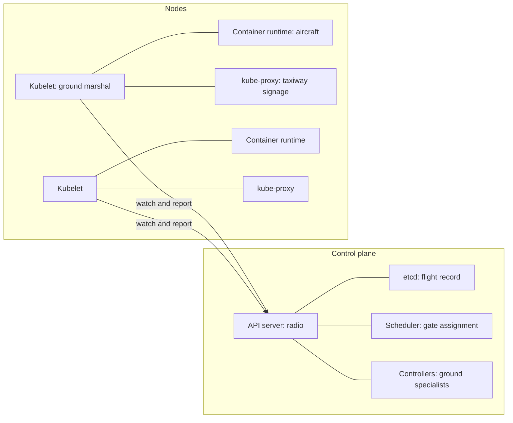
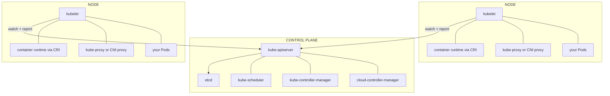
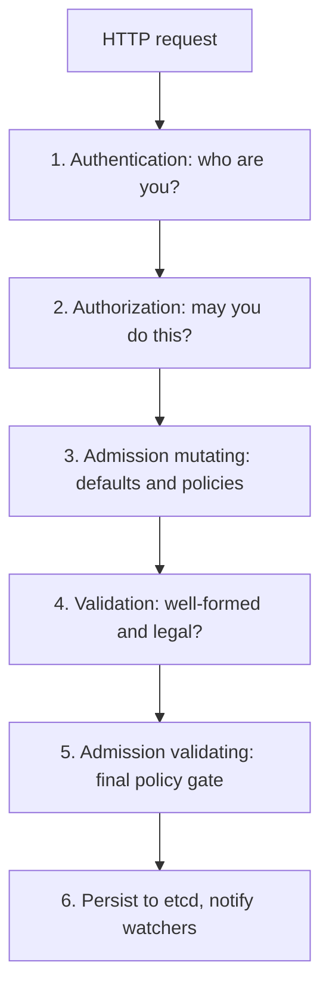
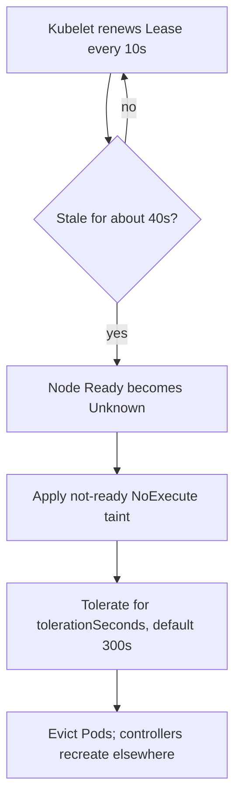
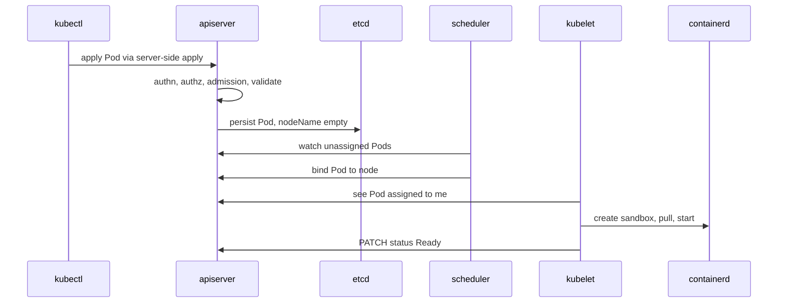

# Chapter 12 — Kubernetes Architecture

> **Learning Objectives**
>
> By the end of this chapter, you will be able to:
>
> - Draw the two halves of a cluster — control plane and nodes — and say what runs in each
> - Say what the API server, etcd, scheduler, controller manager, and cloud controller manager each do
> - Explain how the kubelet, the container runtime (through the CRI), and kube-proxy turn your files into running programs
> - Explain how a node proves it is still alive with a Lease, and where leader-election Leases live
> - Follow one `kubectl apply` from your terminal to a running container, naming each part it touches
> - Use namespaces, labels, and selectors on purpose, including the four namespaces every cluster starts with
> - Explain owner references, and how deleting a parent cleans up its children
> - Find out which API groups and versions your own cluster offers

---

## 12.1 The control tower

An airport does not run on brave individuals. It runs on a control tower, one shared radio frequency, and a written record of every flight.

Pilots do not argue with each other about runways. They all talk to one authority. That authority keeps the official record: which aircraft exists, where it is going, which gate it got. Every specialist — ground crew, de-icing, baggage — reads that record and does one narrow job well.

Nobody phones anybody. If the de-icing crew takes a break, planes still land. The work just sits in the record until someone picks it up.

Kubernetes is built the same way, and it gets the same payoff. Parts can restart, fall behind, or be swapped out, and the airport stays open.

- The **radio frequency** is the API server. It is the *only* way in.
- The **written record** is etcd. It is the *only* source of truth.
- The **specialists** are the scheduler, the controllers, and the kubelet on every machine. Each one watches the record and does one job.

Chapter 11 gave you the idea: you declare state, and controllers make it real. This chapter opens the machine and shows you the parts. From here on, most debugging boils down to one question: *which part is unhappy?*



*Figure 12.1: Control plane decides through the API server and etcd; nodes dial out via kubelet, runtime, and kube-proxy.*

---

## 12.2 The two halves of a cluster

### In plain terms

A **cluster** is a group of machines managed as one pool. Every machine in it plays one of two roles.

- The **control plane** decides. It takes your requests, stores them, and works out what must happen.
- The **nodes** do the work. They run your containers and report back. Together the nodes are also called the **data plane**.

Why split them? Because deciding and doing have very different needs. Deciding must stay available and consistent even when machines die. Doing needs CPU and memory, and it is where your risky code runs. Keeping them apart means a badly behaved app cannot starve the part of the cluster that thinks.

A **node** is one machine in the pool. It can be a cloud VM, a physical server, or — in kind — a Docker container. Small clusters sometimes run the control plane and your workloads on the same machines. Production clusters usually keep the control plane on separate machines.

> 💡 **In one line:** The control plane decides what should run; nodes are the machines that actually run it.

### Under the hood

Here is what actually sits on each machine.



*Figure 12.2: Everything goes through the API server; nodes initiate contact and run Pods under the kubelet.*

Two rules explain almost everything a cluster does:

1. **Everything goes through the API server.** The scheduler does not call the kubelet. Controllers do not call each other. They read and write objects instead. The API server is the hub; every component is a spoke.
2. **Nodes start the conversation.** Kubelets call out to the API server, never the other way around. That is why nodes behind NAT work fine. It is also why the API server needs its own credentials to reach a kubelet, which it does for `kubectl logs` and `kubectl exec` — the two exceptions.

On your kind cluster you can see both halves:

```bash
$ kubectl get nodes
```

```text
NAME                          STATUS   ROLES           AGE   VERSION
mastering-k8s-control-plane   Ready    control-plane   11m   v1.36.0
mastering-k8s-worker          Ready    <none>          11m   v1.36.0
mastering-k8s-worker2         Ready    <none>          11m   v1.36.0
```

```bash
$ kubectl get pods -n kube-system -o custom-columns=NAME:.metadata.name,NODE:.spec.nodeName
```

```text
NAME                                                  NODE
coredns-7c9d5f8b46-8xk2m                              mastering-k8s-control-plane
coredns-7c9d5f8b46-l4vqt                              mastering-k8s-control-plane
etcd-mastering-k8s-control-plane                      mastering-k8s-control-plane
kindnet-2r7wd                                         mastering-k8s-worker
kube-apiserver-mastering-k8s-control-plane            mastering-k8s-control-plane
kube-controller-manager-mastering-k8s-control-plane   mastering-k8s-control-plane
kube-proxy-fk6nq                                      mastering-k8s-worker
kube-scheduler-mastering-k8s-control-plane            mastering-k8s-control-plane
```

### In production

- **Run three (or five) control plane replicas.** etcd needs an odd number to reach **quorum**, meaning a majority that agrees on each write. Two replicas are *worse* than one, because losing either one loses the majority.
- **Keep the control plane separate.** Managed services (EKS, GKE, AKS) do this for you, and you never see those Pods. On self-managed clusters, taint the control plane nodes so normal workloads land elsewhere.
- **Back up etcd, and test the restore.** You can rebuild everything else from manifests. etcd is the one thing you cannot (Chapter 24).
- **Watch the control plane like an application.** Four signals tell you the brain is struggling before users notice: API server request latency, API server error rate, etcd fsync duration, and scheduler queue depth.

> 💡 **Tip:** In kind, the control plane components run as **static Pods** on the control plane node — Pods defined by files on disk rather than by API objects. That is why they appear in `kubectl get pods -n kube-system` but have no controller managing them. Chapter 13 covers static Pods in detail.

> ⚠️ **Common Pitfall:** Running an even number of etcd members "for symmetry." Quorum needs a majority; two members fail when one dies—worse than a deliberate single-node lab.

**Before you leave this section**

- **Understand:** Control plane decides; nodes do; everything hubs through the API server.
- **Try:** List kube-system Pods and note which node each control-plane component runs on.
- **Watch in prod:** etcd backup test age and control-plane replica count.

---

## 12.3 The API server: the only door

### In plain terms

The **API server** (`kube-apiserver`) is a web service that sits in front of the cluster's database. Everything talks HTTP to it: you, `kubectl`, controllers, kubelets, dashboards, and CI pipelines. Nothing reaches the database any other way.

Why does that matter to you? Because one door means one place for checks. Login, permissions, policy, validation, and the audit log all happen there, once. It also tells you what to expect during an outage. If the API server is down, nothing new can be created or changed. Containers that are already running keep serving traffic. What stops is *change*, not service.

> 💡 **In one line:** The API server is the only door into the cluster, so it is also the only place where permissions, policy, and audit are enforced.

### Under the hood

Here is the path every single request takes:



*Figure 12.3: Every API request walks authentication, authorization, admission, validation, then etcd.*

Two features you will rely on constantly:

- **Watches.** A client opens one long-lived connection and receives changes as they happen. This is how controllers and kubelets hear about work without asking over and over, and it is what `kubectl get pods -w` uses.
- **Resource versions.** Every object carries `metadata.resourceVersion`. If two writers change the same object at once, the second one gets `409 Conflict` and tries again. No locks are needed, and nothing gets corrupted.

You can call the API directly, which takes the mystery out of it fast:

```bash
$ kubectl get --raw='/readyz?verbose' | head -n 6
```

```text
[+]ping ok
[+]log ok
[+]etcd ok
[+]etcd-readiness ok
[+]informer-sync ok
[+]poststarthook/start-apiserver-admission-initializer ok
```

```bash
$ kubectl get pod task-api -v=6 2>&1 | grep GET
```

```text
GET https://127.0.0.1:60093/api/v1/namespaces/default/pods/task-api 200 OK in 12 milliseconds
```

`kubectl` is just a friendly HTTP client. Raising `-v` prints the URLs it calls, which makes the API paths real: `/api/v1/...` for core resources, `/apis/<group>/<version>/...` for everything else.

### In production

- **Admission is where platform rules live.** Kubernetes 1.36 ships **ValidatingAdmissionPolicy** and **MutatingAdmissionPolicy** as GA. Both run rules written in CEL inside the API server itself, so there is no extra webhook server for you to keep alive. Use them instead of custom webhooks whenever CEL can express the rule.
- **Protect the API server from floods.** API Priority and Fairness sorts requests into separate flows, so one runaway controller cannot crowd out kubelets. Watch `apiserver_flowcontrol_rejected_requests_total` so you see rejections before your users do.
- **Turn on the audit log.** It is the only record of who did what. Ship it off the cluster, and keep it longer than your incident review takes.
- **At scale, the API server becomes the bottleneck.** The usual causes are huge Secrets and ConfigMaps, controllers that talk too much, and code that calls `list` on everything instead of using a watch.

> ⚠️ **Warning:** A component being unable to reach the API server is not the same as your app being down. During a control plane outage, running Pods keep serving traffic; what stops is *change* — no rollouts, no rescheduling, no scaling. Knowing this distinction keeps incident response calm.

> 🏭 **Production floor:** Who owns the API server (managed provider vs self-hosted) owns admission policy and audit log retention. App teams escalate "forbidden" and webhook outages to that owner—do not disable admission to "unblock" a deploy without a change ticket.

**Before you leave this section**

- **Understand:** Authn → authz → admission → etcd; watches drive controllers.
- **Try:** `kubectl get --raw='/readyz?verbose'` and raise `-v=6` on a get.
- **Watch in prod:** API Priority and Fairness rejects and admission webhook latency.

---

## 12.4 etcd: the only truth

### In plain terms

**etcd** is the database Kubernetes stores everything in. It is a **key-value store**, meaning it saves values under path-like keys, and it is **strongly consistent**, meaning every reader sees the same latest write. It holds every object in your cluster — the flight record from §12.1.

Here is why you should care. etcd is small, boring, and the most precious thing you operate. Lose it without a backup and you have lost the cluster's memory, even if every container is still running happily. That is why backups and restore drills belong to whoever owns the cluster.

### Under the hood

Here is how etcd stays correct when machines fail:

- etcd uses the **Raft** consensus algorithm: one leader, N followers, and every write confirmed by a majority. A three-member cluster survives one failure; five survives two.
- Only the API server talks to etcd. No other component has credentials for it, and none should.
- Keys look like file paths: `/registry/pods/default/task-api`. Values are encoded objects, by default in Protobuf.
- **Compaction and defragmentation** matter. etcd keeps a history of every revision. Without regular compaction the database grows until it hits its quota (commonly 2 GiB), and then it goes read-only.

```bash
$ kubectl get --raw='/metrics' | grep -m3 '^etcd_request_duration_seconds_count'
```

```text
etcd_request_duration_seconds_count{operation="create",type="*core.Event"} 412
etcd_request_duration_seconds_count{operation="get",type="*core.ConfigMap"} 1885
etcd_request_duration_seconds_count{operation="list",type="*core.Pod"} 96
```

### In production

- **etcd cares about fast disk writes, not big ones.** It needs quick fsync. Put it on SSD or NVMe, never on network storage with unpredictable latency. A disk latency spike shows up as the whole cluster feeling slow.
- **Back up on a schedule** with `etcdctl snapshot save`, and *practice the restore*. A backup you have never restored is a rumor.
- **Encrypt data at rest.** Inside etcd, Secrets are only base64-encoded until you configure an encryption provider — ideally one backed by a KMS (Chapter 17).
- **Keep objects small and few.** Floods of Events, giant ConfigMaps, and code that writes one object per request are what turn a healthy etcd into an incident.

> 📘 **Deep Dive (optional):** Managed Kubernetes hides etcd entirely, and some distributions replace it — k3s can use SQLite or an external SQL database. The abstraction holds because only the API server ever touches the store, which is a nice demonstration of why the hub-and-spoke design pays off.

**Before you leave this section**

- **Understand:** etcd is the only truth; back it up and encrypt Secrets at rest.
- **Try:** Find etcd request metrics via `kubectl get --raw='/metrics'`.
- **Watch in prod:** fsync latency spikes and untested snapshot restores.

---

## 12.5 The scheduler

### In plain terms

The **scheduler** (`kube-scheduler`) answers exactly one question: *which node should this new Pod run on?* It never starts a container. It writes one field, `spec.nodeName`, and the kubelet on that node does the rest. Until a node is chosen, the Pod sits in `Pending`.

You care because this is where "why is my Pod not starting?" usually begins. A Pod stuck in `Pending` almost always means the scheduler could not find a node that fits, and it will tell you exactly why.

Think of it as the gate assignment desk at the airport. It knows the size of every gate, which gates are taken, what the aircraft needs, and what the airline prefers. Then it books one gate.

### Under the hood

Here is how the choice is actually made. Scheduling runs in two phases:

1. **Filtering** — throw out nodes that *cannot* work. Reasons include: not enough free CPU or memory for the Pod's **requests**, missing node labels required by `nodeSelector` or affinity, taints the Pod does not tolerate, a host port already in use, or a volume that lives in the wrong zone.
2. **Scoring** — rank the nodes that survived. Scoring spreads Pods across nodes and zones, prefers nodes that already have the image, and honors affinity preferences and topology spread constraints. The highest score wins, and ties are broken at random.

```bash
$ kubectl get pod task-api -o jsonpath='{.spec.nodeName}{"\n"}'
```

```text
mastering-k8s-worker
```

```bash
$ kubectl describe pod task-api-unschedulable | tail -n 5
```

```text
Events:
  Type     Reason            Age   From               Message
  ----     ------            ----  ----               -------
  Warning  FailedScheduling  36s   default-scheduler  0/3 nodes are available: 3 Insufficient cpu.
             preemption: 0/3 nodes are available: 3 No preemption victims found for incoming pod.
```

That message names the exact filter that rejected each node. It is one of the most useful lines of text in all of Kubernetes.

> 💡 **Tip:** The scheduler compares **requests**, not actual usage. A node running at 5% CPU can still be "full" if the Pods on it requested everything. Conversely, a node with no requests left can be idle. This is the number one source of "why is my Pod Pending on an empty cluster?"

### In production

- **Set requests on every container.** They are the only capacity numbers the scheduler can see.
- **Use topology spread constraints** so you survive a zone failure. Do not hope that default scoring spreads replicas well (Chapter 20).
- **Know how preemption works.** A higher-priority Pod can evict a lower-priority one to make room. Assign PriorityClasses on purpose, and rank platform components above batch jobs.
- **Track `Pending` Pods as a signal you act on.** A rising count of Pods that cannot be scheduled is the earliest sign the cluster needs more nodes, and it is the trigger most cluster autoscalers use.

> ⚠️ **Common Pitfall:** Reading live CPU usage to explain Pending Pods. The scheduler compares **requests** to allocatable—not `kubectl top`.

**Before you leave this section**

- **Understand:** Filter then score; requests drive packing; FailedScheduling names the filter.
- **Try:** Apply an unschedulable Pod and read the exact event message.
- **Watch in prod:** Rising Pending counts before user-visible saturation.

---

## 12.6 Controller manager, and the cloud controller manager

### In plain terms

The **controller manager** (`kube-controller-manager`) is one program that contains about thirty separate control loops. They are bundled into one program only to make it easier to run. Each loop still works on its own: it watches the API and closes one kind of gap.

The **cloud controller manager** is a second program that holds the loops that must call a *cloud provider's* API. It exists so Kubernetes itself stays vendor-neutral. Cloud-specific code lives in its own program, maintained by the cloud vendor.

Why learn the difference? Because it turns vague problems into specific ones. "My load balancer has no IP" belongs to the cloud controller manager. "My Deployment is stuck at 2 of 3" belongs to the Deployment and ReplicaSet loops. Naming the owner is half the fix.

### Under the hood

Here are the loops worth knowing inside `kube-controller-manager`:

| Controller | Reconciles |
|------------|-----------|
| Deployment | Deployments → ReplicaSets |
| ReplicaSet | ReplicaSets → Pods |
| Node lifecycle | Unresponsive nodes → taints, then Pod eviction |
| Job / CronJob | Batch objects → Pods, on schedule |
| EndpointSlice | Services + Pod readiness → EndpointSlices (Chapter 15) |
| ServiceAccount + token | Namespaces → default ServiceAccounts |
| PersistentVolume binding | PVCs → PVs (Chapter 18) |
| Garbage collector | Owner references → cascading deletes (§12.13) |
| TTL after finished | Completed Jobs → deletion after `ttlSecondsAfterFinished` |

And in the **cloud-controller-manager**:

| Controller | Responsibility |
|------------|----------------|
| Node controller | Fill in cloud metadata (region, zone, instance type) on Node objects; detect deleted VMs |
| Service controller | Provision and update cloud load balancers for `type: LoadBalancer` Services |
| Route controller | Program cloud routing tables so Pod CIDRs are reachable between nodes |

```bash
$ kubectl get node mastering-k8s-worker -o jsonpath='{.metadata.labels}' | tr ',' '\n' | head -n 5
```

```text
{"beta.kubernetes.io/arch":"amd64"
"beta.kubernetes.io/os":"linux"
"kubernetes.io/arch":"amd64"
"kubernetes.io/hostname":"mastering-k8s-worker"
"kubernetes.io/os":"linux"
```

On a cloud cluster the same command would also show `topology.kubernetes.io/region`, `topology.kubernetes.io/zone`, and `node.kubernetes.io/instance-type`. The cloud controller manager writes all three. On kind those labels are missing, and that is exactly why `type: LoadBalancer` Services stay `<pending>` there. No cloud controller exists to create the load balancer.

### In production

- **Know which controller owns each symptom.** "My LoadBalancer Service has no external IP" is a cloud controller manager question. "My Deployment is stuck at 2/3" is a Deployment and ReplicaSet question. Naming the owner cuts debugging time in half.
- **Controller managers use leader election.** Only one replica is active at a time (see §12.8). Running three replicas buys you failover, not extra speed.
- **Cloud API rate limits are real.** A Service that keeps changing, or a crowd of nodes registering at once, can burn through a cloud provider's quota and stall reconciliation across the whole cluster.
- **All cloud code now lives outside Kubernetes core.** The built-in cloud providers were removed during the 1.31 cycle. On 1.36, every cloud integration is a separate cloud controller manager plus CSI drivers.

**Before you leave this section**

- **Understand:** Name the controller that owns the symptom (LB vs Deployment vs node lifecycle).
- **Try:** Explain why LoadBalancer stays Pending on kind.
- **Watch in prod:** Cloud API rate-limit errors stalling Service and Node reconciliation.

---

## 12.7 Node components: kubelet, runtime, kube-proxy

### In plain terms

Three programs run on every worker node, and together they turn objects into running processes.

- **kubelet** — the node's foreman. It asks the API server "which Pods are mine?", makes them exist, and reports back. It is the only component that starts containers.
- **The container runtime** — the program that actually runs containers, usually containerd or CRI-O. The kubelet talks to it through a standard interface called the **CRI** (Container Runtime Interface).
- **kube-proxy** — sets up the node's networking so Service IP addresses work. Some CNI plugins do this job instead (Chapter 19).

Remember the split this way: the control plane decides, and these three obey. When a Pod is scheduled but never starts, the answer is almost always on the node, in one of these three.

### Under the hood

The kubelet runs its own reconciliation loop, one Pod at a time:

```text
watch API for Pods where spec.nodeName == me
   │
   ├─ pull images (via CRI ImageService)
   ├─ create the Pod sandbox (network namespace + IP, via CRI + CNI)
   ├─ run init containers in order, then app containers
   ├─ run probes; restart containers per restartPolicy
   ├─ mount volumes; project ConfigMaps, Secrets, tokens
   └─ report Pod status + node status back to the API server
```

The **CRI (Container Runtime Interface)** is the agreed set of gRPC calls between the kubelet and any runtime. It has two services: `RuntimeService` for sandboxes, containers, exec, and logs, and `ImageService` for pulling, listing, and removing images. Both are spoken over a Unix socket on the node:

```bash
$ kubectl get nodes -o wide
```

```text
NAME                          STATUS   ROLES           VERSION   INTERNAL-IP   OS-IMAGE                         CONTAINER-RUNTIME
mastering-k8s-control-plane   Ready    control-plane   v1.36.0   172.18.0.4    Debian GNU/Linux 12 (bookworm)   containerd://2.1.5
mastering-k8s-worker          Ready    <none>          v1.36.0   172.18.0.3    Debian GNU/Linux 12 (bookworm)   containerd://2.1.5
```

One piece of history worth keeping straight. Kubernetes once shipped an adapter called **dockershim** that let the kubelet drive Docker Engine directly. It was **removed in Kubernetes 1.24** (2022). This does not affect your work. The images you build with Docker are OCI images, and containerd — which Docker itself uses underneath — runs them without changes.

When the API-level view is not enough, you can debug at the runtime level:

```bash
# on the node (kind: docker exec -it mastering-k8s-worker bash)
# crictl ps --name task-api
```

```text
CONTAINER      IMAGE          CREATED         STATE     NAME       POD ID         POD
9f2c1a8e7b40   a1b2c3d4e5f6   3 minutes ago   Running   task-api   7c1d0e5f9a21   task-api
```

#### cgroup v2: how limits are actually enforced

The kubelet does not enforce CPU and memory limits itself. It hands that job to Linux **cgroups**, the kernel feature that caps how much CPU, memory, and IO a group of processes may use. Modern Kubernetes assumes **cgroup v2**, the newer single-hierarchy version. Kubernetes 1.36 needs cgroup v2 for several features you will meet later: in-place Pod resize (Chapter 13), memory QoS, and PSI-based pressure reporting (`/sys/fs/cgroup/…/{cpu,memory,io}.pressure`), which became stable in 1.36.

```bash
# on a node: which cgroup version is in use?
# stat -fc %T /sys/fs/cgroup/
```

```text
cgroup2fs
```

`cgroup2fs` means v2; `tmpfs` means the legacy v1 hierarchy. Any current distro (Debian 12, Ubuntu 22.04+, RHEL 9+, and the kind node image) is v2 by default.

> 📘 **Deep Dive (optional):** cgroup v2 is why memory limits behave better than they used to: a single unified hierarchy lets the kernel account memory, IO, and CPU together, enables `memory.high` throttling before an outright OOM kill, and exposes PSI stall metrics the kubelet can act on. If you inherit a cluster still on cgroup v1, treat migrating to v2 as a prerequisite for modern node features rather than an optimization.

### In production

- **The kubelet is the node's last line of defense.** Its eviction thresholds (`memory.available`, `nodefs.available`, `imagefs.available`) protect the machine by removing Pods. Tune them. Never turn them off.
- **Read all node conditions, not just `Ready`.** `MemoryPressure`, `DiskPressure`, and `PIDPressure` explain most evictions that otherwise look random.
- **Keep the kubelet close to the control plane version.** The kubelet may be up to three minor versions older than the API server, and never newer.
- **Use `crictl` on a node only as a last resort.** It is powerful, and it goes around the API — which means around RBAC and around your audit trail.

**Before you leave this section**

- **Understand:** kubelet starts containers via CRI; cgroup v2 enforces limits.
- **Try:** `kubectl get nodes -o wide` and note the container runtime version.
- **Watch in prod:** MemoryPressure/DiskPressure conditions and kubelet skew vs API server.

---

## 12.8 Heartbeats and Leases

### In plain terms

A **Lease** is a tiny object holding a name and a timestamp. It means "this holder was still alive at this moment." Kubernetes uses it as a heartbeat.

Why not just update the Node object? Because that is expensive. Every write goes to etcd and wakes up every watcher. So the kubelet updates a small Lease instead, once every ten seconds by default. Cheap writes mean a cluster can have thousands of nodes without drowning the control plane.

The same small object solves a second problem. When three copies of a controller run for safety, which one is in charge? They race to hold one Lease. The winner does the work, and the losers wait for it to go stale. That race is called **leader election**.

### Under the hood

Node heartbeats live in their own namespace, `kube-node-lease`, with one Lease per node:

```bash
$ kubectl get leases -n kube-node-lease
```

```text
NAME                          HOLDER                        AGE
mastering-k8s-control-plane   mastering-k8s-control-plane   23m
mastering-k8s-worker          mastering-k8s-worker          23m
mastering-k8s-worker2         mastering-k8s-worker2         23m
```

```bash
$ kubectl get lease mastering-k8s-worker -n kube-node-lease -o yaml
```

```text
apiVersion: coordination.k8s.io/v1
kind: Lease
metadata:
  name: mastering-k8s-worker
  namespace: kube-node-lease
spec:
  holderIdentity: mastering-k8s-worker
  leaseDurationSeconds: 40
  renewTime: "2026-07-25T18:41:07.512345Z"
```

The field that matters is `renewTime`. The node lifecycle controller keeps comparing it to the current time:



*Figure 12.4: A dead node's Lease goes stale, then Ready turns Unknown, then Pods evacuate after the taint toleration window.*

That chain is why a dead node takes roughly five to six minutes before its Pods appear elsewhere. Almost everyone is surprised by that delay during their first node outage.

Leader-election Leases live in `kube-system`, one per component:

```bash
$ kubectl get leases -n kube-system
```

```text
NAME                                   HOLDER                                                            AGE
kube-controller-manager                mastering-k8s-control-plane_5f3d1c8a-2b7e-4a19-9f0c-1d2e3f4a5b6c   24m
kube-scheduler                         mastering-k8s-control-plane_9a8b7c6d-1e2f-4a3b-8c9d-0e1f2a3b4c5d   24m
apiserver-4l7ftzcgqvbhhpwqx2ijtnv7hm   apiserver-4l7ftzcgqvbhhpwqx2ijtnv7hm                               24m
```

```bash
$ kubectl get lease kube-scheduler -n kube-system \
    -o jsonpath='{.spec.holderIdentity}{"  renewed: "}{.spec.renewTime}{"\n"}'
```

```text
mastering-k8s-control-plane_9a8b7c6d-1e2f-4a3b-8c9d-0e1f2a3b4c5d  renewed: 2026-07-25T18:41:09.884210Z
```

There is also one `apiserver-*` Lease per API server instance. It gives each instance an identity and, with coordinated leader election, decides which instance leads.

### In production

- **`kube-node-lease` should stay quiet and boring.** A flood of Lease update failures in the kubelet log means the network path to the API server is sick, often before anything else looks wrong.
- **Change eviction timing on purpose, not by accident.** Lowering `--default-not-ready-toleration-seconds` recovers faster from real failures. It also makes short network blips move Pods for no reason. Fast failover needs spare capacity to land on.
- **Never write to `kube-node-lease` yourself,** and keep RBAC tight there. Anyone who can update a node's Lease can make a dead node look alive.
- **Give your own controllers a Lease too.** The `coordination.k8s.io/v1` Lease API plus a leader-election library is the standard way to run several replicas with only one doing work.

> 💡 **Tip:** If a node shows `Ready` but its Pods are unreachable, check the Lease `renewTime` first. A fresh Lease with broken workloads points at the CNI or kube-proxy; a stale Lease points at the kubelet or the network path to the API server.

> 🏭 **Production floor:** Before draining nodes for upgrades, ensure workloads have PodDisruptionBudgets (Chapters 14 and 24). Lease/taint timers explain involuntary failure delay; PDBs govern voluntary drains—do not confuse the two in an incident bridge.

**Before you leave this section**

- **Understand:** Node Leases heartbeats; component Leases elect leaders; failover is minutes by default.
- **Try:** Watch a node Lease `renewTime` update twice.
- **Watch in prod:** Stale Leases and teams surprised by the ~5–6 minute eviction window.

---

## 12.9 Tracing `kubectl apply` end to end

### In plain terms

One command, several components, about ten seconds. This section follows a single `kubectl apply` all the way to a running container.

Walk the path once and Kubernetes stops feeling like magic. You will also know where to look when it fails, because each stage fails in its own recognizable way.

### Under the hood

You run:

```bash
$ kubectl apply -f task-api-pod.yaml
```

```text
pod/task-api created
```

Here is what happened, in order:



*Figure 12.5: A `kubectl apply` walks the API server, etcd, scheduler, kubelet, and runtime before status reports Ready.*

Watch the same story in event form:

```bash
$ kubectl get events --sort-by=.lastTimestamp --field-selector involvedObject.name=task-api
```

```text
LAST SEEN   TYPE     REASON      OBJECT         MESSAGE
18s         Normal   Scheduled   pod/task-api   Successfully assigned default/task-api to mastering-k8s-worker
17s         Normal   Pulling     pod/task-api   Pulling image "ghcr.io/mastering-k8s/task-api:1.0"
14s         Normal   Pulled      pod/task-api   Successfully pulled image in 2.61s (2.61s including waiting)
14s         Normal   Created     pod/task-api   Created container: task-api
13s         Normal   Started     pod/task-api   Started container task-api
```

Look at which component reported each event: first `default-scheduler`, then `kubelet`. That column is a map of the whole pipeline.

### In production

When debugging, walk the trace backwards. The symptom tells you which stage failed:

| Symptom | Stage that failed | First command |
|---------|-------------------|---------------|
| `error: … forbidden` | Authorization (RBAC) | `kubectl auth can-i create pods` |
| `admission webhook denied the request` | Admission | `kubectl get validatingadmissionpolicy,validatingwebhookconfiguration` |
| Pod stays `Pending`, `FailedScheduling` | Scheduling | `kubectl describe pod` (read the filter message) |
| Pod `Pending` with a node assigned | kubelet / volumes / sandbox | `kubectl describe pod`, then node events |
| `ImagePullBackOff` | Image pull (CRI) | `kubectl describe pod`; check registry credentials |
| `CrashLoopBackOff` | Your container | `kubectl logs <pod> --previous` |
| `Running` but no traffic | Readiness / Service | `kubectl get endpointslices` (Chapter 15) |

**Before you leave this section**

- **Understand:** apply → etcd → schedule → kubelet → Ready; debug by stage.
- **Try:** Watch events while applying a Pod and label each Reason with a component.
- **Watch in prod:** ImagePullBackOff and FailedScheduling as first-line signals.

---

## 12.10 Namespaces

### In plain terms

A **namespace** is a folder for Kubernetes objects. Names must be unique inside one namespace, so two Services can both be called `task-api` as long as they sit in different namespaces.

Namespaces exist so teams can share one cluster without colliding. They also give you a place to attach limits: quotas on how much a team may use, RBAC rules for who may act, and security levels for what Pods may do. But be clear about the limit: a namespace organizes objects. On its own it does not isolate anything.

### Under the hood

Every cluster starts with four namespaces:

```bash
$ kubectl get namespaces
```

```text
NAME              STATUS   AGE
default           Active   26m
kube-node-lease   Active   26m
kube-public       Active   26m
kube-system       Active   26m
```

| Namespace | Purpose |
|-----------|---------|
| `default` | Where your objects land if you do not say otherwise. Fine for learning, poor practice in shared clusters |
| `kube-system` | Cluster components and add-ons: CoreDNS, kube-proxy, CNI, plus leader-election Leases (§12.8) |
| `kube-public` | World-readable, even unauthenticated; holds the `cluster-info` ConfigMap used during bootstrap |
| `kube-node-lease` | One Lease per node for heartbeats (§12.8) |

Some objects live in a namespace and some belong to the whole cluster. That difference is real and worth checking:

```bash
$ kubectl api-resources --namespaced=false | head -n 8
```

```text
NAME                  SHORTNAMES   APIVERSION                        NAMESPACED   KIND
componentstatuses     cs           v1                                false        ComponentStatus
namespaces            ns           v1                                false        Namespace
nodes                 no           v1                                false        Node
persistentvolumes     pv           v1                                false        PersistentVolume
mutatingwebhookconfigurations       admissionregistration.k8s.io/v1   false        MutatingWebhookConfiguration
customresourcedefinitions   crd     apiextensions.k8s.io/v1           false        CustomResourceDefinition
clusterroles                        rbac.authorization.k8s.io/v1      false        ClusterRole
storageclasses        sc           storage.k8s.io/v1                 false        StorageClass
```

Create one for the running example and make it the default for your context:

```yaml
# tasks-namespace.yaml
apiVersion: v1
kind: Namespace
metadata:
  name: tasks
  labels:
    app.kubernetes.io/part-of: task-api
    pod-security.kubernetes.io/enforce: baseline
```

```bash
$ kubectl apply -f tasks-namespace.yaml
```

```text
namespace/tasks created
```

```bash
$ kubectl config set-context --current --namespace=tasks
```

```text
Context "kind-mastering-k8s" modified.
```

DNS names follow namespaces. A Service named `task-db` in the `tasks` namespace answers to `task-db` from inside `tasks`, and to `task-db.tasks.svc.cluster.local` from anywhere in the cluster (Chapter 15).

### In production

- **Pick one rule for namespaces and stick to it:** one per team, one per environment, or one per application. Mixing conventions makes RBAC and quotas impossible to maintain.
- **Attach real limits to every namespace.** ResourceQuota and LimitRange cap how much it can consume. Pod Security admission labels (`pod-security.kubernetes.io/enforce`) cap what its Pods may do. NetworkPolicies cap what it can talk to (Chapter 19). Without these, a namespace is only a naming convention.
- **A namespace is not a wall between untrusted tenants.** Nodes, the kernel, and many cluster-wide resources are still shared. Truly hostile tenants need separate clusters or virtual control planes.
- **Deleting a namespace deletes everything inside it.** The deletion happens in the background and can hang on finalizers. Run `kubectl get namespace <ns> -o yaml` and read `spec.finalizers` and `status.conditions` to explain a namespace stuck in `Terminating`.

**Before you leave this section**

- **Understand:** Namespaces scope names/quotas/RBAC—not the kernel.
- **Try:** Create a namespace, set context, and resolve a Service short name from inside it.
- **Watch in prod:** Stuck Terminating namespaces and namespaces without quotas/PSS.

---

## 12.11 Labels and selectors

### In plain terms

A **label** is a key-value sticky note on an object, such as `app=task-api`, `env=prod`, or `version=1.0`. A **selector** is a query over those notes: "give me everything labeled `app=task-api`."

This one small idea is how the whole system is wired together. Services find their Pods by label. Controllers claim their Pods by label. Your dashboards group by label. A database would use foreign keys for this. Kubernetes uses labels, and nothing else.

### Under the hood

Here is what labels look like on an object:

```yaml
metadata:
  labels:
    app.kubernetes.io/name: task-api
    app.kubernetes.io/component: api
    app.kubernetes.io/part-of: task-platform
    app.kubernetes.io/version: "1.0"
    env: dev
```

You can select by exact match, by set membership, or by the absence of a label:

```bash
$ kubectl get pods -l app.kubernetes.io/name=task-api
$ kubectl get pods -l 'env in (dev,staging),app.kubernetes.io/name=task-api'
$ kubectl get pods -l '!canary'
```

```text
NAME       READY   STATUS    RESTARTS   AGE
task-api   1/1     Running   0          6m
```

In manifests, controllers and Services use `matchLabels` (and optionally `matchExpressions`):

```yaml
# excerpt: how a Service claims Pods
spec:
  selector:
    app.kubernetes.io/name: task-api
```

Two nearby ideas that are *not* labels:

- **Annotations** — free-form notes for tools and people, such as `kubernetes.io/change-cause`, config checksums, and controller hints. You can never select by them.
- **Field selectors** — queries over the object's own fields instead of its labels: `kubectl get pods --field-selector status.phase=Running,spec.nodeName=mastering-k8s-worker`.

### In production

- **Use the recommended `app.kubernetes.io/*` labels.** Helm, dashboards, and service meshes already understand them.
- **A Deployment's `spec.selector` cannot be changed after creation.** Pick selector labels you will never need to edit. Keep anything that changes often — version, build ID — in the Pod *template* labels and annotations instead.
- **Watch out for selectors that overlap.** Two controllers whose selectors match the same Pods will fight over them, creating and deleting Pods forever. Put a unique `app` label in every selector.
- **Label for cost and ownership too.** `team`, `cost-center`, and `env` labels are how you answer "who owns this, and what does it cost" six months from now.

**Before you leave this section**

- **Understand:** Labels wire Services and controllers; selectors on Deployments are immutable.
- **Try:** Equality and set-based `kubectl get pods -l` queries.
- **Watch in prod:** Overlapping selectors causing controller fights.

---

## 12.12 Owner references and garbage collection

### In plain terms

An **owner reference** is a note on a child object that says *"I belong to that parent."* The **garbage collector** is a controller that looks for children whose parent no longer exists, and deletes them.

This is why deleting a Deployment also removes its ReplicaSets and Pods. The Deployment controller does not delete them. Each child simply names its parent, and when the parent is gone, the collector cleans up. Knowing this saves you from hunting for leftover objects by hand.

Think of it as a will rather than a cleanup script. The child records who it belongs to, and the estate is settled automatically.

### Under the hood

The note lives in `metadata.ownerReferences`:

```bash
$ kubectl get pod -l app=task-api -o jsonpath='{.items[0].metadata.ownerReferences}' | python -m json.tool
```

```text
[
    {
        "apiVersion": "apps/v1",
        "kind": "ReplicaSet",
        "name": "task-api-7d9f8c5b64",
        "uid": "0f6d3a1e-9c2b-4c7a-8f1d-5b7e9a0c2d34",
        "controller": true,
        "blockOwnerDeletion": true
    }
]
```

Three rules govern how this works:

- **Parent and child must share a namespace,** unless the parent is cluster-scoped. A namespaced object cannot own an object in another namespace. Get this wrong and the child looks permanently orphaned.
- **`controller: true`** marks the one owner that actively manages the object. This is what stops two ReplicaSets from both claiming the same Pod.
- **`blockOwnerDeletion: true`** makes foreground deletion wait until this child is gone.

There are three ways deletion spreads from parent to child:

| Policy | Behavior | How to request |
|--------|----------|----------------|
| `Background` (default) | Owner deleted immediately; the collector removes dependents afterward | `kubectl delete deployment task-api` |
| `Foreground` | Owner enters deletion, dependents are removed first, then the owner disappears | `kubectl delete deployment task-api --cascade=foreground` |
| `Orphan` | Dependents survive, with owner references stripped | `kubectl delete deployment task-api --cascade=orphan` |

Orphaning is genuinely useful:

```bash
$ kubectl delete deployment task-api --cascade=orphan
```

```text
deployment.apps "task-api" deleted
```

```bash
$ kubectl get pods
```

```text
NAME                        READY   STATUS    RESTARTS   AGE
task-api-7d9f8c5b64-8m2xp   1/1     Running   0          9m
task-api-7d9f8c5b64-q4tzn   1/1     Running   0          9m
```

The Pods keep serving traffic while you swap out the controller above them. That is a real technique during risky migrations.

Two related cleanup mechanisms are worth knowing. **Finalizers** are entries in `metadata.finalizers` that block deletion until some controller finishes its cleanup and removes its entry. Separately, the kubelet runs its own **image and container garbage collection** on each node, reclaiming disk by deleting unused images and dead containers.

### In production

- **An object stuck in `Terminating` is almost always waiting on a finalizer.** Read `metadata.finalizers` and find the controller that owes you cleanup. Deleting the finalizer by force does work, and it leaks whatever the finalizer was protecting. Do that on purpose, never by reflex.
- **Owner references across namespaces are a common bug.** A custom controller that gets this wrong creates objects the garbage collector deletes right away, and the resulting churn is baffling to debug.
- **Never count on cascading deletes to protect data.** Deleting a StatefulSet does not delete its PersistentVolumeClaims by default. That difference is deliberate, and it has saved many databases (Chapter 18).
- **Monitor node disk and image cleanup thresholds.** A node that never reclaims images hits `DiskPressure` and starts evicting Pods for reasons that have nothing to do with your application.

**Before you leave this section**

- **Understand:** ownerReferences drive GC; orphan/foreground/background change the story.
- **Try:** Inspect ownerReferences on a Deployment Pod; orphan a Deployment once in lab.
- **Watch in prod:** Stuck finalizers and accidental data loss assumptions on delete.

---

## 12.13 API groups and versions

### In plain terms

The Kubernetes API is not one flat list of resources. It is split into **API groups** by subject area — `apps`, `batch`, `networking.k8s.io` — and each group has its own versions, moving from `v1alpha1` to `v1beta1` to `v1`.

Why should you care? The version tells you how much to trust a resource. A `v1` resource is supported long-term and safe to build on. A `v1alpha1` resource can change or disappear in the next release. Grouping and versioning together are how Kubernetes adds features without breaking the manifests you already wrote.

### Under the hood

```bash
$ kubectl api-versions | head -n 12
```

```text
admissionregistration.k8s.io/v1
apiextensions.k8s.io/v1
apiregistration.k8s.io/v1
apps/v1
authentication.k8s.io/v1
authorization.k8s.io/v1
autoscaling/v1
autoscaling/v2
batch/v1
certificates.k8s.io/v1
coordination.k8s.io/v1
discovery.k8s.io/v1
```

```bash
$ kubectl api-resources | head -n 10
```

```text
NAME                  SHORTNAMES   APIVERSION   NAMESPACED   KIND
bindings                           v1           true         Binding
configmaps            cm           v1           true         ConfigMap
endpoints             ep           v1           true         Endpoints
events                ev           v1           true         Event
namespaces            ns           v1           true         Namespace
nodes                 no           v1           true         Node
persistentvolumeclaims pvc         v1           true         PersistentVolumeClaim
pods                  po           v1           true         Pod
secrets                            v1           true         Secret
services              svc          v1           true         Service
```

What the stability levels mean:

| Version pattern | Promise | Use it for |
|-----------------|---------|-----------|
| `v1alpha1` | May change or vanish in any release; often disabled by default | Experiments only |
| `v1beta1` | Reasonably stable; may still change; commonly enabled | Evaluation, careful adoption |
| `v1` (GA) | Supported long-term with a deprecation policy | Everything in production |

Every manifest in this book uses GA APIs: `v1`, `apps/v1`, `batch/v1`, `networking.k8s.io/v1`, `discovery.k8s.io/v1`, `coordination.k8s.io/v1`, `autoscaling/v2`, `policy/v1`, `storage.k8s.io/v1`, `rbac.authorization.k8s.io/v1`.

Each object is stored once and can be served in any supported version of its group. That is why `kubectl get deployment -o yaml` always shows `apps/v1`, even if you applied an older version. It is also why an upgrade that removes an old version breaks your manifests, not your stored data.

### In production

- **Check for deprecated APIs before every upgrade.** `kubectl-convert`, `pluto`, and your cloud provider's upgrade insights read your manifests and your cluster, then list what the next release removes.
- **Feature gates matter.** Alpha features are off by default and beta features are usually on. Managed providers make these choices for you, so check rather than assume.
- **Custom resources use the same system.** A CRD adds a group and a version, and then behaves like everything else: same `kubectl`, same RBAC, same garbage collection. That sameness is why operators feel built in (Chapter 23).

> 💡 **Tip:** `kubectl explain --recursive deployment.spec` prints the full field tree your cluster actually supports. It beats searching the web when you need to know whether a field exists in *your* version.

**Before you leave this section**

- **Understand:** Prefer GA APIs; audit deprecations before upgrades.
- **Try:** `kubectl api-versions` and `kubectl api-resources --namespaced=false`.
- **Watch in prod:** Manifests still on removed beta APIs after an upgrade.

---

## 12.14 Inspecting a real cluster

### In plain terms

You now know enough words to look at any cluster and understand what you see. This section is the short tour to run whenever you meet a cluster for the first time.

Run it on a healthy cluster first. Knowing what normal looks like is what makes an unhealthy cluster obvious later.

### Under the hood

```bash
$ kubectl cluster-info
```

```text
Kubernetes control plane is running at https://127.0.0.1:60093
CoreDNS is running at https://127.0.0.1:60093/api/v1/namespaces/kube-system/services/kube-dns:dns/proxy
```

```bash
$ kubectl version
```

```text
Client Version: v1.36.1
Kustomize Version: v5.7.1
Server Version: v1.36.0
```

```bash
$ kubectl get --raw='/livez?verbose' | tail -n 3
```

```text
[+]poststarthook/start-legacy-token-tracking-controller ok
[+]shutdown ok
livez check passed
```

```bash
$ kubectl get componentstatuses
```

```text
Warning: v1 ComponentStatus is deprecated in v1.19+
NAME                 STATUS    MESSAGE   ERROR
scheduler            Healthy   ok
controller-manager   Healthy   ok
etcd-0               Healthy   ok
```

```bash
$ kubectl -n kube-system logs kube-scheduler-mastering-k8s-control-plane --tail=3
```

```text
I0725 18:44:02.118304  1 schedule_one.go:319] "Successfully bound pod to node" pod="tasks/task-api" node="mastering-k8s-worker" evaluatedNodes=3 feasibleNodes=2
I0725 18:44:02.118512  1 eventhandlers.go:206] "Add event for scheduled pod" pod="tasks/task-api"
I0725 18:44:12.884713  1 leaderelection.go:288] "Successfully renewed lease" lease="kube-system/kube-scheduler"
```

That last line is §12.8 happening for real: the scheduler renewing its leader-election Lease.

### In production

A five-minute health sweep, in order:

1. `kubectl get nodes` — is any node not `Ready`, and how fresh are the Leases?
2. `kubectl get pods -A --field-selector=status.phase!=Running` — what is not running, and why?
3. `kubectl get events -A --sort-by=.lastTimestamp | tail -n 30` — what has the cluster been complaining about?
4. `kubectl top nodes` — is anything close to full? (Needs metrics-server; Chapter 22.)
5. `kubectl get --raw='/readyz?verbose'` — is every part of the API server healthy?

Write those five commands down. They solve a surprising number of incidents before you ever open an application log.

**Before you leave this section**

- **Understand:** A five-command health sweep beats guessing at app logs first.
- **Try:** Run the sweep on your kind cluster and save the output.
- **Watch in prod:** Whether on-call actually runs the sweep before paging app owners.

---

## 12.15 Common pitfalls

> ⚠️ **Common Pitfall:** **Believing a control plane outage stops your app.** Running Pods keep running. What stops is change: no scheduling, no rollouts, no scaling, no new Service endpoints.

> ⚠️ **Common Pitfall:** **Reading node CPU usage to explain `Pending` Pods.** The scheduler compares *requests* to allocatable capacity, not live usage. Use `kubectl describe node` and read the "Allocated resources" table.

> ⚠️ **Common Pitfall:** **Expecting instant failover when a node dies.** Lease staleness (~40s) plus the not-ready taint toleration (default 300s) means five to six minutes before Pods move. Tune it intentionally or design for it.

> ⚠️ **Common Pitfall:** **Treating namespaces as a security boundary.** They scope names, quotas, and RBAC — not the kernel or the network. Add Pod Security admission and NetworkPolicies.

> ⚠️ **Common Pitfall:** **Changing a controller's `spec.selector`.** It is immutable on Deployments and StatefulSets, and overlapping selectors make controllers fight over the same Pods.

> ⚠️ **Common Pitfall:** **Force-removing finalizers to "fix" a stuck delete.** It works and it leaks the resource the finalizer existed to clean up (cloud load balancers and volumes are typical). Find the owing controller first.

> ⚠️ **Common Pitfall:** **Writing manifests against alpha or beta APIs because a blog post did.** Check `kubectl api-resources` for what your cluster serves as GA, and prefer that.

---

## 12.16 Hands-on exercises

1. **Map your control plane.** Run `kubectl get pods -n kube-system -o wide`. Identify the API server, etcd, scheduler, and controller manager Pods, and note which node they run on. Why are they all on the same node in kind?
2. **Watch the pipeline.** In one terminal run `kubectl get events -A -w`. In another, apply the Task API Pod from Chapter 11 into the `tasks` namespace. Copy the event lines and label each with the component that emitted it.
3. **Read the Leases.** Run `kubectl get leases -A`. For one node Lease, record `holderIdentity`, `leaseDurationSeconds`, and `renewTime`, then run the command again ten seconds later and confirm which field changed.
4. **Break scheduling on purpose.** Apply a Pod requesting `cpu: "64"`. Record the exact `FailedScheduling` message and explain which phase (filter or score) rejected the nodes.
5. **Prove Service isolation across namespaces.** Create the `tasks` namespace, run a Pod in it and one in `default`, and use `kubectl exec … -- nslookup` to resolve a Service by short name from each. Explain the difference in results.
6. **Explore owner references.** Create a Deployment, then run `kubectl get rs,pods -o custom-columns=KIND:.kind,NAME:.metadata.name,OWNER:.metadata.ownerReferences[0].name`. Draw the ownership chain from Deployment to Pod.
7. **Orphan deliberately.** Delete that Deployment with `--cascade=orphan`, confirm the Pods survive, then delete them by label. What is one real-world reason to do this?
8. **Survey the API surface.** Run `kubectl api-resources --namespaced=false` and list three cluster-scoped resources you had not thought about. Then run `kubectl explain lease.spec` and summarize each field in your own words.
9. **Check cgroup version.** From inside a node (`docker exec -it mastering-k8s-worker bash`), run `stat -fc %T /sys/fs/cgroup/`. Which version is it, and name one Kubernetes 1.36 feature that depends on it.

---

## 12.17 Check Your Understanding

**Q1.** Which component is the only one that writes to etcd, and why does that matter?

<details>
<summary>Show answer</summary>

The API server. Funneling all persistence through one component means authentication, authorization, admission, validation, and audit happen in exactly one place, and every other component can be written as a simple client that watches and writes objects. It also lets the storage backend change (or be managed by a provider) without touching anything else.

</details>

**Q2.** A Pod is `Pending` with the event `0/3 nodes are available: 3 Insufficient cpu`. What exactly is the scheduler comparing?

<details>
<summary>Show answer</summary>

The Pod's CPU **request** against each node's remaining allocatable CPU, where "remaining" is allocatable minus the sum of requests of Pods already assigned there. Actual CPU utilization is irrelevant to this decision, so a nearly idle node can still be considered full.

</details>

**Q3.** What is a Lease, and what are the two distinct jobs it does in a cluster?

<details>
<summary>Show answer</summary>

A Lease (`coordination.k8s.io/v1`) is a small object with a holder identity, a duration, and a renewal timestamp. Kubelets renew one Lease per node in the `kube-node-lease` namespace as a cheap heartbeat, and control plane components in `kube-system` race to hold a named Lease for leader election so only one replica is active at a time.

</details>

**Q4.** Why does it take several minutes for Pods to move after a node loses power?

<details>
<summary>Show answer</summary>

The node's Lease stops being renewed; after roughly 40 seconds the node's `Ready` condition becomes `Unknown` and the node lifecycle controller applies a `node.kubernetes.io/not-ready:NoExecute` taint. Pods tolerate that taint for `tolerationSeconds` (300 by default) before eviction, and only then does a controller create replacements. The total is about five to six minutes unless you tune it.

</details>

**Q5.** What does the cloud controller manager do that the regular controller manager does not?

<details>
<summary>Show answer</summary>

It runs the loops that must call a cloud provider's API: labeling Nodes with region, zone, and instance type and detecting deleted VMs; provisioning and updating load balancers for `type: LoadBalancer` Services; and programming cloud routes for Pod networking. Keeping this in a separate, vendor-maintained binary is why Kubernetes core stays cloud-neutral — and why `type: LoadBalancer` never gets an IP on kind.

</details>

**Q6.** How does deleting a Deployment cause its Pods to disappear?

<details>
<summary>Show answer</summary>

Each ReplicaSet carries an owner reference to the Deployment, and each Pod carries one to its ReplicaSet. When the owner is gone, the garbage collector in the controller manager notices dependents whose owner no longer exists and deletes them (by default in background propagation). Nothing in the Deployment controller deletes Pods directly.

</details>

**Q7.** What is the CRI, and what changed for you when dockershim was removed in Kubernetes 1.24?

<details>
<summary>Show answer</summary>

The CRI is the gRPC interface between the kubelet and a container runtime, covering sandbox and container lifecycle plus image management. Removing dockershim removed the kubelet's ability to drive Docker Engine directly; clusters use containerd or CRI-O instead. Nothing changes for image authors, because Docker builds OCI images that those runtimes run natively.

</details>

**Q8.** You need to replace the controller managing a set of Pods without any downtime. Which deletion policy helps, and what is the risk?

<details>
<summary>Show answer</summary>

`--cascade=orphan` deletes the controller but leaves the Pods running with their owner references stripped. The risk is that nothing is reconciling those Pods any more: they will not be replaced if they die, and it is easy to forget they exist. Adopt them under a new controller (or delete them by label) promptly.

</details>

---

## 12.18 Key takeaways

- A cluster has two halves: the **control plane** decides, and **nodes** do the work.
- Everything talks through the API server, and nodes always start the conversation.
- **kube-apiserver** is the only door: login, permissions, admission, validation, then etcd.
- **etcd** is the only truth. Back it up, test the restore, and encrypt it.
- The **scheduler** only writes `spec.nodeName`, based on requests and constraints.
- The **kubelet** is the only thing that starts containers, through the **CRI**, with limits enforced by **cgroup v2**.
- **kube-controller-manager** runs the built-in loops. The **cloud-controller-manager** runs the cloud ones: node labels, load balancers, routes.
- **Leases** do two jobs: node heartbeats in `kube-node-lease` and leader election in `kube-system`. They also explain the five-minute wait before Pods leave a dead node.
- **Namespaces** scope names, quotas, and RBAC. They do not scope the kernel.
- **Labels and selectors** are the only wiring Kubernetes has. Get them right on day one.
- **Owner references** plus the garbage collector are what make deletes cascade. `--cascade=orphan` and finalizers are the escape hatches.
- Build production on GA (`v1`) APIs, and check for removed APIs before every upgrade.

---

## 12.19 Official documentation map

| Topic | Official page |
|-------|---------------|
| Architecture overview | [Cluster Architecture](https://kubernetes.io/docs/concepts/architecture/) |
| Component inventory | [Kubernetes Components](https://kubernetes.io/docs/concepts/overview/components/) |
| Control plane ↔ node traffic | [Communication Between Nodes and the Control Plane](https://kubernetes.io/docs/concepts/architecture/control-plane-node-communication/) |
| Nodes and node status | [Nodes](https://kubernetes.io/docs/concepts/architecture/nodes/) |
| Heartbeats and leader election | [Leases](https://kubernetes.io/docs/concepts/architecture/leases/) |
| Cloud integrations | [Cloud Controller Manager](https://kubernetes.io/docs/concepts/architecture/cloud-controller/) |
| Runtime interface | [Container Runtime Interface (CRI)](https://kubernetes.io/docs/concepts/architecture/cri/) |
| cgroup v2 requirements | [About cgroup v2](https://kubernetes.io/docs/concepts/architecture/cgroups/) |
| Reconciliation | [Controllers](https://kubernetes.io/docs/concepts/architecture/controller/) |
| Scheduling mechanics | [kube-scheduler](https://kubernetes.io/docs/concepts/scheduling-eviction/kube-scheduler/) |
| Ownership and cleanup | [Owners and Dependents](https://kubernetes.io/docs/concepts/overview/working-with-objects/owners-dependents/) · [Garbage Collection](https://kubernetes.io/docs/concepts/architecture/garbage-collection/) |
| Namespaces | [Namespaces](https://kubernetes.io/docs/concepts/overview/working-with-objects/namespaces/) |
| Labels, selectors, fields | [Labels and Selectors](https://kubernetes.io/docs/concepts/overview/working-with-objects/labels/) · [Field Selectors](https://kubernetes.io/docs/concepts/overview/working-with-objects/field-selectors/) |
| API structure and stability | [Kubernetes API Concepts](https://kubernetes.io/docs/reference/using-api/api-concepts/) · [API Overview](https://kubernetes.io/docs/reference/using-api/) · [Deprecation Policy](https://kubernetes.io/docs/reference/using-api/deprecation-policy/) |
| Request fairness | [API Priority and Fairness](https://kubernetes.io/docs/concepts/cluster-administration/flow-control/) |
| Admission control | [Admission Controllers](https://kubernetes.io/docs/reference/access-authn-authz/admission-controllers/) · [Validating Admission Policy](https://kubernetes.io/docs/reference/access-authn-authz/validating-admission-policy/) · [Mutating Admission Policy](https://kubernetes.io/docs/reference/access-authn-authz/mutating-admission-policy/) |
| Runtime debugging on nodes | [Debugging Kubernetes nodes with crictl](https://kubernetes.io/docs/tasks/debug/debug-cluster/crictl/) |
| Component logs | [System Logs](https://kubernetes.io/docs/concepts/cluster-administration/system-logs/) |

---

**Previous:** [Chapter 11 — Introduction to Kubernetes](11-kubernetes-introduction.md) | **Next:** [Chapter 13 — Pods: The Fundamental Unit](13-pods-the-fundamental-unit.md)
