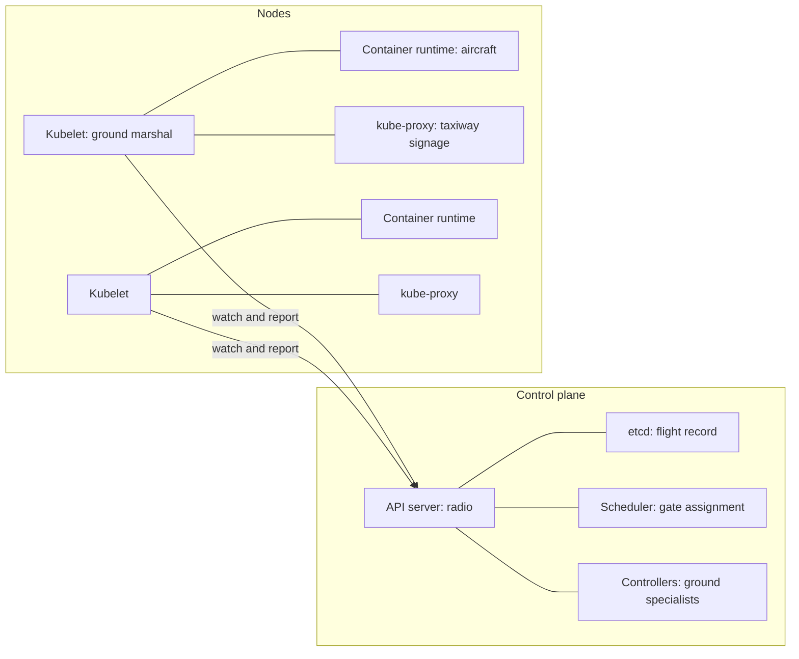
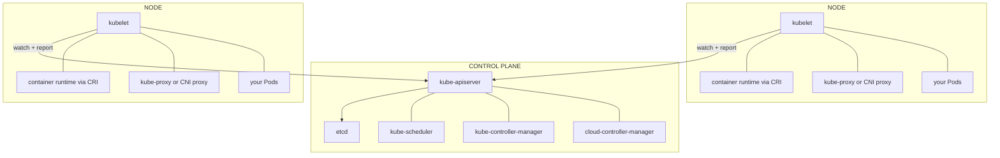
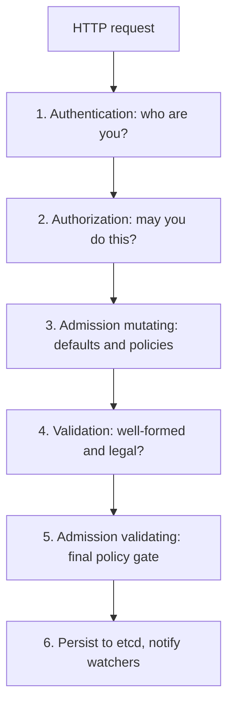
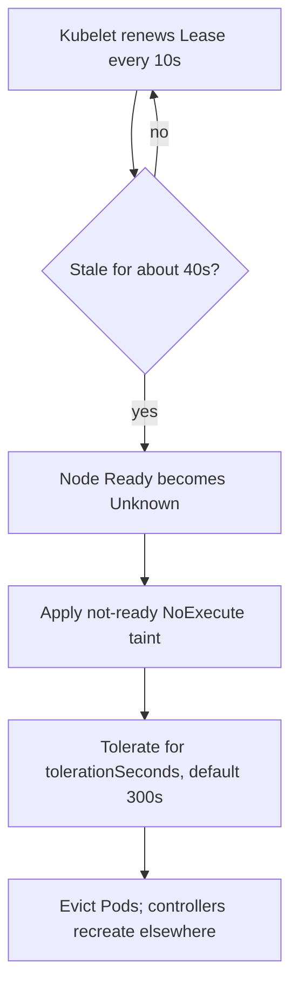
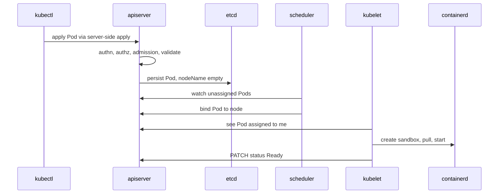

# Chapter 12 — Kubernetes Architecture

> **Learning Objectives**
>
> By the end of this chapter, you will be able to:
>
> - Draw the two halves of a cluster — control plane and nodes — and name what runs in each
> - Explain the roles of the API server, etcd, scheduler, controller manager, and cloud controller manager
> - Describe how the kubelet, the container runtime (through the CRI), and kube-proxy turn objects into running processes
> - Explain how nodes prove they are alive using Leases, and where leader-election Leases live
> - Trace a `kubectl apply` from your terminal to a running container, naming every component it touches
> - Use namespaces, labels, and selectors deliberately, including the four namespaces every cluster ships with
> - Explain owner references and how garbage collection cleans up dependent objects
> - Discover which API groups and versions your own cluster serves

---

## 12.1 The control tower

An airport does not run on heroics. It runs on a control tower, a single radio frequency, and a written record of every flight.

Pilots do not negotiate with each other about runways. They talk to one authority. That authority keeps the definitive record — which aircraft exists, where it is going, which gate it was assigned — and every specialist (ground crew, de-icing, baggage) reads that record and does one narrow job well. Nobody phones anybody. If the de-icing crew goes on break, planes still land; the work simply waits in the record until someone picks it up.

Kubernetes is built the same way, and the payoff is the same: components can restart, lag, or be replaced without the airport closing.

- The **radio frequency** is the API server. It is the *only* way in.
- The **written record** is etcd. It is the *only* source of truth.
- The **specialists** are the scheduler, the controllers, and the kubelet on every machine. Each watches the record and does one job.

Chapter 11 gave you the mental model (declare state, controllers converge). This chapter opens the machine and shows you the parts, because from here on, every debugging session is a question of *which component is unhappy*.



*Figure 12.1: Control plane decides through the API server and etcd; nodes dial out via kubelet, runtime, and kube-proxy.*

---

## 12.2 The two halves of a cluster

### In plain terms

Every Kubernetes cluster splits into two kinds of machine roles:

- The **control plane** decides. It accepts your wishes, stores them, and figures out what must happen.
- The **nodes** (the data plane) do. They run your containers and report back.

A node can be a cloud VM, a bare-metal server, or — in kind — a Docker container. Small clusters sometimes run control plane and workloads on the same machines; production clusters usually keep the control plane separate so a runaway workload cannot starve the brain of the cluster.

### Under the hood



*Figure 12.2: Everything goes through the API server; nodes initiate contact and run Pods under the kubelet.*

Two rules explain nearly all cluster behavior:

1. **Everything goes through the API server.** The scheduler does not call the kubelet. Controllers do not call each other. They read and write objects; the API server is the hub, and the components are spokes.
2. **Communication is node-to-control-plane initiated.** Kubelets dial out to the API server, not the reverse. That is why nodes behind NAT work fine, and why the API server needs credentials to reach a kubelet (for `kubectl logs` and `exec`, which are the exceptions).

On your kind cluster you can see both halves:

```bash
$ kubectl get nodes
```

```text
NAME                          STATUS   ROLES           AGE   VERSION
mastering-k8s-control-plane   Ready    control-plane   11m   v1.36.0
mastering-k8s-worker          Ready    <none>          11m   v1.36.0
mastering-k8s-worker2         Ready    <none>          11m   v1.36.0
```

```bash
$ kubectl get pods -n kube-system -o custom-columns=NAME:.metadata.name,NODE:.spec.nodeName
```

```text
NAME                                                  NODE
coredns-7c9d5f8b46-8xk2m                              mastering-k8s-control-plane
coredns-7c9d5f8b46-l4vqt                              mastering-k8s-control-plane
etcd-mastering-k8s-control-plane                      mastering-k8s-control-plane
kindnet-2r7wd                                         mastering-k8s-worker
kube-apiserver-mastering-k8s-control-plane            mastering-k8s-control-plane
kube-controller-manager-mastering-k8s-control-plane   mastering-k8s-control-plane
kube-proxy-fk6nq                                      mastering-k8s-worker
kube-scheduler-mastering-k8s-control-plane            mastering-k8s-control-plane
```

### In production

- **Run three (or five) control plane replicas.** etcd needs an odd number for quorum; two replicas are *worse* than one, because a single failure loses quorum.
- **Isolate the control plane.** Managed services (EKS, GKE, AKS) do this for you and you never see those Pods. Self-managed clusters should taint control plane nodes so ordinary workloads land elsewhere.
- **Back up etcd, and test restores.** Everything else can be rebuilt from manifests; etcd is the only thing that cannot (Chapter 24).
- **Watch the control plane like an application.** API server request latency and error rate, etcd fsync duration, and scheduler queue depth are the four signals that tell you the brain is struggling before users notice.

> 💡 **Tip:** In kind, the control plane components run as **static Pods** on the control plane node — Pods defined by files on disk rather than by API objects. That is why they appear in `kubectl get pods -n kube-system` but have no controller managing them. Chapter 13 covers static Pods in detail.

> ⚠️ **Common Pitfall:** Running an even number of etcd members "for symmetry." Quorum needs a majority; two members fail when one dies—worse than a deliberate single-node lab.

**Before you leave this section**

- **Understand:** Control plane decides; nodes do; everything hubs through the API server.
- **Try:** List kube-system Pods and note which node each control-plane component runs on.
- **Watch in prod:** etcd backup test age and control-plane replica count.

---

## 12.3 The API server: the only door

### In plain terms

`kube-apiserver` is a REST API in front of the cluster's database. Every actor — you, `kubectl`, controllers, kubelets, dashboards, CI pipelines — speaks HTTP to it. If it is down, nothing new can be created or changed. Existing containers keep running, which surprises people pleasantly during outages, but the cluster stops adapting.

### Under the hood

Every request walks the same pipeline:



*Figure 12.3: Every API request walks authentication, authorization, admission, validation, then etcd.*

Two features you will rely on constantly:

- **Watches.** Clients open a long-lived connection and receive a stream of changes. This is how controllers and kubelets learn about work without polling, and how `kubectl get pods -w` works.
- **Resource versions.** Every object carries `metadata.resourceVersion`. Updates are optimistically concurrent: if two writers race, the loser gets `409 Conflict` and retries. No locks, no corruption.

You can talk to the API directly, which is a great way to demystify it:

```bash
$ kubectl get --raw='/readyz?verbose' | head -n 6
```

```text
[+]ping ok
[+]log ok
[+]etcd ok
[+]etcd-readiness ok
[+]informer-sync ok
[+]poststarthook/start-apiserver-admission-initializer ok
```

```bash
$ kubectl get pod task-api -v=6 2>&1 | grep GET
```

```text
GET https://127.0.0.1:60093/api/v1/namespaces/default/pods/task-api 200 OK in 12 milliseconds
```

`kubectl` is a thin, friendly HTTP client. Raising `-v` shows you the URLs, which makes API paths concrete: `/api/v1/...` for core resources, `/apis/<group>/<version>/...` for everything else.

### In production

- **Admission is where platform policy lives.** Kubernetes 1.36 ships both **ValidatingAdmissionPolicy** and **MutatingAdmissionPolicy** as GA CEL-based, in-process alternatives to webhooks — no extra server to keep highly available. Prefer them over custom webhooks when CEL is expressive enough.
- **Protect the API server from stampedes.** API Priority and Fairness classifies requests into flows so one runaway controller cannot starve kubelets. Watch for `apiserver_flowcontrol_rejected_requests_total` before your users find it.
- **Audit everything.** The audit log is the only record of who did what. Enable it, ship it off-cluster, and keep it longer than your incident timeline.
- **Expect the API server to be a bottleneck at scale.** Huge Secrets and ConfigMaps, chatty controllers, and unbounded `list` calls (rather than watches) are the usual culprits.

> ⚠️ **Warning:** A component being unable to reach the API server is not the same as your app being down. During a control plane outage, running Pods keep serving traffic; what stops is *change* — no rollouts, no rescheduling, no scaling. Knowing this distinction keeps incident response calm.

> 🏭 **Production floor:** Who owns the API server (managed provider vs self-hosted) owns admission policy and audit log retention. App teams escalate "forbidden" and webhook outages to that owner—do not disable admission to "unblock" a deploy without a change ticket.

**Before you leave this section**

- **Understand:** Authn → authz → admission → etcd; watches drive controllers.
- **Try:** `kubectl get --raw='/readyz?verbose'` and raise `-v=6` on a get.
- **Watch in prod:** API Priority and Fairness rejects and admission webhook latency.

---

## 12.4 etcd: the only truth

### In plain terms

**etcd** is a distributed key-value store with strong consistency. It holds every object in your cluster — the flight record from §12.1. It is small, boring, and the single most precious thing you operate. Lose etcd without a backup and you have lost the cluster's memory, even if every container is still running.

### Under the hood

- etcd uses the **Raft** consensus algorithm: one leader, N followers, writes acknowledged by a majority. A three-member cluster tolerates one failure; five tolerates two.
- Only the API server talks to etcd. No other component has (or should have) credentials.
- Keys look like paths: `/registry/pods/default/task-api`. Values are serialized objects, by default in Protobuf.
- **Compaction and defragmentation** matter: etcd keeps a revision history, and without periodic compaction the database grows until it hits its quota (commonly 2 GiB) and goes read-only.

```bash
$ kubectl get --raw='/metrics' | grep -m3 '^etcd_request_duration_seconds_count'
```

```text
etcd_request_duration_seconds_count{operation="create",type="*core.Event"} 412
etcd_request_duration_seconds_count{operation="get",type="*core.ConfigMap"} 1885
etcd_request_duration_seconds_count{operation="list",type="*core.Pod"} 96
```

### In production

- **etcd is latency-sensitive, not throughput-sensitive.** It wants fast fsync. Put it on SSD/NVMe and never on network storage with variable latency. Disk latency spikes show up as cluster-wide slowness.
- **Back up on a schedule** (`etcdctl snapshot save`) and *practice restoring*. An untested backup is a rumor.
- **Encrypt at rest.** Secrets are only base64-encoded inside etcd unless you configure encryption providers — ideally KMS-backed (Chapter 17).
- **Keep objects small and few.** Events, giant ConfigMaps, and one-object-per-request patterns are what turn a healthy etcd into an incident.

> 📘 **Deep Dive (optional):** Managed Kubernetes hides etcd entirely, and some distributions replace it — k3s can use SQLite or an external SQL database. The abstraction holds because only the API server ever touches the store, which is a nice demonstration of why the hub-and-spoke design pays off.

**Before you leave this section**

- **Understand:** etcd is the only truth; back it up and encrypt Secrets at rest.
- **Try:** Find etcd request metrics via `kubectl get --raw='/metrics'`.
- **Watch in prod:** fsync latency spikes and untested snapshot restores.

---

## 12.5 The scheduler

### In plain terms

The **kube-scheduler** answers one question: *which node should this new Pod run on?* It does not start containers; it writes one field — `spec.nodeName` — and the kubelet on that node takes it from there. A Pod with no node assigned sits in `Pending`.

Think of it as the gate assignment desk: it knows every gate's size and current occupancy, the aircraft's requirements, and the airline's preferences, then makes a booking.

### Under the hood

Scheduling runs in two phases:

1. **Filtering** — eliminate nodes that *cannot* work: not enough allocatable CPU or memory for the Pod's **requests**, missing node labels required by `nodeSelector` or affinity, unmatched taints, no free host port, volume topology mismatch.
2. **Scoring** — rank the survivors: spread across nodes and zones, prefer nodes that already have the image, honor affinity preferences and topology spread constraints. Highest score wins; ties are broken randomly.

```bash
$ kubectl get pod task-api -o jsonpath='{.spec.nodeName}{"\n"}'
```

```text
mastering-k8s-worker
```

```bash
$ kubectl describe pod task-api-unschedulable | tail -n 5
```

```text
Events:
  Type     Reason            Age   From               Message
  ----     ------            ----  ----               -------
  Warning  FailedScheduling  36s   default-scheduler  0/3 nodes are available: 3 Insufficient cpu.
             preemption: 0/3 nodes are available: 3 No preemption victims found for incoming pod.
```

That message is the scheduler telling you exactly which filter rejected each node. It is one of the most useful strings in Kubernetes.

> 💡 **Tip:** The scheduler compares **requests**, not actual usage. A node running at 5% CPU can still be "full" if the Pods on it requested everything. Conversely, a node with no requests left can be idle. This is the number one source of "why is my Pod Pending on an empty cluster?"

### In production

- **Set requests on everything.** They are the scheduler's only input for capacity.
- **Use topology spread constraints** to survive zone failures instead of hoping default scoring spreads replicas well (Chapter 20).
- **Understand preemption.** Higher-priority Pods can evict lower-priority ones. Use PriorityClasses deliberately, and give platform components higher priority than batch jobs.
- **Watch `Pending` as an SLO.** A rising count of unschedulable Pods is your earliest signal that the cluster needs to grow — it is the trigger most cluster autoscalers use.

> ⚠️ **Common Pitfall:** Reading live CPU usage to explain Pending Pods. The scheduler compares **requests** to allocatable—not `kubectl top`.

**Before you leave this section**

- **Understand:** Filter then score; requests drive packing; FailedScheduling names the filter.
- **Try:** Apply an unschedulable Pod and read the exact event message.
- **Watch in prod:** Rising Pending counts before user-visible saturation.

---

## 12.6 Controller manager, and the cloud controller manager

### In plain terms

`kube-controller-manager` is one process containing roughly thirty independent control loops. Grouping them into one binary is an operational convenience, not a design statement: each loop still watches the API and reconciles one kind of gap.

The **cloud-controller-manager** is a sibling process that holds the loops that need to talk to a *cloud provider's* API. It exists so that Kubernetes itself can stay vendor-neutral: cloud-specific code lives in a separate binary maintained by the cloud vendor.

### Under the hood

Notable loops inside `kube-controller-manager`:

| Controller | Reconciles |
|------------|-----------|
| Deployment | Deployments → ReplicaSets |
| ReplicaSet | ReplicaSets → Pods |
| Node lifecycle | Unresponsive nodes → taints, then Pod eviction |
| Job / CronJob | Batch objects → Pods, on schedule |
| EndpointSlice | Services + Pod readiness → EndpointSlices (Chapter 15) |
| ServiceAccount + token | Namespaces → default ServiceAccounts |
| PersistentVolume binding | PVCs → PVs (Chapter 18) |
| Garbage collector | Owner references → cascading deletes (§12.13) |
| TTL after finished | Completed Jobs → deletion after `ttlSecondsAfterFinished` |

And in the **cloud-controller-manager**:

| Controller | Responsibility |
|------------|----------------|
| Node controller | Fill in cloud metadata (region, zone, instance type) on Node objects; detect deleted VMs |
| Service controller | Provision and update cloud load balancers for `type: LoadBalancer` Services |
| Route controller | Program cloud routing tables so Pod CIDRs are reachable between nodes |

```bash
$ kubectl get node mastering-k8s-worker -o jsonpath='{.metadata.labels}' | tr ',' '\n' | head -n 5
```

```text
{"beta.kubernetes.io/arch":"amd64"
"beta.kubernetes.io/os":"linux"
"kubernetes.io/arch":"amd64"
"kubernetes.io/hostname":"mastering-k8s-worker"
"kubernetes.io/os":"linux"
```

On a cloud cluster the same command would also show `topology.kubernetes.io/region`, `topology.kubernetes.io/zone`, and `node.kubernetes.io/instance-type` — all written by the cloud controller manager. On kind those labels are absent, which is exactly why `type: LoadBalancer` Services stay `<pending>` there: no cloud controller exists to fulfill them.

### In production

- **Know which controller owns a behavior.** "My LoadBalancer Service has no external IP" is a cloud-controller-manager question. "My Deployment is stuck at 2/3" is a Deployment/ReplicaSet question. Naming the owner cuts debugging time in half.
- **Controller managers are leader-elected.** Only one replica is active at a time (see §12.9), so running three replicas gives you failover, not extra throughput.
- **Cloud API rate limits are real.** A flapping Service or a thundering herd of node registrations can exhaust a cloud provider's quota and stall reconciliation cluster-wide.
- **Out-of-tree is the rule now.** In-tree cloud providers were removed in the 1.31 cycle; on 1.36 every cloud integration is an out-of-tree cloud-controller-manager plus CSI drivers.

**Before you leave this section**

- **Understand:** Name the controller that owns the symptom (LB vs Deployment vs node lifecycle).
- **Try:** Explain why LoadBalancer stays Pending on kind.
- **Watch in prod:** Cloud API rate-limit errors stalling Service and Node reconciliation.

---

## 12.7 Node components: kubelet, runtime, kube-proxy

### In plain terms

Three things run on every worker node:

- **kubelet** — the node's foreman. It asks the API server "which Pods are mine?", makes them exist, and reports back. It is the only component that starts containers.
- **The container runtime** — the thing that actually runs containers (containerd or CRI-O). The kubelet talks to it through a standard interface, the **CRI**.
- **kube-proxy** — implements Service virtual IPs in the node's networking (some CNI plugins replace it; Chapter 19).

### Under the hood

The kubelet's loop is a Pod-level reconciliation loop:

```text
watch API for Pods where spec.nodeName == me
   │
   ├─ pull images (via CRI ImageService)
   ├─ create the Pod sandbox (network namespace + IP, via CRI + CNI)
   ├─ run init containers in order, then app containers
   ├─ run probes; restart containers per restartPolicy
   ├─ mount volumes; project ConfigMaps, Secrets, tokens
   └─ report Pod status + node status back to the API server
```

**The CRI (Container Runtime Interface)** is a gRPC contract with two services — `RuntimeService` (sandboxes, containers, exec, logs) and `ImageService` (pull, list, remove images) — spoken over a Unix socket:

```bash
$ kubectl get nodes -o wide
```

```text
NAME                          STATUS   ROLES           VERSION   INTERNAL-IP   OS-IMAGE                         CONTAINER-RUNTIME
mastering-k8s-control-plane   Ready    control-plane   v1.36.0   172.18.0.4    Debian GNU/Linux 12 (bookworm)   containerd://2.1.5
mastering-k8s-worker          Ready    <none>          v1.36.0   172.18.0.3    Debian GNU/Linux 12 (bookworm)   containerd://2.1.5
```

Historical note worth keeping straight: Kubernetes once had a shim (**dockershim**) that let the kubelet drive Docker Engine directly. It was **removed in Kubernetes 1.24** (2022). This does not affect you: images you build with Docker are OCI images, and containerd — which Docker itself uses underneath — runs them happily.

Debugging at the CRI level, when the API-level view is not enough:

```bash
# on the node (kind: docker exec -it mastering-k8s-worker bash)
# crictl ps --name task-api
```

```text
CONTAINER      IMAGE          CREATED         STATE     NAME       POD ID         POD
9f2c1a8e7b40   a1b2c3d4e5f6   3 minutes ago   Running   task-api   7c1d0e5f9a21   task-api
```

#### cgroup v2: how limits are actually enforced

The kubelet does not invent resource enforcement; it delegates to Linux **cgroups**, and modern Kubernetes assumes **cgroup v2** (the unified hierarchy). Kubernetes 1.36 requires cgroup v2 for several features you will meet later, including in-place Pod resize (Chapter 13), memory QoS, and PSI-based pressure reporting (`/sys/fs/cgroup/…/{cpu,memory,io}.pressure`), which graduated to stable in 1.36.

```bash
# on a node: which cgroup version is in use?
# stat -fc %T /sys/fs/cgroup/
```

```text
cgroup2fs
```

`cgroup2fs` means v2; `tmpfs` means the legacy v1 hierarchy. Any current distro (Debian 12, Ubuntu 22.04+, RHEL 9+, and the kind node image) is v2 by default.

> 📘 **Deep Dive (optional):** cgroup v2 is why memory limits behave better than they used to: a single unified hierarchy lets the kernel account memory, IO, and CPU together, enables `memory.high` throttling before an outright OOM kill, and exposes PSI stall metrics the kubelet can act on. If you inherit a cluster still on cgroup v1, treat migrating to v2 as a prerequisite for modern node features rather than an optimization.

### In production

- **The kubelet is the last line of defense for a node.** Its eviction thresholds (`memory.available`, `nodefs.available`, `imagefs.available`) protect the machine by evicting Pods. Tune them; do not disable them.
- **Watch node conditions, not just `Ready`.** `MemoryPressure`, `DiskPressure`, and `PIDPressure` explain most mysterious evictions.
- **Keep the kubelet within one minor version of the control plane.** The supported skew is that the kubelet may be up to three minor versions older than the API server, never newer.
- **Prefer runtime-level debugging as a last resort.** `crictl` on a node is powerful and unsafe: it bypasses the API and therefore your audit trail and RBAC.

**Before you leave this section**

- **Understand:** kubelet starts containers via CRI; cgroup v2 enforces limits.
- **Try:** `kubectl get nodes -o wide` and note the container runtime version.
- **Watch in prod:** MemoryPressure/DiskPressure conditions and kubelet skew vs API server.

---

## 12.8 Heartbeats and Leases

### In plain terms

How does the control plane know a node is alive? The node keeps saying so. Instead of writing a full Node object every few seconds — expensive, because every write goes to etcd and wakes every watcher — the kubelet updates a tiny object called a **Lease**, once every ten seconds by default. A Lease is essentially a timestamped "I am here" note.

The same primitive solves a second problem: when three copies of a controller run for redundancy, which one is in charge? They race to hold a Lease. The winner works; the losers wait. That is **leader election**.

### Under the hood

Node heartbeats live in their own namespace, `kube-node-lease`, one Lease per node:

```bash
$ kubectl get leases -n kube-node-lease
```

```text
NAME                          HOLDER                        AGE
mastering-k8s-control-plane   mastering-k8s-control-plane   23m
mastering-k8s-worker          mastering-k8s-worker          23m
mastering-k8s-worker2         mastering-k8s-worker2         23m
```

```bash
$ kubectl get lease mastering-k8s-worker -n kube-node-lease -o yaml
```

```text
apiVersion: coordination.k8s.io/v1
kind: Lease
metadata:
  name: mastering-k8s-worker
  namespace: kube-node-lease
spec:
  holderIdentity: mastering-k8s-worker
  leaseDurationSeconds: 40
  renewTime: "2026-07-25T18:41:07.512345Z"
```

The important field is `renewTime`. The node lifecycle controller compares it to now:



*Figure 12.4: A dead node's Lease goes stale, then Ready turns Unknown, then Pods evacuate after the taint toleration window.*

That chain is why a hard node failure takes roughly five to six minutes to result in Pods being recreated elsewhere — a timeline that surprises people during their first node outage.

Leader-election Leases live in `kube-system`, one per component:

```bash
$ kubectl get leases -n kube-system
```

```text
NAME                                   HOLDER                                                            AGE
kube-controller-manager                mastering-k8s-control-plane_5f3d1c8a-2b7e-4a19-9f0c-1d2e3f4a5b6c   24m
kube-scheduler                         mastering-k8s-control-plane_9a8b7c6d-1e2f-4a3b-8c9d-0e1f2a3b4c5d   24m
apiserver-4l7ftzcgqvbhhpwqx2ijtnv7hm   apiserver-4l7ftzcgqvbhhpwqx2ijtnv7hm                               24m
```

```bash
$ kubectl get lease kube-scheduler -n kube-system \
    -o jsonpath='{.spec.holderIdentity}{"  renewed: "}{.spec.renewTime}{"\n"}'
```

```text
mastering-k8s-control-plane_9a8b7c6d-1e2f-4a3b-8c9d-0e1f2a3b4c5d  renewed: 2026-07-25T18:41:09.884210Z
```

There is also an `apiserver-*` Lease per API server instance (used for identity and, with coordinated leader election, for coordinating which instance leads).

### In production

- **`kube-node-lease` should be quiet and boring.** A flood of Lease update failures in kubelet logs means networking to the API server is unhealthy — often before anything else looks wrong.
- **Tune eviction timing consciously.** Shrinking `--default-not-ready-toleration-seconds` speeds recovery from real failures but makes brief network partitions cause unnecessary Pod churn. Fast failover requires spare capacity to absorb it.
- **Never write to `kube-node-lease` yourself,** and be careful with RBAC there: whoever can update a node's Lease can make a dead node look alive.
- **Custom controllers should use Leases too.** The `coordination.k8s.io/v1` Lease API plus a leader-election library is the standard way to run a controller with N replicas but one active instance.

> 💡 **Tip:** If a node shows `Ready` but its Pods are unreachable, check the Lease `renewTime` first. A fresh Lease with broken workloads points at the CNI or kube-proxy; a stale Lease points at the kubelet or the network path to the API server.

> 🏭 **Production floor:** Before draining nodes for upgrades, ensure workloads have PodDisruptionBudgets (Chapters 14 and 24). Lease/taint timers explain involuntary failure delay; PDBs govern voluntary drains—do not confuse the two in an incident bridge.

**Before you leave this section**

- **Understand:** Node Leases heartbeats; component Leases elect leaders; failover is minutes by default.
- **Try:** Watch a node Lease `renewTime` update twice.
- **Watch in prod:** Stale Leases and teams surprised by the ~5–6 minute eviction window.

---

## 12.9 Tracing `kubectl apply` end to end

### In plain terms

Nine components, one Pod, ten seconds. Following the path once removes most of the mystery from Kubernetes forever.

### Under the hood

You run:

```bash
$ kubectl apply -f task-api-pod.yaml
```

```text
pod/task-api created
```

Here is what happened, in order:



*Figure 12.5: A `kubectl apply` walks the API server, etcd, scheduler, kubelet, and runtime before status reports Ready.*

Watch the same story in event form:

```bash
$ kubectl get events --sort-by=.lastTimestamp --field-selector involvedObject.name=task-api
```

```text
LAST SEEN   TYPE     REASON      OBJECT         MESSAGE
18s         Normal   Scheduled   pod/task-api   Successfully assigned default/task-api to mastering-k8s-worker
17s         Normal   Pulling     pod/task-api   Pulling image "ghcr.io/mastering-k8s/task-api:1.0"
14s         Normal   Pulled      pod/task-api   Successfully pulled image in 2.61s (2.61s including waiting)
14s         Normal   Created     pod/task-api   Created container: task-api
13s         Normal   Started     pod/task-api   Started container task-api
```

Notice which component reported each event (`default-scheduler`, then `kubelet`). That column is a map of the pipeline.

### In production

Read the trace backwards when debugging, and the failure symptom tells you where to look:

| Symptom | Stage that failed | First command |
|---------|-------------------|---------------|
| `error: … forbidden` | Authorization (RBAC) | `kubectl auth can-i create pods` |
| `admission webhook denied the request` | Admission | `kubectl get validatingadmissionpolicy,validatingwebhookconfiguration` |
| Pod stays `Pending`, `FailedScheduling` | Scheduling | `kubectl describe pod` (read the filter message) |
| Pod `Pending` with a node assigned | kubelet / volumes / sandbox | `kubectl describe pod`, then node events |
| `ImagePullBackOff` | Image pull (CRI) | `kubectl describe pod`; check registry credentials |
| `CrashLoopBackOff` | Your container | `kubectl logs <pod> --previous` |
| `Running` but no traffic | Readiness / Service | `kubectl get endpointslices` (Chapter 15) |

**Before you leave this section**

- **Understand:** apply → etcd → schedule → kubelet → Ready; debug by stage.
- **Try:** Watch events while applying a Pod and label each Reason with a component.
- **Watch in prod:** ImagePullBackOff and FailedScheduling as first-line signals.

---

## 12.10 Namespaces

### In plain terms

A **namespace** is a folder for API objects, plus a scope for names, quotas, and access control. Two Services can both be called `task-api` as long as they live in different namespaces. Namespaces organize; they do not, by themselves, isolate.

### Under the hood

Every cluster ships with four:

```bash
$ kubectl get namespaces
```

```text
NAME              STATUS   AGE
default           Active   26m
kube-node-lease   Active   26m
kube-public       Active   26m
kube-system       Active   26m
```

| Namespace | Purpose |
|-----------|---------|
| `default` | Where your objects land if you do not say otherwise. Fine for learning, poor practice in shared clusters |
| `kube-system` | Cluster components and add-ons: CoreDNS, kube-proxy, CNI, plus leader-election Leases (§12.8) |
| `kube-public` | World-readable, even unauthenticated; holds the `cluster-info` ConfigMap used during bootstrap |
| `kube-node-lease` | One Lease per node for heartbeats (§12.8) |

Namespaced versus cluster-scoped is a real distinction:

```bash
$ kubectl api-resources --namespaced=false | head -n 8
```

```text
NAME                  SHORTNAMES   APIVERSION                        NAMESPACED   KIND
componentstatuses     cs           v1                                false        ComponentStatus
namespaces            ns           v1                                false        Namespace
nodes                 no           v1                                false        Node
persistentvolumes     pv           v1                                false        PersistentVolume
mutatingwebhookconfigurations       admissionregistration.k8s.io/v1   false        MutatingWebhookConfiguration
customresourcedefinitions   crd     apiextensions.k8s.io/v1           false        CustomResourceDefinition
clusterroles                        rbac.authorization.k8s.io/v1      false        ClusterRole
storageclasses        sc           storage.k8s.io/v1                 false        StorageClass
```

Create one for the running example and make it the default for your context:

```yaml
# tasks-namespace.yaml
apiVersion: v1
kind: Namespace
metadata:
  name: tasks
  labels:
    app.kubernetes.io/part-of: task-api
    pod-security.kubernetes.io/enforce: baseline
```

```bash
$ kubectl apply -f tasks-namespace.yaml
```

```text
namespace/tasks created
```

```bash
$ kubectl config set-context --current --namespace=tasks
```

```text
Context "kind-mastering-k8s" modified.
```

DNS follows namespaces: a Service `task-db` in namespace `tasks` is reachable as `task-db` from inside `tasks`, and as `task-db.tasks.svc.cluster.local` from anywhere in the cluster (Chapter 15).

### In production

- **Namespace per team, per environment, or per application — pick one axis and be consistent.** Mixed conventions make RBAC and quotas unmaintainable.
- **Attach policy to namespaces, not to hope.** ResourceQuota and LimitRange bound consumption; Pod Security admission labels (`pod-security.kubernetes.io/enforce`) bound privilege; NetworkPolicies bound traffic (Chapter 19). A namespace without these is just a naming convention.
- **Namespaces are not a security boundary between untrusted tenants.** Nodes, kernel, and many cluster-scoped resources are shared. Hostile multi-tenancy needs separate clusters or virtual control planes.
- **Deleting a namespace deletes everything in it,** asynchronously, and can hang on finalizers. `kubectl get namespace <ns> -o yaml` and looking at `spec.finalizers` and `status.conditions` explains a stuck `Terminating`.

**Before you leave this section**

- **Understand:** Namespaces scope names/quotas/RBAC—not the kernel.
- **Try:** Create a namespace, set context, and resolve a Service short name from inside it.
- **Watch in prod:** Stuck Terminating namespaces and namespaces without quotas/PSS.

---

## 12.11 Labels and selectors

### In plain terms

Labels are sticky notes on objects: `app=task-api`, `env=prod`, `version=1.0`. Selectors are queries over those notes. This one idea is how Services find Pods, how controllers claim Pods, and how you slice a cluster in a dashboard.

Kubernetes has no foreign keys. It has labels.

### Under the hood

```yaml
metadata:
  labels:
    app.kubernetes.io/name: task-api
    app.kubernetes.io/component: api
    app.kubernetes.io/part-of: task-platform
    app.kubernetes.io/version: "1.0"
    env: dev
```

Equality and set-based selection from the command line:

```bash
$ kubectl get pods -l app.kubernetes.io/name=task-api
$ kubectl get pods -l 'env in (dev,staging),app.kubernetes.io/name=task-api'
$ kubectl get pods -l '!canary'
```

```text
NAME       READY   STATUS    RESTARTS   AGE
task-api   1/1     Running   0          6m
```

In manifests, controllers and Services use `matchLabels` (and optionally `matchExpressions`):

```yaml
# excerpt: how a Service claims Pods
spec:
  selector:
    app.kubernetes.io/name: task-api
```

Two neighboring concepts that are *not* labels:

- **Annotations** — arbitrary metadata for tools and humans (`kubernetes.io/change-cause`, config checksums, controller hints). Never selectable.
- **Field selectors** — queries over object fields rather than labels: `kubectl get pods --field-selector status.phase=Running,spec.nodeName=mastering-k8s-worker`.

### In production

- **Adopt the recommended `app.kubernetes.io/*` labels.** They are what Helm, dashboards, and service meshes already understand.
- **A Deployment's `spec.selector` is immutable.** Choose selector labels you will never need to change, and keep volatile information (version, build ID) in *template* labels and annotations only.
- **Beware overlapping selectors.** Two controllers whose selectors match the same Pods will fight over them, producing endless creation and deletion. Include a unique `app` label in every selector.
- **Label for cost and ownership too.** `team`, `cost-center`, and `env` labels are how you answer "who owns this and what does it cost" six months later.

**Before you leave this section**

- **Understand:** Labels wire Services and controllers; selectors on Deployments are immutable.
- **Try:** Equality and set-based `kubectl get pods -l` queries.
- **Watch in prod:** Overlapping selectors causing controller fights.

---

## 12.12 Owner references and garbage collection

### In plain terms

When you delete a Deployment, its ReplicaSets and Pods disappear too. Nothing about the Deployment controller does that. Instead, each created object carries a note: *"I belong to that object."* A dedicated **garbage collector** watches for owners that no longer exist and deletes the orphans.

It is a will, not a cleanup script: the child object states its parent, and the estate is settled automatically.

### Under the hood

The note is `metadata.ownerReferences`:

```bash
$ kubectl get pod -l app=task-api -o jsonpath='{.items[0].metadata.ownerReferences}' | python -m json.tool
```

```text
[
    {
        "apiVersion": "apps/v1",
        "kind": "ReplicaSet",
        "name": "task-api-7d9f8c5b64",
        "uid": "0f6d3a1e-9c2b-4c7a-8f1d-5b7e9a0c2d34",
        "controller": true,
        "blockOwnerDeletion": true
    }
]
```

Key rules:

- **Owner and dependent must be in the same namespace** (or the owner is cluster-scoped). A namespaced object cannot own an object in another namespace; a mismatch makes the dependent look permanently orphaned.
- **`controller: true`** marks the one owner that actively manages the object. This is what prevents two ReplicaSets from both claiming a Pod.
- **`blockOwnerDeletion: true`** makes foreground deletion wait for this dependent.

Three deletion propagation policies:

| Policy | Behavior | How to request |
|--------|----------|----------------|
| `Background` (default) | Owner deleted immediately; the collector removes dependents afterward | `kubectl delete deployment task-api` |
| `Foreground` | Owner enters deletion, dependents are removed first, then the owner disappears | `kubectl delete deployment task-api --cascade=foreground` |
| `Orphan` | Dependents survive, with owner references stripped | `kubectl delete deployment task-api --cascade=orphan` |

Orphaning is genuinely useful:

```bash
$ kubectl delete deployment task-api --cascade=orphan
```

```text
deployment.apps "task-api" deleted
```

```bash
$ kubectl get pods
```

```text
NAME                        READY   STATUS    RESTARTS   AGE
task-api-7d9f8c5b64-8m2xp   1/1     Running   0          9m
task-api-7d9f8c5b64-q4tzn   1/1     Running   0          9m
```

The Pods keep serving traffic while you replace the controller above them — a real technique during risky migrations.

Beyond owner references, two related cleanup mechanisms are worth knowing: **finalizers** (a list in `metadata.finalizers` that blocks deletion until a controller does its cleanup and removes its entry) and the kubelet's own **image and container garbage collection** on each node, which reclaims disk by removing unused images and dead containers.

### In production

- **A stuck `Terminating` object is almost always a finalizer.** Inspect `metadata.finalizers` and find the controller that owes you cleanup. Force-removing finalizers works and leaks whatever the finalizer was protecting — do it knowingly, not reflexively.
- **Cross-namespace owner references are a real bug class.** Custom controllers that get this wrong create objects the garbage collector immediately deletes, producing baffling churn.
- **Do not rely on cascading deletes for data safety.** Deleting a StatefulSet does not delete its PersistentVolumeClaims by default; that asymmetry is deliberate and has saved many databases (Chapter 18).
- **Monitor node disk and image GC thresholds.** Nodes that never reclaim images hit `DiskPressure` and start evicting Pods for reasons that have nothing to do with your application.

**Before you leave this section**

- **Understand:** ownerReferences drive GC; orphan/foreground/background change the story.
- **Try:** Inspect ownerReferences on a Deployment Pod; orphan a Deployment once in lab.
- **Watch in prod:** Stuck finalizers and accidental data loss assumptions on delete.

---

## 12.13 API groups and versions

### In plain terms

The Kubernetes API is not one flat list. It is grouped by area (`apps`, `batch`, `networking.k8s.io`) and versioned within each group (`v1alpha1` → `v1beta1` → `v1`). That is how new features can appear without breaking anything, and how you can tell how much to trust a resource.

### Under the hood

```bash
$ kubectl api-versions | head -n 12
```

```text
admissionregistration.k8s.io/v1
apiextensions.k8s.io/v1
apiregistration.k8s.io/v1
apps/v1
authentication.k8s.io/v1
authorization.k8s.io/v1
autoscaling/v1
autoscaling/v2
batch/v1
certificates.k8s.io/v1
coordination.k8s.io/v1
discovery.k8s.io/v1
```

```bash
$ kubectl api-resources | head -n 10
```

```text
NAME                  SHORTNAMES   APIVERSION   NAMESPACED   KIND
bindings                           v1           true         Binding
configmaps            cm           v1           true         ConfigMap
endpoints             ep           v1           true         Endpoints
events                ev           v1           true         Event
namespaces            ns           v1           true         Namespace
nodes                 no           v1           true         Node
persistentvolumeclaims pvc         v1           true         PersistentVolumeClaim
pods                  po           v1           true         Pod
secrets                            v1           true         Secret
services              svc          v1           true         Service
```

What the stability levels mean:

| Version pattern | Promise | Use it for |
|-----------------|---------|-----------|
| `v1alpha1` | May change or vanish in any release; often disabled by default | Experiments only |
| `v1beta1` | Reasonably stable; may still change; commonly enabled | Evaluation, careful adoption |
| `v1` (GA) | Supported long-term with a deprecation policy | Everything in production |

Every manifest in this book uses GA APIs: `v1`, `apps/v1`, `batch/v1`, `networking.k8s.io/v1`, `discovery.k8s.io/v1`, `coordination.k8s.io/v1`, `autoscaling/v2`, `policy/v1`, `storage.k8s.io/v1`, `rbac.authorization.k8s.io/v1`.

Objects are stored once and served in any supported version of their group, which is why `kubectl get deployment -o yaml` always shows `apps/v1` even if you applied an older version — and why upgrades that remove an old version break manifests, not stored data.

### In production

- **Audit for deprecated APIs before every upgrade.** `kubectl-convert`, `pluto`, and cloud upgrade insights read your manifests and cluster and tell you what a release will remove.
- **Feature gates matter.** Alpha features are off by default; beta features are usually on. Managed providers choose for you, so verify rather than assume.
- **Custom resources join the same system.** A CRD adds a group and version and then behaves like everything else — same `kubectl`, same RBAC, same garbage collection. That uniformity is what makes operators feel native (Chapter 23).

> 💡 **Tip:** `kubectl explain --recursive deployment.spec` prints the full field tree your cluster actually supports. It beats searching the web when you need to know whether a field exists in *your* version.

**Before you leave this section**

- **Understand:** Prefer GA APIs; audit deprecations before upgrades.
- **Try:** `kubectl api-versions` and `kubectl api-resources --namespaced=false`.
- **Watch in prod:** Manifests still on removed beta APIs after an upgrade.

---

## 12.14 Inspecting a real cluster

### In plain terms

You now have the vocabulary to look at any cluster and understand what you see. Here is the tour worth running whenever you meet a new cluster.

### Under the hood

```bash
$ kubectl cluster-info
```

```text
Kubernetes control plane is running at https://127.0.0.1:60093
CoreDNS is running at https://127.0.0.1:60093/api/v1/namespaces/kube-system/services/kube-dns:dns/proxy
```

```bash
$ kubectl version
```

```text
Client Version: v1.36.1
Kustomize Version: v5.7.1
Server Version: v1.36.0
```

```bash
$ kubectl get --raw='/livez?verbose' | tail -n 3
```

```text
[+]poststarthook/start-legacy-token-tracking-controller ok
[+]shutdown ok
livez check passed
```

```bash
$ kubectl get componentstatuses
```

```text
Warning: v1 ComponentStatus is deprecated in v1.19+
NAME                 STATUS    MESSAGE   ERROR
scheduler            Healthy   ok
controller-manager   Healthy   ok
etcd-0               Healthy   ok
```

```bash
$ kubectl -n kube-system logs kube-scheduler-mastering-k8s-control-plane --tail=3
```

```text
I0725 18:44:02.118304  1 schedule_one.go:319] "Successfully bound pod to node" pod="tasks/task-api" node="mastering-k8s-worker" evaluatedNodes=3 feasibleNodes=2
I0725 18:44:02.118512  1 eventhandlers.go:206] "Add event for scheduled pod" pod="tasks/task-api"
I0725 18:44:12.884713  1 leaderelection.go:288] "Successfully renewed lease" lease="kube-system/kube-scheduler"
```

That last line is §12.8 in the wild: the scheduler renewing its leader-election Lease.

### In production

A five-minute health sweep, in order:

1. `kubectl get nodes` — any node not `Ready`, and how old are the Leases?
2. `kubectl get pods -A --field-selector=status.phase!=Running` — what is not running, and why?
3. `kubectl get events -A --sort-by=.lastTimestamp | tail -n 30` — what has the cluster been complaining about?
4. `kubectl top nodes` — is anything near capacity (requires metrics-server; Chapter 22)?
5. `kubectl get --raw='/readyz?verbose'` — is the API server itself healthy in every subsystem?

Write those five commands down. They resolve a surprising share of incidents before you ever look at application logs.

**Before you leave this section**

- **Understand:** A five-command health sweep beats guessing at app logs first.
- **Try:** Run the sweep on your kind cluster and save the output.
- **Watch in prod:** Whether on-call actually runs the sweep before paging app owners.

---

## 12.15 Common pitfalls

> ⚠️ **Common Pitfall:** **Believing a control plane outage stops your app.** Running Pods keep running. What stops is change: no scheduling, no rollouts, no scaling, no new Service endpoints.

> ⚠️ **Common Pitfall:** **Reading node CPU usage to explain `Pending` Pods.** The scheduler compares *requests* to allocatable capacity, not live usage. Use `kubectl describe node` and read the "Allocated resources" table.

> ⚠️ **Common Pitfall:** **Expecting instant failover when a node dies.** Lease staleness (~40s) plus the not-ready taint toleration (default 300s) means five to six minutes before Pods move. Tune it intentionally or design for it.

> ⚠️ **Common Pitfall:** **Treating namespaces as a security boundary.** They scope names, quotas, and RBAC — not the kernel or the network. Add Pod Security admission and NetworkPolicies.

> ⚠️ **Common Pitfall:** **Changing a controller's `spec.selector`.** It is immutable on Deployments and StatefulSets, and overlapping selectors make controllers fight over the same Pods.

> ⚠️ **Common Pitfall:** **Force-removing finalizers to "fix" a stuck delete.** It works and it leaks the resource the finalizer existed to clean up (cloud load balancers and volumes are typical). Find the owing controller first.

> ⚠️ **Common Pitfall:** **Writing manifests against alpha or beta APIs because a blog post did.** Check `kubectl api-resources` for what your cluster serves as GA, and prefer that.

---

## 12.16 Hands-on exercises

1. **Map your control plane.** Run `kubectl get pods -n kube-system -o wide`. Identify the API server, etcd, scheduler, and controller manager Pods, and note which node they run on. Why are they all on the same node in kind?
2. **Watch the pipeline.** In one terminal run `kubectl get events -A -w`. In another, apply the Task API Pod from Chapter 11 into the `tasks` namespace. Copy the event lines and label each with the component that emitted it.
3. **Read the Leases.** Run `kubectl get leases -A`. For one node Lease, record `holderIdentity`, `leaseDurationSeconds`, and `renewTime`, then run the command again ten seconds later and confirm which field changed.
4. **Break scheduling on purpose.** Apply a Pod requesting `cpu: "64"`. Record the exact `FailedScheduling` message and explain which phase (filter or score) rejected the nodes.
5. **Prove Service isolation across namespaces.** Create the `tasks` namespace, run a Pod in it and one in `default`, and use `kubectl exec … -- nslookup` to resolve a Service by short name from each. Explain the difference in results.
6. **Explore owner references.** Create a Deployment, then run `kubectl get rs,pods -o custom-columns=KIND:.kind,NAME:.metadata.name,OWNER:.metadata.ownerReferences[0].name`. Draw the ownership chain from Deployment to Pod.
7. **Orphan deliberately.** Delete that Deployment with `--cascade=orphan`, confirm the Pods survive, then delete them by label. What is one real-world reason to do this?
8. **Survey the API surface.** Run `kubectl api-resources --namespaced=false` and list three cluster-scoped resources you had not thought about. Then run `kubectl explain lease.spec` and summarize each field in your own words.
9. **Check cgroup version.** From inside a node (`docker exec -it mastering-k8s-worker bash`), run `stat -fc %T /sys/fs/cgroup/`. Which version is it, and name one Kubernetes 1.36 feature that depends on it.

---

## 12.17 Check Your Understanding

**Q1.** Which component is the only one that writes to etcd, and why does that matter?

<details>
<summary>Show answer</summary>

The API server. Funneling all persistence through one component means authentication, authorization, admission, validation, and audit happen in exactly one place, and every other component can be written as a simple client that watches and writes objects. It also lets the storage backend change (or be managed by a provider) without touching anything else.

</details>

**Q2.** A Pod is `Pending` with the event `0/3 nodes are available: 3 Insufficient cpu`. What exactly is the scheduler comparing?

<details>
<summary>Show answer</summary>

The Pod's CPU **request** against each node's remaining allocatable CPU, where "remaining" is allocatable minus the sum of requests of Pods already assigned there. Actual CPU utilization is irrelevant to this decision, so a nearly idle node can still be considered full.

</details>

**Q3.** What is a Lease, and what are the two distinct jobs it does in a cluster?

<details>
<summary>Show answer</summary>

A Lease (`coordination.k8s.io/v1`) is a small object with a holder identity, a duration, and a renewal timestamp. Kubelets renew one Lease per node in the `kube-node-lease` namespace as a cheap heartbeat, and control plane components in `kube-system` race to hold a named Lease for leader election so only one replica is active at a time.

</details>

**Q4.** Why does it take several minutes for Pods to move after a node loses power?

<details>
<summary>Show answer</summary>

The node's Lease stops being renewed; after roughly 40 seconds the node's `Ready` condition becomes `Unknown` and the node lifecycle controller applies a `node.kubernetes.io/not-ready:NoExecute` taint. Pods tolerate that taint for `tolerationSeconds` (300 by default) before eviction, and only then does a controller create replacements. The total is about five to six minutes unless you tune it.

</details>

**Q5.** What does the cloud controller manager do that the regular controller manager does not?

<details>
<summary>Show answer</summary>

It runs the loops that must call a cloud provider's API: labeling Nodes with region, zone, and instance type and detecting deleted VMs; provisioning and updating load balancers for `type: LoadBalancer` Services; and programming cloud routes for Pod networking. Keeping this in a separate, vendor-maintained binary is why Kubernetes core stays cloud-neutral — and why `type: LoadBalancer` never gets an IP on kind.

</details>

**Q6.** How does deleting a Deployment cause its Pods to disappear?

<details>
<summary>Show answer</summary>

Each ReplicaSet carries an owner reference to the Deployment, and each Pod carries one to its ReplicaSet. When the owner is gone, the garbage collector in the controller manager notices dependents whose owner no longer exists and deletes them (by default in background propagation). Nothing in the Deployment controller deletes Pods directly.

</details>

**Q7.** What is the CRI, and what changed for you when dockershim was removed in Kubernetes 1.24?

<details>
<summary>Show answer</summary>

The CRI is the gRPC interface between the kubelet and a container runtime, covering sandbox and container lifecycle plus image management. Removing dockershim removed the kubelet's ability to drive Docker Engine directly; clusters use containerd or CRI-O instead. Nothing changes for image authors, because Docker builds OCI images that those runtimes run natively.

</details>

**Q8.** You need to replace the controller managing a set of Pods without any downtime. Which deletion policy helps, and what is the risk?

<details>
<summary>Show answer</summary>

`--cascade=orphan` deletes the controller but leaves the Pods running with their owner references stripped. The risk is that nothing is reconciling those Pods any more: they will not be replaced if they die, and it is easy to forget they exist. Adopt them under a new controller (or delete them by label) promptly.

</details>

---

## 12.18 Key takeaways

- A cluster has two halves: a **control plane** that decides and **nodes** that do. All communication flows through the API server, and nodes always dial out.
- **kube-apiserver** is the only door (authentication → authorization → admission → validation → etcd), and **etcd** is the only truth. Back etcd up and encrypt it.
- The **scheduler** only sets `spec.nodeName`, using requests and constraints; the **kubelet** is what actually starts containers, through the **CRI**, with limits enforced by **cgroup v2**.
- **kube-controller-manager** hosts the built-in loops; the **cloud-controller-manager** holds the cloud-specific ones (node metadata, load balancers, routes).
- **Leases** do double duty: kubelet heartbeats in `kube-node-lease` and leader election in `kube-system`. They also explain the five-minute delay before Pods move off a dead node.
- **Namespaces** scope names, quotas, and RBAC — not the kernel. **Labels and selectors** are the only wiring mechanism Kubernetes has.
- **Owner references** plus the garbage collector implement cascading deletes; `--cascade=orphan` and finalizers are the escape hatches you will eventually need.
- Know which **API groups and versions** your cluster serves, and build production on GA APIs.

---

## 12.19 Official documentation map

| Topic | Official page |
|-------|---------------|
| Architecture overview | [Cluster Architecture](https://kubernetes.io/docs/concepts/architecture/) |
| Component inventory | [Kubernetes Components](https://kubernetes.io/docs/concepts/overview/components/) |
| Control plane ↔ node traffic | [Communication Between Nodes and the Control Plane](https://kubernetes.io/docs/concepts/architecture/control-plane-node-communication/) |
| Nodes and node status | [Nodes](https://kubernetes.io/docs/concepts/architecture/nodes/) |
| Heartbeats and leader election | [Leases](https://kubernetes.io/docs/concepts/architecture/leases/) |
| Cloud integrations | [Cloud Controller Manager](https://kubernetes.io/docs/concepts/architecture/cloud-controller/) |
| Runtime interface | [Container Runtime Interface (CRI)](https://kubernetes.io/docs/concepts/architecture/cri/) |
| cgroup v2 requirements | [About cgroup v2](https://kubernetes.io/docs/concepts/architecture/cgroups/) |
| Reconciliation | [Controllers](https://kubernetes.io/docs/concepts/architecture/controller/) |
| Scheduling mechanics | [kube-scheduler](https://kubernetes.io/docs/concepts/scheduling-eviction/kube-scheduler/) |
| Ownership and cleanup | [Owners and Dependents](https://kubernetes.io/docs/concepts/overview/working-with-objects/owners-dependents/) · [Garbage Collection](https://kubernetes.io/docs/concepts/architecture/garbage-collection/) |
| Namespaces | [Namespaces](https://kubernetes.io/docs/concepts/overview/working-with-objects/namespaces/) |
| Labels, selectors, fields | [Labels and Selectors](https://kubernetes.io/docs/concepts/overview/working-with-objects/labels/) · [Field Selectors](https://kubernetes.io/docs/concepts/overview/working-with-objects/field-selectors/) |
| API structure and stability | [Kubernetes API Concepts](https://kubernetes.io/docs/reference/using-api/api-concepts/) · [API Overview](https://kubernetes.io/docs/reference/using-api/) · [Deprecation Policy](https://kubernetes.io/docs/reference/using-api/deprecation-policy/) |
| Request fairness | [API Priority and Fairness](https://kubernetes.io/docs/concepts/cluster-administration/flow-control/) |
| Admission control | [Admission Controllers](https://kubernetes.io/docs/reference/access-authn-authz/admission-controllers/) · [Validating Admission Policy](https://kubernetes.io/docs/reference/access-authn-authz/validating-admission-policy/) · [Mutating Admission Policy](https://kubernetes.io/docs/reference/access-authn-authz/mutating-admission-policy/) |
| Runtime debugging on nodes | [Debugging Kubernetes nodes with crictl](https://kubernetes.io/docs/tasks/debug/debug-cluster/crictl/) |
| Component logs | [System Logs](https://kubernetes.io/docs/concepts/cluster-administration/system-logs/) |

---

**Previous:** [Chapter 11 — Introduction to Kubernetes](11-kubernetes-introduction.md) | **Next:** [Chapter 13 — Pods: The Fundamental Unit](13-pods-the-fundamental-unit.md)
