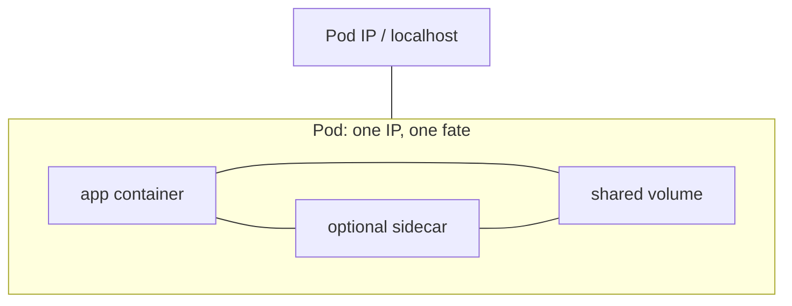
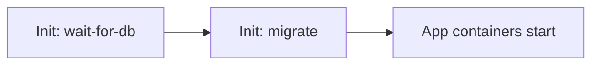
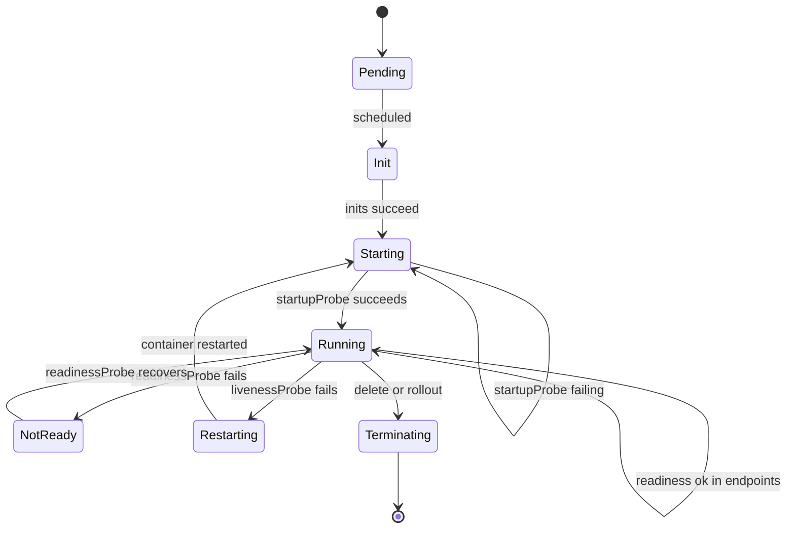
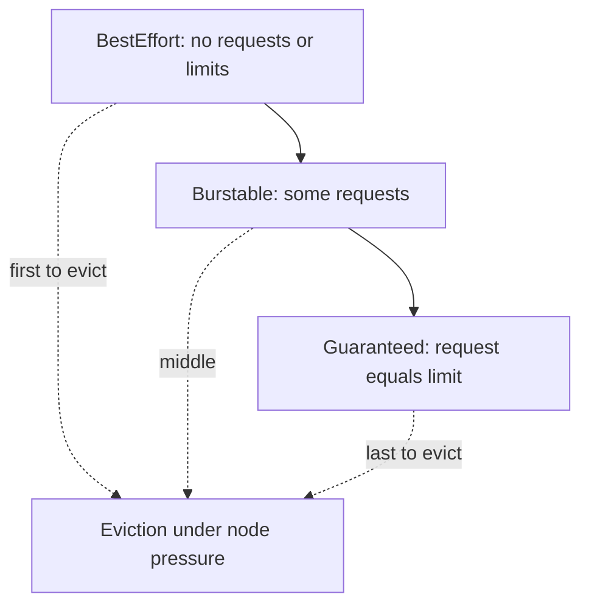
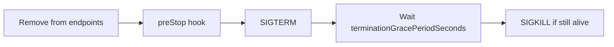

# Chapter 13 — Pods — The Fundamental Unit

> **Learning Objectives**
>
> By the end of this chapter, you will be able to:
>
> - Explain why the Pod—not the container—is the smallest schedulable unit in Kubernetes
> - Configure init containers, sidecars, probes, and QoS via requests/limits
> - Inject cluster metadata with the Downward API and debug live Pods with ephemeral containers
> - Distinguish static Pods, RuntimeClasses, and lifecycle hooks
> - Resize resources in place and enable user namespaces (`hostUsers: false`) as GA in Kubernetes 1.36
> - Apply production patterns that keep Pods replaceable, observable, and safely isolated

---

## 13.1 What is a Pod?

### In plain terms

A **Pod** is a cozy pod of peas: one or more containers that must live together—same network identity, same fate, shared volumes. Kubernetes schedules Pods onto nodes; it does not place lone containers.

### Under the hood

Every container in a Pod shares:

- One **network namespace** (one Pod IP, shared `localhost`)
- Shared **volumes** you declare
- Scheduling, restart policy, and security context at Pod (and container) level

```yaml
apiVersion: v1
kind: Pod
metadata:
  name: task-api-single
  labels:
    app: task-api
spec:
  containers:
    - name: api
      image: ghcr.io/mastering-k8s/task-api:1.0
      ports:
        - containerPort: 8000
```

```bash
$ kubectl apply -f task-api-single.yaml
pod/task-api-single created
$ kubectl get pod task-api-single -o wide
```

Bare Pods are teaching tools. Real apps use controllers (Chapter 14) so deleted Pods come back.



*Figure 13.1: Containers in a Pod share one network identity and declared volumes; the Pod is the schedulable unit.*

### In production

Treat Pods as cattle. Never rely on a Pod name staying forever. Store state outside (PVC, database, object store). Prefer Deployments/StatefulSets over naked Pods in every environment above a throwaway demo.

---

## 13.2 Init containers

### In plain terms

**Init containers** are stagehands who set the stage before the actors appear. They run to completion in order; only then do app containers start.

### Under the hood

```yaml
apiVersion: v1
kind: Pod
metadata:
  name: task-api-init
spec:
  initContainers:
    - name: wait-for-db
      image: busybox:1.36
      command: ["sh", "-c", "until nslookup db.default.svc.cluster.local; do sleep 2; done"]
    - name: migrate
      image: ghcr.io/mastering-k8s/task-api:1.0
      command: ["python", "migrate.py"]
  containers:
    - name: api
      image: ghcr.io/mastering-k8s/task-api:1.0
```

If an init container fails, the Pod restarts according to `restartPolicy` (for init, failures keep retrying until success for Always/OnFailure semantics as documented). Init containers can use different images and stricter security contexts than the app.



*Figure 13.2: Init containers run to completion in order before app containers start.*

### In production

Keep inits small and idempotent. Do not hide long migrations in init containers without Job-based migration strategies for shared databases. Resource requests on inits count toward scheduling; size them honestly.

---

## 13.3 Multi-container patterns and sidecars

### In plain terms

Sometimes the pea pod holds more than one pea: an app plus a helper that must share `localhost` or files—log shippers, proxies, adapters.

### Under the hood

Classic patterns:

| Pattern | Idea |
|---------|------|
| **Sidecar** | Helper alongside the app for the Pod's whole life |
| **Ambassador** | Outbound proxy hiding external complexity |
| **Adapter** | Normalize output (logs/metrics) for the platform |

Native **sidecar containers** (restartable init-style sidecars) let you mark containers that should start before the main app and keep running with independent restart behavior—useful for service mesh proxies. Check your 1.36 cluster docs/feature enablement if you rely on the dedicated sidecar field semantics.

```yaml
spec:
  containers:
    - name: api
      image: ghcr.io/mastering-k8s/task-api:1.0
    - name: access-log
      image: busybox:1.36
      command: ["sh", "-c", "tail -F /var/log/app/access.log"]
      volumeMounts:
        - name: logs
          mountPath: /var/log/app
  volumes:
    - name: logs
      emptyDir: {}
```

### In production

Every sidecar burns CPU/memory and complicates probes. Prefer remote agents when process co-location is unnecessary. Keep sidecar images as carefully patched as app images.

---

## 13.4 Probes: liveness, readiness, startup

### In plain terms

Probes are Kubernetes asking "are you alive?", "may I send traffic?", and "are you still starting?" Wrong answers cause thrashing or blackhole traffic.

### Under the hood

| Probe | Question | Failure effect |
|-------|----------|----------------|
| **startupProbe** | Finished booting? | Blocks other probes until success |
| **livenessProbe** | Still healthy? | Container restart |
| **readinessProbe** | Ready for traffic? | Remove from Service endpoints |

```yaml
startupProbe:
  httpGet:
    path: /healthz
    port: 8000
  failureThreshold: 30
  periodSeconds: 5
livenessProbe:
  httpGet:
    path: /healthz
    port: 8000
  periodSeconds: 10
readinessProbe:
  httpGet:
    path: /readyz
    port: 8000
  periodSeconds: 5
```

Prefer HTTP or gRPC probes for apps that speak them; use `exec` sparingly (fork cost). Distinguish liveness (process wedged) from readiness (dependency down)—do not restart the world because a dependency blipped.



*Figure 13.3: Startup gates other probes; readiness controls traffic; liveness triggers restarts; termination drains the Pod.*

Probe mechanisms you can configure:

| Mechanism | How it works | Typical use |
|-----------|--------------|-------------|
| **httpGet** | HTTP GET to path/port | Most HTTP APIs |
| **tcpSocket** | TCP connect succeeds | Non-HTTP listeners |
| **grpc** | gRPC health check protocol | gRPC services |
| **exec** | Run a command in the container | Last resort / legacy scripts |

### In production

1. Always define readiness for Services behind rollouts.
2. Use startupProbe for slow JVMs/cold caches so liveness does not kill booting pods.
3. Make `/healthz` cheap; never touch a remote DB on every liveness tick unless you accept cascading failure.
4. Align probe timeouts with real SLOs.

> ⚠️ **Common Pitfall:** One endpoint for both liveness and readiness that checks the database. When the DB is slow, Kubernetes restarts every Pod, amplifying the outage.

---

## 13.5 Resource requests, limits, and QoS

### In plain terms

**Requests** are what the scheduler reserves. **Limits** are the ceiling. Together they place your Pod into a **Quality of Service (QoS)** class that decides who gets evicted first under pressure.

### Under the hood

```yaml
resources:
  requests:
    cpu: "100m"
    memory: "128Mi"
  limits:
    cpu: "500m"
    memory: "256Mi"
```

| QoS class | Rule of thumb | Eviction priority |
|-----------|---------------|-------------------|
| **Guaranteed** | Every container has equal request=limit for CPU and memory | Last to evict |
| **Burstable** | At least one request set; not Guaranteed | Middle |
| **BestEffort** | No requests or limits | First to evict |

```bash
$ kubectl get pod task-api-single -o jsonpath='{.status.qosClass}{"\n"}'
Burstable
```

CPU limits throttle; memory limits OOM-kill. Requests drive bin-packing—under-request and you oversubscribe; over-request and you waste nodes.



*Figure 13.4: QoS class follows requests and limits; BestEffort Pods are first to go under pressure.*

### In production

Require requests on every container via policy. Set memory limits thoughtfully. Prefer Guaranteed for latency-critical pods that must resist eviction. Watch for CPU throttling before blindly raising limits.

---

## 13.6 Downward API

### In plain terms

The **Downward API** lets a Pod learn facts about itself—name, namespace, labels, resource requests—without hard-coding them or calling the API server from application code.

### Under the hood

Inject as environment variables or files:

```yaml
apiVersion: v1
kind: Pod
metadata:
  name: task-api-downward
  labels:
    app: task-api
    version: "1.0"
spec:
  containers:
    - name: api
      image: ghcr.io/mastering-k8s/task-api:1.0
      env:
        - name: POD_NAME
          valueFrom:
            fieldRef:
              fieldPath: metadata.name
        - name: POD_NAMESPACE
          valueFrom:
            fieldRef:
              fieldPath: metadata.namespace
        - name: POD_IP
          valueFrom:
            fieldRef:
              fieldPath: status.podIP
        - name: MEM_REQUEST
          valueFrom:
            resourceFieldRef:
              containerName: api
              resource: requests.memory
      volumeMounts:
        - name: podinfo
          mountPath: /etc/podinfo
  volumes:
    - name: podinfo
      downwardAPI:
        items:
          - path: labels
            fieldRef:
              fieldPath: metadata.labels
          - path: annotations
            fieldRef:
              fieldPath: metadata.annotations
```

```bash
$ kubectl exec task-api-downward -- printenv POD_NAME POD_NAMESPACE
$ kubectl exec task-api-downward -- cat /etc/podinfo/labels
```

### In production

Use Downward API for correlation IDs, log fields, and client-side defaults. Prefer it over mounting a service-account token just to read your own metadata. Remember resourceFieldRef values are the *requested* amounts, not live usage.

---

## 13.7 Ephemeral containers

### In plain terms

**Ephemeral containers** are temporary debug sidecars you attach to a *running* Pod when the main image is distroless or you need `tcpdump` without rebuilding.

### Under the hood

```bash
$ kubectl debug -it task-api-single --image=busybox:1.36 --target=api
# Opens an ephemeral container sharing namespaces with the target (options vary)
```

```yaml
# Conceptual: API adds to pod.spec.ephemeralContainers
# You normally use kubectl debug rather than hand-editing
```

Ephemeral containers cannot be permanently declared in the original create-time Pod template for ordinary apps; they are added at runtime for debugging. They do not restart with the Pod's normal lifecycle the way app containers do.

### In production

Gate who may `kubectl debug` via RBAC. Prefer distroless/CHA apps with on-demand debug rather than shipping shells in every image. Remove the need for standing SSH DaemonSets when ephemeral containers suffice.

> 💡 **Tip:** `kubectl debug node/...` can also start privileged debug Pods on a node for host-level triage—separate from Pod ephemeral containers, equally powerful, equally sensitive.

---

## 13.8 Static Pods

### In plain terms

**Static Pods** are Pods the kubelet creates from manifests on disk—without the scheduler and without a controlling Deployment. Control-plane components on kubeadm nodes often run this way.

### Under the hood

Place a Pod manifest in the kubelet's static Pod path (commonly `/etc/kubernetes/manifests`). The kubelet starts it and mirrors a read-only object to the API server.

```bash
# On a kubeadm control-plane node (not required on kind for this concept check):
# /etc/kubernetes/manifests/kube-apiserver.yaml is a static Pod
$ kubectl get pods -n kube-system -o wide | findstr apiserver
```

Static Pods are invisible to the scheduler and are bound to that node. Deleting the API mirror object does not stop them—you must remove or change the on-disk file (or the node).

### In production

Leave static Pods to system components unless you deeply understand node bootstrap. Application workloads belong in API-managed controllers so GC, scheduling, and RBAC work normally. Back up `/etc/kubernetes/manifests` as part of control-plane DR.

---

## 13.9 RuntimeClass

### In plain terms

**RuntimeClass** selects *how* containers run—default runc, a sandboxed runtime (gVisor, Kata), or another handler configured on nodes.

### Under the hood

```yaml
apiVersion: node.k8s.io/v1
kind: RuntimeClass
metadata:
  name: gvisor
handler: runsc
---
apiVersion: v1
kind: Pod
metadata:
  name: task-api-sandbox
spec:
  runtimeClassName: gvisor
  containers:
    - name: api
      image: ghcr.io/mastering-k8s/task-api:1.0
```

Nodes must advertise support for the handler. Scheduling can use `scheduling.nodeSelector` / tolerations on the RuntimeClass to land Pods only on capable nodes.

### In production

Use sandboxed runtimes for untrusted multi-tenant workloads. Benchmark syscall-heavy apps—some sandboxes trade performance for isolation. Document which namespaces may select which RuntimeClass.

---

## 13.10 Lifecycle hooks

### In plain terms

**Lifecycle hooks** let Kubernetes run a command or HTTP call when a container starts or just before it stops—useful for warm-up and graceful shutdown.

### Under the hood

```yaml
lifecycle:
  postStart:
    exec:
      command: ["/bin/sh", "-c", "echo warmed > /tmp/ready"]
  preStop:
    exec:
      command: ["/bin/sh", "-c", "sleep 5; curl -X POST http://127.0.0.1:8000/shutdown"]
```

`postStart` runs asynchronously after the container is created—it may race your main process. `preStop` runs before SIGTERM during Pod termination; it counts against termination grace period.



*Figure 13.5: Termination removes the Pod from traffic, runs preStop, then SIGTERM, then SIGKILL after the grace period.*

Termination sequence (simplified): remove from endpoints → preStop → SIGTERM → wait `terminationGracePeriodSeconds` → SIGKILL.

### In production

Prefer application-handled SIGTERM for graceful shutdown; use `preStop` sleep only as a last resort to race kube-proxy/endpoint propagation. Set `terminationGracePeriodSeconds` long enough for draining work, short enough for fast rollouts.

---

## 13.11 In-place resource resize

### In plain terms

Historically, changing CPU/memory meant recreating the Pod. **In-place resize** updates resources on a live Pod when the runtime and node support it—less disruption for vertical scaling.

### Under the hood

On Kubernetes **1.36**, in-place Pod vertical scaling is mature (container-level resize GA as of 1.35; Pod-level resource resize continued graduating—verify feature gates on custom clusters). Mark containers with a resize policy:

```yaml
apiVersion: v1
kind: Pod
metadata:
  name: task-api-resizable
spec:
  containers:
    - name: api
      image: ghcr.io/mastering-k8s/task-api:1.0
      resources:
        requests:
          cpu: "200m"
          memory: "256Mi"
        limits:
          cpu: "500m"
          memory: "512Mi"
      resizePolicy:
        - resourceName: cpu
          restartPolicy: NotRequired
        - resourceName: memory
          restartPolicy: NotRequired
```

```bash
$ kubectl patch pod task-api-resizable --subresource resize --patch '
{"spec":{"containers":[{"name":"api","resources":{"requests":{"cpu":"300m","memory":"384Mi"},"limits":{"cpu":"700m","memory":"768Mi"}}}]}}'
```

Requires **cgroup v2**, a CRI runtime that implements resource update, and node capacity for upsizing. Status conditions such as `PodResizePending` / `PodResizeInProgress` explain stalls.

### In production

Use in-place resize for stateful or slow-to-start processes where restart cost is high. Still set sane upper bounds. Test memory downsizes carefully—some policies require restart. Combine with VPA carefully to avoid fighting controllers.

---

## 13.12 User namespaces (GA in Kubernetes 1.36)

### In plain terms

With **user namespaces**, the container's UID 0 is mapped to an unprivileged host UID. A breakout no longer yields host root—defense in depth you have wanted since Docker security basics.

### Under the hood

User namespaces reached **General Availability in Kubernetes 1.36**. Opt in per Pod:

```yaml
apiVersion: v1
kind: Pod
metadata:
  name: task-api-userns
spec:
  hostUsers: false
  containers:
    - name: api
      image: ghcr.io/mastering-k8s/task-api:1.0
      securityContext:
        runAsUser: 0
```

Needs a compatible kernel, runtime, and **idmapped mounts** for volumes so ownership appears correct inside the userns without recursive `chown`. Capabilities become namespaced—`CAP_NET_ADMIN` inside the userns does not rule the host.

```bash
$ kubectl apply -f task-api-userns.yaml
$ kubectl get pod task-api-userns -o yaml | findstr hostUsers
```

### In production

1. Roll out on workloads that need multi-tenant isolation first (CI jobs, untrusted tenants).
2. Validate CSI drivers and hostPath assumptions—some volume types lag idmapped mount support.
3. GA means API stability, not "enabled on every Pod by default"—you still set `hostUsers: false`.
4. Combine with non-root images when possible; userns is complementary, not a substitute for least privilege.

> 📘 **Deep Dive (optional):** See the Kubernetes 1.36 blog on user namespaces GA for CVE-class breakout mitigations and idmapped mount history.

---

## 13.13 Putting it together: a production-shaped Pod template

```yaml
apiVersion: v1
kind: Pod
metadata:
  name: task-api-shaped
  labels:
    app.kubernetes.io/name: task-api
spec:
  hostUsers: false
  terminationGracePeriodSeconds: 30
  containers:
    - name: api
      image: ghcr.io/mastering-k8s/task-api:1.1
      ports:
        - containerPort: 8000
      env:
        - name: POD_NAME
          valueFrom:
            fieldRef:
              fieldPath: metadata.name
      resources:
        requests:
          cpu: "100m"
          memory: "128Mi"
        limits:
          cpu: "500m"
          memory: "256Mi"
      securityContext:
        allowPrivilegeEscalation: false
        readOnlyRootFilesystem: true
        runAsNonRoot: true
        runAsUser: 1001
      startupProbe:
        httpGet:
          path: /healthz
          port: 8000
        failureThreshold: 20
        periodSeconds: 3
      readinessProbe:
        httpGet:
          path: /readyz
          port: 8000
      livenessProbe:
        httpGet:
          path: /healthz
          port: 8000
      lifecycle:
        preStop:
          exec:
            command: ["/bin/sh", "-c", "sleep 3"]
      volumeMounts:
        - name: tmp
          mountPath: /tmp
  volumes:
    - name: tmp
      emptyDir: {}
```

Use this shape inside a Deployment template (Chapter 14), not as a long-lived bare Pod.

---

## 13.14 Common pitfalls

1. **No resource requests** → noisy-neighbor scheduling and surprise eviction.
2. **Liveness tied to dependencies** → restart storms during partial outages.
3. **Sharing process namespace casually** (`shareProcessNamespace`) without need → wider blast radius.
4. **Assuming static Pod deletes via kubectl** → kubelet resurrects them from disk.
5. **Enabling `hostUsers: false` without volume testing** → permission errors on mounts.
6. **Debug via privileged DaemonSets forever** → prefer ephemeral containers and tight RBAC.

---

## 13.15 Hands-on exercises

1. On a `kindest/node:v1.36.0` cluster, create a single-container Task API Pod with readiness and liveness probes; prove Service endpoints empty while readiness fails.
2. Add an init container that sleeps 10 seconds; observe Pod phases.
3. Inject Pod name and namespace via Downward API; print them inside the container.
4. Use `kubectl debug` with an ephemeral container against a running Pod.
5. Apply a Pod with `hostUsers: false` and confirm it schedules on your 1.36 kind node; note any volume caveats.
6. (Optional) Patch resources with the resize subresource if enabled; watch Pod conditions.

---

## 13.16 Check Your Understanding

**Q1.** Why share one IP per Pod instead of one IP per container?

<details>
<summary>Show answer</summary>

Containers in a Pod are co-scheduled companions that communicate over `localhost` and share fate. One network identity simplifies Service routing and keeps the Pod the atomic unit of placement.

</details>

**Q2.** When should you use a startupProbe?

<details>
<summary>Show answer</summary>

When containers need a long boot before they should be checked by liveness/readiness—prevents kubelet from killing slow starters.

</details>

**Q3.** What does the Downward API provide that ConfigMaps do not?

<details>
<summary>Show answer</summary>

Live metadata about *this* Pod (name, labels, resource requests, Pod IP) without storing per-Pod ConfigMaps or querying the API from app code.

</details>

**Q4.** How do ephemeral containers differ from sidecars in the Pod template?

<details>
<summary>Show answer</summary>

Sidecars are declared for the Pod's life in the template. Ephemeral containers are added at runtime for debugging and are not part of the steady-state app definition.

</details>

**Q5.** What does `hostUsers: false` mean in Kubernetes 1.36?

<details>
<summary>Show answer</summary>

It opts the Pod into user namespaces (GA in 1.36), mapping container UIDs (including root) to unprivileged host UIDs for stronger breakout resistance, given compatible kernel/runtime/volume support.

</details>

---

## 13.17 Key takeaways

- Pods are the schedulable unit; containers inside share network and volumes.
- Init containers, sidecars, probes, and QoS define startup order, helpers, health, and eviction risk.
- **Downward API**, **ephemeral containers**, **static Pods**, **RuntimeClass**, and **lifecycle hooks** round out day-2 Pod mechanics.
- **In-place resize** reduces disruption for vertical scaling on cgroup v2 nodes.
- **User namespaces** (`hostUsers: false`) are **GA in 1.36**—use them deliberately for isolation.
- Prefer controller-managed Pod templates over naked Pods in any lasting environment.

---

## 13.18 Official documentation map

| Topic | Official page |
|-------|---------------|
| Pods | [Pods](https://kubernetes.io/docs/concepts/workloads/pods/) |
| Init containers | [Init Containers](https://kubernetes.io/docs/concepts/workloads/pods/init-containers/) |
| Sidecar containers | [Sidecar Containers](https://kubernetes.io/docs/concepts/workloads/pods/sidecar-containers/) |
| Probe configuration | [Configure Liveness, Readiness and Startup Probes](https://kubernetes.io/docs/tasks/configure-pod-container/configure-liveness-readiness-startup-probes/) |
| Resource management | [Resource Management for Pods and Containers](https://kubernetes.io/docs/concepts/configuration/manage-resources-containers/) |
| Downward API | [Downward API](https://kubernetes.io/docs/concepts/workloads/pods/downward-api/) |
| Ephemeral containers | [Ephemeral Containers](https://kubernetes.io/docs/concepts/workloads/pods/ephemeral-containers/) |
| Static Pods | [Static Pods](https://kubernetes.io/docs/tasks/configure-pod-container/static-pod/) |
| RuntimeClass | [RuntimeClass](https://kubernetes.io/docs/concepts/containers/runtime-class/) |
| Container lifecycle hooks | [Container Lifecycle Hooks](https://kubernetes.io/docs/concepts/containers/container-lifecycle-hooks/) |
| In-place resize | [Resize CPU and Memory Resources assigned to Containers](https://kubernetes.io/docs/tasks/configure-pod-container/resize-container-resources/) |
| User namespaces | [User Namespaces](https://kubernetes.io/docs/concepts/workloads/pods/user-namespaces/) |
| User namespaces GA (1.36) | [User Namespaces are finally GA](https://kubernetes.io/blog/2026/04/23/kubernetes-v1-36-userns-ga/) |

**Previous:** [Chapter 12 — Kubernetes Architecture](12-k8s-architecture.md) | **Next:** [Chapter 14 — Workloads — Deployments and Beyond](14-workloads-deployments-and-beyond.md)
