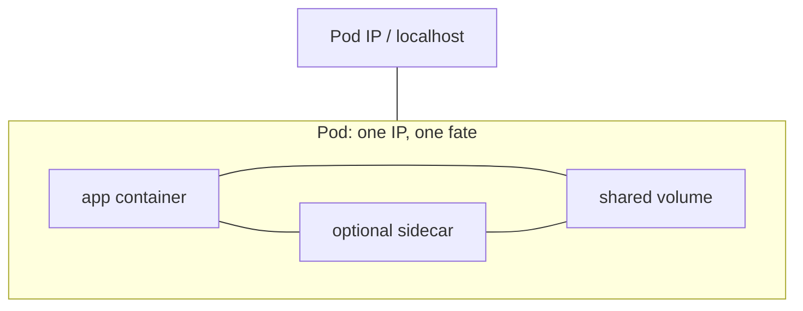
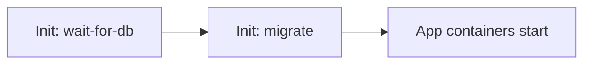
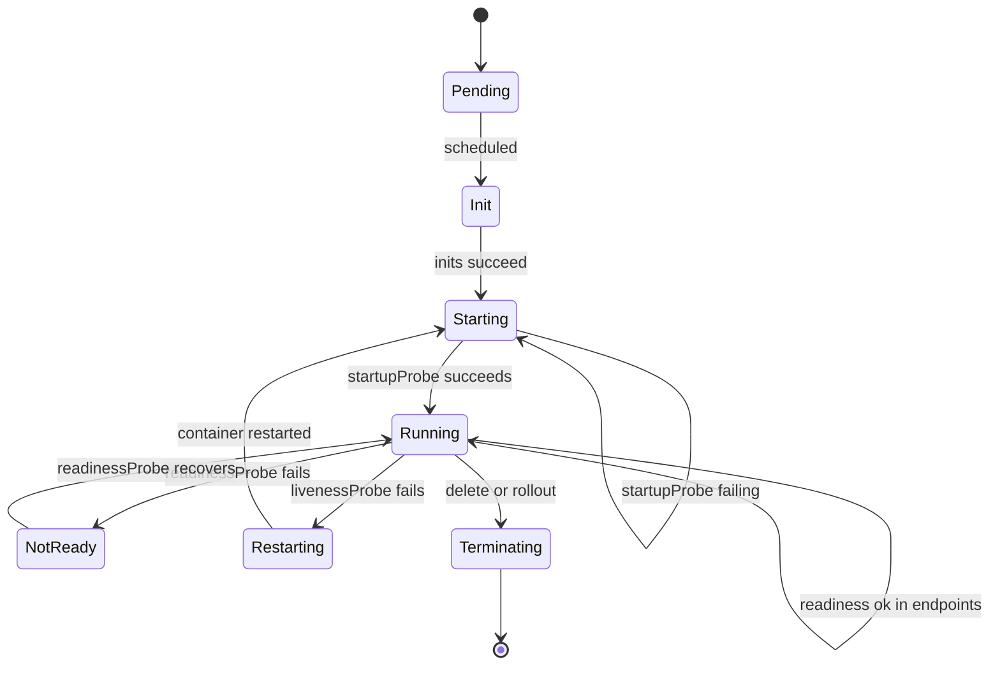
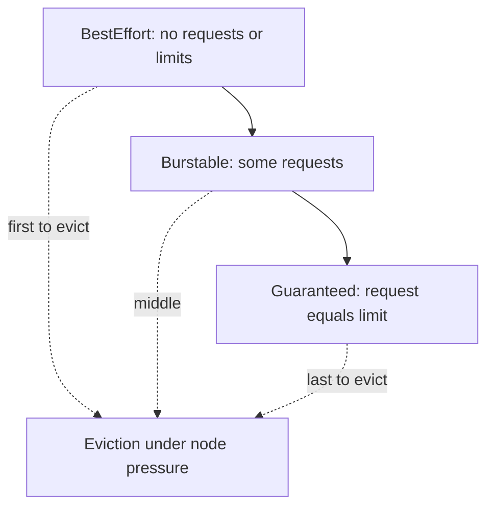
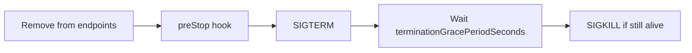

# Chapter 13 — Pods — The Fundamental Unit

> **Learning Objectives**
>
> By the end of this chapter, you will be able to:
>
> - Say why Kubernetes schedules Pods, not single containers
> - Set up init containers, sidecars, probes, and the requests and limits that decide who gets evicted first
> - Pass a Pod facts about itself with the Downward API, and debug a running Pod with a temporary container
> - Tell static Pods, RuntimeClasses, and lifecycle hooks apart
> - Change CPU and memory on a running Pod, and turn on user namespaces (`hostUsers: false`), now GA in Kubernetes 1.36
> - Write Pod templates that stay replaceable, easy to watch, and safely walled off

---

## 13.1 What is a Pod?

### In plain terms

A **Pod** is a wrapper around one or more containers that always run together on the same machine. They share one IP address, they can share files, and they live and die as a group. Kubernetes places Pods onto nodes. It never places a lone container.

Why does Kubernetes add this wrapper? Because some containers cannot be separated. Imagine your Task API writes a log file, and a helper container ships that file elsewhere. Or a proxy must catch traffic on `127.0.0.1` before it leaves the app. Put those on different machines and they simply stop working. The Pod is the promise that keeps them together: **these containers start together, die together, and can reach each other on `localhost`.**

Think of a pod of peas. Usually there is one pea inside, and that is fine. The pod is still the thing you pick up and move. Everything in the workload APIs (Chapter 14) exists to *create and replace* Pods. Nothing replaces the Pod itself as the unit.

> 💡 **In one line:** A Pod is the smallest thing Kubernetes can schedule: one or more containers that share an IP address, share volumes, and share their fate.

> ⚠️ **Common Pitfall:** You might think a Pod is "just a container with extra YAML." It is not. One container is the common case; the *unit of scheduling, networking, and failure* is still the Pod. Treating container and Pod as synonyms leads to surprise when a sidecar shares an IP, when `kubectl exec` targets a named container inside a Pod, or when a Service routes to a Pod IP rather than a container port in isolation.

### Under the hood

Here is what the containers inside one Pod actually share:

- One **network namespace**, which means one Pod IP address and a shared `localhost`
- Any **volumes** you declare, which are directories both containers can mount
- Scheduling, restart policy, and security context, set at the Pod level and refined per container

```yaml
apiVersion: v1
kind: Pod
metadata:
  name: task-api-single
  labels:
    app: task-api
spec:
  containers:
    - name: api
      image: ghcr.io/mastering-k8s/task-api:1.0
      ports:
        - containerPort: 8000
```

```bash
$ kubectl apply -f task-api-single.yaml
pod/task-api-single created
$ kubectl get pod task-api-single -o wide
```

```text
NAME              READY   STATUS    RESTARTS   AGE   IP           NODE
task-api-single   1/1     Running   0          12s   10.244.1.7   mastering-k8s-worker
```

Here is the order of events on the node. The kubelet first creates a **Pod sandbox**, which is a holding space with its own network namespace (implemented as a small `pause` container). The CNI plugin gives that sandbox the Pod IP. Only then does the kubelet start your containers inside it. `kubectl get pod -o wide` shows that IP, and other Pods can reach it until this Pod is replaced. **What breaks if you treat the Pod IP as durable:** any client that cached `10.244.1.7` fails the moment the Pod is deleted or rescheduled—use a Service (Chapter 15).

Bare Pods are for teaching. Real apps use controllers (Chapter 14) so a deleted Pod comes back.



*Figure 13.1: Containers in a Pod share one network identity and declared volumes; the Pod is the schedulable unit.*

### In production

**Ownership:** app teams own the Pod *template* (inside a Deployment/StatefulSet); the platform owns node capacity, CNI, and admission policies that shape what a Pod may request.

Treat every Pod as replaceable. Never build anything that depends on a Pod name lasting. Keep state outside the Pod, in a PersistentVolumeClaim, a database, or object storage. Above a throwaway demo, always use a Deployment or StatefulSet instead of a bare Pod.

**Failure mode:** a bare Pod on a drained or crashed node vanishes with no replacement. **Detect:** `kubectl get pods` shows nothing where you expected an app; no `ownerReferences` on the object. **Mitigate:** always wrap lasting workloads in a controller.

> 🏭 **Production floor:** Never ship long-lived bare Pods in production. Policy (admission / Kyverno / OPA) should reject Pods without a controller owner except short-lived debug namespaces. Pin container images by **digest** (`image@sha256:…`) in regulated environments so two nodes cannot run different builds of the "same" tag.

**Do:** put the production-shaped template from §13.13 inside a Deployment. **Don't:** `kubectl run` a critical API and walk away.

**Before you leave this section**

- **Understand:** The Pod—not the container—is the schedulable unit with one IP and one fate.
- **Try:** Apply a single-container Pod, note its IP, delete it, and confirm nothing recreates it.
- **Watch in prod:** Objects with no `ownerReferences` lingering in app namespaces.

---

## 13.2 Init containers

### In plain terms

An **init container** is a container that runs and finishes *before* your app containers start. If you list several, they run one at a time, in order.

You need this whenever your app cannot safely start until something else is true. Maybe a database name must resolve in DNS. Maybe a schema migration must finish. Maybe a config file must be downloaded into a shared volume first.

Think of init containers as stagehands. They set the stage, then leave, and only then do the actors walk on. Without them, teams hide sleep loops inside the app's start command, or let the first request race an unready database. That buries startup order inside the app image, where nobody can see it. Put it in the Pod spec instead, and failures show up as clear Pod events rather than a confusing crash loop in your main container.

> ⚠️ **Common Pitfall:** You might think init containers are just "sidecars that stop." They are not. Sidecars (or native sidecar containers) keep running alongside the app; inits must exit successfully before the app starts, and a failing init blocks the Pod from becoming Ready forever (or until backoff succeeds).

### Under the hood

Here is what that looks like in a Pod spec:

```yaml
apiVersion: v1
kind: Pod
metadata:
  name: task-api-init
spec:
  initContainers:
    - name: wait-for-db
      image: busybox:1.36
      command: ["sh", "-c", "until nslookup db.default.svc.cluster.local; do sleep 2; done"]
    - name: migrate
      image: ghcr.io/mastering-k8s/task-api:1.0
      command: ["python", "migrate.py"]
  containers:
    - name: api
      image: ghcr.io/mastering-k8s/task-api:1.0
```

```bash
$ kubectl get pod task-api-init
```

```text
NAME            READY   STATUS     RESTARTS   AGE
task-api-init   0/1     Init:1/2   0          8s
```

`STATUS Init:1/2` means the first init finished successfully and the second one is running now. If an init container fails, the Pod restarts according to `restartPolicy` (for init, failures keep retrying until success for Always/OnFailure semantics as documented). An init container can use a different image and a stricter security context than your app.

**What breaks if an init never succeeds:** the app containers never start; the Pod stays non-Ready; Services never get an endpoint. Watch events for `Failed` / `BackOff` on the init container name.



*Figure 13.2: Init containers run to completion in order before app containers start.*

### In production

**Ownership:** app teams own init logic; platform teams own base images allowed for wait/migrate helpers (and often ban `latest` / unpinned busybox in prod).

Keep inits small, and make them safe to run twice. Do not hide long migrations in an init container; for a shared database, run the migration as a Job instead. Requests you set on an init container count toward scheduling, so size them honestly.

**Failure mode:** a flaky `nslookup` loop, or a migration that is not safe to repeat, blocks every rollout. **Detect:** Pods stuck in `Init:` with rising restart counts; Deployment progress deadline exceeded. **Mitigate:** move schema changes to a Job that runs once per release; keep wait-loops short and backed by readiness of the dependency Service.

**Do:** give each init its own requests/limits and a clear name in events. **Don't:** run a 20-minute migration as an init on every replica of a 10-replica Deployment.

**Before you leave this section**

- **Understand:** Inits run to completion in order; failure blocks app start.
- **Try:** Add a 10-second sleep init and watch `Init:0/1` → Running.
- **Watch in prod:** Rollouts stuck on `Init:` after a dependency or migrate change.

---

## 13.3 Multi-container patterns and sidecars

### In plain terms

A **sidecar** is a helper container that runs next to your app inside the same Pod for the Pod's whole life. Log shippers, network proxies, and format adapters are the usual examples.

You need a sidecar when the helper must see what the app sees. A separate Pod gets its own IP and its own filesystem, so it cannot read a file your app just wrote locally, and it cannot intercept traffic on your app's `localhost`.

Sometimes the pea pod really does hold more than one pea. But be strict about when. You might think "just run another Deployment for the helper" — and that is correct whenever the helper talks over the network. Multi-container Pods exist for *shared fate and shared namespaces*, not for every companion process in your architecture.

> ⚠️ **Common Pitfall:** Stuffing unrelated processes into one Pod "to save money" on IPs. If they do not need shared volumes or localhost, separate Pods (and Services) keep blast radius and rollouts independent.

### Under the hood

Here are the three patterns you will see named in design docs:

| Pattern | Idea |
|---------|------|
| **Sidecar** | Helper alongside the app for the Pod's whole life |
| **Ambassador** | Outbound proxy hiding external complexity |
| **Adapter** | Normalize output (logs/metrics) for the platform |

Kubernetes also has native **sidecar containers**, written as init containers with a restart policy. They start before the main app, keep running alongside it, and restart on their own — exactly what a service mesh proxy needs. Check your 1.36 cluster's docs and feature settings if you depend on those specific field semantics.

```yaml
spec:
  containers:
    - name: api
      image: ghcr.io/mastering-k8s/task-api:1.0
    - name: access-log
      image: busybox:1.36
      command: ["sh", "-c", "tail -F /var/log/app/access.log"]
      volumeMounts:
        - name: logs
          mountPath: /var/log/app
  volumes:
    - name: logs
      emptyDir: {}
```

```bash
$ kubectl get pod task-api-sidecar -o jsonpath='{.status.containerStatuses[*].name}{"\n"}'
```

```text
api access-log
```

**What breaks if the sidecar OOMs:** depending on restart policy and whether it is a native sidecar, the app may keep running while logging/proxying stops—or the whole Pod may be unhealthy. Always give sidecars their own probes and resources when they are on the request path (mesh proxies).

### In production

**Ownership:** platform often owns mesh/logging sidecars injected by admission; app teams own app containers and must budget resources for injected helpers.

Every sidecar costs CPU and memory, and it makes probes harder to reason about. If the helper does not need to sit next to the app, run it as a remote agent instead. Patch sidecar images as carefully as app images, and pin them by digest the same way.

**Do:** document which container is the "main" one for `kubectl logs` / debug. **Don't:** leave sidecars without memory limits on busy nodes.

**Before you leave this section**

- **Understand:** Multi-container Pods share IP, volumes, and fate—use them only when that is required.
- **Try:** Mount an `emptyDir` and have one container write while another reads.
- **Watch in prod:** Injected sidecars consuming more CPU than the app, or missing from resource quotas.

---

## 13.4 Probes: liveness, readiness, startup

### In plain terms

A **probe** is a check the kubelet runs against your container on a schedule. There are three kinds, and each asks a different question: "are you still starting?", "are you healthy?", and "may I send you traffic?"

Probes exist because "the process is running" and "the process can do work" are not the same thing. A process can be up while it is still loading a cache. It can also be stuck and useless while still holding its TCP port open. Only your app knows the difference, so your app has to answer.

You might think one `/health` endpoint covers all three questions. It does not, and the difference matters. A failed liveness check *restarts the container*. A failed readiness check only *takes it out of the Service*. Mix those two meanings and one slow database turns into a cluster-wide restart storm.

> 💡 **In one line:** Readiness decides whether traffic reaches you; liveness decides whether your container gets restarted. Never point both at the same dependency check.

> ⚠️ **Common Pitfall:** One endpoint for both liveness and readiness that checks the database. When the DB is slow, Kubernetes restarts every Pod, amplifying the outage.

### Under the hood

| Probe | Question | Failure effect |
|-------|----------|----------------|
| **startupProbe** | Finished booting? | Blocks other probes until success |
| **livenessProbe** | Still healthy? | Container restart |
| **readinessProbe** | Ready for traffic? | Remove from Service endpoints |

```yaml
startupProbe:
  httpGet:
    path: /healthz
    port: 8000
  failureThreshold: 30
  periodSeconds: 5
livenessProbe:
  httpGet:
    path: /healthz
    port: 8000
  periodSeconds: 10
readinessProbe:
  httpGet:
    path: /readyz
    port: 8000
  periodSeconds: 5
```

```bash
$ kubectl describe pod task-api-single | findstr /i "Liveness Readiness Startup"
```

```text
Liveness:   http-get http://:8000/healthz delay=0s timeout=1s period=10s #success=1 #failure=3
Readiness:  http-get http://:8000/readyz delay=0s timeout=1s period=5s #success=1 #failure=3
```

Use HTTP or gRPC probes when your app speaks those protocols. Use `exec` rarely, because it forks a process on every check. Keep the two meanings apart: liveness means *this process is stuck*, readiness means *a dependency is down*. Do not restart the world because a dependency blipped.

**What breaks if readiness is missing:** rolling updates mark Pods Ready as soon as the process starts; Services send traffic to cold or broken instances; rollouts look "successful" while users see errors.



*Figure 13.3: Startup gates other probes; readiness controls traffic; liveness triggers restarts; termination drains the Pod.*

Probe mechanisms you can configure:

| Mechanism | How it works | Typical use |
|-----------|--------------|-------------|
| **httpGet** | HTTP GET to path/port | Most HTTP APIs |
| **tcpSocket** | TCP connect succeeds | Non-HTTP listeners |
| **grpc** | gRPC health check protocol | gRPC services |
| **exec** | Run a command in the container | Last resort / legacy scripts |

### In production

**Ownership:** app teams own probe paths and SLOs; platform teams enforce "readiness required for Services" via policy on Deployments.

1. Always define a readiness probe for anything behind a Service and a rolling update.
2. Use a startupProbe for slow starters, such as a JVM or a cold cache, so liveness does not kill a booting Pod.
3. Keep `/healthz` cheap. Never call a remote database on every liveness check unless you are willing to fail in a chain.
4. Match probe timeouts to the latency your service actually promises.

**Failure mode:** restart storms, or empty EndpointSlices while a dependency is briefly slow. **Detect:** rising `RESTARTS`, `kubectl get endpointslices` empty while Pods show Running, Deployment progressing with 5xx at the edge.

**Do:** separate `/healthz` (liveness) from `/readyz` (readiness). **Don't:** set `failureThreshold` so low that one GC pause kills the container.

**Before you leave this section**

- **Understand:** Startup gates; readiness removes traffic; liveness restarts.
- **Try:** Break readiness and prove Service endpoints empty while the Pod stays Running.
- **Watch in prod:** Correlated restarts across replicas when a shared dependency is slow.

---

## 13.5 Resource requests, limits, and QoS

### In plain terms

A **request** is the amount of CPU and memory the scheduler sets aside for your container. A **limit** is the most it is ever allowed to use. Together, these two numbers put your Pod into a **QoS class** (Quality of Service), which decides who gets removed first when a node runs out of room.

You need these numbers because a node is shared. Without requests, the scheduler is guessing how much space is left, and the loudest workload wins until the kubelet starts killing things. Requests turn "please play nice" into a rule the scheduler can enforce.

You might think setting only limits protects the node well enough. It does not. A limit caps a container that is already running; it tells the scheduler nothing about how much space to reserve. A Pod with no requests at all lands in the BestEffort class and is the first thing evicted when memory runs short.

> ⚠️ **Common Pitfall:** Copying huge requests "to be safe." Over-requesting wastes nodes and leaves Pending Pods while CPUs sit idle—capacity is reserved, not used.

### Under the hood

```yaml
resources:
  requests:
    cpu: "100m"
    memory: "128Mi"
  limits:
    cpu: "500m"
    memory: "256Mi"
```

| QoS class | Rule of thumb | Eviction priority |
|-----------|---------------|-------------------|
| **Guaranteed** | Every container has equal request=limit for CPU and memory | Last to evict |
| **Burstable** | At least one request set; not Guaranteed | Middle |
| **BestEffort** | No requests or limits | First to evict |

```bash
$ kubectl get pod task-api-single -o jsonpath='{.status.qosClass}{"\n"}'
Burstable
```

The two limits behave very differently. Hitting a CPU limit only slows the container down (**throttling**). Hitting a memory limit kills it outright (an **OOM kill**, for out of memory). Requests are what pack Pods onto nodes: request too little and you oversubscribe the node, request too much and you pay for idle machines.

**What breaks if memory limit is below real peak:** the container gets OOMKilled (`Last State: OOMKilled` in `describe`); the Pod may CrashLoop while the node still looks fine.



*Figure 13.4: QoS class follows requests and limits; BestEffort Pods are first to go under pressure.*

### In production

**Ownership:** app teams propose requests from load tests; platform enforces minimums via LimitRange/admission and may require Guaranteed for latency-critical namespaces.

Require requests on every container through admission policy. Choose memory limits carefully, because hitting one kills the container. Use the Guaranteed class for latency-critical Pods that must survive node pressure. Check for CPU throttling before you raise a limit, so you change the number that is actually hurting.

**Do:** size requests from p95 usage plus headroom. **Don't:** leave production Pods BestEffort.

**Before you leave this section**

- **Understand:** Requests schedule; limits cap; QoS orders eviction.
- **Try:** `jsonpath` the `qosClass` on a Pod with and without equal request/limit.
- **Watch in prod:** OOMKills and `MemoryPressure` evictions on BestEffort workloads.

---

## 13.6 Downward API

### In plain terms

The **Downward API** is a way to hand a Pod facts about itself — its name, its namespace, its labels, its own resource requests — as environment variables or files.

Why do you need it? Because a Pod's name changes every time it is replaced, so you cannot write it into a config file ahead of time. Yet your logs need that name to be useful, and your tracing needs the Pod IP. The Downward API supplies those values at start time, with no code changes and no API call.

You might think "just query the Kubernetes API using the service account token." That works, and it costs more: network access to the API server, RBAC rules, and error handling for when the call fails. The Downward API gives you a snapshot instead, plus live updates for labels and annotations that you mount as files.

> ⚠️ **Common Pitfall:** Assuming `resourceFieldRef` shows live usage. It exposes the *requested* (or limited) amounts from the Pod spec—not metrics-server usage.

### Under the hood

You can inject these values as environment variables, as files, or both:

```yaml
apiVersion: v1
kind: Pod
metadata:
  name: task-api-downward
  labels:
    app: task-api
    version: "1.0"
spec:
  containers:
    - name: api
      image: ghcr.io/mastering-k8s/task-api:1.0
      env:
        - name: POD_NAME
          valueFrom:
            fieldRef:
              fieldPath: metadata.name
        - name: POD_NAMESPACE
          valueFrom:
            fieldRef:
              fieldPath: metadata.namespace
        - name: POD_IP
          valueFrom:
            fieldRef:
              fieldPath: status.podIP
        - name: MEM_REQUEST
          valueFrom:
            resourceFieldRef:
              containerName: api
              resource: requests.memory
      volumeMounts:
        - name: podinfo
          mountPath: /etc/podinfo
  volumes:
    - name: podinfo
      downwardAPI:
        items:
          - path: labels
            fieldRef:
              fieldPath: metadata.labels
          - path: annotations
            fieldRef:
              fieldPath: metadata.annotations
```

```bash
$ kubectl exec task-api-downward -- printenv POD_NAME POD_NAMESPACE
$ kubectl exec task-api-downward -- cat /etc/podinfo/labels
```

```text
task-api-downward
default
app="task-api"
version="1.0"
```

**What breaks if you hard-code the Pod name in config:** every replica shares the wrong identity; log aggregation and tracing cannot distinguish instances after a reschedule.

### In production

**Ownership:** app teams choose which fields to inject; platform may require standard log labels via a mutating policy.

Use the Downward API for correlation IDs, log fields, and defaults your client code needs. Choose it over mounting a service-account token just to read your own metadata. Remember that `resourceFieldRef` gives you the *requested* amounts, not live usage.

**Do:** inject `metadata.name` and `metadata.namespace` into structured logs. **Don't:** grant `get pods` cluster-wide so the app can discover its own name.

**Before you leave this section**

- **Understand:** Downward API injects Pod metadata without an API call.
- **Try:** Print `POD_NAME` and mounted labels from a live Pod.
- **Watch in prod:** Apps that still call the API only to read their own name/IP.

---

## 13.7 Ephemeral containers

### In plain terms

An **ephemeral container** is a temporary container you attach to a Pod that is already running, so you can look around inside it. You remove it when you are done.

You need this because good production images are stripped bare. A **distroless** image — one with no shell and no package manager — is the secure choice, and it is also the image where `kubectl exec` gives you nothing to work with. Ephemeral containers let you bring your own tools, such as `tcpdump`, without rebuilding and redeploying during an incident.

You might think a privileged SSH DaemonSet on every node is the only way in. It is not, and it leaves a permanent back door running. With `--target`, an ephemeral container joins the target container's namespaces, so you see *that Pod's* network and filesystem view and nothing more.

> ⚠️ **Common Pitfall:** Leaving `kubectl debug` RBAC wide open for every developer. Ephemeral containers can be as powerful as exec into the workload—treat them like break-glass access.

### Under the hood

```bash
$ kubectl debug -it task-api-single --image=busybox:1.36 --target=api
# Opens an ephemeral container sharing namespaces with the target (options vary)
```

```yaml
# Conceptual: API adds to pod.spec.ephemeralContainers
# You normally use kubectl debug rather than hand-editing
```

You cannot declare an ephemeral container in a normal Pod template. They are added to a running Pod, on purpose, for debugging. They also do not restart with the Pod's normal lifecycle the way app containers do.

**What breaks if the runtime/node disables ephemeral containers:** `kubectl debug` fails; you fall back to a privileged debug Pod on the node or a rebuilt image with a shell—plan that path before an incident.

### In production

**Ownership:** platform owns who may `create` ephemeral containers (RBAC); app teams use them under incident procedure.

Control who may run `kubectl debug` through RBAC. Ship distroless images and debug on demand, instead of shipping a shell in every image. Retire standing SSH DaemonSets wherever ephemeral containers do the job.

**Do:** document the approved debug image digest. **Don't:** grant cluster-admin so someone can "just debug."

> 💡 **Tip:** `kubectl debug node/...` can also start privileged debug Pods on a node for host-level triage—separate from Pod ephemeral containers, equally powerful, equally sensitive.

**Before you leave this section**

- **Understand:** Ephemeral containers are runtime debug attachments, not template sidecars.
- **Try:** `kubectl debug` a Running Pod with busybox and exit cleanly.
- **Watch in prod:** Who has `pods/ephemeralcontainers` permission in RBAC reviews.

---

## 13.8 Static Pods

### In plain terms

A **static Pod** is a Pod that the kubelet reads from a file on the node's disk and runs by itself. No scheduler is involved, and no Deployment owns it.

Why would anyone want that? Because of a chicken-and-egg problem at startup. The API server cannot be scheduled by a cluster that needs the API server to schedule anything. So on kubeadm clusters, the control plane components run as static Pods, started straight from disk. That is why they show up in `kube-system` with no controller above them.

You might think `kubectl delete` stops one. It does not. The object in the API is only a read-only mirror. Delete it and the kubelet re-creates it from the file that is still sitting on disk.

> ⚠️ **Common Pitfall:** Managing application workloads as static Pods "because kubeadm does it." App workloads belong in the API so scheduling, RBAC, and garbage collection work normally.

### Under the hood

Drop a Pod manifest into the kubelet's static Pod directory, usually `/etc/kubernetes/manifests`. The kubelet starts it and publishes a read-only copy of the object to the API server.

```bash
# On a kubeadm control-plane node (not required on kind for this concept check):
# /etc/kubernetes/manifests/kube-apiserver.yaml is a static Pod
$ kubectl get pods -n kube-system -o wide | findstr apiserver
```

```text
kube-apiserver-mastering-k8s-control-plane   1/1   Running   0   20m   ...   mastering-k8s-control-plane
```

The scheduler cannot see a static Pod, and it stays on that one node forever. Deleting the mirrored object in the API does not stop it. To stop it you must change or remove the file on disk, or remove the node.

**What breaks if the static Pod YAML is invalid:** the control-plane component may fail to start; `kubectl` against that cluster may hang—you fix it on the node filesystem, not via a Deployment rollout.

### In production

**Ownership:** platform / cluster-lifecycle teams own static Pod manifests; app teams never should.

Leave static Pods to system components unless you fully understand how a node boots. Application workloads belong to controllers in the API, so that cleanup, scheduling, and RBAC all work normally. Back up `/etc/kubernetes/manifests` along with your control-plane disaster recovery plan.

**Do:** version-control and back up static manifests with etcd backups. **Don't:** put Task API in `/etc/kubernetes/manifests`.

**Before you leave this section**

- **Understand:** Static Pods are kubelet-owned from disk; kubectl delete does not stop them.
- **Try:** Identify which `kube-system` Pods on kind are static (no ReplicaSet owner).
- **Watch in prod:** Drift between on-disk manifests and what you expect after a node image upgrade.

---

## 13.9 RuntimeClass

### In plain terms

A **RuntimeClass** is a named choice of *which* container runtime runs your Pod. The default is `runc`. Others give you a **sandbox**, meaning a stronger wall between the container and the host kernel — gVisor and Kata Containers are the common ones.

You need this when one cluster runs code you do not trust, such as customer-submitted jobs or CI builds. Instead of buying a second cluster, you give the risky workloads a sandboxed runtime and leave trusted apps on the default.

You might think a strict `securityContext` already gives you a sandbox. Seccomp filters and dropped capabilities genuinely help, but they harden the same boundary. A sandboxed RuntimeClass *moves* the boundary, running the container against a user-space kernel or inside a lightweight VM. That is a different threat model, not a stronger version of the same one.

> ⚠️ **Common Pitfall:** Selecting a RuntimeClass whose handler is missing on the node. The Pod stays Pending with a clear scheduling / runtime error—verify node support before mandating the class in policy.

### Under the hood

```yaml
apiVersion: node.k8s.io/v1
kind: RuntimeClass
metadata:
  name: gvisor
handler: runsc
---
apiVersion: v1
kind: Pod
metadata:
  name: task-api-sandbox
spec:
  runtimeClassName: gvisor
  containers:
    - name: api
      image: ghcr.io/mastering-k8s/task-api:1.0
```

```bash
$ kubectl get runtimeclass
```

```text
NAME     HANDLER   AGE
gvisor   runsc     2d
```

A node must advertise that it supports the handler. Set `scheduling.nodeSelector` and tolerations on the RuntimeClass so its Pods only land on nodes that can run them.

**What breaks if the app needs unsupported syscalls under gVisor/Kata:** cryptic runtime failures or performance cliffs—benchmark before forcing sandboxes on syscall-heavy databases.

### In production

**Ownership:** platform installs and names RuntimeClasses; app teams may select allowed classes per namespace policy.

Use sandboxed runtimes for untrusted workloads that share a cluster. Benchmark anything that makes heavy use of system calls, because some sandboxes trade speed for isolation. Write down which namespaces may select which RuntimeClass.

**Do:** pin which namespaces can use privileged vs sandboxed classes. **Don't:** assume every node pool has every handler.

**Before you leave this section**

- **Understand:** RuntimeClass picks the CRI handler; nodes must support it.
- **Try:** `kubectl get runtimeclass` on your cluster and read any `scheduling` constraints.
- **Watch in prod:** Pending Pods after a RuntimeClass mandate without matching node pools.

---

## 13.10 Lifecycle hooks

### In plain terms

A **lifecycle hook** is a command or HTTP call Kubernetes runs for you at two moments: just after a container starts (`postStart`) and just before it is asked to stop (`preStop`).

The `preStop` hook is the one that matters in production. When a Pod is going away, its removal from the Service and the shutdown signal to your process happen at nearly the same time. For a few moments, traffic may still arrive at a container that is already shutting down. A `preStop` hook gives you a place to hold the door open, or to tell the app to drain, without editing the application's code today.

You might think `preStop: sleep 5` is a complete shutdown design. It is a patch over a timing gap, not a design. Handle the shutdown signal (**SIGTERM**, the polite "please stop" signal) inside your app, and use a sleep only to wait out kube-proxy and EndpointSlice updates.

> ⚠️ **Common Pitfall:** A long `preStop` that exceeds `terminationGracePeriodSeconds`. The hook is cut short and SIGKILL still wins—budget grace period to include the hook.

### Under the hood

```yaml
lifecycle:
  postStart:
    exec:
      command: ["/bin/sh", "-c", "echo warmed > /tmp/ready"]
  preStop:
    exec:
      command: ["/bin/sh", "-c", "sleep 5; curl -X POST http://127.0.0.1:8000/shutdown"]
```

`postStart` runs at the same time as your main process, not before it, so never assume it finishes first. `preStop` runs before SIGTERM when the Pod is shutting down, and its time counts against the termination grace period.



*Figure 13.5: Termination removes the Pod from traffic, runs preStop, then SIGTERM, then SIGKILL after the grace period.*

Termination sequence (simplified): remove from endpoints → preStop → SIGTERM → wait `terminationGracePeriodSeconds` → SIGKILL.

**What breaks if grace period is 30s but drain needs 90s of in-flight work:** connections are cut mid-request during rollouts and node drains—users see 502s while the Deployment looks healthy.

### In production

**Ownership:** app teams own SIGTERM handling and grace period; platform owns drain procedures and expects PDBs (Chapter 14 / 24) so voluntary drains do not remove all replicas at once.

Handle SIGTERM inside the application for a clean shutdown. Use a `preStop` sleep only to cover the delay while kube-proxy and EndpointSlices catch up. Set `terminationGracePeriodSeconds` long enough to finish in-flight work, and short enough that rollouts still move.

> 🏭 **Production floor:** Before draining a node, ensure a **PodDisruptionBudget** exists for the workload (Chapter 14 cross-ref; full design in Chapter 24). Hooks and grace periods help *one* Pod leave politely; PDBs keep enough Pods available while many leave for maintenance.

**Do:** test termination under load. **Don't:** rely on `preStop` sleep as your only drain strategy.

**Before you leave this section**

- **Understand:** preStop runs before SIGTERM and counts against grace period.
- **Try:** Delete a Pod with a short preStop sleep and watch endpoints drop first.
- **Watch in prod:** 5xx spikes during rollouts when grace period is too short.

---

## 13.11 In-place resource resize

### In plain terms

**In-place resize** means changing a running container's CPU or memory without recreating the Pod.

For years this was impossible. Any change to resources meant a new Pod, which meant losing everything the old one had built up. That restart is expensive for a JVM that takes a minute to warm, for a filled cache, or for long-lived connections. Giving a container 100m more CPU should not cost you an outage.

You might think this replaces the HorizontalPodAutoscaler. It does not. Resizing makes one Pod bigger, which is **vertical scaling**. The HPA adds more Pods, which is **horizontal scaling**. Run both if you like, but configure them carefully so they are not editing the same fields.

> ⚠️ **Common Pitfall:** Memory downsize with `restartPolicy: NotRequired` on a runtime that cannot reclaim safely—watch for `PodResizePending` and be ready for a restart policy instead.

### Under the hood

Here is how you enable it. On Kubernetes **1.36**, in-place Pod vertical scaling is mature (container-level resize GA as of 1.35; Pod-level resource resize continued graduating—verify feature gates on custom clusters). Mark containers with a resize policy:

```yaml
apiVersion: v1
kind: Pod
metadata:
  name: task-api-resizable
spec:
  containers:
    - name: api
      image: ghcr.io/mastering-k8s/task-api:1.0
      resources:
        requests:
          cpu: "200m"
          memory: "256Mi"
        limits:
          cpu: "500m"
          memory: "512Mi"
      resizePolicy:
        - resourceName: cpu
          restartPolicy: NotRequired
        - resourceName: memory
          restartPolicy: NotRequired
```

```bash
$ kubectl patch pod task-api-resizable --subresource resize --patch '
{"spec":{"containers":[{"name":"api","resources":{"requests":{"cpu":"300m","memory":"384Mi"},"limits":{"cpu":"700m","memory":"768Mi"}}}]}}'
```

This needs three things: **cgroup v2**, a CRI runtime that supports updating resources, and free capacity on the node when you size up. When a resize stalls, the Pod's status conditions tell you why — look for `PodResizePending` and `PodResizeInProgress`.

**What breaks if the node lacks allocatable headroom for the new requests:** resize stays pending; the Pod keeps old resources until you free capacity or move the Pod.

### In production

**Ownership:** platform enables and documents resize support; app/SRE teams use it via VPA or controlled patches—not ad-hoc weekend patches on prod without change tickets.

Use in-place resize for stateful or slow-starting processes, where a restart costs you real time. Keep sensible upper bounds anyway. Test shrinking memory carefully, because some policies still force a restart. If you also run VPA, configure it so the two do not overwrite each other.

**Do:** verify cgroup v2 and CRI support in the node pool first. **Don't:** assume every managed 1.36 cluster has every resize feature gate on.

**Before you leave this section**

- **Understand:** In-place resize needs cgroup v2 + runtime support; watch Pod conditions.
- **Try:** Patch the resize subresource in a lab and read `kubectl describe` conditions.
- **Watch in prod:** Controllers (VPA vs Deployment) fighting over resource fields.

---

## 13.12 User namespaces (GA in Kubernetes 1.36)

### In plain terms

A **user namespace** makes root inside the container into an ordinary, powerless user on the host. Container UID 0 gets mapped to some unprivileged host UID, so the two roots are no longer the same account.

This closes an old and painful gap. For years, if a container escaped its isolation, container root *was* host root, and one bug became a compromised machine. With user namespaces, the same escape lands you as a nobody user with nothing worth taking.

You might think `runAsNonRoot: true` already covers this. Running as non-root is still the right default, and you should keep it. But some images genuinely need UID 0 inside the container. User namespaces let those images have their root without it meaning anything on the host. The two settings work together.

> ⚠️ **Common Pitfall:** Enabling `hostUsers: false` without testing volume drivers. Some CSI / hostPath paths lack idmapped mount support and fail with permission errors at start.

### Under the hood

User namespaces reached **General Availability in Kubernetes 1.36**. Opt in per Pod:

```yaml
apiVersion: v1
kind: Pod
metadata:
  name: task-api-userns
spec:
  hostUsers: false
  containers:
    - name: api
      image: ghcr.io/mastering-k8s/task-api:1.0
      securityContext:
        runAsUser: 0
```

This needs a recent kernel, a runtime that supports it, and **idmapped mounts** for volumes. An idmapped mount shifts file ownership as the volume is mounted, so files look correctly owned inside the user namespace without a slow recursive `chown`. Capabilities also become local to the namespace: holding `CAP_NET_ADMIN` inside the user namespace does not give you control of the host's network.

```bash
$ kubectl apply -f task-api-userns.yaml
$ kubectl get pod task-api-userns -o yaml | findstr hostUsers
```

```text
  hostUsers: false
```

**What breaks if the volume does not support idmapped mounts:** the Pod fails to start or mounts appear with wrong ownership—roll back `hostUsers` for that workload until storage catches up.

### In production

**Ownership:** platform validates node OS / runtime / CSI support; security teams set policy on which namespaces must opt in.

1. Start with the workloads that need the strongest isolation: CI jobs and untrusted tenants.
2. Test your CSI drivers and any hostPath assumptions first. Some volume types still lack idmapped mount support.
3. GA means the API is stable, not that the feature is on. You still set `hostUsers: false` on each Pod.
4. Keep using non-root images where you can. User namespaces add a layer; they do not replace least privilege.

> 📘 **Deep Dive (optional):** See the Kubernetes 1.36 blog on user namespaces GA for CVE-class breakout mitigations and idmapped mount history.

**Before you leave this section**

- **Understand:** `hostUsers: false` opts into userns (GA in 1.36); volumes need idmapped mounts.
- **Try:** Schedule a userns Pod on kind 1.36 and note any mount warnings.
- **Watch in prod:** Workloads that must stay on `hostUsers: true` until CSI support lands.

---

## 13.13 Putting it together: a production-shaped Pod template

```yaml
apiVersion: v1
kind: Pod
metadata:
  name: task-api-shaped
  labels:
    app.kubernetes.io/name: task-api
spec:
  hostUsers: false
  terminationGracePeriodSeconds: 30
  containers:
    - name: api
      image: ghcr.io/mastering-k8s/task-api:1.1@sha256:REPLACE_WITH_REAL_DIGEST
      ports:
        - containerPort: 8000
      env:
        - name: POD_NAME
          valueFrom:
            fieldRef:
              fieldPath: metadata.name
      resources:
        requests:
          cpu: "100m"
          memory: "128Mi"
        limits:
          cpu: "500m"
          memory: "256Mi"
      securityContext:
        allowPrivilegeEscalation: false
        readOnlyRootFilesystem: true
        runAsNonRoot: true
        runAsUser: 1001
      startupProbe:
        httpGet:
          path: /healthz
          port: 8000
        failureThreshold: 20
        periodSeconds: 3
      readinessProbe:
        httpGet:
          path: /readyz
          port: 8000
      livenessProbe:
        httpGet:
          path: /healthz
          port: 8000
      lifecycle:
        preStop:
          exec:
            command: ["/bin/sh", "-c", "sleep 3"]
      volumeMounts:
        - name: tmp
          mountPath: /tmp
  volumes:
    - name: tmp
      emptyDir: {}
```

Put this shape inside a Deployment template (Chapter 14). Do not run it as a long-lived bare Pod. Replace the digest placeholder with the digest your CI promoted. A tag alone is not enough, because two registries or caches can disagree about what that tag means.

> 🏭 **Production floor:** Digest pinning is a change-management control: PR → CI scan → promote digest → rollout → rollback to previous digest. Paste the digest and Deployment revision into the incident ticket when a bad image ships.

**Before you leave this section**

- **Understand:** Probes, resources, securityContext, and grace period belong in every lasting template.
- **Try:** Paste this shape under a Deployment `template` and roll an image digest change.
- **Watch in prod:** Templates that still use `:latest` or bare Pods outside debug namespaces.

---

## 13.14 Common pitfalls

1. **No resource requests** → noisy-neighbor scheduling and surprise eviction.
2. **Liveness tied to dependencies** → restart storms during partial outages.
3. **Sharing process namespace casually** (`shareProcessNamespace`) without need → wider blast radius.
4. **Assuming static Pod deletes via kubectl** → kubelet resurrects them from disk.
5. **Enabling `hostUsers: false` without volume testing** → permission errors on mounts.
6. **Debug via privileged DaemonSets forever** → prefer ephemeral containers and tight RBAC.

---

## 13.15 Hands-on exercises

1. On a `kindest/node:v1.36.0` cluster, create a single-container Task API Pod with readiness and liveness probes; prove Service endpoints empty while readiness fails.
2. Add an init container that sleeps 10 seconds; observe Pod phases.
3. Inject Pod name and namespace via Downward API; print them inside the container.
4. Use `kubectl debug` with an ephemeral container against a running Pod.
5. Apply a Pod with `hostUsers: false` and confirm it schedules on your 1.36 kind node; note any volume caveats.
6. (Optional) Patch resources with the resize subresource if enabled; watch Pod conditions.

---

## 13.16 Check Your Understanding

**Q1.** Why share one IP per Pod instead of one IP per container?

<details>
<summary>Show answer</summary>

Containers in a Pod are co-scheduled companions that communicate over `localhost` and share fate. One network identity simplifies Service routing and keeps the Pod the atomic unit of placement.

</details>

**Q2.** When should you use a startupProbe?

<details>
<summary>Show answer</summary>

When containers need a long boot before they should be checked by liveness/readiness—prevents kubelet from killing slow starters.

</details>

**Q3.** What does the Downward API provide that ConfigMaps do not?

<details>
<summary>Show answer</summary>

Live metadata about *this* Pod (name, labels, resource requests, Pod IP) without storing per-Pod ConfigMaps or querying the API from app code.

</details>

**Q4.** How do ephemeral containers differ from sidecars in the Pod template?

<details>
<summary>Show answer</summary>

Sidecars are declared for the Pod's life in the template. Ephemeral containers are added at runtime for debugging and are not part of the steady-state app definition.

</details>

**Q5.** What does `hostUsers: false` mean in Kubernetes 1.36?

<details>
<summary>Show answer</summary>

It opts the Pod into user namespaces (GA in 1.36), mapping container UIDs (including root) to unprivileged host UIDs for stronger breakout resistance, given compatible kernel/runtime/volume support.

</details>

---

## 13.17 Key takeaways

- Kubernetes schedules Pods, not containers. Containers inside one Pod share an IP, volumes, and their fate.
- Init containers run first and must finish. Sidecars run the whole time.
- Readiness moves traffic. Liveness restarts containers. Startup buys a slow app time to boot.
- Requests get you scheduled, limits cap you, and QoS decides who is evicted first.
- The **Downward API** hands a Pod its own name, namespace, IP, and requests — no API call needed.
- **Ephemeral containers** are how you debug a distroless image during an incident.
- **Static Pods** come from files on a node, so `kubectl delete` cannot stop them.
- **RuntimeClass** picks the runtime; a sandboxed one moves the security boundary.
- **In-place resize** changes CPU and memory without a restart, on cgroup v2 nodes.
- **User namespaces** (`hostUsers: false`) are **GA in 1.36**. Container root stops meaning host root.
- Never leave a bare Pod running anything that matters. Wrap it in a controller.

---

## 13.18 Official documentation map

| Topic | Official page |
|-------|---------------|
| Pods | [Pods](https://kubernetes.io/docs/concepts/workloads/pods/) |
| Init containers | [Init Containers](https://kubernetes.io/docs/concepts/workloads/pods/init-containers/) |
| Sidecar containers | [Sidecar Containers](https://kubernetes.io/docs/concepts/workloads/pods/sidecar-containers/) |
| Probe configuration | [Configure Liveness, Readiness and Startup Probes](https://kubernetes.io/docs/tasks/configure-pod-container/configure-liveness-readiness-startup-probes/) |
| Resource management | [Resource Management for Pods and Containers](https://kubernetes.io/docs/concepts/configuration/manage-resources-containers/) |
| Downward API | [Downward API](https://kubernetes.io/docs/concepts/workloads/pods/downward-api/) |
| Ephemeral containers | [Ephemeral Containers](https://kubernetes.io/docs/concepts/workloads/pods/ephemeral-containers/) |
| Static Pods | [Static Pods](https://kubernetes.io/docs/tasks/configure-pod-container/static-pod/) |
| RuntimeClass | [RuntimeClass](https://kubernetes.io/docs/concepts/containers/runtime-class/) |
| Container lifecycle hooks | [Container Lifecycle Hooks](https://kubernetes.io/docs/concepts/containers/container-lifecycle-hooks/) |
| In-place resize | [Resize CPU and Memory Resources assigned to Containers](https://kubernetes.io/docs/tasks/configure-pod-container/resize-container-resources/) |
| User namespaces | [User Namespaces](https://kubernetes.io/docs/concepts/workloads/pods/user-namespaces/) |
| User namespaces GA (1.36) | [User Namespaces are finally GA](https://kubernetes.io/blog/2026/04/23/kubernetes-v1-36-userns-ga/) |

**Previous:** [Chapter 12 — Kubernetes Architecture](12-k8s-architecture.md) | **Next:** [Chapter 14 — Workloads — Deployments and Beyond](14-workloads-deployments-and-beyond.md)
