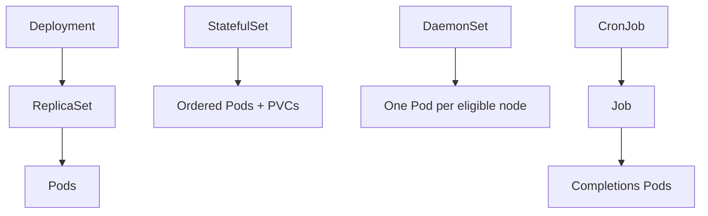
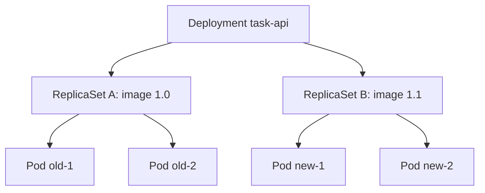
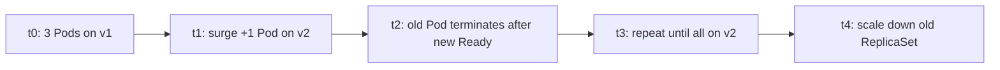
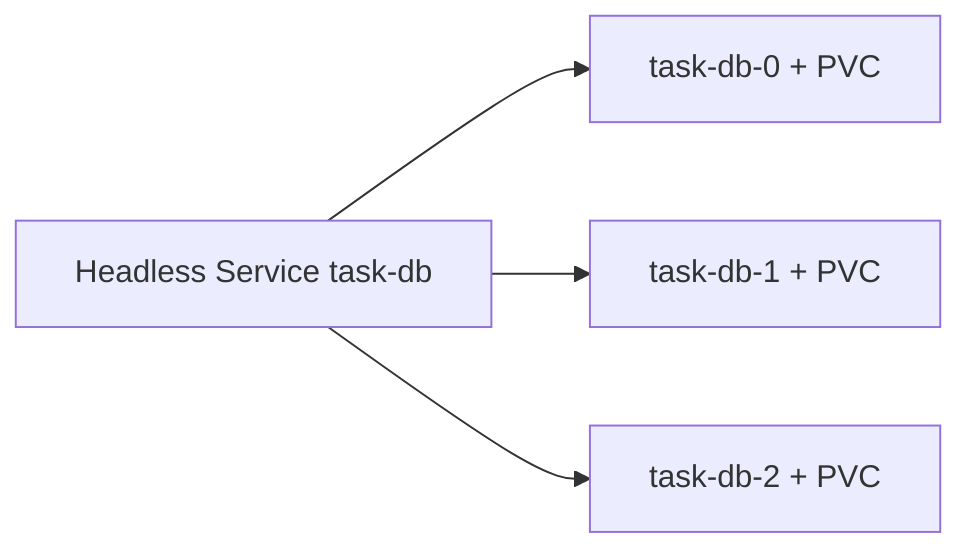
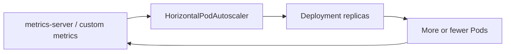

# Chapter 14 — Workloads — Deployments and Beyond

> **Learning Objectives**
>
> By the end of this chapter, you will be able to:
>
> - Explain why controllers own Pods instead of leaving bare Pods in production
> - Deploy and roll out stateless apps with Deployments and ReplicaSets
> - Choose StatefulSets, DaemonSets, Jobs, and CronJobs for the right workload shapes
> - Configure rolling updates, rollbacks, and HorizontalPodAutoscaler targets
> - Avoid common replica, identity, and Job parallelism pitfalls

---

## 14.1 Why controllers, not bare Pods

### In plain terms

A bare Pod is a single plant in a pot. Knock it over and it stays down. A **controller** is a gardener with a planting plan: "always three roses in this bed." Controllers recreate, scale, and update Pods from a template. The problem they solve is the Chapter 11 lesson at scale: someone must hold the promise that the workload exists—and it must not be a human at 3 a.m.

You might think a carefully named bare Pod in production is "simpler than a Deployment." It is simpler until the node dies. Then you discover nobody recorded desired replicas, rollout history, or who owns replacement.

> ⚠️ **Common Pitfall:** Using `kubectl run` for a production API and forgetting it created an unmanaged Pod (or a generated Deployment you never committed). Always end in Git-reviewed controller YAML.

### Under the hood

| Controller | Keeps this true |
|------------|-----------------|
| **ReplicaSet** | N identical Pods matching a selector |
| **Deployment** | Declarative updates + history over ReplicaSets |
| **StatefulSet** | Stable network identity + ordered Pods + PVC templates |
| **DaemonSet** | One Pod per eligible node |
| **Job** | Run N completions to success |
| **CronJob** | Schedule Jobs on a timetable |

```bash
$ kind create cluster --name workloads --image kindest/node:v1.36.0
```

All of these store desired state in the API and reconcile forever (or until Job completion).



*Figure 14.1: Controllers own Pods (or Jobs); each workload API keeps a different promise true.*

**What breaks if you delete a bare Pod on a drained node:** nothing recreates it—no ownerReference, no ReplicaSet, no page until users notice.

### In production

**Ownership:** app teams own Deployment/StatefulSet/Job manifests; platform bans long-lived bare Pods via admission.

Ban long-lived bare Pods via policy. Every app Pod should have an ownerReference to a controller. Exceptions (debug Pods) must be namespaced and TTL'd.

> 🏭 **Production floor:** Never ship bare Pods as the production shape. Policy should reject Pods without a controlling owner except break-glass debug namespaces. Pair every multi-replica Deployment with a **PodDisruptionBudget** before the first node drain (details in Chapter 24)—hooks help one Pod leave; PDBs keep enough Pods available.

**Do:** `kubectl get pods -o jsonpath` and confirm `ownerReferences` in prod namespaces. **Don't:** leave `kubectl run` leftovers after demos.

**Before you leave this section**

- **Understand:** Controllers hold the promise; bare Pods do not.
- **Try:** Compare ownerReferences on a bare Pod vs a Deployment Pod.
- **Watch in prod:** Unmanaged Pods and Deployments without PDBs before maintenance.

---

## 14.2 ReplicaSets: the count keeper

### In plain terms

A **ReplicaSet** only cares about arithmetic: enough Pods with the right labels? If not, create or delete. The problem it solves is holding a replica count—Deployments layer rollout strategy and history on top.

You might think you should edit ReplicaSets directly during an incident. The Deployment controller owns them and will fight you; use `kubectl rollout` against the Deployment instead.

> ⚠️ **Common Pitfall:** Editing a ReplicaSet under a live Deployment "to fix replicas." The Deployment reconciles and overwrites your fix—or leaves you with a confusing revision.

### Under the hood

You rarely create ReplicaSets by hand—Deployments own them. Still, understand the shape:

```yaml
apiVersion: apps/v1
kind: ReplicaSet
metadata:
  name: task-api-rs
spec:
  replicas: 3
  selector:
    matchLabels:
      app: task-api
      version: "1.0"
  template:
    metadata:
      labels:
        app: task-api
        version: "1.0"
    spec:
      containers:
        - name: api
          image: ghcr.io/mastering-k8s/task-api:1.0
```

Selector labels must match the template labels. Mismatch is rejected or orphan-prone depending on how you got there—never "almost match."

```bash
$ kubectl get rs -l app=task-api
```

```text
NAME                  DESIRED   CURRENT   READY   AGE
task-api-7d9f8c5b64   3         3         3       10m
```

**What breaks if two ReplicaSets share overlapping selectors:** they fight over Pods—creation and deletion storms. Keep selector labels unique per controller.

### In production

**Ownership:** Deployment controller owns ReplicaSets; humans own the Deployment manifest.

Do not manage ReplicaSets directly when a Deployment exists—you will fight the Deployment controller. Use `kubectl rollout` against Deployments.

**Before you leave this section**

- **Understand:** ReplicaSets keep counts; Deployments own rollouts over them.
- **Try:** List ReplicaSets under a Deployment during a rollout (old + new).
- **Watch in prod:** Manual ReplicaSet edits during incidents.

---

## 14.3 Deployments: the stateless workhorse

### In plain terms

A **Deployment** is how most HTTP APIs and workers ship: replica count, Pod template, and a strategy for replacing old Pods with new ones. The problem it solves is shipping new images without deleting the Service or inventing a custom rollout script.

You might think changing the image tag is enough for a safe rollout. Without readiness probes, Kubernetes may mark new Pods Ready immediately and serve errors while the rollout "succeeds."

> ⚠️ **Common Pitfall:** Rolling without readiness probes and celebrating `kubectl rollout status` while users see 5xx.

### Under the hood

```yaml
apiVersion: apps/v1
kind: Deployment
metadata:
  name: task-api
  labels:
    app: task-api
spec:
  replicas: 3
  selector:
    matchLabels:
      app: task-api
  strategy:
    type: RollingUpdate
    rollingUpdate:
      maxUnavailable: 1
      maxSurge: 1
  template:
    metadata:
      labels:
        app: task-api
    spec:
      containers:
        - name: api
          image: ghcr.io/mastering-k8s/task-api:1.0
          ports:
            - containerPort: 8000
          readinessProbe:
            httpGet:
              path: /readyz
              port: 8000
          resources:
            requests:
              cpu: "100m"
              memory: "128Mi"
```

```bash
$ kubectl apply -f task-api-deploy.yaml
deployment.apps/task-api created
$ kubectl get deploy,rs,pods -l app=task-api
```

Change `image` to `:1.1` and re-apply—the Deployment creates a new ReplicaSet and rolls traffic as readiness passes.



*Figure 14.2: During a rollout the Deployment owns both old and new ReplicaSets while Pods shift from old to new.*

**What breaks if `maxUnavailable` equals all replicas with no surge capacity:** you can take the Service to zero during a rollout—pair with PDBs and sane surge settings.

### In production

**Ownership:** app teams own Deployment specs and image digests; platform may enforce digest pinning and required probes via policy.

1. Always set readiness probes before relying on RollingUpdate.
2. Pin images by digest in regulated environments.
3. Record `app.kubernetes.io/*` labels on template and Deployment.
4. Use PodDisruptionBudgets so voluntary drains cannot take all replicas.

> 🏭 **Production floor:** Digest pin the container image (`@sha256:…`) in production Deployments. Promote digests through environments; roll back by re-applying the previous digest—not by guessing tags. Before any node drain, confirm a PDB covers this Deployment (Chapter 24).

**Do:** `kubectl rollout status` and watch EndpointSlices during deploys. **Don't:** ship `:latest` to prod.

**Before you leave this section**

- **Understand:** Deployments roll ReplicaSets; readiness gates traffic.
- **Try:** Roll `:1.0` → `:1.1` and undo; inspect history.
- **Watch in prod:** Rollouts without probes and Deployments without PDBs.

---

## 14.4 Rolling updates, rollbacks, and history

### In plain terms

Rollouts replace Pods gradually. If the new version is bad, **rollback** returns you to a previous ReplicaSet revision. The problem this solves is shipping without a big-bang cutover—and undoing without rebuilding from memory.

You might think rollback is "git revert the manifest only." `kubectl rollout undo` switches ReplicaSets immediately; Git should still catch up so the next apply does not re-break you.

> ⚠️ **Warning:** Without readiness probes, Kubernetes may roll "successfully" while serving errors. Probes are part of the rollout contract.

### Under the hood

```bash
$ kubectl set image deployment/task-api api=ghcr.io/mastering-k8s/task-api:1.1
$ kubectl rollout status deployment/task-api
$ kubectl rollout history deployment/task-api
$ kubectl rollout undo deployment/task-api
$ kubectl rollout undo deployment/task-api --to-revision=2
```

`maxSurge` allows extra Pods during the update; `maxUnavailable` limits how many may be down. `Recreate` strategy kills all old Pods first—simple but downtime-heavy; use for stubborn singleton locks, not public APIs.



*Figure 14.3: A RollingUpdate timeline surges new Pods, waits for readiness, then retires old ones within maxUnavailable.*

```yaml
strategy:
  type: Recreate
```

Pause/resume for canary-style manual gates:

```bash
$ kubectl rollout pause deployment/task-api
$ kubectl rollout resume deployment/task-api
```

**What breaks if `progressDeadlineSeconds` is too short for slow image pulls:** the rollout marks failed while pods are still pulling—tune for your registry and probe timings.

### In production

**Ownership:** app/SRE teams own rollout parameters; platform alerts on `ProgressDeadlineExceeded`.

Alert on `ProgressDeadlineExceeded`. Keep `revisionHistoryLimit` high enough for undo, low enough not to clutter. Prefer progressive delivery tools (Argo Rollouts, Flagger) when you need true canaries—but master vanilla rollouts first.

**Before you leave this section**

- **Understand:** Surge/unavailable math; undo restores a prior ReplicaSet.
- **Try:** Roll, pause, resume, and undo on Task API.
- **Watch in prod:** Progress deadline failures and rollouts without readiness.

---

## 14.5 StatefulSets: stable identity and storage

### In plain terms

**StatefulSets** are for software that cares *who* it is: databases, queues, and consensus members that need stable DNS names and sticky disks. The problem they solve is identity across reschedule—`task-db-0` must keep its PVC and DNS even when the Pod moves nodes.

You might think "important apps should use StatefulSets." Importance is not identity. Stateless APIs belong on Deployments; StatefulSets add ordered rollout and PVC coupling you must operate.

> ⚠️ **Common Pitfall:** Scaling a StatefulSet down without understanding PVC retention—data volumes may remain (good) while ordinals disappear (confusing) or get deleted (catastrophic) depending on policy.

### Under the hood

Pods get ordinal names (`task-db-0`, `task-db-1`) and stable network identities via a **headless Service**. `volumeClaimTemplates` create a PVC per ordinal.

```yaml
apiVersion: v1
kind: Service
metadata:
  name: task-db
spec:
  clusterIP: None
  selector:
    app: task-db
  ports:
    - port: 5432
      name: pg
---
apiVersion: apps/v1
kind: StatefulSet
metadata:
  name: task-db
spec:
  serviceName: task-db
  replicas: 3
  selector:
    matchLabels:
      app: task-db
  template:
    metadata:
      labels:
        app: task-db
    spec:
      containers:
        - name: postgres
          image: postgres:16
          ports:
            - containerPort: 5432
          volumeMounts:
            - name: data
              mountPath: /var/lib/postgresql/data
  volumeClaimTemplates:
    - metadata:
        name: data
      spec:
        accessModes: ["ReadWriteOnce"]
        resources:
          requests:
            storage: 10Gi
```

DNS: `task-db-0.task-db.default.svc.cluster.local`. Updates and scaling are ordered by default (`OrderedReady`); `Parallel` policy trades safety for speed.



*Figure 14.4: StatefulSet ordinals get stable DNS via a headless Service and a PVC per Pod from volumeClaimTemplates.*

**What breaks if you use a ClusterIP Service instead of headless for peer discovery:** peers may all see one VIP instead of ordinal addresses—clustering software mis-forms the membership list.

### In production

**Ownership:** data/platform teams often own database StatefulSets or operators; app teams rarely should roll their own Postgres HA from a raw StatefulSet alone.

Do not use StatefulSets just because "it sounds serious." Prefer Deployments for truly stateless APIs. For databases, still run operators or proven charts when possible—StatefulSet gives primitives, not automatic Postgres HA. Understand PVC retention (`whenDeleted` / `whenScaled` policies) before scaling down.

**Before you leave this section**

- **Understand:** Ordinals + headless DNS + PVC templates are the StatefulSet promise.
- **Try:** Resolve `task-db-0.task-db…` in a lab StatefulSet.
- **Watch in prod:** Scale-down PVC policy surprises.

---

## 14.6 DaemonSets: one Pod per node

### In plain terms

A **DaemonSet** plants a daemon on every (eligible) node—log agents, node exporters, CNI helpers, storage plugins. The problem it solves is tracking node membership automatically as the cluster grows or shrinks.

You might think setting Deployment replicas equal to node count is equivalent. Nodes join and leave; Deployments do not track that, and may pack multiple agents on one node.

> ⚠️ **Common Pitfall:** Forgetting tolerations so agents never run on control-plane or tainted GPU nodes where you needed them.

### Under the hood

```yaml
apiVersion: apps/v1
kind: DaemonSet
metadata:
  name: node-agent
spec:
  selector:
    matchLabels:
      app: node-agent
  template:
    metadata:
      labels:
        app: node-agent
    spec:
      tolerations:
        - operator: Exists
      containers:
        - name: agent
          image: ghcr.io/mastering-k8s/node-agent:1.0
          resources:
            requests:
              cpu: "50m"
              memory: "64Mi"
```

Tolerate control-plane taints if the agent must run everywhere. Use `nodeSelector` / affinity to limit to GPU nodes or bare-metal pools.

**What breaks if DaemonSet memory requests are huge:** you shrink allocatable capacity on every node—schedule failures cascade for ordinary apps.

### In production

**Ownership:** platform owns logging/metrics/CNI DaemonSets; app teams rarely create them.

Budget DaemonSet resources carefully—they multiply by node count. Rolling update strategy (`RollingUpdate` vs `OnDelete`) matters for agents that must not vanish during upgrades. Prefer DaemonSets over static Pods for add-ons you manage via the API.

**Before you leave this section**

- **Understand:** DaemonSets track nodes; Deployments do not.
- **Try:** Add a node (or kind worker) and watch a DaemonSet Pod appear.
- **Watch in prod:** Agent resource budgets and missing tolerations.

---

## 14.7 Jobs: run to completion

### In plain terms

A **Job** runs work until it succeeds (or hits backoff limits)—migrations, batch reports, one-shot transforms. The problem it solves is finite work with retries without leaving a long-running Deployment that has nothing to do.

You might think a Deployment with `restartPolicy: Always` is fine for migrations. Migrations need completion counting and backoff limits; Jobs exist for that shape.

> ⚠️ **Common Pitfall:** Non-idempotent Jobs that retry and double-apply a migration—design for at-least-once execution.

### Under the hood

```yaml
apiVersion: batch/v1
kind: Job
metadata:
  name: task-migrate
spec:
  backoffLimit: 3
  template:
    spec:
      restartPolicy: Never
      containers:
        - name: migrate
          image: ghcr.io/mastering-k8s/task-api:1.1
          command: ["python", "migrate.py"]
```

```bash
$ kubectl apply -f task-migrate.yaml
$ kubectl wait --for=condition=complete job/task-migrate --timeout=120s
```

`completions` and `parallelism` control how many successful Pods you need and how many run at once. `ttlSecondsAfterFinished` cleans finished Jobs.

**What breaks if `restartPolicy: Always` is set on a Job Pod template:** the API rejects it—Jobs allow `Never` or `OnFailure` only.

### In production

**Ownership:** app teams own migration Jobs in release pipelines; platform may enforce TTL cleanup.

Make tasks idempotent—Jobs retry. Set active deadlines for runaway batches. Do not use Deployments for one-shot migrations; do not use Jobs for long-running servers.

**Before you leave this section**

- **Understand:** Jobs complete; Deployments run forever.
- **Try:** Run a Job with TTL after finished and watch cleanup.
- **Watch in prod:** Failed Jobs left forever and non-idempotent retries.

---

## 14.8 CronJobs: scheduled Jobs

### In plain terms

A **CronJob** is the cluster's crontab: at this schedule, create a Job. The problem it solves is recurring batch work without an external scheduler VM.

You might think overlapping runs are fine. Database-heavy reports often are not—set `concurrencyPolicy: Forbid` unless overlap is safe.

> ⚠️ **Common Pitfall:** Ignoring `concurrencyPolicy` on CronJobs → overlapping Jobs stampede the database.

### Under the hood

```yaml
apiVersion: batch/v1
kind: CronJob
metadata:
  name: task-nightly-report
spec:
  schedule: "15 2 * * *"
  successfulJobsHistoryLimit: 3
  failedJobsHistoryLimit: 3
  concurrencyPolicy: Forbid
  jobTemplate:
    spec:
      template:
        spec:
          restartPolicy: OnFailure
          containers:
            - name: report
              image: ghcr.io/mastering-k8s/task-api:1.1
              command: ["python", "report.py"]
```

`concurrencyPolicy`: `Allow`, `Forbid`, or `Replace`. Timezone fields exist on modern CronJobs—pin timezone explicitly in multi-region platforms.

**What breaks if the controller is down across the schedule window:** Jobs may be missed unless `startingDeadlineSeconds` and catch-up behavior are understood—alert on missed schedules.

### In production

**Ownership:** app teams own schedules; platform monitors CronJob controller health.

Alert on missed schedules (`startingDeadlineSeconds`). Keep history limits finite. Remember suspended CronJobs (`spec.suspend: true`) during incidents.

**Before you leave this section**

- **Understand:** CronJobs create Jobs; concurrencyPolicy prevents stampedes.
- **Try:** A every-minute CronJob with `Forbid` in a lab namespace.
- **Watch in prod:** Missed schedules and suspended CronJobs left suspended.

---

## 14.9 HorizontalPodAutoscaler

### In plain terms

**HPA** watches metrics and turns the replica dial on a Deployment (or similar) so capacity tracks load. The problem it solves is manual scaling lag—traffic rises, replicas should follow within policy, then shrink carefully.

You might think HPA uses percent of limits. Utilization is percent of **requests**—missing requests makes HPA meaningless or dangerous.

> ⚠️ **Common Pitfall:** HPA without resource requests → metrics nonsense and surprise scale decisions.

### Under the hood

```yaml
apiVersion: autoscaling/v2
kind: HorizontalPodAutoscaler
metadata:
  name: task-api
spec:
  scaleTargetRef:
    apiVersion: apps/v1
    kind: Deployment
    name: task-api
  minReplicas: 2
  maxReplicas: 10
  metrics:
    - type: Resource
      resource:
        name: cpu
        target:
          type: Utilization
          averageUtilization: 70
```

Requires metrics-server (or compatible metrics pipeline). Custom and external metrics unlock queue depth and business SLIs.



*Figure 14.5: HPA watches metrics and adjusts Deployment replicas so capacity tracks load.*

```bash
$ kubectl get hpa task-api -w
```

**What breaks if minReplicas is 1 and a PDB requires 2 available:** drains and autoscaling fight—align HPA mins with PDB and topology.

### In production

**Ownership:** app/SRE own HPA targets; platform owns metrics-server SLOs.

Set requests accurately—utilization is percent of request, not of limit. Pair with PodDisruptionBudgets. Prefer scale-down stabilization windows to avoid flapping. Vertical scaling (VPA / in-place resize) is complementary, not a drop-in replacement for HPA.

> 🏭 **Production floor:** Before cluster upgrades or node drains, confirm PDBs still allow voluntary disruption given current HPA replica counts. A PDB of `minAvailable: 2` with HPA at 2 replicas can block drains until you scale up—by design, not a bug.

**Before you leave this section**

- **Understand:** HPA scales on request-based utilization; needs metrics-server.
- **Try:** Attach HPA, generate load, watch replicas.
- **Watch in prod:** Flapping scale events and PDB conflicts during drains.

---

## 14.10 Choosing the right workload

| Need | Choose |
|------|--------|
| Stateless API / worker | Deployment |
| Stable identity + disk per instance | StatefulSet |
| Every node agent | DaemonSet |
| One-shot / batch | Job |
| Scheduled batch | CronJob |
| Autoscale replicas | HPA + Deployment/StatefulSet (with care) |

**Before you leave this section**

- **Understand:** Pick the API for the problem—do not stretch Deployments into databases.
- **Try:** Classify three of your real services into the table.
- **Watch in prod:** Wrong workload APIs that create operational drag.

---

## 14.11 Common pitfalls

1. **Scaling Deployments that mount RWO volumes** → multi-attach Pending hell (Chapter 18).
2. **Using StatefulSet for stateless apps** → slower rollouts, needless PVC churn.
3. **Job `restartPolicy: Always`** → invalid; use `Never` or `OnFailure`.
4. **HPA without resource requests** → metrics nonsense and surprise scale decisions.
5. **Ignoring `concurrencyPolicy` on CronJobs** → overlapping Jobs stampede the database.
6. **Editing ReplicaSets under a Deployment** → Deployment overwrites your "fix."

> ⚠️ **Common Pitfall:** `kubectl delete pod` on a Deployment Pod is fine for bounce tests; deleting the ReplicaSet under a live Deployment is how you invent outages.

---

## 14.12 Hands-on exercises

1. Deploy Task API with three replicas on `kindest/node:v1.36.0`. Roll to `:1.1` and undo.
2. Break readiness on purpose; observe rollout stall / Service endpoints.
3. Create a Job that echoes and completes; add `ttlSecondsAfterFinished`.
4. Schedule a CronJob every minute in a lab namespace; set `Forbid`; watch overlaps fail to start.
5. Install metrics-server (kind instructions) and attach an HPA; generate CPU load and watch replicas.

---

## 14.13 Check Your Understanding

**Q1.** What does a Deployment add over a raw ReplicaSet?

<details>
<summary>Show answer</summary>

Declarative rollouts, revision history, and rollback across ReplicaSets—while still using ReplicaSets underneath to maintain counts.

</details>

**Q2.** When is a StatefulSet justified?

<details>
<summary>Show answer</summary>

When instances need stable network identities and/or dedicated persistent storage per ordinal—typical for clustered stateful software—not merely because the app is "important."

</details>

**Q3.** How does a DaemonSet differ from setting replicas equal to node count on a Deployment?

<details>
<summary>Show answer</summary>

DaemonSets schedule one Pod per eligible node automatically as nodes join/leave. A Deployment with a fixed replica count does not track node membership and may pack multiple Pods on one node.

</details>

**Q4.** Why must Job Pod templates avoid `restartPolicy: Always`?

<details>
<summary>Show answer</summary>

Jobs need finite completion semantics; `Always` is for long-running controllers. Jobs allow `Never` or `OnFailure` so completions can be counted.

</details>

**Q5.** What prerequisite makes CPU-based HPA meaningful?

<details>
<summary>Show answer</summary>

Accurate CPU **requests** (and a metrics pipeline such as metrics-server). Utilization is computed against requests; missing requests break the control loop's meaning.

</details>

---

## 14.14 Key takeaways

- Controllers reconcile Pod counts and lifecycles; bare Pods are demos.
- **Deployments** dominate stateless delivery—probes make rolling updates honest.
- **StatefulSets**, **DaemonSets**, **Jobs**, and **CronJobs** cover identity, per-node, and batch shapes.
- **HPA** scales replicas from metrics; requests and PDBs make it safe.
- Pick the workload API for the problem—do not stretch Deployments into databases or Jobs into servers.

---

## 14.15 Official documentation map

| Topic | Official page |
|-------|---------------|
| Deployments | [Deployments](https://kubernetes.io/docs/concepts/workloads/controllers/deployment/) |
| ReplicaSet | [ReplicaSet](https://kubernetes.io/docs/concepts/workloads/controllers/replicaset/) |
| StatefulSets | [StatefulSets](https://kubernetes.io/docs/concepts/workloads/controllers/statefulset/) |
| DaemonSet | [DaemonSet](https://kubernetes.io/docs/concepts/workloads/controllers/daemonset/) |
| Jobs | [Jobs](https://kubernetes.io/docs/concepts/workloads/controllers/job/) |
| CronJob | [CronJob](https://kubernetes.io/docs/concepts/workloads/controllers/cron-jobs/) |
| Horizontal Pod Autoscaling | [Horizontal Pod Autoscaling](https://kubernetes.io/docs/concepts/workloads/autoscaling/) |
| Pod Disruption Budgets | [Disruptions](https://kubernetes.io/docs/concepts/workloads/pods/disruptions/) |

**Previous:** [Chapter 13 — Pods — The Fundamental Unit](13-pods-the-fundamental-unit.md) | **Next:** [Chapter 15 — Kubernetes Services](15-k8s-services.md)
