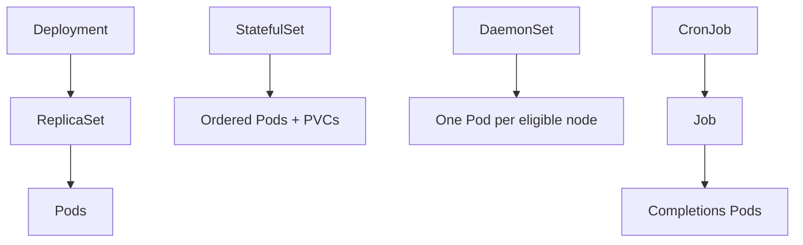
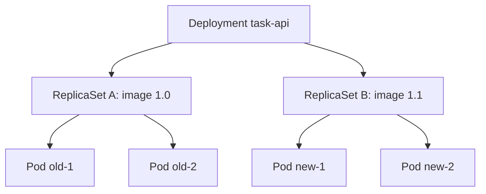
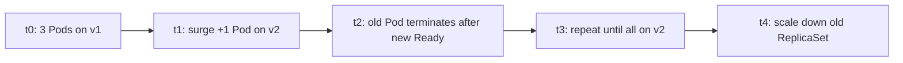
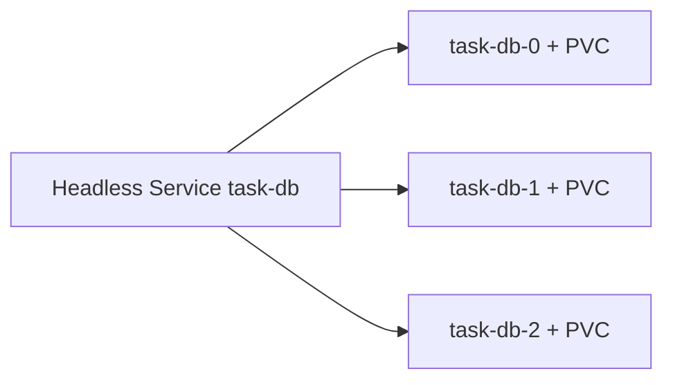
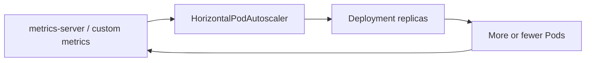

# Chapter 14 — Workloads — Deployments and Beyond

> **Learning Objectives**
>
> By the end of this chapter, you will be able to:
>
> - Say why something must own your Pods instead of you running them by hand
> - Ship and update stateless apps with Deployments and ReplicaSets
> - Pick StatefulSets, DaemonSets, Jobs, or CronJobs for the job each one is built for
> - Set up rolling updates, undo a bad release, and choose HorizontalPodAutoscaler targets
> - Avoid the usual traps with replica counts, Pod identity, and running Jobs in parallel

---

## 14.1 Why controllers, not bare Pods

### In plain terms

A **controller** is a program that creates and replaces Pods for you, from a template you wrote. You tell it how many Pods you want, and it keeps that number true.

You need one because a Pod on its own is fragile. A bare Pod is a single plant in a pot: knock it over and it stays down. A controller is a gardener working from a planting plan that says "always three roses in this bed." Something has to hold that promise, and as Chapter 11 showed, it cannot be a person at 3 a.m.

You might think a carefully named bare Pod in production is simpler than a Deployment. It is simpler, right up until the node dies. Then you find out that nobody recorded how many copies there should be, what the previous version was, or who is responsible for bringing it back.

> ⚠️ **Common Pitfall:** Using `kubectl run` for a production API and forgetting it created an unmanaged Pod (or a generated Deployment you never committed). Always end in Git-reviewed controller YAML.

### Under the hood

Here is what each controller keeps true for you:

| Controller | Keeps this true |
|------------|-----------------|
| **ReplicaSet** | N identical Pods matching a selector |
| **Deployment** | Declarative updates + history over ReplicaSets |
| **StatefulSet** | Stable network identity + ordered Pods + PVC templates |
| **DaemonSet** | One Pod per eligible node |
| **Job** | Run N completions to success |
| **CronJob** | Schedule Jobs on a timetable |

```bash
$ kind create cluster --name workloads --image kindest/node:v1.36.0
```

All of them store your desired state in the API and keep working toward it forever — or until the Job finishes.



*Figure 14.1: Controllers own Pods (or Jobs); each workload API keeps a different promise true.*

**What breaks if you delete a bare Pod on a drained node:** nothing recreates it—no ownerReference, no ReplicaSet, no page until users notice.

### In production

**Ownership:** app teams own Deployment/StatefulSet/Job manifests; platform bans long-lived bare Pods via admission.

Block long-lived bare Pods with admission policy. Every application Pod should carry an `ownerReference` pointing at a controller. Allow exceptions only for debug Pods, and only in a dedicated namespace where they expire on their own.

> 🏭 **Production floor:** Never ship bare Pods as the production shape. Policy should reject Pods without a controlling owner except break-glass debug namespaces. Pair every multi-replica Deployment with a **PodDisruptionBudget** before the first node drain (details in Chapter 24)—hooks help one Pod leave; PDBs keep enough Pods available.

**Do:** `kubectl get pods -o jsonpath` and confirm `ownerReferences` in prod namespaces. **Don't:** leave `kubectl run` leftovers after demos.

**Before you leave this section**

- **Understand:** Controllers hold the promise; bare Pods do not.
- **Try:** Compare ownerReferences on a bare Pod vs a Deployment Pod.
- **Watch in prod:** Unmanaged Pods and Deployments without PDBs before maintenance.

---

## 14.2 ReplicaSets: the count keeper

### In plain terms

A **ReplicaSet** does one thing: it counts. Are there enough Pods with the right labels? If not, it creates some. Too many? It deletes some. That is all.

You care because a ReplicaSet is one half of every Deployment. The ReplicaSet holds the number of copies. The Deployment sits above it and handles *changing* versions safely, plus keeping a history you can go back to.

You might think you should edit a ReplicaSet directly during an incident. Do not. The Deployment above it owns it and will undo your change within seconds. Run `kubectl rollout` against the Deployment instead.

> ⚠️ **Common Pitfall:** Editing a ReplicaSet under a live Deployment "to fix replicas." The Deployment reconciles and overwrites your fix—or leaves you with a confusing revision.

### Under the hood

You rarely write a ReplicaSet by hand, since Deployments create them for you. It still helps to know the shape:

```yaml
apiVersion: apps/v1
kind: ReplicaSet
metadata:
  name: task-api-rs
spec:
  replicas: 3
  selector:
    matchLabels:
      app: task-api
      version: "1.0"
  template:
    metadata:
      labels:
        app: task-api
        version: "1.0"
    spec:
      containers:
        - name: api
          image: ghcr.io/mastering-k8s/task-api:1.0
```

The selector labels must match the template labels exactly. A near-match is either rejected outright or leaves you with Pods nothing owns, depending on how you got there. Never settle for "almost matching."

```bash
$ kubectl get rs -l app=task-api
```

```text
NAME                  DESIRED   CURRENT   READY   AGE
task-api-7d9f8c5b64   3         3         3       10m
```

**What breaks if two ReplicaSets share overlapping selectors:** they fight over Pods—creation and deletion storms. Keep selector labels unique per controller.

### In production

**Ownership:** Deployment controller owns ReplicaSets; humans own the Deployment manifest.

Never manage a ReplicaSet directly while a Deployment owns it. You will lose that argument with the Deployment controller. Use `kubectl rollout` against the Deployment instead.

**Before you leave this section**

- **Understand:** ReplicaSets keep counts; Deployments own rollouts over them.
- **Try:** List ReplicaSets under a Deployment during a rollout (old + new).
- **Watch in prod:** Manual ReplicaSet edits during incidents.

---

## 14.3 Deployments: the stateless workhorse

### In plain terms

A **Deployment** is the object you write to run a stateless app. It holds three things: how many copies you want, the Pod template to copy, and the rules for swapping old Pods out for new ones.

This is what makes shipping a new version boring. Change the image in one field, apply, and the Deployment brings up new Pods and retires old ones a few at a time. Nobody deletes the Service, and nobody writes a custom rollout script.

Here is how the pieces stack. Your Deployment creates a ReplicaSet for each version. The ReplicaSet keeps its own Pod count. When you change the image, the Deployment makes a *new* ReplicaSet and shrinks the old one. Both exist for a while, which is exactly why you can go back.

> 💡 **In one line:** A ReplicaSet keeps N identical Pods alive; a Deployment manages several ReplicaSets over time so you can change versions and undo the change.

You might think changing the image tag is enough for a safe rollout. It is not. Without a readiness probe, Kubernetes counts a new Pod as Ready the moment it starts, so it can send traffic to a Pod that is still broken while the rollout reports success.

> ⚠️ **Common Pitfall:** Rolling without readiness probes and celebrating `kubectl rollout status` while users see 5xx.

### Under the hood

```yaml
apiVersion: apps/v1
kind: Deployment
metadata:
  name: task-api
  labels:
    app: task-api
spec:
  replicas: 3
  selector:
    matchLabels:
      app: task-api
  strategy:
    type: RollingUpdate
    rollingUpdate:
      maxUnavailable: 1
      maxSurge: 1
  template:
    metadata:
      labels:
        app: task-api
    spec:
      containers:
        - name: api
          image: ghcr.io/mastering-k8s/task-api:1.0
          ports:
            - containerPort: 8000
          readinessProbe:
            httpGet:
              path: /readyz
              port: 8000
          resources:
            requests:
              cpu: "100m"
              memory: "128Mi"
```

```bash
$ kubectl apply -f task-api-deploy.yaml
deployment.apps/task-api created
$ kubectl get deploy,rs,pods -l app=task-api
```

Change `image` to `:1.1` and apply again. The Deployment creates a second ReplicaSet and moves traffic over as each new Pod passes its readiness probe.



*Figure 14.2: During a rollout the Deployment owns both old and new ReplicaSets while Pods shift from old to new.*

**What breaks if `maxUnavailable` equals all replicas with no surge capacity:** you can take the Service to zero during a rollout—pair with PDBs and sane surge settings.

### In production

**Ownership:** app teams own Deployment specs and image digests; platform may enforce digest pinning and required probes via policy.

1. Always add a readiness probe before you trust RollingUpdate.
2. Pin images by digest in regulated environments.
3. Put the `app.kubernetes.io/*` labels on both the Deployment and its Pod template.
4. Add a PodDisruptionBudget so a planned node drain cannot take every replica at once.

> 🏭 **Production floor:** Digest pin the container image (`@sha256:…`) in production Deployments. Promote digests through environments; roll back by re-applying the previous digest—not by guessing tags. Before any node drain, confirm a PDB covers this Deployment (Chapter 24).

**Do:** `kubectl rollout status` and watch EndpointSlices during deploys. **Don't:** ship `:latest` to prod.

**Before you leave this section**

- **Understand:** Deployments roll ReplicaSets; readiness gates traffic.
- **Try:** Roll `:1.0` → `:1.1` and undo; inspect history.
- **Watch in prod:** Rollouts without probes and Deployments without PDBs.

---

## 14.4 Rolling updates, rollbacks, and history

### In plain terms

A **rollout** replaces Pods a few at a time instead of all at once. A **rollback** puts you back on an earlier version by switching to the ReplicaSet that version left behind.

Both exist so that shipping is reversible. You never flip the whole service at one instant, and when a release turns out to be bad, you do not rebuild the old version from memory under pressure. The old ReplicaSet is still sitting there, ready.

You might think a rollback means reverting the manifest in Git. `kubectl rollout undo` is faster and switches ReplicaSets right away, which is what you want at 2 a.m. But Git must catch up afterward, or the next `apply` will happily redeploy the broken version.

> ⚠️ **Warning:** Without readiness probes, Kubernetes may roll "successfully" while serving errors. Probes are part of the rollout contract.

### Under the hood

```bash
$ kubectl set image deployment/task-api api=ghcr.io/mastering-k8s/task-api:1.1
$ kubectl rollout status deployment/task-api
$ kubectl rollout history deployment/task-api
$ kubectl rollout undo deployment/task-api
$ kubectl rollout undo deployment/task-api --to-revision=2
```

Two numbers control the pace. `maxSurge` is how many extra Pods may exist during the update. `maxUnavailable` is how many may be missing at once. The `Recreate` strategy skips all of that and stops every old Pod before starting the new ones — simple, but it means downtime. Use it for software that cannot tolerate two versions holding the same lock, never for a public API.



*Figure 14.3: A RollingUpdate timeline surges new Pods, waits for readiness, then retires old ones within maxUnavailable.*

```yaml
strategy:
  type: Recreate
```

You can also stop a rollout partway through, check on it, and then let it continue:

```bash
$ kubectl rollout pause deployment/task-api
$ kubectl rollout resume deployment/task-api
```

**What breaks if `progressDeadlineSeconds` is too short for slow image pulls:** the rollout marks failed while pods are still pulling—tune for your registry and probe timings.

### In production

**Ownership:** app/SRE teams own rollout parameters; platform alerts on `ProgressDeadlineExceeded`.

Alert on `ProgressDeadlineExceeded`. Keep `revisionHistoryLimit` big enough that you can still undo, and small enough that the list stays readable. When you need real **canary** releases — sending a small slice of traffic to the new version first — reach for Argo Rollouts or Flagger. Learn plain rollouts first.

**Before you leave this section**

- **Understand:** Surge/unavailable math; undo restores a prior ReplicaSet.
- **Try:** Roll, pause, resume, and undo on Task API.
- **Watch in prod:** Progress deadline failures and rollouts without readiness.

---

## 14.5 StatefulSets: stable identity and storage

### In plain terms

A **StatefulSet** runs Pods that each have a fixed name, a fixed DNS address, and their own disk. Pod `task-db-0` stays `task-db-0`, keeps the same storage, and keeps the same address even after it moves to another node.

You need this for software that cares *which* instance it is. A database replica, a queue broker, or a member of a consensus group all track each other by name. If names shuffle on every restart, the cluster cannot form. A Deployment gives you interchangeable Pods with random names, which is the opposite of what these need.

You might think important applications should use StatefulSets. Importance is not the test — identity is. A stateless API belongs on a Deployment. A StatefulSet brings ordered rollouts and a disk per Pod, and both of those are extra things you have to operate.

> ⚠️ **Common Pitfall:** Scaling a StatefulSet down without understanding PVC retention—data volumes may remain (good) while ordinals disappear (confusing) or get deleted (catastrophic) depending on policy.

### Under the hood

Pods are numbered (`task-db-0`, `task-db-1`) and get a stable DNS name from a **headless Service**, which is a Service with no cluster IP that returns the individual Pod addresses instead. The `volumeClaimTemplates` field creates one PersistentVolumeClaim per numbered Pod.

```yaml
apiVersion: v1
kind: Service
metadata:
  name: task-db
spec:
  clusterIP: None
  selector:
    app: task-db
  ports:
    - port: 5432
      name: pg
---
apiVersion: apps/v1
kind: StatefulSet
metadata:
  name: task-db
spec:
  serviceName: task-db
  replicas: 3
  selector:
    matchLabels:
      app: task-db
  template:
    metadata:
      labels:
        app: task-db
    spec:
      containers:
        - name: postgres
          image: postgres:16
          ports:
            - containerPort: 5432
          volumeMounts:
            - name: data
              mountPath: /var/lib/postgresql/data
  volumeClaimTemplates:
    - metadata:
        name: data
      spec:
        accessModes: ["ReadWriteOnce"]
        resources:
          requests:
            storage: 10Gi
```

Each Pod gets its own DNS name, like `task-db-0.task-db.default.svc.cluster.local`. By default, updates and scaling happen one Pod at a time, in order (`OrderedReady`). The `Parallel` policy does them all at once, which is faster and less safe.



*Figure 14.4: StatefulSet ordinals get stable DNS via a headless Service and a PVC per Pod from volumeClaimTemplates.*

**What breaks if you use a ClusterIP Service instead of headless for peer discovery:** peers may all see one VIP instead of ordinal addresses—clustering software mis-forms the membership list.

### In production

**Ownership:** data/platform teams often own database StatefulSets or operators; app teams rarely should roll their own Postgres HA from a raw StatefulSet alone.

Do not reach for a StatefulSet because it sounds serious. Use a Deployment for anything genuinely stateless. For databases, run a proven operator or chart where one exists: a StatefulSet gives you building blocks, not working Postgres failover. Read the PVC retention policies (`whenDeleted` and `whenScaled`) before you ever scale one down.

**Before you leave this section**

- **Understand:** Ordinals + headless DNS + PVC templates are the StatefulSet promise.
- **Try:** Resolve `task-db-0.task-db…` in a lab StatefulSet.
- **Watch in prod:** Scale-down PVC policy surprises.

---

## 14.6 DaemonSets: one Pod per node

### In plain terms

A **DaemonSet** runs exactly one copy of a Pod on every node that qualifies. Add a node and a Pod appears there. Remove a node and its Pod goes away with it.

You need this for anything that has to watch the machine it runs on: log collectors, metrics agents, CNI network helpers, and storage plugins. Each one must be present on every node, or you get blind spots.

You might think you can just set a Deployment's replicas to the number of nodes. That breaks quickly. Nodes join and leave, and a Deployment does not notice. It may also place two agents on one node and none on another, because it only counts Pods.

> ⚠️ **Common Pitfall:** Forgetting tolerations so agents never run on control-plane or tainted GPU nodes where you needed them.

### Under the hood

```yaml
apiVersion: apps/v1
kind: DaemonSet
metadata:
  name: node-agent
spec:
  selector:
    matchLabels:
      app: node-agent
  template:
    metadata:
      labels:
        app: node-agent
    spec:
      tolerations:
        - operator: Exists
      containers:
        - name: agent
          image: ghcr.io/mastering-k8s/node-agent:1.0
          resources:
            requests:
              cpu: "50m"
              memory: "64Mi"
```

If the agent truly must run everywhere, it needs tolerations for the control-plane taints. To go the other way and cover only some nodes, use `nodeSelector` or affinity — for example, only GPU nodes or only a bare-metal pool.

**What breaks if DaemonSet memory requests are huge:** you shrink allocatable capacity on every node—schedule failures cascade for ordinary apps.

### In production

**Ownership:** platform owns logging/metrics/CNI DaemonSets; app teams rarely create them.

Budget DaemonSet resources carefully, because whatever you request is charged on every single node. Choose the update strategy on purpose too: `RollingUpdate` replaces agents automatically, while `OnDelete` waits for you, which matters for agents that must not disappear mid-upgrade. For add-ons you want to manage through the API, use a DaemonSet rather than static Pods.

**Before you leave this section**

- **Understand:** DaemonSets track nodes; Deployments do not.
- **Try:** Add a node (or kind worker) and watch a DaemonSet Pod appear.
- **Watch in prod:** Agent resource budgets and missing tolerations.

---

## 14.7 Jobs: run to completion

### In plain terms

A **Job** runs a task until it finishes successfully, then stops. If the task fails, the Job retries it up to a limit you set.

You need this for work that ends: a database migration, a nightly report, a one-time data transform. A Deployment is built to run forever and restart anything that exits, which is exactly wrong for work that is supposed to exit. A Job counts successes instead, and gives up after too many failures rather than looping forever.

You might think a Deployment can handle a migration. It cannot count completions, and it cannot stop trying. That is why the Job API exists.

> ⚠️ **Common Pitfall:** Non-idempotent Jobs that retry and double-apply a migration—design for at-least-once execution.

### Under the hood

```yaml
apiVersion: batch/v1
kind: Job
metadata:
  name: task-migrate
spec:
  backoffLimit: 3
  template:
    spec:
      restartPolicy: Never
      containers:
        - name: migrate
          image: ghcr.io/mastering-k8s/task-api:1.1
          command: ["python", "migrate.py"]
```

```bash
$ kubectl apply -f task-migrate.yaml
$ kubectl wait --for=condition=complete job/task-migrate --timeout=120s
```

Two fields control the shape of the work. `completions` is how many Pods must succeed. `parallelism` is how many may run at the same time. Set `ttlSecondsAfterFinished` and Kubernetes deletes the finished Job for you.

**What breaks if `restartPolicy: Always` is set on a Job Pod template:** the API rejects it—Jobs allow `Never` or `OnFailure` only.

### In production

**Ownership:** app teams own migration Jobs in release pipelines; platform may enforce TTL cleanup.

Write every task so running it twice is safe, because Jobs do retry. Set `activeDeadlineSeconds` so a runaway batch cannot run all night. Never use a Deployment for a one-shot migration, and never use a Job for a long-running server.

**Before you leave this section**

- **Understand:** Jobs complete; Deployments run forever.
- **Try:** Run a Job with TTL after finished and watch cleanup.
- **Watch in prod:** Failed Jobs left forever and non-idempotent retries.

---

## 14.8 CronJobs: scheduled Jobs

### In plain terms

A **CronJob** creates a Job on a schedule you write in cron syntax. It is the cluster's version of a crontab entry.

You need it so recurring work lives in the cluster with everything else. The alternative is a separate machine running cron, which nobody patches, nobody monitors, and everybody forgets until it silently stops firing.

You might think overlapping runs are harmless. For a heavy report against a shared database, two runs at once can be much worse than one run being late. Set `concurrencyPolicy: Forbid` unless you have checked that overlap is safe.

> ⚠️ **Common Pitfall:** Ignoring `concurrencyPolicy` on CronJobs → overlapping Jobs stampede the database.

### Under the hood

```yaml
apiVersion: batch/v1
kind: CronJob
metadata:
  name: task-nightly-report
spec:
  schedule: "15 2 * * *"
  successfulJobsHistoryLimit: 3
  failedJobsHistoryLimit: 3
  concurrencyPolicy: Forbid
  jobTemplate:
    spec:
      template:
        spec:
          restartPolicy: OnFailure
          containers:
            - name: report
              image: ghcr.io/mastering-k8s/task-api:1.1
              command: ["python", "report.py"]
```

`concurrencyPolicy` takes three values: `Allow` lets runs overlap, `Forbid` skips a run while the last one is still going, and `Replace` cancels the old run in favor of the new one. Modern CronJobs also accept a time zone, and you should set it explicitly on any platform that spans regions.

**What breaks if the controller is down across the schedule window:** Jobs may be missed unless `startingDeadlineSeconds` and catch-up behavior are understood—alert on missed schedules.

### In production

**Ownership:** app teams own schedules; platform monitors CronJob controller health.

Alert on schedules that never fired, and set `startingDeadlineSeconds` so you know when a missed run is skipped. Keep the history limits finite so old Jobs do not pile up. And write down every CronJob you suspend (`spec.suspend: true`) during an incident, so someone turns it back on afterward.

**Before you leave this section**

- **Understand:** CronJobs create Jobs; concurrencyPolicy prevents stampedes.
- **Try:** A every-minute CronJob with `Forbid` in a lab namespace.
- **Watch in prod:** Missed schedules and suspended CronJobs left suspended.

---

## 14.9 HorizontalPodAutoscaler

### In plain terms

The **HorizontalPodAutoscaler** (HPA) watches a metric, such as CPU use, and changes the replica count on a Deployment to match the load.

You need it because people scale too slowly. Traffic rises at 9 a.m. and nobody notices until the queue backs up. The HPA adds Pods within a minute, inside limits you set, and removes them again carefully when load drops.

You might think the target percentage is measured against your CPU *limit*. It is not. Utilization is a percentage of the **request**. A container with no CPU request has no denominator, so the math is meaningless and the scaling decisions that follow can be dangerous.

> ⚠️ **Common Pitfall:** HPA without resource requests → metrics nonsense and surprise scale decisions.

### Under the hood

```yaml
apiVersion: autoscaling/v2
kind: HorizontalPodAutoscaler
metadata:
  name: task-api
spec:
  scaleTargetRef:
    apiVersion: apps/v1
    kind: Deployment
    name: task-api
  minReplicas: 2
  maxReplicas: 10
  metrics:
    - type: Resource
      resource:
        name: cpu
        target:
          type: Utilization
          averageUtilization: 70
```

This needs metrics-server, or another component that serves the same metrics API. With custom and external metrics you can scale on things that matter more than CPU, such as queue depth or requests per second.



*Figure 14.5: HPA watches metrics and adjusts Deployment replicas so capacity tracks load.*

```bash
$ kubectl get hpa task-api -w
```

**What breaks if minReplicas is 1 and a PDB requires 2 available:** drains and autoscaling fight—align HPA mins with PDB and topology.

### In production

**Ownership:** app/SRE own HPA targets; platform owns metrics-server SLOs.

Set requests accurately, because utilization is measured against the request and not the limit. Pair every HPA with a PodDisruptionBudget. Use a scale-down stabilization window so the replica count does not bounce up and down. Vertical scaling (VPA or in-place resize) sits alongside the HPA; it does not replace it.

> 🏭 **Production floor:** Before cluster upgrades or node drains, confirm PDBs still allow voluntary disruption given current HPA replica counts. A PDB of `minAvailable: 2` with HPA at 2 replicas can block drains until you scale up—by design, not a bug.

**Before you leave this section**

- **Understand:** HPA scales on request-based utilization; needs metrics-server.
- **Try:** Attach HPA, generate load, watch replicas.
- **Watch in prod:** Flapping scale events and PDB conflicts during drains.

---

## 14.10 Choosing the right workload

| Need | Choose |
|------|--------|
| Stateless API / worker | Deployment |
| Stable identity + disk per instance | StatefulSet |
| Every node agent | DaemonSet |
| One-shot / batch | Job |
| Scheduled batch | CronJob |
| Autoscale replicas | HPA + Deployment/StatefulSet (with care) |

**Before you leave this section**

- **Understand:** Pick the API for the problem—do not stretch Deployments into databases.
- **Try:** Classify three of your real services into the table.
- **Watch in prod:** Wrong workload APIs that create operational drag.

---

## 14.11 Common pitfalls

1. **Scaling Deployments that mount RWO volumes** → multi-attach Pending hell (Chapter 18).
2. **Using StatefulSet for stateless apps** → slower rollouts, needless PVC churn.
3. **Job `restartPolicy: Always`** → invalid; use `Never` or `OnFailure`.
4. **HPA without resource requests** → metrics nonsense and surprise scale decisions.
5. **Ignoring `concurrencyPolicy` on CronJobs** → overlapping Jobs stampede the database.
6. **Editing ReplicaSets under a Deployment** → Deployment overwrites your "fix."

> ⚠️ **Common Pitfall:** `kubectl delete pod` on a Deployment Pod is fine for bounce tests; deleting the ReplicaSet under a live Deployment is how you invent outages.

---

## 14.12 Hands-on exercises

1. Deploy Task API with three replicas on `kindest/node:v1.36.0`. Roll to `:1.1` and undo.
2. Break readiness on purpose; observe rollout stall / Service endpoints.
3. Create a Job that echoes and completes; add `ttlSecondsAfterFinished`.
4. Schedule a CronJob every minute in a lab namespace; set `Forbid`; watch overlaps fail to start.
5. Install metrics-server (kind instructions) and attach an HPA; generate CPU load and watch replicas.

---

## 14.13 Check Your Understanding

**Q1.** What does a Deployment add over a raw ReplicaSet?

<details>
<summary>Show answer</summary>

Declarative rollouts, revision history, and rollback across ReplicaSets—while still using ReplicaSets underneath to maintain counts.

</details>

**Q2.** When is a StatefulSet justified?

<details>
<summary>Show answer</summary>

When instances need stable network identities and/or dedicated persistent storage per ordinal—typical for clustered stateful software—not merely because the app is "important."

</details>

**Q3.** How does a DaemonSet differ from setting replicas equal to node count on a Deployment?

<details>
<summary>Show answer</summary>

DaemonSets schedule one Pod per eligible node automatically as nodes join/leave. A Deployment with a fixed replica count does not track node membership and may pack multiple Pods on one node.

</details>

**Q4.** Why must Job Pod templates avoid `restartPolicy: Always`?

<details>
<summary>Show answer</summary>

Jobs need finite completion semantics; `Always` is for long-running controllers. Jobs allow `Never` or `OnFailure` so completions can be counted.

</details>

**Q5.** What prerequisite makes CPU-based HPA meaningful?

<details>
<summary>Show answer</summary>

Accurate CPU **requests** (and a metrics pipeline such as metrics-server). Utilization is computed against requests; missing requests break the control loop's meaning.

</details>

---

## 14.14 Key takeaways

- A controller holds the promise that your Pods exist. A bare Pod is a demo.
- A **ReplicaSet** keeps a count. A **Deployment** manages ReplicaSets so you can change versions and undo.
- A readiness probe is what makes a rolling update honest. Without one, rollouts "succeed" while users get errors.
- `kubectl rollout undo` fixes production fast; update Git right after, or the next apply breaks it again.
- Use a **StatefulSet** only when instances need names and their own disks.
- Use a **DaemonSet** when every node needs one copy. Its resource requests are charged per node.
- Use a **Job** for work that ends, and a **CronJob** for work that repeats. Make both safe to retry.
- **HPA** scales on a percentage of *requests*, so requests must be set and accurate.
- Pick the API that matches the problem. Do not stretch a Deployment into a database or a Job into a server.

---

## 14.15 Official documentation map

| Topic | Official page |
|-------|---------------|
| Deployments | [Deployments](https://kubernetes.io/docs/concepts/workloads/controllers/deployment/) |
| ReplicaSet | [ReplicaSet](https://kubernetes.io/docs/concepts/workloads/controllers/replicaset/) |
| StatefulSets | [StatefulSets](https://kubernetes.io/docs/concepts/workloads/controllers/statefulset/) |
| DaemonSet | [DaemonSet](https://kubernetes.io/docs/concepts/workloads/controllers/daemonset/) |
| Jobs | [Jobs](https://kubernetes.io/docs/concepts/workloads/controllers/job/) |
| CronJob | [CronJob](https://kubernetes.io/docs/concepts/workloads/controllers/cron-jobs/) |
| Horizontal Pod Autoscaling | [Horizontal Pod Autoscaling](https://kubernetes.io/docs/concepts/workloads/autoscaling/) |
| Pod Disruption Budgets | [Disruptions](https://kubernetes.io/docs/concepts/workloads/pods/disruptions/) |

**Previous:** [Chapter 13 — Pods — The Fundamental Unit](13-pods-the-fundamental-unit.md) | **Next:** [Chapter 15 — Kubernetes Services](15-k8s-services.md)
