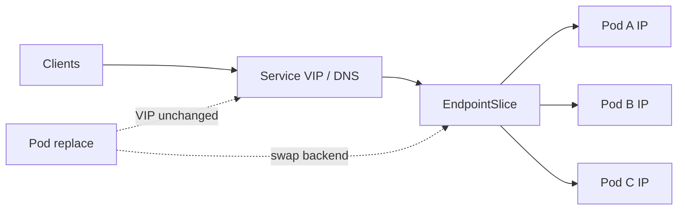
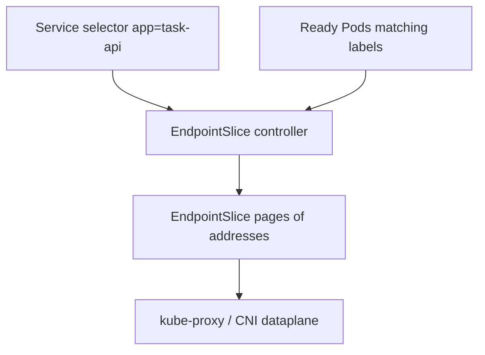
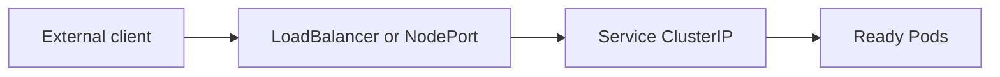
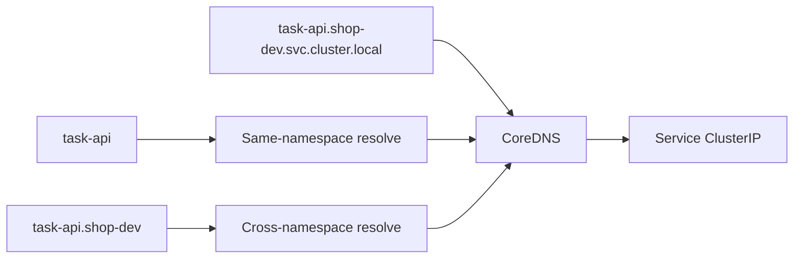
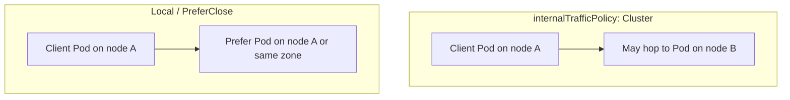

# Chapter 15 — Kubernetes Services

> **Learning Objectives**
>
> By the end of this chapter, you will be able to:
>
> - Explain why Services exist when Pod IPs are ephemeral
> - Configure ClusterIP, NodePort, LoadBalancer, ExternalName, and headless Services
> - Read EndpointSlices and Service DNS as the discovery dataplane
> - Apply dual-stack IPs, `internalTrafficPolicy`, and topology-aware routing / `trafficDistribution`
> - Choose Service types deliberately and avoid externalIPs footguns on Kubernetes 1.36

---

## 15.1 The problem: Pods are ephemeral

### In plain terms

Pod IPs are hotel room numbers: fine while you stay, useless as a business card. A **Service** gives your app a stable name and virtual IP (or DNS) that tracks whichever Pods currently match a selector.

### Under the hood

```bash
$ kind create cluster --name svc --image kindest/node:v1.36.0
$ kubectl apply -f task-api-deploy.yaml
$ kubectl get pods -o wide
```

Delete a Pod and its IP vanishes. Clients that cached that IP break. Services fix this with a selector-driven set of backends and cluster DNS.



*Figure 15.1: Clients aim at a stable Service VIP; EndpointSlices list ready Pod IPs, so replacements do not change the VIP.*

### In production

Never hand clients raw Pod IPs for durable integrations. Use Services (or Gateway API later) as the contract. Publish DNS names, not ephemeral addresses, in docs and configs.

---

## 15.2 ClusterIP: the default internal Service

### In plain terms

**ClusterIP** allocates a virtual IP reachable inside the cluster. Other Pods call `http://task-api` and land on a healthy backend.

### Under the hood

```yaml
apiVersion: v1
kind: Service
metadata:
  name: task-api
spec:
  type: ClusterIP
  selector:
    app: task-api
  ports:
    - name: http
      port: 80
      targetPort: 8000
```

```bash
$ kubectl apply -f task-api-svc.yaml
$ kubectl get svc task-api
NAME       TYPE        CLUSTER-IP     EXTERNAL-IP   PORT(S)   AGE
task-api   ClusterIP   10.96.44.12    <none>        80/TCP    5s

$ kubectl run curl --rm -it --image=curlimages/curl:8.11.1 --restart=Never -- \
    curl -sS http://task-api.default.svc.cluster.local/healthz
```

kube-proxy (or a CNI dataplane) programs forwarding from the ClusterIP to Pod IPs. `targetPort` may be a number or a named port on the Pod.

### In production

ClusterIP is the default for east-west traffic. Combine with NetworkPolicies (Chapter 19). Do not type: LoadBalancer for every microservice—most should stay internal.

---

## 15.3 EndpointSlices: how a Service finds Pods

### In plain terms

The Service is the front desk list. **EndpointSlices** are the pages of room numbers currently occupied by ready Pods.

### Under the hood

```bash
$ kubectl get endpointslices -l kubernetes.io/service-name=task-api
$ kubectl describe endpointslices -l kubernetes.io/service-name=task-api
```

EndpointSlices scale better than the legacy Endpoints object by sharding addresses. Not-ready Pods (failing readiness) are omitted from serving endpoints (or marked unready depending on publish settings).



*Figure 15.2: The EndpointSlice controller joins Service selectors with ready Pods so the dataplane can forward traffic.*

```yaml
# Optional: publish not-ready addresses for startup/drain edge cases
publishNotReadyAddresses: true
```

Headless Services still create EndpointSlices—clients resolve Pods directly via DNS.

### In production

When traffic blackholes, inspect EndpointSlices before blaming DNS. Empty slices almost always mean selector mismatch or failed readiness. Prefer EndpointSlice API awareness in custom controllers; Endpoints is legacy compatibility.

---

## 15.4 NodePort and LoadBalancer

### In plain terms

**NodePort** opens the same high port on every node and forwards to the Service. **LoadBalancer** asks infrastructure for an external IP that fronts that Service (cloud CCM or MetalLB-class tooling).

### Under the hood

```yaml
apiVersion: v1
kind: Service
metadata:
  name: task-api-public
spec:
  type: LoadBalancer
  selector:
    app: task-api
  ports:
    - port: 80
      targetPort: 8000
      nodePort: 30080   # optional; allocated if omitted
```

On kind, LoadBalancer often stays `<pending>` without an add-on. NodePort works for labs:

```yaml
type: NodePort
```



*Figure 15.3: NodePort and LoadBalancer expose the same Service forwarding path that ClusterIP uses inside the cluster.*

```bash
$ kubectl get svc task-api-public
```

> ⚠️ **Warning:** Service `spec.externalIPs` is a long-standing footgun (see CVE-2020-8554 class issues) and is **deprecated in Kubernetes 1.36**. Prefer LoadBalancer, NodePort, or Gateway API—not hand-assigned externalIPs.

### In production

Use cloud LoadBalancer Services for simple north-south entry, or Gateway/Ingress for HTTP routing at scale. Lock down NodePort exposure with firewalls; every node advertising the port expands the attack surface.

---

## 15.5 ExternalName and headless Services

### In plain terms

**ExternalName** is a DNS CNAME alias to something outside the cluster. **Headless** (`clusterIP: None`) skips the virtual IP so DNS returns Pod IPs (or external endpoints) directly—essential for StatefulSets.

### Under the hood

```yaml
apiVersion: v1
kind: Service
metadata:
  name: legacy-crm
spec:
  type: ExternalName
  externalName: crm.example.com
---
apiVersion: v1
kind: Service
metadata:
  name: task-db
spec:
  clusterIP: None
  selector:
    app: task-db
  ports:
    - port: 5432
```

```bash
$ kubectl run dig --rm -it --image=busybox:1.36 --restart=Never -- \
    nslookup task-db.default.svc.cluster.local
```

### In production

ExternalName does not proxy packets—it only answers DNS. TLS and network path still must reach the external name. Headless Services require clients that can handle multiple A/AAAA records (or use ordinal DNS).

---

## 15.6 Service DNS

### In plain terms

CoreDNS implements predictable names so manifests can hardcode service hostnames safely.

### Under the hood

Forms you will use constantly:

| Name | Meaning |
|------|---------|
| `task-api` | Same-namespace short name |
| `task-api.shop-dev` | Cross-namespace |
| `task-api.shop-dev.svc.cluster.local` | FQDN inside cluster |

```bash
$ kubectl -n kube-system get pods -l k8s-app=kube-dns
```

Search domains in Pods come from `/etc/resolv.conf` generated by kubelet.



*Figure 15.4: CoreDNS answers short, cross-namespace, and FQDN Service names with the ClusterIP clients dial.*

### In production

Prefer FQDNs in cross-team docs. Avoid embedding ClusterIPs in configs—they change on recreate. For multi-cluster, look to Gateway API and service meshes later—not ad-hoc `/etc/hosts`.

---

## 15.7 Dual-stack Services

### In plain terms

**Dual-stack** means a Service can carry IPv4 and IPv6 addresses so clients on either family reach the same app.

### Under the hood

Clusters must be started with dual-stack networking. Service fields:

```yaml
apiVersion: v1
kind: Service
metadata:
  name: task-api-dual
spec:
  ipFamilyPolicy: PreferDualStack
  ipFamilies:
    - IPv4
    - IPv6
  selector:
    app: task-api
  ports:
    - port: 80
      targetPort: 8000
```

`ipFamilyPolicy` values: `SingleStack`, `PreferDualStack`, `RequireDualStack`.

```bash
$ kubectl get svc task-api-dual -o yaml
# status.loadBalancer / clusterIPs may list both families when supported
```

kind dual-stack requires explicit cluster config; default kind is often IPv4-only—treat dual-stack as a configured feature, not a freebie.

### In production

Plan Pod and Service CIDRs for both families before day one. Test probes, NetworkPolicies, and ingress controllers on both stacks. Document which family is primary for egress NAT.

---

## 15.8 internalTrafficPolicy and topology-aware routing

### In plain terms

By default, a Service may send traffic to Pods on *any* node. Sometimes you want "prefer local" to cut hops and keep zone traffic cheap. Kubernetes exposes this with **internalTrafficPolicy** and topology-aware mechanisms including **`trafficDistribution`**.

### Under the hood

**internalTrafficPolicy**

| Value | Behavior |
|-------|----------|
| `Cluster` (default) | Any ready backend in the cluster |
| `Local` | Only backends on the same node as the client; drop if none |

```yaml
apiVersion: v1
kind: Service
metadata:
  name: task-api-local
spec:
  selector:
    app: task-api
  internalTrafficPolicy: Local
  ports:
    - port: 80
      targetPort: 8000
```

**externalTrafficPolicy: Local** (for NodePort/LoadBalancer) preserves client source IP and skips cross-node hop—at the cost of imbalanced load if Pods are uneven.

**Topology-aware routing / trafficDistribution** hints the dataplane to prefer same-zone endpoints when possible:

```yaml
apiVersion: v1
kind: Service
metadata:
  name: task-api-topo
spec:
  selector:
    app: task-api
  trafficDistribution: PreferClose
  ports:
    - port: 80
      targetPort: 8000
```

Exact hint semantics evolve with the dataplane (kube-proxy iptables/ipvs, eBPF CNIs). EndpointSlices carry topology hints for consumers. Always verify behavior on *your* CNI/proxy mode.



*Figure 15.5: Cluster policy may cross nodes; Local and PreferClose keep traffic on the same node or closer topology when backends exist.*

### In production

1. Use `internalTrafficPolicy: Local` for node-local agents and caches that must not hairpin across the fabric.
2. Use `externalTrafficPolicy: Local` when you need real client IPs and can schedule enough Pods per node/zone.
3. Enable topology-aware distribution for multi-zone clusters to reduce cross-AZ spend—monitor for hotspotting.
4. Never assume hints override readiness; unhealthy local Pods still must not receive traffic.

> 💡 **Tip:** Topology-aware routing annotations of older versions gave way to clearer Service fields such as `trafficDistribution`. Prefer the documented field for 1.36+ manifests.

---

## 15.9 Session affinity and traffic quirks

### In plain terms

Sometimes you want the same client to stick to the same Pod briefly (sticky sessions). Services can do coarse affinity—but sticky sessions often signal a design smell.

### Under the hood

```yaml
sessionAffinity: ClientIP
sessionAffinityConfig:
  clientIP:
    timeoutSeconds: 10800
```

This is not a full application session store. Prefer shared caches/databases for true session continuity.

### In production

Favor stateless apps behind Services. If you need affinity, document failure modes when Pods roll.

---

## 15.10 Choosing a Service type

| Type | Primary use | External reachability | Notes |
|------|-------------|----------------------|-------|
| **ClusterIP** | Default in-cluster access | No | Stable VIP + DNS east-west |
| **NodePort** | Lab access / on-prem entry without LB controller | Via node IP:port | Expands attack surface on every node |
| **LoadBalancer** | Cloud or MetalLB external VIP | Yes (when provisioned) | Stays Pending without a CCM/LB |
| **ExternalName** | DNS alias to external hostname | N/A (CNAME only) | Does not proxy packets |
| **Headless** (`clusterIP: None`) | Direct Pod DNS (StatefulSet, client-side LB) | No VIP | Returns Pod IPs / external endpoints |

North-south HTTP with host/path rules belongs in Chapter 16 (Ingress / Gateway API), often in front of ClusterIP Services.

---

## 15.11 Common pitfalls

1. **Selector labels do not match Pods** → empty EndpointSlices, mysterious timeouts.
2. **Wrong `targetPort`** → connection refused on healthy Pods.
3. **Relying on `externalIPs`** → deprecated and dangerous; migrate off.
4. **`externalTrafficPolicy: Local` without Pods on every node** → intermittent failures depending on which node the LB hits.
5. **Assuming dual-stack works on default kind** → configure the cluster explicitly.
6. **Hardcoding ClusterIP** in apps → breaks on recreate.

---

## 15.12 Hands-on exercises

1. Deploy Task API and a ClusterIP Service on `kindest/node:v1.36.0`. Curl via DNS from a debug Pod.
2. Break and fix selectors; watch EndpointSlices empty and refill.
3. Convert to NodePort; reach the app from the host via mapped kind networking (document the path you used).
4. Set `internalTrafficPolicy: Local` and explain observed behavior with a single replica on a multi-node kind cluster.
5. Attempt a PreferDualStack Service; if the cluster is IPv4-only, capture the error/status and write the kind config change needed for dual-stack.

---

## 15.13 Check Your Understanding

**Q1.** Why not call Pod IPs directly from other microservices?

<details>
<summary>Show answer</summary>

Pod IPs change whenever Pods are rescheduled. Services provide stable DNS/VIP and track ready backends automatically.

</details>

**Q2.** What do EndpointSlices represent?

<details>
<summary>Show answer</summary>

Sharded sets of backend addresses (and ports/conditions) for a Service, derived from matching Pods—used by kube-proxy and other dataplanes to program forwarding.

</details>

**Q3.** What does `internalTrafficPolicy: Local` do?

<details>
<summary>Show answer</summary>

It restricts in-cluster traffic to endpoints on the same node as the client. If none exist, traffic is dropped rather than forwarded cross-node.

</details>

**Q4.** What is `trafficDistribution: PreferClose` aiming to achieve?

<details>
<summary>Show answer</summary>

It requests topology-aware preference for closer (for example same-zone) endpoints to reduce latency and cross-zone cost, subject to dataplane support and endpoint health.

</details>

**Q5.** Why avoid Service `externalIPs` on Kubernetes 1.36?

<details>
<summary>Show answer</summary>

The field has serious historical security issues and is deprecated in 1.36. Use LoadBalancer, NodePort, or Gateway API instead.

</details>

---

## 15.14 Key takeaways

- Services give stable discovery over ephemeral Pods; EndpointSlices list live backends.
- ClusterIP dominates east-west; NodePort/LoadBalancer open north-south; headless serves identity-aware clients.
- **Dual-stack**, **internalTrafficPolicy**, and **trafficDistribution** refine IP families and locality.
- DNS names—not ClusterIPs—are the contract you should publish.
- Skip deprecated **externalIPs**; prefer modern exposure paths.

---

## 15.15 Official documentation map

| Topic | Official page |
|-------|---------------|
| Services | [Service](https://kubernetes.io/docs/concepts/services-networking/service/) |
| DNS for Services and Pods | [DNS for Services and Pods](https://kubernetes.io/docs/concepts/services-networking/dns-pod-service/) |
| EndpointSlices | [EndpointSlices](https://kubernetes.io/docs/concepts/services-networking/endpoint-slices/) |
| Dual-stack | [IPv4/IPv6 dual-stack](https://kubernetes.io/docs/concepts/services-networking/dual-stack/) |
| Topology-aware routing | [Topology Aware Routing](https://kubernetes.io/docs/concepts/services-networking/topology-aware-routing/) |
| Service traffic distribution | [Service traffic distribution](https://kubernetes.io/docs/concepts/services-networking/service-traffic-distribution/) |
| Kubernetes 1.36 release | [Kubernetes v1.36 release](https://kubernetes.io/blog/2026/04/22/kubernetes-v1-36-release/) |

**Previous:** [Chapter 14 — Workloads — Deployments and Beyond](14-workloads-deployments-and-beyond.md) | **Next:** [Chapter 16 — Ingress and Gateway API](16-ingress-and-gateway-api.md)
