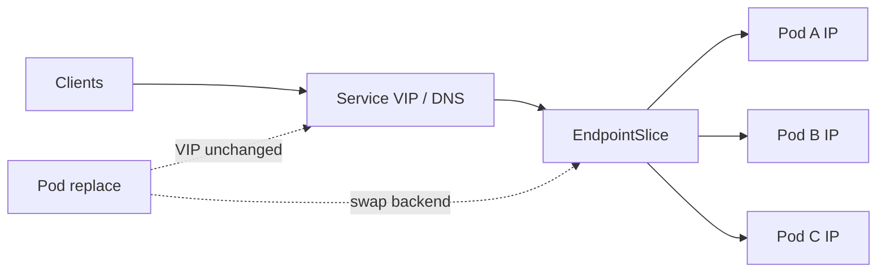
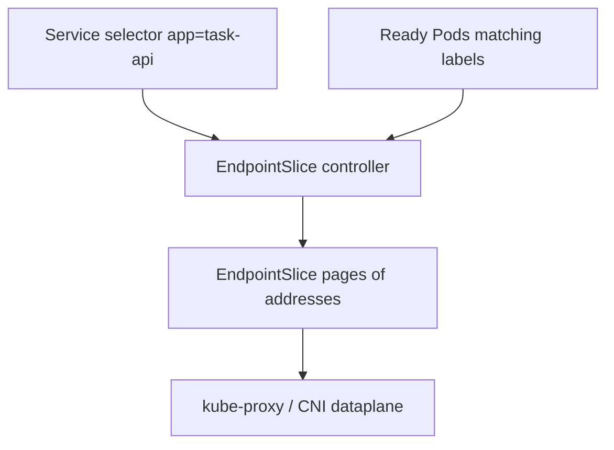
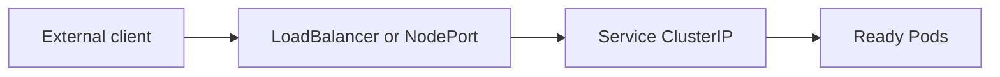
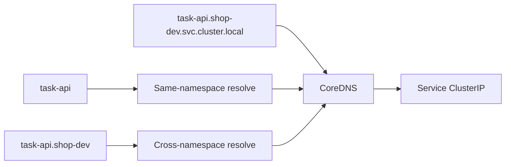
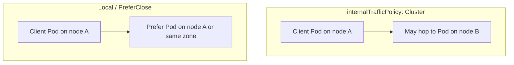

# Chapter 15 — Kubernetes Services

> **Learning Objectives**
>
> By the end of this chapter, you will be able to:
>
> - Explain why Services exist when Pod IPs are ephemeral
> - Configure ClusterIP, NodePort, LoadBalancer, ExternalName, and headless Services
> - Read EndpointSlices and Service DNS as the discovery dataplane
> - Apply dual-stack IPs, `internalTrafficPolicy`, and topology-aware routing / `trafficDistribution`
> - Choose Service types deliberately and avoid externalIPs footguns on Kubernetes 1.36

---

## 15.1 The problem: Pods are ephemeral

### In plain terms

Pod IPs are hotel room numbers: fine while you stay, useless as a business card. A **Service** gives your app a stable name and virtual IP (or DNS) that tracks whichever Pods currently match a selector. The problem this solves is discovery under churn—Deployments replace Pods constantly, and clients must not chase IPs.

You might think "I'll just put the Pod IP in an env var and update it on deploy." That recreates the 3 a.m. clipboard: every consumer needs a push when any Pod moves. Services make the cluster own that chase via selectors and EndpointSlices.

> ⚠️ **Common Pitfall:** Handing partners a raw Pod IP from `kubectl get pod -o wide` "temporarily." Temporary becomes contractual, then breaks on the next node drain.

### Under the hood

```bash
$ kind create cluster --name svc --image kindest/node:v1.36.0
$ kubectl apply -f task-api-deploy.yaml
$ kubectl get pods -o wide
```

```text
NAME                        READY   STATUS    IP           NODE
task-api-7d9f8c5b64-8m2xp   1/1     Running   10.244.1.9   mastering-k8s-worker
task-api-7d9f8c5b64-q4tzn   1/1     Running   10.244.2.4   mastering-k8s-worker2
```

Delete a Pod and its IP vanishes. Clients that cached that IP break. Services fix this with a selector-driven set of backends and cluster DNS.



*Figure 15.1: Clients aim at a stable Service VIP; EndpointSlices list ready Pod IPs, so replacements do not change the VIP.*

**What breaks if readiness is failing on every Pod:** the Service VIP still exists, but EndpointSlices are empty—clients time out and blame DNS while the real issue is probes or selectors.

### In production

**Ownership:** app teams own Service selectors and ports; platform owns kube-proxy/CNI dataplane and CoreDNS SLOs.

Never hand clients raw Pod IPs for durable integrations. Use Services (or Gateway API later) as the contract. Publish DNS names, not ephemeral addresses, in docs and configs.

**Do:** document `task-api.namespace.svc.cluster.local` as the dial-tone. **Don't:** commit ClusterIPs into application config.

**Before you leave this section**

- **Understand:** Services stabilize discovery over ephemeral Pod IPs.
- **Try:** Delete a Pod behind a Service and confirm the VIP/DNS still works.
- **Watch in prod:** Tickets that paste Pod IPs into "temporary" firewall rules.

---

## 15.2 ClusterIP: the default internal Service

### In plain terms

**ClusterIP** allocates a virtual IP reachable inside the cluster. Other Pods call `http://task-api` and land on a healthy backend. The problem it solves is east-west traffic without exposing every microservice to the internet—or paying for a load balancer per app.

You might think every Service should be LoadBalancer "so we can curl it from the laptop." That expands attack surface and cost. Prefer ClusterIP plus port-forward, Ingress, or Gateway for deliberate north-south entry.

> ⚠️ **Common Pitfall:** Mismatching `targetPort` with the container's listen port. The Service and Pod look healthy; connections refuse on the backend.

### Under the hood

```yaml
apiVersion: v1
kind: Service
metadata:
  name: task-api
spec:
  type: ClusterIP
  selector:
    app: task-api
  ports:
    - name: http
      port: 80
      targetPort: 8000
```

```bash
$ kubectl apply -f task-api-svc.yaml
$ kubectl get svc task-api
NAME       TYPE        CLUSTER-IP     EXTERNAL-IP   PORT(S)   AGE
task-api   ClusterIP   10.96.44.12    <none>        80/TCP    5s

$ kubectl run curl --rm -it --image=curlimages/curl:8.11.1 --restart=Never -- \
    curl -sS http://task-api.default.svc.cluster.local/healthz
```

kube-proxy (or a CNI dataplane) programs forwarding from the ClusterIP to Pod IPs. `targetPort` may be a number or a named port on the Pod.

**What breaks if the selector labels do not match the Pod template:** ClusterIP is allocated, DNS resolves, but EndpointSlices stay empty—classic "Service is up, app is unreachable."

### In production

**Ownership:** app teams create ClusterIP Services alongside Deployments; security teams add NetworkPolicies (Chapter 19).

ClusterIP is the default for east-west traffic. Combine with NetworkPolicies (Chapter 19). Do not type: LoadBalancer for every microservice—most should stay internal.

**Do:** name ports (`http`) so policy and Gateway refs stay readable. **Don't:** expose admin debug ports on the same Service as public HTTP without thought.

**Before you leave this section**

- **Understand:** ClusterIP is the default in-cluster VIP + DNS.
- **Try:** Curl the FQDN from a debug Pod; then break the selector and watch timeouts.
- **Watch in prod:** LoadBalancer sprawl for purely internal services.

---

## 15.3 EndpointSlices: how a Service finds Pods

### In plain terms

The Service is the front desk list. **EndpointSlices** are the pages of room numbers currently occupied by ready Pods. The problem they solve is scaling discovery: the legacy Endpoints object stuffed every address into one object and woke every watcher on every change; slices shard that work.

You might think "if `kubectl get svc` shows a ClusterIP, backends must exist." The VIP is allocated at Service create time; backends appear only when matching Pods pass readiness.

> ⚠️ **Common Pitfall:** Debugging DNS for hours while EndpointSlices are empty. Always `kubectl get endpointslices -l kubernetes.io/service-name=…` before blaming CoreDNS.

### Under the hood

```bash
$ kubectl get endpointslices -l kubernetes.io/service-name=task-api
$ kubectl describe endpointslices -l kubernetes.io/service-name=task-api
```

```text
Name:         task-api-abc12
AddressType:  IPv4
Ports:
  Name  Port  Protocol
  http  8000  TCP
Endpoints:
  10.244.1.9   ready
  10.244.2.4   ready
```

EndpointSlices scale better than the legacy Endpoints object by sharding addresses. Not-ready Pods (failing readiness) are omitted from serving endpoints (or marked unready depending on publish settings).



*Figure 15.2: The EndpointSlice controller joins Service selectors with ready Pods so the dataplane can forward traffic.*

```yaml
# Optional: publish not-ready addresses for startup/drain edge cases
publishNotReadyAddresses: true
```

Headless Services still create EndpointSlices—clients resolve Pods directly via DNS.

**What breaks if you set `publishNotReadyAddresses: true` without understanding it:** traffic can hit Pods that are still starting or draining—useful for some StatefulSet peer discovery, harmful for HTTP frontends.

### In production

**Ownership:** the EndpointSlice controller (control plane) owns slice objects; app teams own selectors and readiness that feed them.

When traffic blackholes, inspect EndpointSlices before blaming DNS. Empty slices almost always mean selector mismatch or failed readiness. Prefer EndpointSlice API awareness in custom controllers; Endpoints is legacy compatibility.

**Do:** include EndpointSlice checks in your incident runbook's first five minutes. **Don't:** build new controllers that only watch Endpoints.

**Before you leave this section**

- **Understand:** EndpointSlices are the live backend list for a Service.
- **Try:** Break readiness and watch addresses leave the slice.
- **Watch in prod:** Empty slices during rollouts that lack readiness probes.

---

## 15.4 NodePort and LoadBalancer

### In plain terms

**NodePort** opens the same high port on every node and forwards to the Service. **LoadBalancer** asks infrastructure for an external IP that fronts that Service (cloud CCM or MetalLB-class tooling). The problem they solve is north-south entry without installing a full Ingress/Gateway stack—useful for labs, simple TCP services, and cloud VIPs.

You might think LoadBalancer on kind will magically get an EXTERNAL-IP. Without a cloud controller or MetalLB-style add-on, it stays `<pending>` forever—that is expected, not a broken Service.

> ⚠️ **Warning:** Service `spec.externalIPs` is a long-standing footgun (see CVE-2020-8554 class issues) and is **deprecated in Kubernetes 1.36**. Prefer LoadBalancer, NodePort, or Gateway API—not hand-assigned externalIPs.

### Under the hood

```yaml
apiVersion: v1
kind: Service
metadata:
  name: task-api-public
spec:
  type: LoadBalancer
  selector:
    app: task-api
  ports:
    - port: 80
      targetPort: 8000
      nodePort: 30080   # optional; allocated if omitted
```

On kind, LoadBalancer often stays `<pending>` without an add-on. NodePort works for labs:

```yaml
type: NodePort
```



*Figure 15.3: NodePort and LoadBalancer expose the same Service forwarding path that ClusterIP uses inside the cluster.*

```bash
$ kubectl get svc task-api-public
```

```text
NAME              TYPE           CLUSTER-IP    EXTERNAL-IP   PORT(S)
task-api-public   LoadBalancer   10.96.10.20   <pending>     80:30080/TCP
```

**What breaks if `externalTrafficPolicy: Local` is set but Pods are not on every node:** the load balancer health-checks a node with no local endpoints and clients see intermittent failures depending on which node they hit.

### In production

**Ownership:** platform owns cloud LB provisioning and firewall rules for NodePorts; app teams choose Service type deliberately in review.

Use cloud LoadBalancer Services for simple north-south entry, or Gateway/Ingress for HTTP routing at scale. Lock down NodePort exposure with firewalls; every node advertising the port expands the attack surface.

**Do:** prefer one shared edge (Chapter 16) over dozens of public LoadBalancers. **Don't:** use deprecated `externalIPs` on 1.36.

**Before you leave this section**

- **Understand:** NodePort/LoadBalancer expose the same ClusterIP path externally.
- **Try:** Convert a Service to NodePort on kind and reach it via the documented path.
- **Watch in prod:** Pending EXTERNAL-IPs (quota/CCM) and wide-open NodePort ranges.

---

## 15.5 ExternalName and headless Services

### In plain terms

**ExternalName** is a DNS CNAME alias to something outside the cluster. **Headless** (`clusterIP: None`) skips the virtual IP so DNS returns Pod IPs (or external endpoints) directly—essential for StatefulSets. The problem they solve is two different discovery shapes: "point at an external hostname" versus "give me the members themselves."

You might think ExternalName proxies traffic through the cluster. It does not—it only answers DNS. Packets still go from the client to the external name on whatever path routing allows.

> ⚠️ **Common Pitfall:** Using a headless Service for a stateless HTTP API and then wondering why clients see multiple A records and behave oddly. Prefer ClusterIP for single VIP load balancing.

### Under the hood

```yaml
apiVersion: v1
kind: Service
metadata:
  name: legacy-crm
spec:
  type: ExternalName
  externalName: crm.example.com
---
apiVersion: v1
kind: Service
metadata:
  name: task-db
spec:
  clusterIP: None
  selector:
    app: task-db
  ports:
    - port: 5432
```

```bash
$ kubectl run dig --rm -it --image=busybox:1.36 --restart=Never -- \
    nslookup task-db.default.svc.cluster.local
```

```text
Name:    task-db.default.svc.cluster.local
Address: 10.244.1.11
Address: 10.244.2.8
```

**What breaks if clients assume a single A record for a headless Service:** connection libraries may pick one IP and stick forever, or fail when that ordinal is down—StatefulSet clients must understand member DNS (`task-db-0.task-db…`).

### In production

**Ownership:** app teams own headless Services with their StatefulSets; platform reviews ExternalName use because it can bypass expected egress controls if DNS alone is trusted.

ExternalName does not proxy packets—it only answers DNS. TLS and network path still must reach the external name. Headless Services require clients that can handle multiple A/AAAA records (or use ordinal DNS).

**Do:** pair headless Services with StatefulSets deliberately. **Don't:** use ExternalName as a poor man's egress proxy.

**Before you leave this section**

- **Understand:** ExternalName is CNAME-only; headless returns Pod IPs.
- **Try:** nslookup a headless Service and count addresses vs replica count.
- **Watch in prod:** ExternalName targets that moved without NetworkPolicy updates.

---

## 15.6 Service DNS

### In plain terms

CoreDNS implements predictable names so manifests can hardcode service hostnames safely. The problem it solves is discovery without a separate consul/etcd catalog for every cluster—DNS is the contract Pods already speak.

You might think short names always work. They resolve only within the same namespace (via search domains). Cross-namespace calls need `service.namespace` or the FQDN.

> ⚠️ **Common Pitfall:** Embedding ClusterIPs in ConfigMaps because "DNS is slow." You trade a rare lookup for a guaranteed outage on Service recreate.

### Under the hood

Forms you will use constantly:

| Name | Meaning |
|------|---------|
| `task-api` | Same-namespace short name |
| `task-api.shop-dev` | Cross-namespace |
| `task-api.shop-dev.svc.cluster.local` | FQDN inside cluster |

```bash
$ kubectl -n kube-system get pods -l k8s-app=kube-dns
```

```text
NAME                       READY   STATUS    RESTARTS   AGE
coredns-7c9d5f8b46-8xk2m   1/1     Running   0          1h
coredns-7c9d5f8b46-l4vqt   1/1     Running   0          1h
```

Search domains in Pods come from `/etc/resolv.conf` generated by kubelet.



*Figure 15.4: CoreDNS answers short, cross-namespace, and FQDN Service names with the ClusterIP clients dial.*

**What breaks if CoreDNS is down or mis-configured:** new connections fail name resolution while existing TCP connections to known IPs may continue—symptoms look like "half the mesh is fine."

### In production

**Ownership:** platform owns CoreDNS capacity and config; app teams own which names they publish in docs.

Prefer FQDNs in cross-team docs. Avoid embedding ClusterIPs in configs—they change on recreate. For multi-cluster, look to Gateway API and service meshes later—not ad-hoc `/etc/hosts`.

**Do:** publish FQDNs in runbooks. **Don't:** hardcode ClusterIPs.

**Before you leave this section**

- **Understand:** Short, cross-namespace, and FQDN forms—and when each works.
- **Try:** Resolve the same Service from two namespaces with short vs FQDN names.
- **Watch in prod:** CoreDNS latency/error metrics before app timeouts spike.

---

## 15.7 Dual-stack Services

### In plain terms

**Dual-stack** means a Service can carry IPv4 and IPv6 addresses so clients on either family reach the same app. The problem it solves is clusters and clients that are not all on one IP family—especially as IPv6-only node pools appear.

You might think flipping `ipFamilyPolicy` on a default kind cluster is enough. Dual-stack requires the cluster to have been created with dual-stack Pod/Service CIDRs; otherwise the API rejects or quietly stays single-stack.

> ⚠️ **Common Pitfall:** Assuming Ingress controllers and NetworkPolicies "just work" on both families without testing. Half the dataplane may still be IPv4-only.

### Under the hood

Clusters must be started with dual-stack networking. Service fields:

```yaml
apiVersion: v1
kind: Service
metadata:
  name: task-api-dual
spec:
  ipFamilyPolicy: PreferDualStack
  ipFamilies:
    - IPv4
    - IPv6
  selector:
    app: task-api
  ports:
    - port: 80
      targetPort: 8000
```

`ipFamilyPolicy` values: `SingleStack`, `PreferDualStack`, `RequireDualStack`.

```bash
$ kubectl get svc task-api-dual -o yaml
# status.loadBalancer / clusterIPs may list both families when supported
```

kind dual-stack requires explicit cluster config; default kind is often IPv4-only—treat dual-stack as a configured feature, not a freebie.

**What breaks if you `RequireDualStack` on an IPv4-only cluster:** Service creation fails or never becomes ready—catch it in staging with the same kind/cloud networking mode as prod.

### In production

**Ownership:** platform designs CIDRs and CNI dual-stack mode before day one; app teams only set `ipFamilyPolicy` when the platform supports it.

Plan Pod and Service CIDRs for both families before day one. Test probes, NetworkPolicies, and ingress controllers on both stacks. Document which family is primary for egress NAT.

**Do:** decide primary family for egress NAT early. **Don't:** enable dual-stack Service fields without a dual-stack cluster.

**Before you leave this section**

- **Understand:** Dual-stack is a cluster property first, a Service field second.
- **Try:** Apply PreferDualStack on default kind and record what happens.
- **Watch in prod:** Clients preferring IPv6 while middleboxes only handle IPv4.

---

## 15.8 internalTrafficPolicy and topology-aware routing

### In plain terms

By default, a Service may send traffic to Pods on *any* node. Sometimes you want "prefer local" to cut hops and keep zone traffic cheap. Kubernetes exposes this with **internalTrafficPolicy** and topology-aware mechanisms including **`trafficDistribution`**. The problem they solve is unnecessary cross-node and cross-AZ hairpinning when a local or nearby backend exists.

You might think `Local` means "always succeeds somehow." If there is no backend on the same node, traffic is dropped—not forwarded. That is correct and sharp-edged.

> ⚠️ **Common Pitfall:** Setting `externalTrafficPolicy: Local` for client-IP preservation without scheduling Pods on every node the LB targets—intermittent blackholes that depend on which node receives the packet.

### Under the hood

**internalTrafficPolicy**

| Value | Behavior |
|-------|----------|
| `Cluster` (default) | Any ready backend in the cluster |
| `Local` | Only backends on the same node as the client; drop if none |

```yaml
apiVersion: v1
kind: Service
metadata:
  name: task-api-local
spec:
  selector:
    app: task-api
  internalTrafficPolicy: Local
  ports:
    - port: 80
      targetPort: 8000
```

**externalTrafficPolicy: Local** (for NodePort/LoadBalancer) preserves client source IP and skips cross-node hop—at the cost of imbalanced load if Pods are uneven.

**Topology-aware routing / trafficDistribution** hints the dataplane to prefer same-zone endpoints when possible:

```yaml
apiVersion: v1
kind: Service
metadata:
  name: task-api-topo
spec:
  selector:
    app: task-api
  trafficDistribution: PreferClose
  ports:
    - port: 80
      targetPort: 8000
```

Exact hint semantics evolve with the dataplane (kube-proxy iptables/ipvs, eBPF CNIs). EndpointSlices carry topology hints for consumers. Always verify behavior on *your* CNI/proxy mode.



*Figure 15.5: Cluster policy may cross nodes; Local and PreferClose keep traffic on the same node or closer topology when backends exist.*

**What breaks if you enable PreferClose without zone labels on nodes:** hints may be ignored or ineffective—cloud-controller-manager labels matter (Chapter 12).

### In production

**Ownership:** platform documents which dataplane honors which hints; app teams opt in for node-local agents and multi-zone cost control.

1. Use `internalTrafficPolicy: Local` for node-local agents and caches that must not hairpin across the fabric.
2. Use `externalTrafficPolicy: Local` when you need real client IPs and can schedule enough Pods per node/zone.
3. Enable topology-aware distribution for multi-zone clusters to reduce cross-AZ spend—monitor for hotspotting.
4. Never assume hints override readiness; unhealthy local Pods still must not receive traffic.

> 💡 **Tip:** Topology-aware routing annotations of older versions gave way to clearer Service fields such as `trafficDistribution`. Prefer the documented field for 1.36+ manifests.

**Before you leave this section**

- **Understand:** Local drops when no local backend; PreferClose is a hint, not a guarantee.
- **Try:** Set internalTrafficPolicy Local with one replica on a multi-node kind cluster and observe.
- **Watch in prod:** Cross-AZ data transfer bills and LB nodes with zero local endpoints.

---

## 15.9 Session affinity and traffic quirks

### In plain terms

Sometimes you want the same client to stick to the same Pod briefly (sticky sessions). Services can do coarse affinity—but sticky sessions often signal a design smell. The problem affinity "solves" is in-memory session state; the durable fix is shared storage.

You might think ClientIP affinity survives Pod replacement. When the Pod dies, stickiness cannot save the session—the next Pod is empty unless state lived elsewhere.

> ⚠️ **Common Pitfall:** Building cart/session state only in Pod memory, then adding `sessionAffinity: ClientIP` and calling it HA.

### Under the hood

```yaml
sessionAffinity: ClientIP
sessionAffinityConfig:
  clientIP:
    timeoutSeconds: 10800
```

This is not a full application session store. Prefer shared caches/databases for true session continuity.

**What breaks during a rolling update with affinity:** clients stick to terminating Pods until timeout, amplifying errors—combine with readiness and shorter affinity timeouts if you must use it.

### In production

**Ownership:** app teams own session architecture; platform rarely enables affinity by default.

Favor stateless apps behind Services. If you need affinity, document failure modes when Pods roll.

**Do:** store sessions in Redis/DB. **Don't:** treat Service affinity as high availability.

**Before you leave this section**

- **Understand:** ClientIP affinity is coarse and fragile across rollouts.
- **Try:** Enable affinity in a lab and delete the sticky Pod; note client behavior.
- **Watch in prod:** Apps that require affinity to "work at all."

---

## 15.10 Choosing a Service type

| Type | Primary use | External reachability | Notes |
|------|-------------|----------------------|-------|
| **ClusterIP** | Default in-cluster access | No | Stable VIP + DNS east-west |
| **NodePort** | Lab access / on-prem entry without LB controller | Via node IP:port | Expands attack surface on every node |
| **LoadBalancer** | Cloud or MetalLB external VIP | Yes (when provisioned) | Stays Pending without a CCM/LB |
| **ExternalName** | DNS alias to external hostname | N/A (CNAME only) | Does not proxy packets |
| **Headless** (`clusterIP: None`) | Direct Pod DNS (StatefulSet, client-side LB) | No VIP | Returns Pod IPs / external endpoints |

North-south HTTP with host/path rules belongs in Chapter 16 (Ingress / Gateway API), often in front of ClusterIP Services.

> 🏭 **Production floor:** Default new microservices to **ClusterIP**. Justify every public LoadBalancer or NodePort in the same review that covers NetworkPolicy and ownership of the VIP. Prefer a shared Ingress/Gateway edge for HTTP.

**Before you leave this section**

- **Understand:** Which Service type matches east-west vs north-south vs StatefulSet needs.
- **Try:** Map your Task API lab to ClusterIP + (later) Ingress rather than LoadBalancer-per-env.
- **Watch in prod:** Orphaned LoadBalancers still billing after the app moved.

---

## 15.11 Common pitfalls

1. **Selector labels do not match Pods** → empty EndpointSlices, mysterious timeouts.
2. **Wrong `targetPort`** → connection refused on healthy Pods.
3. **Relying on `externalIPs`** → deprecated and dangerous; migrate off.
4. **`externalTrafficPolicy: Local` without Pods on every node** → intermittent failures depending on which node the LB hits.
5. **Assuming dual-stack works on default kind** → configure the cluster explicitly.
6. **Hardcoding ClusterIP** in apps → breaks on recreate.

---

## 15.12 Hands-on exercises

1. Deploy Task API and a ClusterIP Service on `kindest/node:v1.36.0`. Curl via DNS from a debug Pod.
2. Break and fix selectors; watch EndpointSlices empty and refill.
3. Convert to NodePort; reach the app from the host via mapped kind networking (document the path you used).
4. Set `internalTrafficPolicy: Local` and explain observed behavior with a single replica on a multi-node kind cluster.
5. Attempt a PreferDualStack Service; if the cluster is IPv4-only, capture the error/status and write the kind config change needed for dual-stack.

---

## 15.13 Check Your Understanding

**Q1.** Why not call Pod IPs directly from other microservices?

<details>
<summary>Show answer</summary>

Pod IPs change whenever Pods are rescheduled. Services provide stable DNS/VIP and track ready backends automatically.

</details>

**Q2.** What do EndpointSlices represent?

<details>
<summary>Show answer</summary>

Sharded sets of backend addresses (and ports/conditions) for a Service, derived from matching Pods—used by kube-proxy and other dataplanes to program forwarding.

</details>

**Q3.** What does `internalTrafficPolicy: Local` do?

<details>
<summary>Show answer</summary>

It restricts in-cluster traffic to endpoints on the same node as the client. If none exist, traffic is dropped rather than forwarded cross-node.

</details>

**Q4.** What is `trafficDistribution: PreferClose` aiming to achieve?

<details>
<summary>Show answer</summary>

It requests topology-aware preference for closer (for example same-zone) endpoints to reduce latency and cross-zone cost, subject to dataplane support and endpoint health.

</details>

**Q5.** Why avoid Service `externalIPs` on Kubernetes 1.36?

<details>
<summary>Show answer</summary>

The field has serious historical security issues and is deprecated in 1.36. Use LoadBalancer, NodePort, or Gateway API instead.

</details>

---

## 15.14 Key takeaways

- Services give stable discovery over ephemeral Pods; EndpointSlices list live backends.
- ClusterIP dominates east-west; NodePort/LoadBalancer open north-south; headless serves identity-aware clients.
- **Dual-stack**, **internalTrafficPolicy**, and **trafficDistribution** refine IP families and locality.
- DNS names—not ClusterIPs—are the contract you should publish.
- Skip deprecated **externalIPs**; prefer modern exposure paths.

---

## 15.15 Official documentation map

| Topic | Official page |
|-------|---------------|
| Services | [Service](https://kubernetes.io/docs/concepts/services-networking/service/) |
| DNS for Services and Pods | [DNS for Services and Pods](https://kubernetes.io/docs/concepts/services-networking/dns-pod-service/) |
| EndpointSlices | [EndpointSlices](https://kubernetes.io/docs/concepts/services-networking/endpoint-slices/) |
| Dual-stack | [IPv4/IPv6 dual-stack](https://kubernetes.io/docs/concepts/services-networking/dual-stack/) |
| Topology-aware routing | [Topology Aware Routing](https://kubernetes.io/docs/concepts/services-networking/topology-aware-routing/) |
| Service traffic distribution | [Service traffic distribution](https://kubernetes.io/docs/concepts/services-networking/service-traffic-distribution/) |
| Kubernetes 1.36 release | [Kubernetes v1.36 release](https://kubernetes.io/blog/2026/04/22/kubernetes-v1-36-release/) |

**Previous:** [Chapter 14 — Workloads — Deployments and Beyond](14-workloads-deployments-and-beyond.md) | **Next:** [Chapter 16 — Ingress and Gateway API](16-ingress-and-gateway-api.md)
