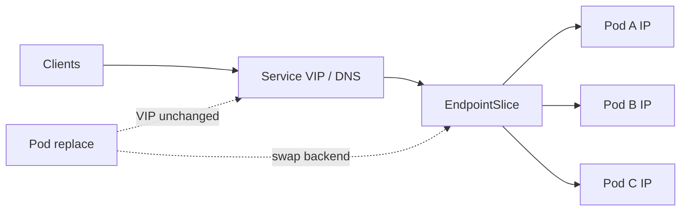
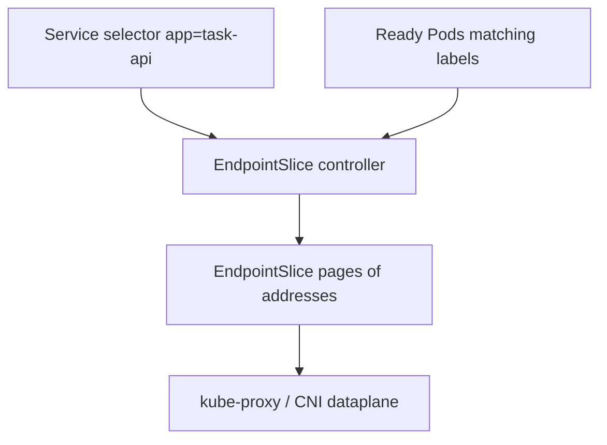
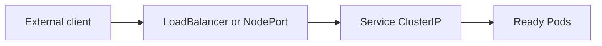
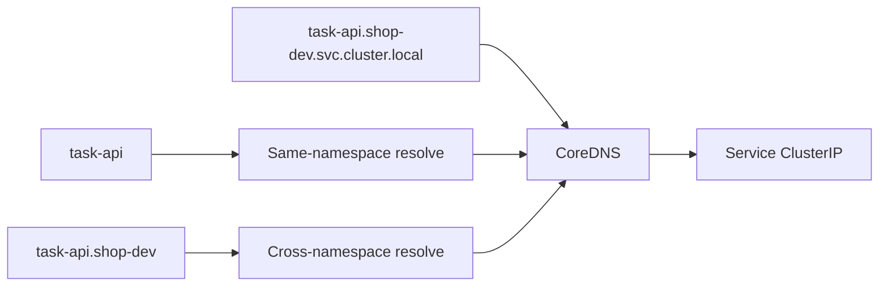
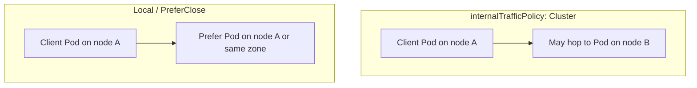

# Chapter 15 — Kubernetes Services

> **Learning Objectives**
>
> By the end of this chapter, you will be able to:
>
> - Say why Services exist, given that Pod IP addresses keep changing
> - Set up ClusterIP, NodePort, LoadBalancer, ExternalName, and headless Services
> - Read EndpointSlices and Service DNS names to see where traffic really goes
> - Use both IP families, keep traffic on the local node, and send traffic to nearby Pods with `trafficDistribution`
> - Pick each Service type on purpose, and stay away from `externalIPs` on Kubernetes 1.36

---

## 15.1 The problem: Pods are ephemeral

### In plain terms

A **Service** is a fixed name and a fixed IP address that always points at whichever Pods are currently healthy. You aim your clients at the Service, and the Service handles the changing set of Pods behind it.

You need this because a Pod IP address does not last. Every Pod gets its own IP when it starts, and that IP is gone forever when the Pod is replaced. And Pods get replaced constantly: every deploy, every crash, every node drain. A Pod IP is like a hotel room number. It works while you are there, and it is useless on a business card.

You might think you can put the Pod IP in an environment variable and update it on each deploy. That puts you back at the 3 a.m. clipboard from Chapter 11. Every single client would need a push whenever any Pod moved. The Service moves that chore into the cluster, using label selectors and EndpointSlices to keep the list current.

> 💡 **In one line:** Pod IPs die with the Pod; a Service is the address that does not change, so clients never have to know which Pods are alive.

> ⚠️ **Common Pitfall:** Handing partners a raw Pod IP from `kubectl get pod -o wide` "temporarily." Temporary becomes contractual, then breaks on the next node drain.

### Under the hood

Here is the churn, made visible:

```bash
$ kind create cluster --name svc --image kindest/node:v1.36.0
$ kubectl apply -f task-api-deploy.yaml
$ kubectl get pods -o wide
```

```text
NAME                        READY   STATUS    IP           NODE
task-api-7d9f8c5b64-8m2xp   1/1     Running   10.244.1.9   mastering-k8s-worker
task-api-7d9f8c5b64-q4tzn   1/1     Running   10.244.2.4   mastering-k8s-worker2
```

Delete either Pod and its IP is gone for good. Any client that remembered that address now fails. A Service fixes this two ways: a label selector keeps the backend list current, and cluster DNS gives clients one name to use forever.



*Figure 15.1: Clients aim at a stable Service VIP; EndpointSlices list ready Pod IPs, so replacements do not change the VIP.*

**What breaks if readiness is failing on every Pod:** the Service VIP still exists, but EndpointSlices are empty—clients time out and blame DNS while the real issue is probes or selectors.

### In production

**Ownership:** app teams own Service selectors and ports; platform owns kube-proxy/CNI dataplane and CoreDNS SLOs.

Never give a client a raw Pod IP for anything that has to keep working. The Service — or later the Gateway API — is the address you promise. Put DNS names in your docs and configs, never the short-lived addresses.

**Do:** document `task-api.namespace.svc.cluster.local` as the dial-tone. **Don't:** commit ClusterIPs into application config.

**Before you leave this section**

- **Understand:** Services stabilize discovery over ephemeral Pod IPs.
- **Try:** Delete a Pod behind a Service and confirm the VIP/DNS still works.
- **Watch in prod:** Tickets that paste Pod IPs into "temporary" firewall rules.

---

## 15.2 ClusterIP: the default internal Service

### In plain terms

**ClusterIP** is the default Service type. It gets an IP address that only works *inside* the cluster. Another Pod calls `http://task-api` and lands on one of the healthy copies.

This is what you want for almost everything. Most services in a system are only ever called by other services in the same system. Traffic between them is often called **east-west traffic**, as opposed to **north-south traffic** coming in from outside. ClusterIP handles east-west without putting anything on the internet and without paying for a load balancer per app.

You might think every Service should be a LoadBalancer so you can curl it from your laptop. That gives every service a public address, which costs money and widens your attack surface. Use ClusterIP plus `kubectl port-forward` while you work, and let a deliberate Ingress or Gateway handle real outside traffic.

> ⚠️ **Common Pitfall:** Mismatching `targetPort` with the container's listen port. The Service and Pod look healthy; connections refuse on the backend.

### Under the hood

```yaml
apiVersion: v1
kind: Service
metadata:
  name: task-api
spec:
  type: ClusterIP
  selector:
    app: task-api
  ports:
    - name: http
      port: 80
      targetPort: 8000
```

```bash
$ kubectl apply -f task-api-svc.yaml
$ kubectl get svc task-api
NAME       TYPE        CLUSTER-IP     EXTERNAL-IP   PORT(S)   AGE
task-api   ClusterIP   10.96.44.12    <none>        80/TCP    5s

$ kubectl run curl --rm -it --image=curlimages/curl:8.11.1 --restart=Never -- \
    curl -sS http://task-api.default.svc.cluster.local/healthz
```

Note the two ports. `port` is the port clients dial on the Service. `targetPort` is the port your container actually listens on. kube-proxy — or your CNI's own forwarding layer — programs the node so packets sent to the ClusterIP arrive at a Pod IP. `targetPort` can be a number or the name of a port declared on the Pod.

**What breaks if the selector labels do not match the Pod template:** ClusterIP is allocated, DNS resolves, but EndpointSlices stay empty—classic "Service is up, app is unreachable."

### In production

**Ownership:** app teams create ClusterIP Services alongside Deployments; security teams add NetworkPolicies (Chapter 19).

Make ClusterIP your default for traffic between services, and add NetworkPolicies on top (Chapter 19). Do not set `type: LoadBalancer` on every microservice. Most of them should never be reachable from outside.

**Do:** name ports (`http`) so policy and Gateway refs stay readable. **Don't:** expose admin debug ports on the same Service as public HTTP without thought.

**Before you leave this section**

- **Understand:** ClusterIP is the default in-cluster VIP + DNS.
- **Try:** Curl the FQDN from a debug Pod; then break the selector and watch timeouts.
- **Watch in prod:** LoadBalancer sprawl for purely internal services.

---

## 15.3 EndpointSlices: how a Service finds Pods

### In plain terms

An **EndpointSlice** is the actual list of Pod IP addresses and ports that a Service currently sends traffic to. A controller keeps it in sync: matching label, passing readiness, in the list.

This is the object you check first when traffic disappears. The Service is the front desk; the EndpointSlice is the page of room numbers for guests who are actually in. If that page is empty, the front desk has nowhere to send anyone.

Why "slice" and not just one list? Because the older `Endpoints` object crammed every address for a Service into a single object. Change one Pod in a 2,000-Pod Service and every watcher in the cluster got the whole list again. EndpointSlices break the list into pages so a change only wakes up the readers who need it.

You might think a ClusterIP showing up in `kubectl get svc` proves there are backends. It does not. The IP is assigned the moment you create the Service. Backends only appear once matching Pods pass their readiness probe.

> 💡 **In one line:** A Service can have an IP address and no Pods behind it — so when traffic vanishes, read the EndpointSlice before you blame DNS.

> ⚠️ **Common Pitfall:** Debugging DNS for hours while EndpointSlices are empty. Always `kubectl get endpointslices -l kubernetes.io/service-name=…` before blaming CoreDNS.

### Under the hood

```bash
$ kubectl get endpointslices -l kubernetes.io/service-name=task-api
$ kubectl describe endpointslices -l kubernetes.io/service-name=task-api
```

```text
Name:         task-api-abc12
AddressType:  IPv4
Ports:
  Name  Port  Protocol
  http  8000  TCP
Endpoints:
  10.244.1.9   ready
  10.244.2.4   ready
```

Read the `ready` markers carefully. A Pod that is failing its readiness probe is left out of the serving list, or listed as not ready, depending on the publish settings below.



*Figure 15.2: The EndpointSlice controller joins Service selectors with ready Pods so the dataplane can forward traffic.*

```yaml
# Optional: publish not-ready addresses for startup/drain edge cases
publishNotReadyAddresses: true
```

Headless Services create EndpointSlices too. The difference is that clients look up the Pod addresses directly through DNS instead of going through one shared IP.

**What breaks if you set `publishNotReadyAddresses: true` without understanding it:** traffic can hit Pods that are still starting or draining—useful for some StatefulSet peer discovery, harmful for HTTP frontends.

### In production

**Ownership:** the EndpointSlice controller (control plane) owns slice objects; app teams own selectors and readiness that feed them.

When traffic vanishes, read the EndpointSlices before you suspect DNS. An empty slice almost always means one of two things: the selector does not match your Pod labels, or readiness is failing. Write new controllers against the EndpointSlice API; `Endpoints` only exists for backward compatibility.

**Do:** include EndpointSlice checks in your incident runbook's first five minutes. **Don't:** build new controllers that only watch Endpoints.

**Before you leave this section**

- **Understand:** EndpointSlices are the live backend list for a Service.
- **Try:** Break readiness and watch addresses leave the slice.
- **Watch in prod:** Empty slices during rollouts that lack readiness probes.

---

## 15.4 NodePort and LoadBalancer

### In plain terms

**NodePort** opens the same port number on *every* node and forwards whatever arrives to your Service. **LoadBalancer** goes one step further and asks your infrastructure for a real external IP address that fronts the Service.

These two are how outside traffic gets in when you have not installed an Ingress or Gateway yet. They are a good fit for labs, for plain TCP services that have no HTTP routing rules, and for cloud load balancers you want managed for you.

You might think a LoadBalancer Service on kind will eventually show an `EXTERNAL-IP`. It will not. Something has to actually create the load balancer — a cloud controller manager, or an add-on like MetalLB. With neither installed, the field stays `<pending>` forever. That is the expected result, not a broken Service.

> ⚠️ **Warning:** Service `spec.externalIPs` is a long-standing footgun (see CVE-2020-8554 class issues) and is **deprecated in Kubernetes 1.36**. Prefer LoadBalancer, NodePort, or Gateway API—not hand-assigned externalIPs.

### Under the hood

```yaml
apiVersion: v1
kind: Service
metadata:
  name: task-api-public
spec:
  type: LoadBalancer
  selector:
    app: task-api
  ports:
    - port: 80
      targetPort: 8000
      nodePort: 30080   # optional; allocated if omitted
```

On kind, that Service usually sits at `<pending>` unless you add MetalLB or the kind Cloud Provider. NodePort works in a lab with nothing extra installed:

```yaml
type: NodePort
```



*Figure 15.3: NodePort and LoadBalancer expose the same Service forwarding path that ClusterIP uses inside the cluster.*

```bash
$ kubectl get svc task-api-public
```

```text
NAME              TYPE           CLUSTER-IP    EXTERNAL-IP   PORT(S)
task-api-public   LoadBalancer   10.96.10.20   <pending>     80:30080/TCP
```

**What breaks if `externalTrafficPolicy: Local` is set but Pods are not on every node:** the load balancer health-checks a node with no local endpoints and clients see intermittent failures depending on which node they hit.

### In production

**Ownership:** platform owns cloud LB provisioning and firewall rules for NodePorts; app teams choose Service type deliberately in review.

Use a cloud LoadBalancer Service for simple entry from outside, and an Ingress or Gateway once you need HTTP routing across many services. Put firewall rules in front of any NodePort. Remember that every node in the cluster answers on that port, so each node you add widens the attack surface.

**Do:** prefer one shared edge (Chapter 16) over dozens of public LoadBalancers. **Don't:** use deprecated `externalIPs` on 1.36.

**Before you leave this section**

- **Understand:** NodePort/LoadBalancer expose the same ClusterIP path externally.
- **Try:** Convert a Service to NodePort on kind and reach it via the documented path.
- **Watch in prod:** Pending EXTERNAL-IPs (quota/CCM) and wide-open NodePort ranges.

---

## 15.5 ExternalName and headless Services

### In plain terms

These are the two Service types that do *not* give you a load-balanced IP address. **ExternalName** is a DNS alias pointing at a hostname outside the cluster. **Headless** (`clusterIP: None`) has no IP of its own, so a DNS lookup returns the individual Pod addresses instead.

They exist because "find me a service" sometimes means two different things. Sometimes you want to reach a system that lives outside the cluster under a friendly in-cluster name. Other times you want the list of members themselves, one address each — which is exactly what a StatefulSet's peers need in order to find each other.

You might think ExternalName sends traffic through the cluster. It does not. It only answers a DNS question. Your packets go straight from the client to that external host over whatever network path exists, with no cluster hop and no cluster policy applied.

> ⚠️ **Common Pitfall:** Using a headless Service for a stateless HTTP API and then wondering why clients see multiple A records and behave oddly. Prefer ClusterIP for single VIP load balancing.

### Under the hood

```yaml
apiVersion: v1
kind: Service
metadata:
  name: legacy-crm
spec:
  type: ExternalName
  externalName: crm.example.com
---
apiVersion: v1
kind: Service
metadata:
  name: task-db
spec:
  clusterIP: None
  selector:
    app: task-db
  ports:
    - port: 5432
```

```bash
$ kubectl run dig --rm -it --image=busybox:1.36 --restart=Never -- \
    nslookup task-db.default.svc.cluster.local
```

```text
Name:    task-db.default.svc.cluster.local
Address: 10.244.1.11
Address: 10.244.2.8
```

**What breaks if clients assume a single A record for a headless Service:** connection libraries may pick one IP and stick forever, or fail when that ordinal is down—StatefulSet clients must understand member DNS (`task-db-0.task-db…`).

### In production

**Ownership:** app teams own headless Services with their StatefulSets; platform reviews ExternalName use because it can bypass expected egress controls if DNS alone is trusted.

ExternalName answers DNS and nothing else. Your TLS certificates and your network route still have to work all the way to the external host. A headless Service needs a client that can handle several A or AAAA records at once, or one that dials specific Pods by their numbered names.

**Do:** pair headless Services with StatefulSets deliberately. **Don't:** use ExternalName as a poor man's egress proxy.

**Before you leave this section**

- **Understand:** ExternalName is CNAME-only; headless returns Pod IPs.
- **Try:** nslookup a headless Service and count addresses vs replica count.
- **Watch in prod:** ExternalName targets that moved without NetworkPolicy updates.

---

## 15.6 Service DNS

### In plain terms

Every Service gets a predictable DNS name, served by **CoreDNS**, the DNS server that runs inside your cluster. Because the name is predictable, you can safely write it into a manifest before the Service even exists.

This is why Kubernetes needs no separate service catalog. Every language and every library already knows how to resolve a hostname, so DNS becomes the one lookup mechanism everything shares.

You might think a short name like `task-api` always works. It only works from inside the same namespace, because the short form relies on search domains in the Pod's resolver config. To call across namespaces you need `service.namespace` or the full name.

> ⚠️ **Common Pitfall:** Embedding ClusterIPs in ConfigMaps because "DNS is slow." You trade a rare lookup for a guaranteed outage on Service recreate.

### Under the hood

Here are the three name forms you will type constantly:

| Name | Meaning |
|------|---------|
| `task-api` | Same-namespace short name |
| `task-api.shop-dev` | Cross-namespace |
| `task-api.shop-dev.svc.cluster.local` | FQDN inside cluster |

```bash
$ kubectl -n kube-system get pods -l k8s-app=kube-dns
```

```text
NAME                       READY   STATUS    RESTARTS   AGE
coredns-7c9d5f8b46-8xk2m   1/1     Running   0          1h
coredns-7c9d5f8b46-l4vqt   1/1     Running   0          1h
```

The search domains that make short names work come from `/etc/resolv.conf`, which the kubelet writes into every Pod.



*Figure 15.4: CoreDNS answers short, cross-namespace, and FQDN Service names with the ClusterIP clients dial.*

**What breaks if CoreDNS is down or mis-configured:** new connections fail name resolution while existing TCP connections to known IPs may continue—symptoms look like "half the mesh is fine."

### In production

**Ownership:** platform owns CoreDNS capacity and config; app teams own which names they publish in docs.

Use full names in any document another team will read. Never put a ClusterIP in a config file, because it changes whenever the Service is recreated. For traffic between clusters, wait for the Gateway API and service meshes later in the book. Do not hand-edit `/etc/hosts`.

**Do:** publish FQDNs in runbooks. **Don't:** hardcode ClusterIPs.

**Before you leave this section**

- **Understand:** Short, cross-namespace, and FQDN forms—and when each works.
- **Try:** Resolve the same Service from two namespaces with short vs FQDN names.
- **Watch in prod:** CoreDNS latency/error metrics before app timeouts spike.

---

## 15.7 Dual-stack Services

### In plain terms

**Dual-stack** means one Service carries both an IPv4 address and an IPv6 address, so clients on either kind of network reach the same app. An **IP family** is just which of the two you mean.

You need this when not everything speaks the same family. IPv4 addresses are running out, IPv6-only node pools are appearing, and some clients can only use one or the other. Dual-stack lets both work without running the app twice.

You might think you can set `ipFamilyPolicy` on any cluster and be done. You cannot. The *cluster* has to have been created with address ranges for both families. Without them, the API either rejects your Service or quietly leaves it on one family only.

> ⚠️ **Common Pitfall:** Assuming Ingress controllers and NetworkPolicies "just work" on both families without testing. Half the dataplane may still be IPv4-only.

### Under the hood

The cluster must be created with dual-stack networking first. Then these Service fields apply:

```yaml
apiVersion: v1
kind: Service
metadata:
  name: task-api-dual
spec:
  ipFamilyPolicy: PreferDualStack
  ipFamilies:
    - IPv4
    - IPv6
  selector:
    app: task-api
  ports:
    - port: 80
      targetPort: 8000
```

`ipFamilyPolicy` takes three values. `SingleStack` uses one family. `PreferDualStack` asks for both and accepts one if that is all the cluster offers. `RequireDualStack` fails if both are not available.

```bash
$ kubectl get svc task-api-dual -o yaml
# status.loadBalancer / clusterIPs may list both families when supported
```

Dual-stack on kind needs explicit cluster configuration, and a default kind cluster is usually IPv4-only. Treat dual-stack as something you turn on deliberately, not something you get for free.

**What breaks if you `RequireDualStack` on an IPv4-only cluster:** Service creation fails or never becomes ready—catch it in staging with the same kind/cloud networking mode as prod.

### In production

**Ownership:** platform designs CIDRs and CNI dual-stack mode before day one; app teams only set `ipFamilyPolicy` when the platform supports it.

Plan the Pod and Service address ranges for both families before you build the cluster. Test probes, NetworkPolicies, and ingress controllers on both families, not just one. Write down which family is primary for outbound NAT, because that decision affects firewall rules everywhere else.

**Do:** decide primary family for egress NAT early. **Don't:** enable dual-stack Service fields without a dual-stack cluster.

**Before you leave this section**

- **Understand:** Dual-stack is a cluster property first, a Service field second.
- **Try:** Apply PreferDualStack on default kind and record what happens.
- **Watch in prod:** Clients preferring IPv6 while middleboxes only handle IPv4.

---

## 15.8 internalTrafficPolicy and topology-aware routing

### In plain terms

By default a Service will send a request to any healthy Pod, on any node, in any zone. Two settings let you narrow that: **`internalTrafficPolicy`** keeps in-cluster traffic on the same node, and **`trafficDistribution`** asks for nearby Pods, usually meaning the same zone.

Two reasons to care. Latency, because a request that crosses a node or a zone takes longer. And money, because most cloud providers charge for traffic between availability zones. If a perfectly good Pod is running on the same node, sending the request across the data center is pure waste.

You might read `Local` as "prefer local, fall back if needed." It does not mean that. If there is no backend on the client's own node, the traffic is **dropped**, not forwarded. That behavior is intentional, and it is sharp enough to cut you.

> ⚠️ **Common Pitfall:** Setting `externalTrafficPolicy: Local` for client-IP preservation without scheduling Pods on every node the LB targets—intermittent blackholes that depend on which node receives the packet.

### Under the hood

**internalTrafficPolicy**

| Value | Behavior |
|-------|----------|
| `Cluster` (default) | Any ready backend in the cluster |
| `Local` | Only backends on the same node as the client; drop if none |

```yaml
apiVersion: v1
kind: Service
metadata:
  name: task-api-local
spec:
  selector:
    app: task-api
  internalTrafficPolicy: Local
  ports:
    - port: 80
      targetPort: 8000
```

**externalTrafficPolicy: Local**, which applies to NodePort and LoadBalancer Services, keeps the real client IP address visible to your app and skips the extra node hop. The cost is uneven load whenever Pods are spread unevenly across nodes.

**`trafficDistribution`** asks the forwarding layer to prefer endpoints in the same zone when it can:

```yaml
apiVersion: v1
kind: Service
metadata:
  name: task-api-topo
spec:
  selector:
    app: task-api
  trafficDistribution: PreferClose
  ports:
    - port: 80
      targetPort: 8000
```

Treat `PreferClose` as a hint, not a rule. Exactly how it is honored depends on your forwarding layer — kube-proxy in iptables or IPVS mode, or an eBPF-based CNI — and that behavior keeps evolving. The hints themselves travel inside EndpointSlices. Always test what happens on *your* CNI and proxy mode.



*Figure 15.5: Cluster policy may cross nodes; Local and PreferClose keep traffic on the same node or closer topology when backends exist.*

**What breaks if you enable PreferClose without zone labels on nodes:** hints may be ignored or ineffective—cloud-controller-manager labels matter (Chapter 12).

### In production

**Ownership:** platform documents which dataplane honors which hints; app teams opt in for node-local agents and multi-zone cost control.

1. Use `internalTrafficPolicy: Local` for node-local agents and caches that must never send traffic across the network.
2. Use `externalTrafficPolicy: Local` when you need the real client IP, and only if you can keep enough Pods on every node and zone.
3. Turn on topology-aware distribution in multi-zone clusters to cut cross-zone charges, and watch for one zone getting overloaded.
4. Never assume these hints override readiness. An unhealthy local Pod must still receive no traffic.

> 💡 **Tip:** Topology-aware routing annotations of older versions gave way to clearer Service fields such as `trafficDistribution`. Prefer the documented field for 1.36+ manifests.

**Before you leave this section**

- **Understand:** Local drops when no local backend; PreferClose is a hint, not a guarantee.
- **Try:** Set internalTrafficPolicy Local with one replica on a multi-node kind cluster and observe.
- **Watch in prod:** Cross-AZ data transfer bills and LB nodes with zero local endpoints.

---

## 15.9 Session affinity and traffic quirks

### In plain terms

**Session affinity**, also called sticky sessions, sends the same client back to the same Pod for a while instead of load balancing every request.

Teams reach for it when an app keeps something in memory — a shopping cart, a login session — that only exists on one Pod. Affinity papers over that, so the client keeps hitting the Pod that remembers it. Be honest about what that is: a workaround, not a fix.

You might think affinity survives a Pod being replaced. It cannot. When that Pod dies, its memory dies with it, and the next Pod has never heard of your client. The real fix is to keep session state somewhere shared, like Redis or a database.

> ⚠️ **Common Pitfall:** Building cart/session state only in Pod memory, then adding `sessionAffinity: ClientIP` and calling it HA.

### Under the hood

```yaml
sessionAffinity: ClientIP
sessionAffinityConfig:
  clientIP:
    timeoutSeconds: 10800
```

This setting routes packets. It does not store sessions. For real session continuity, put the session in a shared cache or database.

**What breaks during a rolling update with affinity:** clients stick to terminating Pods until timeout, amplifying errors—combine with readiness and shorter affinity timeouts if you must use it.

### In production

**Ownership:** app teams own session architecture; platform rarely enables affinity by default.

Keep apps stateless behind a Service wherever you can. If you must use affinity, write down what happens to users during a rollout, so nobody is surprised on release day.

**Do:** store sessions in Redis/DB. **Don't:** treat Service affinity as high availability.

**Before you leave this section**

- **Understand:** ClientIP affinity is coarse and fragile across rollouts.
- **Try:** Enable affinity in a lab and delete the sticky Pod; note client behavior.
- **Watch in prod:** Apps that require affinity to "work at all."

---

## 15.10 Choosing a Service type

| Type | Primary use | External reachability | Notes |
|------|-------------|----------------------|-------|
| **ClusterIP** | Default in-cluster access | No | Stable VIP + DNS east-west |
| **NodePort** | Lab access / on-prem entry without LB controller | Via node IP:port | Expands attack surface on every node |
| **LoadBalancer** | Cloud or MetalLB external VIP | Yes (when provisioned) | Stays Pending without a CCM/LB |
| **ExternalName** | DNS alias to external hostname | N/A (CNAME only) | Does not proxy packets |
| **Headless** (`clusterIP: None`) | Direct Pod DNS (StatefulSet, client-side LB) | No VIP | Returns Pod IPs / external endpoints |

Routing outside HTTP traffic by hostname or URL path is Chapter 16's job (Ingress and the Gateway API). Those sit in front of ordinary ClusterIP Services.

> 🏭 **Production floor:** Default new microservices to **ClusterIP**. Justify every public LoadBalancer or NodePort in the same review that covers NetworkPolicy and ownership of the VIP. Prefer a shared Ingress/Gateway edge for HTTP.

**Before you leave this section**

- **Understand:** Which Service type matches east-west vs north-south vs StatefulSet needs.
- **Try:** Map your Task API lab to ClusterIP + (later) Ingress rather than LoadBalancer-per-env.
- **Watch in prod:** Orphaned LoadBalancers still billing after the app moved.

---

## 15.11 Common pitfalls

1. **Selector labels do not match Pods** → empty EndpointSlices, mysterious timeouts.
2. **Wrong `targetPort`** → connection refused on healthy Pods.
3. **Relying on `externalIPs`** → deprecated and dangerous; migrate off.
4. **`externalTrafficPolicy: Local` without Pods on every node** → intermittent failures depending on which node the LB hits.
5. **Assuming dual-stack works on default kind** → configure the cluster explicitly.
6. **Hardcoding ClusterIP** in apps → breaks on recreate.

---

## 15.12 Hands-on exercises

1. Deploy Task API and a ClusterIP Service on `kindest/node:v1.36.0`. Curl via DNS from a debug Pod.
2. Break and fix selectors; watch EndpointSlices empty and refill.
3. Convert to NodePort; reach the app from the host via mapped kind networking (document the path you used).
4. Set `internalTrafficPolicy: Local` and explain observed behavior with a single replica on a multi-node kind cluster.
5. Attempt a PreferDualStack Service; if the cluster is IPv4-only, capture the error/status and write the kind config change needed for dual-stack.

---

## 15.13 Check Your Understanding

**Q1.** Why not call Pod IPs directly from other microservices?

<details>
<summary>Show answer</summary>

Pod IPs change whenever Pods are rescheduled. Services provide stable DNS/VIP and track ready backends automatically.

</details>

**Q2.** What do EndpointSlices represent?

<details>
<summary>Show answer</summary>

Sharded sets of backend addresses (and ports/conditions) for a Service, derived from matching Pods—used by kube-proxy and other dataplanes to program forwarding.

</details>

**Q3.** What does `internalTrafficPolicy: Local` do?

<details>
<summary>Show answer</summary>

It restricts in-cluster traffic to endpoints on the same node as the client. If none exist, traffic is dropped rather than forwarded cross-node.

</details>

**Q4.** What is `trafficDistribution: PreferClose` aiming to achieve?

<details>
<summary>Show answer</summary>

It requests topology-aware preference for closer (for example same-zone) endpoints to reduce latency and cross-zone cost, subject to dataplane support and endpoint health.

</details>

**Q5.** Why avoid Service `externalIPs` on Kubernetes 1.36?

<details>
<summary>Show answer</summary>

The field has serious historical security issues and is deprecated in 1.36. Use LoadBalancer, NodePort, or Gateway API instead.

</details>

---

## 15.14 Key takeaways

- Pod IPs die with the Pod. A Service is the address that stays.
- An **EndpointSlice** is the live list of Pods behind a Service. Check it first when traffic disappears.
- An empty EndpointSlice means a selector mismatch or a failing readiness probe. Almost always one of those two.
- **ClusterIP** is the default and the right answer for traffic between services.
- **NodePort** and **LoadBalancer** let outside traffic in. A LoadBalancer on kind stays `<pending>` on purpose.
- **Headless** Services return Pod addresses. **ExternalName** only answers DNS and proxies nothing.
- Publish DNS names, never ClusterIPs. A ClusterIP changes when the Service is recreated.
- `Local` traffic policy *drops* traffic when no local Pod exists. `PreferClose` is only a hint.
- Never use `externalIPs`. It is deprecated in 1.36 and has a bad security history.

---

## 15.15 Official documentation map

| Topic | Official page |
|-------|---------------|
| Services | [Service](https://kubernetes.io/docs/concepts/services-networking/service/) |
| DNS for Services and Pods | [DNS for Services and Pods](https://kubernetes.io/docs/concepts/services-networking/dns-pod-service/) |
| EndpointSlices | [EndpointSlices](https://kubernetes.io/docs/concepts/services-networking/endpoint-slices/) |
| Dual-stack | [IPv4/IPv6 dual-stack](https://kubernetes.io/docs/concepts/services-networking/dual-stack/) |
| Topology-aware routing | [Topology Aware Routing](https://kubernetes.io/docs/concepts/services-networking/topology-aware-routing/) |
| Service traffic distribution | [Service traffic distribution](https://kubernetes.io/docs/concepts/services-networking/service-traffic-distribution/) |
| Kubernetes 1.36 release | [Kubernetes v1.36 release](https://kubernetes.io/blog/2026/04/22/kubernetes-v1-36-release/) |

**Previous:** [Chapter 14 — Workloads — Deployments and Beyond](14-workloads-deployments-and-beyond.md) | **Next:** [Chapter 16 — Ingress and Gateway API](16-ingress-and-gateway-api.md)
