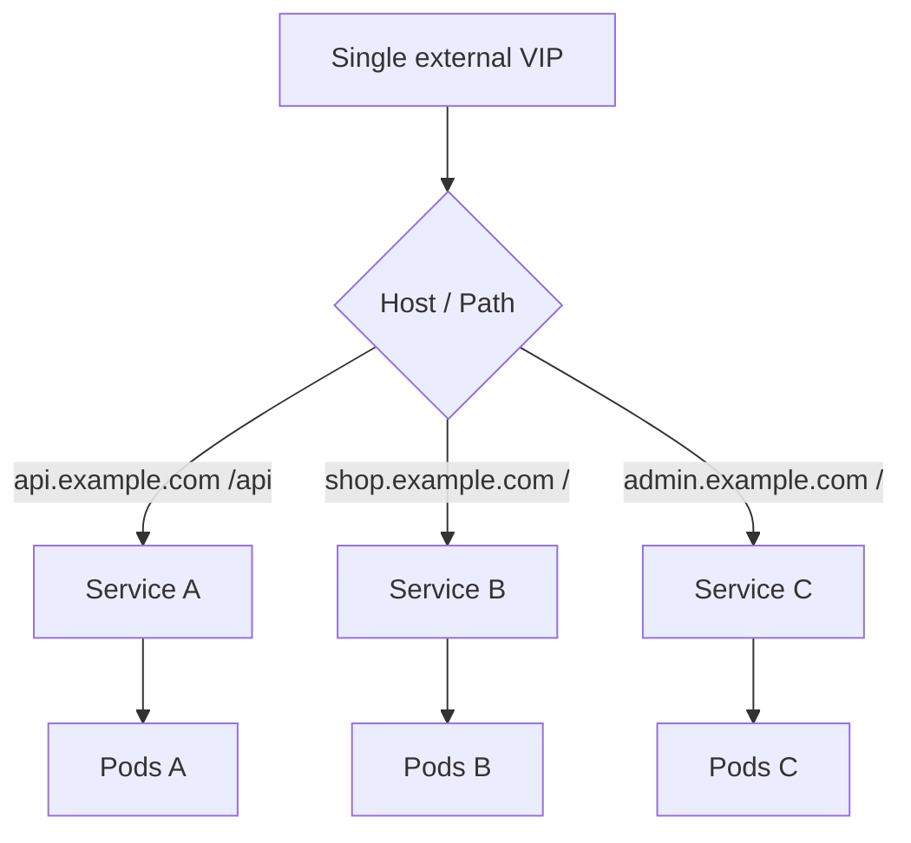
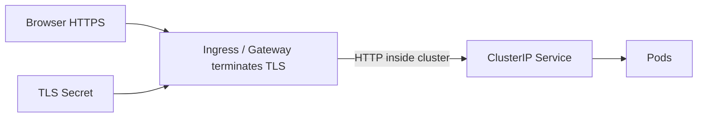
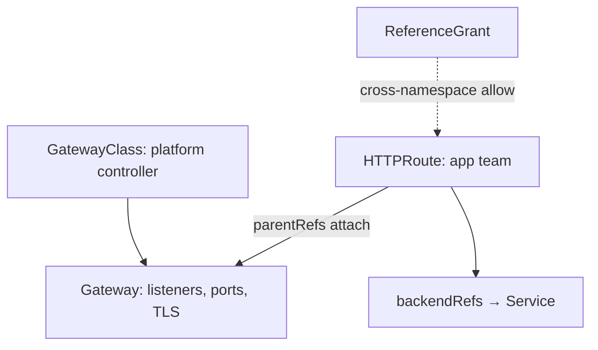
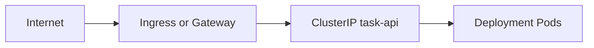

# Chapter 16 — Ingress and Gateway API

> **Learning Objectives**
>
> By the end of this chapter, you will be able to:
>
> - Explain why LoadBalancer-per-Service does not scale for HTTP applications
> - Deploy path- and host-based routing with the Ingress API and an Ingress controller
> - Terminate TLS at the edge using Secrets and certificate workflows
> - Model the same traffic with Gateway API (`GatewayClass`, `Gateway`, `HTTPRoute`)
> - Choose Gateway API for new platforms while operating existing Ingress responsibly on Kubernetes 1.36

---

## 16.1 Why not a LoadBalancer for every app?

### In plain terms

Cloud load balancers are pricey elevators. If every microservice demands its own elevator, the lobby becomes a mall of VIP doors. **Ingress** and **Gateway API** put one (or a few) elevators in front of many apps and route by hostname and path.

### Under the hood

```text
Internet → LoadBalancer / Node IP → Ingress or Gateway controller → ClusterIP Services → Pods
```

You keep Services as ClusterIP and attach HTTP routing rules at the edge. One external IP can serve `api.example.com` and `admin.example.com` with different backends.

```bash
$ kind create cluster --name edge --image kindest/node:v1.36.0
```



*Figure 16.1: One edge VIP fans out by Host and Path to many ClusterIP Services and their Pods.*

### In production

Centralize TLS, WAF, and rate limits at the edge layer. Chargeback per LoadBalancer IP gets ugly fast—prefer shared ingress gateways with clear route ownership.

---

## 16.2 Ingress = resource + controller

### In plain terms

An **Ingress** object is a wish list ("send `/api` to the Task API Service"). An **Ingress controller** is software that reads wishes and programs a proxy (NGINX, HAProxy, Traefik, cloud L7, and others).

### Under the hood

Without a controller, Ingress objects do nothing. Install one that matches your platform—many kind tutorials use a documented Ingress NGINX manifest, but treat controller choice as an ops decision. On Kubernetes **1.36**, platform teams are actively steered toward **Gateway API** for new designs; Ingress remains widely deployed.

```yaml
apiVersion: networking.k8s.io/v1
kind: Ingress
metadata:
  name: task-api
  annotations:
    # controller-specific settings vary; keep them minimal and documented
spec:
  ingressClassName: nginx
  rules:
    - host: task.local
      http:
        paths:
          - path: /
            pathType: Prefix
            backend:
              service:
                name: task-api
                port:
                  number: 80
```

```bash
$ kubectl apply -f task-api-ingress.yaml
$ kubectl get ingress task-api
```

`IngressClass` names which controller should honor the object when several coexist.

```mermaid
flowchart LR
  ingressObj["Ingress object: wish list"] --> class["IngressClass"]
  class --> controller["Ingress controller"]
  controller --> proxy["Proxy: NGINX / Traefik / ..."]
  proxy --> services["ClusterIP Services"]
```

*Figure 16.2: An Ingress object does nothing until a matching IngressClass controller programs a proxy.*

### In production

Pin controller versions; watch CVE advisories for proxies. Prefer `ingressClassName` over deprecated class annotations. Document that removing the controller orphans every Ingress.

> ⚠️ **Warning:** Controllers differ in annotation dialects. An annotation that works on one vendor's Ingress may be ignored or harmful on another. Prefer portable fields, then document required annotations per platform.

---

## 16.3 Path-based and host-based routing

### In plain terms

**Hosts** are virtual doors (`api.example.com` vs `assets.example.com`). **Paths** are hallways behind one door (`/api` vs `/admin`).

### Under the hood

```yaml
apiVersion: networking.k8s.io/v1
kind: Ingress
metadata:
  name: shop
spec:
  ingressClassName: nginx
  rules:
    - host: shop.example.com
      http:
        paths:
          - path: /api
            pathType: Prefix
            backend:
              service:
                name: task-api
                port:
                  number: 80
          - path: /
            pathType: Prefix
            backend:
              service:
                name: storefront
                port:
                  number: 80
    - host: admin.shop.example.com
      http:
        paths:
          - path: /
            pathType: Prefix
            backend:
              service:
                name: admin-ui
                port:
                  number: 80
```

`pathType`: `Exact`, `Prefix`, or `ImplementationSpecific`. Order and longest-prefix behavior can be controller-specific—test rewrites carefully.

### In production

Keep public admin hosts behind SSO and NetworkPolicies. Avoid regex spaghetti in annotations when a second Ingress/Gateway is clearer. Load-test path routing before big launches—some controllers evaluate rules differently under scale.

---

## 16.4 TLS termination with Ingress

### In plain terms

Browsers speak HTTPS to the edge. The Ingress controller presents a certificate and can forward HTTP to Services inside the cluster.

### Under the hood

```yaml
apiVersion: v1
kind: Secret
metadata:
  name: task-tls
type: kubernetes.io/tls
data:
  tls.crt: ...
  tls.key: ...
---
apiVersion: networking.k8s.io/v1
kind: Ingress
metadata:
  name: task-api
spec:
  ingressClassName: nginx
  tls:
    - hosts:
        - task.example.com
      secretName: task-tls
  rules:
    - host: task.example.com
      http:
        paths:
          - path: /
            pathType: Prefix
            backend:
              service:
                name: task-api
                port:
                  number: 80
```

cert-manager (ecosystem) can automate issuance into TLS Secrets. Redirect HTTP→HTTPS via controller settings.



*Figure 16.3: TLS terminates at the edge using a Secret; backends often see plain HTTP on ClusterIP Services.*

### In production

Prefer short-lived automated certs. Restrict who can read TLS Secrets (RBAC). Decide where you terminate TLS (edge only vs re-encrypt to Pods) and document trust boundaries.

---

## 16.5 Gateway API: the successor model

### In plain terms

**Gateway API** splits responsibilities the way real organizations work: infrastructure teams own **Gateways** (listeners, ports, TLS), app teams own **Routes** (attach paths/hosts to Services). It is more expressive and role-oriented than Ingress.

### Under the hood

Core kinds:

| Kind | Role |
|------|------|
| **GatewayClass** | Names a controller implementation (cluster-scoped) |
| **Gateway** | Concrete listeners (ports, protocol, TLS) |
| **HTTPRoute** | HTTP matching and backend refs |
| **GRPCRoute** / others | Non-HTTP traffic (as supported) |
| **ReferenceGrant** | Cross-namespace allowances |

```yaml
apiVersion: gateway.networking.k8s.io/v1
kind: Gateway
metadata:
  name: edge
  namespace: gateway-system
spec:
  gatewayClassName: cilium   # example — use your installed class
  listeners:
    - name: https
      protocol: HTTPS
      port: 443
      hostname: "*.example.com"
      tls:
        mode: Terminate
        certificateRefs:
          - name: wildcard-example-tls
      allowedRoutes:
        namespaces:
          from: Selector
          selector:
            matchLabels:
              allow-edge: "true"
---
apiVersion: gateway.networking.k8s.io/v1
kind: HTTPRoute
metadata:
  name: task-api
  namespace: shop
  labels:
    allow-edge: "true"
spec:
  parentRefs:
    - name: edge
      namespace: gateway-system
  hostnames:
    - task.example.com
  rules:
    - matches:
        - path:
            type: PathPrefix
            value: /
      backendRefs:
        - name: task-api
          port: 80
```

```bash
$ kubectl get gatewayclass,gateway,httproute -A
```

Gateway API is **not** "Ingress with new names"—attachment, weighting, header matching, and cross-namespace grants are first-class.



*Figure 16.4: Platform owns GatewayClass and Gateway listeners; apps attach HTTPRoutes, with ReferenceGrant bridging namespaces when needed.*

### In production

1. Standardize on one GatewayClass per environment.
2. Use `allowedRoutes` and ReferenceGrant so app teams cannot hijack listeners.
3. Migrate route-by-route from Ingress; run both during transition.
4. On 1.36+, treat Gateway API as the default for *new* north-south HTTP; keep Ingress where controllers and muscle memory still dominate.

> 💡 **Tip:** Many CNIs and mesh projects ship Gateway API controllers. Pick based on platform strategy, not blog hype—prove TLS, timeouts, and observability in a pilot.

---

## 16.6 Ingress versus Gateway API

### In plain terms

Ingress is the older, flatter API everyone knows. Gateway API is the modern, role-aware toolkit. You may run both for years.

### Under the hood

| Concern | Ingress | Gateway API |
|---------|---------|-------------|
| Roles | Mostly one object | Split Gateway vs Route |
| Expressiveness | Limited; annotations fill gaps | Rich portable matches/filters |
| Cross-namespace | Awkward / vendorish | ReferenceGrant model |
| Non-HTTP | Weak | Explicit route types |
| Ecosystem | Ubiquitous | Rapidly standard for new platforms |

### In production

Freeze net-new Ingress for greenfield if Gateway is ready. Do not rewrite working Ingress on Friday before a holiday. Train app teams on `HTTPRoute` ownership and promotion rules.



*Figure 16.5: Whether you use Ingress or Gateway API, the Task API still sits behind the same ClusterIP Service.*

---

## 16.7 Wiring the Task API from the edge

### In plain terms

Same app, two eras: ClusterIP Service stays; only the edge object changes.

### Under the hood

Prerequisites: Deployment + ClusterIP `task-api` from Chapters 14–15. Then either Ingress or HTTPRoute as above. Validate:

```bash
$ kubectl get svc task-api
$ kubectl describe ingress task-api
# or
$ kubectl describe httproute task-api
```

From a machine that resolves the host (local `/etc/hosts` or real DNS):

```bash
$ curl -sS https://task.example.com/healthz
```

On kind, follow your controller's documented port-mapping approach (NodePort, `extraPortMappings`, or cloud-provider emulation).

### In production

Health checks must hit readiness-backed Services. Configure timeouts and retries at the Gateway/Ingress *and* keep app SLOs honest—edge retries can amplify load.

---

## 16.8 Common pitfalls

1. **Creating Ingress with no controller** → address empty forever; nothing routes.
2. **Forgetting `ingressClassName`** with multiple controllers → silent ignore.
3. **TLS Secret in the wrong namespace** → controller cannot read certs.
4. **HTTPRoute without permission to attach** → parentRefs rejected; check allowedRoutes/ReferenceGrant.
5. **PathPrefix `/` catching everything** → more specific routes never win if misordered for your controller.
6. **Assuming annotation portability** across Ingress vendors.

> ⚠️ **Common Pitfall:** Debugging DNS at the laptop while the Gateway never programmed the listener. Always compare `kubectl describe` status conditions on Gateway/HTTPRoute with curl failures.

---

## 16.9 Hands-on exercises

1. Create a kind 1.36 cluster (`kindest/node:v1.36.0`). Install an Ingress controller of your choice; expose Task API with host-based Ingress.
2. Add TLS with a self-signed Secret; curl with `-k` and verify the hostname.
3. Install a Gateway API CRDs + controller compatible with your lab; recreate routing with Gateway + HTTPRoute.
4. Put the Gateway in one namespace and HTTPRoute in another; fix attachment with allowedRoutes / ReferenceGrant.
5. Write a short migration note: which annotation features you lose/gain moving from your Ingress dialect to Gateway filters.

---

## 16.10 Check Your Understanding

**Q1.** What are the two halves of "Ingress" people conflate?

<details>
<summary>Show answer</summary>

The **Ingress API object** (desired routing) and the **Ingress controller** (proxy that implements it). Without a controller, objects are inert.

</details>

**Q2.** Why did Gateway API separate Gateway from HTTPRoute?

<details>
<summary>Show answer</summary>

To match organizational roles: platform teams manage listeners/TLS capacity; application teams manage routes to their Services—with safer cross-namespace controls.

</details>

**Q3.** Where should TLS certificates usually live for edge termination?

<details>
<summary>Show answer</summary>

In Secrets referenced by the Ingress TLS section or Gateway listener `certificateRefs`, readable by the edge controller—not baked into application images.

</details>

**Q4.** Does Gateway API replace ClusterIP Services?

<details>
<summary>Show answer</summary>

No. Routes still forward to Services (or advanced backends). Services remain the stable in-cluster dial-tone for Pods.

</details>

**Q5.** What should new platforms on Kubernetes 1.36 prefer for greenfield L7 entry?

<details>
<summary>Show answer</summary>

**Gateway API**, while continuing to operate existing Ingress where required—Ingress remains common but Gateway is the forward direction for expressive, role-oriented routing.

</details>

---

## 16.11 Key takeaways

- One edge VIP with host/path routing beats a LoadBalancer per microservice.
- Ingress needs a controller; portability ends where annotations begin.
- TLS belongs at the edge with tightly RBAC'd Secrets (often automated).
- **Gateway API** splits platform vs app concerns and is the strategic choice for new designs on **1.36**.
- Migrate deliberately; Services underneath stay the same.

---

## 16.12 Official documentation map

| Topic | Official page |
|-------|---------------|
| Ingress | [Ingress](https://kubernetes.io/docs/concepts/services-networking/ingress/) |
| Ingress controllers | [Ingress Controllers](https://kubernetes.io/docs/concepts/services-networking/ingress-controllers/) |
| IngressClass | [Ingress Class](https://kubernetes.io/docs/concepts/services-networking/ingress-class/) |
| Gateway API | [Gateway API](https://gateway-api.sigs.k8s.io/) |
| Gateway API concepts | [API Overview](https://gateway-api.sigs.k8s.io/concepts/api-overview/) |
| HTTPRoute | [HTTPRoute](https://gateway-api.sigs.k8s.io/api-types/httproute/) |
| Reference grants | [ReferenceGrant](https://gateway-api.sigs.k8s.io/api-types/referencegrant/) |
| Kubernetes networking overview | [Services, Load Balancing, and Networking](https://kubernetes.io/docs/concepts/services-networking/) |

**Previous:** [Chapter 15 — Kubernetes Services](15-k8s-services.md) | **Next:** [Chapter 17 — Configuration and Secrets](17-configuration-and-secrets.md)
