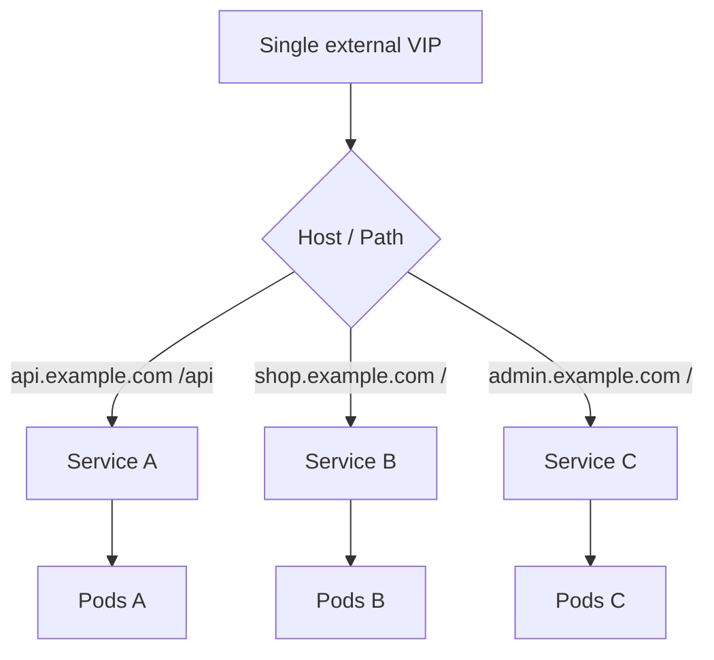
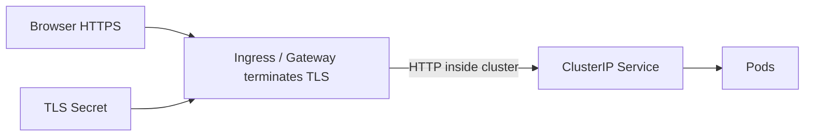
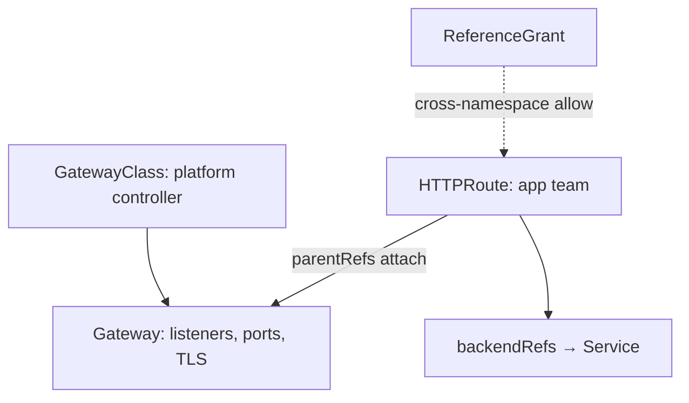
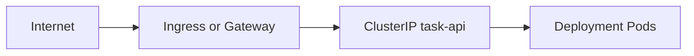

# Chapter 16 — Ingress and Gateway API

> **Learning Objectives**
>
> By the end of this chapter, you will be able to:
>
> - Say why giving every HTTP app its own load balancer stops working
> - Route by hostname and URL path using the Ingress API and an Ingress controller
> - Handle HTTPS at the cluster edge, using Secrets to hold certificates
> - Describe the same routing with the Gateway API (`GatewayClass`, `Gateway`, `HTTPRoute`)
> - Choose the Gateway API for new work while still running your existing Ingress safely on Kubernetes 1.36

---

## 16.1 Why not a LoadBalancer for every app?

### In plain terms

**Ingress** and the **Gateway API** are two ways to put one shared front door in front of many apps. Traffic arrives at a single address, and the front door decides which app gets it, based on the hostname and the URL path.

You need this because a cloud load balancer is expensive and slow to manage. Give each microservice its own and you end up with dozens of public IP addresses, dozens of certificates to renew, and no single place to add a firewall rule or a rate limit. Think of load balancers as elevators: one lobby with a few elevators works, and a lobby with forty private elevators does not.

You might think a LoadBalancer Service is simpler and you will add Ingress later. Later rarely arrives. By then you have inherited the public IPs, the scattered certificates, and no shared place to enforce anything. Once you have more than a couple of public HTTP apps, start with a shared front door.

> ⚠️ **Common Pitfall:** Creating a LoadBalancer Service *and* an Ingress for the same app without documenting which VIP clients should use—split traffic and split outages.

### Under the hood

Here is the full path a request takes:

```text
Internet → LoadBalancer / Node IP → Ingress or Gateway controller → ClusterIP Services → Pods
```

Notice what does *not* change. Your Services stay ClusterIP, exactly as Chapter 15 left them. All you add is HTTP routing rules at the edge. One external IP can then serve `api.example.com` and `admin.example.com` from completely different Pods.

```bash
$ kind create cluster --name edge --image kindest/node:v1.36.0
```



*Figure 16.1: One edge VIP fans out by Host and Path to many ClusterIP Services and their Pods.*

**What breaks if the edge is a single unreplicated controller Pod:** every HTTP app behind that VIP goes dark together—edge HA is a platform SLO, not an app detail.

### In production

**Ownership:** platform owns the shared VIP, controller capacity, and TLS defaults; app teams own routes (Ingress/HTTPRoute) to their ClusterIP Services.

Handle TLS certificates, web application firewall rules, and rate limits in one place at the edge. Billing per public IP address gets ugly fast, so share one gateway and make route ownership explicit instead.

**Do:** default public HTTP through one Gateway/Ingress class per environment. **Don't:** mint a new cloud LB for every microservice PR.

**Before you leave this section**

- **Understand:** Shared L7 edge beats LoadBalancer-per-Service for HTTP.
- **Try:** Sketch which of your lab apps would share one VIP vs need raw TCP LB.
- **Watch in prod:** Orphan public LoadBalancers and unclear "which DNS name is canonical."

---

## 16.2 Ingress = resource + controller

### In plain terms

The word "Ingress" means two different things, and mixing them up costs beginners hours. An **Ingress object** is a request you write down: "send `/api` to the Task API Service." An **Ingress controller** is a running program that reads those requests and configures a real proxy — NGINX, HAProxy, Traefik, or a cloud load balancer.

Why split it in two? So that your routing rules stay the same no matter which proxy your company runs. You describe what you want; whoever operates the cluster decides what implements it.

> 💡 **In one line:** An Ingress object is just a request written down. Nothing happens until an Ingress controller is running and claims it.

You might think applying Ingress YAML is enough to get an address. It is not. If no controller is watching that IngressClass, the object sits there doing nothing, forever, with an empty `ADDRESS` column. This is the single most common source of confusion in a lab cluster.

> ⚠️ **Warning:** Controllers differ in annotation dialects. An annotation that works on one vendor's Ingress may be ignored or harmful on another. Prefer portable fields, then document required annotations per platform.

### Under the hood

So install a controller first. Pick one that suits your platform — many kind tutorials use the documented Ingress NGINX manifest — and treat that choice as an operations decision, not a detail. On Kubernetes **1.36**, new designs are steered toward the **Gateway API**, while Ingress remains widely deployed.

```yaml
apiVersion: networking.k8s.io/v1
kind: Ingress
metadata:
  name: task-api
  annotations:
    # controller-specific settings vary; keep them minimal and documented
spec:
  ingressClassName: nginx
  rules:
    - host: task.local
      http:
        paths:
          - path: /
            pathType: Prefix
            backend:
              service:
                name: task-api
                port:
                  number: 80
```

```bash
$ kubectl apply -f task-api-ingress.yaml
$ kubectl get ingress task-api
```

```text
NAME       CLASS   HOSTS        ADDRESS   PORTS   AGE
task-api   nginx   task.local             80      5s
```

Note the empty `ADDRESS`. An **IngressClass** names which controller should pick up this object, which matters as soon as a cluster runs more than one.

```mermaid
flowchart LR
  ingressObj["Ingress object: wish list"] --> class["IngressClass"]
  class --> controller["Ingress controller"]
  controller --> proxy["Proxy: NGINX / Traefik / ..."]
  proxy --> services["ClusterIP Services"]
```

*Figure 16.2: An Ingress object does nothing until a matching IngressClass controller programs a proxy.*

**What breaks if two controllers both claim the default class:** conflicting config or silent ignore—pin `ingressClassName` explicitly on every object.

### In production

**Ownership:** platform owns the Ingress *controller* (Deployment, Service, version, CVE response, default certificate); app teams own Ingress *objects* and must not install a second controller "just for their app" without review.

Pin the controller version and follow security advisories for the proxy it runs. Always set `ingressClassName`; the old class annotation is deprecated. Write down clearly that removing the controller leaves every Ingress object stranded and every hostname dark.

> 🏭 **Production floor:** Name the on-call owner of the Ingress controller in the platform catalog. App teams escalate routing/TLS edge outages to that owner—not by editing controller ConfigMaps ad-hoc. Treat controller upgrades like shared database upgrades: change window, blast radius = every hostname on that class.

**Do:** one approved IngressClass per environment for apps. **Don't:** let each team install their own NGINX Ingress in their namespace.

**Before you leave this section**

- **Understand:** Ingress objects are inert without a matching controller/class.
- **Try:** Apply an Ingress with no controller installed; note empty ADDRESS; then install one.
- **Watch in prod:** Who upgrades the controller, and how CVEs are tracked.

---

## 16.3 Path-based and host-based routing

### In plain terms

Routing rules come in two kinds. A **host** rule matches the domain name the client asked for, such as `api.example.com` versus `assets.example.com`. A **path** rule matches the part of the URL after the domain, such as `/api` versus `/admin`.

Together they let one IP address serve many apps. Hosts are separate doors into the same building. Paths are the hallways behind one door. Without them, each app would need its own port, and every client would need reconfiguring.

You might think the most specific path always wins. Do not count on it. Behavior differs between controllers, especially with `ImplementationSpecific` path types and rewrite annotations, and that is exactly where portability breaks down. Test the rules on the controller you actually run.

> ⚠️ **Common Pitfall:** A catch-all `path: /` Prefix rule that steals traffic from a more specific path because of controller merge behavior you did not test.

### Under the hood

```yaml
apiVersion: networking.k8s.io/v1
kind: Ingress
metadata:
  name: shop
spec:
  ingressClassName: nginx
  rules:
    - host: shop.example.com
      http:
        paths:
          - path: /api
            pathType: Prefix
            backend:
              service:
                name: task-api
                port:
                  number: 80
          - path: /
            pathType: Prefix
            backend:
              service:
                name: storefront
                port:
                  number: 80
    - host: admin.shop.example.com
      http:
        paths:
          - path: /
            pathType: Prefix
            backend:
              service:
                name: admin-ui
                port:
                  number: 80
```

`pathType` has three values. `Exact` matches the whole path. `Prefix` matches anything starting with it. `ImplementationSpecific` hands the decision to the controller. Rule order and longest-prefix behavior vary by controller, so test any rewrite carefully.

**What breaks if the backend Service port number is wrong:** Ingress shows an address; curl gets 503 or connection refused from the proxy—check `kubectl describe ingress` backends and EndpointSlices.

### In production

**Ownership:** app teams own host/path rules for their apps; platform may reserve `*.platform.example.com` and require DNS proof before attaching.

Put every public admin hostname behind single sign-on and NetworkPolicies. When a rule needs a tangle of regular expressions in annotations, use a second Ingress or Gateway instead — it is easier to read and easier to review. Load-test your path routing before a big launch, because some controllers evaluate rules differently under heavy traffic.

**Do:** prefer host-based isolation for admin vs public. **Don't:** encode auth only in an Ingress annotation no other controller understands.

**Before you leave this section**

- **Understand:** Host and path rules multiplex apps on one VIP.
- **Try:** Route `/api` and `/` to two Services and curl both hosts/paths.
- **Watch in prod:** Accidental exposure of admin hosts on the public class.

---

## 16.4 TLS termination with Ingress

### In plain terms

**TLS termination** means the edge is where HTTPS stops. The browser makes an encrypted connection to the Ingress controller, the controller presents the certificate and decrypts, and it then forwards plain HTTP to your Service inside the cluster.

You want this in one place for one reason: certificates expire. Every certificate is a renewal you can forget, and every copy of a private key is a copy that can leak. Terminating at the edge means one place to renew, one place to require HTTPS, and no private keys inside application images.

You might think putting `tls.crt` in the app container is simpler. It is not. Now every app has its own key copy, its own renewal schedule, and no shared place to apply edge rules. Terminate at the edge unless you have a deliberate plan for encrypting all the way to the Pod.

> ⚠️ **Common Pitfall:** TLS Secret in the wrong namespace—or wrong `secretName`—so the controller serves a default fake cert and browsers scream while the Ingress looks Ready.

### Under the hood

```yaml
apiVersion: v1
kind: Secret
metadata:
  name: task-tls
type: kubernetes.io/tls
data:
  tls.crt: ...
  tls.key: ...
---
apiVersion: networking.k8s.io/v1
kind: Ingress
metadata:
  name: task-api
spec:
  ingressClassName: nginx
  tls:
    - hosts:
        - task.example.com
      secretName: task-tls
  rules:
    - host: task.example.com
      http:
        paths:
          - path: /
            pathType: Prefix
            backend:
              service:
                name: task-api
                port:
                  number: 80
```

Notice the Secret type: `kubernetes.io/tls`, holding exactly `tls.crt` and `tls.key`. You rarely create these by hand. **cert-manager**, a widely used add-on, requests certificates and writes them into Secrets for you, then renews them before they expire. Redirecting plain HTTP to HTTPS is a controller setting.



*Figure 16.3: TLS terminates at the edge using a Secret; backends often see plain HTTP on ClusterIP Services.*

**What breaks if RBAC lets every developer `get secrets` in the Ingress namespace:** private keys leak; treat TLS Secrets like production database passwords (Chapter 17).

### In production

**Ownership:** platform often runs cert-manager and default certificates; app teams own hostname requests and may own app-specific Secrets when self-managed.

Use short-lived certificates that renew automatically. Restrict who can read TLS Secrets with RBAC, the same way you would for a database password. Decide deliberately whether traffic stays plain inside the cluster or gets re-encrypted to the Pod, and write that decision down so nobody has to guess.

> 🏭 **Production floor:** Never commit TLS private keys to git—even in "lab" folders that later get copied. Issue via ACME/cert-manager or your enterprise PKI into Secrets; rotate on a schedule; paste the Secret name and notary/issuance id into incident tickets, not the PEM.

**Do:** automate issuance and monitor expiry. **Don't:** bake keys into images or ConfigMaps.

**Before you leave this section**

- **Understand:** Edge TLS uses `kubernetes.io/tls` Secrets referenced by Ingress/Gateway.
- **Try:** Create a self-signed TLS Secret and curl with `-k` against the host.
- **Watch in prod:** Certificate expiry alerts and who can read tls Secrets.

---

## 16.5 Gateway API: the successor model

### In plain terms

The **Gateway API** does the same job as Ingress, but it splits one object into two. A **Gateway** holds the front door itself: the ports it listens on, the protocols, and the TLS certificates. An **HTTPRoute** holds one app's routing rules and points at that Gateway.

That split exists because two different teams were fighting over one file. With Ingress, the person who owns the certificates and the person who owns `/api` edit the same object. With the Gateway API, the platform team owns the Gateway, each app team owns its own HTTPRoute, and the Gateway states which namespaces are allowed to attach.

The second reason is that Ingress ran out of room. Anything Ingress could not express — splitting traffic by weight, matching a header, timeouts — had to be written as vendor-specific annotations. Those annotations are not portable and are not validated. The Gateway API makes those features real fields.

> 💡 **In one line:** Ingress is one object owned by everyone; the Gateway API splits it into a Gateway the platform team owns and HTTPRoutes each app team owns.

You might think the Gateway API is Ingress with new names. It is not. Attachment permissions, weighted backends, header matching, and cross-namespace grants are all built in. Moving over is a design change, not a search and replace.

> ⚠️ **Common Pitfall:** Creating an HTTPRoute whose `parentRefs` point at a Gateway that does not allow the route's namespace—status conditions say Accepted=False while curl fails and DNS looks fine.

### Under the hood

Here are the object types you will actually write:

| Kind | Role |
|------|------|
| **GatewayClass** | Names a controller implementation (cluster-scoped) |
| **Gateway** | Concrete listeners (ports, protocol, TLS) |
| **HTTPRoute** | HTTP matching and backend refs |
| **GRPCRoute** / others | Non-HTTP traffic (as supported) |
| **ReferenceGrant** | Cross-namespace allowances |

```yaml
apiVersion: gateway.networking.k8s.io/v1
kind: Gateway
metadata:
  name: edge
  namespace: gateway-system
spec:
  gatewayClassName: cilium   # example — use your installed class
  listeners:
    - name: https
      protocol: HTTPS
      port: 443
      hostname: "*.example.com"
      tls:
        mode: Terminate
        certificateRefs:
          - name: wildcard-example-tls
      allowedRoutes:
        namespaces:
          from: Selector
          selector:
            matchLabels:
              allow-edge: "true"
---
apiVersion: gateway.networking.k8s.io/v1
kind: HTTPRoute
metadata:
  name: task-api
  namespace: shop
  labels:
    allow-edge: "true"
spec:
  parentRefs:
    - name: edge
      namespace: gateway-system
  hostnames:
    - task.example.com
  rules:
    - matches:
        - path:
            type: PathPrefix
            value: /
      backendRefs:
        - name: task-api
          port: 80
```

```bash
$ kubectl get gatewayclass,gateway,httproute -A
```

```text
NAME             CONTROLLER
gatewayclass/…   …

NAMESPACE         NAME   CLASS    ADDRESS   PROGRAMMED
gateway-system    edge   cilium   10.0.…    True
```

Read the two objects together. The Gateway's `allowedRoutes` says which namespaces may attach, and the HTTPRoute's `parentRefs` says which Gateway it wants. Both sides must agree, which is the whole point: neither team can change the edge alone.



*Figure 16.4: Platform owns GatewayClass and Gateway listeners; apps attach HTTPRoutes, with ReferenceGrant bridging namespaces when needed.*

**What breaks if ReferenceGrant is missing for a cross-namespace Secret or Service ref:** the route never attaches or cannot read the cert—read status conditions, not only curl.

### In production

**Ownership:** platform owns GatewayClass + Gateway listeners; app teams own HTTPRoutes; security reviews ReferenceGrant sprawl.

1. Settle on one GatewayClass per environment.
2. Use `allowedRoutes` and ReferenceGrant so no app team can take over a listener it does not own.
3. Move one route at a time from Ingress, and run both edges during the move.
4. On 1.36 and later, make the Gateway API your default for *new* public HTTP. Keep Ingress where the controller and your team's habits are already solid.

> 💡 **Tip:** Many CNIs and service mesh projects ship a Gateway API controller. Choose one based on your platform strategy, not on a blog post. Prove out TLS, timeouts, and observability in a pilot first.

**Before you leave this section**

- **Understand:** Gateway vs HTTPRoute ownership split and why ReferenceGrant exists.
- **Try:** Attach an HTTPRoute across namespaces; fix with allowedRoutes/ReferenceGrant.
- **Watch in prod:** Routes stuck Accepted=False after a Gateway policy change.

---

## 16.6 Ingress versus Gateway API

### In plain terms

So which one should you use? Ingress is the older, simpler API that everyone already knows. The Gateway API is the newer one, built around who owns what. Most companies will run both for years, and that is fine.

Here is the decision, plainly. For a new platform or a new public hostname, choose the Gateway API. For an Ingress that works today and nobody is complaining about, leave it alone and move it when you have a reason.

You might think Ingress is being switched off soon and you must rush. It is not. Kubernetes 1.36 still serves the Ingress API, and there is no deadline forcing your hand. The shift is about where you put *new* work.

> ⚠️ **Common Pitfall:** Forklifting every annotation feature into Gateway filters in one weekend. Migrate route-by-route with a rollback Ingress kept ready.

### Under the hood

Here is the side-by-side comparison:

| Concern | Ingress | Gateway API |
|---------|---------|-------------|
| Roles | Mostly one object | Split Gateway vs Route |
| Expressiveness | Limited; annotations fill gaps | Rich portable matches/filters |
| Cross-namespace | Awkward / vendorish | ReferenceGrant model |
| Non-HTTP | Weak | Explicit route types |
| Ecosystem | Ubiquitous | Rapidly standard for new platforms |

### In production

**Ownership:** platform publishes the migration policy; app teams move their routes when ready.

Once your Gateway setup is ready, stop creating new Ingress objects for new work. Never rewrite a working Ingress on the Friday before a holiday. Teach app teams what owning an `HTTPRoute` means, and how a route gets promoted between environments.



*Figure 16.5: Whether you use Ingress or Gateway API, the Task API still sits behind the same ClusterIP Service.*

**Do:** dual-run during migration. **Don't:** delete the Ingress controller the day you install Gateway.

**Before you leave this section**

- **Understand:** Gateway is strategic for new L7; Ingress remains common and supported.
- **Try:** Write a three-bullet migration note for one annotation you rely on.
- **Watch in prod:** Teams inventing parallel edge stacks without platform approval.

---

## 16.7 Wiring the Task API from the edge

### In plain terms

Now you connect everything: the Deployment from Chapter 14, the Service from Chapter 15, and a real hostname on the internet.

The reassuring part is how little changes. Your Deployment stays the same. Your ClusterIP Service stays the same. Whether you pick Ingress or the Gateway API, only the edge object differs. Nothing about the workload needs redesigning.

You might think the edge's health check replaces your Pod readiness probe. It does not. The edge checks whether the Service has any endpoints at all. Readiness decides which Pods get to be endpoints. You need both, and they answer different questions.

> ⚠️ **Common Pitfall:** Debugging DNS at the laptop while the Gateway never programmed the listener. Always compare `kubectl describe` status conditions on Gateway/HTTPRoute with curl failures.

### Under the hood

You need the Deployment and the ClusterIP `task-api` Service from Chapters 14 and 15, plus either the Ingress or the HTTPRoute shown above. Then check each hop:

```bash
$ kubectl get svc task-api
$ kubectl describe ingress task-api
# or
$ kubectl describe httproute task-api
```

From a machine that resolves the host (local `/etc/hosts` or real DNS):

```bash
$ curl -sS https://task.example.com/healthz
```

```text
{"status":"ok"}
```

On kind, getting traffic from your laptop into the cluster takes one extra step. Follow whichever approach your controller documents: a NodePort, kind's `extraPortMappings`, or a cloud-provider emulator.

**What breaks if edge retries are aggressive and the app is overloaded:** retries amplify load (retry storms)—align Gateway/Ingress timeouts with app SLOs and budgets.

### In production

**Ownership:** app teams own the route object and Service; platform owns DNS to the VIP and controller SLOs.

Point edge health checks at Services whose endpoints come from real readiness probes. Set timeouts and retries on the Gateway or Ingress, and keep them in line with what the app actually promises. Retries at the edge multiply load on an app that is already struggling.

**Do:** verify EndpointSlices before blaming the edge. **Don't:** set infinite retries on non-idempotent POSTs.

**Before you leave this section**

- **Understand:** Edge → ClusterIP → ready Pods is one path; debug each hop.
- **Try:** Break readiness and watch the edge return 503 while Pods stay Running.
- **Watch in prod:** Retry storms and timeout mismatches between edge and app.

---

## 16.8 Common pitfalls

1. **Creating Ingress with no controller** → address empty forever; nothing routes.
2. **Forgetting `ingressClassName`** with multiple controllers → silent ignore.
3. **TLS Secret in the wrong namespace** → controller cannot read certs.
4. **HTTPRoute without permission to attach** → parentRefs rejected; check allowedRoutes/ReferenceGrant.
5. **PathPrefix `/` catching everything** → more specific routes never win if misordered for your controller.
6. **Assuming annotation portability** across Ingress vendors.

> ⚠️ **Common Pitfall:** Debugging DNS at the laptop while the Gateway never programmed the listener. Always compare `kubectl describe` status conditions on Gateway/HTTPRoute with curl failures.

---

## 16.9 Hands-on exercises

1. Create a kind 1.36 cluster (`kindest/node:v1.36.0`). Install an Ingress controller of your choice; expose Task API with host-based Ingress.
2. Add TLS with a self-signed Secret; curl with `-k` and verify the hostname.
3. Install a Gateway API CRDs + controller compatible with your lab; recreate routing with Gateway + HTTPRoute.
4. Put the Gateway in one namespace and HTTPRoute in another; fix attachment with allowedRoutes / ReferenceGrant.
5. Write a short migration note: which annotation features you lose/gain moving from your Ingress dialect to Gateway filters.

---

## 16.10 Check Your Understanding

**Q1.** What are the two halves of "Ingress" people conflate?

<details>
<summary>Show answer</summary>

The **Ingress API object** (desired routing) and the **Ingress controller** (proxy that implements it). Without a controller, objects are inert.

</details>

**Q2.** Why did Gateway API separate Gateway from HTTPRoute?

<details>
<summary>Show answer</summary>

To match organizational roles: platform teams manage listeners/TLS capacity; application teams manage routes to their Services—with safer cross-namespace controls.

</details>

**Q3.** Where should TLS certificates usually live for edge termination?

<details>
<summary>Show answer</summary>

In Secrets referenced by the Ingress TLS section or Gateway listener `certificateRefs`, readable by the edge controller—not baked into application images.

</details>

**Q4.** Does Gateway API replace ClusterIP Services?

<details>
<summary>Show answer</summary>

No. Routes still forward to Services (or advanced backends). Services remain the stable in-cluster dial-tone for Pods.

</details>

**Q5.** What should new platforms on Kubernetes 1.36 prefer for greenfield L7 entry?

<details>
<summary>Show answer</summary>

**Gateway API**, while continuing to operate existing Ingress where required—Ingress remains common but Gateway is the forward direction for expressive, role-oriented routing.

</details>

---

## 16.11 Key takeaways

- One shared front door, routing by hostname and path, beats one load balancer per app.
- An Ingress object does nothing until a matching controller is running. Empty `ADDRESS` means no controller.
- Annotations are where portability ends. If it is an annotation, it is vendor-specific.
- Terminate TLS at the edge. Keep certificates in Secrets, automate renewal, and lock down who can read them.
- The **Gateway API** splits the edge in two: the platform owns the **Gateway**, app teams own **HTTPRoutes**.
- A route only attaches when both sides agree: `allowedRoutes` on the Gateway and `parentRefs` on the route.
- Choose the Gateway API for new work on **1.36**. Leave working Ingress alone until you have a reason.
- Whichever you use, the ClusterIP Service underneath does not change.

---

## 16.12 Official documentation map

| Topic | Official page |
|-------|---------------|
| Ingress | [Ingress](https://kubernetes.io/docs/concepts/services-networking/ingress/) |
| Ingress controllers | [Ingress Controllers](https://kubernetes.io/docs/concepts/services-networking/ingress-controllers/) |
| IngressClass | [Ingress Class](https://kubernetes.io/docs/concepts/services-networking/ingress-class/) |
| Gateway API | [Gateway API](https://gateway-api.sigs.k8s.io/) |
| Gateway API concepts | [API Overview](https://gateway-api.sigs.k8s.io/concepts/api-overview/) |
| HTTPRoute | [HTTPRoute](https://gateway-api.sigs.k8s.io/api-types/httproute/) |
| Reference grants | [ReferenceGrant](https://gateway-api.sigs.k8s.io/api-types/referencegrant/) |
| Kubernetes networking overview | [Services, Load Balancing, and Networking](https://kubernetes.io/docs/concepts/services-networking/) |

**Previous:** [Chapter 15 — Kubernetes Services](15-k8s-services.md) | **Next:** [Chapter 17 — Configuration and Secrets](17-configuration-and-secrets.md)
