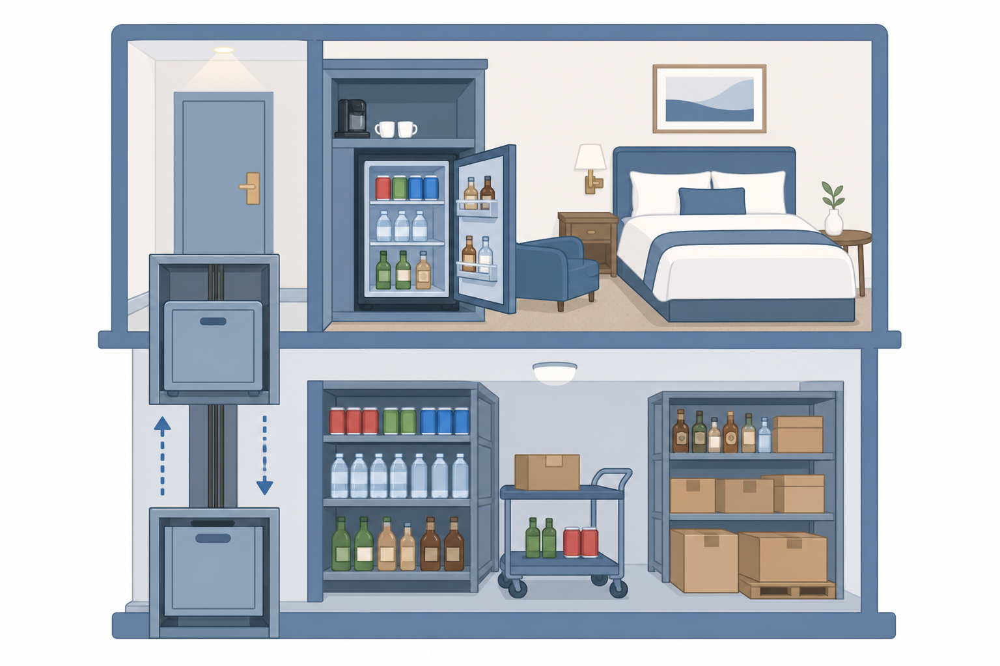
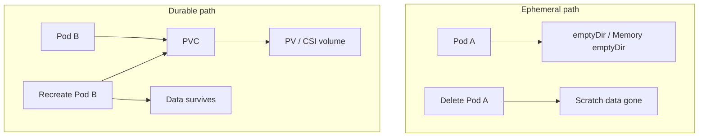
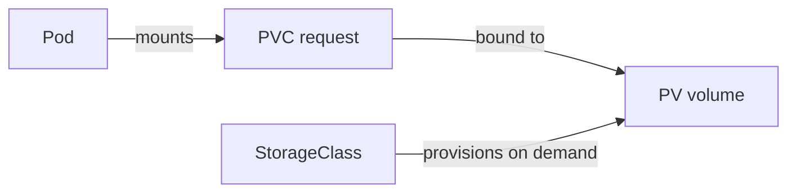
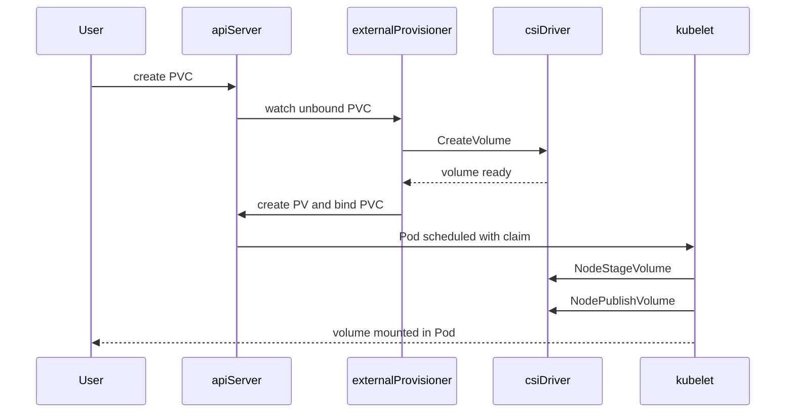
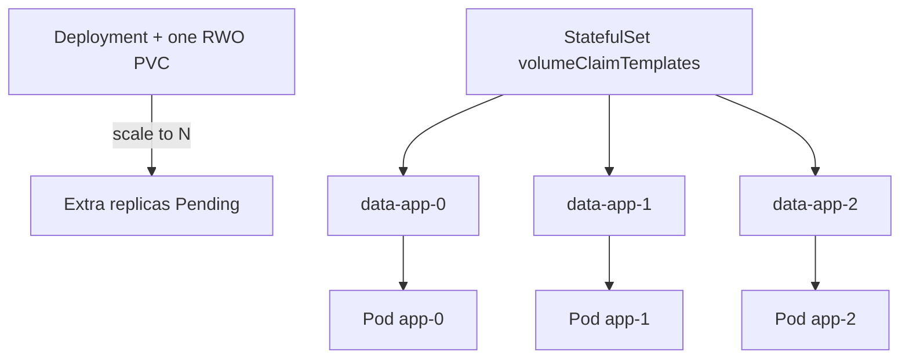
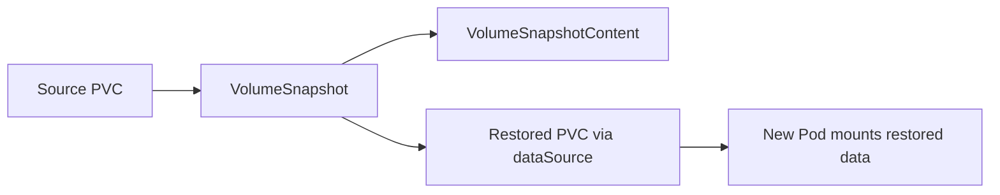

# Chapter 18 — Kubernetes Storage

> **Learning Objectives**
>
> By the end of this chapter, you will be able to:
>
> - Pick the right storage for a job: scratch space that disappears, or storage that lasts
> - Ask for lasting storage with PersistentVolumes, PersistentVolumeClaims, and StorageClasses
> - Use CSI drivers to create disks on demand, grow them, and keep them in the right zone
> - Take VolumeSnapshots and VolumeGroupSnapshots (GA in Kubernetes 1.36) as restore points
> - Change volume settings with VolumeAttributesClass, and check whether a class still has room
> - Mount lasting storage in Deployments and StatefulSets without the usual data-loss traps

---

## 18.1 The hotel room and the basement inventory

Imagine you check into a hotel. The room is temporary. Housekeeping clears it out for the next guest. The mini-bar is different. It is stocked from a shared inventory down in the basement. Guests never own that basement. They simply ask for a snack, and the hotel hands one over from stock.



*Figure 18.A: Rooms reset; the basement inventory (PVs) outlives any single guest (Pod).*

Kubernetes Pods behave like those hotel rooms. They come and go. Whatever a container wrote to its own filesystem disappears when the Pod is replaced. But databases, uploaded files, and shared caches must survive that churn.

So Kubernetes keeps the storage somewhere else. A **PersistentVolume** (PV) is a piece of storage that lives in the cluster, separate from any Pod. A Pod asks for one using a **PersistentVolumeClaim** (PVC), which is simply a written request for storage. A **StorageClass** is the recipe the cluster follows to create that storage automatically, usually by calling a **CSI** driver — a storage plugin that Kubernetes uses to talk to real disks.

Here is the trap. If your app only writes to the container's own filesystem, the data is gone the first time a node is drained, a Deployment rolls out, or a Pod restarts on another machine. Short-lived storage is still useful. You just have to point it at the right jobs.

---

## 18.2 Ephemeral volumes: scratch that dies with the Pod

### In plain terms

An **ephemeral volume** is temporary storage that is created with the Pod and thrown away with the Pod. That is the whole idea. Nothing is saved for later.

Why should you care? Because containers still need a place to put files while they run. They download things, unpack archives, and write cache files. A sidecar container may need to read a file the main container just wrote. None of that data needs to survive a redeploy, and paying for a cloud disk to hold it would be wasteful. Ephemeral volumes give you that scratch space for free, with no disk to order and no cleanup to remember.

Think of ephemeral volumes as sticky notes on the hotel room desk. They are useful while you are staying there. They are gone the moment you check out. Use them for caches, for scratch space shared by containers in one Pod, and for configuration files projected into the Pod. Do not use them for the database that must survive a redeploy.

The usual mistake is reading "it survived a container restart" as "it is safe." Those are different things. When only the container restarts, the Pod stays alive, so an `emptyDir` volume keeps its contents. When the Pod itself is rescheduled, rolled out, or evicted from a drained node, the data goes away.

> ⚠️ **Common Pitfall:** You might think writing under `/tmp` in the container is “temporary but safe enough.” The container writable layer and `/tmp` die with the container or Pod—there is no reclaim policy, no snapshot, and no restore path.

### Under the hood

Here is what each temporary volume type actually gives you, and how long it lasts:

| Volume type | Lifetime | Typical use |
|-------------|----------|-------------|
| Container writable layer | Until the container is removed | Disposable scratch you can afford to lose |
| `emptyDir` | Until the Pod is deleted | Cache, scratch shared by containers in one Pod |
| `emptyDir` with `medium: Memory` | Until the Pod is deleted | RAM-backed tmpfs scratch |
| ConfigMap / Secret / projected | Until the Pod is deleted (data lives in the API) | Configuration and credentials as files |
| `ephemeral` CSI volume | Until the Pod is deleted | Inline CSI volume claimed with the Pod |
| `genericEphemeralVolume` | Until the Pod is deleted | PVC-shaped ephemeral claim via a StorageClass |

**emptyDir** is the workhorse:

```yaml
apiVersion: v1
kind: Pod
metadata:
  name: task-api-scratch
spec:
  containers:
    - name: api
      image: ghcr.io/mastering-k8s/task-api:1.1
      volumeMounts:
        - name: cache
          mountPath: /var/cache/task-api
        - name: ram
          mountPath: /dev/shm
  volumes:
    - name: cache
      emptyDir:
        sizeLimit: 1Gi
    - name: ram
      emptyDir:
        medium: Memory
        sizeLimit: 64Mi
```

**Generic ephemeral volumes** look like a PVC but live and die with the Pod:

```yaml
apiVersion: v1
kind: Pod
metadata:
  name: task-api-ephemeral-disk
spec:
  containers:
    - name: api
      image: ghcr.io/mastering-k8s/task-api:1.1
      volumeMounts:
        - name: scratch
          mountPath: /data/scratch
  volumes:
    - name: scratch
      ephemeral:
        volumeClaimTemplate:
          metadata:
            labels:
              type: scratch
          spec:
            accessModes: ["ReadWriteOnce"]
            storageClassName: fast-ssd
            resources:
              requests:
                storage: 2Gi
```

```bash
$ kubectl apply -f task-api-scratch.yaml
pod/task-api-scratch created

$ kubectl exec task-api-scratch -- sh -c 'echo hi > /var/cache/task-api/x && cat /var/cache/task-api/x'
hi
```

Delete the Pod and that file is gone—by design.



*Figure 18.1: `emptyDir` vanishes with the Pod; a PVC-backed volume survives recreate because the claim stays bound to the PV.*

### In production

**Ownership:** App teams decide ephemeral versus durable for their own data. The platform team owns node disk-pressure targets and the default `emptyDir` guidance. Those targets are written as an **SLO** (service level objective) — a number the team promises to stay within, such as "no node runs above 80% disk."

**Failure mode:** A cache with no `sizeLimit` fills the node disk. The kubelet then evicts *other* workloads to reclaim space. Detect it with the node condition `DiskPressure`, kubelet eviction events, and container filesystem usage metrics. Fix it with `sizeLimit` on every scratch volume, Memory `emptyDir` only for small scratch, and alerts on node disk usage.

| Do | Don't |
|----|-------|
| Set `sizeLimit` on every `emptyDir` | Put databases or uploads on ephemeral volumes |
| Prefer Memory `emptyDir` only for small, high-churn scratch | Assume “it survived one restart” means durable |
| Track generic ephemeral CSI usage in quotas | Ignore that ephemeral CSI still bills while the Pod runs |

> 💡 **Tip:** Treat anything under the container root filesystem as disposable. Persist deliberately with a PVC (or an object store outside the cluster).

**Before you leave this section**

- **Understand:** Ephemeral data dies with the Pod (or container); only PVCs (or external stores) outlive reschedules.
- **Try:** Write to `emptyDir`, delete the Pod, recreate, and confirm the file is gone.
- **Watch in prod:** Node `DiskPressure` and Pods without `sizeLimit` on large caches.

---

## 18.3 PersistentVolumes, PersistentVolumeClaims, and StorageClasses

### In plain terms

Kubernetes splits storage into two halves: who *supplies* it and who *asks for* it. A **PersistentVolume** (PV) is the supply side — a real piece of storage that exists in the cluster. A **PersistentVolumeClaim** (PVC) is the demand side — a request that lives in one namespace and says something like "I need 20Gi that one node can write to." A **StorageClass** is the recipe the cluster uses to create a new PV whenever a claim arrives. Developers write claims. Platform teams decide how the disks behind those claims get made.

Why bother with two objects instead of one? Because it lets each side work without knowing the other's details. An app team can ask for 20Gi without learning the disk API of Amazon, Google, or your on-prem array. A platform team can change the disk type, the zone rules, or the cost tier behind a class without editing a single app manifest. Both sides get to move independently.

Picture the hotel again. The PVC is the request slip you hand to the front desk. The PV is the actual item pulled from the basement. The slip is not the item. That distinction matters when you clean up: throw away the slip under the wrong **reclaim policy** — the rule that decides what happens to the storage when its claim is deleted — and the item in the basement is destroyed along with it.

> 💡 **In one line:** A PVC is the request for storage, a PV is the storage itself, and a StorageClass is the recipe that makes a new PV whenever a request shows up.

> ⚠️ **Common Pitfall:** You might think deleting a PVC is as safe as deleting a Deployment. With `reclaimPolicy: Delete`, the underlying cloud disk usually goes with it—often with no recycle bin.

### Under the hood

Here is the chain of objects that connects a running container to a real disk:

```text
App (Pod) ──mounts──► PVC (request) ──bound to──► PV (actual volume)
                              │
                              └── StorageClass (how to create PVs on demand)
```



*Figure 18.2: Pods mount claims; claims bind to volumes; StorageClasses drive dynamic provisioning.*

**Access modes** describe how nodes may mount the volume—not Unix file modes:

| Access mode | Meaning | Common use |
|-------------|---------|------------|
| `ReadWriteOnce` (RWO) | Mount read-write by a **single node** | Most cloud block disks |
| `ReadOnlyMany` (ROX) | Mount read-only by many nodes | Shared published content |
| `ReadWriteMany` (RWX) | Mount read-write by many nodes | NFS, CephFS, cloud file |
| `ReadWriteOncePod` (RWOP) | Mount read-write by a **single Pod** | Strict single-writer (CSI-dependent) |

> ⚠️ **Common Pitfall:** `ReadWriteOnce` allows multiple Pods on the *same node* to mount the volume. It does **not** mean “only one Pod in the whole cluster.” Prefer `ReadWriteOncePod` when your CSI driver supports it and you need exclusivity.

**Reclaim policies** when a PVC is deleted:

| Policy | Behavior |
|--------|----------|
| `Retain` | PV becomes Released; data kept until an admin cleans up |
| `Delete` | Volume (and usually the underlying disk) is deleted with the PVC |
| `Recycle` | Legacy scrub-and-reuse; **deprecated**—do not use for new designs |

#### Static provisioning

```yaml
apiVersion: v1
kind: PersistentVolume
metadata:
  name: task-uploads-pv
spec:
  capacity:
    storage: 5Gi
  accessModes:
    - ReadWriteMany
  persistentVolumeReclaimPolicy: Retain
  storageClassName: manual
  nfs:
    server: 192.168.1.50
    path: /exports/task-uploads
---
apiVersion: v1
kind: PersistentVolumeClaim
metadata:
  name: task-uploads
  namespace: default
spec:
  accessModes:
    - ReadWriteMany
  resources:
    requests:
      storage: 5Gi
  storageClassName: manual
```

```bash
$ kubectl apply -f nfs-pv.yaml -f nfs-pvc.yaml
$ kubectl get pv,pvc
NAME                               CAPACITY   ACCESS MODES   RECLAIM POLICY   STATUS   CLAIM                     STORAGECLASS
persistentvolume/task-uploads-pv   5Gi        RWX            Retain           Bound    default/task-uploads      manual
```

#### Dynamic provisioning

```yaml
apiVersion: storage.k8s.io/v1
kind: StorageClass
metadata:
  name: fast-ssd
provisioner: pd.csi.storage.gke.io
parameters:
  type: pd-ssd
reclaimPolicy: Delete
allowVolumeExpansion: true
volumeBindingMode: WaitForFirstConsumer
---
apiVersion: v1
kind: PersistentVolumeClaim
metadata:
  name: task-db-data
spec:
  accessModes:
    - ReadWriteOnce
  storageClassName: fast-ssd
  resources:
    requests:
      storage: 20Gi
```

Key StorageClass fields:

- **`provisioner`** — CSI driver name
- **`reclaimPolicy`** — inherited by dynamically created PVs
- **`allowVolumeExpansion`** — whether PVC size can grow
- **`volumeBindingMode`** — `Immediate` vs `WaitForFirstConsumer` (prefer the latter for zonal disks)

With `WaitForFirstConsumer`, a PVC staying `Pending` until a Pod schedules is **expected**. What breaks if you force `Immediate` on zonal block disks: the provisioner may create the volume in zone A while the scheduler later places the Pod in zone B—mount fails or the Pod never schedules.

### In production

**Ownership:** The platform team owns the StorageClass catalog — the provisioner, reclaim policy, binding mode, and whether expansion is allowed. App teams own the PVC size and access mode they pick from that catalog. Evidence to collect during an incident: `kubectl get pvc,pv,sc`, the Events on the PVC, and CSI controller logs.

**Failure mode:** The wrong access mode or class leaves a PVC Pending forever. A multi-replica Deployment sharing one RWO PVC leaves replicas stranded and unschedulable. Detect both with alerts on how long a PVC has been Pending, and on unavailable Deployment replicas. Prevent them with a documented class catalog, admission policies that reject combinations that cannot work, and StatefulSet templates when each replica needs its own disk.

| Do | Don't |
|----|-------|
| Prefer CSI classes on Kubernetes 1.36 | Use legacy in-tree provisioners for new work |
| Use `Retain` for irreplaceable data classes | Assume cloud defaults (`Delete`) are safe for databases |
| Prefer `WaitForFirstConsumer` for zonal disks | Ask for RWX on a block-only class |

> 🏭 **Production floor:** Treat PVC deletion as a **data-plane change**, not cleanup. Require reclaim-policy check in the change ticket (`kubectl get pvc <name> -o jsonpath='{.spec.storageClassName}'` then inspect the class / PV reclaim policy). For `Delete` classes, snapshot or backup **before** delete; for `Retain`, schedule admin reclaim of Released PVs so you do not leak cost or orphan disks. Paste PV name, reclaim policy, and snapshot ID into the incident or change record.

**Before you leave this section**

- **Understand:** PVC requests; PV provides; StorageClass recipes dynamic disks; reclaim policy decides fate on PVC delete.
- **Try:** Create a dynamic PVC, inspect bound PV reclaim policy, and note what would happen on delete.
- **Watch in prod:** Pending PVCs older than a few minutes; accidental deletes on `Delete` reclaim classes.

---

## 18.4 CSI drivers, expansion, and topology

### In plain terms

**CSI** stands for **Container Storage Interface**. It is a standard set of calls that Kubernetes uses to ask any storage system to create, attach, and mount a volume. A **CSI driver** is the piece of software a storage vendor writes to answer those calls. Amazon EBS, Azure Disk, Google Persistent Disk, Ceph, and Longhorn each ship one.

Why does this matter to you? Because it is the reason your manifests are portable. Without CSI, support for every storage product would have to be written into Kubernetes itself, and each new vendor would mean a new Kubernetes release. With CSI, the vendor ships a driver, you ship StorageClasses, and moving an app to a different backend is often a one-line change to `storageClassName`.

Think of CSI as the standard power socket in the wall. Kubernetes supplies the socket. Every vendor builds a plug that fits it. Each driver has two halves: a **controller** that runs once per cluster and creates or deletes the volumes, and a **node plugin** that runs on every worker and does the actual mounting.

The misconception here is that storage is somebody else's problem — a thing you handle in the cloud console. It is not. From your app's point of view, a `FailedMount` event or a PVC stuck in Pending *is* the outage, and the CSI node plugin sits directly on the path that starts your Pod.

> ⚠️ **Common Pitfall:** You might think expanding a PVC is always online and instant. Filesystem resize can require a remount or Pod restart; shrinking is generally unsupported.

### Under the hood

Here is the exact sequence that runs when you create a claim on a dynamic class:



*Figure 18.3: Dynamic provisioning: PVC creation triggers CSI CreateVolume, PV bind, then kubelet NodeStage/NodePublish.*

```bash
$ kubectl get storageclass
NAME                   PROVISIONER             RECLAIMPOLICY   VOLUMEBINDINGMODE      ALLOWVOLUMEEXPANSION
standard (default)     rancher.io/local-path   Delete          WaitForFirstConsumer   false
fast-ssd               pd.csi.storage.gke.io   Delete          WaitForFirstConsumer   true
```

Grow a PVC when expansion is allowed:

```bash
$ kubectl patch pvc task-db-data -p '{"spec":{"resources":{"requests":{"storage":"40Gi"}}}}'
persistentvolumeclaim/task-db-data patched
```

Filesystem resize may require a remount or Pod restart depending on the driver. You generally **cannot shrink** PVC size.

A zonal disk can only be attached inside its own zone, so it has to be created where the Pod will run. `WaitForFirstConsumer` handles that: the scheduler picks a node first, and only then does the provisioner create the disk in that zone. `Immediate` binding does the opposite and can trap a PVC in zone A while all the free node capacity sits in zone B. What breaks if the CSI node plugin is down on a worker: new mounts fail with FailedMount even though the PV looks Bound.

### In production

**Ownership:** The platform team owns the CSI driver itself — controller and DaemonSet health, plus upgrades. App teams own expansion requests and confirming their app survives a resize. Spot CSI trouble through FailedMount events, a CSI controller stuck in CrashLoopBackOff, and volume attachment timeouts.

**Failure mode:** When the CSI controller is down, new PVCs sit Pending. When a node plugin is down, Pods on that node cannot mount anything. Reduce the damage with disruption budgets on the DaemonSet where the driver supports them, staged driver upgrades, and a runbook that says to check `kubectl describe pvc/pod` before blaming the application.

| Do | Don't |
|----|-------|
| Monitor CSI controller and node DaemonSets | Ignore FailedMount as “app bug” |
| Test expansion in staging first | Assume shrink works |
| Document RWO vs RWX and zone span per class | Use `hostPath` for HA production data |

> 📘 **Deep Dive (optional):** In-tree volume plugins are deprecated in favor of CSI. Always prefer CSI StorageClasses on Kubernetes 1.36.

**Before you leave this section**

- **Understand:** CSI provisions and mounts; topology + WaitForFirstConsumer keep zonal disks with their Pods.
- **Try:** Patch a PVC size upward on an expandable class and watch PVC conditions / Pod events.
- **Watch in prod:** CSI DaemonSet readiness and FailedMount spikes after node or driver upgrades.

---

## 18.5 Using PVCs in Deployments and StatefulSets

### In plain terms

Using a claim in a workload means naming it in the Pod spec. You pick any name you like for the volume inside the Pod. The `claimName` field, however, must exactly match the name of an existing PVC in the same namespace.

Why is there a choice to make here at all? Because two workload types treat storage very differently. A **Deployment** runs replicas that are interchangeable copies of each other, so it gives them all the same volumes. A **StatefulSet** runs replicas that each have their own identity, and its `volumeClaimTemplates` field creates a separate PVC for every replica. Databases need the second kind. Each member must keep coming back to its own data.

Think of a touring band. A StatefulSet gives every musician a locked trunk with their own name on it. A Deployment hands the whole group one shared suitcase. That works fine for a stack of identical T-shirts. It does not work for instruments.

The most common newcomer outage lives right here: N Deployment replicas pointed at a single `ReadWriteOnce` PVC. You might expect the Service to spread writes across the replicas onto that one disk. It cannot. The disk can only be attached to one node at a time, so the kubelet refuses the second mount and the extra Pods sit Pending forever.

> ⚠️ **Common Pitfall:** You might think deleting a StatefulSet with `kubectl delete sts` also deletes its PVCs. By default it does **not**—ordinal PVCs remain unless you delete them explicitly (or use the appropriate cleanup policy). That is usually good for data safety and surprising for cost.

### Under the hood

Here is a Deployment mounting one shared claim by name:

```yaml
apiVersion: apps/v1
kind: Deployment
metadata:
  name: task-api
spec:
  replicas: 1
  selector:
    matchLabels:
      app: task-api
  template:
    metadata:
      labels:
        app: task-api
    spec:
      containers:
        - name: api
          image: ghcr.io/mastering-k8s/task-api:1.1
          ports:
            - containerPort: 8000
          volumeMounts:
            - name: uploads
              mountPath: /data/uploads
      volumes:
        - name: uploads
          persistentVolumeClaim:
            claimName: task-uploads
```

StatefulSet excerpt:

```yaml
volumeClaimTemplates:
  - metadata:
      name: data
    spec:
      accessModes: ["ReadWriteOnce"]
      storageClassName: fast-ssd
      resources:
        requests:
          storage: 20Gi
```

Kubernetes creates PVCs named like `data-task-db-0`, `data-task-db-1`.



*Figure 18.4: One shared RWO PVC strands Deployment replicas; StatefulSet templates give each ordinal its own claim.*

```bash
$ kubectl exec deploy/task-api -- sh -c 'echo hello > /data/uploads/note.txt && cat /data/uploads/note.txt'
hello
```

What breaks if you change `storageClassName` on an existing PVC: the API rejects it—you must create a new claim and copy data (or restore from snapshot).

### In production

**Ownership:** The app team picks Deployment versus StatefulSet and owns the mount paths. The platform team owns the approved StorageClasses and the backup tooling. For a database, the PVC and its snapshot schedule are part of the service's recovery promises — **RPO** (recovery point objective, how much recent data you can afford to lose) and **RTO** (recovery time objective, how long you may take to come back). Decide both up front, not after the incident.

**Failure mode:** Scaling a Deployment that shares one RWO claim leaves replicas Pending. Deleting a StatefulSet leaves its PVCs behind, which quietly keeps costing money. Detect the first with unavailable-replica alerts, the second with a report of PVs that no workload references. Prevent both with an architecture review before go-live and a written PVC cleanup checklist for teardown.

| Do | Don't |
|----|-------|
| Pin StorageClass and reclaim policy before go-live | Change `storageClassName` in place |
| Backup app data independently of etcd | Assume etcd backup restores PVC contents |
| Use `volumeClaimTemplates` for per-replica disks | Share one RWO PVC across Deployment replicas |

**Before you leave this section**

- **Understand:** One RWO PVC ≠ N Deployment replicas; StatefulSet templates create per-ordinal PVCs.
- **Try:** Mount a PVC in a one-replica Pod, write a file, recreate the Pod, confirm persistence.
- **Watch in prod:** Orphaned PVCs after StatefulSet teardown; Pending Pods after scale-up on RWO.

---

## 18.6 VolumeSnapshot and VolumeGroupSnapshot (GA in 1.36)

### In plain terms

A **VolumeSnapshot** is a saved picture of one volume as it looked at one moment. A **VolumeGroupSnapshot**, which reached **GA** (generally available, meaning stable and supported for production) in Kubernetes **1.36**, takes that picture of several volumes at the same instant.

Why would you need the group version? Because many databases spread their state across more than one disk. The data files live on one PVC and the write-ahead log lives on another. Snapshot them a few seconds apart and the two copies disagree, so the restore is useless. Snapshot them together and they line up.

Picture a row of filing cabinet drawers. A VolumeSnapshot photographs one drawer. A VolumeGroupSnapshot photographs several drawers in a single flash, so nobody could have moved a folder between shots.

One word deserves care: **crash-consistent**. It means the copy looks exactly like the disk would after someone pulled the power cord. Anything the app was still holding in memory is missing. That is usually recoverable, because databases are built to replay their logs after a crash. It is not the same as **application-consistent**, which means the app was paused and flushed first. For that, pause the app around the snapshot or use its own backup command.

Snapshots solve one problem well: getting a restore point without slowly copying terabytes. They do not prove you can actually come back within your RTO. Only a restore you have practiced proves that.

> ⚠️ **Common Pitfall:** You might think “GA VolumeGroupSnapshot” means every CSI driver can do it. The API can be installed while the driver still returns “unimplemented.” Always verify driver support before promising group restore in an SLO.

### Under the hood

Snapshots are not built into the core API. They arrive as add-on objects installed by the snapshot controller. Typical kinds:

- `VolumeSnapshotClass` / `VolumeSnapshot` / `VolumeSnapshotContent`
- `VolumeGroupSnapshotClass` / `VolumeGroupSnapshot` / `VolumeGroupSnapshotContent` (`groupsnapshot.storage.k8s.io/v1` in 1.36)

Single-volume snapshot:

```yaml
apiVersion: snapshot.storage.k8s.io/v1
kind: VolumeSnapshotClass
metadata:
  name: csi-snapclass
driver: pd.csi.storage.gke.io
deletionPolicy: Delete
---
apiVersion: snapshot.storage.k8s.io/v1
kind: VolumeSnapshot
metadata:
  name: task-db-snap-2026-07-25
spec:
  volumeSnapshotClassName: csi-snapclass
  source:
    persistentVolumeClaimName: task-db-data
```

Restore into a new PVC:

```yaml
apiVersion: v1
kind: PersistentVolumeClaim
metadata:
  name: task-db-restored
spec:
  accessModes:
    - ReadWriteOnce
  storageClassName: fast-ssd
  resources:
    requests:
      storage: 20Gi
  dataSource:
    name: task-db-snap-2026-07-25
    kind: VolumeSnapshot
    apiGroup: snapshot.storage.k8s.io
```

Group snapshot (CSI driver must implement group snapshot RPCs):

```yaml
apiVersion: groupsnapshot.storage.k8s.io/v1
kind: VolumeGroupSnapshotClass
metadata:
  name: csi-group-snapclass
driver: example.csi.k8s.io
deletionPolicy: Delete
---
apiVersion: groupsnapshot.storage.k8s.io/v1
kind: VolumeGroupSnapshot
metadata:
  name: task-db-group-2026-07-25
  namespace: tasks
spec:
  volumeGroupSnapshotClassName: csi-group-snapclass
  source:
    selector:
      matchLabels:
        app: task-db
        snapshot-group: "primary"
```

Label every PVC that must participate, then create the VolumeGroupSnapshot. The controller creates member VolumeSnapshots under the group for restore workflows.



*Figure 18.5: Snapshot a PVC, then restore into a new claim with `dataSource` pointing at the VolumeSnapshot.*

```bash
$ kubectl get volumesnapshot,volumegroupsnapshot -n tasks
NAME                                                   READYTOUSE   SOURCEPVC       RESTORESIZE
volumesnapshot.snapshot.storage.k8s.io/task-db-snap…   true         task-db-data    20Gi
```

What breaks if `readyToUse` never becomes true: restore PVCs stay Pending; check VolumeSnapshotContent events and CSI snapshotter logs—often quota, permissions, or missing driver RPCs.

### In production

**Ownership:** The platform team owns the snapshot controller, the snapshot object definitions, and the VolumeSnapshotClass catalog. App teams own their own schedule, their retention window, and a **tested restore**. Whoever signs off on RPO and RTO must also put restore drills in the service runbook.

**Failure mode:** Snapshots run green for months while nobody ever restores one. The first real attempt happens during an incident, and it fails. Detect the gap by tracking how recently a restore drill ran, and how long any snapshot has sat at `readyToUse=false`. Close it with a scheduled job that restores into a scratch namespace, and a retention window that matches your compliance rules instead of "keep everything forever."

| Do | Don't |
|----|-------|
| Verify driver snapshot *and* group support separately | Equate crash-consistent with app-quiesced |
| Automate schedule, retention, and restore tests | Rely on one-off YAML from an old ticket |
| Prefer group snapshots for multi-PVC consistency | Skip labeling PVCs that must join a group |

**Before you leave this section**

- **Understand:** Snapshots are restore points; group snapshots align multiple PVCs; GA ≠ universal driver support.
- **Try:** Snapshot a lab PVC, restore via `dataSource`, confirm file contents.
- **Watch in prod:** Snapshot `readyToUse`, restore drill success rate, snapshot storage cost.

---

## 18.7 VolumeAttributesClass and storage capacity

### In plain terms

A **VolumeAttributesClass** is a named set of performance settings you can apply to a volume that already exists. The settings are vendor knobs such as **IOPS** (input/output operations per second, roughly how many reads and writes a disk handles each second) and throughput (how many megabytes per second it moves). **Storage capacity** reporting is the separate feature that tells the cluster how much room a storage class still has in each zone.

Why do both exist? Because performance and space are day-two problems, and both bite after you go live. A database that felt fine in staging can crawl in production because the disk hit its IOPS ceiling. A zone that looks half empty in the cloud console can still refuse new PVCs, because the driver reports no capacity left for that class. Neither problem is visible in the manifest you wrote on day one.

Back to the hotel. A VolumeAttributesClass is upgrading your mini-bar service tier without changing rooms. Storage capacity reporting is the front desk knowing how many rooms are actually free before it promises one.

A note on a common assumption: making a PVC bigger does not automatically make it faster. On most cloud disks, size and IOPS are separate dials. Some products link them, many do not. Check before you resize and hope.

> ⚠️ **Common Pitfall:** You might think empty CSIStorageCapacity means “the cloud is out of disks.” It means *this driver reports no remaining capacity for that class/topology*—check quotas, reserved pools, and driver bugs before opening a cloud ticket.

### Under the hood

Here is a two-tier performance catalog a platform team might publish:

```yaml
apiVersion: storage.k8s.io/v1
kind: VolumeAttributesClass
metadata:
  name: silver
driverName: pd.csi.storage.gke.io
parameters:
  iops: "3000"
  throughput: "125"
---
apiVersion: storage.k8s.io/v1
kind: VolumeAttributesClass
metadata:
  name: gold
driverName: pd.csi.storage.gke.io
parameters:
  iops: "10000"
  throughput: "500"
```

Reference or migrate a PVC (driver and cluster must support modification):

```yaml
apiVersion: v1
kind: PersistentVolumeClaim
metadata:
  name: task-db-data
spec:
  accessModes:
    - ReadWriteOnce
  storageClassName: fast-ssd
  volumeAttributesClassName: gold
  resources:
    requests:
      storage: 40Gi
```

CSIStorageCapacity objects (published by CSI drivers that support capacity) inform the scheduler about remaining capacity per topology:

```bash
$ kubectl get csistoragecapacities -A
NAMESPACE     NAME                         STORAGECLASS   CAPACITY   AGE
kube-system   csisc-us-east1-b-fast-ssd    fast-ssd       2Ti        3d
```

With capacity-aware scheduling, the control plane can avoid placing Pods whose unbound PVCs cannot be provisioned in a given zone. What breaks if you change attributes without driver support: the PVC modification condition fails; the volume stays on the old performance tier while your change ticket claims success—verify with cloud metrics, not only `kubectl get pvc`.

### In production

**Ownership:** The platform team owns the VolumeAttributesClass catalog and watches CSIStorageCapacity. App teams request a tier change through change control, with someone approving the extra cost. Treat each tier like a published promise: write down what silver and gold cost and what performance each one delivers.

**Failure mode:** Low capacity leaves PVCs Pending and rollouts stuck. A failed attribute change is worse, because the volume quietly stays on the old tier while the ticket says it moved. Detect the first with alerts on CSIStorageCapacity, the second by reading the PVC modify conditions. Prevent both by keeping spare capacity in every zone and by changing attributes in stages instead of everywhere at once.

| Do | Don't |
|----|-------|
| Alert on low CSIStorageCapacity for critical classes | Change attributes without watching PVC conditions |
| Keep quotas on PVC count and storage requests | Assume size expansion equals IOPS upgrade |
| Document cost per attribute class | Skip multi-tenant storage quotas (Chapter 24 / 31) |

**Before you leave this section**

- **Understand:** Attributes tune performance in place; CSIStorageCapacity feeds capacity-aware scheduling.
- **Try:** `kubectl get csistoragecapacities -A` and map classes to zones.
- **Watch in prod:** Capacity exhaustion in one zone while another looks fine; failed volume modify operations.

---

## 18.8 Common pitfalls

> ⚠️ **Common Pitfall:** Deleting a PVC with `reclaimPolicy: Delete` destroys the underlying disk. Check reclaim policy before cleanup scripts.

> ⚠️ **Common Pitfall:** Scaling a Deployment that uses a single RWO PVC to multiple replicas leaves Pods Pending.

> ⚠️ **Common Pitfall:** Changing `storageClassName` on an existing PVC is not supported—migrate to a new claim.

> ⚠️ **Common Pitfall:** Mixing `Immediate` binding with multi-zone block storage traps PVCs in the wrong zone.

> ⚠️ **Common Pitfall:** Assuming VolumeGroupSnapshot means application-quiesced backup. It is crash-consistent unless you freeze the app yourself.

---

## 18.9 Hands-on exercises

1. **Inspect defaults.** Run `kubectl get storageclass` and `kubectl get pv,pvc -A`. Note the default class and any Pending claims.
2. **Ephemeral scratch.** Deploy a Pod with `emptyDir` and `sizeLimit`. Write a file, delete the Pod, recreate, and confirm the file is gone.
3. **Dynamic claim.** Create a 1Gi RWO PVC on the default StorageClass. Mount it in a one-replica Pod, write a file, recreate the Pod, verify persistence.
4. **Access-mode failure.** Scale that Deployment to 2 replicas and explain the Pending behavior using access modes.
5. **Snapshot path (if your driver supports it).** Create a VolumeSnapshot of a lab PVC, restore to a new PVC, and confirm data. If group snapshots are available, label two PVCs and create a VolumeGroupSnapshot.

---

## 18.10 Check Your Understanding

**Q1.** What is the difference between a PersistentVolume and a PersistentVolumeClaim?

<details>
<summary>Show answer</summary>

A **PV** is the cluster storage object (capacity plus backend). A **PVC** is a namespaced *request* that binds to a suitable PV or triggers dynamic provisioning. Pods mount PVCs.

</details>

**Q2.** Does `ReadWriteOnce` guarantee only one Pod can mount the volume cluster-wide?

<details>
<summary>Show answer</summary>

**No.** RWO means a single *node* may mount it read-write. Multiple Pods on that node can share the mount. For single-Pod exclusivity, use `ReadWriteOncePod` when supported.

</details>

**Q3.** What does `volumeBindingMode: WaitForFirstConsumer` buy you?

<details>
<summary>Show answer</summary>

It delays provisioning until a Pod using the PVC is scheduled, so topology (zone/node) can match the consumer—essential for zonal disks.

</details>

**Q4.** How does VolumeGroupSnapshot differ from VolumeSnapshot, and what became GA in Kubernetes 1.36?

<details>
<summary>Show answer</summary>

**VolumeSnapshot** captures one volume. **VolumeGroupSnapshot** captures multiple PVCs as one crash-consistent group. Volume group snapshots reached **GA** in Kubernetes **1.36** (`groupsnapshot.storage.k8s.io/v1`), provided the CSI driver implements group snapshot support.

</details>

**Q5.** What problem does VolumeAttributesClass address?

<details>
<summary>Show answer</summary>

It provides a way to specify and mutate mutable volume parameters (such as IOPS/throughput) via a named class, without recreating the PVC solely to change those attributes—subject to CSI driver support.

</details>

---

## 18.11 Key takeaways

- Scratch data belongs in ephemeral volumes. Data you cannot lose belongs in a PVC.
- The PVC asks, the PV supplies, the StorageClass builds. Learn the three names in that order.
- Reclaim policy decides whether deleting a claim also deletes the disk. Check it before you clean up.
- `ReadWriteOnce` means one *node*, not one Pod. One RWO claim cannot feed many Deployment replicas.
- Use `WaitForFirstConsumer` for zonal disks so the disk is created where the Pod lands.
- Give each database replica its own disk with StatefulSet `volumeClaimTemplates`.
- Snapshots are restore points, not backups you can trust until you have restored one.
- VolumeAttributesClass tunes speed in place. CSIStorageCapacity tells you whether there is room left.

---

## 18.12 Official documentation map

| Topic | Official page |
|-------|---------------|
| Persistent Volumes | [Persistent Volumes](https://kubernetes.io/docs/concepts/storage/persistent-volumes/) |
| Storage Classes | [Storage Classes](https://kubernetes.io/docs/concepts/storage/storage-classes/) |
| Ephemeral volumes | [Ephemeral Volumes](https://kubernetes.io/docs/concepts/storage/ephemeral-volumes/) |
| Volume Snapshots | [Volume Snapshots](https://kubernetes.io/docs/concepts/storage/volume-snapshots/) |
| Volume Group Snapshots (blog / CSI) | [Volume Group Snapshots GA](https://kubernetes.io/blog/2026/05/08/kubernetes-v1-36-volume-group-snapshot-ga/) |
| Volume Attributes Classes | [Volume Attributes Classes](https://kubernetes.io/docs/concepts/storage/volume-attributes-classes/) |
| Storage capacity | [Storage Capacity](https://kubernetes.io/docs/concepts/storage/storage-capacity/) |
| CSI | [Container Storage Interface](https://kubernetes-csi.github.io/docs/) |

**Previous:** [Chapter 17 — Configuration and Secrets](17-configuration-and-secrets.md) | **Next:** [Chapter 19 — Networking — CNI and Policies](19-k8s-networking-cni-and-policies.md)
