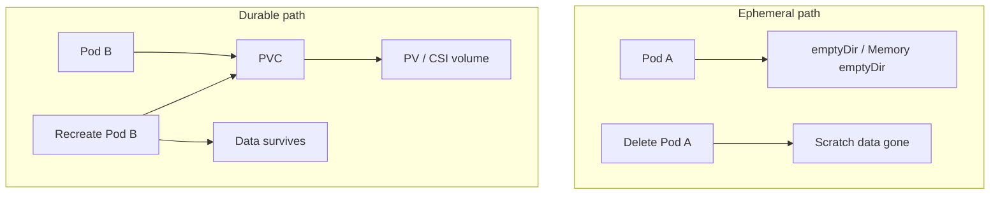
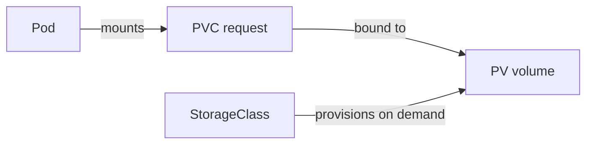
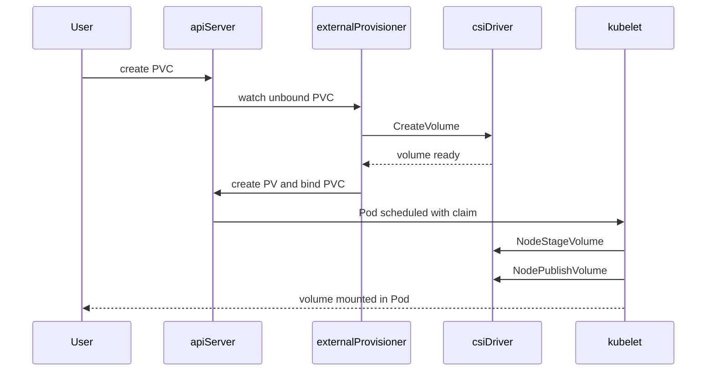
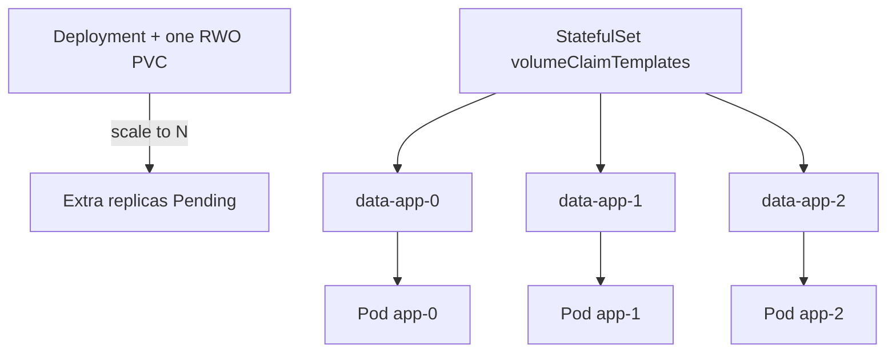
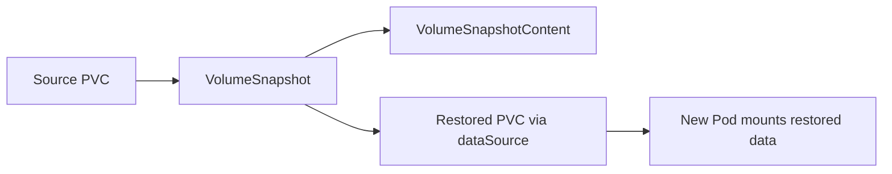

# Chapter 18 — Kubernetes Storage

> **Learning Objectives**
>
> By the end of this chapter, you will be able to:
>
> - Choose ephemeral versus persistent volume types for real workloads
> - Request and bind storage with PersistentVolumes, PersistentVolumeClaims, and StorageClasses
> - Use CSI drivers for dynamic provisioning, expansion, and topology-aware binding
> - Take VolumeSnapshots and VolumeGroupSnapshots (GA in Kubernetes 1.36)
> - Modify volume parameters with VolumeAttributesClass and reason about storage capacity
> - Mount durable storage into Deployments and StatefulSets without common data-loss traps

---

## 18.1 The hotel room and the basement inventory

Imagine you check into a hotel. The room itself is temporary—housekeeping resets it for the next guest. The mini-bar, though, is stocked from a shared inventory in the basement. Guests do not own the basement; they *request* snacks, and the hotel allocates them from stock.


*Figure 18.A: Rooms reset; the basement inventory (PVs) outlives any single guest (Pod).*

Kubernetes Pods are like hotel rooms: they come and go. Local container filesystems disappear when a Pod is replaced. Databases, uploaded files, and shared caches need something more durable—storage that outlives any single Pod. That durable layer is **PersistentVolume** (PV) storage, requested through **PersistentVolumeClaims** (PVCs), and often provisioned automatically via a **StorageClass** and a **CSI** driver.

If you only use the container writable layer, you will lose data the first time a node drains, a Deployment rolls, or a Pod restarts on another machine. Ephemeral volumes are still valuable—just for the right jobs.

---

## 18.2 Ephemeral volumes: scratch that dies with the Pod

### In plain terms

Ephemeral volumes are sticky notes on the hotel room desk. Useful while you are there; gone when you check out. Use them for caches, scratch space shared by containers in one Pod, or projected configuration—not for the database that must survive a redeploy.

The problem they solve is real: containers need somewhere to write temporary files, share a scratch directory with a sidecar, or hold a short-lived cache without provisioning a cloud disk. The misconception is treating “it survived a container restart” as “it is durable.” A container restart keeps the Pod (and thus `emptyDir`); a Pod reschedule, Deployment rollout, or node drain does not.

> ⚠️ **Common Pitfall:** You might think writing under `/tmp` in the container is “temporary but safe enough.” The container writable layer and `/tmp` die with the container or Pod—there is no reclaim policy, no snapshot, and no restore path.

### Under the hood

| Volume type | Lifetime | Typical use |
|-------------|----------|-------------|
| Container writable layer | Until the container is removed | Disposable scratch you can afford to lose |
| `emptyDir` | Until the Pod is deleted | Cache, scratch shared by containers in one Pod |
| `emptyDir` with `medium: Memory` | Until the Pod is deleted | RAM-backed tmpfs scratch |
| ConfigMap / Secret / projected | Until the Pod is deleted (data lives in the API) | Configuration and credentials as files |
| `ephemeral` CSI volume | Until the Pod is deleted | Inline CSI volume claimed with the Pod |
| `genericEphemeralVolume` | Until the Pod is deleted | PVC-shaped ephemeral claim via a StorageClass |

**emptyDir** is the workhorse:

```yaml
apiVersion: v1
kind: Pod
metadata:
  name: task-api-scratch
spec:
  containers:
    - name: api
      image: ghcr.io/mastering-k8s/task-api:1.1
      volumeMounts:
        - name: cache
          mountPath: /var/cache/task-api
        - name: ram
          mountPath: /dev/shm
  volumes:
    - name: cache
      emptyDir:
        sizeLimit: 1Gi
    - name: ram
      emptyDir:
        medium: Memory
        sizeLimit: 64Mi
```

**Generic ephemeral volumes** look like a PVC but live and die with the Pod:

```yaml
apiVersion: v1
kind: Pod
metadata:
  name: task-api-ephemeral-disk
spec:
  containers:
    - name: api
      image: ghcr.io/mastering-k8s/task-api:1.1
      volumeMounts:
        - name: scratch
          mountPath: /data/scratch
  volumes:
    - name: scratch
      ephemeral:
        volumeClaimTemplate:
          metadata:
            labels:
              type: scratch
          spec:
            accessModes: ["ReadWriteOnce"]
            storageClassName: fast-ssd
            resources:
              requests:
                storage: 2Gi
```

```bash
$ kubectl apply -f task-api-scratch.yaml
pod/task-api-scratch created

$ kubectl exec task-api-scratch -- sh -c 'echo hi > /var/cache/task-api/x && cat /var/cache/task-api/x'
hi
```

Delete the Pod and that file is gone—by design.



*Figure 18.1: `emptyDir` vanishes with the Pod; a PVC-backed volume survives recreate because the claim stays bound to the PV.*

### In production

**Ownership:** App teams choose ephemeral vs durable; platform owns node disk pressure SLOs and default `emptyDir` guidance.

**Failure mode:** A cache without `sizeLimit` fills the node disk → kubelet disk-pressure eviction of *other* workloads. Detect with node condition `DiskPressure`, kubelet eviction events, and container filesystem usage metrics. Mitigate with `sizeLimit`, Memory `emptyDir` only for small scratch, and alerts on node disk utilization.

| Do | Don't |
|----|-------|
| Set `sizeLimit` on every `emptyDir` | Put databases or uploads on ephemeral volumes |
| Prefer Memory `emptyDir` only for small, high-churn scratch | Assume “it survived one restart” means durable |
| Track generic ephemeral CSI usage in quotas | Ignore that ephemeral CSI still bills while the Pod runs |

> 💡 **Tip:** Treat anything under the container root filesystem as disposable. Persist deliberately with a PVC (or an object store outside the cluster).

**Before you leave this section**

- **Understand:** Ephemeral data dies with the Pod (or container); only PVCs (or external stores) outlive reschedules.
- **Try:** Write to `emptyDir`, delete the Pod, recreate, and confirm the file is gone.
- **Watch in prod:** Node `DiskPressure` and Pods without `sizeLimit` on large caches.

---

## 18.3 PersistentVolumes, PersistentVolumeClaims, and StorageClasses

### In plain terms

Kubernetes separates **who provides storage** from **who consumes it**. A **PV** is a piece of storage that exists in the cluster. A **PVC** is a namespaced request (“I need 20Gi, ReadWriteOnce”). A **StorageClass** is the recipe that creates PVs on demand. Developers claim; platform teams control how disks appear.

This split exists so app teams can request capacity without knowing vendor disk APIs, while platform engineers keep reclaim policies, topology, and cost classes under change control. You might think a PVC “is” the disk—it is not. The PVC is a ticket; the PV (and the CSI volume behind it) is the inventory item. Delete the ticket under the wrong reclaim policy and the inventory item vanishes with it.

> ⚠️ **Common Pitfall:** You might think deleting a PVC is as safe as deleting a Deployment. With `reclaimPolicy: Delete`, the underlying cloud disk usually goes with it—often with no recycle bin.

### Under the hood

```text
App (Pod) ──mounts──► PVC (request) ──bound to──► PV (actual volume)
                              │
                              └── StorageClass (how to create PVs on demand)
```



*Figure 18.2: Pods mount claims; claims bind to volumes; StorageClasses drive dynamic provisioning.*

**Access modes** describe how nodes may mount the volume—not Unix file modes:

| Access mode | Meaning | Common use |
|-------------|---------|------------|
| `ReadWriteOnce` (RWO) | Mount read-write by a **single node** | Most cloud block disks |
| `ReadOnlyMany` (ROX) | Mount read-only by many nodes | Shared published content |
| `ReadWriteMany` (RWX) | Mount read-write by many nodes | NFS, CephFS, cloud file |
| `ReadWriteOncePod` (RWOP) | Mount read-write by a **single Pod** | Strict single-writer (CSI-dependent) |

> ⚠️ **Common Pitfall:** `ReadWriteOnce` allows multiple Pods on the *same node* to mount the volume. It does **not** mean “only one Pod in the whole cluster.” Prefer `ReadWriteOncePod` when your CSI driver supports it and you need exclusivity.

**Reclaim policies** when a PVC is deleted:

| Policy | Behavior |
|--------|----------|
| `Retain` | PV becomes Released; data kept until an admin cleans up |
| `Delete` | Volume (and usually the underlying disk) is deleted with the PVC |
| `Recycle` | Legacy scrub-and-reuse; **deprecated**—do not use for new designs |

#### Static provisioning

```yaml
apiVersion: v1
kind: PersistentVolume
metadata:
  name: task-uploads-pv
spec:
  capacity:
    storage: 5Gi
  accessModes:
    - ReadWriteMany
  persistentVolumeReclaimPolicy: Retain
  storageClassName: manual
  nfs:
    server: 192.168.1.50
    path: /exports/task-uploads
---
apiVersion: v1
kind: PersistentVolumeClaim
metadata:
  name: task-uploads
  namespace: default
spec:
  accessModes:
    - ReadWriteMany
  resources:
    requests:
      storage: 5Gi
  storageClassName: manual
```

```bash
$ kubectl apply -f nfs-pv.yaml -f nfs-pvc.yaml
$ kubectl get pv,pvc
NAME                               CAPACITY   ACCESS MODES   RECLAIM POLICY   STATUS   CLAIM                     STORAGECLASS
persistentvolume/task-uploads-pv   5Gi        RWX            Retain           Bound    default/task-uploads      manual
```

#### Dynamic provisioning

```yaml
apiVersion: storage.k8s.io/v1
kind: StorageClass
metadata:
  name: fast-ssd
provisioner: pd.csi.storage.gke.io
parameters:
  type: pd-ssd
reclaimPolicy: Delete
allowVolumeExpansion: true
volumeBindingMode: WaitForFirstConsumer
---
apiVersion: v1
kind: PersistentVolumeClaim
metadata:
  name: task-db-data
spec:
  accessModes:
    - ReadWriteOnce
  storageClassName: fast-ssd
  resources:
    requests:
      storage: 20Gi
```

Key StorageClass fields:

- **`provisioner`** — CSI driver name
- **`reclaimPolicy`** — inherited by dynamically created PVs
- **`allowVolumeExpansion`** — whether PVC size can grow
- **`volumeBindingMode`** — `Immediate` vs `WaitForFirstConsumer` (prefer the latter for zonal disks)

With `WaitForFirstConsumer`, a PVC staying `Pending` until a Pod schedules is **expected**. What breaks if you force `Immediate` on zonal block disks: the provisioner may create the volume in zone A while the scheduler later places the Pod in zone B—mount fails or the Pod never schedules.

### In production

**Ownership:** Platform owns StorageClass catalog (provisioner, reclaim, binding mode, expansion). App teams own PVC size and access-mode choice against that catalog. Incident evidence: `kubectl get pvc,pv,sc`, PVC Events, CSI controller logs.

**Failure mode:** Wrong access mode or class → PVC Pending forever; multi-replica Deployment + one RWO PVC → stranded replicas. Detect with Pending PVC age alerts and Deployment unavailable replicas. Mitigate with catalog docs, admission policies that reject incompatible combinations, and StatefulSet templates for per-replica disks.

| Do | Don't |
|----|-------|
| Prefer CSI classes on Kubernetes 1.36 | Use legacy in-tree provisioners for new work |
| Use `Retain` for irreplaceable data classes | Assume cloud defaults (`Delete`) are safe for databases |
| Prefer `WaitForFirstConsumer` for zonal disks | Ask for RWX on a block-only class |

> 🏭 **Production floor:** Treat PVC deletion as a **data-plane change**, not cleanup. Require reclaim-policy check in the change ticket (`kubectl get pvc <name> -o jsonpath='{.spec.storageClassName}'` then inspect the class / PV reclaim policy). For `Delete` classes, snapshot or backup **before** delete; for `Retain`, schedule admin reclaim of Released PVs so you do not leak cost or orphan disks. Paste PV name, reclaim policy, and snapshot ID into the incident or change record.

**Before you leave this section**

- **Understand:** PVC requests; PV provides; StorageClass recipes dynamic disks; reclaim policy decides fate on PVC delete.
- **Try:** Create a dynamic PVC, inspect bound PV reclaim policy, and note what would happen on delete.
- **Watch in prod:** Pending PVCs older than a few minutes; accidental deletes on `Delete` reclaim classes.

---

## 18.4 CSI drivers, expansion, and topology

### In plain terms

CSI (Container Storage Interface) is the plug that lets Kubernetes talk to Amazon EBS, Azure Disk, GCE PD, Ceph, Longhorn, and dozens of others without baking vendor code into Kubernetes itself. Drivers run as controllers plus node plugins; your apps stay portable by changing `storageClassName`.

Without CSI, every storage vendor would need code inside Kubernetes. With CSI, the vendor ships a driver; you ship StorageClasses. The misconception is “storage is the cloud console’s problem”—from the app’s view, FailedMount and Pending PVCs *are* your outage, and the CSI DaemonSet is on the critical path.

> ⚠️ **Common Pitfall:** You might think expanding a PVC is always online and instant. Filesystem resize can require a remount or Pod restart; shrinking is generally unsupported.

### Under the hood



*Figure 18.3: Dynamic provisioning: PVC creation triggers CSI CreateVolume, PV bind, then kubelet NodeStage/NodePublish.*

```bash
$ kubectl get storageclass
NAME                   PROVISIONER             RECLAIMPOLICY   VOLUMEBINDINGMODE      ALLOWVOLUMEEXPANSION
standard (default)     rancher.io/local-path   Delete          WaitForFirstConsumer   false
fast-ssd               pd.csi.storage.gke.io   Delete          WaitForFirstConsumer   true
```

Grow a PVC when expansion is allowed:

```bash
$ kubectl patch pvc task-db-data -p '{"spec":{"resources":{"requests":{"storage":"40Gi"}}}}'
persistentvolumeclaim/task-db-data patched
```

Filesystem resize may require a remount or Pod restart depending on the driver. You generally **cannot shrink** PVC size.

Zone-aware disks must live where the consumer runs. `WaitForFirstConsumer` lets the scheduler pick a node first; then the provisioner creates the disk in that topology. Immediate binding can trap a PVC in zone A while free capacity sits in zone B. What breaks if the CSI node plugin is down on a worker: new mounts fail with FailedMount even though the PV looks Bound.

### In production

**Ownership:** Platform owns CSI driver lifecycle (DaemonSet/controller health, upgrades). App teams own expansion requests and verifying the app tolerates resize. Detect CSI failure via FailedMount events, CSI controller CrashLoop, and volume attachment timeouts.

**Failure mode:** CSI controller outage → new PVCs stuck Pending; node plugin outage → Pods cannot mount on that node. Mitigate with DaemonSet disruption budgets where supported, staged driver upgrades, and runbooks that check `kubectl describe pvc/pod` before blaming the app.

| Do | Don't |
|----|-------|
| Monitor CSI controller and node DaemonSets | Ignore FailedMount as “app bug” |
| Test expansion in staging first | Assume shrink works |
| Document RWO vs RWX and zone span per class | Use `hostPath` for HA production data |

> 📘 **Deep Dive (optional):** In-tree volume plugins are deprecated in favor of CSI. Always prefer CSI StorageClasses on Kubernetes 1.36.

**Before you leave this section**

- **Understand:** CSI provisions and mounts; topology + WaitForFirstConsumer keep zonal disks with their Pods.
- **Try:** Patch a PVC size upward on an expandable class and watch PVC conditions / Pod events.
- **Watch in prod:** CSI DaemonSet readiness and FailedMount spikes after node or driver upgrades.

---

## 18.5 Using PVCs in Deployments and StatefulSets

### In plain terms

Mount the claim by name. The volume name inside the Pod is arbitrary; `claimName` must match the PVC. For databases, give each replica its own claim via StatefulSet templates—like assigning each musician their own locked trunk, not one shared suitcase.

Deployments are for interchangeable replicas; StatefulSets are for identity-bound storage. Mixing them—N Deployment replicas on one RWO PVC—is the most common storage scheduling outage for newcomers. You might think “the Service will load-balance writes across replicas onto one disk”; the kubelet will refuse to mount that disk on a second node, and extra Pods stay Pending.

> ⚠️ **Common Pitfall:** You might think deleting a StatefulSet with `kubectl delete sts` also deletes its PVCs. By default it does **not**—ordinal PVCs remain unless you delete them explicitly (or use the appropriate cleanup policy). That is usually good for data safety and surprising for cost.

### Under the hood

```yaml
apiVersion: apps/v1
kind: Deployment
metadata:
  name: task-api
spec:
  replicas: 1
  selector:
    matchLabels:
      app: task-api
  template:
    metadata:
      labels:
        app: task-api
    spec:
      containers:
        - name: api
          image: ghcr.io/mastering-k8s/task-api:1.1
          ports:
            - containerPort: 8000
          volumeMounts:
            - name: uploads
              mountPath: /data/uploads
      volumes:
        - name: uploads
          persistentVolumeClaim:
            claimName: task-uploads
```

StatefulSet excerpt:

```yaml
volumeClaimTemplates:
  - metadata:
      name: data
    spec:
      accessModes: ["ReadWriteOnce"]
      storageClassName: fast-ssd
      resources:
        requests:
          storage: 20Gi
```

Kubernetes creates PVCs named like `data-task-db-0`, `data-task-db-1`.



*Figure 18.4: One shared RWO PVC strands Deployment replicas; StatefulSet templates give each ordinal its own claim.*

```bash
$ kubectl exec deploy/task-api -- sh -c 'echo hello > /data/uploads/note.txt && cat /data/uploads/note.txt'
hello
```

What breaks if you change `storageClassName` on an existing PVC: the API rejects it—you must create a new claim and copy data (or restore from snapshot).

### In production

**Ownership:** App team owns Deployment vs StatefulSet choice and mount paths; platform owns approved StorageClasses and backup tooling. For databases, treat PVC + snapshot schedule as part of the service’s RPO/RTO, not an afterthought.

**Failure mode:** Scale Deployment with shared RWO → Pending replicas; orphaned StatefulSet PVCs after delete → cost leak. Detect with unavailable replica alerts and cost/orphan PV reports. Mitigate with architecture review gates and explicit PVC cleanup checklists.

| Do | Don't |
|----|-------|
| Pin StorageClass and reclaim policy before go-live | Change `storageClassName` in place |
| Backup app data independently of etcd | Assume etcd backup restores PVC contents |
| Use `volumeClaimTemplates` for per-replica disks | Share one RWO PVC across Deployment replicas |

**Before you leave this section**

- **Understand:** One RWO PVC ≠ N Deployment replicas; StatefulSet templates create per-ordinal PVCs.
- **Try:** Mount a PVC in a one-replica Pod, write a file, recreate the Pod, confirm persistence.
- **Watch in prod:** Orphaned PVCs after StatefulSet teardown; Pending Pods after scale-up on RWO.

---

## 18.6 VolumeSnapshot and VolumeGroupSnapshot (GA in 1.36)

### In plain terms

A **VolumeSnapshot** is a point-in-time picture of one volume—like photographing one filing cabinet drawer. A **VolumeGroupSnapshot** (GA in Kubernetes **1.36**) photographs several drawers *at the same instant* so multi-volume apps (database data + WAL, or several tablespace PVCs) get a crash-consistent recovery point across the set.

Crash-consistent is not application-consistent: buffers not flushed to disk may be missing, just as after a power loss. For true application consistency, quiesce the app (or use its native backup) around the snapshot. Snapshots solve “I need a restore point without copying terabytes slowly”; they do not by themselves prove you can meet RTO—only a tested restore does.

> ⚠️ **Common Pitfall:** You might think “GA VolumeGroupSnapshot” means every CSI driver can do it. The API can be installed while the driver still returns “unimplemented.” Always verify driver support before promising group restore in an SLO.

### Under the hood

Volume snapshots use the external snapshot APIs (CRDs). Typical kinds:

- `VolumeSnapshotClass` / `VolumeSnapshot` / `VolumeSnapshotContent`
- `VolumeGroupSnapshotClass` / `VolumeGroupSnapshot` / `VolumeGroupSnapshotContent` (`groupsnapshot.storage.k8s.io/v1` in 1.36)

Single-volume snapshot:

```yaml
apiVersion: snapshot.storage.k8s.io/v1
kind: VolumeSnapshotClass
metadata:
  name: csi-snapclass
driver: pd.csi.storage.gke.io
deletionPolicy: Delete
---
apiVersion: snapshot.storage.k8s.io/v1
kind: VolumeSnapshot
metadata:
  name: task-db-snap-2026-07-25
spec:
  volumeSnapshotClassName: csi-snapclass
  source:
    persistentVolumeClaimName: task-db-data
```

Restore into a new PVC:

```yaml
apiVersion: v1
kind: PersistentVolumeClaim
metadata:
  name: task-db-restored
spec:
  accessModes:
    - ReadWriteOnce
  storageClassName: fast-ssd
  resources:
    requests:
      storage: 20Gi
  dataSource:
    name: task-db-snap-2026-07-25
    kind: VolumeSnapshot
    apiGroup: snapshot.storage.k8s.io
```

Group snapshot (CSI driver must implement group snapshot RPCs):

```yaml
apiVersion: groupsnapshot.storage.k8s.io/v1
kind: VolumeGroupSnapshotClass
metadata:
  name: csi-group-snapclass
driver: example.csi.k8s.io
deletionPolicy: Delete
---
apiVersion: groupsnapshot.storage.k8s.io/v1
kind: VolumeGroupSnapshot
metadata:
  name: task-db-group-2026-07-25
  namespace: tasks
spec:
  volumeGroupSnapshotClassName: csi-group-snapclass
  source:
    selector:
      matchLabels:
        app: task-db
        snapshot-group: "primary"
```

Label every PVC that must participate, then create the VolumeGroupSnapshot. The controller creates member VolumeSnapshots under the group for restore workflows.



*Figure 18.5: Snapshot a PVC, then restore into a new claim with `dataSource` pointing at the VolumeSnapshot.*

```bash
$ kubectl get volumesnapshot,volumegroupsnapshot -n tasks
NAME                                                   READYTOUSE   SOURCEPVC       RESTORESIZE
volumesnapshot.snapshot.storage.k8s.io/task-db-snap…   true         task-db-data    20Gi
```

What breaks if `readyToUse` never becomes true: restore PVCs stay Pending; check VolumeSnapshotContent events and CSI snapshotter logs—often quota, permissions, or missing driver RPCs.

### In production

**Ownership:** Platform owns snapshot CRDs/controllers and VolumeSnapshotClass catalog; app teams own schedule, retention, and **tested restore** for their data. RPO/RTO owners must include restore drills in the service runbook.

**Failure mode:** Snapshots succeed but restores never practiced → incident extends into data loss theater. Detect with restore drill cadence metrics and `readyToUse=false` age. Mitigate with automated restore-to-scratch-namespace jobs and retention that matches compliance, not “keep forever.”

| Do | Don't |
|----|-------|
| Verify driver snapshot *and* group support separately | Equate crash-consistent with app-quiesced |
| Automate schedule, retention, and restore tests | Rely on one-off YAML from an old ticket |
| Prefer group snapshots for multi-PVC consistency | Skip labeling PVCs that must join a group |

**Before you leave this section**

- **Understand:** Snapshots are restore points; group snapshots align multiple PVCs; GA ≠ universal driver support.
- **Try:** Snapshot a lab PVC, restore via `dataSource`, confirm file contents.
- **Watch in prod:** Snapshot `readyToUse`, restore drill success rate, snapshot storage cost.

---

## 18.7 VolumeAttributesClass and storage capacity

### In plain terms

**VolumeAttributesClass** lets you change mutable volume parameters (IOPS, throughput, and similar vendor knobs) after the volume exists—like upgrading the hotel mini-bar service tier without moving rooms. **Storage capacity** reporting helps the scheduler and operators know whether a class still has room to provision, instead of creating PVCs that sit Pending forever.

Performance and capacity are day-2 problems: a database that “worked in staging” can starve under production IOPS, and a zone that looks empty in the console can still refuse new PVCs if CSI capacity objects say otherwise. You might think bumping PVC size always buys more performance—size and IOPS are often independent knobs.

> ⚠️ **Common Pitfall:** You might think empty CSIStorageCapacity means “the cloud is out of disks.” It means *this driver reports no remaining capacity for that class/topology*—check quotas, reserved pools, and driver bugs before opening a cloud ticket.

### Under the hood

```yaml
apiVersion: storage.k8s.io/v1
kind: VolumeAttributesClass
metadata:
  name: silver
driverName: pd.csi.storage.gke.io
parameters:
  iops: "3000"
  throughput: "125"
---
apiVersion: storage.k8s.io/v1
kind: VolumeAttributesClass
metadata:
  name: gold
driverName: pd.csi.storage.gke.io
parameters:
  iops: "10000"
  throughput: "500"
```

Reference or migrate a PVC (driver and cluster must support modification):

```yaml
apiVersion: v1
kind: PersistentVolumeClaim
metadata:
  name: task-db-data
spec:
  accessModes:
    - ReadWriteOnce
  storageClassName: fast-ssd
  volumeAttributesClassName: gold
  resources:
    requests:
      storage: 40Gi
```

CSIStorageCapacity objects (published by CSI drivers that support capacity) inform the scheduler about remaining capacity per topology:

```bash
$ kubectl get csistoragecapacities -A
NAMESPACE     NAME                         STORAGECLASS   CAPACITY   AGE
kube-system   csisc-us-east1-b-fast-ssd    fast-ssd       2Ti        3d
```

With capacity-aware scheduling, the control plane can avoid placing Pods whose unbound PVCs cannot be provisioned in a given zone. What breaks if you change attributes without driver support: the PVC modification condition fails; the volume stays on the old performance tier while your change ticket claims success—verify with cloud metrics, not only `kubectl get pvc`.

### In production

**Ownership:** Platform owns VolumeAttributesClass catalog and CSIStorageCapacity monitoring; app teams request tier changes through change control with cost approval. Treat attribute classes like SLOs: document silver/gold cost and performance expectations.

**Failure mode:** Low capacity → Pending PVCs and stuck rollouts; failed attribute modify → silent under-performance. Detect with CSIStorageCapacity alerts and PVC modify conditions. Mitigate with capacity headroom per zone and staged attribute changes.

| Do | Don't |
|----|-------|
| Alert on low CSIStorageCapacity for critical classes | Change attributes without watching PVC conditions |
| Keep quotas on PVC count and storage requests | Assume size expansion equals IOPS upgrade |
| Document cost per attribute class | Skip multi-tenant storage quotas (Chapter 24 / 31) |

**Before you leave this section**

- **Understand:** Attributes tune performance in place; CSIStorageCapacity feeds capacity-aware scheduling.
- **Try:** `kubectl get csistoragecapacities -A` and map classes to zones.
- **Watch in prod:** Capacity exhaustion in one zone while another looks fine; failed volume modify operations.

---

## 18.8 Common pitfalls

> ⚠️ **Common Pitfall:** Deleting a PVC with `reclaimPolicy: Delete` destroys the underlying disk. Check reclaim policy before cleanup scripts.

> ⚠️ **Common Pitfall:** Scaling a Deployment that uses a single RWO PVC to multiple replicas leaves Pods Pending.

> ⚠️ **Common Pitfall:** Changing `storageClassName` on an existing PVC is not supported—migrate to a new claim.

> ⚠️ **Common Pitfall:** Mixing `Immediate` binding with multi-zone block storage traps PVCs in the wrong zone.

> ⚠️ **Common Pitfall:** Assuming VolumeGroupSnapshot means application-quiesced backup. It is crash-consistent unless you freeze the app yourself.

---

## 18.9 Hands-on exercises

1. **Inspect defaults.** Run `kubectl get storageclass` and `kubectl get pv,pvc -A`. Note the default class and any Pending claims.
2. **Ephemeral scratch.** Deploy a Pod with `emptyDir` and `sizeLimit`. Write a file, delete the Pod, recreate, and confirm the file is gone.
3. **Dynamic claim.** Create a 1Gi RWO PVC on the default StorageClass. Mount it in a one-replica Pod, write a file, recreate the Pod, verify persistence.
4. **Access-mode failure.** Scale that Deployment to 2 replicas and explain the Pending behavior using access modes.
5. **Snapshot path (if your driver supports it).** Create a VolumeSnapshot of a lab PVC, restore to a new PVC, and confirm data. If group snapshots are available, label two PVCs and create a VolumeGroupSnapshot.

---

## 18.10 Check Your Understanding

**Q1.** What is the difference between a PersistentVolume and a PersistentVolumeClaim?

<details>
<summary>Show answer</summary>

A **PV** is the cluster storage object (capacity plus backend). A **PVC** is a namespaced *request* that binds to a suitable PV or triggers dynamic provisioning. Pods mount PVCs.

</details>

**Q2.** Does `ReadWriteOnce` guarantee only one Pod can mount the volume cluster-wide?

<details>
<summary>Show answer</summary>

**No.** RWO means a single *node* may mount it read-write. Multiple Pods on that node can share the mount. For single-Pod exclusivity, use `ReadWriteOncePod` when supported.

</details>

**Q3.** What does `volumeBindingMode: WaitForFirstConsumer` buy you?

<details>
<summary>Show answer</summary>

It delays provisioning until a Pod using the PVC is scheduled, so topology (zone/node) can match the consumer—essential for zonal disks.

</details>

**Q4.** How does VolumeGroupSnapshot differ from VolumeSnapshot, and what became GA in Kubernetes 1.36?

<details>
<summary>Show answer</summary>

**VolumeSnapshot** captures one volume. **VolumeGroupSnapshot** captures multiple PVCs as one crash-consistent group. Volume group snapshots reached **GA** in Kubernetes **1.36** (`groupsnapshot.storage.k8s.io/v1`), provided the CSI driver implements group snapshot support.

</details>

**Q5.** What problem does VolumeAttributesClass address?

<details>
<summary>Show answer</summary>

It provides a way to specify and mutate mutable volume parameters (such as IOPS/throughput) via a named class, without recreating the PVC solely to change those attributes—subject to CSI driver support.

</details>

---

## 18.11 Key takeaways

- Ephemeral volumes serve caches and scratch; durable data needs PVs requested through PVCs.
- StorageClasses plus CSI enable dynamic provisioning; access modes and reclaim policies must match the backend and your risk tolerance.
- Prefer WaitForFirstConsumer for zonal block volumes; prefer StatefulSets with `volumeClaimTemplates` for databases.
- VolumeSnapshot and VolumeGroupSnapshot (GA in 1.36) underpin backup and restore—verify driver support and practice restores.
- VolumeAttributesClass and CSIStorageCapacity improve day-2 performance tuning and capacity-aware placement.

---

## 18.12 Official documentation map

| Topic | Official page |
|-------|---------------|
| Persistent Volumes | [Persistent Volumes](https://kubernetes.io/docs/concepts/storage/persistent-volumes/) |
| Storage Classes | [Storage Classes](https://kubernetes.io/docs/concepts/storage/storage-classes/) |
| Ephemeral volumes | [Ephemeral Volumes](https://kubernetes.io/docs/concepts/storage/ephemeral-volumes/) |
| Volume Snapshots | [Volume Snapshots](https://kubernetes.io/docs/concepts/storage/volume-snapshots/) |
| Volume Group Snapshots (blog / CSI) | [Volume Group Snapshots GA](https://kubernetes.io/blog/2026/05/08/kubernetes-v1-36-volume-group-snapshot-ga/) |
| Volume Attributes Classes | [Volume Attributes Classes](https://kubernetes.io/docs/concepts/storage/volume-attributes-classes/) |
| Storage capacity | [Storage Capacity](https://kubernetes.io/docs/concepts/storage/storage-capacity/) |
| CSI | [Container Storage Interface](https://kubernetes-csi.github.io/docs/) |

**Previous:** [Chapter 17 — Configuration and Secrets](17-configuration-and-secrets.md) | **Next:** [Chapter 19 — Networking — CNI and Policies](19-k8s-networking-cni-and-policies.md)
