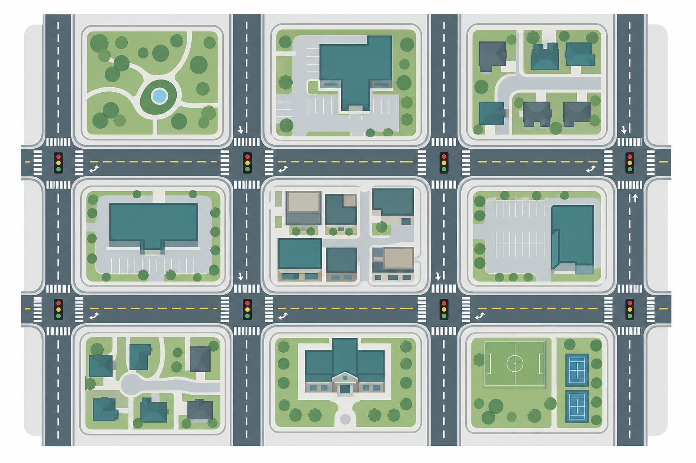
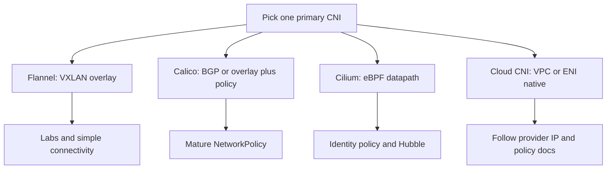
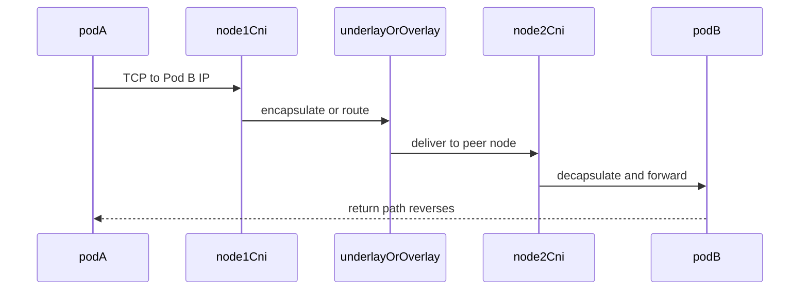
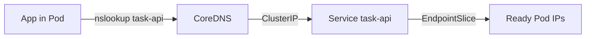
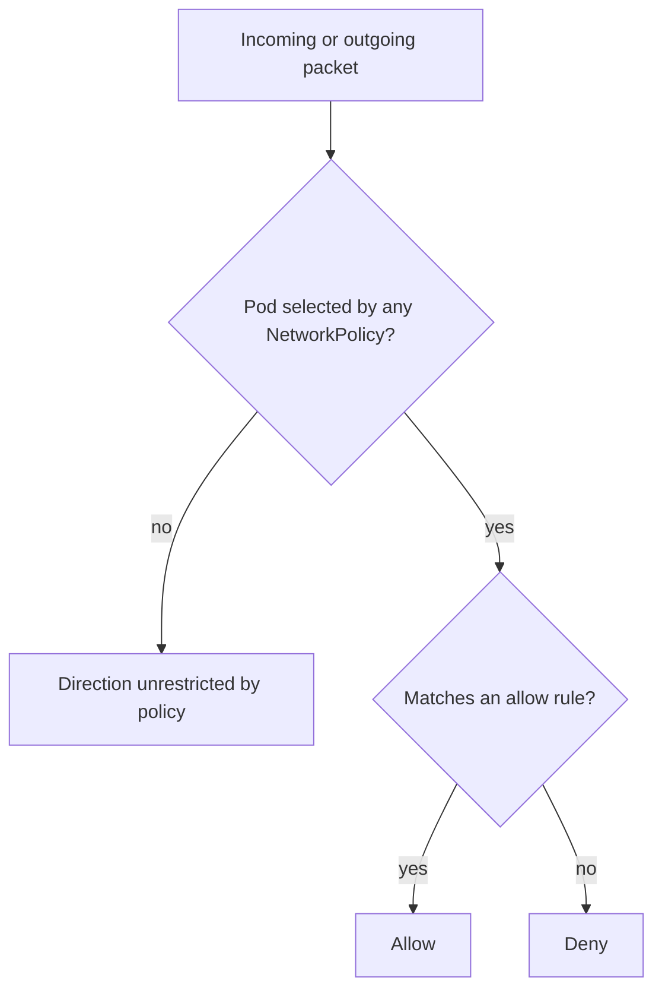
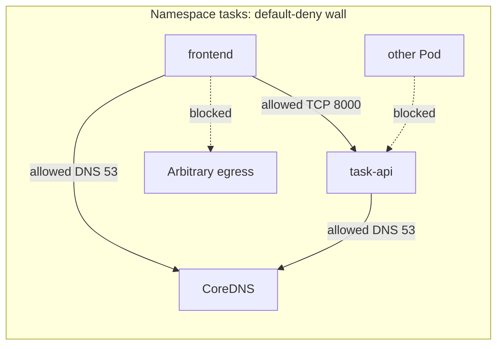

# Chapter 19 — Networking — CNI and Policies

> **Learning Objectives**
>
> By the end of this chapter, you will be able to:
>
> - Explain what a CNI plugin does and how a Pod gets its IP address
> - Compare Calico, Flannel, Cilium, and the common cloud CNIs, and know when to pick each
> - Follow a packet from a Pod on one node to a Pod on another
> - Describe how CoreDNS turns a Service name into an address
> - Write NetworkPolicies, starting from a default-deny baseline that still allows DNS
> - Know where dual-stack IPv4/IPv6 Service behavior is covered (Chapters 15 and 32)
> - Work through the usual “why can’t these two Pods talk?” failures

---

## 19.1 The city street grid

Think of your cluster as a city. Every Pod is a building with its own street address, which here is an IP address. Nodes are the neighborhoods those buildings sit in. Without a planning department, two buildings would end up with the same address and no roads would connect the neighborhoods.



*Figure 19.A: CNI lays the roads; NetworkPolicies are the traffic lights between neighborhoods.*

The **Container Network Interface (CNI)** is that planning department. A CNI plugin is the piece of software that hands each new Pod an address, builds its network connection, and makes sure a packet can leave one node and arrive at another. **Services** ([Chapter 15](15-k8s-services.md)) sit on top and give steady names to those constantly changing addresses. **NetworkPolicies** are the zoning laws that say who may call whom.

One default surprises almost everyone. Kubernetes assumes every Pod can reach every other Pod, in any namespace, with no rules in the way. That is wonderful on day one, when you just want things to work. It is dangerous later, because one compromised container can then knock on every door in the cluster.

---

## 19.2 What CNI provides

### In plain terms

A **CNI plugin** is a small program the kubelet runs every time it starts a Pod. Its job is simple to state: give this Pod an address and a working network connection. Kubernetes itself does not do this. It delegates.

Why does that split matter to you? Because the network under your Pods is not built into Kubernetes, so it can fail on its own. When the CNI plugin on a node is broken, Pods on that node get stuck in `ContainerCreating` with network setup errors, while every other node looks perfectly healthy. Knowing the plugin exists turns a baffling symptom into a two-minute check.

Back to the city. A building without a street number and without a curb cut is finished but unusable. Nobody can find it and nothing can be delivered. That is a Pod without CNI.

There is a tempting shortcut belief worth naming: "networking is just the cloud network, and that is already fine." Not quite. The kubelet still calls the plugin once to add the Pod to the network and once to remove it. A perfectly healthy cloud network plus a crashed CNI DaemonSet still gives you stuck Pods.

> ⚠️ **Common Pitfall:** You might think NotReady nodes are always kubelet or disk. A CNI CrashLoop on one node often presents as ContainerCreating / networkPlugin errors while other nodes look fine.

### Under the hood

Here is what the plugin actually does on the machine, in order:

1. Allocate an IP from the Pod CIDR (IPAM)
2. Create a network interface inside the Pod’s network namespace
3. Connect that interface to the node datapath (bridge, veth pair, eBPF programs, and so on)
4. Install routes (or tunnel endpoints) so other nodes can reach this Pod

```bash
$ kubectl get pods -n kube-system -o wide
NAME                                       READY   STATUS    IP            NODE
coredns-7db6d8ff4d-xk2m9                   1/1     Running   10.244.0.11   worker-1
calico-node-abc12                          1/1     Running   192.168.1.21  worker-1
calico-kube-controllers-5f6d7c8d9b-hj4lp   1/1     Running   10.244.0.8    worker-2
```

Exact DaemonSet names depend on the plugin. Managed clouds often ship Amazon VPC CNI, Azure CNI, GKE Dataplane V2 (Cilium-based), and similar—the mental model still applies.

Inspect node Pod CIDRs:

```bash
$ kubectl get nodes -o custom-columns=NAME:.metadata.name,PODCIDR:.spec.podCIDR
NAME       PODCIDR
worker-1   10.244.1.0/24
worker-2   10.244.2.0/24
```

What breaks if Pod CIDR overlaps a peered VPC: return traffic blackholes; symptoms look like “intermittent timeouts” after hybrid connectivity lands.

### In production

**Ownership:** The platform team picks the CNI, keeps its DaemonSet healthy, and writes down the address ranges. App teams own the labels their Services and NetworkPolicies match on. Evidence to gather during an incident: CNI DaemonSet status, each node's PodCIDR, and kubelet network plugin events.

**Failure mode:** When the CNI agent on a node dies, every new Pod on that node stays in ContainerCreating. Detect it through unavailable DaemonSet Pods and node NotReady or network plugin errors. Reduce the risk with alerts that page a human, CNI upgrades rolled out one group at a time, and a rollback plan as serious as the one you write for a Kubernetes upgrade.

| Do | Don't |
|----|-------|
| Alert on CNI CrashLoop and NotReady | Treat CNI upgrades as casual patch Tuesday |
| Document Pod/Service CIDRs in the runbook | Overlap CIDRs with on-prem or VPC ranges |
| Verify NetworkPolicy enforcement before relying on YAML | Assume every CNI enforces NetworkPolicy |

**Before you leave this section**

- **Understand:** Kubelet delegates Pod networking to CNI; unhealthy CNI blocks Pod start.
- **Try:** Identify your CNI DaemonSet and each node’s Pod CIDR.
- **Watch in prod:** CNI readiness and CIDR conflicts after VPN/peering changes.

---

## 19.3 Popular CNI plugins compared

### In plain terms

A cluster runs **one** main CNI plugin. This section is about choosing it, or recognizing which one you inherited.

Why is one choice enough? Because the plugin owns the wiring on every node, and two owners fight. The real decision has three parts: how packets move between nodes, whether the plugin enforces NetworkPolicy, and how much visibility you get into blocked traffic. Brand preference does not enter into it.

In short: Flannel is the simple choice for labs. Calico focuses on routing and has mature, well-tested policy support. Cilium uses **eBPF**, a Linux feature that runs small safe programs inside the kernel, to get speed, identity-based policy, and detailed traffic visibility. Cloud providers usually make the choice for you, so find out what you already have.

One plan that sounds reasonable and often is not: "we will add Calico later, just for policy." Many combinations of plugins argue over the same network interfaces and routes. Pick your main plugin first, then write policy that matches what that plugin actually enforces.

> ⚠️ **Common Pitfall:** You might think applying NetworkPolicy YAML proves isolation. On a CNI that does not enforce policy, you only have false confidence.

### Under the hood

Here is how the common plugins compare on the points that decide the choice:

| Plugin | Style | Strengths | Notes |
|--------|-------|-----------|-------|
| **Flannel** | Simple overlay (often VXLAN) | Easy to understand; great for labs | Limited NetworkPolicy unless paired with something else |
| **Calico** | Routing and/or overlay; strong policy | Mature NetworkPolicy; flexible IPAM | Very common in production |
| **Cilium** | eBPF-based datapath | High performance; identity-aware policy; Hubble observability | Modern default on some platforms |
| **Amazon VPC CNI** | Pods as VPC ENI/IPs | Native AWS networking | IP density and subnet planning matter |
| **Azure CNI / GKE variants** | Cloud-native wiring | Integrates with cloud networking and policy | Follow provider docs for dual-stack and policy |

> 💡 **Tip:** For learning NetworkPolicy behavior, Calico or Cilium are clearer than Flannel alone, because policy enforcement is a first-class feature.



*Figure 19.1: CNI choice is a trade-off among overlay simplicity, routing plus policy, eBPF performance, and cloud-native wiring.*

### In production

**Ownership:** The platform team picks the CNI and owns the upgrade path. Security and platform together own the proof that NetworkPolicy is really enforced. App teams must not install a second CNI for one namespace.

**Failure mode:** Two plugins competing, or a mismatched **MTU** (maximum transmission unit, the largest packet size a link accepts), causes dropped packets and timeouts nobody can explain. Detect it with connectivity probes that run between nodes and with MTU path tests. Prevent it by standardizing on one plugin and writing down how much extra header overhead the encapsulation adds for latency-sensitive apps.

| Do | Don't |
|----|-------|
| Pick one primary CNI | Run two full CNIs “for safety” |
| Align policy CRDs with CNI version | Trust YAML without an enforcement test |
| Confirm mesh vs CNI policy order | Ignore cloud CNI IP density limits |

**Before you leave this section**

- **Understand:** One primary CNI; policy only works if the dataplane enforces it.
- **Try:** Name your cluster’s CNI and whether NetworkPolicy is enforced.
- **Watch in prod:** MTU/latency regressions after CNI or overlay changes.

---

## 19.4 Cross-node packet flow

### In plain terms

Cross-node packet flow is the path a request takes when the Pod sending it and the Pod receiving it live on different machines. There are only two ways to do it, and your CNI picks one.

Why learn the path? Because "the Pods can't talk" is almost never a single failure. DNS, NetworkPolicy, kube-proxy, and the firewalls of the network underneath all sit at different points along the route. If you cannot name the hops, you cannot say which one broke, and three teams end up changing three things at once.

Think of a letter leaving one neighborhood, traveling the city's main roads, and arriving in another neighborhood. Those main roads are the **underlay**, the ordinary network your nodes already sit on. The CNI has two ways to use it. It can wrap your packet inside another packet and send it through a tunnel, which is called an **overlay**. Or it can tell the underlay routers exactly which node owns which Pod addresses, so the packet travels directly with no wrapper.

Here is a check that fools people. A successful `ping` between two Pods does not prove a Service works. Pod-to-Pod is the shortest path in the cluster. Reaching a Service adds a ClusterIP and an EndpointSlice lookup, and either of those can be broken while ping is perfectly happy.

> ⚠️ **Common Pitfall:** You might think fixing a Security Group for node IPs automatically covers Pod IPs. On some CNIs Pods use different addresses; on others they share the node ENI—know which model you run.

### Under the hood

Here is the actual path a packet takes. Suppose Pod A (`10.244.1.10`) calls Pod B (`10.244.2.20:8000`).

Simplified VXLAN-style path:

1. App in Pod A sends a TCP packet to `10.244.2.20:8000`
2. Packet leaves Pod A’s eth0 via a veth pair into the node’s networking
3. Node 1’s CNI decides Node 2 owns that Pod CIDR
4. Packet is encapsulated and sent over the underlay to Node 2
5. Node 2 decapsulates and delivers to Pod B
6. Return traffic reverses the path

With route-based Calico (no overlay), nodes advertise Pod CIDRs via BGP; packets route directly when the underlay allows it.

```text
Pod A (Node 1) → veth/CNI → [overlay or route] → CNI/veth → Pod B (Node 2)
```

Services add another hop: clients often target a ClusterIP; **kube-proxy** (iptables, IPVS, or an eBPF replacement) DNAT/load-balances to an EndpointSlice IP. From there, the path is again Pod-to-Pod networking. See [Chapter 15](15-k8s-services.md) for Service types and EndpointSlices.



*Figure 19.2: Cross-node Pod traffic rides the CNI datapath—often via overlay encapsulation, sometimes via direct routes.*

What breaks if underlay firewalls allow node→node but not the overlay UDP port: cross-node Pod traffic dies while same-node traffic works—classic “it works until the scheduler spreads replicas.”

### In production

**Ownership:** The platform team keeps the underlay and overlay healthy. App teams supply exact reproduction steps: source Pod, destination Pod or Service, and port. Detect problems early with test traffic that runs continuously between nodes and between zones. Keep the damage small by having the runbook separate DNS, policy, and routing into three checks, so nobody changes all three layers in one panic.

| Do | Don't |
|----|-------|
| Capture packets / Hubble before guessing | Blame the app for every timeout |
| Test same-node vs cross-node paths | Ignore asymmetric routes after peering changes |
| Check EndpointSlices when Services fail | Confuse Pod IP reachability with ClusterIP behavior |

**Before you leave this section**

- **Understand:** Cross-node traffic rides CNI overlay or routes; Services add kube-proxy/eBPF DNAT.
- **Try:** Trace one request from Pod A to Pod B on another node in your lab notes.
- **Watch in prod:** Same-node OK / cross-node fail patterns after network ACL changes.

---

## 19.5 Cluster DNS (CoreDNS)

### In plain terms

CoreDNS is the cluster phone book. Pods ask it for `task-api` and get the Service ClusterIP. Applications should call **Services by DNS name**, not Pod IPs—those change on every reschedule.

DNS failure is a force multiplier: every microservice looks “down” at once. You might think scaling the app Deployment fixes “intermittent 503s” when CoreDNS is saturated or NetworkPolicy blocked UDP/TCP 53. Always verify resolution before deep application debugging.

> ⚠️ **Common Pitfall:** Calling `localhost` from one Pod expecting to reach another Pod. `localhost` is always *this* network namespace. Use the Service DNS name.

### Under the hood

CoreDNS runs as a Deployment in `kube-system` and backs the cluster DNS Service (often still labeled `kube-dns`). Pods receive nameserver and search domains from the kubelet.

| Query | Resolves to |
|-------|-------------|
| `task-api` | Service `task-api` in the Pod’s namespace |
| `task-api.payments` | Service in namespace `payments` |
| `task-api.payments.svc.cluster.local` | Fully qualified Service name |
| `10-244-1-10.default.pod.cluster.local` | Pod DNS (when enabled) |



*Figure 19.3: Apps resolve Service DNS names through CoreDNS to a stable ClusterIP, then to changing Pod endpoints.*

```bash
$ kubectl run dns-test --rm -it --image=busybox:1.36 --restart=Never -- \
    nslookup task-api.default.svc.cluster.local
Server:		10.96.0.10
Address:	10.96.0.10:53

Name:	task-api.default.svc.cluster.local
Address: 10.96.120.45
```

What breaks if CoreDNS replicas are undersized at peak QPS: NXDOMAIN spikes and cascading client retries that look like an app outage.

### In production

**Ownership:** Platform owns CoreDNS sizing, PDB, and DNS SLOs; app teams own correct Service DNS names (short vs FQDN). Detect with CoreDNS latency/error metrics and synthetic `nslookup` probes. Mitigate with HPA where supported, caching discipline, and NetworkPolicy DNS allows before default-deny egress.

| Do | Don't |
|----|-------|
| Alert on CoreDNS errors and latency | Debug apps before verifying DNS |
| Prefer FQDNs across namespaces | Hard-code Pod IPs in configs |
| Size replicas for peak QPS | Forget DNS allow when adding default-deny |

**Before you leave this section**

- **Understand:** Apps resolve Services via CoreDNS; Pod IPs are ephemeral.
- **Try:** `nslookup` a Service FQDN from a debug Pod and match the ClusterIP.
- **Watch in prod:** CoreDNS saturation and DNS failures after NetworkPolicy changes.

---

## 19.6 Dual-stack networking (cross-reference)

### In plain terms

**Dual-stack** means Pods and Services can use both IPv4 and IPv6. Think of every building getting both a street number and a new postal code system at once. Clients may dial either family; Services can expose one or both.

Enabling dual-stack is a cluster-wide networking change, not a Service annotation experiment. You might think flipping `ipFamilyPolicy` on one Service is harmless; without CNI, routes, and firewall parity for IPv6, you create half-working endpoints and confusing client behavior.

> ⚠️ **Common Pitfall:** You might think NetworkPolicy IPv4 allows cover IPv6 peers. Dual-stack doubles the families you must allow intentionally.

### Under the hood

Kubernetes dual-stack touches:

- Cluster and Pod CIDRs for both families
- Service `spec.ipFamilyPolicy` and `spec.ipFamilies`
- CNI and cloud networking support for IPv6 routes and load balancers

Example Service (details expanded in [Chapter 15](15-k8s-services.md); production dual-stack design and migration appear in [Chapter 32](32-advanced-networking-traffic.md)):

```yaml
apiVersion: v1
kind: Service
metadata:
  name: task-api
spec:
  ipFamilyPolicy: PreferDualStack
  ipFamilies:
    - IPv4
    - IPv6
  selector:
    app: task-api
  ports:
    - name: http
      port: 80
      targetPort: 8000
```

```bash
$ kubectl get svc task-api -o wide
NAME       TYPE        CLUSTER-IP     EXTERNAL-IP   PORT(S)   IP-FAMILIES
task-api   ClusterIP   10.96.120.45   <none>        80/TCP    IPv4,IPv6
```

NetworkPolicies can reference IPv4 and IPv6 CIDRs in `ipBlock` peers. Default-deny still applies per selected Pod; dual-stack does not weaken policy—it doubles the address families you must allow intentionally. What breaks if cloud LBs are IPv4-only while Services advertise IPv6: external clients never reach the IPv6 family you thought you enabled.

### In production

**Ownership:** Platform owns dual-stack enablement (CIDRs, CNI, cloud LB). App teams align Service `ipFamilyPolicy` with how clients actually connect. Detect with dual-family connectivity tests and LB health on both families.

| Do | Don't |
|----|-------|
| Plan CIDRs/CNI/LB before enabling | Flip dual-stack on a live cluster casually |
| Test NetworkPolicies for both families | Assume IPv4 allows cover IPv6 |
| Keep `ipFamilyPolicy` consistent with clients | Mix PreferDualStack without client testing |

**Before you leave this section**

- **Understand:** Dual-stack is cluster plumbing plus Service fields; see Chapters 15 and 32.
- **Try:** Inspect whether your lab Services show one or two IP families.
- **Watch in prod:** Partial IPv6 enablement that only works inside the cluster.

---

## 19.7 NetworkPolicy fundamentals

### In plain terms

A **NetworkPolicy** selects Pods and lists who may talk to them (ingress) and whom they may call (egress). Once any policy selects a Pod in a direction, traffic not explicitly allowed in that direction is denied. Policies are additive allow-lists, not competing deny engines.

This is the primary in-cluster lateral-movement control. You might think a deny rule somewhere will override allows—Kubernetes NetworkPolicy has no deny rules; isolation comes from selecting a Pod and omitting traffic from the allow-list. Mis-labeled Pods are either wide open (no selecting policy) or mysteriously blocked (selected but no matching peer).

> ⚠️ **Common Pitfall:** You might think policies select Services. They select **Pods** by label—keep Service selectors and NetworkPolicy selectors aligned.

### Under the hood

```yaml
apiVersion: networking.k8s.io/v1
kind: NetworkPolicy
```

Important ideas:

- Policies select **Pods**, not Services (match the same labels Services use)
- **Ingress** rules control traffic *to* selected Pods
- **Egress** rules control traffic *from* selected Pods
- Peers can be pod selectors, namespace selectors, or IP blocks
- Ports are optional but recommended for least privilege



*Figure 19.4: Once a NetworkPolicy selects a Pod in a direction, unspecified traffic in that direction is denied.*

> 📘 **Deep Dive (optional):** NetworkPolicy implementation is delegated to the CNI. If your plugin does not enforce policy, applying YAML does nothing useful. Verify enforcement.

What breaks if labels drift between Deployment and NetworkPolicy: production traffic that worked yesterday fails after a harmless label rename—treat label contracts as API.

### In production

**Ownership:** Security/platform own baseline policy posture; app teams own allow-lists for their namespace traffic matrix. Detect with connectivity tests in CI and denied-flow metrics (Cilium Hubble, Calico flow logs). Mitigate by generating policies from a traffic matrix, not hand-editing during incidents.

| Do | Don't |
|----|-------|
| Start in non-prod with default-deny | Rely on policy without CNI enforcement proof |
| Label namespaces consistently | Treat NetworkPolicy as a full security program alone |
| Pair with RBAC and PSA (Chapter 21) | Select different labels than the Service uses |

**Before you leave this section**

- **Understand:** Once selected, unspecified traffic in that direction is denied; policies are allow-lists.
- **Try:** Apply a policy that selects a Pod and observe blocked traffic.
- **Watch in prod:** Label drift and “policy applied but CNI does not enforce.”

---

## 19.8 Default deny and least-privilege allows

### In plain terms

Lock every door, then hand out specific keys: DNS, frontend to API, monitoring scrapes. Forgetting DNS is the classic foot-gun—apps fail with “name resolution” errors that look like application bugs.

Default-deny is a blast-radius control: a compromised Pod should not freely scan the cluster or exfiltrate to the internet. You might think applying default-deny in production first is “more secure”—without a traffic map and staging rehearsal, you create a self-inflicted outage. Roll out detect→mitigate style: observe flows, write allows, then close the wall.

> ⚠️ **Common Pitfall:** Creating a default-deny egress policy and forgetting DNS (UDP/TCP 53 to CoreDNS).

### Under the hood

```yaml
apiVersion: networking.k8s.io/v1
kind: NetworkPolicy
metadata:
  name: default-deny-all
  namespace: tasks
spec:
  podSelector: {}
  policyTypes:
    - Ingress
    - Egress
```

Allow DNS to CoreDNS:

```yaml
apiVersion: networking.k8s.io/v1
kind: NetworkPolicy
metadata:
  name: allow-dns-egress
  namespace: tasks
spec:
  podSelector: {}
  policyTypes:
    - Egress
  egress:
    - to:
        - namespaceSelector:
            matchLabels:
              kubernetes.io/metadata.name: kube-system
          podSelector:
            matchLabels:
              k8s-app: kube-dns
      ports:
        - protocol: UDP
          port: 53
        - protocol: TCP
          port: 53
```

Allow frontend to Task API:

```yaml
apiVersion: networking.k8s.io/v1
kind: NetworkPolicy
metadata:
  name: allow-frontend-to-task-api
  namespace: tasks
spec:
  podSelector:
    matchLabels:
      app: task-api
  policyTypes:
    - Ingress
  ingress:
    - from:
        - podSelector:
            matchLabels:
              app: frontend
      ports:
        - protocol: TCP
          port: 8000
```

Cross-namespace ingress:

```yaml
apiVersion: networking.k8s.io/v1
kind: NetworkPolicy
metadata:
  name: allow-ingress-from-monitoring
  namespace: tasks
spec:
  podSelector:
    matchLabels:
      app: task-api
  policyTypes:
    - Ingress
  ingress:
    - from:
        - namespaceSelector:
            matchLabels:
              purpose: monitoring
          podSelector:
            matchLabels:
              app: prometheus
      ports:
        - protocol: TCP
          port: 8000
```

```bash
$ kubectl label namespace monitoring purpose=monitoring --overwrite
$ kubectl apply -f default-deny.yaml -f allow-dns.yaml -f allow-frontend-to-api.yaml
$ kubectl get networkpolicy -n tasks
```

Egress to the internet (tighten CIDRs when you can):

```yaml
egress:
  - to:
      - ipBlock:
          cidr: 0.0.0.0/0
          except:
            - 10.0.0.0/8
    ports:
      - protocol: TCP
        port: 443
```

For dual-stack clusters, add matching IPv6 `ipBlock` entries when intentional egress on IPv6 is required.



*Figure 19.5: Default-deny locks the namespace; explicit allows open frontend→task-api and DNS—everything else stays blocked.*

### In production

**Ownership:** Platform publishes the default-deny + DNS allow pattern; app teams maintain the namespace traffic matrix and PR policy changes. Change safety: never apply default-deny to a busy namespace without a rollback NetworkPolicy set and a staging soak.

**Failure mode:** Missing allow → total namespace outage or DNS blackhole. Detect with synthetic checks and error budgets on dependency success rates. Mitigate by applying DNS allow *with* default-deny in one change, then opening app paths incrementally.

| Do | Don't |
|----|-------|
| Maintain a traffic matrix per namespace | Apply default-deny to prod first |
| Prefer named ports in policies | Open `0.0.0.0/0` egress without except CIDRs |
| Soak in staging with real clients | Forget monitoring scrape allows |

> 🏭 **Production floor:** **NetworkPolicy default-deny rollout** is a controlled blast-radius change. Procedure: (1) inventory flows in staging (Hubble/flow logs/`tcpdump`), (2) commit default-deny + DNS allow + known app allows as one PR, (3) soak with synthetic probes and real canary traffic, (4) promote to prod with a revert PR ready (`kubectl delete networkpolicy default-deny-all -n <ns>` is *not* enough if other policies still select Pods—know your rollback set). Paste policy names, namespace, and probe results into the change ticket. If DNS breaks, restore DNS egress first—do not disable the entire CNI.

**Before you leave this section**

- **Understand:** Default-deny + explicit allows (including DNS) is the production baseline.
- **Try:** In a scratch namespace, default-deny, prove block, add DNS and one app path.
- **Watch in prod:** Rollouts that skip staging soak; missing monitoring or ingress peer allows.

---

## 19.9 Debugging connectivity

Checklist when Pods cannot talk:

1. Do both Pods have IPs? (`kubectl get pods -o wide`)
2. Does DNS resolve?
3. Does a NetworkPolicy select one of them?
4. Are labels exact matches?
5. Is the CNI healthy?
6. For Services: do EndpointSlices list ready Pods?

```bash
$ kubectl get endpointslices -l kubernetes.io/service-name=task-api
$ kubectl describe networkpolicy allow-frontend-to-task-api -n tasks
$ kubectl get pods -n kube-system -l k8s-app=calico-node
```

Separate layers in the incident ticket: DNS failed / NetworkPolicy denied / CNI routing / empty EndpointSlices. That order prevents three teams changing three layers at once.

---

## 19.10 Common pitfalls

> ⚠️ **Common Pitfall:** Assuming NetworkPolicy YAML works on every CNI—Flannel alone often does not enforce it.

> ⚠️ **Common Pitfall:** Selecting Services in your head but labeling Pods differently—policies match Pod labels only.

> ⚠️ **Common Pitfall:** Overlapping Pod CIDRs with the corporate network after VPN or hybrid connect.

> ⚠️ **Common Pitfall:** Enabling dual-stack Services without dual-stack CNI and firewall rules.

> ⚠️ **Common Pitfall:** Creating a default-deny egress policy and forgetting DNS.

---

## 19.11 Hands-on exercises

1. **Map the CNI.** Identify which CNI your cluster runs and whether NetworkPolicy is enforced.
2. **DNS check.** From a debug Pod, resolve a Service FQDN and confirm it matches the ClusterIP.
3. **Baseline deny.** In a scratch namespace, deploy two labeled Pods. Apply default-deny. Verify they cannot connect.
4. **Selective allow.** Allow TCP from `app=a` to `app=b` on a chosen port. Verify only that path works.
5. **DNS egress.** With default-deny including egress, add DNS allow and confirm `nslookup` works again.

---

## 19.12 Check Your Understanding

**Q1.** Does Kubernetes itself implement Pod-to-Pod networking?

<details>
<summary>Show answer</summary>

**No.** Networking is provided by a CNI plugin installed in the cluster (or by the managed platform’s CNI).

</details>

**Q2.** Why might Flannel alone be insufficient for production multi-tenant isolation?

<details>
<summary>Show answer</summary>

Flannel focuses on connectivity. Rich NetworkPolicy enforcement typically needs Calico, Cilium, or a Flannel-plus-policy companion.

</details>

**Q3.** After any NetworkPolicy selects a Pod, what happens to unspecified ingress traffic?

<details>
<summary>Show answer</summary>

Unspecified ingress is **denied** for that Pod in the ingress direction. The selecting policies define the allow-list.

</details>

**Q4.** Why does default-deny egress often break DNS?

<details>
<summary>Show answer</summary>

CoreDNS is reached over the network. Without an egress allow to DNS (UDP/TCP 53), name resolution fails.

</details>

**Q5.** Where should you go next for dual-stack Service fields versus deep dual-stack design?

<details>
<summary>Show answer</summary>

Service `ipFamilyPolicy` / `ipFamilies` basics live in [Chapter 15](15-k8s-services.md). Production dual-stack design and migration are covered in [Chapter 32](32-advanced-networking-traffic.md).

</details>

---

## 19.13 Key takeaways

- CNI plugins assign Pod IPs and implement cross-node connectivity; monitor them as critical infrastructure.
- Calico, Flannel, Cilium, and cloud CNIs trade simplicity, policy, and observability differently.
- CoreDNS powers service discovery; apps should use Service names.
- NetworkPolicies are deny-by-exception once a Pod is selected—start from default-deny and open least-privilege paths, including DNS.
- Dual-stack multiplies address families; cross-check Chapters 15 and 32 before enabling it in production.

---

## 19.14 Official documentation map

| Topic | Official page |
|-------|---------------|
| Cluster networking | [Cluster Networking](https://kubernetes.io/docs/concepts/cluster-administration/networking/) |
| Network Policies | [Network Policies](https://kubernetes.io/docs/concepts/services-networking/network-policies/) |
| DNS for Services and Pods | [DNS for Services and Pods](https://kubernetes.io/docs/concepts/services-networking/dns-pod-service/) |
| Dual-stack | [IPv4/IPv6 Dual-Stack](https://kubernetes.io/docs/concepts/services-networking/dual-stack/) |
| Service | [Service](https://kubernetes.io/docs/concepts/services-networking/service/) |
| CNI specification | [CNI](https://www.cni.dev/) |

**Previous:** [Chapter 18 — Kubernetes Storage](18-k8s-storage.md) | **Next:** [Chapter 20 — Scheduling and Advanced Placement](20-scheduling-and-advanced-placement.md)
