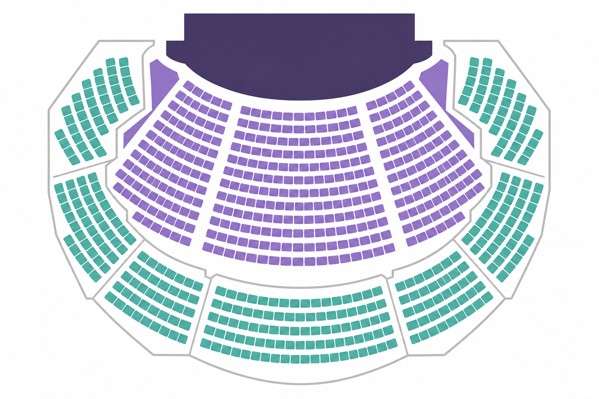
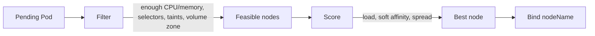
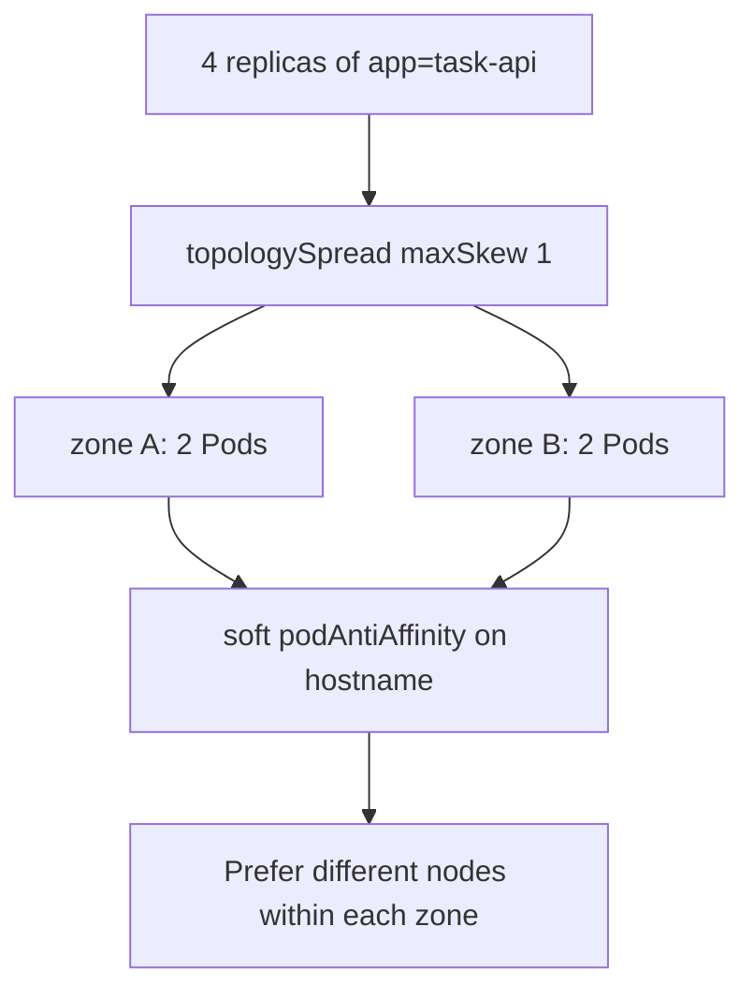
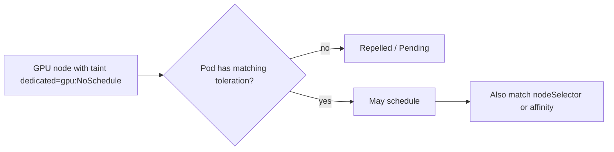
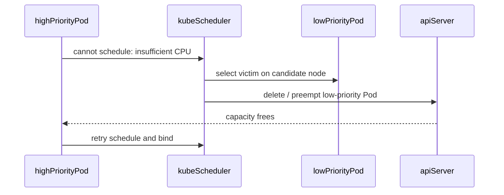
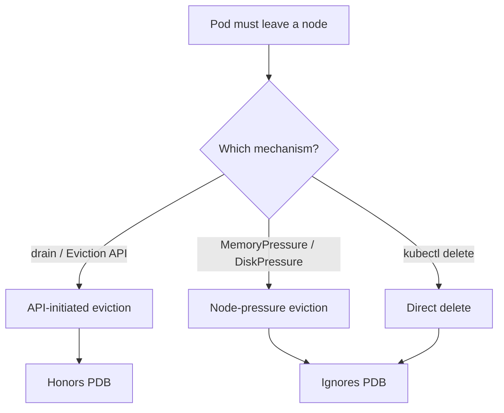

# Chapter 20 — Scheduling and Advanced Placement

> **Learning Objectives**
>
> By the end of this chapter, you will be able to:
>
> - Explain how the kube-scheduler rules nodes out, ranks the rest, and picks a winner
> - Use `nodeSelector`, node affinity, and Pod affinity or anti-affinity to steer placement
> - Use taints and tolerations to hold nodes back for specific workloads
> - Spread replicas evenly across zones and hosts with topology spread constraints
> - Set up PriorityClass, and know when one Pod pushes another out
> - Tell the two kinds of eviction apart: the kubelet saving a node, and a planned drain
> - Work out why a Pod is stuck Pending, without piling on more rules that make it worse

---

## 20.1 The concert seating chart

A touring band's road manager never seats people at random. Drummers need space and a power outlet. The backup singers should not all sit in one row that might collapse. VIPs get a roped-off section of their own. A few seats are broken and marked "do not use." And when the venue fills up, standby guests are asked to leave so the headliners can go on.



*Figure 20.A: The scheduler assigns seats (nodes) using rules, not random placement.*

The **kube-scheduler** is that road manager. Its job is to decide which node each new Pod runs on. Every Pod that does not already name a node joins a queue and waits for that decision.

The decision has three steps. First the scheduler **filters**, which means it throws out every node that simply cannot run this Pod. Then it **scores** the survivors, giving each one a number based on how good a fit it is. Then it **binds** the Pod to the highest scorer, which just means writing that node's name onto the Pod.

Two more ideas cover the case where the cluster is full. **Priority** is a number that says how important a Pod is. **Preemption** is what happens when an important Pod cannot fit: the scheduler removes a less important one to make room.

Your job in all of this is to describe what your Pod needs, clearly and no more strictly than necessary. Every rule you add removes nodes from consideration. Add enough of them and nothing can be scheduled anywhere.

---

## 20.2 How scheduling works

### In plain terms

Scheduling is matchmaking. The scheduler finds every node that *can* run your Pod, then picks the *best* one from that list. If no node qualifies, the Pod stays in the **Pending** state, which means it has been accepted by the cluster but is not running anywhere yet.

Why let software make this call? Because a human cannot. Every placement decision has to weigh free CPU and memory on each node, the labels you asked for, the nodes reserved for other teams, and the zone your disk lives in. That is hundreds of checks per Pod, and the answer changes every minute as workloads come and go.

The scheduler also leaves you a trail. Every Pending Pod carries **Events**, short messages attached to the object, and those messages name the exact reason each node was rejected. Read them first. Pending almost never means the cluster is broken. It usually means your own rules eliminated every candidate, and adding another rule will only make that worse.

> ⚠️ **Common Pitfall:** You might think omitting resource requests “lets the Pod start faster.” Without requests the filter cannot place fairly, and under pressure your Pod becomes an easy eviction victim.

### Under the hood

Here is what the scheduler actually evaluates, in order:

1. **Filtering (predicates):** Enough CPU/memory? Match selectors? Tolerate taints? Volume zone OK? Priority preemption candidates?
2. **Scoring (priorities):** Prefer less loaded nodes, honor soft affinity, spread where asked
3. **Binding:** Write `nodeName` via the API; kubelet on that node starts the Pod

```bash
$ kubectl get pods -o wide
NAME                        READY   STATUS    NODE       IP
task-api-6d7f8c9b5d-xk2m9   1/1     Running   worker-2   10.244.2.17
```

```bash
$ kubectl describe pod task-api-6d7f8c9b5d-aaaaa
Events:
  Type     Reason            Message
  ----     ------            -------
  Warning  FailedScheduling  0/3 nodes are available: 1 node(s) had untolerated taint..., 2 Insufficient cpu.
```



*Figure 20.1: The scheduler filters impossible nodes, scores the rest, then binds the Pod to the winner.*

*Figure 20.1: The scheduler filters impossible nodes, scores the rest, then binds the Pod to the winner.*

What breaks if every node fails a hard filter: the Pod stays Pending indefinitely—capacity autoscaling will not help if affinity/taints are the real blockers.

### In production

**Ownership:** The platform team keeps the scheduler healthy and keeps spare node capacity available. App teams own their resource requests and their placement rules. Evidence to gather during an incident: `kubectl describe pod` Events, how much each node can allocate versus what is already requested, and the full list of taints.

**Failure mode:** Too many strict rules leave Pods Pending exactly when you need to scale out during an incident. Detect it with an alert on how long Pods have been Pending. Reduce the risk by writing soft rules wherever a hard one is not truly required, and by keeping enough spare capacity to absorb a drain or a preemption.

| Do | Don't |
|----|-------|
| Always set resource requests | Add more required affinity before reading Events |
| Keep spare capacity for drains | Pin every Pod with required rules |
| Treat Pending Events as source of truth | Assume Pending means “buy more nodes” only |

**Before you leave this section**

- **Understand:** Filter → score → bind; Pending Events name the failing predicates.
- **Try:** Describe a Pending Pod and map each message to a constraint.
- **Watch in prod:** Pending spikes after node pool or taint changes.

---

## 20.3 Labels, nodeSelector, and node affinity

### In plain terms

Nodes wear nametags. In Kubernetes those nametags are **labels**, simple key-value pairs such as `disktype=ssd` or `topology.kubernetes.io/zone=us-east-1a`. A Pod can then say which nametags it needs.

Why do you need this? Because nodes are not identical. Some have fast local disks, some have GPUs, some sit in a different data center. A Pod that must read from a fast disk should not land on the node with the slow one, and only labels can tell the scheduler which is which.

There are two ways to ask. `nodeSelector` is the short form: list the labels, and the Pod goes nowhere else. **Node affinity** is the longer form, and it buys you two things `nodeSelector` cannot. It supports operators such as "in this list" or "label not present." And it supports **soft** rules — a preference the scheduler tries to honor but will happily ignore rather than leave your Pod Pending.

That soft-versus-hard choice matters more than it looks. A hard rule during a partial outage means no Pod schedules at all. A soft rule means your Pod lands somewhere less ideal and keeps serving traffic. Also treat labels as a contract you cannot typo: the platform team decides which labels exist, and a single misspelled key leaves Pods Pending with no obvious clue.

> ⚠️ **Common Pitfall:** You might think changing affinity moves running Pods. Scheduling rules apply at schedule time; roll the Deployment to reshuffle.

### Under the hood

Here is how you read and set node labels, then use them:

```bash
$ kubectl get nodes --show-labels
$ kubectl label nodes worker-3 disktype=ssd --overwrite
```

**nodeSelector:**

```yaml
apiVersion: apps/v1
kind: Deployment
metadata:
  name: task-api
spec:
  replicas: 2
  selector:
    matchLabels:
      app: task-api
  template:
    metadata:
      labels:
        app: task-api
    spec:
      nodeSelector:
        disktype: ssd
      containers:
        - name: api
          image: ghcr.io/mastering-k8s/task-api:1.1
          ports:
            - containerPort: 8000
```

**Node affinity** (hard + soft):

```yaml
affinity:
  nodeAffinity:
    requiredDuringSchedulingIgnoredDuringExecution:
      nodeSelectorTerms:
        - matchExpressions:
            - key: topology.kubernetes.io/zone
              operator: In
              values:
                - us-east-1a
                - us-east-1b
    preferredDuringSchedulingIgnoredDuringExecution:
      - weight: 80
        preference:
          matchExpressions:
            - key: disktype
              operator: In
              values:
                - ssd
```

| Operator | Meaning |
|----------|---------|
| `In` / `NotIn` | Label value in / not in list |
| `Exists` / `DoesNotExist` | Label key present / absent |
| `Gt` / `Lt` | Numeric comparison (specialized cases) |

“IgnoredDuringExecution” means if labels change later, the scheduler does not automatically evict running Pods.

> 💡 **Tip:** Start with `nodeSelector` for simple “must run on X” rules. Graduate to affinity when you need operators or soft preferences.

> 💡 **Tip:** Start with `nodeSelector` for simple “must run on X” rules. Graduate to affinity when you need operators or soft preferences.

What breaks if a node pool loses the `disktype=ssd` label during a rebuild: every hard-pinned Pod goes Pending until labels are restored.

### In production

**Ownership:** The platform team decides which labels exist on which node pools and writes them down. App teams use only the documented keys. Detect mistakes through Pending Pods whose Events name a label mismatch. Reduce the damage by using soft preferences whenever the hardware requirement is a nice-to-have rather than a must.

| Do | Don't |
|----|-------|
| Standardize label taxonomies | Invent one-off label keys per team |
| Prefer soft affinity when possible | Typo labels without CI validation |
| Roll Deployments after affinity changes | Expect running Pods to move themselves |

**Before you leave this section**

- **Understand:** `nodeSelector` is hard; affinity adds operators and soft preferences.
- **Try:** Label a node and pin a Deployment with `nodeSelector`.
- **Watch in prod:** Node pool rebuilds that drop required labels.

---

## 20.4 Pod affinity, anti-affinity, and topology spread

### In plain terms

These three features place a Pod based on where *other Pods* already are. **Pod affinity** pulls a Pod toward its friends. **Pod anti-affinity** pushes it away from its own kind. **Topology spread** goes further and keeps the counts roughly even across a set of places.

Why does any of this matter? Because of what happens when one machine dies. If all four replicas of your API happen to land on the same node, that node's failure takes your whole service down. Spread those four across four nodes, or across two zones, and a single failure costs you a fraction of your capacity instead of all of it. The set of things that fail together — a node, a rack, a zone — is called a **failure domain**.

Here is the trap. Strict rules feel safer, so people reach for hard anti-affinity. But hard anti-affinity on hostname with four replicas and three nodes has exactly one outcome: the fourth Pod is Pending forever, and it stays Pending during the next incident too. Soft spread plus a PodDisruptionBudget almost always survives real failures better than a strict rule that cannot be satisfied.

> ⚠️ **Common Pitfall:** Hard Pod anti-affinity with `topologyKey: kubernetes.io/hostname` and more replicas than nodes guarantees Pending Pods.

### Under the hood

Here are the three forms side by side. Hard Pod anti-affinity (no two `app=task-api` Pods on the same node):

```yaml
affinity:
  podAntiAffinity:
    requiredDuringSchedulingIgnoredDuringExecution:
      - labelSelector:
          matchLabels:
            app: task-api
        topologyKey: kubernetes.io/hostname
```

With 3 replicas and only 2 nodes, one Pod stays Pending. Soft anti-affinity is usually safer:

```yaml
affinity:
  podAntiAffinity:
    preferredDuringSchedulingIgnoredDuringExecution:
      - weight: 100
        podAffinityTerm:
          labelSelector:
            matchLabels:
              app: task-api
          topologyKey: kubernetes.io/hostname
```

**Topology spread:**

```yaml
topologySpreadConstraints:
  - maxSkew: 1
    topologyKey: topology.kubernetes.io/zone
    whenUnsatisfiable: DoNotSchedule
    labelSelector:
      matchLabels:
        app: task-api
```

| Field | Role |
|-------|------|
| `maxSkew` | Allowed difference in Pod counts across topologies |
| `topologyKey` | Domain label (zone, hostname, …) |
| `whenUnsatisfiable` | `DoNotSchedule` (hard) or `ScheduleAnyway` (soft) |
| `labelSelector` | Which Pods count toward the spread |

You can stack spreads (zone *and* hostname) for stronger resilience.



*Figure 20.2: Topology spread keeps counts even across zones; soft anti-affinity prefers different hosts without stranding Pending Pods.*

*Figure 20.2: Topology spread keeps counts even across zones; soft anti-affinity prefers different hosts without stranding Pending Pods.*

What breaks if `whenUnsatisfiable: DoNotSchedule` meets a single-zone outage: new Pods Pending even though other zones have capacity—prefer `ScheduleAnyway` for many web apps.

### In production

**Ownership:** App teams own their spread and anti-affinity rules, because those rules follow from the availability target they promised. The platform team owns zone labels and how many nodes exist in each failure domain. Detect problems by tracking how uneven the spread has become, and by watching for Pending Pods during a zone outage. Reduce the damage with soft spread plus a PDB ([Chapter 24](24-production-best-practices.md)).

| Do | Don't |
|----|-------|
| Prefer topology spread + soft anti-affinity | Hard anti-affinity for every web app |
| Combine with PDBs for drains | Set replicas higher than hard topology domains |
| Stack zone *and* hostname spreads carefully | Ignore zone label correctness |

**Before you leave this section**

- **Understand:** Soft anti-affinity and topology spread reduce blast radius without stranding Pending Pods.
- **Try:** Apply `maxSkew: 1` and observe distribution across labeled domains.
- **Watch in prod:** Hard rules that prevent scale-out during incidents.

---

## 20.5 Taints and tolerations

### In plain terms

A **taint** is a mark you put on a node that pushes Pods away. A **toleration** is a matching mark you put on a Pod that says "this one is allowed here anyway." Taints go on nodes. Tolerations go on Pods. They only work as a pair.

Why is this a separate mechanism from affinity? Because affinity and taints point in opposite directions, and you usually want both. Affinity is the Pod choosing a node. A taint is the node refusing Pods it did not invite. Only the node side can protect expensive hardware, because it works even against a Pod whose author never heard of your GPU pool. Control-plane nodes rely on this: they carry `node-role.kubernetes.io/control-plane:NoSchedule` so ordinary workloads stay off them without every team having to remember.

Think of it as a roped-off VIP section. Affinity is a guest deciding to sit near the stage. A taint is the rope. A toleration is the wristband that gets you past it.

> 💡 **In one line:** Affinity is the Pod asking for a node; a taint is the node refusing Pods, and a toleration is the wristband that gets one in anyway.

That difference explains the most common misuse. Adding tolerations to every Deployment "so nothing gets stuck" removes the rope entirely. Batch jobs then land on the GPU nodes you were reserving, and the GPU work waits behind them.

> ⚠️ **Common Pitfall:** Applying `NoExecute` to a busy node without a drain plan can evict production Pods immediately.

### Under the hood

Here is what each taint effect actually does:

| Effect | Behavior |
|--------|----------|
| `NoSchedule` | New Pods without matching toleration will not schedule here |
| `PreferNoSchedule` | Soft avoidance |
| `NoExecute` | New Pods blocked; existing non-tolerating Pods may be evicted |

```bash
$ kubectl taint nodes worker-gpu dedicated=gpu:NoSchedule
$ kubectl taint nodes worker-gpu dedicated=gpu:NoSchedule-
```

```yaml
tolerations:
  - key: dedicated
    operator: Equal
    value: gpu
    effect: NoSchedule
nodeSelector:
  accelerator: nvidia
```



*Figure 20.3: Taints repel ordinary Pods; matching tolerations (plus labels) let prepared workloads onto reserved nodes.*

> 📘 **Deep Dive (optional):** Combine taint + label for defense in depth. Taints reserve capacity without relying on every team remembering a nodeSelector.

> 📘 **Deep Dive (optional):** Combine taint + label for defense in depth. Taints reserve capacity without relying on every team remembering a nodeSelector.

What breaks if you remove a GPU taint “temporarily”: general workloads schedule onto expensive nodes and starve GPU jobs.

### In production

**Ownership:** The platform team owns every custom taint on every node pool. App teams add a matching toleration only for the pool they were actually granted. Detect misuse by watching for unexpected Pods on reserved nodes and for GPU jobs sitting Pending. Prevent it with admission policies that reject tolerations broad enough to match anything.

| Do | Don't |
|----|-------|
| Document every custom taint | Sprinkle tolerations on all workloads |
| Pair taint + label | Apply `NoExecute` casually on busy nodes |
| Review tolerations in PR | Remove taints without a capacity plan |

**Before you leave this section**

- **Understand:** Taints repel; tolerations opt in; `NoExecute` can evict.
- **Try:** Taint a lab node, show Pending, add toleration, watch schedule.
- **Watch in prod:** Untolerated taints after node upgrades; overly broad tolerations.

---

## 20.6 PriorityClass and preemption

### In plain terms

A **PriorityClass** is a named object that carries a number. Attach one to a Pod and you have told the cluster how important that Pod is. **Preemption** is what the scheduler does with that number when the cluster is full: it deletes a lower-priority Pod to free room for a higher-priority one.

Why is this worth setting up? Because "full" is when the decision actually matters. Without priorities, an overnight batch job and your customer-facing API compete for the last free node on equal terms, and whichever asked first wins. With priorities, you decide in advance who yields — long before the 3 a.m. page.

Back to the venue: when every seat is taken, standby guests are asked to leave so the headliner can go on. Nobody argues about it in the moment, because the rule was set when the tickets were sold.

The way people break this is predictable. Every team marks their own workload "high," so nothing is lower than anything else, nothing ever yields, and your critical Pod is still Pending. Priorities only help when they genuinely differ. Keep the ladder short.

> ⚠️ **Common Pitfall:** Reusing `system-cluster-critical` for ordinary apps. Those classes protect essential components—do not dilute them.

### Under the hood

Here is a two-rung ladder, one class for user-facing work and one for batch:

```yaml
apiVersion: scheduling.k8s.io/v1
kind: PriorityClass
metadata:
  name: task-api-high
value: 100000
globalDefault: false
description: "High priority for user-facing Task API"
---
apiVersion: scheduling.k8s.io/v1
kind: PriorityClass
metadata:
  name: batch-low
value: 1000
globalDefault: false
description: "Best-effort batch jobs"
```

Reference from a Pod template:

```yaml
apiVersion: apps/v1
kind: Deployment
metadata:
  name: task-api
spec:
  replicas: 3
  selector:
    matchLabels:
      app: task-api
  template:
    metadata:
      labels:
        app: task-api
    spec:
      priorityClassName: task-api-high
      containers:
        - name: api
          image: ghcr.io/mastering-k8s/task-api:1.1
          resources:
            requests:
              cpu: "250m"
              memory: "256Mi"
```

System PriorityClasses such as `system-cluster-critical` and `system-node-critical` already protect essential components—do not reuse them for ordinary apps.

Preemption flow (simplified):

1. High-priority Pod fails to schedule due to insufficient resources
2. Scheduler considers lower-priority victims on candidate nodes
3. Victims are deleted (gracefully when possible); the high-priority Pod retries scheduling



*Figure 20.4: Preemption removes lower-priority Pods so a higher-priority Pod can bind when the cluster is full.*

```bash
$ kubectl get priorityclass
NAME                      VALUE        GLOBAL-DEFAULT   AGE
system-cluster-critical   2000000000   false            30d
system-node-critical      2000001000   false            30d
task-api-high             100000       false            5m
batch-low                 1000         false            5m
```

```bash
$ kubectl get priorityclass
NAME                      VALUE        GLOBAL-DEFAULT   AGE
system-cluster-critical   2000000000   false            30d
system-node-critical      2000001000   false            30d
task-api-high             100000       false            5m
batch-low                 1000         false            5m
```

What breaks if victims have PDBs that block eviction while you use mechanisms that honor them: preemption paths differ from drain—know which API you are using during an incident.

### In production

**Ownership:** The platform team publishes the priority ladder. App teams pick a class from it and never invent their own numbers. Detect starvation when high-priority Pods sit Pending while low-priority Jobs fill the cluster. Reduce the risk by keeping the ladder short and by testing contention in staging before you rely on it.

| Do | Don't |
|----|-------|
| Keep a small documented ladder | Make every workload “high” |
| Test preemption in staging | Reuse system-critical classes for apps |
| Expect interaction with graceful shutdown | Rely on preemption instead of capacity planning |

**Before you leave this section**

- **Understand:** Higher priority can preempt lower; priorities only help when they differ.
- **Try:** Fill a lab node with low-priority Pods, schedule a high-priority Pod, observe preemption.
- **Watch in prod:** Priority inflation and batch Jobs starving user-facing apps.

---

## 20.7 Node-pressure eviction and API-initiated eviction

### In plain terms

Eviction means a running Pod is removed from its node. Kubernetes has two completely separate ways of doing that, and mixing them up causes real outages.

**Node-pressure eviction** is the kubelet acting as a firefighter. The node is running out of memory or disk, and if nothing gives, the whole machine goes down and takes every Pod with it. So the kubelet picks victims and kills them locally. It does not ask the API server for permission.

**API-initiated eviction** is a polite request sent to the API server. This is what `kubectl drain` and most autoscalers use when they want a node emptied for maintenance. Because it goes through the API, it respects a **PDB** (PodDisruptionBudget), an object that says how many replicas of a workload may be taken down at one time. If honoring the request would break that budget, the request is refused.

Why does the distinction matter so much? Because people assume a PDB protects a Pod from everything. It does not. A PDB restrains planned, voluntary disruption only. It has no power over the kubelet reclaiming memory, and none over someone typing `kubectl delete pod`. Planned maintenance is a workflow you control. Node pressure is a capacity incident, and the fix is capacity — not a budget object.

> ⚠️ **Common Pitfall:** Believing a PDB will save you from node MemoryPressure. PDBs do not restrain kubelet pressure eviction.

### Under the hood

Here is how each mechanism works on the machine.

#### Node-pressure (kubelet) eviction

The kubelet monitors signals such as `memory.available`, `nodefs.available`, and `imagefs.available`. Soft thresholds can trigger eviction after a grace period; hard thresholds evict immediately. Pods are ranked roughly by QoS (**Guaranteed** > **Burstable** > **BestEffort**) and how far they exceed requests.

```bash
$ kubectl describe node worker-2
Conditions:
  Type                 Status  Reason
  ----                 ------  ------
  MemoryPressure       False   KubeletHasSufficientMemory
  DiskPressure         False   KubeletHasNoDiskPressure
  PIDPressure          False   KubeletHasSufficientPID
  Ready                True    KubeletReady
```

Configure thresholds via kubelet config (distro-specific); understand your platform defaults before an incident.

#### API-initiated eviction

```bash
$ kubectl drain worker-2 --ignore-daemonsets --delete-emptydir-data
```

Drain creates Eviction objects for each Pod. The API server honors **PodDisruptionBudgets** for voluntary disruptions. A blocked PDB can stall the drain—by design.

You can also POST an Eviction subresource:

```bash
$ kubectl create -f - <<'EOF'
apiVersion: policy/v1
kind: Eviction
metadata:
  name: task-api-6d7f8c9b5d-xk2m9
  namespace: tasks
EOF
```

| Mechanism | Who triggers | Honors PDB? | Typical cause |
|-----------|--------------|-------------|----------------|
| Node-pressure eviction | kubelet | No | Memory/disk/PID pressure |
| API eviction | drain, autoscaler, operators, `kubectl` | Yes (voluntary) | Maintenance, scale-down |
| `kubectl delete pod` | User/controller | No | Direct deletion |



*Figure 20.5: PDBs restrain voluntary API evictions; kubelet pressure eviction and direct deletes do not.*

*Figure 20.5: PDBs restrain voluntary API evictions; kubelet pressure eviction and direct deletes do not.*

What breaks if `minAvailable` is too high during drain: the drain stalls forever—by design—until you fix capacity or carefully adjust the PDB under change control.

### In production

**Ownership:** Platform owns drain procedures and node-pressure alerts; app teams own PDB design for their Deployments. Detect pressure via node conditions; detect blocked drains via drain job timeouts and PDB status.

| Do | Don't |
|----|-------|
| Use drain + PDB for planned maintenance | Expect PDBs to stop MemoryPressure kills |
| Alert on MemoryPressure / DiskPressure | Force OOM to “test” PDBs on shared hardware |
| Size requests so QoS is intentional | Confuse `kubectl delete` with Eviction API |

> 🏭 **Production floor:** **Drain + PDB** is the voluntary disruption SOP. Before drain: confirm PDB (`kubectl get pdb -n <ns>`), replica count, and that replacement capacity exists in other zones. Run `kubectl drain <node> --ignore-daemonsets --delete-emptydir-data` from a change window; if drain blocks, paste PDB name, `ALLOWED DISRUPTIONS`, and describe output into the ticket—do not `kubectl delete pod` to “hurry,” that bypasses the budget. After drain: uncordon only when ready to accept work. Treat MemoryPressure eviction as a **capacity incident** (detect→mitigate: free disk/memory, cordon if needed, page owning team)—not as a substitute for drain.

**Before you leave this section**

- **Understand:** API eviction honors PDB; kubelet pressure and delete do not.
- **Try:** Drain a lab node with a PDB in place and observe blocking vs progress.
- **Watch in prod:** Blocked drains; pressure evictions misattributed to “bad PDB.”

---

## 20.8 Putting tools together

| Goal | Tool |
|------|------|
| Must run on SSD nodes | `nodeSelector` or required node affinity |
| Prefer SSD but allow others | Preferred node affinity |
| Keep replicas off the same host | Soft Pod anti-affinity or topology spread |
| Even spread across zones | Topology spread constraints |
| Reserve GPU nodes | Taint + toleration (+ label) |
| Protect user-facing vs batch | PriorityClass + preemption |
| Planned node maintenance | API eviction / drain + PDB |
| Node out of memory | Node-pressure eviction (prevent with capacity) |

Example Task API placement:

```yaml
apiVersion: apps/v1
kind: Deployment
metadata:
  name: task-api
spec:
  replicas: 4
  selector:
    matchLabels:
      app: task-api
  template:
    metadata:
      labels:
        app: task-api
    spec:
      priorityClassName: task-api-high
      topologySpreadConstraints:
        - maxSkew: 1
          topologyKey: topology.kubernetes.io/zone
          whenUnsatisfiable: ScheduleAnyway
          labelSelector:
            matchLabels:
              app: task-api
      affinity:
        podAntiAffinity:
          preferredDuringSchedulingIgnoredDuringExecution:
            - weight: 100
              podAffinityTerm:
                labelSelector:
                  matchLabels:
                    app: task-api
                topologyKey: kubernetes.io/hostname
      containers:
        - name: api
          image: ghcr.io/mastering-k8s/task-api:1.1
          ports:
            - containerPort: 8000
          resources:
            requests:
              cpu: "100m"
              memory: "128Mi"
            limits:
              cpu: "500m"
              memory: "256Mi"
```

---

## 20.9 Diagnosing Pending Pods

```bash
$ kubectl get pods --field-selector=status.phase=Pending
$ kubectl describe pod <pending-pod>
$ kubectl get nodes -o custom-columns=NAME:.metadata.name,TAINTS:.spec.taints
```

Ask:

- Are resource requests larger than any node’s allocatable?
- Did required affinity eliminate all nodes?
- Is there an untolerated taint?
- Is a PVC stuck Pending (volume binding)?
- Are hard anti-affinity + replica count impossible?
- Is a higher-priority Pod waiting on preemption that never finds victims?

---

## 20.10 Common pitfalls

> ⚠️ **Common Pitfall:** Overusing *required* rules. Soft preferences keep the cluster schedulable during partial outages.

> ⚠️ **Common Pitfall:** Assuming affinity changes move running Pods—schedule-time only; roll to reshuffle.

> ⚠️ **Common Pitfall:** Giving every Deployment a high PriorityClass, which nullifies preemption benefits.

> ⚠️ **Common Pitfall:** Ignoring resource requests so the scheduler cannot protect Guaranteed workloads under pressure.

---

## 20.11 Hands-on exercises

1. **Label and select.** Label one node `workshop=true`. Deploy with matching `nodeSelector`. Confirm placement.
2. **Taint a node.** Apply `NoSchedule`, show Pending, add a toleration, watch it schedule.
3. **PriorityClass.** Create low and high PriorityClasses. Fill a node with low-priority Pods, then schedule a high-priority Pod and observe preemption (lab cluster only).
4. **Topology spread.** Apply `maxSkew: 1` across zones or simulated labels; describe distribution.
5. **Eviction contrast.** Drain a node with a PDB in place (API eviction). Separately, read kubelet eviction docs for your distro and identify MemoryPressure signals—do not force OOM on shared hardware.

---

## 20.12 Check Your Understanding

**Q1.** What are the two main phases before the scheduler binds a Pod?

<details>
<summary>Show answer</summary>

**Filtering** (eliminate impossible nodes) and **scoring** (rank remaining nodes).

</details>

**Q2.** How does preferred node affinity differ from required node affinity?

<details>
<summary>Show answer</summary>

Preferred is a soft preference (Pod can still schedule elsewhere); required is a hard filter (Pod Pending if unmet).

</details>

**Q3.** What does a `NoExecute` taint do that `NoSchedule` does not?

<details>
<summary>Show answer</summary>

`NoExecute` can **evict** already-running Pods that do not tolerate the taint; `NoSchedule` only affects new scheduling.

</details>

**Q4.** What is PriorityClass used for, and what is preemption?

<details>
<summary>Show answer</summary>

**PriorityClass** assigns a numeric priority to Pods. **Preemption** lets the scheduler remove lower-priority Pods so a higher-priority Pod can schedule when resources are scarce.

</details>

**Q5.** Do PodDisruptionBudgets restrain kubelet node-pressure eviction?

<details>
<summary>Show answer</summary>

**No.** PDBs apply to **API-initiated / voluntary** evictions (such as drain). Node-pressure eviction is local to the kubelet and can still kill Pods under MemoryPressure or DiskPressure.

</details>

---

## 20.13 Key takeaways

- The scheduler filters, scores, then binds; Pending Events are your primary debugging tool.
- Use `nodeSelector` for simple pins; affinity and topology spread for richer hard/soft placement.
- Taints and tolerations reserve or isolate nodes without trusting every workload author to opt out.
- PriorityClass and preemption protect critical workloads when the cluster is full—keep the priority ladder small and intentional.
- Node-pressure eviction and API eviction are different tools; PDBs help with the latter, not the former.

---

## 20.14 Official documentation map

| Topic | Official page |
|-------|---------------|
| Scheduling | [Scheduling Framework](https://kubernetes.io/docs/concepts/scheduling-eviction/scheduling-framework/) |
| Assigning Pods to Nodes | [Assigning Pods to Nodes](https://kubernetes.io/docs/concepts/scheduling-eviction/assign-pod-node/) |
| Taints and Tolerations | [Taints and Tolerations](https://kubernetes.io/docs/concepts/scheduling-eviction/taint-and-toleration/) |
| Pod Topology Spread | [Pod Topology Spread Constraints](https://kubernetes.io/docs/concepts/scheduling-eviction/topology-spread-constraints/) |
| Pod Priority and Preemption | [Pod Priority and Preemption](https://kubernetes.io/docs/concepts/scheduling-eviction/pod-priority-preemption/) |
| Node-pressure Eviction | [Node-pressure Eviction](https://kubernetes.io/docs/concepts/scheduling-eviction/node-pressure-eviction/) |
| API-initiated Eviction | [API-initiated Eviction](https://kubernetes.io/docs/concepts/scheduling-eviction/api-eviction/) |

**Previous:** [Chapter 19 — Networking — CNI and Policies](19-k8s-networking-cni-and-policies.md) | **Next:** [Chapter 21 — RBAC and Security](21-rbac-and-security.md)
