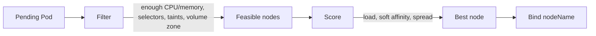
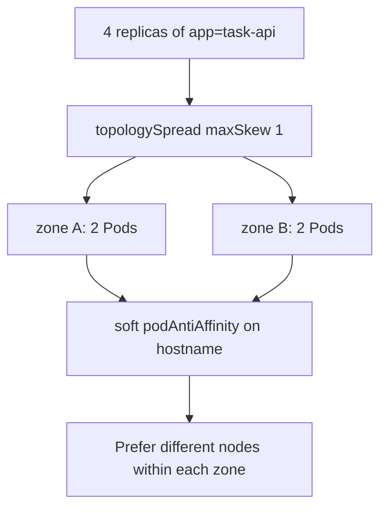
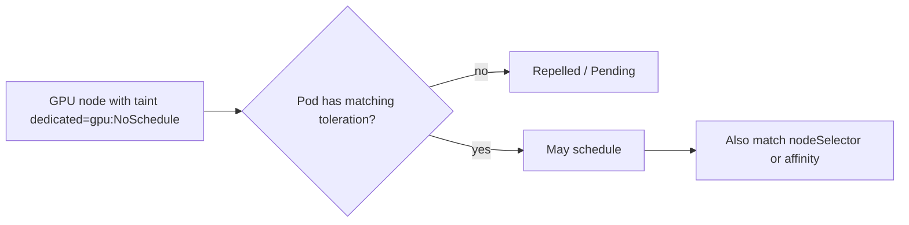
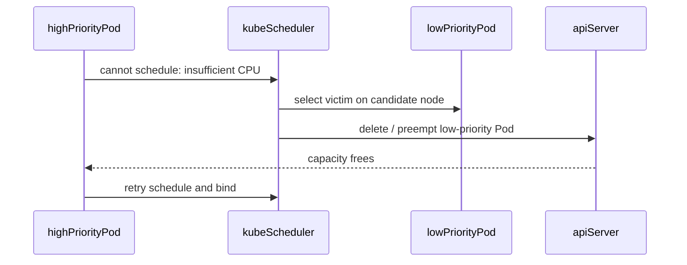
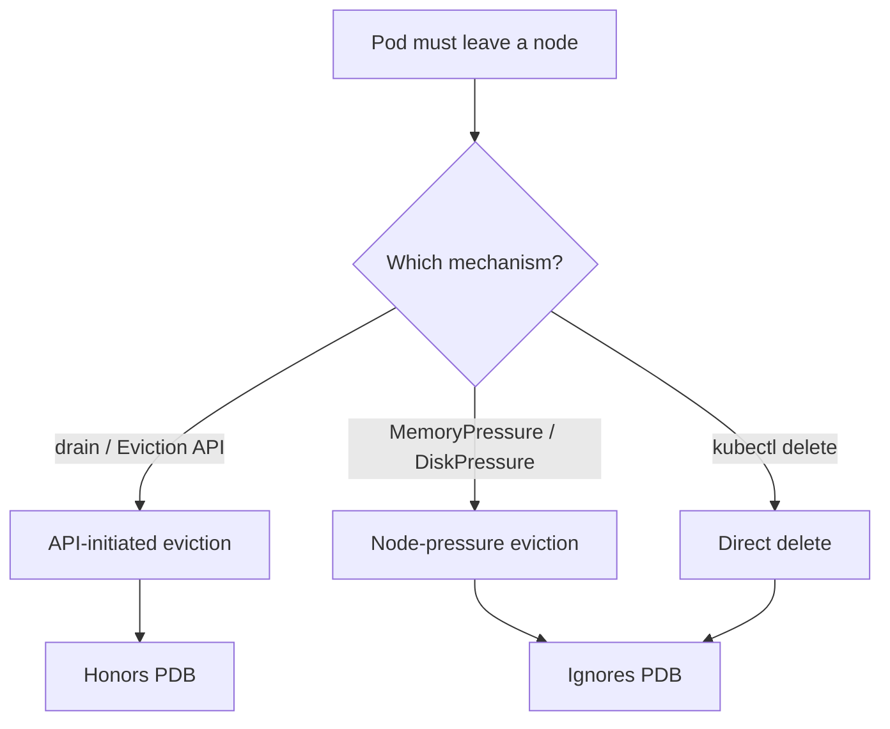

# Chapter 20 — Scheduling and Advanced Placement

> **Learning Objectives**
>
> By the end of this chapter, you will be able to:
>
> - Explain how the kube-scheduler filters, scores, and binds Pods to nodes
> - Use `nodeSelector`, node affinity, and Pod affinity/anti-affinity
> - Apply taints and tolerations to reserve or isolate nodes
> - Spread replicas with topology spread constraints
> - Configure PriorityClass and reason about preemption
> - Distinguish node-pressure eviction from API-initiated eviction
> - Diagnose Pending Pods caused by placement rules without over-constraining the cluster

---

## 20.1 The concert seating chart

A touring band’s road manager does not seat musicians randomly. Drummers need space near power. Backup singers should not all sit in the same collapsing row. VIPs get a roped-off section. Some seats are broken and marked “do not use.” When the venue is full, lower-priority guests may be asked to leave so headliners can perform.


*Figure 20.A: The scheduler assigns seats (nodes) using rules, not random placement.*

The **kube-scheduler** is that road manager for Pods. Every new Pod without a `nodeName` enters the scheduling queue. The scheduler **filters** nodes that cannot run the Pod, **scores** the remaining nodes, and binds the Pod to the winner. **Priority** and **preemption** decide who yields when capacity is tight. Your job is to express constraints clearly—without over-constraining so nothing can schedule.

---

## 20.2 How scheduling works

### In plain terms

Scheduling is a matchmaking problem: find a node that *can* run this Pod, then pick the *best* among those that can. If nobody qualifies, the Pod stays **Pending** and Events explain why.

The scheduler exists so humans do not pin every Pod by hand and so capacity, taints, and volume topology are considered consistently. You might think Pending means “the cluster is broken”—usually it means your constraints eliminated every node. Read Events before adding more affinity.

> ⚠️ **Common Pitfall:** You might think omitting resource requests “lets the Pod start faster.” Without requests the filter cannot place fairly, and under pressure your Pod becomes an easy eviction victim.

### Under the hood

1. **Filtering (predicates):** Enough CPU/memory? Match selectors? Tolerate taints? Volume zone OK? Priority preemption candidates?
2. **Scoring (priorities):** Prefer less loaded nodes, honor soft affinity, spread where asked
3. **Binding:** Write `nodeName` via the API; kubelet on that node starts the Pod

```bash
$ kubectl get pods -o wide
NAME                        READY   STATUS    NODE       IP
task-api-6d7f8c9b5d-xk2m9   1/1     Running   worker-2   10.244.2.17
```

```bash
$ kubectl describe pod task-api-6d7f8c9b5d-aaaaa
Events:
  Type     Reason            Message
  ----     ------            -------
  Warning  FailedScheduling  0/3 nodes are available: 1 node(s) had untolerated taint..., 2 Insufficient cpu.
```



*Figure 20.1: The scheduler filters impossible nodes, scores the rest, then binds the Pod to the winner.*

*Figure 20.1: The scheduler filters impossible nodes, scores the rest, then binds the Pod to the winner.*

What breaks if every node fails a hard filter: the Pod stays Pending indefinitely—capacity autoscaling will not help if affinity/taints are the real blockers.

### In production

**Ownership:** Platform owns scheduler health and node capacity headroom; app teams own requests and placement constraints. Incident evidence: `kubectl describe pod` Events, node allocatable vs requests, taints list.

**Failure mode:** Over-constraint → Pending during incidents when you need scale-out most. Detect with Pending age alerts. Mitigate by preferring soft rules and keeping spare capacity for drains/preemption.

| Do | Don't |
|----|-------|
| Always set resource requests | Add more required affinity before reading Events |
| Keep spare capacity for drains | Pin every Pod with required rules |
| Treat Pending Events as source of truth | Assume Pending means “buy more nodes” only |

**Before you leave this section**

- **Understand:** Filter → score → bind; Pending Events name the failing predicates.
- **Try:** Describe a Pending Pod and map each message to a constraint.
- **Watch in prod:** Pending spikes after node pool or taint changes.

---

## 20.3 Labels, nodeSelector, and node affinity

### In plain terms

Nodes wear nametags (`disktype=ssd`, `topology.kubernetes.io/zone=us-east-1a`). Pods say which nametags they require or prefer. `nodeSelector` is the simple hard pin; **node affinity** adds operators and soft preferences.

Labels are a shared contract between platform (what exists on nodes) and apps (what they require). You might think a typo in a label key is “obvious”—it silently Pendings Pods. Soft preferences keep partial outages schedulable; hard pins do not.

> ⚠️ **Common Pitfall:** You might think changing affinity moves running Pods. Scheduling rules apply at schedule time; roll the Deployment to reshuffle.

### Under the hood

```bash
$ kubectl get nodes --show-labels
$ kubectl label nodes worker-3 disktype=ssd --overwrite
```

**nodeSelector:**

```yaml
apiVersion: apps/v1
kind: Deployment
metadata:
  name: task-api
spec:
  replicas: 2
  selector:
    matchLabels:
      app: task-api
  template:
    metadata:
      labels:
        app: task-api
    spec:
      nodeSelector:
        disktype: ssd
      containers:
        - name: api
          image: ghcr.io/mastering-k8s/task-api:1.1
          ports:
            - containerPort: 8000
```

**Node affinity** (hard + soft):

```yaml
affinity:
  nodeAffinity:
    requiredDuringSchedulingIgnoredDuringExecution:
      nodeSelectorTerms:
        - matchExpressions:
            - key: topology.kubernetes.io/zone
              operator: In
              values:
                - us-east-1a
                - us-east-1b
    preferredDuringSchedulingIgnoredDuringExecution:
      - weight: 80
        preference:
          matchExpressions:
            - key: disktype
              operator: In
              values:
                - ssd
```

| Operator | Meaning |
|----------|---------|
| `In` / `NotIn` | Label value in / not in list |
| `Exists` / `DoesNotExist` | Label key present / absent |
| `Gt` / `Lt` | Numeric comparison (specialized cases) |

“IgnoredDuringExecution” means if labels change later, the scheduler does not automatically evict running Pods.

> 💡 **Tip:** Start with `nodeSelector` for simple “must run on X” rules. Graduate to affinity when you need operators or soft preferences.

> 💡 **Tip:** Start with `nodeSelector` for simple “must run on X” rules. Graduate to affinity when you need operators or soft preferences.

What breaks if a node pool loses the `disktype=ssd` label during a rebuild: every hard-pinned Pod goes Pending until labels are restored.

### In production

**Ownership:** Platform owns label taxonomy on node pools; app teams consume documented keys only. Detect with Pending failed predicates naming label mismatches. Mitigate with soft preferences for non-critical hardware affinity.

| Do | Don't |
|----|-------|
| Standardize label taxonomies | Invent one-off label keys per team |
| Prefer soft affinity when possible | Typo labels without CI validation |
| Roll Deployments after affinity changes | Expect running Pods to move themselves |

**Before you leave this section**

- **Understand:** `nodeSelector` is hard; affinity adds operators and soft preferences.
- **Try:** Label a node and pin a Deployment with `nodeSelector`.
- **Watch in prod:** Node pool rebuilds that drop required labels.

---

## 20.4 Pod affinity, anti-affinity, and topology spread

### In plain terms

Sometimes placement depends on **other Pods**: keep a cache near the API, or keep replicas off the same host and spread across zones. **Topology spread** is the modern, expressive way to keep counts even across failure domains.

Blast radius shrinks when replicas do not share a host or zone—but hard anti-affinity with more replicas than domains guarantees Pending. You might think hard rules are “more HA”; soft spread plus PDBs usually survive partial failures better.

> ⚠️ **Common Pitfall:** Hard Pod anti-affinity with `topologyKey: kubernetes.io/hostname` and more replicas than nodes guarantees Pending Pods.

### Under the hood

Hard Pod anti-affinity (no two `app=task-api` Pods on the same node):

```yaml
affinity:
  podAntiAffinity:
    requiredDuringSchedulingIgnoredDuringExecution:
      - labelSelector:
          matchLabels:
            app: task-api
        topologyKey: kubernetes.io/hostname
```

With 3 replicas and only 2 nodes, one Pod stays Pending. Soft anti-affinity is usually safer:

```yaml
affinity:
  podAntiAffinity:
    preferredDuringSchedulingIgnoredDuringExecution:
      - weight: 100
        podAffinityTerm:
          labelSelector:
            matchLabels:
              app: task-api
          topologyKey: kubernetes.io/hostname
```

**Topology spread:**

```yaml
topologySpreadConstraints:
  - maxSkew: 1
    topologyKey: topology.kubernetes.io/zone
    whenUnsatisfiable: DoNotSchedule
    labelSelector:
      matchLabels:
        app: task-api
```

| Field | Role |
|-------|------|
| `maxSkew` | Allowed difference in Pod counts across topologies |
| `topologyKey` | Domain label (zone, hostname, …) |
| `whenUnsatisfiable` | `DoNotSchedule` (hard) or `ScheduleAnyway` (soft) |
| `labelSelector` | Which Pods count toward the spread |

You can stack spreads (zone *and* hostname) for stronger resilience.



*Figure 20.2: Topology spread keeps counts even across zones; soft anti-affinity prefers different hosts without stranding Pending Pods.*

*Figure 20.2: Topology spread keeps counts even across zones; soft anti-affinity prefers different hosts without stranding Pending Pods.*

What breaks if `whenUnsatisfiable: DoNotSchedule` meets a single-zone outage: new Pods Pending even though other zones have capacity—prefer `ScheduleAnyway` for many web apps.

### In production

**Ownership:** App teams own spread/anti-affinity for their SLOs; platform owns zone labels and node counts per failure domain. Detect with skew metrics and Pending during zone loss. Mitigate with soft spread + PDB ([Chapter 24](24-production-best-practices.md)).

| Do | Don't |
|----|-------|
| Prefer topology spread + soft anti-affinity | Hard anti-affinity for every web app |
| Combine with PDBs for drains | Set replicas higher than hard topology domains |
| Stack zone *and* hostname spreads carefully | Ignore zone label correctness |

**Before you leave this section**

- **Understand:** Soft anti-affinity and topology spread reduce blast radius without stranding Pending Pods.
- **Try:** Apply `maxSkew: 1` and observe distribution across labeled domains.
- **Watch in prod:** Hard rules that prevent scale-out during incidents.

---

## 20.5 Taints and tolerations

### In plain terms

**Taints** mark nodes so ordinary Pods are *repelled* unless they **tolerate** the taint. Control-plane nodes typically wear `node-role.kubernetes.io/control-plane:NoSchedule`. GPU pools often use a dedicated taint so only prepared workloads land there.

Taints protect reserved capacity; tolerations are the explicit opt-in. You might think sprinkling tolerations on all Deployments is harmless—that defeats reservation and lets batch jobs steal GPU nodes.

> ⚠️ **Common Pitfall:** Applying `NoExecute` to a busy node without a drain plan can evict production Pods immediately.

### Under the hood

| Effect | Behavior |
|--------|----------|
| `NoSchedule` | New Pods without matching toleration will not schedule here |
| `PreferNoSchedule` | Soft avoidance |
| `NoExecute` | New Pods blocked; existing non-tolerating Pods may be evicted |

```bash
$ kubectl taint nodes worker-gpu dedicated=gpu:NoSchedule
$ kubectl taint nodes worker-gpu dedicated=gpu:NoSchedule-
```

```yaml
tolerations:
  - key: dedicated
    operator: Equal
    value: gpu
    effect: NoSchedule
nodeSelector:
  accelerator: nvidia
```



*Figure 20.3: Taints repel ordinary Pods; matching tolerations (plus labels) let prepared workloads onto reserved nodes.*

> 📘 **Deep Dive (optional):** Combine taint + label for defense in depth. Taints reserve capacity without relying on every team remembering a nodeSelector.

> 📘 **Deep Dive (optional):** Combine taint + label for defense in depth. Taints reserve capacity without relying on every team remembering a nodeSelector.

What breaks if you remove a GPU taint “temporarily”: general workloads schedule onto expensive nodes and starve GPU jobs.

### In production

**Ownership:** Platform owns custom taints on node pools; app teams add matching tolerations only for intended pools. Detect with unexpected Pods on reserved nodes and Pending GPU jobs. Mitigate with admission policies that block broad tolerations.

| Do | Don't |
|----|-------|
| Document every custom taint | Sprinkle tolerations on all workloads |
| Pair taint + label | Apply `NoExecute` casually on busy nodes |
| Review tolerations in PR | Remove taints without a capacity plan |

**Before you leave this section**

- **Understand:** Taints repel; tolerations opt in; `NoExecute` can evict.
- **Try:** Taint a lab node, show Pending, add toleration, watch schedule.
- **Watch in prod:** Untolerated taints after node upgrades; overly broad tolerations.

---

## 20.6 PriorityClass and preemption

### In plain terms

When the venue is full, who gets a seat? A **PriorityClass** assigns an integer priority to Pods. Higher-priority Pods can **preempt** (evict) lower-priority Pods so they can schedule—like asking standby guests to leave for the headliner. Without priorities, everyone competes equally and critical control-plane-adjacent workloads can starve.

Preemption is controlled blast radius: you choose who yields under contention. You might think making every Deployment “high” is safe—then nothing yields and critical work still Pending.

> ⚠️ **Common Pitfall:** Reusing `system-cluster-critical` for ordinary apps. Those classes protect essential components—do not dilute them.

### Under the hood

```yaml
apiVersion: scheduling.k8s.io/v1
kind: PriorityClass
metadata:
  name: task-api-high
value: 100000
globalDefault: false
description: "High priority for user-facing Task API"
---
apiVersion: scheduling.k8s.io/v1
kind: PriorityClass
metadata:
  name: batch-low
value: 1000
globalDefault: false
description: "Best-effort batch jobs"
```

Reference from a Pod template:

```yaml
apiVersion: apps/v1
kind: Deployment
metadata:
  name: task-api
spec:
  replicas: 3
  selector:
    matchLabels:
      app: task-api
  template:
    metadata:
      labels:
        app: task-api
    spec:
      priorityClassName: task-api-high
      containers:
        - name: api
          image: ghcr.io/mastering-k8s/task-api:1.1
          resources:
            requests:
              cpu: "250m"
              memory: "256Mi"
```

System PriorityClasses such as `system-cluster-critical` and `system-node-critical` already protect essential components—do not reuse them for ordinary apps.

Preemption flow (simplified):

1. High-priority Pod fails to schedule due to insufficient resources
2. Scheduler considers lower-priority victims on candidate nodes
3. Victims are deleted (gracefully when possible); the high-priority Pod retries scheduling



*Figure 20.4: Preemption removes lower-priority Pods so a higher-priority Pod can bind when the cluster is full.*

```bash
$ kubectl get priorityclass
NAME                      VALUE        GLOBAL-DEFAULT   AGE
system-cluster-critical   2000000000   false            30d
system-node-critical      2000001000   false            30d
task-api-high             100000       false            5m
batch-low                 1000         false            5m
```

```bash
$ kubectl get priorityclass
NAME                      VALUE        GLOBAL-DEFAULT   AGE
system-cluster-critical   2000000000   false            30d
system-node-critical      2000001000   false            30d
task-api-high             100000       false            5m
batch-low                 1000         false            5m
```

What breaks if victims have PDBs that block eviction while you use mechanisms that honor them: preemption paths differ from drain—know which API you are using during an incident.

### In production

**Ownership:** Platform owns the priority ladder catalog; app teams request a class from that ladder, not invent values. Detect starvation with Pending high-priority Pods while low-priority Jobs consume the cluster. Mitigate with a small ladder and staging contention tests.

| Do | Don't |
|----|-------|
| Keep a small documented ladder | Make every workload “high” |
| Test preemption in staging | Reuse system-critical classes for apps |
| Expect interaction with graceful shutdown | Rely on preemption instead of capacity planning |

**Before you leave this section**

- **Understand:** Higher priority can preempt lower; priorities only help when they differ.
- **Try:** Fill a lab node with low-priority Pods, schedule a high-priority Pod, observe preemption.
- **Watch in prod:** Priority inflation and batch Jobs starving user-facing apps.

---

## 20.7 Node-pressure eviction and API-initiated eviction

### In plain terms

Two different “please leave” mechanisms exist. **Node-pressure eviction** is the kubelet acting as a firefighter when the node is out of memory or disk—it may kill Pods based on QoS and consumption to save the node. **API-initiated eviction** is a polite request through the Eviction API (what `kubectl drain` and many autoscalers use)—it respects PodDisruptionBudgets. Confusing them leads to false confidence in PDBs during OOM storms.

Change safety for maintenance depends on voluntary eviction + PDB. Node pressure is a capacity incident, not a maintenance workflow. You might think a PDB means “this Pod never dies”—PDBs do not restrain kubelet pressure eviction or `kubectl delete pod`.

> ⚠️ **Common Pitfall:** Believing a PDB will save you from node MemoryPressure. PDBs do not restrain kubelet pressure eviction.

### Under the hood

#### Node-pressure (kubelet) eviction

The kubelet monitors signals such as `memory.available`, `nodefs.available`, and `imagefs.available`. Soft thresholds can trigger eviction after a grace period; hard thresholds evict immediately. Pods are ranked roughly by QoS (**Guaranteed** > **Burstable** > **BestEffort**) and how far they exceed requests.

```bash
$ kubectl describe node worker-2
Conditions:
  Type                 Status  Reason
  ----                 ------  ------
  MemoryPressure       False   KubeletHasSufficientMemory
  DiskPressure         False   KubeletHasNoDiskPressure
  PIDPressure          False   KubeletHasSufficientPID
  Ready                True    KubeletReady
```

Configure thresholds via kubelet config (distro-specific); understand your platform defaults before an incident.

#### API-initiated eviction

```bash
$ kubectl drain worker-2 --ignore-daemonsets --delete-emptydir-data
```

Drain creates Eviction objects for each Pod. The API server honors **PodDisruptionBudgets** for voluntary disruptions. A blocked PDB can stall the drain—by design.

You can also POST an Eviction subresource:

```bash
$ kubectl create -f - <<'EOF'
apiVersion: policy/v1
kind: Eviction
metadata:
  name: task-api-6d7f8c9b5d-xk2m9
  namespace: tasks
EOF
```

| Mechanism | Who triggers | Honors PDB? | Typical cause |
|-----------|--------------|-------------|----------------|
| Node-pressure eviction | kubelet | No | Memory/disk/PID pressure |
| API eviction | drain, autoscaler, operators, `kubectl` | Yes (voluntary) | Maintenance, scale-down |
| `kubectl delete pod` | User/controller | No | Direct deletion |



*Figure 20.5: PDBs restrain voluntary API evictions; kubelet pressure eviction and direct deletes do not.*

*Figure 20.5: PDBs restrain voluntary API evictions; kubelet pressure eviction and direct deletes do not.*

What breaks if `minAvailable` is too high during drain: the drain stalls forever—by design—until you fix capacity or carefully adjust the PDB under change control.

### In production

**Ownership:** Platform owns drain procedures and node-pressure alerts; app teams own PDB design for their Deployments. Detect pressure via node conditions; detect blocked drains via drain job timeouts and PDB status.

| Do | Don't |
|----|-------|
| Use drain + PDB for planned maintenance | Expect PDBs to stop MemoryPressure kills |
| Alert on MemoryPressure / DiskPressure | Force OOM to “test” PDBs on shared hardware |
| Size requests so QoS is intentional | Confuse `kubectl delete` with Eviction API |

> 🏭 **Production floor:** **Drain + PDB** is the voluntary disruption SOP. Before drain: confirm PDB (`kubectl get pdb -n <ns>`), replica count, and that replacement capacity exists in other zones. Run `kubectl drain <node> --ignore-daemonsets --delete-emptydir-data` from a change window; if drain blocks, paste PDB name, `ALLOWED DISRUPTIONS`, and describe output into the ticket—do not `kubectl delete pod` to “hurry,” that bypasses the budget. After drain: uncordon only when ready to accept work. Treat MemoryPressure eviction as a **capacity incident** (detect→mitigate: free disk/memory, cordon if needed, page owning team)—not as a substitute for drain.

**Before you leave this section**

- **Understand:** API eviction honors PDB; kubelet pressure and delete do not.
- **Try:** Drain a lab node with a PDB in place and observe blocking vs progress.
- **Watch in prod:** Blocked drains; pressure evictions misattributed to “bad PDB.”

---

## 20.8 Putting tools together

| Goal | Tool |
|------|------|
| Must run on SSD nodes | `nodeSelector` or required node affinity |
| Prefer SSD but allow others | Preferred node affinity |
| Keep replicas off the same host | Soft Pod anti-affinity or topology spread |
| Even spread across zones | Topology spread constraints |
| Reserve GPU nodes | Taint + toleration (+ label) |
| Protect user-facing vs batch | PriorityClass + preemption |
| Planned node maintenance | API eviction / drain + PDB |
| Node out of memory | Node-pressure eviction (prevent with capacity) |

Example Task API placement:

```yaml
apiVersion: apps/v1
kind: Deployment
metadata:
  name: task-api
spec:
  replicas: 4
  selector:
    matchLabels:
      app: task-api
  template:
    metadata:
      labels:
        app: task-api
    spec:
      priorityClassName: task-api-high
      topologySpreadConstraints:
        - maxSkew: 1
          topologyKey: topology.kubernetes.io/zone
          whenUnsatisfiable: ScheduleAnyway
          labelSelector:
            matchLabels:
              app: task-api
      affinity:
        podAntiAffinity:
          preferredDuringSchedulingIgnoredDuringExecution:
            - weight: 100
              podAffinityTerm:
                labelSelector:
                  matchLabels:
                    app: task-api
                topologyKey: kubernetes.io/hostname
      containers:
        - name: api
          image: ghcr.io/mastering-k8s/task-api:1.1
          ports:
            - containerPort: 8000
          resources:
            requests:
              cpu: "100m"
              memory: "128Mi"
            limits:
              cpu: "500m"
              memory: "256Mi"
```

---

## 20.9 Diagnosing Pending Pods

```bash
$ kubectl get pods --field-selector=status.phase=Pending
$ kubectl describe pod <pending-pod>
$ kubectl get nodes -o custom-columns=NAME:.metadata.name,TAINTS:.spec.taints
```

Ask:

- Are resource requests larger than any node’s allocatable?
- Did required affinity eliminate all nodes?
- Is there an untolerated taint?
- Is a PVC stuck Pending (volume binding)?
- Are hard anti-affinity + replica count impossible?
- Is a higher-priority Pod waiting on preemption that never finds victims?

---

## 20.10 Common pitfalls

> ⚠️ **Common Pitfall:** Overusing *required* rules. Soft preferences keep the cluster schedulable during partial outages.

> ⚠️ **Common Pitfall:** Assuming affinity changes move running Pods—schedule-time only; roll to reshuffle.

> ⚠️ **Common Pitfall:** Giving every Deployment a high PriorityClass, which nullifies preemption benefits.

> ⚠️ **Common Pitfall:** Ignoring resource requests so the scheduler cannot protect Guaranteed workloads under pressure.

---

## 20.11 Hands-on exercises

1. **Label and select.** Label one node `workshop=true`. Deploy with matching `nodeSelector`. Confirm placement.
2. **Taint a node.** Apply `NoSchedule`, show Pending, add a toleration, watch it schedule.
3. **PriorityClass.** Create low and high PriorityClasses. Fill a node with low-priority Pods, then schedule a high-priority Pod and observe preemption (lab cluster only).
4. **Topology spread.** Apply `maxSkew: 1` across zones or simulated labels; describe distribution.
5. **Eviction contrast.** Drain a node with a PDB in place (API eviction). Separately, read kubelet eviction docs for your distro and identify MemoryPressure signals—do not force OOM on shared hardware.

---

## 20.12 Check Your Understanding

**Q1.** What are the two main phases before the scheduler binds a Pod?

<details>
<summary>Show answer</summary>

**Filtering** (eliminate impossible nodes) and **scoring** (rank remaining nodes).

</details>

**Q2.** How does preferred node affinity differ from required node affinity?

<details>
<summary>Show answer</summary>

Preferred is a soft preference (Pod can still schedule elsewhere); required is a hard filter (Pod Pending if unmet).

</details>

**Q3.** What does a `NoExecute` taint do that `NoSchedule` does not?

<details>
<summary>Show answer</summary>

`NoExecute` can **evict** already-running Pods that do not tolerate the taint; `NoSchedule` only affects new scheduling.

</details>

**Q4.** What is PriorityClass used for, and what is preemption?

<details>
<summary>Show answer</summary>

**PriorityClass** assigns a numeric priority to Pods. **Preemption** lets the scheduler remove lower-priority Pods so a higher-priority Pod can schedule when resources are scarce.

</details>

**Q5.** Do PodDisruptionBudgets restrain kubelet node-pressure eviction?

<details>
<summary>Show answer</summary>

**No.** PDBs apply to **API-initiated / voluntary** evictions (such as drain). Node-pressure eviction is local to the kubelet and can still kill Pods under MemoryPressure or DiskPressure.

</details>

---

## 20.13 Key takeaways

- The scheduler filters, scores, then binds; Pending Events are your primary debugging tool.
- Use `nodeSelector` for simple pins; affinity and topology spread for richer hard/soft placement.
- Taints and tolerations reserve or isolate nodes without trusting every workload author to opt out.
- PriorityClass and preemption protect critical workloads when the cluster is full—keep the priority ladder small and intentional.
- Node-pressure eviction and API eviction are different tools; PDBs help with the latter, not the former.

---

## 20.14 Official documentation map

| Topic | Official page |
|-------|---------------|
| Scheduling | [Scheduling Framework](https://kubernetes.io/docs/concepts/scheduling-eviction/scheduling-framework/) |
| Assigning Pods to Nodes | [Assigning Pods to Nodes](https://kubernetes.io/docs/concepts/scheduling-eviction/assign-pod-node/) |
| Taints and Tolerations | [Taints and Tolerations](https://kubernetes.io/docs/concepts/scheduling-eviction/taint-and-toleration/) |
| Pod Topology Spread | [Pod Topology Spread Constraints](https://kubernetes.io/docs/concepts/scheduling-eviction/topology-spread-constraints/) |
| Pod Priority and Preemption | [Pod Priority and Preemption](https://kubernetes.io/docs/concepts/scheduling-eviction/pod-priority-preemption/) |
| Node-pressure Eviction | [Node-pressure Eviction](https://kubernetes.io/docs/concepts/scheduling-eviction/node-pressure-eviction/) |
| API-initiated Eviction | [API-initiated Eviction](https://kubernetes.io/docs/concepts/scheduling-eviction/api-eviction/) |

**Previous:** [Chapter 19 — Networking — CNI and Policies](19-k8s-networking-cni-and-policies.md) | **Next:** [Chapter 21 — RBAC and Security](21-rbac-and-security.md)
