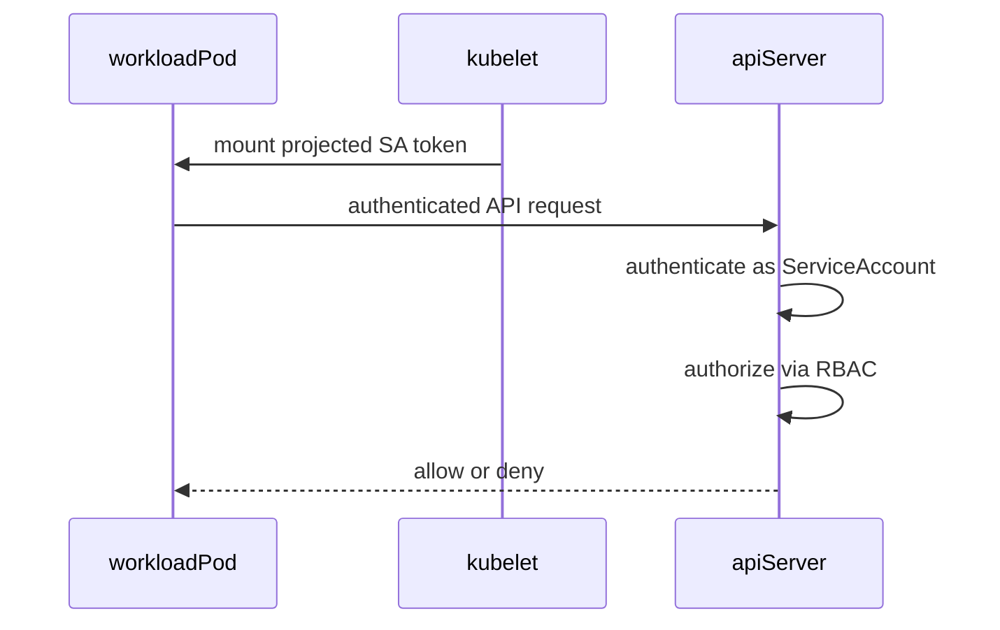
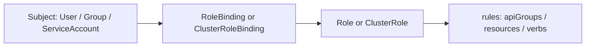
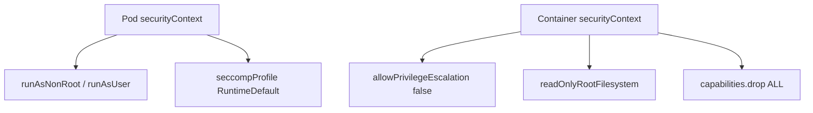
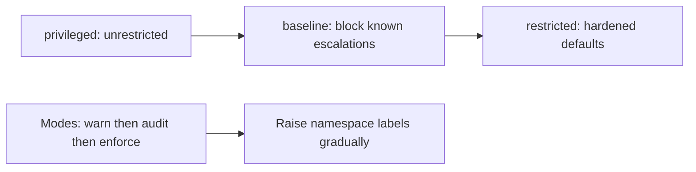
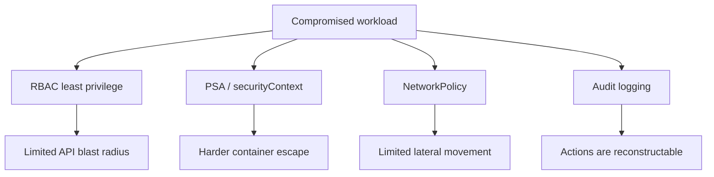

# Chapter 21 — RBAC and Security

> **Learning Objectives**
>
> By the end of this chapter, you will be able to:
>
> - Explain ServiceAccounts and how Pods authenticate to the API
> - Create Roles, ClusterRoles, and bindings with least privilege
> - Apply security contexts to Pods and containers
> - Configure Pod Security Admission (PSS) at namespace level
> - Attach image pull secrets for private registries
> - Enable and reason about cluster audit logging basics
> - Combine RBAC, admission, NetworkPolicy, and auditing into layered defense

---

## 21.1 Keys, badges, and building codes

A modern office building does not hand every contractor a master key. Receptionists get lobby access. Electricians get badge access to utility floors. Fire codes dictate where walls and sprinklers must exist—rules that apply even if someone has a badge. Security cameras record who walked where, so incidents are reconstructable.


*Figure 21.A: Who you are (subject) plus your badge (RoleBinding) decides which doors open.*

Kubernetes security works the same way:

- **RBAC** is the badge system (who may call which API verbs on which resources)
- **ServiceAccounts** are machine identities for Pods
- **Security contexts** and **Pod Security Admission** are building codes for how processes run
- **Audit logging** is the camera system for the API server
- **NetworkPolicies** ([Chapter 19](19-k8s-networking-cni-and-policies.md)) and **Secrets** ([Chapter 17](17-configuration-and-secrets.md)) close remaining gaps

Default clusters are often too open for production. This chapter tightens the bolts without locking you out of learning.

---

## 21.2 ServiceAccounts: identity for workloads

### In plain terms

Humans authenticate with kubeconfigs and cloud IAM. Pods need their own badges: **ServiceAccounts**. Every namespace has a `default` ServiceAccount; production apps should use a dedicated one with minimal rights.

Identity without least privilege is a stolen-token incident waiting to happen. You might think “my app never calls the API” means the SA does not matter—sidecars, operators, and debug tooling still inherit that identity.

> ⚠️ **Common Pitfall:** Assuming “no API calls in my app” means the ServiceAccount does not matter. Sidecars, operators, and opportunistic tooling still inherit that identity.

### Under the hood

```yaml
apiVersion: v1
kind: ServiceAccount
metadata:
  name: task-api
  namespace: tasks
```

```yaml
spec:
  serviceAccountName: task-api
  containers:
    - name: api
      image: ghcr.io/mastering-k8s/task-api:1.1
```

The kubelet mounts a projected, audience-bound, time-limited token so the Pod can call the API server—**if** RBAC allows it.

```bash
$ kubectl apply -f serviceaccount.yaml
serviceaccount/task-api created

$ kubectl get sa -n tasks
NAME       SECRETS   AGE
default    0         2d
task-api   0         5s
```

> 💡 **Tip:** Create a dedicated ServiceAccount per app (or per permission set). Never grant broad rights to `default`.



*Figure 21.1: The kubelet mounts a projected ServiceAccount token; the API server authenticates the Pod, then RBAC decides authorization.*

What breaks if you leave automount enabled on a Pod that never needs the API: a container escape yields a ready-made API credential.

### In production

**Ownership:** App teams own per-workload ServiceAccounts; platform owns default SA hygiene and projected token defaults. Detect unused automounted tokens via admission checks. Mitigate with `automountServiceAccountToken: false` when unused.

| Do | Don't |
|----|-------|
| Dedicated SA per app / permission set | Grant rights to `default` |
| Disable automount when unused | Prefer long-lived Secret tokens |
| Review RoleBindings in CI | Share one privileged SA across apps |

**Before you leave this section**

- **Understand:** Pods authenticate as ServiceAccounts; default is not a production identity.
- **Try:** Create a dedicated SA and point a Deployment at it.
- **Watch in prod:** Automounted tokens on Pods that never call the API.

---

## 21.3 RBAC building blocks

### In plain terms

RBAC answers: *may this identity perform this verb on this resource in this scope?* Roles are permission menus; bindings hand those menus to subjects (Users, Groups, ServiceAccounts).

Least privilege is change safety for the control plane: every extra verb widens blast radius when a token leaks. You might think `cluster-admin` in CI is fine “until we harden”—tokens leak; the blast radius becomes the entire cluster.

> ⚠️ **Common Pitfall:** Binding `cluster-admin` to a CI ServiceAccount “just for now.” Tokens leak; blast radius becomes the entire cluster.

### Under the hood

| Object | Scope | Purpose |
|--------|-------|---------|
| **Role** | Namespace | Permissions inside one namespace |
| **ClusterRole** | Cluster | Cluster-wide resources or reusable permission sets |
| **RoleBinding** | Namespace | Grants a Role (or ClusterRole) to subjects in a namespace |
| **ClusterRoleBinding** | Cluster | Grants a ClusterRole cluster-wide |

Common verbs: `get`, `list`, `watch`, `create`, `update`, `patch`, `delete`, `deletecollection`.

```yaml
apiVersion: rbac.authorization.k8s.io/v1
kind: Role
metadata:
  name: pod-reader
  namespace: tasks
rules:
  - apiGroups: [""]
    resources: ["pods"]
    verbs: ["get", "list", "watch"]
---
apiVersion: rbac.authorization.k8s.io/v1
kind: RoleBinding
metadata:
  name: task-api-read-pods
  namespace: tasks
subjects:
  - kind: ServiceAccount
    name: task-api
    namespace: tasks
roleRef:
  apiGroup: rbac.authorization.k8s.io
  kind: Role
  name: pod-reader
```

```bash
$ kubectl apply -f role-pod-reader.yaml
$ kubectl auth can-i list pods -n tasks --as=system:serviceaccount:tasks:task-api
yes
$ kubectl auth can-i delete pods -n tasks --as=system:serviceaccount:tasks:task-api
no
```

Cluster-scoped example:

```yaml
apiVersion: rbac.authorization.k8s.io/v1
kind: ClusterRole
metadata:
  name: pv-reader
rules:
  - apiGroups: [""]
    resources: ["persistentvolumes"]
    verbs: ["get", "list"]
```



*Figure 21.2: Subjects receive permissions through bindings that reference Roles; Roles list the API groups, resources, and verbs allowed.*

*Figure 21.2: Subjects receive permissions through bindings that reference Roles; Roles list the API groups, resources, and verbs allowed.*

What breaks if `roleRef` name/kind typos: the binding exists but grants nothing—or worse, you “fix” it by attaching `cluster-admin`. Always verify with `kubectl auth can-i --as=...`.

### In production

**Ownership:** Platform owns cluster-admin break-glass and CI deployer roles; app teams own namespace Roles for their SAs. Separate human admin, CI deployer, and runtime SA identities. Detect privilege creep with periodic `auth can-i --list` and audit alerts on ClusterRoleBinding changes.

| Do | Don't |
|----|-------|
| Prefer Role + RoleBinding | Grant `*` verbs to app identities |
| Split CI / runtime / human admin | Clone `cluster-admin` onto apps |
| Verify with `auth can-i` | Trust binding YAML without testing as the SA |

> 🏭 **Production floor:** **RBAC least privilege** is a control-plane blast-radius rule. For any new SA: list required verbs/resources in the PR, bind the narrowest Role, prove with `kubectl auth can-i … --as=system:serviceaccount:<ns>:<sa>` for both *allowed* and *denied* cases, and paste that evidence into the change ticket. Forbid `cluster-admin` on CI and runtime SAs except a documented break-glass identity with MFA, short TTL, and audit alerts. Review bindings when people or pipelines change—stale bindings outlive the ticket that created them.

**Before you leave this section**

- **Understand:** Roles list verbs; bindings grant them; scope matters (Role vs ClusterRole).
- **Try:** Bind a read-only Role and prove deny on delete as that SA.
- **Watch in prod:** ClusterRoleBindings to powerful roles; CI tokens with admin rights.

---

## 21.4 Security contexts

### In plain terms

A **security context** constrains *how* the process runs inside the container: which user ID, whether it can gain privileges, whether the root filesystem is writable, which Linux capabilities remain. RBAC never sees this—NetworkPolicy never sees this—yet a root container with all capabilities is a gift to an attacker who escapes the app.

Hardening shrinks what a compromised process can do on the node. You might think “we’re private VPC so root is fine”—identity theft and supply-chain bugs do not care about your VPC boundary.

> ⚠️ **Common Pitfall:** Dropping all capabilities but leaving `allowPrivilegeEscalation: true` or a writable root FS—defense in depth means stacking controls.

### Under the hood

```yaml
apiVersion: apps/v1
kind: Deployment
metadata:
  name: task-api
  namespace: tasks
spec:
  replicas: 2
  selector:
    matchLabels:
      app: task-api
  template:
    metadata:
      labels:
        app: task-api
    spec:
      serviceAccountName: task-api
      securityContext:
        runAsNonRoot: true
        runAsUser: 1000
        runAsGroup: 1000
        fsGroup: 1000
        seccompProfile:
          type: RuntimeDefault
      containers:
        - name: api
          image: ghcr.io/mastering-k8s/task-api:1.1
          ports:
            - containerPort: 8000
          securityContext:
            allowPrivilegeEscalation: false
            readOnlyRootFilesystem: true
            capabilities:
              drop: ["ALL"]
          volumeMounts:
            - name: tmp
              mountPath: /tmp
          resources:
            requests:
              cpu: "100m"
              memory: "128Mi"
            limits:
              cpu: "500m"
              memory: "256Mi"
      volumes:
        - name: tmp
          emptyDir: {}
```

| Field | Intent |
|-------|--------|
| `runAsNonRoot` / `runAsUser` | Do not run as UID 0 |
| `allowPrivilegeEscalation: false` | Block privilege escalation |
| `readOnlyRootFilesystem: true` | Force writable paths onto volumes |
| `capabilities.drop: ["ALL"]` | Remove Linux capabilities; add back only if required |
| `seccompProfile: RuntimeDefault` | Apply default syscall filter |



*Figure 21.3: Pod- and container-level security contexts constrain identity, privileges, filesystem writability, and capabilities.*

> 💡 **Tip:** Images must be built to support non-root (file ownership, listening on non-privileged ports). The Task API should listen on 8000 as a non-root user.

> 💡 **Tip:** Images must be built to support non-root (file ownership, listening on non-privileged ports). The Task API should listen on 8000 as a non-root user.

What breaks if the image expects to write to `/var` but you set `readOnlyRootFilesystem: true` without an emptyDir: CrashLoop with permission errors—fix the image and mounts together.

### In production

**Ownership:** App teams own workload securityContext; platform owns chart defaults and exemption process for privileged DaemonSets. Detect with PSA violations and admission reports. Mitigate by making hardened context the default and documenting each exemption.

| Do | Don't |
|----|-------|
| Non-root, drop ALL caps, read-only root | Run as UID 0 “for convenience” |
| emptyDir for `/tmp` and caches | Exempt apps without a ticket |
| Chart/Helm defaults hardened (Ch 23) | Copy privileged specs from DaemonSets |

**Before you leave this section**

- **Understand:** Security contexts harden process privileges independent of RBAC.
- **Try:** Deploy with non-root, no privilege escalation, drop ALL caps.
- **Watch in prod:** Privileged exemptions that never expire.

---

## 21.5 Pod Security Admission (PSA)

### In plain terms

**Pod Security Admission** enforces **Pod Security Standards** at the namespace level—like a building inspector who rejects plans that violate fire code before construction starts. Labels on the namespace choose the standard and mode.

PSA turns securityContext folklore into admission policy. You might think flipping `enforce=restricted` cluster-wide overnight is decisive leadership—it breaks hostPath DaemonSets and emergency tooling. Roll warn → audit → enforce.

> ⚠️ **Common Pitfall:** Enforcing `restricted` suddenly on system namespaces that need hostPath. Exempt thoughtfully; do not disable PSA everywhere.

### Under the hood

| Standard | Strictness | Summary |
|----------|------------|---------|
| **privileged** | Least | Unrestricted (legacy, admin-only workloads) |
| **baseline** | Medium | Blocks known privilege escalations; reasonable default |
| **restricted** | Most | Hardened: non-root, drop caps, restrict volumes, and more |

Modes: `enforce` (reject), `audit` (allow + audit), `warn` (allow + client warning).

```bash
$ kubectl label namespace tasks \
    pod-security.kubernetes.io/enforce=baseline \
    pod-security.kubernetes.io/enforce-version=latest \
    pod-security.kubernetes.io/warn=restricted \
    pod-security.kubernetes.io/warn-version=latest \
    --overwrite
```

Roll out carefully: `warn`/`audit` first, fix workloads, then raise `enforce`.



*Figure 21.4: Pod Security Standards tighten from privileged to restricted; roll out with warn/audit before enforce.*

> 📘 **Deep Dive (optional):** PSA replaced PodSecurityPolicy (removed since Kubernetes 1.25). On 1.36, PSA is the built-in path; Kyverno or OPA Gatekeeper add richer custom rules on top.

> 📘 **Deep Dive (optional):** PSA replaced PodSecurityPolicy (removed since Kubernetes 1.25). On 1.36, PSA is the built-in path; Kyverno or OPA Gatekeeper add richer custom rules on top.

What breaks if you pin `enforce-version=latest` through a Kubernetes upgrade: newly restricted fields reject Pods that passed last week—pin versions in GitOps.

### In production

**Ownership:** Platform owns PSA label baselines per namespace class; app teams remediate workloads before enforce raises. Detect with warn/audit events before enforce. Mitigate with staged rollout and version-pinned labels.

| Do | Don't |
|----|-------|
| Aim for baseline enforce; drive to restricted | Enforce restricted cluster-wide overnight |
| warn/audit first | Blindly enforce on kube-system |
| Version-pin PSA labels in GitOps | Rely on `latest` through upgrades |

**Before you leave this section**

- **Understand:** privileged → baseline → restricted; modes warn/audit/enforce.
- **Try:** Label a scratch namespace baseline enforce; attempt a privileged Pod.
- **Watch in prod:** Upgrade-driven PSA surprises; permanent privileged namespaces without review.

---

## 21.6 Image pull secrets

### In plain terms

Private registries need credentials. Create a `kubernetes.io/dockerconfigjson` Secret and attach it to the Pod or ServiceAccount—never paste registry passwords into Deployment env vars.

Pull credentials are supply-chain doors: too broad and every namespace can pull sensitive images; too fragile and rollouts fail with ImagePullBackOff. You might think env-var registry passwords are “simpler than Secrets”—they appear in process listings and manifests.

> ⚠️ **Common Pitfall:** Storing registry passwords in ConfigMaps or plaintext CI logs. Use pull secrets or cloud workload identity.

### Under the hood

```bash
$ kubectl create secret docker-registry regcred \
    --docker-server=ghcr.io \
    --docker-username=YOUR_USER \
    --docker-password=YOUR_TOKEN \
    --docker-email=you@example.com \
    -n tasks
```

```yaml
spec:
  serviceAccountName: task-api
  imagePullSecrets:
    - name: regcred
  containers:
    - name: api
      image: ghcr.io/example/task-api:1.1
```

Or patch the ServiceAccount:

```bash
$ kubectl patch serviceaccount task-api -n tasks \
  -p '{"imagePullSecrets":[{"name":"regcred"}]}'
```

```bash
$ kubectl patch serviceaccount task-api -n tasks \
  -p '{"imagePullSecrets":[{"name":"regcred"}]}'
```

What breaks if the pull token expires but Deployments still reference it: mass ImagePullBackOff across namespaces—rotate with overlap.

### In production

**Ownership:** Platform owns registry identity patterns (node/workload identity preferred); app teams attach the right secret or identity annotation. Detect ImagePullBackOff and auth errors in events. Mitigate with rotation runbooks and digest-pinned production images.

| Do | Don't |
|----|-------|
| Prefer cloud workload/node identity | Paste passwords into Deployment env |
| Scope secrets per namespace; rotate | Share one cluster-wide pull secret everywhere |
| Pin production images by digest | Leave expired tokens without monitoring |

**Before you leave this section**

- **Understand:** Pull secrets (or identity) unlock private registries without embedding passwords in Pod env.
- **Try:** Create a docker-registry secret and attach it to an SA.
- **Watch in prod:** Coordinated ImagePullBackOff after token expiry.

---

## 21.7 Cluster auditing basics

### In plain terms

Auditing answers: *who did what to which object, when, and from where?* When a Deployment disappears at 2 a.m., RBAC tells you what *was allowed*; the audit log tells you what *happened*. Without audits, incident response is guesswork.

Incident evidence lives here: Subject, verb, object, time, source IP. You might think Metrics and logs are enough—neither reconstructs “who bound cluster-admin” the way API audit does.

> ⚠️ **Common Pitfall:** Logging `RequestResponse` for every object at massive scale. Audit volume and sensitive data (Secret bodies) can overwhelm storage and create a second breach surface. Prefer selective rules.

### Under the hood

The API server evaluates an **audit policy** that selects requests by users, verbs, resources, and namespaces, and assigns levels:

| Level | What is recorded |
|-------|------------------|
| `None` | Do not log |
| `Metadata` | Request metadata (user, resource, verb)—not the object body |
| `Request` | Metadata + request body (for non-resource-sensitive cases) |
| `RequestResponse` | Metadata + request and response bodies |

Conceptual policy snippet (actual file path and flags are distro-specific):

```yaml
apiVersion: audit.k8s.io/v1
kind: Policy
omitStages:
  - RequestReceived
rules:
  - level: None
    users: ["system:kube-proxy"]
  - level: RequestResponse
    verbs: ["create", "update", "patch", "delete"]
    resources:
      - group: ""
        resources: ["secrets"]
  - level: Metadata
    resources:
      - group: ""
        resources: ["pods", "configmaps"]
  - level: Metadata
    omitStages:
      - RequestReceived
```

API server flags (illustrative—follow your distribution):

```text
--audit-policy-file=/etc/kubernetes/audit-policy.yaml
--audit-log-path=/var/log/kubernetes/audit/audit.log
--audit-log-maxage=30
--audit-log-maxbackup=10
--audit-log-maxsize=100
```

Managed Kubernetes (EKS, GKE, AKS) often exposes audit logs through the cloud logging product instead of a raw file on the control plane. Enable and ship them the same way you ship application logs ([Chapter 22](22-observability.md)).

What to watch for in reviews:

- Unexpected `create`/`delete` on Roles, ClusterRoleBindings, Secrets
- `exec` / `portforward` / `proxy` subresources
- Anonymous or unusual user agents against sensitive APIs

What breaks if audits stay only on the control-plane disk: a node loss destroys forensics—ship off-cluster promptly.

### In production

**Ownership:** Platform owns audit policy, shipping, and retention; security owns alert rules on privileged changes. Detect binding changes to `cluster-admin` and Secret deletes in prod namespaces. Mitigate with immutable storage and least-privilege access to audit streams.

| Do | Don't |
|----|-------|
| Metadata by default; raise levels selectively | RequestResponse for everything |
| Ship logs off-cluster; protect like security telemetry | Enable audits but never alert |
| Alert on privileged RBAC and Secret deletes | Treat audits as optional “compliance later” |

**Before you leave this section**

- **Understand:** Audits record what happened; RBAC only defines what was allowed.
- **Try:** Locate where your platform delivers API audit events; find one RoleBinding change.
- **Watch in prod:** Silent ClusterRoleBinding changes; audit pipeline lag.

---

## 21.8 NetworkPolicy as a security control

RBAC does not stop Pod A from TCP-connecting to Pod B. Pair this chapter with Chapter 19:

1. Default-deny ingress/egress in sensitive namespaces
2. Allow only required peers and DNS
3. Keep ServiceAccounts from needing network paths they should not use

Defense in depth: stolen token + open network is worse than either alone.



*Figure 21.5: Layer RBAC, admission, NetworkPolicy, and audits—no single control contains every failure mode.*

---

## 21.9 Hardened Task API checklist

- [ ] Dedicated ServiceAccount with no extra RoleBindings beyond need
- [ ] Non-root securityContext; drop capabilities; read-only root FS where possible
- [ ] Namespace PSA at least `baseline` enforce; aim for `restricted`
- [ ] Image from trusted registry; pull secret if private; pin tags or digests
- [ ] Resource requests/limits set
- [ ] NetworkPolicies restrict ingress/egress
- [ ] Secrets via native Secret objects or external secret manager—not baked into images
- [ ] Audit logging enabled and shipped; alerts on privileged RBAC changes

---

## 21.10 Common pitfalls

> ⚠️ **Common Pitfall:** RoleBinding `roleRef` must match an existing Role/ClusterRole name and kind exactly; typos leave subjects with no permissions.

> ⚠️ **Common Pitfall:** Testing as yourself (`kubectl`) proves nothing about the Pod’s ServiceAccount. Always test with `--as=system:serviceaccount:ns:name`.

> ⚠️ **Common Pitfall:** Enforcing `restricted` suddenly breaks DaemonSets that need hostPath—exempt system namespaces thoughtfully.

> ⚠️ **Common Pitfall:** Enabling audits but never reading them—wire alerts and periodic reviews.

---

## 21.11 Hands-on exercises

1. **ServiceAccount.** Create `task-api` SA and configure a Deployment to use it. Confirm the mounted token path exists.
2. **Least privilege.** Bind a Role that can only `get/list` ConfigMaps. Verify with `kubectl auth can-i` as that SA.
3. **Security context.** Deploy with `runAsNonRoot`, `allowPrivilegeEscalation: false`, and `capabilities.drop: ["ALL"]`.
4. **PSA.** Label a scratch namespace with `enforce=baseline`. Try deploying a privileged Pod and observe rejection.
5. **Audit awareness.** On your platform, locate where API audit logs are delivered (file, CloudWatch, Cloud Logging, and so on). Find one Secret or RoleBinding change event from a known action you perform.

---

## 21.12 Check Your Understanding

**Q1.** What identity do Pods use when calling the Kubernetes API?

<details>
<summary>Show answer</summary>

Their **ServiceAccount** (default or named), via a mounted API token.

</details>

**Q2.** What is the difference between a Role and a ClusterRole?

<details>
<summary>Show answer</summary>

A **Role** is namespaced; a **ClusterRole** is cluster-scoped (or a reusable set of rules). Bindings determine where those rules apply.

</details>

**Q3.** Does RBAC control Pod-to-Pod network traffic?

<details>
<summary>Show answer</summary>

**No.** RBAC authorizes API requests. Use **NetworkPolicy** for traffic control.

</details>

**Q4.** Name the three Pod Security Standards levels.

<details>
<summary>Show answer</summary>

**privileged**, **baseline**, and **restricted**.

</details>

**Q5.** What problem does API audit logging solve that RBAC alone does not?

<details>
<summary>Show answer</summary>

RBAC defines what is *allowed*. **Audit logs** record what *actually happened* (who, what, when), which is essential for detection, forensics, and proving compliance.

</details>

---

## 21.13 Key takeaways

- ServiceAccounts are workload identities; give each app its own and bind minimal RBAC.
- Roles/ClusterRoles define verbs on resources; bindings grant them to subjects—verify with `auth can-i`.
- Security contexts and Pod Security Admission harden *how* containers run.
- Image pull secrets unlock private registries without embedding passwords in Pod specs.
- Cluster auditing records API activity; ship, protect, and alert on privileged changes.
- Layer RBAC, PSA, Secrets hygiene, NetworkPolicy, and audits—no single control is enough.

---

## 21.14 Official documentation map

| Topic | Official page |
|-------|---------------|
| RBAC | [Using RBAC Authorization](https://kubernetes.io/docs/reference/access-authn-authz/rbac/) |
| Service Accounts | [Managing Service Accounts](https://kubernetes.io/docs/reference/access-authn-authz/service-accounts-admin/) |
| Configure Service Accounts for Pods | [Configure Service Accounts for Pods](https://kubernetes.io/docs/tasks/configure-pod-container/configure-service-account/) |
| Pod Security Standards | [Pod Security Standards](https://kubernetes.io/docs/concepts/security/pod-security-standards/) |
| Pod Security Admission | [Pod Security Admission](https://kubernetes.io/docs/concepts/security/pod-security-admission/) |
| Security Context | [Configure a Security Context](https://kubernetes.io/docs/tasks/configure-pod-container/security-context/) |
| Auditing | [Auditing](https://kubernetes.io/docs/tasks/debug/debug-cluster/audit/) |

**Previous:** [Chapter 20 — Scheduling and Advanced Placement](20-scheduling-and-advanced-placement.md) | **Next:** [Chapter 22 — Observability](22-observability.md)
