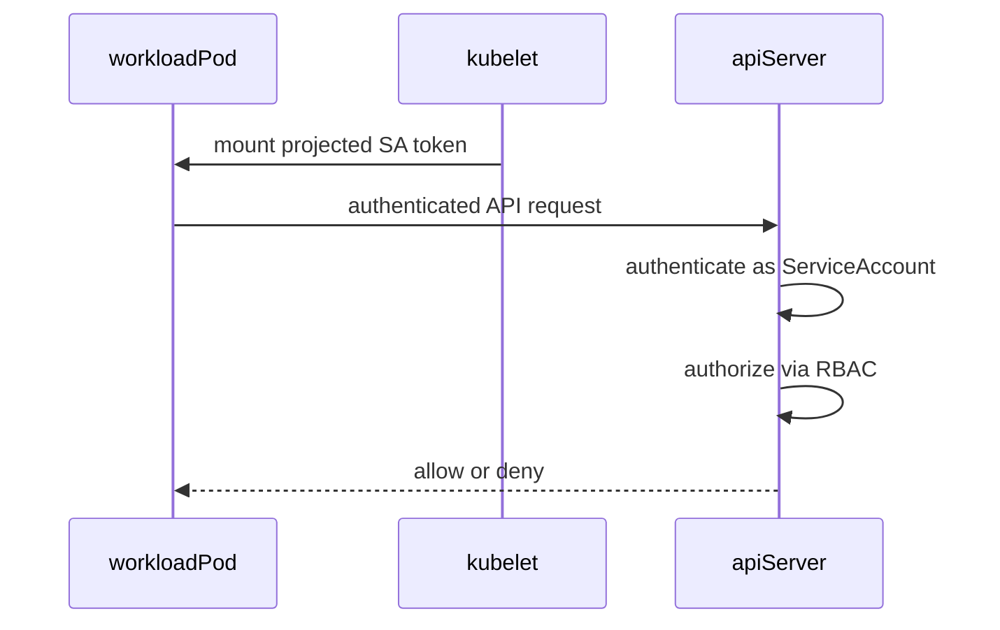
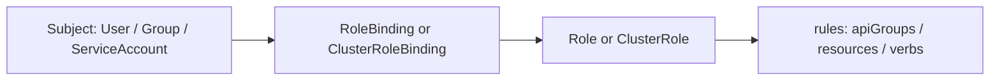
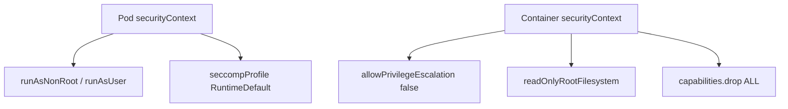
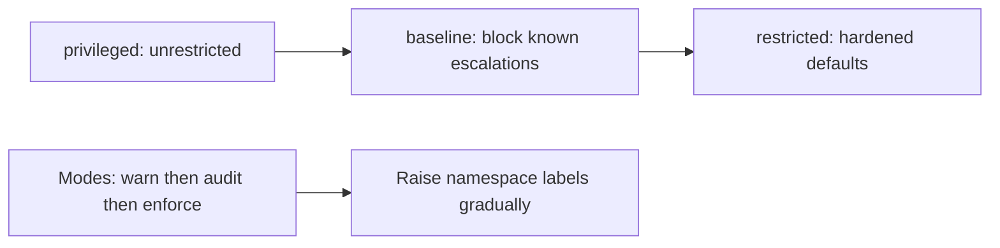
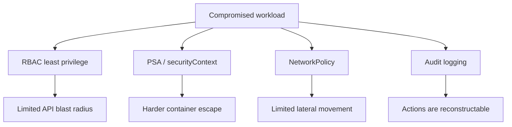

# Chapter 21 — RBAC and Security

> **Learning Objectives**
>
> By the end of this chapter, you will be able to:
>
> - Explain what a ServiceAccount is and how a Pod proves who it is to the API server
> - Write Roles, ClusterRoles, and bindings that grant the smallest set of rights that works
> - Use security contexts to limit what a container process is allowed to do
> - Turn on Pod Security Admission for a namespace, and pick the right level
> - Give Pods credentials to pull images from a private registry
> - Turn on audit logging and know what to look for in it
> - Stack RBAC, admission, NetworkPolicy, and audits so no single mistake is fatal

---

## 21.1 Keys, badges, and building codes

An office building does not hand every contractor a master key. The receptionist can open the lobby. The electrician's badge opens the utility floors and nothing else. Fire codes decide where walls and sprinklers go, and those rules apply to everyone, badge or no badge. Cameras record who walked where, so that after something goes wrong, somebody can piece the night together.


*Figure 21.A: Who you are (subject) plus your badge (RoleBinding) decides which doors open.*

Kubernetes security is built from the same four ideas:

- **RBAC** (role-based access control) is the badge system. It decides which actions each identity may take on which objects.
- **ServiceAccounts** are the badges themselves, issued to Pods rather than to people.
- **Security contexts** and **Pod Security Admission** are the building codes. They limit how a process may run, even for a workload with a valid badge.
- **Audit logging** is the camera system. It records every request the API server received.
- **NetworkPolicies** ([Chapter 19](19-k8s-networking-cni-and-policies.md)) and **Secrets** ([Chapter 17](17-configuration-and-secrets.md)) close the gaps the other four leave open.

Notice the pattern. Each control catches a different kind of failure, and none of them catches all of it. A badge system does not stop a fire. A sprinkler does not stop a thief with a key.

A fresh cluster ships wide open, because that is the friendliest setting for learning. This chapter closes it down step by step, without locking you out of your own lab.

---

## 21.2 ServiceAccounts: identity for workloads

### In plain terms

A **ServiceAccount** is an identity for a workload. It answers the question "who is this Pod?" the same way your kubeconfig file answers "who is this person?"

Why do Pods need an identity at all? Because the API server has to decide whether to answer their requests. A Pod that lists other Pods, reads a ConfigMap, or updates a custom resource is making an authenticated call, and something has to be on the other end of that call. The ServiceAccount is that something.

Every namespace comes with one named `default`, and every Pod that does not name a different one gets it automatically. That is convenient and it is also the problem. If you grant rights to `default`, you have granted them to every Pod in the namespace, including the ones you did not write. Give each application its own ServiceAccount with only the rights it actually needs.

One belief to let go of early: "my app never calls the API, so the ServiceAccount does not matter." The token is mounted into the container whether your code uses it or not. Sidecars use it. Debug tooling uses it. And anyone who breaks into that container finds a working credential sitting on the filesystem.

> ⚠️ **Common Pitfall:** Assuming “no API calls in my app” means the ServiceAccount does not matter. Sidecars, operators, and opportunistic tooling still inherit that identity.

### Under the hood

Here is a dedicated identity and a Pod that uses it:

```yaml
apiVersion: v1
kind: ServiceAccount
metadata:
  name: task-api
  namespace: tasks
```

```yaml
spec:
  serviceAccountName: task-api
  containers:
    - name: api
      image: ghcr.io/mastering-k8s/task-api:1.1
```

The kubelet mounts a projected, audience-bound, time-limited token so the Pod can call the API server—**if** RBAC allows it.

```bash
$ kubectl apply -f serviceaccount.yaml
serviceaccount/task-api created

$ kubectl get sa -n tasks
NAME       SECRETS   AGE
default    0         2d
task-api   0         5s
```

> 💡 **Tip:** Create a dedicated ServiceAccount per app (or per permission set). Never grant broad rights to `default`.



*Figure 21.1: The kubelet mounts a projected ServiceAccount token; the API server authenticates the Pod, then RBAC decides authorization.*

What breaks if you leave automount enabled on a Pod that never needs the API: a container escape yields a ready-made API credential.

### In production

**Ownership:** App teams create and own the ServiceAccount for each workload. The platform team keeps the `default` ServiceAccount clean and sets the token defaults. Find tokens mounted into Pods that never use them with an admission check. Remove them by setting `automountServiceAccountToken: false` on those Pods.

| Do | Don't |
|----|-------|
| Dedicated SA per app / permission set | Grant rights to `default` |
| Disable automount when unused | Prefer long-lived Secret tokens |
| Review RoleBindings in CI | Share one privileged SA across apps |

**Before you leave this section**

- **Understand:** Pods authenticate as ServiceAccounts; default is not a production identity.
- **Try:** Create a dedicated SA and point a Deployment at it.
- **Watch in prod:** Automounted tokens on Pods that never call the API.

---

## 21.3 RBAC building blocks

### In plain terms

**RBAC** answers one question on every API request: may this identity perform this action on this kind of object, here? The action is called a **verb** — `get`, `list`, `create`, `delete`, and a few others.

RBAC splits that into two objects, and this is the part worth slowing down for. A **Role** is a list of permissions and nothing more. It grants nobody anything on its own. A **RoleBinding** attaches a Role to a **subject**, which is a user, a group, or a ServiceAccount. A role is the menu; a binding is handing that menu to someone.

Then there is scope. A **Role** only works inside one namespace. A **ClusterRole** is the same idea but written once for the whole cluster, and it is what you need for objects that do not live in any namespace, such as nodes or PersistentVolumes. A ClusterRole is also reusable: bind it with a RoleBinding and its permissions apply in just that one namespace, which is how you write "read-only" once and grant it in twenty places.

> 💡 **In one line:** A Role lists permissions inside one namespace, a ClusterRole lists them cluster-wide or for reuse, and neither does anything until a binding hands it to somebody.

Why be strict about all this? Because every extra verb you grant is a verb an attacker gets for free if that token ever leaks. Granting `cluster-admin` to a CI pipeline "just until we harden it" is the version of this mistake that shows up in real postmortems. That pipeline's token now controls every namespace, every Secret, and every node.

> ⚠️ **Common Pitfall:** Binding `cluster-admin` to a CI ServiceAccount “just for now.” Tokens leak; blast radius becomes the entire cluster.

### Under the hood

Here are the four objects and exactly what each one covers:

| Object | Scope | Purpose |
|--------|-------|---------|
| **Role** | Namespace | Permissions inside one namespace |
| **ClusterRole** | Cluster | Cluster-wide resources or reusable permission sets |
| **RoleBinding** | Namespace | Grants a Role (or ClusterRole) to subjects in a namespace |
| **ClusterRoleBinding** | Cluster | Grants a ClusterRole cluster-wide |

Common verbs: `get`, `list`, `watch`, `create`, `update`, `patch`, `delete`, `deletecollection`.

```yaml
apiVersion: rbac.authorization.k8s.io/v1
kind: Role
metadata:
  name: pod-reader
  namespace: tasks
rules:
  - apiGroups: [""]
    resources: ["pods"]
    verbs: ["get", "list", "watch"]
---
apiVersion: rbac.authorization.k8s.io/v1
kind: RoleBinding
metadata:
  name: task-api-read-pods
  namespace: tasks
subjects:
  - kind: ServiceAccount
    name: task-api
    namespace: tasks
roleRef:
  apiGroup: rbac.authorization.k8s.io
  kind: Role
  name: pod-reader
```

```bash
$ kubectl apply -f role-pod-reader.yaml
$ kubectl auth can-i list pods -n tasks --as=system:serviceaccount:tasks:task-api
yes
$ kubectl auth can-i delete pods -n tasks --as=system:serviceaccount:tasks:task-api
no
```

Cluster-scoped example:

```yaml
apiVersion: rbac.authorization.k8s.io/v1
kind: ClusterRole
metadata:
  name: pv-reader
rules:
  - apiGroups: [""]
    resources: ["persistentvolumes"]
    verbs: ["get", "list"]
```



*Figure 21.2: Subjects receive permissions through bindings that reference Roles; Roles list the API groups, resources, and verbs allowed.*

*Figure 21.2: Subjects receive permissions through bindings that reference Roles; Roles list the API groups, resources, and verbs allowed.*

What breaks if `roleRef` name/kind typos: the binding exists but grants nothing—or worse, you “fix” it by attaching `cluster-admin`. Always verify with `kubectl auth can-i --as=...`.

### In production

**Ownership:** The platform team owns the emergency admin identity and the roles CI uses to deploy. App teams own the namespace Roles for their own ServiceAccounts. Keep three identities apart: the human admin, the CI deployer, and the ServiceAccount the app runs as. Catch rights that creep upward by running `auth can-i --list` on a schedule and alerting whenever a ClusterRoleBinding changes.

| Do | Don't |
|----|-------|
| Prefer Role + RoleBinding | Grant `*` verbs to app identities |
| Split CI / runtime / human admin | Clone `cluster-admin` onto apps |
| Verify with `auth can-i` | Trust binding YAML without testing as the SA |

> 🏭 **Production floor:** **RBAC least privilege** is a control-plane blast-radius rule. For any new SA: list required verbs/resources in the PR, bind the narrowest Role, prove with `kubectl auth can-i … --as=system:serviceaccount:<ns>:<sa>` for both *allowed* and *denied* cases, and paste that evidence into the change ticket. Forbid `cluster-admin` on CI and runtime SAs except a documented break-glass identity with MFA, short TTL, and audit alerts. Review bindings when people or pipelines change—stale bindings outlive the ticket that created them.

**Before you leave this section**

- **Understand:** Roles list verbs; bindings grant them; scope matters (Role vs ClusterRole).
- **Try:** Bind a read-only Role and prove deny on delete as that SA.
- **Watch in prod:** ClusterRoleBindings to powerful roles; CI tokens with admin rights.

---

## 21.4 Security contexts

### In plain terms

A **security context** is a block in your Pod spec that limits what the process inside a container may do on the node. Which user it runs as. Whether it can gain more privileges than it started with. Whether it can write to its own filesystem. Which special powers the Linux kernel grants it.

Why does this need its own control? Because RBAC and NetworkPolicy both work at a level above the container. RBAC decides what API calls the Pod may make. NetworkPolicy decides who it may talk to. Neither one has any opinion about a process running as root with every kernel power enabled. If an attacker finds a bug in your application, that is exactly the situation they hope to land in.

A word on the powers involved. Linux splits root's abilities into **capabilities**, individual permissions such as "bind to a low-numbered port" or "load a kernel module." A container that keeps all of them is nearly root on the host. A container that drops all of them and adds back the one it truly needs is dramatically harder to escape from.

The reassuring argument you will hear is "we run in a private network, so root inside the container is fine." A private network does not help here. A leaked token, a compromised dependency, or a malicious base image all start *inside* that network already.

> ⚠️ **Common Pitfall:** Dropping all capabilities but leaving `allowPrivilegeEscalation: true` or a writable root FS—defense in depth means stacking controls.

### Under the hood

Here is a hardened Deployment with every setting in place:

```yaml
apiVersion: apps/v1
kind: Deployment
metadata:
  name: task-api
  namespace: tasks
spec:
  replicas: 2
  selector:
    matchLabels:
      app: task-api
  template:
    metadata:
      labels:
        app: task-api
    spec:
      serviceAccountName: task-api
      securityContext:
        runAsNonRoot: true
        runAsUser: 1000
        runAsGroup: 1000
        fsGroup: 1000
        seccompProfile:
          type: RuntimeDefault
      containers:
        - name: api
          image: ghcr.io/mastering-k8s/task-api:1.1
          ports:
            - containerPort: 8000
          securityContext:
            allowPrivilegeEscalation: false
            readOnlyRootFilesystem: true
            capabilities:
              drop: ["ALL"]
          volumeMounts:
            - name: tmp
              mountPath: /tmp
          resources:
            requests:
              cpu: "100m"
              memory: "128Mi"
            limits:
              cpu: "500m"
              memory: "256Mi"
      volumes:
        - name: tmp
          emptyDir: {}
```

| Field | Intent |
|-------|--------|
| `runAsNonRoot` / `runAsUser` | Do not run as UID 0 |
| `allowPrivilegeEscalation: false` | Block privilege escalation |
| `readOnlyRootFilesystem: true` | Force writable paths onto volumes |
| `capabilities.drop: ["ALL"]` | Remove Linux capabilities; add back only if required |
| `seccompProfile: RuntimeDefault` | Apply default syscall filter |



*Figure 21.3: Pod- and container-level security contexts constrain identity, privileges, filesystem writability, and capabilities.*

> 💡 **Tip:** Images must be built to support non-root (file ownership, listening on non-privileged ports). The Task API should listen on 8000 as a non-root user.

> 💡 **Tip:** Images must be built to support non-root (file ownership, listening on non-privileged ports). The Task API should listen on 8000 as a non-root user.

What breaks if the image expects to write to `/var` but you set `readOnlyRootFilesystem: true` without an emptyDir: CrashLoop with permission errors—fix the image and mounts together.

### In production

**Ownership:** App teams write the securityContext for their own workloads. The platform team owns the hardened defaults in shared charts and runs the exemption process for the few DaemonSets that genuinely need extra privileges. Detect gaps through PSA violations and admission reports. Close them by making the hardened settings the default a team gets without asking, and by writing down the reason for every exemption.

| Do | Don't |
|----|-------|
| Non-root, drop ALL caps, read-only root | Run as UID 0 “for convenience” |
| emptyDir for `/tmp` and caches | Exempt apps without a ticket |
| Chart/Helm defaults hardened (Ch 23) | Copy privileged specs from DaemonSets |

**Before you leave this section**

- **Understand:** Security contexts harden process privileges independent of RBAC.
- **Try:** Deploy with non-root, no privilege escalation, drop ALL caps.
- **Watch in prod:** Privileged exemptions that never expire.

---

## 21.5 Pod Security Admission (PSA)

### In plain terms

**Pod Security Admission** (PSA) is a check built into the API server that inspects every Pod before it is created and rejects the ones that are not hardened enough. You turn it on by putting labels on a namespace.

Why is this needed when you already wrote a good securityContext? Because writing one is voluntary. The next engineer, the next Helm chart, and the next copy-pasted manifest may not. PSA moves the rule from something people are asked to remember into something the cluster refuses to accept. It is the building inspector who rejects the plans before anyone pours concrete.

PSA enforces the **Pod Security Standards**, three named levels that ship with Kubernetes: `privileged` allows everything, `baseline` blocks the well-known escalation tricks, and `restricted` demands the full hardened set. You choose one per namespace.

You also choose a mode, and this is where rollouts succeed or fail. `warn` prints a message and allows the Pod. `audit` records it and allows the Pod. `enforce` rejects it. Turning on `enforce=restricted` across the cluster in one change sounds decisive. In practice it blocks the monitoring DaemonSet that needs a host path and the debug tooling you were about to reach for. Go `warn`, then `audit`, then `enforce`.

> ⚠️ **Common Pitfall:** Enforcing `restricted` suddenly on system namespaces that need hostPath. Exempt thoughtfully; do not disable PSA everywhere.

### Under the hood

Here are the three levels and exactly what each one allows:

| Standard | Strictness | Summary |
|----------|------------|---------|
| **privileged** | Least | Unrestricted (legacy, admin-only workloads) |
| **baseline** | Medium | Blocks known privilege escalations; reasonable default |
| **restricted** | Most | Hardened: non-root, drop caps, restrict volumes, and more |

Modes: `enforce` (reject), `audit` (allow + audit), `warn` (allow + client warning).

```bash
$ kubectl label namespace tasks \
    pod-security.kubernetes.io/enforce=baseline \
    pod-security.kubernetes.io/enforce-version=latest \
    pod-security.kubernetes.io/warn=restricted \
    pod-security.kubernetes.io/warn-version=latest \
    --overwrite
```

Roll out carefully: `warn`/`audit` first, fix workloads, then raise `enforce`.



*Figure 21.4: Pod Security Standards tighten from privileged to restricted; roll out with warn/audit before enforce.*

> 📘 **Deep Dive (optional):** PSA replaced PodSecurityPolicy (removed since Kubernetes 1.25). On 1.36, PSA is the built-in path; Kyverno or OPA Gatekeeper add richer custom rules on top.

> 📘 **Deep Dive (optional):** PSA replaced PodSecurityPolicy (removed since Kubernetes 1.25). On 1.36, PSA is the built-in path; Kyverno or OPA Gatekeeper add richer custom rules on top.

What breaks if you pin `enforce-version=latest` through a Kubernetes upgrade: newly restricted fields reject Pods that passed last week—pin versions in GitOps.

### In production

**Ownership:** The platform team decides which PSA level each class of namespace starts at. App teams fix their workloads before the level is raised to enforce. Find the work by reading warn and audit events while enforcement is still off. Keep the rollout safe by raising the level in stages and by pinning the PSA version in the labels rather than tracking `latest`.

| Do | Don't |
|----|-------|
| Aim for baseline enforce; drive to restricted | Enforce restricted cluster-wide overnight |
| warn/audit first | Blindly enforce on kube-system |
| Version-pin PSA labels in GitOps | Rely on `latest` through upgrades |

**Before you leave this section**

- **Understand:** privileged → baseline → restricted; modes warn/audit/enforce.
- **Try:** Label a scratch namespace baseline enforce; attempt a privileged Pod.
- **Watch in prod:** Upgrade-driven PSA surprises; permanent privileged namespaces without review.

---

## 21.6 Image pull secrets

### In plain terms

An **image pull secret** is a credential the kubelet uses to log in to a private registry so it can download your image. It is stored as a Secret of type `kubernetes.io/dockerconfigjson`, and you attach it either to the Pod or to the ServiceAccount the Pod runs as.

Why does this get its own section? Because it is the one credential that has to exist before your container does. Get it wrong and the Pod never starts at all — it sits in `ImagePullBackOff`, which means the kubelet tried to download the image, was refused, and is waiting to try again. Get it too broadly shared and every namespace in the cluster can pull your private images.

There is a tempting shortcut here that is worth naming. Putting the registry username and password in environment variables looks simpler than creating a Secret. It is not simpler, and it is much worse: those values show up in the Deployment manifest, in `kubectl describe` output, in the process list on the node, and in whatever Git repository holds the manifest.

Where your cloud offers it, skip the password entirely. Workload identity lets the node or the Pod prove who it is to the registry, with no long-lived secret to leak or rotate.

> ⚠️ **Common Pitfall:** Storing registry passwords in ConfigMaps or plaintext CI logs. Use pull secrets or cloud workload identity.

### Under the hood

Here is how you create the credential and attach it:

```bash
$ kubectl create secret docker-registry regcred \
    --docker-server=ghcr.io \
    --docker-username=YOUR_USER \
    --docker-password=YOUR_TOKEN \
    --docker-email=you@example.com \
    -n tasks
```

```yaml
spec:
  serviceAccountName: task-api
  imagePullSecrets:
    - name: regcred
  containers:
    - name: api
      image: ghcr.io/example/task-api:1.1
```

Or patch the ServiceAccount:

```bash
$ kubectl patch serviceaccount task-api -n tasks \
  -p '{"imagePullSecrets":[{"name":"regcred"}]}'
```

```bash
$ kubectl patch serviceaccount task-api -n tasks \
  -p '{"imagePullSecrets":[{"name":"regcred"}]}'
```

What breaks if the pull token expires but Deployments still reference it: mass ImagePullBackOff across namespaces—rotate with overlap.

### In production

**Ownership:** The platform team decides how workloads authenticate to registries, and should prefer node or workload identity over stored passwords. App teams attach the right secret or identity annotation to their Pods. Detect trouble through ImagePullBackOff events and registry authentication errors. Reduce the risk with a written rotation procedure and by pinning production images to a digest.

| Do | Don't |
|----|-------|
| Prefer cloud workload/node identity | Paste passwords into Deployment env |
| Scope secrets per namespace; rotate | Share one cluster-wide pull secret everywhere |
| Pin production images by digest | Leave expired tokens without monitoring |

**Before you leave this section**

- **Understand:** Pull secrets (or identity) unlock private registries without embedding passwords in Pod env.
- **Try:** Create a docker-registry secret and attach it to an SA.
- **Watch in prod:** Coordinated ImagePullBackOff after token expiry.

---

## 21.7 Cluster auditing basics

### In plain terms

**Audit logging** is a record the API server writes of every request it handled: who made it, what they did, to which object, at what time, and from which address.

Why keep it? Because RBAC and audit logs answer two different questions, and during an incident you need the second one. RBAC tells you what *was allowed*. The audit log tells you what someone *actually did*. When a Deployment vanishes at 2 a.m., "the CI account was permitted to delete it" does not help. "The CI account deleted it at 02:14 from this address" does.

Metrics and application logs will not fill this gap. Neither one can tell you who attached `cluster-admin` to a ServiceAccount last Thursday. Only the API audit trail records that.

There is a real cost to overdoing it, though. You can ask the API server to record the full body of every request and response. On a busy cluster that produces an enormous volume of data, and it copies your Secret contents into a log file — turning your audit trail into a second thing an attacker would love to steal. Record metadata by default and raise the level only for the handful of resources that justify it.

> ⚠️ **Common Pitfall:** Logging `RequestResponse` for every object at massive scale. Audit volume and sensitive data (Secret bodies) can overwhelm storage and create a second breach surface. Prefer selective rules.

### Under the hood

Here is how you control what gets recorded. The API server evaluates an **audit policy** that selects requests by users, verbs, resources, and namespaces, and assigns levels:

| Level | What is recorded |
|-------|------------------|
| `None` | Do not log |
| `Metadata` | Request metadata (user, resource, verb)—not the object body |
| `Request` | Metadata + request body (for non-resource-sensitive cases) |
| `RequestResponse` | Metadata + request and response bodies |

Conceptual policy snippet (actual file path and flags are distro-specific):

```yaml
apiVersion: audit.k8s.io/v1
kind: Policy
omitStages:
  - RequestReceived
rules:
  - level: None
    users: ["system:kube-proxy"]
  - level: RequestResponse
    verbs: ["create", "update", "patch", "delete"]
    resources:
      - group: ""
        resources: ["secrets"]
  - level: Metadata
    resources:
      - group: ""
        resources: ["pods", "configmaps"]
  - level: Metadata
    omitStages:
      - RequestReceived
```

API server flags (illustrative—follow your distribution):

```text
--audit-policy-file=/etc/kubernetes/audit-policy.yaml
--audit-log-path=/var/log/kubernetes/audit/audit.log
--audit-log-maxage=30
--audit-log-maxbackup=10
--audit-log-maxsize=100
```

Managed Kubernetes (EKS, GKE, AKS) often exposes audit logs through the cloud logging product instead of a raw file on the control plane. Enable and ship them the same way you ship application logs ([Chapter 22](22-observability.md)).

What to watch for in reviews:

- Unexpected `create`/`delete` on Roles, ClusterRoleBindings, Secrets
- `exec` / `portforward` / `proxy` subresources
- Anonymous or unusual user agents against sensitive APIs

What breaks if audits stay only on the control-plane disk: a node loss destroys forensics—ship off-cluster promptly.

### In production

**Ownership:** The platform team owns the audit policy, where the logs are sent, and how long they are kept. The security team owns the alerts that fire on privileged changes. Watch for two things in particular: anyone binding `cluster-admin`, and Secret deletions in production namespaces. Protect the trail itself with storage that cannot be edited after the fact, and by restricting who can read the audit stream.

| Do | Don't |
|----|-------|
| Metadata by default; raise levels selectively | RequestResponse for everything |
| Ship logs off-cluster; protect like security telemetry | Enable audits but never alert |
| Alert on privileged RBAC and Secret deletes | Treat audits as optional “compliance later” |

**Before you leave this section**

- **Understand:** Audits record what happened; RBAC only defines what was allowed.
- **Try:** Locate where your platform delivers API audit events; find one RoleBinding change.
- **Watch in prod:** Silent ClusterRoleBinding changes; audit pipeline lag.

---

## 21.8 NetworkPolicy as a security control

RBAC does not stop Pod A from TCP-connecting to Pod B. Pair this chapter with Chapter 19:

1. Default-deny ingress/egress in sensitive namespaces
2. Allow only required peers and DNS
3. Keep ServiceAccounts from needing network paths they should not use

Defense in depth: stolen token + open network is worse than either alone.



*Figure 21.5: Layer RBAC, admission, NetworkPolicy, and audits—no single control contains every failure mode.*

---

## 21.9 Hardened Task API checklist

- [ ] Dedicated ServiceAccount with no extra RoleBindings beyond need
- [ ] Non-root securityContext; drop capabilities; read-only root FS where possible
- [ ] Namespace PSA at least `baseline` enforce; aim for `restricted`
- [ ] Image from trusted registry; pull secret if private; pin tags or digests
- [ ] Resource requests/limits set
- [ ] NetworkPolicies restrict ingress/egress
- [ ] Secrets via native Secret objects or external secret manager—not baked into images
- [ ] Audit logging enabled and shipped; alerts on privileged RBAC changes

---

## 21.10 Common pitfalls

> ⚠️ **Common Pitfall:** RoleBinding `roleRef` must match an existing Role/ClusterRole name and kind exactly; typos leave subjects with no permissions.

> ⚠️ **Common Pitfall:** Testing as yourself (`kubectl`) proves nothing about the Pod’s ServiceAccount. Always test with `--as=system:serviceaccount:ns:name`.

> ⚠️ **Common Pitfall:** Enforcing `restricted` suddenly breaks DaemonSets that need hostPath—exempt system namespaces thoughtfully.

> ⚠️ **Common Pitfall:** Enabling audits but never reading them—wire alerts and periodic reviews.

---

## 21.11 Hands-on exercises

1. **ServiceAccount.** Create `task-api` SA and configure a Deployment to use it. Confirm the mounted token path exists.
2. **Least privilege.** Bind a Role that can only `get/list` ConfigMaps. Verify with `kubectl auth can-i` as that SA.
3. **Security context.** Deploy with `runAsNonRoot`, `allowPrivilegeEscalation: false`, and `capabilities.drop: ["ALL"]`.
4. **PSA.** Label a scratch namespace with `enforce=baseline`. Try deploying a privileged Pod and observe rejection.
5. **Audit awareness.** On your platform, locate where API audit logs are delivered (file, CloudWatch, Cloud Logging, and so on). Find one Secret or RoleBinding change event from a known action you perform.

---

## 21.12 Check Your Understanding

**Q1.** What identity do Pods use when calling the Kubernetes API?

<details>
<summary>Show answer</summary>

Their **ServiceAccount** (default or named), via a mounted API token.

</details>

**Q2.** What is the difference between a Role and a ClusterRole?

<details>
<summary>Show answer</summary>

A **Role** is namespaced; a **ClusterRole** is cluster-scoped (or a reusable set of rules). Bindings determine where those rules apply.

</details>

**Q3.** Does RBAC control Pod-to-Pod network traffic?

<details>
<summary>Show answer</summary>

**No.** RBAC authorizes API requests. Use **NetworkPolicy** for traffic control.

</details>

**Q4.** Name the three Pod Security Standards levels.

<details>
<summary>Show answer</summary>

**privileged**, **baseline**, and **restricted**.

</details>

**Q5.** What problem does API audit logging solve that RBAC alone does not?

<details>
<summary>Show answer</summary>

RBAC defines what is *allowed*. **Audit logs** record what *actually happened* (who, what, when), which is essential for detection, forensics, and proving compliance.

</details>

---

## 21.13 Key takeaways

- A Pod's identity is its ServiceAccount. Give each app its own; never load up `default`.
- A Role lists permissions. A binding hands them out. Neither works without the other.
- Role is one namespace. ClusterRole is cluster-wide or reusable across namespaces.
- Prove permissions with `kubectl auth can-i --as=...`, for both the yes case and the no case.
- Never grant `cluster-admin` to CI or to a running app. Tokens leak.
- Security contexts limit what the process can do. RBAC has no opinion about root.
- PSA makes hardening mandatory instead of optional. Roll it out warn, then audit, then enforce.
- Audit logs say what happened. RBAC only says what was allowed.
- Every control catches a different failure. Stack them.

---

## 21.14 Official documentation map

| Topic | Official page |
|-------|---------------|
| RBAC | [Using RBAC Authorization](https://kubernetes.io/docs/reference/access-authn-authz/rbac/) |
| Service Accounts | [Managing Service Accounts](https://kubernetes.io/docs/reference/access-authn-authz/service-accounts-admin/) |
| Configure Service Accounts for Pods | [Configure Service Accounts for Pods](https://kubernetes.io/docs/tasks/configure-pod-container/configure-service-account/) |
| Pod Security Standards | [Pod Security Standards](https://kubernetes.io/docs/concepts/security/pod-security-standards/) |
| Pod Security Admission | [Pod Security Admission](https://kubernetes.io/docs/concepts/security/pod-security-admission/) |
| Security Context | [Configure a Security Context](https://kubernetes.io/docs/tasks/configure-pod-container/security-context/) |
| Auditing | [Auditing](https://kubernetes.io/docs/tasks/debug/debug-cluster/audit/) |

**Previous:** [Chapter 20 — Scheduling and Advanced Placement](20-scheduling-and-advanced-placement.md) | **Next:** [Chapter 22 — Observability](22-observability.md)
