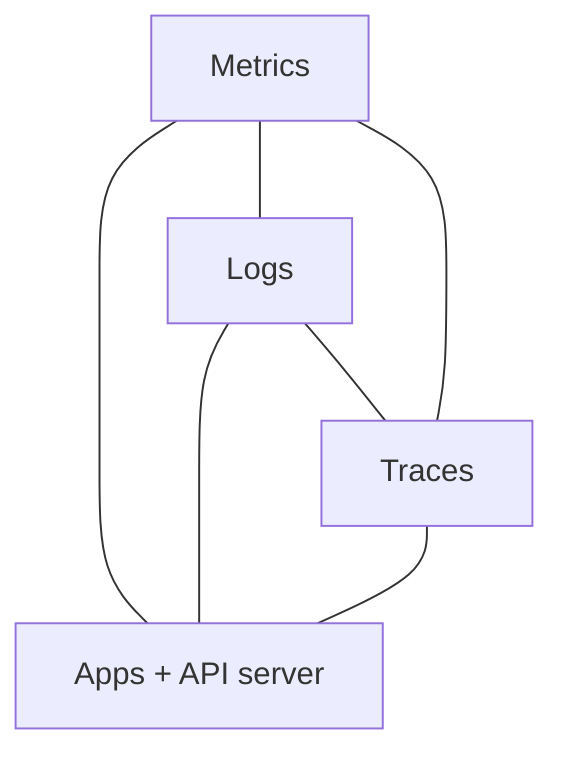
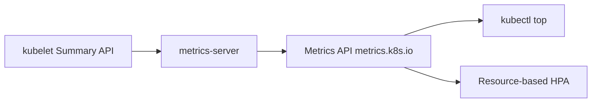
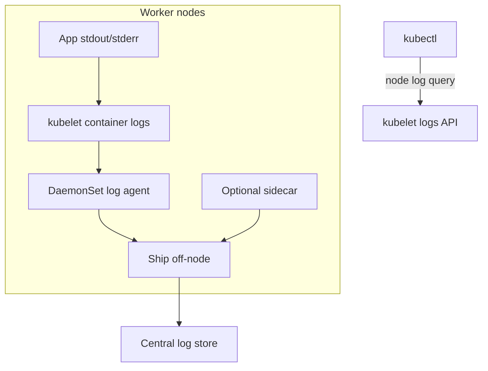
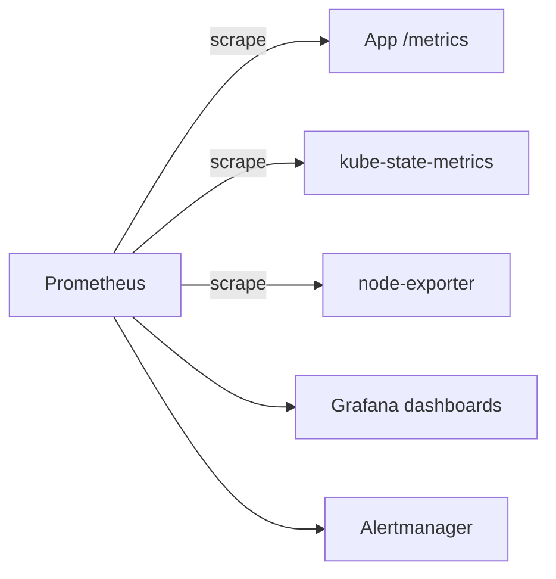
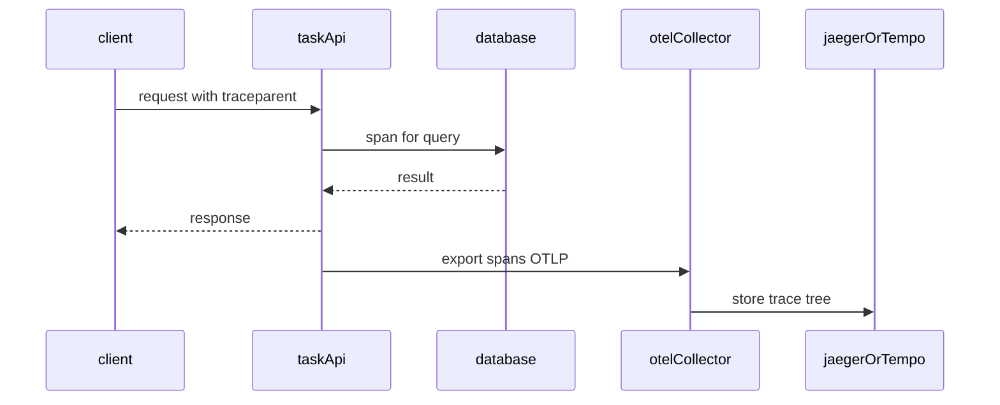

# Chapter 22 — Observability

> **Learning Objectives**
>
> By the end of this chapter, you will be able to:
>
> - Explain metrics, logs, and traces in a Kubernetes context
> - Install and use metrics-server for resource metrics and `kubectl top`
> - Approach the Kubernetes Dashboard safely (or choose safer alternatives)
> - Design a logging architecture with node agents, optional sidecars, and node log query
> - Describe Prometheus and Grafana as the common metrics stack
> - Outline OpenTelemetry for distributed traces
> - Use PSI metrics (cgroup v2, GA in Kubernetes 1.36) as contention signals
> - Avoid monitoring anti-patterns that create blind spots or security holes

---

## 22.1 Flying blind versus instrument panels

You would not fly a passenger jet with taped-over gauges. CPU spikes, memory leaks, crashing containers, and slow API calls are the turbulence of production systems. **Observability** is the discipline of making a system’s internal state visible from the outside through **metrics**, **logs**, and **traces**.


*Figure 22.A: Metrics, logs, and traces are the gauges that keep the cluster flight safe.*

Kubernetes gives you building blocks (Events, container logs, resource metrics APIs, kubelet Summary API). Production teams usually add a metrics stack (often **Prometheus** + **Grafana**), a log pipeline, and eventually **OpenTelemetry** traces. This chapter builds the mental model and the first practical tools—without pretending a single dashboard solves reliability.

---

## 22.2 The three pillars (Kubernetes flavor)

### In plain terms

**Metrics** tell you *how much* and *how often*. **Logs** tell you *what happened* in words. **Traces** tell you *where time went* across services. You need all three for different questions; none replaces the others.

Pillars are complementary evidence, not competing religions. You might think metrics alone explain every outage—without logs and traces you guess at causality.

> ⚠️ **Common Pitfall:** Collecting everything forever without owners or retention. Observability without an on-call consumer is expensive noise.

### Under the hood

| Pillar | Questions answered | Typical tools |
|--------|--------------------|---------------|
| **Metrics** | How hot? How saturated? How many errors per second? | metrics-server, Prometheus, kube-state-metrics, PSI |
| **Logs** | What exactly happened in this request/process? | stdout/stderr, node log query, Loki/ELK, cloud logs |
| **Traces** | Where did time go across services? | OpenTelemetry, Jaeger, Tempo, cloud APM |



*Figure 22.1: Metrics, logs, and traces form a triangle around workloads and the Kubernetes API—each answers different questions.*

### In production

**Ownership:** Platform owns the observability stack (agents, storage, retention); app teams own instrumentation and SLI dashboards for their services.

**Failure mode:** Blind spots during incidents → longer MTTR. Detect with synthetic checks and missing-scrape alerts. Mitigate with a minimum signal contract (RED/USE + structured logs + trace IDs).

> 🏭 **Production floor:** Page on symptoms users feel (error rate, latency SLO burn), not on every CPU blip. An alert without a runbook owner is noise.

| Do | Don't |
|----|-------|
| Define SLIs before fancy dashboards | Equate more metrics with better ops |
| Propagate trace IDs into logs | Ship PII in cleartext logs |
| Alert on symptoms users feel | Alert on every CPU blip |

**Before you leave this section**

- **Understand:** Metrics, logs, and traces answer different questions; use them together.
- **Try:** Open your cluster metrics API / dashboard and find one Pod CPU series.
- **Watch in prod:** Alert fatigue and dashboards nobody owns.


---

## 22.3 metrics-server: resource metrics for the control plane

### In plain terms

**metrics-server** scrapes kubelets for CPU and memory usage and exposes the **Metrics API** (`metrics.k8s.io`). It powers `kubectl top` and resource-based Horizontal Pod Autoscalers. It is a live gauge cluster, not a historical archive.

metrics-server feeds `kubectl top` and the Metrics API used by HPA on CPU/memory. It is not long-term Prometheus history. You might think metrics-server replaces Prometheus—different jobs, different retention.

> ⚠️ **Common Pitfall:** Debugging HPA with Prometheus while metrics-server is down. HPA resource metrics need the Metrics API.

### Under the hood

```bash
$ kubectl apply -f https://github.com/kubernetes-sigs/metrics-server/releases/latest/download/components.yaml
```

On local clusters you may need flags such as `--kubelet-insecure-tls`—follow current metrics-server docs for your environment.

```bash
$ kubectl top nodes
NAME       CPU(cores)   CPU%   MEMORY(bytes)   MEMORY%
worker-1   120m         6%     1200Mi          35%
worker-2   80m          4%     900Mi           28%

$ kubectl top pods -n tasks
NAME                        CPU(cores)   MEMORY(bytes)
task-api-6d7f8c9b5d-xk2m9   15m          64Mi
task-api-6d7f8c9b5d-qw8pz    12m          58Mi
```

> ⚠️ **Common Pitfall:** HPA on CPU/memory will not work without a functioning Metrics API. If `kubectl top` fails, fix metrics-server before debugging HPA formulas.

> 💡 **Tip:** metrics-server is **not** long-term metrics storage. Historical graphs need Prometheus (or a cloud metrics backend).



*Figure 22.2: metrics-server scrapes kubelets and exposes the Metrics API used by `kubectl top` and CPU/memory HPA.*

### In production

**Ownership:** Platform owns metrics-server health; app teams own HPA targets that depend on it.

**Failure mode:** metrics-server down → `kubectl top` fails and resource HPAs freeze. Detect with Metrics API probes. Mitigate with DaemonSet/Deployment alerts and PDB on metrics-server.

| Do | Don't |
|----|-------|
| Alert on Metrics API availability | Use metrics-server as long-term TSDB |
| Size for node count growth | Ignore scrape failures on NotReady nodes |

**Before you leave this section**

- **Understand:** metrics-server powers top/HPA resource metrics, not historical analytics.
- **Try:** Run `kubectl top nodes` and `kubectl top pods -A` on a healthy cluster.
- **Watch in prod:** HPA stuck after metrics-server outages.


---

## 22.4 Kubernetes Dashboard: powerful and easy to misuse

### In plain terms

A web UI that can list workloads and logs is convenient. The same UI with `cluster-admin` on the public internet is a root shell with a paint job.

A powerful UI that can become a powerful blast radius if bound to cluster-admin and exposed broadly. Prefer read-only + SSO + network restriction.

> ⚠️ **Common Pitfall:** Exposing Dashboard with a privileged ServiceAccount on a public LoadBalancer “for convenience.”

### Under the hood

Safety guidelines:

1. Prefer **read-only** RBAC bindings for dashboard users
2. Do not expose the Dashboard on a public LoadBalancer without strong auth
3. Prefer authenticated reverse proxies, VPN, or cloud IAM integrations
4. On learning clusters, use `kubectl proxy` temporarily rather than permanent NodePorts
5. Many production teams skip Dashboard entirely and use Grafana + GitOps UIs

```bash
$ kubectl apply -f https://raw.githubusercontent.com/kubernetes/dashboard/v2.7.0/aio/deploy/recommended.yaml
# Pin a release you trust and read its install guide—versions change

$ kubectl -n kubernetes-dashboard create token admin-user
$ kubectl proxy
Starting to serve on 127.0.0.1:8001
```

### In production

**Ownership:** Platform owns whether Dashboard exists and how it authenticates; never a shared admin token in a wiki.

**Failure mode:** Stolen Dashboard session → cluster takeover. Detect with audit on Dashboard SA and ingress access logs. Mitigate with SSO, short-lived tokens, read-only RBAC, private exposure.

| Do | Don't |
|----|-------|
| SSO + least-privilege SA | cluster-admin token in a bookmark |
| Private network or VPN only | Public LB without authn/z |

**Before you leave this section**

- **Understand:** Dashboard is optional convenience with high blast radius if mis-bound.
- **Try:** If installed, inspect its ServiceAccount RoleBindings.
- **Watch in prod:** Privileged UI exposure and shared admin tokens.


---

## 22.5 Logging architecture and node log query

### In plain terms

Applications should write to **stdout/stderr**. The kubelet keeps runtime logs on the node; `kubectl logs` reads them. Cluster-wide search needs a shipper. When you need **node** or **systemd**-style logs without SSH, Kubernetes **node log query** (stable in **1.36**) exposes a kubelet API for selected system logs.

Node agents ship container stdout/stderr to a central store; apps should log structured JSON to stdout. You might think SSHing to nodes for logs is sustainable—nodes disappear; evidence must be centralized.

> ⚠️ **Common Pitfall:** Logging secrets (tokens, PAN data) to stdout. Treat log pipelines as sensitive data stores.

### Under the hood

```bash
$ kubectl logs deploy/task-api -n tasks --tail=100
$ kubectl logs task-api-6d7f8c9b5d-xk2m9 -c api -n tasks --previous
```

`--previous` shows logs from the last terminated container—gold for CrashLoopBackOff.

**Collection patterns:**

1. **Node agent / DaemonSet** (most common): Fluent Bit, Fluentd, or Vector on every node
2. **Sidecar**: helper container for apps that only write files
3. **Direct app ship**: SDKs push to a backend (use sparingly)

```yaml
apiVersion: v1
kind: Pod
metadata:
  name: task-api-with-log-sidecar
  namespace: tasks
spec:
  containers:
    - name: api
      image: ghcr.io/mastering-k8s/task-api:1.1
      volumeMounts:
        - name: applogs
          mountPath: /var/log/task-api
    - name: log-shipper
      image: fluent/fluent-bit:3.0
      volumeMounts:
        - name: applogs
          mountPath: /var/log/task-api
          readOnly: true
  volumes:
    - name: applogs
      emptyDir: {}
```

**Node log query** (kubelet must allow it; GA/locked on in 1.36 when platform-enabled):

```bash
$ kubectl get --raw "/api/v1/nodes/worker-1/proxy/logs/?query=kubelet"
```

Use this to inspect kubelet or other permitted system services without SSH. Access is still gated by RBAC on the node proxy/logs subresource—treat it as privileged.



*Figure 22.3: Node agents (DaemonSets) ship container logs centrally; sidecars help file-only apps; node log query reaches kubelet without SSH.*

### In production

**Ownership:** Platform owns agents, indexes, retention; app teams own log fields and redaction. Incident evidence: query by trace_id / pod / deployment revision.

**Failure mode:** Agent down → silent blind spots. Detect with expected-bytes-per-namespace monitors. Mitigate with DaemonSet health alerts and disk-pressure-aware buffering.

| Do | Don't |
|----|-------|
| Structured logs + correlation IDs | SSH as the primary log path |
| Retention matched to compliance | Infinite retention of everything |

**Before you leave this section**

- **Understand:** Centralize stdout logs; correlate with traces and Events.
- **Try:** Find one Task API log line in your platform’s log UI.
- **Watch in prod:** Missing logs during node disk pressure.


---

## 22.6 Events and probes as signals

Do not ignore first-class Kubernetes signals:

```bash
$ kubectl get events -n tasks --sort-by=.lastTimestamp
$ kubectl describe pod task-api-6d7f8c9b5d-xk2m9 -n tasks
```

FailedScheduling, OOMKilled, Unhealthy probes, and FailedMount often explain outages before you open Grafana. Instrument apps with readiness/liveness/startup probes ([Chapter 13](13-pods-the-fundamental-unit.md)) so orchestration and observability agree on “healthy.”

---

## 22.7 Prometheus and Grafana

### In plain terms

**Prometheus** scrapes HTTP metrics endpoints on a schedule, stores time series, and evaluates alert rules. **Grafana** turns those series into dashboards humans can use at 3 a.m. Together with **kube-state-metrics** and node exporters, they form the de facto open-source Kubernetes metrics stack.

Events and probe failures are first-line Kubernetes signals—FailedScheduling, Unhealthy, OOMKilled. You might think Events are durable history—they are time-limited; scrape or archive what matters.

> ⚠️ **Common Pitfall:** Ignoring probe failures until users page you. Liveness flapping can kill healthy Pods.

### Under the hood

Typical components (often installed via Helm—[Chapter 23](23-helm.md)):

- Prometheus (or Grafana Mimir / managed Prometheus)
- kube-state-metrics — object state as metrics
- node-exporter (or equivalent) — node OS/hardware metrics
- Grafana dashboards and Alertmanager

Application metrics:

```text
http_requests_total{method="GET",path="/tasks",status="200"} 1240
```

```yaml
metadata:
  annotations:
    prometheus.io/scrape: "true"
    prometheus.io/port: "8000"
    prometheus.io/path: "/metrics"
```

(Exact discovery depends on your Prometheus configuration—annotations are a common beginner pattern; operators prefer PodMonitor/ServiceMonitor CRDs.)



*Figure 22.4: Prometheus scrapes workloads and cluster exporters; Grafana visualizes series and Alertmanager routes pages.*

> 📘 **Deep Dive (optional):** Alertmanager routes alerts to Slack, PagerDuty, email. Good alerts are symptom-based (“error rate high”) rather than “pod restarted once.”

### In production

**Ownership:** App teams own probe design; platform owns Event retention exporters. Detect with probe failure metrics and Event alerts on CrashLoop.

**Failure mode:** Bad liveness → restart storms. Mitigate with conservative liveness, dedicated readiness, and load-test probes in staging.

| Do | Don't |
|----|-------|
| Readiness for traffic; liveness for deadlocks | Liveness that hits a dependent database |
| Export important Events | Rely on `kubectl get events` hours later |

**Before you leave this section**

- **Understand:** Events and probes are early warning; Events are ephemeral.
- **Try:** Describe a Pod and map Events to a failure mode.
- **Watch in prod:** Restart storms from aggressive liveness probes.


---

## 22.8 Traces and OpenTelemetry overview

### In plain terms

When a single user request fans out across the Task API, a database, and a cache, logs from each piece do not show *which* hop was slow. A **distributed trace** is a tree of **spans** tied by a trace ID—like a baggage tag that follows the request through every airport. **OpenTelemetry (OTel)** is the vendor-neutral standard for producing those spans (and metrics/logs) from applications and infrastructure.

Traces show the path of one request across services. OpenTelemetry standardizes instrumentation. You might think tracing replaces metrics—use traces for latency pathology; metrics for SLOs.

> ⚠️ **Common Pitfall:** 100% sampling in production without a plan—cost and noise explode. Start with head/tail sampling strategies.

### Under the hood

Core ideas:

- **Trace** — one end-to-end request
- **Span** — a unit of work (HTTP handler, DB query) with timestamps and attributes
- **Context propagation** — W3C `traceparent` (or similar) headers carry IDs across services
- **Collector** — OpenTelemetry Collector receives, processes, and exports to Jaeger, Tempo, cloud APM, and so on

Minimal application posture for the Task API:

1. Instrument the HTTP server with an OTel SDK or auto-instrumentation for Python
2. Propagate context on outbound calls
3. Export via OTLP to a Collector DaemonSet or Gateway
4. Visualize in Jaeger/Tempo/Grafana

Conceptual Collector pipeline (values vary by chart):

```yaml
# Conceptual — install via an OpenTelemetry Collector chart in real clusters
receivers:
  otlp:
    protocols:
      http:
      grpc:
exporters:
  otlp:
    endpoint: tempo.observability.svc:4317
service:
  pipelines:
    traces:
      receivers: [otlp]
      exporters: [otlp]
```



*Figure 22.5: OpenTelemetry propagates context across hops; the Collector exports the span tree to a tracing backend.*

Correlate with logs by injecting the trace ID into structured log lines.

### In production

**Ownership:** Platform owns collectors and backends; app teams instrument code and propagate context.

**Failure mode:** Broken context propagation → useless orphan spans. Detect with trace completeness checks. Mitigate with shared libraries and gateway instrumentation.

| Do | Don't |
|----|-------|
| Propagate W3C trace context | Sample 100% forever in prod |
| Tie traces to deploy digests | Instrument only one service in a chain |

**Before you leave this section**

- **Understand:** Traces explain slow paths; sample thoughtfully; propagate context.
- **Try:** Generate one request and find its trace if OTel is enabled.
- **Watch in prod:** Orphan spans after mesh/ingress changes.


---

## 22.9 PSI metrics (cgroup v2, GA in 1.36)

### In plain terms

CPU percentage says “how busy.” **Pressure Stall Information (PSI)** says “how long tasks waited because the resource was contested.” A container can show moderate CPU usage and still be starving. PSI (GA in Kubernetes **1.36**) exposes that wait time for CPU, memory, and I/O—when nodes run **cgroup v2** and a supporting Linux kernel.

Pressure Stall Information shows when workloads stall on CPU/memory/IO under cgroup v2—earlier than classical utilization alone. GA signals in Kubernetes **1.36** make PSI more operationally relevant. You might think 50% CPU means healthy—PSI can show saturation while utilization looks fine.

> ⚠️ **Common Pitfall:** Alerting only on utilization and missing stall-time saturation that users already feel.

### Under the hood

Requirements:

- Linux kernel 4.20+ with PSI enabled (not booted with `psi=0`)
- **cgroup v2**
- Kubernetes 1.36+ kubelet PSI support (stable; no feature-gate opt-in required on 1.36)

Metrics appear in the kubelet Summary API and Prometheus-style `/metrics/cadvisor` endpoints (`container_pressure_*` families).

```bash
$ NODE=$(kubectl get nodes -o jsonpath='{.items[0].metadata.name}')
$ kubectl get --raw "/api/v1/nodes/${NODE}/proxy/stats/summary" | \
  jq '.pods[].containers[] | select(.name=="api") | {name, cpu:.cpu.psi, memory:.memory.psi, io:.io.psi}'
```

Interpret `some` versus `full` pressure averages (10s / 60s / 5m): sustained high pressure is a contention signal worth alerting on—even when utilization charts look “fine.”

> 💡 **Tip:** PSI complements, not replaces, classic CPU/memory metrics. Use both when diagnosing noisy neighbors and false “plenty of headroom” assumptions.

### In production

**Ownership:** Platform enables PSI metrics where kubelet/cgroup v2 support it; app teams add saturation panels beside utilization.

**Failure mode:** Hidden saturation → latency SLO burn without CPU alerts. Detect with PSI metrics and latency SLIs together. Mitigate by rightsizing and reducing noisy neighbors.

| Do | Don't |
|----|-------|
| Pair PSI with latency SLIs | Replace all utilization alerts blindly |
| Confirm cgroup v2 on nodes | Assume PSI on every distro without checking |

**Before you leave this section**

- **Understand:** PSI reveals stall pressure; use it with classical metrics.
- **Try:** Find whether your nodes expose PSI and plot one signal.
- **Watch in prod:** Latency burn without CPU alerts.


---

## 22.10 A practical observability starter kit

For the Task API in production-minded labs:

1. Confirm metrics-server: `kubectl top pods`
2. Structured JSON logs to stdout (request ID, latency, status)
3. `kubectl logs` + a DaemonSet log shipper if you have a backend
4. Expose Prometheus metrics for request rate, errors, duration
5. Import a Grafana dashboard for Deployment CPU/memory and app SLIs
6. Add OTel traces for multi-hop paths when latency debugging stalls
7. On cgroup v2 nodes, graph PSI alongside utilization
8. Alert on high error rate and sustained elevated latency—not on every restart

---

## 22.11 Common pitfalls

> ⚠️ **Common Pitfall:** Assuming `kubectl logs` history lasts forever. Node log rotation drops old data.

> ⚠️ **Common Pitfall:** Scraping every Pod without cardinality budgets.

> ⚠️ **Common Pitfall:** Metrics without requests/limits context—200Mi used against a 256Mi limit is an OOM waiting to happen.

> ⚠️ **Common Pitfall:** Equating “Dashboard installed” with “observability done.”

> ⚠️ **Common Pitfall:** Alerting on raw CPU% alone while ignoring PSI contention on busy nodes.

---

## 22.12 Hands-on exercises

1. **metrics-server.** Run `kubectl top nodes` and `kubectl top pods -A`. Repair if needed.
2. **App logs.** Generate traffic and fetch logs with `kubectl logs deploy/task-api --tail=50`. Use `--previous` after a crash.
3. **Events.** Break a ConfigMap reference in a scratch env and watch Events explain the failure.
4. **Node log query.** If enabled on your cluster, query kubelet logs via the node proxy logs API and note the RBAC required.
5. **Metrics endpoint.** Expose `/metrics` on Task API (or a demo exporter) and verify a scrape.
6. **PSI check.** On a cgroup v2 node, pull Summary API PSI fields for a container. If absent, document why (OS/cgroup).

---

## 22.13 Check Your Understanding

**Q1.** What API does metrics-server provide, and what everyday command depends on it?

<details>
<summary>Show answer</summary>

The **Metrics API** (`metrics.k8s.io`). `kubectl top` (and resource-based HPA) depend on it.

</details>

**Q2.** Why is metrics-server insufficient as your only metrics system?

<details>
<summary>Show answer</summary>

It stores only recent resource usage for operational APIs—not long-term retention, rich app metrics, or flexible alerting.

</details>

**Q3.** Where should twelve-factor style apps write logs in Kubernetes?

<details>
<summary>Show answer</summary>

**stdout/stderr**, so kubelet and log agents can collect them uniformly.

</details>

**Q4.** What does OpenTelemetry primarily standardize for distributed systems?

<details>
<summary>Show answer</summary>

Vendor-neutral **telemetry**—especially **traces** (and also metrics/logs)—including context propagation and export via collectors to backends such as Jaeger or Tempo.

</details>

**Q5.** What do PSI metrics measure that simple CPU utilization may miss, and what OS requirement applies?

<details>
<summary>Show answer</summary>

PSI measures **time tasks spend stalled** waiting for CPU, memory, or I/O under contention. It requires **cgroup v2** (and a supporting Linux kernel). It became **GA in Kubernetes 1.36**.

</details>

---

## 22.14 Key takeaways

- Observability needs metrics, logs, and traces—wired into alerts you will actually act on.
- metrics-server enables `kubectl top` and CPU/memory autoscaling; it is not a full monitoring platform.
- Log to stdout; collect with node agents; use node log query for kubelet/system logs without SSH when enabled.
- Prometheus + Grafana remain the common open-source metrics stack; OpenTelemetry is the path for traces.
- PSI (cgroup v2, GA in 1.36) surfaces contention that utilization charts can hide.

---

## 22.15 Official documentation map

| Topic | Official page |
|-------|---------------|
| Tools for Monitoring | [Tools for Monitoring Resources](https://kubernetes.io/docs/tasks/debug/debug-cluster/resource-metrics-pipeline/) |
| Metrics Server | [Kubernetes Metrics Server](https://github.com/kubernetes-sigs/metrics-server) |
| Logging Architecture | [Logging Architecture](https://kubernetes.io/docs/concepts/cluster-administration/logging/) |
| System Logs / node log query | [System Logs](https://kubernetes.io/docs/concepts/cluster-administration/system-logs/) |
| Node metrics / PSI | [Node metrics data](https://kubernetes.io/docs/reference/instrumentation/node-metrics/) |
| PSI GA blog | [PSI Metrics GA](https://kubernetes.io/blog/2026/05/12/kubernetes-v1-36-psi-metrics-ga/) |
| OpenTelemetry | [OpenTelemetry](https://opentelemetry.io/docs/) |
| Prometheus | [Prometheus](https://prometheus.io/docs/introduction/overview/) |

**Previous:** [Chapter 21 — RBAC and Security](21-rbac-and-security.md) | **Next:** [Chapter 23 — Helm](23-helm.md)
