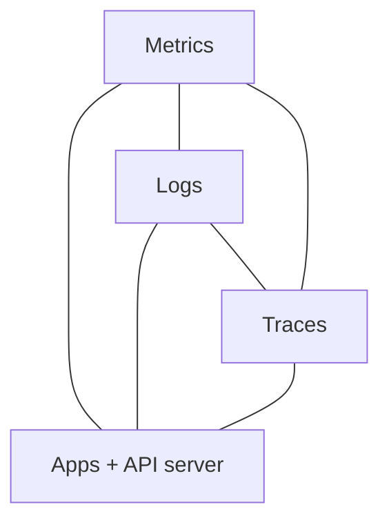
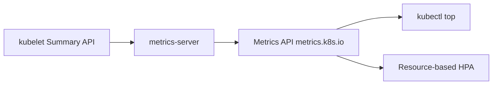
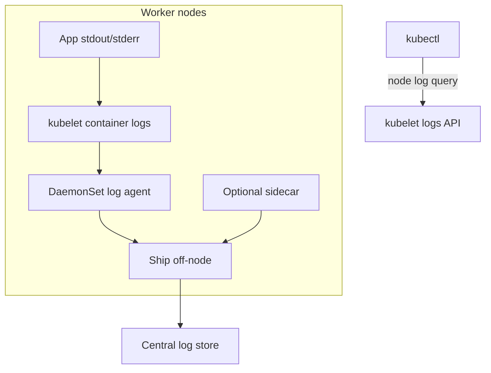
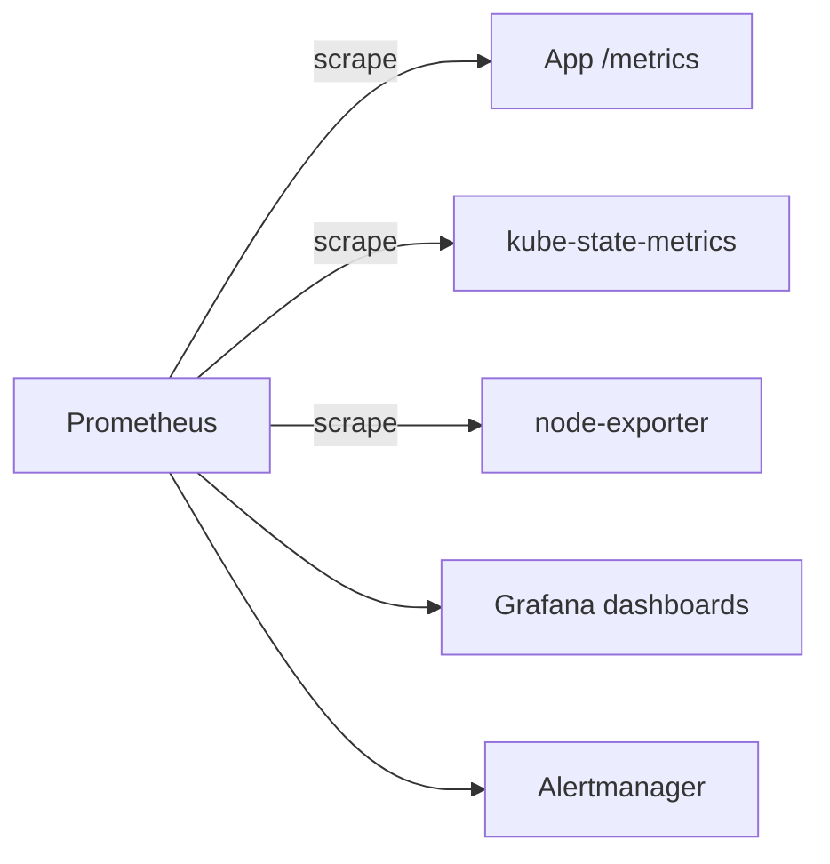
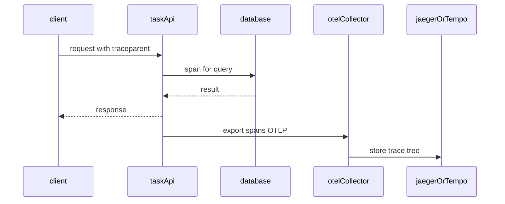

# Chapter 22 — Observability

> **Learning Objectives**
>
> By the end of this chapter, you will be able to:
>
> - Explain what metrics, logs, and traces each tell you, and when to reach for which
> - Install metrics-server and read resource usage with `kubectl top`
> - Run the Kubernetes Dashboard safely, or decide not to run it at all
> - Plan how logs get off the node, using agents, sidecars, and node log query
> - Describe how Prometheus and Grafana fit together as a metrics stack
> - Explain what OpenTelemetry does for tracing a request across services
> - Read PSI metrics (cgroup v2, GA in Kubernetes 1.36) to spot resource contention
> - Avoid the monitoring habits that leave blind spots or open security holes

---

## 22.1 Flying blind versus instrument panels

Nobody flies a passenger jet with tape over the gauges. Pilots cannot see the fuel level or the engine temperature from the cockpit window. They read instruments, and the instruments are what make the flight safe.


*Figure 22.A: Metrics, logs, and traces are the gauges that keep the cluster flight safe.*

Running software is the same. CPU spikes, memory leaks, containers that crash and restart, calls that take four seconds instead of forty milliseconds — none of that is visible from outside. **Observability** is the practice of making what happens inside a system visible from the outside, using three kinds of signal: **metrics**, **logs**, and **traces**.

Kubernetes hands you a few instruments for free. Events tell you what the cluster decided. Container logs capture what your app printed. The metrics APIs report CPU and memory usage. That is a start, not a panel.

Most teams add three more things. A metrics system, usually **Prometheus** for collecting numbers and **Grafana** for drawing them. A log pipeline that copies logs off the nodes before those nodes disappear. And eventually **OpenTelemetry** traces, which follow one request across every service it touches.

This chapter builds the mental model first and the tools second. Be warned about one thing up front: installing a dashboard is not the same as being able to answer questions during an outage.

---

## 22.2 The three pillars (Kubernetes flavor)

### In plain terms

The three pillars are three kinds of data, each answering a different kind of question. **Metrics** are numbers measured over time: how many requests per second, how much memory, how many errors. **Logs** are lines of text your program wrote describing what it was doing. **Traces** follow one single request as it moves through several services and record how long each hop took.

Why keep all three? Because each one is nearly useless for the other's job. A metric tells you the error rate jumped at 14:02, but not what the error said. A log line tells you the exact error, but not whether it happened once or ten thousand times. A trace tells you the request spent three seconds waiting on the database, which neither of the others would ever reveal.

Picture the cockpit again. Metrics are the gauges: altitude, fuel, speed. Logs are the pilot's written record of what happened and when. A trace is the flight path of one particular aircraft, from gate to gate, with the duration of every leg.

> 💡 **In one line:** Metrics tell you something is wrong, logs tell you what the error was, and traces tell you which hop was slow — you need all three.

The mistake to avoid is not choosing wrongly between them. It is collecting all of it, forever, with nobody responsible for any of it. Data nobody looks at is not observability. It is a bill.

> ⚠️ **Common Pitfall:** Collecting everything forever without owners or retention. Observability without an on-call consumer is expensive noise.

### Under the hood

Here is what each pillar answers and what you would install for it:

| Pillar | Questions answered | Typical tools |
|--------|--------------------|---------------|
| **Metrics** | How hot? How saturated? How many errors per second? | metrics-server, Prometheus, kube-state-metrics, PSI |
| **Logs** | What exactly happened in this request/process? | stdout/stderr, node log query, Loki/ELK, cloud logs |
| **Traces** | Where did time go across services? | OpenTelemetry, Jaeger, Tempo, cloud APM |



*Figure 22.1: Metrics, logs, and traces form a triangle around workloads and the Kubernetes API—each answers different questions.*

### In production

**Ownership:** The platform team runs the observability stack — the agents, the storage, and how long data is kept. App teams instrument their own code and own the dashboards that show their **SLIs** (service level indicators, the measured numbers such as error rate and latency that say whether a service is healthy).

**Failure mode:** A blind spot during an incident makes every outage last longer. Detect blind spots with checks that run continuously and with alerts that fire when an expected scrape stops arriving. Prevent them by agreeing on a minimum set of signals every service must emit: request rate, error rate, and duration, plus structured logs carrying a trace ID.

> 🏭 **Production floor:** Page on symptoms users feel (error rate, latency SLO burn), not on every CPU blip. An alert without a runbook owner is noise.

| Do | Don't |
|----|-------|
| Define SLIs before fancy dashboards | Equate more metrics with better ops |
| Propagate trace IDs into logs | Ship PII in cleartext logs |
| Alert on symptoms users feel | Alert on every CPU blip |

**Before you leave this section**

- **Understand:** Metrics, logs, and traces answer different questions; use them together.
- **Try:** Open your cluster metrics API / dashboard and find one Pod CPU series.
- **Watch in prod:** Alert fatigue and dashboards nobody owns.


---

## 22.3 metrics-server: resource metrics for the control plane

### In plain terms

**metrics-server** is a small component that asks every kubelet how much CPU and memory each Pod is using right now, and publishes those numbers through the **Metrics API**. It keeps only the most recent readings. Nothing is stored for later.

Why does that matter? Because two things you use constantly depend on it and nothing else. `kubectl top`, which shows current usage, reads from this API. So does the **Horizontal Pod Autoscaler** when it scales on CPU or memory. If metrics-server is down, `kubectl top` returns an error and your autoscaler stops adjusting, silently.

Think of metrics-server as the live gauge on the dashboard. It shows the needle right now. It is not the flight recorder. Historical graphs, week-over-week comparisons, and alert rules all need Prometheus or a cloud metrics service instead. The two are not competitors; they do different jobs with different storage.

This distinction is worth remembering when an autoscaler misbehaves. If you go straight to Prometheus and your Grafana graphs look fine, you can lose an hour before noticing that the API the autoscaler actually reads has been unavailable the whole time.

> ⚠️ **Common Pitfall:** Debugging HPA with Prometheus while metrics-server is down. HPA resource metrics need the Metrics API.

### Under the hood

Here is how you install it and what it gives you:

```bash
$ kubectl apply -f https://github.com/kubernetes-sigs/metrics-server/releases/latest/download/components.yaml
```

On local clusters you may need flags such as `--kubelet-insecure-tls`—follow current metrics-server docs for your environment.

```bash
$ kubectl top nodes
NAME       CPU(cores)   CPU%   MEMORY(bytes)   MEMORY%
worker-1   120m         6%     1200Mi          35%
worker-2   80m          4%     900Mi           28%

$ kubectl top pods -n tasks
NAME                        CPU(cores)   MEMORY(bytes)
task-api-6d7f8c9b5d-xk2m9   15m          64Mi
task-api-6d7f8c9b5d-qw8pz    12m          58Mi
```

> ⚠️ **Common Pitfall:** HPA on CPU/memory will not work without a functioning Metrics API. If `kubectl top` fails, fix metrics-server before debugging HPA formulas.

> 💡 **Tip:** metrics-server is **not** long-term metrics storage. Historical graphs need Prometheus (or a cloud metrics backend).



*Figure 22.2: metrics-server scrapes kubelets and exposes the Metrics API used by `kubectl top` and CPU/memory HPA.*

### In production

**Ownership:** The platform team keeps metrics-server healthy. App teams own the autoscaler targets that depend on it.

**Failure mode:** When metrics-server is down, `kubectl top` fails and every CPU or memory autoscaler stops adjusting. Detect it with a probe that calls the Metrics API directly. Reduce the risk with alerts on the metrics-server Deployment and a PodDisruptionBudget so maintenance cannot take it out entirely.

| Do | Don't |
|----|-------|
| Alert on Metrics API availability | Use metrics-server as long-term TSDB |
| Size for node count growth | Ignore scrape failures on NotReady nodes |

**Before you leave this section**

- **Understand:** metrics-server powers top/HPA resource metrics, not historical analytics.
- **Try:** Run `kubectl top nodes` and `kubectl top pods -A` on a healthy cluster.
- **Watch in prod:** HPA stuck after metrics-server outages.


---

## 22.4 Kubernetes Dashboard: powerful and easy to misuse

### In plain terms

The **Kubernetes Dashboard** is an optional web interface for the cluster. It lists workloads, shows logs, and lets you edit objects from a browser.

Why does a convenience tool need a warning? Because of what it runs as. The Dashboard talks to the API server using its own ServiceAccount, and whatever that account is allowed to do, anyone who reaches the page can do. Bind it to `cluster-admin` and put it on a public address, and you have published a full-privilege terminal with a friendly interface in front of it.

The safe version is not complicated. Give it read-only rights. Put a real login in front of it, using your company sign-on. Keep it on a private network or behind a VPN. Plenty of production teams skip it entirely and use Grafana for viewing and Git for changing, which removes the question altogether.

> ⚠️ **Common Pitfall:** Exposing Dashboard with a privileged ServiceAccount on a public LoadBalancer “for convenience.”

### Under the hood

Here are the rules that keep it safe:

1. Prefer **read-only** RBAC bindings for dashboard users
2. Do not expose the Dashboard on a public LoadBalancer without strong auth
3. Prefer authenticated reverse proxies, VPN, or cloud IAM integrations
4. On learning clusters, use `kubectl proxy` temporarily rather than permanent NodePorts
5. Many production teams skip Dashboard entirely and use Grafana + GitOps UIs

```bash
$ kubectl apply -f https://raw.githubusercontent.com/kubernetes/dashboard/v2.7.0/aio/deploy/recommended.yaml
# Pin a release you trust and read its install guide—versions change

$ kubectl -n kubernetes-dashboard create token admin-user
$ kubectl proxy
Starting to serve on 127.0.0.1:8001
```

### In production

**Ownership:** The platform team decides whether the Dashboard exists at all and how people log in to it. Never keep a shared admin token in a wiki page.

**Failure mode:** A stolen Dashboard session becomes a cluster takeover. Detect it by auditing what the Dashboard's ServiceAccount does and by reading the ingress access logs. Prevent it with company sign-on, tokens that expire quickly, read-only permissions, and exposure on a private network only.

| Do | Don't |
|----|-------|
| SSO + least-privilege SA | cluster-admin token in a bookmark |
| Private network or VPN only | Public LB without authn/z |

**Before you leave this section**

- **Understand:** Dashboard is optional convenience with high blast radius if mis-bound.
- **Try:** If installed, inspect its ServiceAccount RoleBindings.
- **Watch in prod:** Privileged UI exposure and shared admin tokens.


---

## 22.5 Logging architecture and node log query

### In plain terms

Logging in Kubernetes follows one rule: your application prints to **stdout** and **stderr**, the two output streams every program already has, and the platform takes it from there. The kubelet writes those streams to files on the node, and `kubectl logs` reads them back.

Why not have your app write its own log files, or send them somewhere itself? Because the node holding those files can disappear at any moment. A node gets replaced during an upgrade and everything on its disk goes with it, including the evidence you needed. Printing to stdout lets one agent on each node copy every container's output to central storage automatically, with no cooperation from your code.

That is why logging into a machine to read a log file does not scale. It works for one node in a lab. It fails the first time the node that had your error is already gone.

Kubernetes also has an answer for the logs the platform itself produces. **Node log query**, stable in Kubernetes **1.36**, lets you read selected system logs — kubelet's own output, for example — through the API server instead of opening a shell on the machine.

One caution about all of this. Everything your app prints ends up in a searchable store that many people can read. Print a token or a customer's personal data and you have copied a secret into a system that was never designed to hold one.

> ⚠️ **Common Pitfall:** Logging secrets (tokens, PAN data) to stdout. Treat log pipelines as sensitive data stores.

### Under the hood

Here are the commands and the collection patterns:

```bash
$ kubectl logs deploy/task-api -n tasks --tail=100
$ kubectl logs task-api-6d7f8c9b5d-xk2m9 -c api -n tasks --previous
```

`--previous` shows logs from the last terminated container—gold for CrashLoopBackOff.

**Collection patterns:**

1. **Node agent / DaemonSet** (most common): Fluent Bit, Fluentd, or Vector on every node
2. **Sidecar**: helper container for apps that only write files
3. **Direct app ship**: SDKs push to a backend (use sparingly)

```yaml
apiVersion: v1
kind: Pod
metadata:
  name: task-api-with-log-sidecar
  namespace: tasks
spec:
  containers:
    - name: api
      image: ghcr.io/mastering-k8s/task-api:1.1
      volumeMounts:
        - name: applogs
          mountPath: /var/log/task-api
    - name: log-shipper
      image: fluent/fluent-bit:3.0
      volumeMounts:
        - name: applogs
          mountPath: /var/log/task-api
          readOnly: true
  volumes:
    - name: applogs
      emptyDir: {}
```

**Node log query** (kubelet must allow it; GA/locked on in 1.36 when platform-enabled):

```bash
$ kubectl get --raw "/api/v1/nodes/worker-1/proxy/logs/?query=kubelet"
```

Use this to inspect kubelet or other permitted system services without SSH. Access is still gated by RBAC on the node proxy/logs subresource—treat it as privileged.



*Figure 22.3: Node agents (DaemonSets) ship container logs centrally; sidecars help file-only apps; node log query reaches kubelet without SSH.*

### In production

**Ownership:** The platform team runs the agents, the search indexes, and the retention rules. App teams decide which fields their logs contain and which values must be removed before printing. During an incident, search by trace ID, by Pod, or by Deployment revision.

**Failure mode:** When a log agent dies, you lose visibility on that node and nothing tells you. Detect it by alerting when a namespace stops producing the volume of logs it normally produces. Reduce the risk with health alerts on the agent DaemonSet and with buffering that behaves sensibly when the node disk fills up.

| Do | Don't |
|----|-------|
| Structured logs + correlation IDs | SSH as the primary log path |
| Retention matched to compliance | Infinite retention of everything |

**Before you leave this section**

- **Understand:** Centralize stdout logs; correlate with traces and Events.
- **Try:** Find one Task API log line in your platform’s log UI.
- **Watch in prod:** Missing logs during node disk pressure.


---

## 22.6 Events and probes as signals

Do not ignore first-class Kubernetes signals:

```bash
$ kubectl get events -n tasks --sort-by=.lastTimestamp
$ kubectl describe pod task-api-6d7f8c9b5d-xk2m9 -n tasks
```

FailedScheduling, OOMKilled, Unhealthy probes, and FailedMount often explain outages before you open Grafana. Instrument apps with readiness/liveness/startup probes ([Chapter 13](13-pods-the-fundamental-unit.md)) so orchestration and observability agree on “healthy.”

---

## 22.7 Prometheus and Grafana

### In plain terms

**Prometheus** is a metrics database that goes and fetches its own data. On a schedule, it calls an HTTP endpoint on each target, reads the current numbers, and stores them with a timestamp. That repeated fetch is called a **scrape**. **Grafana** is the tool that draws those stored numbers as graphs.

Why is scraping the design? Because it means your application does not need to know where the monitoring system lives, or handle retries, or buffer during an outage. Your app just exposes a page of current numbers at `/metrics` and forgets about it. Prometheus does the rest, and if Prometheus is down, your app is unaffected.

Two helpers complete the picture. **kube-state-metrics** turns the state of Kubernetes objects into numbers, so you can graph how many Deployment replicas are unavailable. A node exporter does the same for the machines themselves.

Prometheus is not your only early-warning system, though. Kubernetes **Events** — short records the cluster attaches to objects — often name the problem before any graph moves. `FailedScheduling`, `OOMKilled`, and `Unhealthy` are all Events. So are the results of your probes, the periodic health checks the kubelet runs against each container.

Two warnings about those signals. Events are not permanent; the cluster discards them after a few hours, so export the ones that matter. And probe failures deserve attention before users complain, because a **liveness probe** that is too aggressive will restart perfectly healthy Pods over and over.

> ⚠️ **Common Pitfall:** Ignoring probe failures until users page you. Liveness flapping can kill healthy Pods.

### Under the hood

Here is what a full metrics stack contains. Typical components (often installed via Helm—[Chapter 23](23-helm.md)):

- Prometheus (or Grafana Mimir / managed Prometheus)
- kube-state-metrics — object state as metrics
- node-exporter (or equivalent) — node OS/hardware metrics
- Grafana dashboards and Alertmanager

Application metrics:

```text
http_requests_total{method="GET",path="/tasks",status="200"} 1240
```

```yaml
metadata:
  annotations:
    prometheus.io/scrape: "true"
    prometheus.io/port: "8000"
    prometheus.io/path: "/metrics"
```

(Exact discovery depends on your Prometheus configuration—annotations are a common beginner pattern; operators prefer PodMonitor/ServiceMonitor CRDs.)



*Figure 22.4: Prometheus scrapes workloads and cluster exporters; Grafana visualizes series and Alertmanager routes pages.*

> 📘 **Deep Dive (optional):** Alertmanager routes alerts to Slack, PagerDuty, email. Good alerts are symptom-based (“error rate high”) rather than “pod restarted once.”

### In production

**Ownership:** App teams design their own probes, because only they know what "healthy" means for their service. The platform team runs the exporters that keep Events beyond their normal lifetime. Detect trouble with metrics on probe failures and alerts on CrashLoopBackOff Events.

**Failure mode:** A liveness probe that is too strict causes restart storms — healthy Pods killed and restarted in a loop. Prevent it by keeping liveness checks generous and shallow, by using a separate readiness probe to control traffic, and by running probes under load in staging before production sees them.

| Do | Don't |
|----|-------|
| Readiness for traffic; liveness for deadlocks | Liveness that hits a dependent database |
| Export important Events | Rely on `kubectl get events` hours later |

**Before you leave this section**

- **Understand:** Events and probes are early warning; Events are ephemeral.
- **Try:** Describe a Pod and map Events to a failure mode.
- **Watch in prod:** Restart storms from aggressive liveness probes.


---

## 22.8 Traces and OpenTelemetry overview

### In plain terms

A **distributed trace** is the recorded journey of one request through your system. Each piece of work along the way — the API handler, the database query, the cache lookup — is recorded as a **span**, a timed segment with a start, an end, and a label. All the spans from one request share the same trace ID, so they can be assembled into a tree afterward.

Why is this its own tool? Because when a request takes four seconds, the logs cannot tell you where those seconds went. Each service logs that it handled the request. None of them logs that it spent 3.8 seconds waiting for the one downstream. Only a trace puts the timings side by side and points at the culprit.

Think of a baggage tag. Your suitcase passes through four airports, and each one scans the tag on arrival and departure. At the end, you can see exactly where it sat for six hours.

**OpenTelemetry**, usually shortened to **OTel**, is the open standard for producing this data. It matters because it is not tied to any vendor. You instrument your code once, and you can send the results to Jaeger, to Grafana Tempo, or to a commercial service, changing only a configuration line.

One practical warning before you start. Recording every single request is affordable in a demo and ruinous in production. Decide early which fraction to keep, using **sampling** — a rule that stores some traces and discards the rest.

> ⚠️ **Common Pitfall:** 100% sampling in production without a plan—cost and noise explode. Start with head/tail sampling strategies.

### Under the hood

Here are the pieces and how a span reaches a backend:

- **Trace** — one end-to-end request
- **Span** — a unit of work (HTTP handler, DB query) with timestamps and attributes
- **Context propagation** — W3C `traceparent` (or similar) headers carry IDs across services
- **Collector** — OpenTelemetry Collector receives, processes, and exports to Jaeger, Tempo, cloud APM, and so on

Minimal application posture for the Task API:

1. Instrument the HTTP server with an OTel SDK or auto-instrumentation for Python
2. Propagate context on outbound calls
3. Export via OTLP to a Collector DaemonSet or Gateway
4. Visualize in Jaeger/Tempo/Grafana

Conceptual Collector pipeline (values vary by chart):

```yaml
# Conceptual — install via an OpenTelemetry Collector chart in real clusters
receivers:
  otlp:
    protocols:
      http:
      grpc:
exporters:
  otlp:
    endpoint: tempo.observability.svc:4317
service:
  pipelines:
    traces:
      receivers: [otlp]
      exporters: [otlp]
```



*Figure 22.5: OpenTelemetry propagates context across hops; the Collector exports the span tree to a tracing backend.*

Correlate with logs by injecting the trace ID into structured log lines.

### In production

**Ownership:** The platform team runs the collectors and the tracing backend. App teams instrument their code and make sure the trace ID is passed along on every outbound call.

**Failure mode:** When one service fails to pass the trace ID along, the spans after it lose their parent and become orphans that explain nothing. Detect it by checking whether traces arrive complete. Prevent it with a shared library that every service uses and with instrumentation at the gateway so at least the entry point is always covered.

| Do | Don't |
|----|-------|
| Propagate W3C trace context | Sample 100% forever in prod |
| Tie traces to deploy digests | Instrument only one service in a chain |

**Before you leave this section**

- **Understand:** Traces explain slow paths; sample thoughtfully; propagate context.
- **Try:** Generate one request and find its trace if OTel is enabled.
- **Watch in prod:** Orphan spans after mesh/ingress changes.


---

## 22.9 PSI metrics (cgroup v2, GA in 1.36)

### In plain terms

**PSI** stands for **Pressure Stall Information**. It is a Linux measurement of how much time your processes spent *waiting* for a resource instead of doing work. It covers CPU, memory, and disk. It became generally available in Kubernetes **1.36**, and it requires nodes running **cgroup v2**, the newer Linux system for grouping and limiting a container's resources.

Why is waiting time worth measuring separately? Because usage percentage hides it. A container sitting at 50% CPU sounds comfortable. But if it spends half of every second queued behind other containers waiting for a turn on the processor, your users feel that delay and your CPU graph never moves. Usage tells you how much of the resource you got. PSI tells you how much you asked for and did not get.

Think of a busy road. Traffic volume is utilization: how many cars passed. Time stuck at the light is pressure. A road can carry a modest number of cars and still make everyone late.

This is why an alert built only on CPU percentage can stay quiet through a latency incident that customers are already complaining about. Graph pressure next to usage, not instead of it.

> ⚠️ **Common Pitfall:** Alerting only on utilization and missing stall-time saturation that users already feel.

### Under the hood

Here is what has to be true before PSI numbers appear:

- Linux kernel 4.20+ with PSI enabled (not booted with `psi=0`)
- **cgroup v2**
- Kubernetes 1.36+ kubelet PSI support (stable; no feature-gate opt-in required on 1.36)

Metrics appear in the kubelet Summary API and Prometheus-style `/metrics/cadvisor` endpoints (`container_pressure_*` families).

```bash
$ NODE=$(kubectl get nodes -o jsonpath='{.items[0].metadata.name}')
$ kubectl get --raw "/api/v1/nodes/${NODE}/proxy/stats/summary" | \
  jq '.pods[].containers[] | select(.name=="api") | {name, cpu:.cpu.psi, memory:.memory.psi, io:.io.psi}'
```

Interpret `some` versus `full` pressure averages (10s / 60s / 5m): sustained high pressure is a contention signal worth alerting on—even when utilization charts look “fine.”

> 💡 **Tip:** PSI complements, not replaces, classic CPU/memory metrics. Use both when diagnosing noisy neighbors and false “plenty of headroom” assumptions.

### In production

**Ownership:** The platform team turns PSI on wherever the kubelet and cgroup v2 support it. App teams add a pressure panel next to every usage panel on their dashboards.

**Failure mode:** Hidden waiting time burns your latency target while every CPU alert stays green. Detect it by reading PSI and latency together rather than either alone. Fix it by giving the workload the resources it actually needs and by moving the noisy neighbors that are competing with it.

| Do | Don't |
|----|-------|
| Pair PSI with latency SLIs | Replace all utilization alerts blindly |
| Confirm cgroup v2 on nodes | Assume PSI on every distro without checking |

**Before you leave this section**

- **Understand:** PSI reveals stall pressure; use it with classical metrics.
- **Try:** Find whether your nodes expose PSI and plot one signal.
- **Watch in prod:** Latency burn without CPU alerts.


---

## 22.10 A practical observability starter kit

For the Task API in production-minded labs:

1. Confirm metrics-server: `kubectl top pods`
2. Structured JSON logs to stdout (request ID, latency, status)
3. `kubectl logs` + a DaemonSet log shipper if you have a backend
4. Expose Prometheus metrics for request rate, errors, duration
5. Import a Grafana dashboard for Deployment CPU/memory and app SLIs
6. Add OTel traces for multi-hop paths when latency debugging stalls
7. On cgroup v2 nodes, graph PSI alongside utilization
8. Alert on high error rate and sustained elevated latency—not on every restart

---

## 22.11 Common pitfalls

> ⚠️ **Common Pitfall:** Assuming `kubectl logs` history lasts forever. Node log rotation drops old data.

> ⚠️ **Common Pitfall:** Scraping every Pod without cardinality budgets.

> ⚠️ **Common Pitfall:** Metrics without requests/limits context—200Mi used against a 256Mi limit is an OOM waiting to happen.

> ⚠️ **Common Pitfall:** Equating “Dashboard installed” with “observability done.”

> ⚠️ **Common Pitfall:** Alerting on raw CPU% alone while ignoring PSI contention on busy nodes.

---

## 22.12 Hands-on exercises

1. **metrics-server.** Run `kubectl top nodes` and `kubectl top pods -A`. Repair if needed.
2. **App logs.** Generate traffic and fetch logs with `kubectl logs deploy/task-api --tail=50`. Use `--previous` after a crash.
3. **Events.** Break a ConfigMap reference in a scratch env and watch Events explain the failure.
4. **Node log query.** If enabled on your cluster, query kubelet logs via the node proxy logs API and note the RBAC required.
5. **Metrics endpoint.** Expose `/metrics` on Task API (or a demo exporter) and verify a scrape.
6. **PSI check.** On a cgroup v2 node, pull Summary API PSI fields for a container. If absent, document why (OS/cgroup).

---

## 22.13 Check Your Understanding

**Q1.** What API does metrics-server provide, and what everyday command depends on it?

<details>
<summary>Show answer</summary>

The **Metrics API** (`metrics.k8s.io`). `kubectl top` (and resource-based HPA) depend on it.

</details>

**Q2.** Why is metrics-server insufficient as your only metrics system?

<details>
<summary>Show answer</summary>

It stores only recent resource usage for operational APIs—not long-term retention, rich app metrics, or flexible alerting.

</details>

**Q3.** Where should twelve-factor style apps write logs in Kubernetes?

<details>
<summary>Show answer</summary>

**stdout/stderr**, so kubelet and log agents can collect them uniformly.

</details>

**Q4.** What does OpenTelemetry primarily standardize for distributed systems?

<details>
<summary>Show answer</summary>

Vendor-neutral **telemetry**—especially **traces** (and also metrics/logs)—including context propagation and export via collectors to backends such as Jaeger or Tempo.

</details>

**Q5.** What do PSI metrics measure that simple CPU utilization may miss, and what OS requirement applies?

<details>
<summary>Show answer</summary>

PSI measures **time tasks spend stalled** waiting for CPU, memory, or I/O under contention. It requires **cgroup v2** (and a supporting Linux kernel). It became **GA in Kubernetes 1.36**.

</details>

---

## 22.14 Key takeaways

- Metrics say something broke. Logs say what it said. Traces say which hop was slow.
- Collect only what someone will act on. Unowned data is a bill, not a signal.
- metrics-server powers `kubectl top` and CPU autoscaling. It stores no history.
- Print to stdout. An agent on each node ships it before the node disappears.
- Never treat logging into a node as your log strategy. That node will be gone.
- Events name the problem before any graph moves, and they expire in hours.
- A liveness probe that is too strict restarts healthy Pods in a loop.
- Sample your traces. Keeping every request is affordable only in a demo.
- Usage says how much you got. PSI says how long you waited. Graph both.
- Alert on what users feel: errors and latency. Not on every CPU spike.

---

## 22.15 Official documentation map

| Topic | Official page |
|-------|---------------|
| Tools for Monitoring | [Tools for Monitoring Resources](https://kubernetes.io/docs/tasks/debug/debug-cluster/resource-metrics-pipeline/) |
| Metrics Server | [Kubernetes Metrics Server](https://github.com/kubernetes-sigs/metrics-server) |
| Logging Architecture | [Logging Architecture](https://kubernetes.io/docs/concepts/cluster-administration/logging/) |
| System Logs / node log query | [System Logs](https://kubernetes.io/docs/concepts/cluster-administration/system-logs/) |
| Node metrics / PSI | [Node metrics data](https://kubernetes.io/docs/reference/instrumentation/node-metrics/) |
| PSI GA blog | [PSI Metrics GA](https://kubernetes.io/blog/2026/05/12/kubernetes-v1-36-psi-metrics-ga/) |
| OpenTelemetry | [OpenTelemetry](https://opentelemetry.io/docs/) |
| Prometheus | [Prometheus](https://prometheus.io/docs/introduction/overview/) |

**Previous:** [Chapter 21 — RBAC and Security](21-rbac-and-security.md) | **Next:** [Chapter 23 — Helm](23-helm.md)
