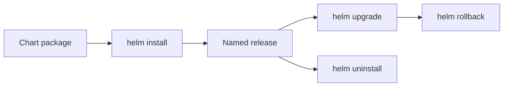
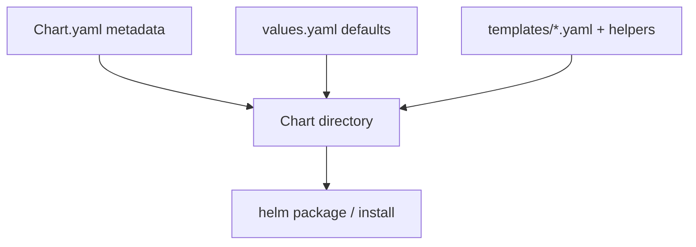
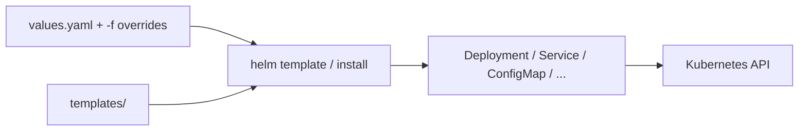
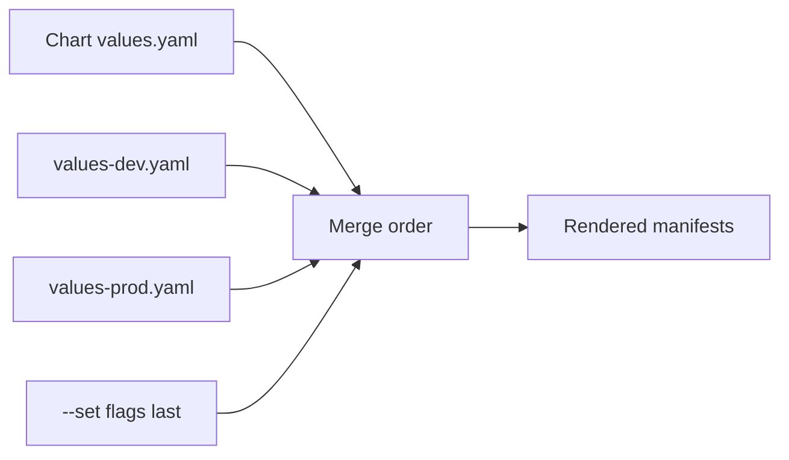
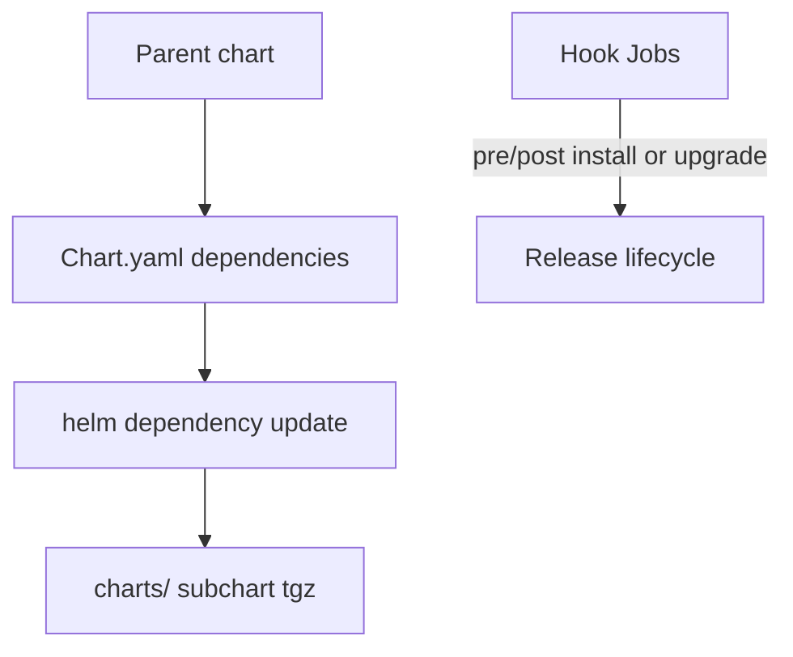

# Chapter 23 — Helm

> **Learning Objectives**
>
> By the end of this chapter, you will be able to:
>
> - Explain what a Helm chart, a values file, and a release each are
> - Install charts from a repository, then upgrade and remove what you installed
> - Read a template and change its settings with `values.yaml`
> - Build a working chart for the Python Task API
> - Upgrade, roll back, and uninstall a release without guessing
> - Avoid the templating and version mistakes that bite people later

---

## 23.1 Shipping furniture flat-packed

A flat-pack furniture company does not ship a fully built kitchen for every apartment. They ship a box of parts, an instruction booklet, and a few choices: which handles, which finish, how many drawers. You assemble it to fit your own space.


*Figure 23.A: Charts are flat-pack kits; values.yaml chooses the finish before assembly.*

**Helm** is the package manager for Kubernetes, and it works exactly that way. A **chart** is the box of parts: YAML for Deployments, Services, ConfigMaps, and anything else the app needs, with blanks left where the choices go. **Values** are the choices you fill in. A **release** is one assembled installation of a chart, running in a cluster under a name you picked.

Why does this exist? Because the alternative is copying the same YAML into a dev folder, a staging folder, and a production folder, then editing three replica counts and three image tags by hand every time something changes. One chart with three small values files replaces all of it.

Be clear about one thing, though. Helm does not save you from learning Kubernetes. It writes the manifests; you still own what comes out. When a rollout fails, you will be reading a Deployment, not a chart.

---

## 23.2 Core vocabulary

### In plain terms

Helm stops feeling like magic once five words are clear. A **chart** is a folder of Kubernetes YAML with blanks in it. **Values** are what you put in the blanks. A **release** is one installed copy of a chart, running in a cluster under a name. A **repository** is a web address you can download charts from. A **template** is one of those files with blanks, written in a language Helm knows how to fill in.

Why insist on the vocabulary before the commands? Because the three that matter most are easy to blur together, and every Helm error message assumes you have them straight. A chart is a *thing on disk*. A release is a *thing in the cluster*. You can install the same chart three times under three release names and get three independent copies.

> 💡 **In one line:** A chart is the package on disk, values are the settings you choose, and a release is one named installation of that chart running in your cluster.

The follow-on rule saves real pain. Once a release exists, Helm believes it owns those objects. Edit one of them by hand with `kubectl edit` and your change lives only in the cluster, not in the chart. The next upgrade renders from the chart again and quietly puts it back.

> ⚠️ **Common Pitfall:** Editing live objects with kubectl and wondering why the next `helm upgrade` fights you. Know what Helm manages.

### Under the hood

Here are the five terms with their precise meanings:

| Term | Meaning |
|------|---------|
| **Chart** | Directory (or package) with templates, default values, and metadata |
| **Values** | Configuration knobs (`replicaCount`, `image.tag`, …) |
| **Release** | A named installation of a chart (with its own revision history) |
| **Repository** | HTTP index of charts (Artifact Hub, Bitnami, your org’s chart museum) |
| **Template** | Go template files that render into Kubernetes manifests |

```bash
$ helm version
version.BuildInfo{Version:"v3.16.x", GitCommit:"...", ...}
```

This book assumes **Helm 3** (no Tiller). Releases are stored as Secrets or ConfigMaps in the cluster.



*Figure 23.1: A release is a versioned installation of a chart—install, upgrade, roll back, or uninstall as a unit.*

### In production

**Ownership:** The platform team may host an internal repository of approved charts. App teams own their own values files and the release name they use in each environment.

**Failure mode:** An upgrade changes something nobody expected, and the service breaks. Detect it by comparing what Helm thinks it installed (`helm get manifest`) against what is actually in the cluster. Prevent it by keeping every change in Git and by forbidding `kubectl edit` on fields a chart owns.

> 🏭 **Production floor:** Never treat `kubectl edit` as the change record for a Helm-owned object. Paste chart version, release revision, and rendered digest into the incident ticket.

| Do | Don't |
|----|-------|
| Treat rendered YAML as the contract | Hand-edit Helm-managed fields in prod |
| One release name per env/app | Reuse release names across clusters carelessly |

**Before you leave this section**

- **Understand:** Chart / release / values are the core nouns; Helm renders Kubernetes objects.
- **Try:** Run `helm list -A` and inspect one release’s chart version.
- **Watch in prod:** Drift between Helm releases and kubectl edits.


---

## 23.3 Install, list, upgrade, rollback

### In plain terms

A release has a life cycle with four commands. `helm install` creates it. `helm upgrade` changes it. `helm rollback` returns it to how it looked before. `helm uninstall` removes it.

Why is that better than applying YAML yourself? Because Helm keeps a numbered history. Every install and every upgrade becomes a **revision**, and Helm remembers exactly what it rendered for each one. That means going back is a single command with a number, not an archaeology project through Git at two in the morning. It also means the revision number is evidence you can paste into an incident ticket.

Be precise about what rollback covers. It restores the Kubernetes objects Helm manages: the Deployment, the ConfigMap, the Service. It does not reach into your database and undo a schema migration, and it does not restore the contents of a volume. Configuration goes back. Data does not.

> ⚠️ **Common Pitfall:** Upgrading with untested values in prod without `--atomic` or a canary environment.

### Under the hood

Here is the full cycle, from adding a repository to removing the release:

```bash
$ helm repo add bitnami https://charts.bitnami.com/bitnami
$ helm repo update
Hang tight while we grab the latest from your chart repositories...
Update Complete. ⎈Happy Helming!⎈

$ helm search repo bitnami/nginx
NAME            CHART VERSION   APP VERSION     DESCRIPTION
bitnami/nginx   18.x.x          1.27.x          NGINX Open Source is a web server...

$ helm install my-nginx bitnami/nginx --namespace web --create-namespace
NAME: my-nginx
LAST DEPLOYED: Sat Jul 25 22:40:00 2026
NAMESPACE: web
STATUS: deployed
REVISION: 1
```

Day-2 operations:

```bash
$ helm list -n web
NAME      NAMESPACE  REVISION  STATUS    CHART         APP VERSION
my-nginx  web        1         deployed  nginx-18.x.x  1.27.x

$ helm upgrade my-nginx bitnami/nginx -n web --set replicaCount=3
$ helm rollback my-nginx 1 -n web
$ helm uninstall my-nginx -n web
```

> 💡 **Tip:** Prefer declarative values files over long `--set` chains for anything you will reuse:

```bash
$ helm upgrade --install task-api ./charts/task-api -n tasks -f values-prod.yaml
```

### In production

**Ownership:** App teams raise the pull request for every upgrade. The platform team keeps the chart repository reachable and controls who is allowed to deploy.

**Failure mode:** A bad upgrade leaves a broken rollout. Detect it through the release status and through the service's own error and latency signals. Reduce the damage with `--atomic`, which rolls the release back automatically if the upgrade does not become healthy, with a soak period in staging, and by writing the last known-good revision number into the change ticket before you start.

| Do | Don't |
|----|-------|
| Stage values; use atomic upgrades | Skip `helm history` before rollback |
| Paste revision + chart version in incidents | Force upgrades that leave failed releases |

**Before you leave this section**

- **Understand:** Upgrade/rollback are change-safety tools; history is evidence.
- **Try:** Install a chart, upgrade values, rollback, and read `helm history`.
- **Watch in prod:** Failed releases left uncleaned; untested prod values.


---

## 23.4 Anatomy of a chart

### In plain terms

A chart is just a directory with three important parts. `Chart.yaml` holds the name and version. `values.yaml` holds the default settings. The `templates/` folder holds the files with blanks that become real Kubernetes objects. There is an optional fourth part, a `charts/` folder, which holds other charts this one depends on.

Why should you care about the layout? Because the split tells you where to make a change. Something that differs between staging and production belongs in values. Something that is the same everywhere belongs in the template. Get that boundary wrong and you end up with a template full of conditional logic that nobody can read.

Now the part that matters most and gets the least attention: the defaults. Whatever is in `values.yaml` is what someone gets when they install your chart without thinking. If the default image tag is `latest`, every install is unpredictable. If the default has no resource limits and runs as root, you have shipped an insecure workload with a friendly interface on it. Make the defaults the safe choice, and let people opt into the loose ones.

> ⚠️ **Common Pitfall:** Shipping `latest` image tags as chart defaults for production profiles.

### Under the hood

Here is the layout of a real chart, file by file:

```text
task-api/
├── Chart.yaml          # name, version, appVersion
├── values.yaml         # default configuration
├── templates/
│   ├── deployment.yaml
│   ├── service.yaml
│   ├── configmap.yaml
│   ├── ingress.yaml
│   ├── serviceaccount.yaml
│   ├── _helpers.tpl    # named template helpers
│   └── NOTES.txt       # post-install message
└── .helmignore
```

```yaml
# Chart.yaml
apiVersion: v2
name: task-api
description: Helm chart for the Task API example application
type: application
version: 0.1.0
appVersion: "1.1.0"
```

```yaml
# values.yaml
replicaCount: 2

image:
  repository: ghcr.io/mastering-k8s/task-api
  tag: "1.1.0"
  pullPolicy: IfNotPresent

service:
  type: ClusterIP
  port: 80
  targetPort: 8000

config:
  logLevel: info
  greeting: "Hello from Helm"

ingress:
  enabled: false
  className: nginx
  host: tasks.example.com

resources:
  requests:
    cpu: 100m
    memory: 128Mi
  limits:
    cpu: 500m
    memory: 256Mi

serviceAccount:
  create: true
  name: ""
```



*Figure 23.2: A chart bundles metadata, default values, and Go templates that render into Kubernetes manifests.*

### In production

**Ownership:** Whoever writes the chart owns the defaults, including resource requests and the security context. Whoever installs it overrides only what their environment needs.

**Failure mode:** Loose defaults put privileged Pods into production, because nobody read the values file before installing. Detect it by scanning the rendered manifests against your policies. Prevent it by running `helm template` in CI and piping the output into a validator such as kubeconform or Kyverno.

| Do | Don't |
|----|-------|
| Safe production-ready defaults | Privileged defaults “for easier demos” |
| Document required values | Undocumented required secrets in templates |

**Before you leave this section**

- **Understand:** Charts are files + templates + values; defaults are a security decision.
- **Try:** Render a chart with `helm template` and read the Deployment.
- **Watch in prod:** Charts with unsafe defaults reaching prod.


---

## 23.5 Templates: from values to YAML

### In plain terms

A **template** is a manifest with blanks in it. Helm takes the chart's default values, layers your values on top, fills every blank, and sends the finished YAML to Kubernetes as one release.

Why keep templates simple? Because a template is code that produces the thing you actually run, and nobody reviews it as carefully as they would review code. The more branching and looping you put in, the harder it becomes to answer the only question that matters during an incident: what did this actually generate? Put the choices in values, keep the naming and label logic in one shared helper file, and let the templates stay boring.

One rule is worth stating flatly: templates must be **deterministic**, meaning the same inputs always produce the same output. It is tempting to generate a random password in a template so nobody has to supply one. But a template runs again on every upgrade, and it will produce a *different* random value each time. Your database password silently rotates during an unrelated config change, and the app cannot log in anymore.

> ⚠️ **Common Pitfall:** Using `{{ randAlphaNum }}` for Secret data on every upgrade—rotates credentials unintentionally.

### Under the hood

Here is a full set of templates for the Task API, starting with the Deployment:

```gotemplate
# templates/deployment.yaml
apiVersion: apps/v1
kind: Deployment
metadata:
  name: {{ include "task-api.fullname" . }}
  labels:
    {{- include "task-api.labels" . | nindent 4 }}
spec:
  replicas: {{ .Values.replicaCount }}
  selector:
    matchLabels:
      {{- include "task-api.selectorLabels" . | nindent 6 }}
  template:
    metadata:
      labels:
        {{- include "task-api.selectorLabels" . | nindent 8 }}
    spec:
      serviceAccountName: {{ include "task-api.serviceAccountName" . }}
      containers:
        - name: api
          image: "{{ .Values.image.repository }}:{{ .Values.image.tag | default .Chart.AppVersion }}"
          imagePullPolicy: {{ .Values.image.pullPolicy }}
          ports:
            - name: http
              containerPort: {{ .Values.service.targetPort }}
          env:
            - name: LOG_LEVEL
              valueFrom:
                configMapKeyRef:
                  name: {{ include "task-api.fullname" . }}
                  key: logLevel
            - name: GREETING
              valueFrom:
                configMapKeyRef:
                  name: {{ include "task-api.fullname" . }}
                  key: greeting
          resources:
            {{- toYaml .Values.resources | nindent 12 }}
```

```gotemplate
# templates/service.yaml
apiVersion: v1
kind: Service
metadata:
  name: {{ include "task-api.fullname" . }}
  labels:
    {{- include "task-api.labels" . | nindent 4 }}
spec:
  type: {{ .Values.service.type }}
  selector:
    {{- include "task-api.selectorLabels" . | nindent 4 }}
  ports:
    - name: http
      port: {{ .Values.service.port }}
      targetPort: http
      protocol: TCP
```

```gotemplate
# templates/configmap.yaml
apiVersion: v1
kind: ConfigMap
metadata:
  name: {{ include "task-api.fullname" . }}
  labels:
    {{- include "task-api.labels" . | nindent 4 }}
data:
  logLevel: {{ .Values.config.logLevel | quote }}
  greeting: {{ .Values.config.greeting | quote }}
```

```gotemplate
# templates/_helpers.tpl
{{- define "task-api.name" -}}
{{- default .Chart.Name .Values.nameOverride | trunc 63 | trimSuffix "-" }}
{{- end }}

{{- define "task-api.fullname" -}}
{{- if .Values.fullnameOverride }}
{{- .Values.fullnameOverride | trunc 63 | trimSuffix "-" }}
{{- else }}
{{- $name := default .Chart.Name .Values.nameOverride }}
{{- if contains $name .Release.Name }}
{{- .Release.Name | trunc 63 | trimSuffix "-" }}
{{- else }}
{{- printf "%s-%s" .Release.Name $name | trunc 63 | trimSuffix "-" }}
{{- end }}
{{- end }}
{{- end }}

{{- define "task-api.labels" -}}
helm.sh/chart: {{ .Chart.Name }}-{{ .Chart.Version | replace "+" "_" }}
app.kubernetes.io/name: {{ include "task-api.name" . }}
app.kubernetes.io/instance: {{ .Release.Name }}
app.kubernetes.io/version: {{ .Chart.AppVersion | quote }}
app.kubernetes.io/managed-by: {{ .Release.Service }}
{{- end }}

{{- define "task-api.selectorLabels" -}}
app.kubernetes.io/name: {{ include "task-api.name" . }}
app.kubernetes.io/instance: {{ .Release.Name }}
{{- end }}

{{- define "task-api.serviceAccountName" -}}
{{- if .Values.serviceAccount.create }}
{{- default (include "task-api.fullname" .) .Values.serviceAccount.name }}
{{- else }}
{{- default "default" .Values.serviceAccount.name }}
{{- end }}
{{- end }}
```

Optional Ingress gated by values:

```gotemplate
# templates/ingress.yaml
{{- if .Values.ingress.enabled }}
apiVersion: networking.k8s.io/v1
kind: Ingress
metadata:
  name: {{ include "task-api.fullname" . }}
  labels:
    {{- include "task-api.labels" . | nindent 4 }}
spec:
  ingressClassName: {{ .Values.ingress.className }}
  rules:
    - host: {{ .Values.ingress.host | quote }}
      http:
        paths:
          - path: /
            pathType: Prefix
            backend:
              service:
                name: {{ include "task-api.fullname" . }}
                port:
                  name: http
{{- end }}
```

```gotemplate
# templates/serviceaccount.yaml
{{- if .Values.serviceAccount.create }}
apiVersion: v1
kind: ServiceAccount
metadata:
  name: {{ include "task-api.serviceAccountName" . }}
  labels:
    {{- include "task-api.labels" . | nindent 4 }}
{{- end }}
```



*Figure 23.3: Helm merges values with templates, renders Kubernetes objects, then installs or upgrades them as one release.*

### In production

**Ownership:** Chart authors own whether the templates are correct. CI owns checking that the values it was given match the schema the chart expects (`values.schema.json`).

**Failure mode:** A template that produces different output each run creates endless spurious differences, and quietly rotates credentials on every upgrade. Detect it by showing the rendered difference in every pull request with a diff plugin. Prevent it by keeping every template deterministic.

| Do | Don't |
|----|-------|
| Deterministic renders | Random IDs in Secrets on each upgrade |
| helpers for labels/names | Copy-paste name logic across files |

**Before you leave this section**

- **Understand:** Templates must be deterministic and reviewable via `helm template`.
- **Try:** Change one value and diff the rendered output.
- **Watch in prod:** Nondeterministic upgrades causing churn.


---

## 23.6 Develop, debug, and ship the Task API chart

### In plain terms

Building a chart follows a loop. Generate a skeleton, replace the sample app with your own, render the YAML and read it, fix what is wrong, then install. When it is ready to share, package it into a single file.

Why render before installing? Because `helm template` shows you the exact YAML the chart produces without touching the cluster at all. It is free, it is instant, and it turns "the install failed" into "line 34 of the Service has the wrong selector." Reading the output is faster than reading an error.

One more habit to build now. Always **pin** the chart version you deploy, meaning write down an exact version number instead of accepting whatever is newest. Floating versions feel like they keep you current. What they actually do is change your deployment under you at the worst possible moment, when you redeploy during an incident and get a chart nobody has tested.

> ⚠️ **Common Pitfall:** Debugging only with `helm install` failures instead of rendering first.

### Under the hood

Here is the loop in commands, from empty folder to packaged chart:

```bash
$ helm create task-api
Creating task-api
```

Replace scaffold templates with the Task API manifests above (or edit in place).

```bash
$ helm template task-api ./task-api -f values-prod.yaml
$ helm lint ./task-api
==> Linting ./task-api
1 chart(s) linted, 0 chart(s) failed

$ helm install task-api ./task-api -n tasks --create-namespace --dry-run --debug
```

Install for real:

```bash
$ helm upgrade --install task-api ./task-api -n tasks \
    --set image.tag=1.1.1 \
    --set config.greeting="Tasks ready"
Release "task-api" has been upgraded. Happy Helming!
NAME: task-api
NAMESPACE: tasks
STATUS: deployed
REVISION: 2
```

```bash
$ helm package ./task-api
Successfully packaged chart and saved it to: task-api-0.1.0.tgz
```

Environment values:

```yaml
# values-dev.yaml
replicaCount: 1
image:
  tag: "dev"
ingress:
  enabled: false
```

```yaml
# values-prod.yaml
replicaCount: 4
image:
  tag: "1.1.1"
ingress:
  enabled: true
  host: tasks.prod.example.com
resources:
  requests:
    cpu: 200m
    memory: 256Mi
  limits:
    cpu: "1"
    memory: 512Mi
```

```bash
$ helm upgrade --install task-api ./task-api -n tasks -f values-prod.yaml
```

Later values files override earlier ones when you pass multiple `-f` flags.



*Figure 23.4: Later `-f` files and `--set` flags override earlier defaults—keep environment knobs in values files, not templates.*

### In production

**Ownership:** App teams raise a pull request for every chart version change. The platform team may keep a mirror of approved charts so nobody pulls straight from the internet.

**Failure mode:** An unpinned dependency brings in a breaking change or a newly disclosed vulnerability without anyone deciding to accept it. Detect it with lock files that record exact versions and with an inventory of what each chart contains. Prevent it by pinning versions and rolling changes out in stages.

| Do | Don't |
|----|-------|
| Pin chart versions; review diffs | Float versions in prod GitOps |
| lint + template in CI | First test in production |

**Before you leave this section**

- **Understand:** Render and lint before install; pin versions for change safety.
- **Try:** Add a CI step that runs `helm lint` and `helm template`.
- **Watch in prod:** Unpinned chart bumps during incidents.


---

## 23.7 Hooks and dependencies (briefly)

### In plain terms

Two features handle the awkward cases. A **dependency** is another chart your chart needs — a Redis subchart, for example. You list it in `Chart.yaml` and fetch it with `helm dependency update`. A **hook** is a Job that Helm runs at a specific moment in the release life cycle, such as just before an upgrade.

Why do these exist? Dependencies answer "my app needs a cache, and I want a known-good version of it installed alongside." Hooks answer "something must run before the new Pods start," most often a database schema migration.

Hooks deserve a caution. They look like free automation, and they are not. A hook Job that hangs leaves the whole release stuck in a pending state, and Helm will not proceed or roll back until it finishes or times out. Tools that reconcile from Git get confused by the same thing. Keep ordinary workloads in ordinary templates, and reach for a hook only when the timing genuinely cannot be expressed any other way.

> ⚠️ **Common Pitfall:** Using hooks for ordinary Deployments that belong in the main chart templates—hooks should be exceptional.

### Under the hood

Here is how both fit into the release flow:



*Figure 23.5: Subcharts are fetched as dependencies; hooks attach Jobs to install/upgrade phases—use both sparingly in GitOps flows.*

Pin dependency versions in `Chart.lock`. What breaks if a hook Job hangs: the Helm release may sit in pending-install/upgrade until timeout—have a delete/cleanup path documented.

> 📘 **Deep Dive (optional):** Helm is not the only packager—Kustomize, Jsonnet, and GitOps tools also manage manifests. Many teams render Helm in CI and apply the output, or use Helm inside Argo CD / Flux.

### In production

**Ownership:** Chart authors own the pinned dependency versions and any hooks they add. The team that runs the deployment pipeline decides whether hooks are permitted at all.

**Failure mode:** A hook that never finishes blocks the release entirely. Detect it through the release status and the hook Job's own logs. Avoid it by putting the work in a normal Job or controller inside the chart, or in your pipeline, instead of a hook.

| Do | Don't |
|----|-------|
| Pin deps with Chart.lock | Float dependency versions in prod |
| Prefer CI Jobs over Helm hooks when possible | Rely on hooks for critical data migrations without runbooks |

**Before you leave this section**

- **Understand:** Dependencies pin subcharts; hooks attach lifecycle Jobs—both need change safety.
- **Try:** Run `helm dependency update` on a chart with a subchart and inspect `charts/`.
- **Watch in prod:** Releases stuck on failed hooks.

---

## 23.8 Common pitfalls

> ⚠️ **Common Pitfall:** Editing live objects with `kubectl edit` while Helm owns them. The next `helm upgrade` may overwrite your changes.

> ⚠️ **Common Pitfall:** Putting secrets in `values.yaml` committed to git.

> ⚠️ **Common Pitfall:** Forgetting that template whitespace matters—use `{{-` / `-}}` and `nindent`.

> ⚠️ **Common Pitfall:** Confusing chart `version` with `appVersion`.

---

## 23.9 Hands-on exercises

1. **Install a public chart.** Add a repo, install a simple chart into a scratch namespace, list the release, then uninstall it.
2. **Scaffold.** Run `helm create task-api` and explore generated files. Point the container at `ghcr.io/mastering-k8s/task-api:1.1` on port 8000.
3. **Values override.** Install with `replicaCount=1`, upgrade with `-f` to set `replicaCount=3`, and confirm Deployment replicas.
4. **Template debug.** Run `helm template` and verify Service selectors match Pod labels.
5. **Rollback.** Perform two upgrades, then `helm rollback` to revision 1 and verify image tag/config.

---

## 23.10 Check Your Understanding

**Q1.** What is the difference between a chart and a release?

<details>
<summary>Show answer</summary>

A **chart** is the package/templates; a **release** is a named installed instance of a chart in a cluster (with revision history).

</details>

**Q2.** Which Helm command renders manifests without installing?

<details>
<summary>Show answer</summary>

`helm template` (also `helm install --dry-run` for a fuller dry run).

</details>

**Q3.** Why use `helm upgrade --install` in CI?

<details>
<summary>Show answer</summary>

It creates the release if missing or upgrades it if present—idempotent deploys.

</details>

**Q4.** Where should environment-specific replica counts live?

<details>
<summary>Show answer</summary>

In environment **values files** (or CI-set values), not hard-coded in templates.

</details>

**Q5.** Does Helm remove the need to understand Deployments and Services?

<details>
<summary>Show answer</summary>

**No.** Helm packages Kubernetes objects; you must still understand the rendered resources to debug and secure them.

</details>

---

## 23.11 Key takeaways

- Chart on disk. Values you choose. Release running in the cluster. Learn those three first.
- One chart plus three small values files replaces three copies of the same YAML.
- Helm numbers every install and upgrade, so rolling back is one command with a number.
- Rollback restores configuration. It does not restore data or undo a migration.
- Whatever is in `values.yaml` is what a careless install gets. Make the defaults safe.
- Templates must be deterministic. A random value in a template rotates on every upgrade.
- Run `helm template` and read the YAML before you install anything.
- Pin chart versions. Floating versions change under you during incidents.
- Do not `kubectl edit` an object a chart owns. The next upgrade puts it back.

---

## 23.12 Official documentation map

| Topic | Official page |
|-------|---------------|
| Helm documentation | [Helm Docs](https://helm.sh/docs/) |
| Charts | [Charts](https://helm.sh/docs/topics/charts/) |
| Chart best practices | [Chart Best Practices](https://helm.sh/docs/chart_best_practices/) |
| Values files | [Values Files](https://helm.sh/docs/chart_template_guide/values_files/) |
| Template guide | [Chart Template Guide](https://helm.sh/docs/chart_template_guide/) |
| Helm commands | [Helm Commands](https://helm.sh/docs/helm/) |

**Previous:** [Chapter 22 — Observability](22-observability.md) | **Next:** [Chapter 24 — Production Best Practices](24-production-best-practices.md)
