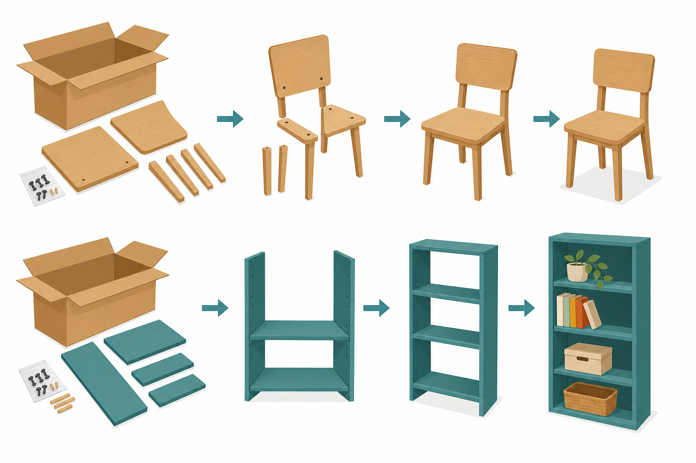
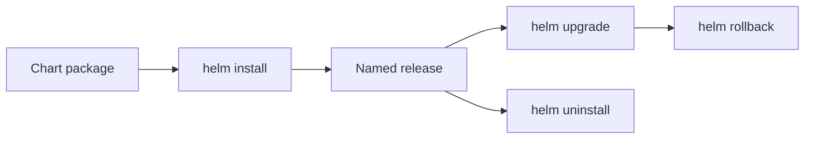
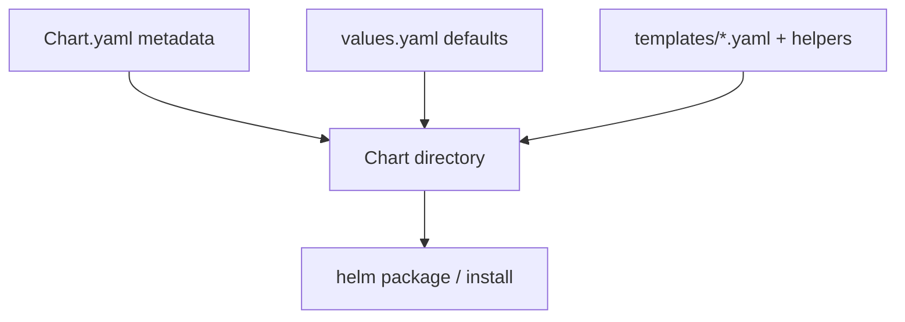
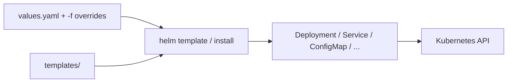
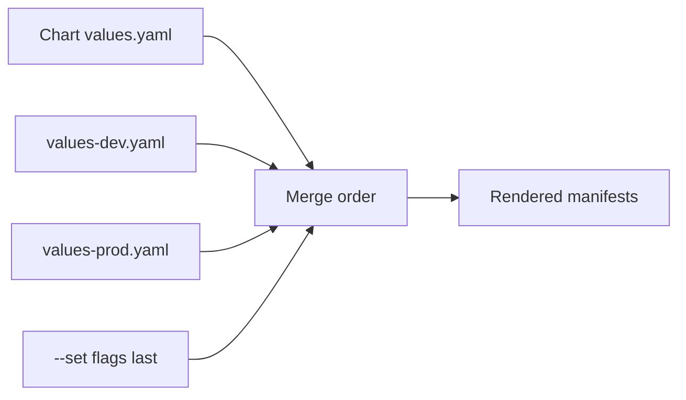
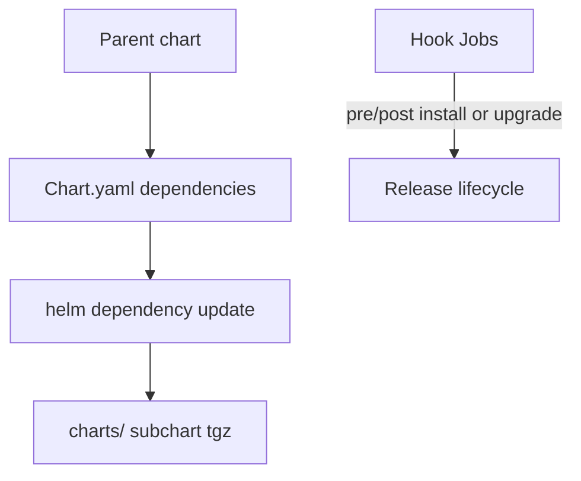

# Chapter 23 — Helm

> **Learning Objectives**
>
> By the end of this chapter, you will be able to:
>
> - Explain what Helm charts, values, and releases are
> - Install charts from repositories and manage release lifecycles
> - Read templates and override configuration with `values.yaml`
> - Package a basic chart for the Python Task API
> - Upgrade, roll back, and uninstall releases confidently
> - Avoid common templating and versioning pitfalls

---

## 23.1 Shipping furniture flat-packed

IKEA does not send a fully assembled kitchen for every apartment layout. They send a **box of parts**, an instruction booklet, and options (which handles, which finish). You assemble the kitchen to fit *your* space.



*Figure 23.A: Charts are flat-pack kits; values.yaml chooses the finish before assembly.*

**Helm** is the package manager for Kubernetes. A **chart** is the flat-pack: templated YAML for Deployments, Services, ConfigMaps, and more. **Values** choose the finish. A **release** is one installed instance of a chart in a cluster—your assembled kitchen.

Without Helm (or similar tooling), you drown in duplicated manifests across environments. With Helm, you still need to understand the rendered YAML—Helm does not replace Kubernetes knowledge; it packages it.

---

## 23.2 Core vocabulary

### In plain terms

Learn five words thoroughly and Helm stops feeling magical: chart, values, release, repository, template.

### Under the hood

| Term | Meaning |
|------|---------|
| **Chart** | Directory (or package) with templates, default values, and metadata |
| **Values** | Configuration knobs (`replicaCount`, `image.tag`, …) |
| **Release** | A named installation of a chart (with its own revision history) |
| **Repository** | HTTP index of charts (Artifact Hub, Bitnami, your org’s chart museum) |
| **Template** | Go template files that render into Kubernetes manifests |

```bash
$ helm version
version.BuildInfo{Version:"v3.16.x", GitCommit:"...", ...}
```

This book assumes **Helm 3** (no Tiller). Releases are stored as Secrets or ConfigMaps in the cluster.



*Figure 23.1: A release is a versioned installation of a chart—install, upgrade, roll back, or uninstall as a unit.*

### In production

1. Pin chart versions in CI; floating `latest` charts are supply-chain risk.
2. Prefer `helm upgrade --install` with reviewed values files over ad-hoc `--set` chains.
3. Diff before apply (`helm diff` plugin or rendered manifests in pull requests).

---

## 23.3 Install, list, upgrade, rollback

### In plain terms

Treat a release like a versioned appliance install: install once, upgrade to change settings, roll back when an upgrade misbehaves, uninstall when done.

### Under the hood

```bash
$ helm repo add bitnami https://charts.bitnami.com/bitnami
$ helm repo update
Hang tight while we grab the latest from your chart repositories...
Update Complete. ⎈Happy Helming!⎈

$ helm search repo bitnami/nginx
NAME            CHART VERSION   APP VERSION     DESCRIPTION
bitnami/nginx   18.x.x          1.27.x          NGINX Open Source is a web server...

$ helm install my-nginx bitnami/nginx --namespace web --create-namespace
NAME: my-nginx
LAST DEPLOYED: Sat Jul 25 22:40:00 2026
NAMESPACE: web
STATUS: deployed
REVISION: 1
```

Day-2 operations:

```bash
$ helm list -n web
NAME      NAMESPACE  REVISION  STATUS    CHART         APP VERSION
my-nginx  web        1         deployed  nginx-18.x.x  1.27.x

$ helm upgrade my-nginx bitnami/nginx -n web --set replicaCount=3
$ helm rollback my-nginx 1 -n web
$ helm uninstall my-nginx -n web
```

> 💡 **Tip:** Prefer declarative values files over long `--set` chains for anything you will reuse:

```bash
$ helm upgrade --install task-api ./charts/task-api -n tasks -f values-prod.yaml
```

### In production

1. Store values per environment in Git; promote by merging, not by editing live clusters.
2. Practice rollback in staging—know which revision is “last known good.”
3. Uninstall does not always delete PVCs or CRDs; read chart NOTES and hooks.

---

## 23.4 Anatomy of a chart

### In plain terms

A chart is a directory with metadata (`Chart.yaml`), default knobs (`values.yaml`), and a `templates/` folder full of Go templates that become real Kubernetes objects.

### Under the hood

```text
task-api/
├── Chart.yaml          # name, version, appVersion
├── values.yaml         # default configuration
├── templates/
│   ├── deployment.yaml
│   ├── service.yaml
│   ├── configmap.yaml
│   ├── ingress.yaml
│   ├── serviceaccount.yaml
│   ├── _helpers.tpl    # named template helpers
│   └── NOTES.txt       # post-install message
└── .helmignore
```

```yaml
# Chart.yaml
apiVersion: v2
name: task-api
description: Helm chart for the Task API example application
type: application
version: 0.1.0
appVersion: "1.1.0"
```

```yaml
# values.yaml
replicaCount: 2

image:
  repository: ghcr.io/mastering-k8s/task-api
  tag: "1.1.0"
  pullPolicy: IfNotPresent

service:
  type: ClusterIP
  port: 80
  targetPort: 8000

config:
  logLevel: info
  greeting: "Hello from Helm"

ingress:
  enabled: false
  className: nginx
  host: tasks.example.com

resources:
  requests:
    cpu: 100m
    memory: 128Mi
  limits:
    cpu: 500m
    memory: 256Mi

serviceAccount:
  create: true
  name: ""
```



*Figure 23.2: A chart bundles metadata, default values, and Go templates that render into Kubernetes manifests.*

### In production

1. Bump **chart** `version` when templates or value schemas change; set **appVersion** to the application release.
2. Keep secrets out of committed `values.yaml`—use external secret tools or CI injection.
3. Document required values in `README.md` / `NOTES.txt` for operators.

---

## 23.5 Templates: from values to YAML

### In plain terms

Templates are fill-in-the-blank manifests. Helm merges chart defaults with your values, runs Go templates (plus Sprig helpers), and applies the result as one release.

### Under the hood

```gotemplate
# templates/deployment.yaml
apiVersion: apps/v1
kind: Deployment
metadata:
  name: {{ include "task-api.fullname" . }}
  labels:
    {{- include "task-api.labels" . | nindent 4 }}
spec:
  replicas: {{ .Values.replicaCount }}
  selector:
    matchLabels:
      {{- include "task-api.selectorLabels" . | nindent 6 }}
  template:
    metadata:
      labels:
        {{- include "task-api.selectorLabels" . | nindent 8 }}
    spec:
      serviceAccountName: {{ include "task-api.serviceAccountName" . }}
      containers:
        - name: api
          image: "{{ .Values.image.repository }}:{{ .Values.image.tag | default .Chart.AppVersion }}"
          imagePullPolicy: {{ .Values.image.pullPolicy }}
          ports:
            - name: http
              containerPort: {{ .Values.service.targetPort }}
          env:
            - name: LOG_LEVEL
              valueFrom:
                configMapKeyRef:
                  name: {{ include "task-api.fullname" . }}
                  key: logLevel
            - name: GREETING
              valueFrom:
                configMapKeyRef:
                  name: {{ include "task-api.fullname" . }}
                  key: greeting
          resources:
            {{- toYaml .Values.resources | nindent 12 }}
```

```gotemplate
# templates/service.yaml
apiVersion: v1
kind: Service
metadata:
  name: {{ include "task-api.fullname" . }}
  labels:
    {{- include "task-api.labels" . | nindent 4 }}
spec:
  type: {{ .Values.service.type }}
  selector:
    {{- include "task-api.selectorLabels" . | nindent 4 }}
  ports:
    - name: http
      port: {{ .Values.service.port }}
      targetPort: http
      protocol: TCP
```

```gotemplate
# templates/configmap.yaml
apiVersion: v1
kind: ConfigMap
metadata:
  name: {{ include "task-api.fullname" . }}
  labels:
    {{- include "task-api.labels" . | nindent 4 }}
data:
  logLevel: {{ .Values.config.logLevel | quote }}
  greeting: {{ .Values.config.greeting | quote }}
```

```gotemplate
# templates/_helpers.tpl
{{- define "task-api.name" -}}
{{- default .Chart.Name .Values.nameOverride | trunc 63 | trimSuffix "-" }}
{{- end }}

{{- define "task-api.fullname" -}}
{{- if .Values.fullnameOverride }}
{{- .Values.fullnameOverride | trunc 63 | trimSuffix "-" }}
{{- else }}
{{- $name := default .Chart.Name .Values.nameOverride }}
{{- if contains $name .Release.Name }}
{{- .Release.Name | trunc 63 | trimSuffix "-" }}
{{- else }}
{{- printf "%s-%s" .Release.Name $name | trunc 63 | trimSuffix "-" }}
{{- end }}
{{- end }}
{{- end }}

{{- define "task-api.labels" -}}
helm.sh/chart: {{ .Chart.Name }}-{{ .Chart.Version | replace "+" "_" }}
app.kubernetes.io/name: {{ include "task-api.name" . }}
app.kubernetes.io/instance: {{ .Release.Name }}
app.kubernetes.io/version: {{ .Chart.AppVersion | quote }}
app.kubernetes.io/managed-by: {{ .Release.Service }}
{{- end }}

{{- define "task-api.selectorLabels" -}}
app.kubernetes.io/name: {{ include "task-api.name" . }}
app.kubernetes.io/instance: {{ .Release.Name }}
{{- end }}

{{- define "task-api.serviceAccountName" -}}
{{- if .Values.serviceAccount.create }}
{{- default (include "task-api.fullname" .) .Values.serviceAccount.name }}
{{- else }}
{{- default "default" .Values.serviceAccount.name }}
{{- end }}
{{- end }}
```

Optional Ingress gated by values:

```gotemplate
# templates/ingress.yaml
{{- if .Values.ingress.enabled }}
apiVersion: networking.k8s.io/v1
kind: Ingress
metadata:
  name: {{ include "task-api.fullname" . }}
  labels:
    {{- include "task-api.labels" . | nindent 4 }}
spec:
  ingressClassName: {{ .Values.ingress.className }}
  rules:
    - host: {{ .Values.ingress.host | quote }}
      http:
        paths:
          - path: /
            pathType: Prefix
            backend:
              service:
                name: {{ include "task-api.fullname" . }}
                port:
                  name: http
{{- end }}
```

```gotemplate
# templates/serviceaccount.yaml
{{- if .Values.serviceAccount.create }}
apiVersion: v1
kind: ServiceAccount
metadata:
  name: {{ include "task-api.serviceAccountName" . }}
  labels:
    {{- include "task-api.labels" . | nindent 4 }}
{{- end }}
```



*Figure 23.3: Helm merges values with templates, renders Kubernetes objects, then installs or upgrades them as one release.*

### In production

1. Keep selectors stable across upgrades—changing label schemes orphans ReplicaSets.
2. Use `helm template` / `helm lint` in CI before merge.
3. Prefer `nindent` and `{{-` trimming to keep rendered YAML valid.

---

## 23.6 Develop, debug, and ship the Task API chart

### In plain terms

Scaffold, replace the sample app with Task API, dry-run until the YAML looks right, then install. Package the chart when you are ready to share it.

### Under the hood

```bash
$ helm create task-api
Creating task-api
```

Replace scaffold templates with the Task API manifests above (or edit in place).

```bash
$ helm template task-api ./task-api -f values-prod.yaml
$ helm lint ./task-api
==> Linting ./task-api
1 chart(s) linted, 0 chart(s) failed

$ helm install task-api ./task-api -n tasks --create-namespace --dry-run --debug
```

Install for real:

```bash
$ helm upgrade --install task-api ./task-api -n tasks \
    --set image.tag=1.1.1 \
    --set config.greeting="Tasks ready"
Release "task-api" has been upgraded. Happy Helming!
NAME: task-api
NAMESPACE: tasks
STATUS: deployed
REVISION: 2
```

```bash
$ helm package ./task-api
Successfully packaged chart and saved it to: task-api-0.1.0.tgz
```

Environment values:

```yaml
# values-dev.yaml
replicaCount: 1
image:
  tag: "dev"
ingress:
  enabled: false
```

```yaml
# values-prod.yaml
replicaCount: 4
image:
  tag: "1.1.1"
ingress:
  enabled: true
  host: tasks.prod.example.com
resources:
  requests:
    cpu: 200m
    memory: 256Mi
  limits:
    cpu: "1"
    memory: 512Mi
```

```bash
$ helm upgrade --install task-api ./task-api -n tasks -f values-prod.yaml
```

Later values files override earlier ones when you pass multiple `-f` flags.



*Figure 23.4: Later `-f` files and `--set` flags override earlier defaults—keep environment knobs in values files, not templates.*

### In production

1. Add PDB, HPA, securityContext, and NetworkPolicy templates as the chart matures (Chapters 20–24).
2. Render and review diffs in pull requests—never surprise-apply to prod.
3. Sign and scan chart packages in regulated environments.

---

## 23.7 Hooks and dependencies (briefly)

Charts may declare **dependencies** in `Chart.yaml` (for example, a Redis subchart) and fetch them with `helm dependency update`. **Hooks** run Jobs annotated to execute before/after install or upgrade. Use hooks sparingly—they complicate GitOps and rollbacks.



*Figure 23.5: Subcharts are fetched as dependencies; hooks attach Jobs to install/upgrade phases—use both sparingly in GitOps flows.*

> 📘 **Deep Dive (optional):** Helm is not the only packager—Kustomize, Jsonnet, and GitOps tools also manage manifests. Many teams render Helm in CI and apply the output, or use Helm inside Argo CD / Flux.

---

## 23.8 Common pitfalls

> ⚠️ **Common Pitfall:** Editing live objects with `kubectl edit` while Helm owns them. The next `helm upgrade` may overwrite your changes.

> ⚠️ **Common Pitfall:** Putting secrets in `values.yaml` committed to git.

> ⚠️ **Common Pitfall:** Forgetting that template whitespace matters—use `{{-` / `-}}` and `nindent`.

> ⚠️ **Common Pitfall:** Confusing chart `version` with `appVersion`.

---

## 23.9 Hands-on exercises

1. **Install a public chart.** Add a repo, install a simple chart into a scratch namespace, list the release, then uninstall it.
2. **Scaffold.** Run `helm create task-api` and explore generated files. Point the container at `ghcr.io/mastering-k8s/task-api:1.1` on port 8000.
3. **Values override.** Install with `replicaCount=1`, upgrade with `-f` to set `replicaCount=3`, and confirm Deployment replicas.
4. **Template debug.** Run `helm template` and verify Service selectors match Pod labels.
5. **Rollback.** Perform two upgrades, then `helm rollback` to revision 1 and verify image tag/config.

---

## 23.10 Check Your Understanding

**Q1.** What is the difference between a chart and a release?

<details>
<summary>Show answer</summary>

A **chart** is the package/templates; a **release** is a named installed instance of a chart in a cluster (with revision history).

</details>

**Q2.** Which Helm command renders manifests without installing?

<details>
<summary>Show answer</summary>

`helm template` (also `helm install --dry-run` for a fuller dry run).

</details>

**Q3.** Why use `helm upgrade --install` in CI?

<details>
<summary>Show answer</summary>

It creates the release if missing or upgrades it if present—idempotent deploys.

</details>

**Q4.** Where should environment-specific replica counts live?

<details>
<summary>Show answer</summary>

In environment **values files** (or CI-set values), not hard-coded in templates.

</details>

**Q5.** Does Helm remove the need to understand Deployments and Services?

<details>
<summary>Show answer</summary>

**No.** Helm packages Kubernetes objects; you must still understand the rendered resources to debug and secure them.

</details>

---

## 23.11 Key takeaways

- Helm 3 packages Kubernetes YAML into versioned charts with configurable values.
- Releases track history so you can upgrade and roll back as a unit.
- Templates plus `values.yaml` keep one chart adaptable across environments.
- A basic Task API chart typically includes Deployment, Service, ConfigMap, optional Ingress, and ServiceAccount.
- Treat Helm output as real Kubernetes—lint, diff, and review before production applies.

---

## 23.12 Official documentation map

| Topic | Official page |
|-------|---------------|
| Helm documentation | [Helm Docs](https://helm.sh/docs/) |
| Charts | [Charts](https://helm.sh/docs/topics/charts/) |
| Chart best practices | [Chart Best Practices](https://helm.sh/docs/chart_best_practices/) |
| Values files | [Values Files](https://helm.sh/docs/chart_template_guide/values_files/) |
| Template guide | [Chart Template Guide](https://helm.sh/docs/chart_template_guide/) |
| Helm commands | [Helm Commands](https://helm.sh/docs/helm/) |

**Previous:** [Chapter 22 — Observability](22-observability.md) | **Next:** [Chapter 24 — Production Best Practices](24-production-best-practices.md)
