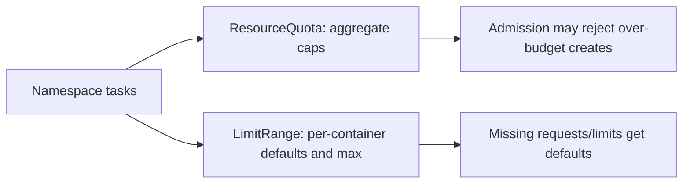
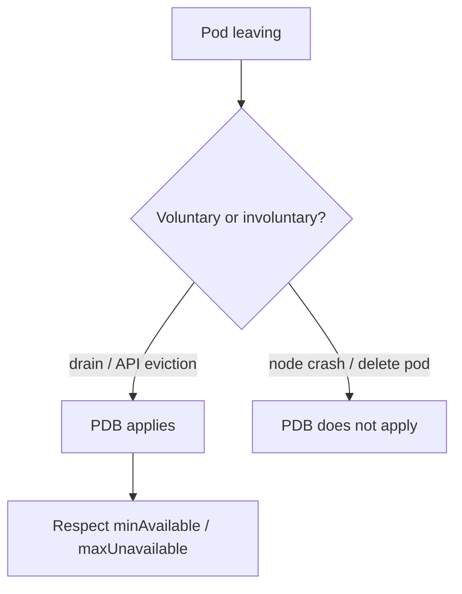
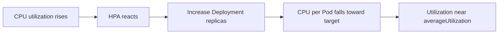
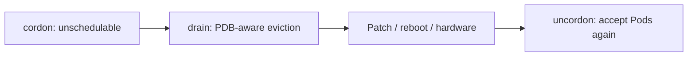
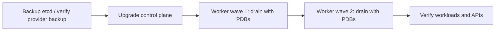

# Chapter 24 — Production Best Practices

> **Learning Objectives**
>
> By the end of this chapter, you will be able to:
>
> - Use ResourceQuotas and LimitRanges so one team cannot use up the whole cluster
> - Write PodDisruptionBudgets, and know exactly which failures they do and do not cover
> - Set up Horizontal Pod Autoscaling, and know when Vertical Pod Autoscaling helps instead
> - Explain how Kubernetes cleans up child objects, and what Leases are used for
> - Describe what the cloud controller manager does for you, managed or self-run
> - Plan node maintenance, etcd backups, cluster upgrades, and surviving the loss of a zone
> - Walk a real production readiness checklist and score your own service against it

---

## 24.1 From lab cluster to airline operations

A weekend lab cluster is a bicycle. If it breaks, you walk home. A production cluster is an airline. There are schedules, spare aircraft, maintenance windows, flight recorders, and a checklist for everything.


*Figure 24.A: Production ops look more like a control room than a laptop demo.*

The Kubernetes API is identical in both cases. What changes is the discipline around it. An airline does not fly better aircraft than a hobbyist; it flies the same physics with procedures, redundancy, and people who rehearse the bad day before it arrives.

This chapter collects the controls you reach for once real users depend on you. Limits so one team cannot starve the others. Budgets so maintenance does not take your service down. Autoscaling. Cleanup. Backups. Upgrades. Surviving the loss of a data center.

None of it replaces writing good software. But a well-written app with no disruption budget and no tested backup still fails badly, and it fails in ways that take hours to understand.

---

## 24.2 Guardrails: ResourceQuota and LimitRange

### In plain terms

A **ResourceQuota** sets a ceiling on how much a whole namespace may use: total CPU, total memory, how many Pods, how many load balancers. A **LimitRange** works one level down, on each individual container, setting a default size and a maximum size.

Why do you need both? Because they catch different problems. Without a quota, one team's runaway deployment can consume every node and starve everyone else. Without a LimitRange, containers arrive with no resource request at all, which means the scheduler cannot place them fairly and the quota cannot count them properly.

Think of a shared apartment. The ResourceQuota is the breaker panel: no roommate can draw enough power to black out the building. The LimitRange is the house rule that every appliance must state its wattage, so nothing plugs in claiming to need nothing.

That is why the two go together. A quota on `requests.cpu` only means something if every container actually declares a CPU request, and the LimitRange is what makes sure they do.

> ⚠️ **Common Pitfall:** Setting quotas without LimitRange defaults—Pods with no requests may still schedule unfairly until quota reckoning surprises you.

### Under the hood

Here is a namespace ceiling and the per-container defaults that make it work:

```yaml
apiVersion: v1
kind: ResourceQuota
metadata:
  name: tasks-quota
  namespace: tasks
spec:
  hard:
    requests.cpu: "4"
    requests.memory: 8Gi
    limits.cpu: "8"
    limits.memory: 16Gi
    pods: "40"
    persistentvolumeclaims: "10"
    services.loadbalancers: "2"
```

```bash
$ kubectl apply -f quota-tasks.yaml
$ kubectl describe quota -n tasks
Name:                   tasks-quota
Resource                Used  Hard
--------                ----  ----
limits.cpu              1     8
pods                    4     40
requests.cpu            400m  4
```

```yaml
apiVersion: v1
kind: LimitRange
metadata:
  name: tasks-limits
  namespace: tasks
spec:
  limits:
    - type: Container
      default:
        cpu: 500m
        memory: 256Mi
      defaultRequest:
        cpu: 100m
        memory: 128Mi
      max:
        cpu: "2"
        memory: 2Gi
      min:
        cpu: 50m
        memory: 64Mi
```

> 💡 **Tip:** Quotas that enforce `requests.cpu`/`requests.memory` only work well if every container specifies requests—LimitRange defaults help enforce that culture.



*Figure 24.1: ResourceQuota caps the namespace total; LimitRange sets per-container defaults and bounds so nothing arrives “unlimited.”*

### In production

**Ownership:** The platform team defines quota sizes for each tier of namespace. App teams stay inside them and ask for an increase through a change ticket rather than raising it themselves.

**Failure mode:** Hitting the quota rejects new Pods in the middle of a rollout, which is the worst possible moment. Detect it through the Forbidden errors in the API and through metrics comparing used against the limit. Prevent it by leaving headroom and by putting used-versus-limit on a dashboard the team actually looks at.

| Do | Don't |
|----|-------|
| Pair Quota + LimitRange | Unlimited namespaces in multi-tenant clusters |
| Dashboards for used vs hard | Raise quotas silently without capacity |

**Before you leave this section**

- **Understand:** Quotas bound namespaces; LimitRanges shape per-Pod defaults.
- **Try:** Apply a quota and watch a create fail when exceeded.
- **Watch in prod:** Rollouts failing with Forbidden quota errors.


---

## 24.3 PodDisruptionBudgets (PDBs)

### In plain terms

A **PodDisruptionBudget**, or **PDB**, is an object that says how many replicas of a workload must stay running while somebody is doing planned maintenance. If an eviction request would break that promise, the API server refuses it.

Why does maintenance need protecting? Because a cluster upgrade drains nodes one after another, and nothing naturally stops it from draining every node your three replicas happen to sit on. A PDB makes the drain wait. It turns "we upgraded the cluster and the service went down for ninety seconds" into "the upgrade took longer and nobody noticed."

Here is the boundary that must be clear. A PDB only governs **voluntary disruption** — a deliberate action, sent through the eviction API, by a human or a tool. `kubectl drain` is voluntary. The cluster autoscaler removing an underused node is voluntary. A node losing power is not. A kernel panic is not. Neither is `kubectl delete pod`.

> 💡 **In one line:** A PDB slows down planned maintenance so it cannot take all your replicas at once — it has no power over crashes, power loss, or a direct pod delete.

Which leads to the trap. Write `minAvailable` equal to your replica count and you have not made the service safer; you have made every drain block forever, and a stuck drain during a security patch is its own kind of incident.

> ⚠️ **Common Pitfall:** `minAvailable: 100%` on a single-replica Deployment—blocks all voluntary drains forever.

### Under the hood

Here is a budget that keeps two of three replicas serving during any drain:

```yaml
apiVersion: policy/v1
kind: PodDisruptionBudget
metadata:
  name: task-api
  namespace: tasks
spec:
  minAvailable: 2
  selector:
    matchLabels:
      app: task-api
```

Alternatively use `maxUnavailable: 1`.

```bash
$ kubectl apply -f pdb-task-api.yaml
$ kubectl get pdb -n tasks
NAME       MIN AVAILABLE   MAX UNAVAILABLE   ALLOWED DISRUPTIONS   AGE
task-api   2               N/A               1                     10s
```

> ⚠️ **Common Pitfall:** A PDB does **not** protect against **involuntary** disruptions. You still need replicas across failure domains ([Chapter 20](20-scheduling-and-advanced-placement.md)) and application retries. If `ALLOWED DISRUPTIONS` is 0, drains may block until you scale up or temporarily adjust the PDB—by design.



*Figure 24.2: PDBs gate voluntary evictions such as drains; crashes and direct deletes ignore the budget.*

### In production

**Ownership:** App teams write the PDB for their own workloads, because only they know how many replicas must stay up. The platform team owns the drain automation that honors those budgets.

**Failure mode:** A budget that is too strict stops node upgrades entirely. Detect it through drain timeouts and by watching for a PDB whose `ALLOWED DISRUPTIONS` sits at zero. Prevent it by adding replica headroom before the maintenance window opens, not during it.

| Do | Don't |
|----|-------|
| PDB + enough replicas | 100% minAvailable on 1 replica |
| Test drain in staging | Delete pods to bypass PDB in prod |

**Before you leave this section**

- **Understand:** PDBs protect voluntary disruptions; size replicas accordingly.
- **Try:** Create a PDB and observe drain blocking/allowing.
- **Watch in prod:** Cluster upgrades stuck on tight PDBs.

> 🏭 **Production floor:** Pair **drain + PDB** for node maintenance: confirm `ALLOWED DISRUPTIONS` > 0 or scale out first; drain; never `kubectl delete` to bypass. Paste PDB YAML and drain logs into the change record.


---

## 24.4 Horizontal and Vertical Pod Autoscaling

### In plain terms

There are two ways to give a workload more capacity, and Kubernetes has a tool for each. **HPA**, the **Horizontal Pod Autoscaler**, changes how *many* replicas run. **VPA**, the **Vertical Pod Autoscaler**, changes how *big* each replica is by adjusting its CPU and memory requests.

Why does the difference matter? Picture a supermarket. When the line gets long, you open more checkout lanes; that is HPA. When one cashier's station is too cramped to work in, you make the station bigger; that is VPA. Opening more lanes does not help if each station is broken, and a bigger station does not help if you only have one.

Both depend on two things being correct: working metrics, and resource requests on your containers. HPA measures usage as a percentage *of the request*, so a container with no request gives the autoscaler nothing to divide by.

One caution about scaling up. Raising `maxReplicas` feels like buying safety. It is not free. Ten replicas open ten times as many database connections, and the autoscaler will happily scale your app right into overwhelming a dependency that cannot scale with it. Set the ceiling based on what your dependencies can take.

> ⚠️ **Common Pitfall:** HPA on CPU while the app is I/O bound—scales the wrong signal.

### Under the hood

Here is an autoscaler that keeps average CPU near 70% of the request:

```yaml
apiVersion: autoscaling/v2
kind: HorizontalPodAutoscaler
metadata:
  name: task-api
  namespace: tasks
spec:
  scaleTargetRef:
    apiVersion: apps/v1
    kind: Deployment
    name: task-api
  minReplicas: 2
  maxReplicas: 10
  metrics:
    - type: Resource
      resource:
        name: cpu
        target:
          type: Utilization
          averageUtilization: 70
```

```bash
$ kubectl apply -f hpa-task-api.yaml
$ kubectl get hpa -n tasks
NAME       REFERENCE             TARGETS     MINPODS   MAXPODS   REPLICAS
task-api   Deployment/task-api   22%/70%     2         10        2
```

> ⚠️ **Common Pitfall:** Resource metrics require a working **metrics-server** (or equivalent). If `kubectl top` fails, HPA resource metrics will not function. Utilization is relative to **requests**, not limits.

**VPA** is typically installed separately (community components or cloud add-ons). Modes commonly discussed: Off (recommendations only), Initial, Auto (often via recreate). Prefer HPA for replica scaling on custom metrics while VPA rightsizes requests—or use one dimension carefully. Read current VPA docs before combining.



*Figure 24.3: When load rises, HPA adds replicas so average CPU utilization drops back toward the target.*

### In production

**Ownership:** App teams own their autoscaling settings. The platform team owns the metrics pipeline those settings depend on.

**Failure mode:** An autoscaler that reacts too quickly oscillates — scaling up, then down, then up again — which churns Pods and costs money without helping anyone. Detect it by graphing replica count over time and looking for the sawtooth. Fix it with a stabilization window that makes the autoscaler wait before reversing, and by scaling on a signal your users actually feel.

| Do | Don't |
|----|-------|
| Scale on user-facing signals when possible | HPA without requests set |
| Cap max replicas vs dependency limits | VPA + HPA on same metrics without care |

**Before you leave this section**

- **Understand:** HPA/VPA need metrics, requests, and sane limits vs dependencies.
- **Try:** Attach an HPA to Task API CPU and watch scale events in a load test.
- **Watch in prod:** Autoscaling storms and DB overload.


---

## 24.5 Garbage collection and owner references

### In plain terms

An **owner reference** is a field on an object that names its parent. A Pod created by a ReplicaSet carries an owner reference pointing at that ReplicaSet, and the ReplicaSet carries one pointing at the Deployment. **Garbage collection** is the cluster process that reads those links and deletes children when their parent goes away.

Why should you care about a background cleanup process? Because it explains both of the surprising outcomes you will eventually hit. Delete a Deployment and its Pods vanish too, which is usually what you wanted. Delete a namespace and *everything* inside it vanishes, which is a far larger blast radius than people expect. And an object with no owner reference is never cleaned up automatically, so it sits there costing money until a human notices.

Think of a theater striking the set after closing night. Anything tagged as belonging to the show gets carried out. Anything untagged stays in the wings for years.

This is exactly why storage deserves care during teardown. A PVC left with no owner keeps its cloud disk alive and billing. Meanwhile, a cascade you did not expect can remove a claim you meant to keep. Know which one you are triggering before you press enter.

> ⚠️ **Common Pitfall:** Orphaning PVCs by deleting workloads without a reclaim plan—or conversely, unexpected cascades.

### Under the hood

Here is how to see the links and control what happens on delete:

```bash
$ kubectl get pod task-api-6d7f8c9b5d-xk2m9 -o yaml | findstr /C:"ownerReferences" /C:"name:" /C:"kind:"
# On Unix: kubectl get pod … -o jsonpath='{.metadata.ownerReferences}'
```

Typical chain:

```text
Deployment → ReplicaSet → Pod
```

Each child carries `metadata.ownerReferences` pointing at its controller. The garbage collector deletes dependents when the owner disappears, honoring `propagationPolicy`:

| Policy | Behavior |
|--------|----------|
| `Foreground` | Owner blocked from full deletion until dependents are gone |
| `Background` | Owner deleted; dependents cleaned asynchronously (common default) |
| `Orphan` | Owner deleted; dependents left behind without owner refs |

```bash
$ kubectl delete deployment task-api --cascade=orphan
```

Finalizers on objects delay deletion until a controller clears them (for example, cleaning cloud resources). Stuck deletions often mean a finalizer waiting on a dead controller.

Custom controllers should set owner references on objects they create so namespace teardown and owner deletion do not leave junk.

### In production

**Ownership:** App teams need to know which of their objects have owners and which do not. The platform team watches for orphaned PVCs and load balancers, because those quietly cost money forever.

**Failure mode:** Orphans leak money. Unexpected cascades destroy data. Detect both with a scheduled report of objects nothing references. Prevent both with an explicit deletion policy and a teardown checklist that names what should survive.

| Do | Don't |
|----|-------|
| Know cascade vs orphan behavior | Delete namespaces casually in prod |
| Track orphaned PVCs | Assume GC cleans cloud disks always |

**Before you leave this section**

- **Understand:** OwnerRefs drive cascading deletes; know what you orphan.
- **Try:** Inspect ownerReferences on a Pod and ReplicaSet.
- **Watch in prod:** Orphaned cloud resources after app teardown.


---

## 24.6 Leases: heartbeats and leader election

### In plain terms

A **Lease** is a small object that one component holds for a short time and must keep renewing. If it stops renewing, the lease expires and someone else can take it. Think of it as a talking stick with a timer.

Why does the cluster need this? Two reasons, and they are the same mechanism used twice. First, heartbeats: every node renews a lease to say "I am still here," and a lease that stops being renewed is how the cluster concludes a node has gone away. Second, leader election: when you run three copies of a controller for redundancy, all three must not act at once, so they compete for one lease and only the holder does the work.

You will almost never create a Lease yourself. What you will do is run an operator with several replicas and rely on this mechanism to keep exactly one of them active.

Two things break it, and both are worth knowing. If the clocks on your machines drift apart, holders and challengers disagree about when the lease expired. If the lease duration is very short, a brief spike in API latency looks like a dead leader, and leadership bounces between replicas under load — exactly when you least want the churn.

> ⚠️ **Common Pitfall:** Clock skew and too-aggressive lease durations causing leadership flaps under load.

### Under the hood

Here are the leases already running in your cluster:

```bash
$ kubectl get leases -n kube-node-lease
NAME       HOLDER                     AGE
worker-1   worker-1                   30d
worker-2   worker-2                   30d

$ kubectl get lease -n kube-system kube-controller-manager -o yaml
```

Common uses:

- **Node heartbeats** — each node renews a Lease in `kube-node-lease`; stale leases feed node NotReady logic
- **Leader election** — high-availability control-plane components (controller-manager, scheduler) and many operators compete for a Lease; only the holder runs active loops
- **Custom operators** — client-go leader election libraries create Leases so only one replica reconciles

```yaml
apiVersion: coordination.k8s.io/v1
kind: Lease
metadata:
  name: task-api-operator
  namespace: tasks
spec:
  holderIdentity: task-api-operator-7d8f9c-xk2m9
  leaseDurationSeconds: 15
  renewTime: "2026-07-25T18:00:00.000000Z"
```

You rarely create Leases by hand for apps; you configure operator replicas and election identities correctly.

### In production

**Ownership:** The platform team and operator authors own lease health for their controllers. App teams almost never touch a Lease directly.

**Failure mode:** Leadership bouncing between replicas makes controllers restart their work over and over. Detect it by counting leader changes per hour and alerting when that number climbs. Prevent it with lease durations that tolerate a slow moment, and by monitoring that every node's clock stays synchronized.

| Do | Don't |
|----|-------|
| Monitor leader transitions | Hand-edit leases in prod |
| Keep node time synced | Ultra-short leases without cause |

**Before you leave this section**

- **Understand:** Leases power leader election; flaps are control-plane incidents.
- **Try:** List leases in kube-node-lease and one operator namespace.
- **Watch in prod:** Controller flapping after clock or API latency issues.


---

## 24.7 Cloud controller manager

### In plain terms

The **cloud controller manager**, usually shortened to **CCM**, is the component that turns Kubernetes objects into cloud API calls. You create a Service of type LoadBalancer; the CCM is what actually asks Amazon or Google for a load balancer and writes its address back into the object.

Why is it a separate component? Because cloud APIs change on their own schedule, and Kubernetes should not have to release a new version every time a provider adds a feature. Splitting it out lets each cloud ship its own controller.

Why should you know it exists? Because its failures do not look like its failures. When the CCM cannot create a load balancer, what you see is a Service whose external address stays `<pending>` — with no error in your application, no error in your Deployment, and nothing wrong with your YAML. Teams lose entire afternoons to this before checking the Service's Events and finding an exhausted cloud quota or a missing permission.

> ⚠️ **Common Pitfall:** Debugging app Networking for hours when the cloud LB quota is exhausted.

### Under the hood

Here is everything the CCM is responsible for:

- **Service / LoadBalancer** controller — provision and reconcile cloud LBs
- **Node** controller — sync cloud VM lifecycle with Node objects (and related taints)
- **Route** controller — ensure Pod CIDR routes exist in the VPC (when applicable)
- Cloud-specific cleanups tied to Kubernetes object deletion

```bash
$ kubectl get pods -n kube-system | findstr cloud
# Examples: cloud-controller-manager, or provider-specific controllers on managed offerings
```

On **managed Kubernetes** (EKS, GKE, AKS), the provider runs equivalent control loops for you—you still need to understand which annotations and Service fields map to which cloud resources. On **self-managed** clusters (kubeadm on cloud VMs), you install and operate the provider’s CCM explicitly.

```yaml
apiVersion: v1
kind: Service
metadata:
  name: task-api
  annotations:
    # Provider-specific — example shape only; use your cloud’s current docs
    service.beta.kubernetes.io/aws-load-balancer-type: "nlb"
spec:
  type: LoadBalancer
  selector:
    app: task-api
  ports:
    - port: 80
      targetPort: 8000
```

### In production

**Ownership:** The platform team owns the CCM and the cloud quotas it consumes. App teams set Service annotations, but only ones from a documented list.

**Failure mode:** A load balancer that never finishes provisioning is an outage for everyone outside the cluster. Detect it by reading Service Events and by tracking how close you are to your cloud quotas. Prevent it by keeping quota headroom and by rejecting annotations nobody has verified.

| Do | Don't |
|----|-------|
| Watch Service Events for LB provision | Invent undocumented cloud annotations |
| Track cloud quota | Assume CCM bugs are app bugs |

**Before you leave this section**

- **Understand:** CCM bridges Kubernetes Services/nodes to cloud APIs.
- **Try:** Describe a LoadBalancer Service and find CCM-related Events.
- **Watch in prod:** Pending LBs from quota or IAM failures.


---

## 24.8 Node maintenance

### In plain terms

Node maintenance is the routine for taking a machine out of service safely. It has four steps and they always happen in the same order: **cordon**, **drain**, do the work, **uncordon**.

Why the ceremony? Because a node full of running Pods cannot simply be rebooted. Cordon marks it unschedulable so no new Pods land on a machine you are about to take away. Drain then moves the existing Pods off, one eviction at a time, honoring every PodDisruptionBudget along the way. Uncordon at the end tells the scheduler it may use the machine again.

Skipping the ceremony has a name in most companies: an incident. Terminating the instance from the cloud console is faster in the sense that a fire is faster than a stove. Volumes are left attached, replicas disappear together, and the disruption budget you carefully wrote never gets consulted.

Two rules govern the whole procedure. Take one failure domain at a time, never several in parallel. And confirm there is somewhere for the evicted Pods to go before you start, because draining into a cluster with no spare capacity just moves the outage.

> ⚠️ **Common Pitfall:** Draining without replacement capacity in other zones during a zonal event—or force-deleting Pods to “hurry” a drain and bypass PDBs.

### Under the hood

Here is the loop, exactly as you would run it:

```bash
$ kubectl cordon worker-2
node/worker-2 cordoned

$ kubectl drain worker-2 --ignore-daemonsets --delete-emptydir-data
node/worker-2 drained

# perform OS patch / reboot / hardware work

$ kubectl uncordon worker-2
node/worker-2 uncordoned
```

- **cordon** — mark unschedulable (no new Pods)
- **drain** — evict Pods respectfully (honors PDBs)
- **uncordon** — re-enable scheduling

Never reboot nodes under load without drain unless you accept involuntary-style disruption. What breaks if `ALLOWED DISRUPTIONS` is 0: drain blocks until you add capacity or carefully adjust the PDB under change control.



*Figure 24.4: Safe node maintenance is cordon → drain → work → uncordon so new Pods do not land mid-change.*

### In production

**Ownership:** The platform team owns the written maintenance procedure and follows it every time. App teams supply the PDBs and build services that survive a Pod moving.

**Failure mode:** A drain done without checks takes several replicas at once and the service goes down. Detect it by watching your error budget during maintenance windows, not after. Prevent it by checking capacity first and by adding temporary extra nodes before large drains.

| Do | Don't |
|----|-------|
| Cordon → drain → maintain → uncordon | Delete VMs without drain |
| Confirm PDB and capacity first | Drain many nodes in parallel blindly |

> 🏭 **Production floor:** Node maintenance uses **drain + PDB**: pre-check capacity and `kubectl get pdb -A`, drain one failure domain at a time, capture Events and PDB status in the ticket, uncordon only when healthy. Never `kubectl delete pod` to bypass a blocking PDB in production.

**Before you leave this section**

- **Understand:** Node maintenance is a rehearsed SOP with PDB and capacity checks.
- **Try:** Cordon and drain a lab node end-to-end.
- **Watch in prod:** Parallel drains causing error-budget burn.

---

## 24.9 etcd backup and restore

### In plain terms

**etcd** is the database where Kubernetes keeps every object: every Deployment, Secret, Service, and namespace. If etcd is lost and there is no backup, the cluster's entire definition is gone and you rebuild from whatever is left in Git.

Why treat this differently from your other backups? Because of what an etcd restore does and does not give you. It brings back the *definitions* of your objects. It does not bring back the contents of your volumes. Restore etcd and your database Deployment exists again, pointing at a PVC — but the rows inside that database came from a disk, and that is a separate backup you have to have taken separately.

Now the rule that this whole section exists for. A backup you have never restored is not a backup. It is a file you hope is correct. The failure is always discovered at the worst moment: the snapshot was truncated, the encryption key rotated, or nobody knows the restore procedure and it takes six hours to work out.

Restoring for real is version-sensitive and fiddly — you stop the API servers, load the snapshot, and bring members back in a specific order. Rehearse it on a throwaway cluster and time it. That measured duration is the only honest answer you have when someone asks how long recovery takes.

> ⚠️ **Common Pitfall:** Backing up etcd but never testing restore. Untested backups are fiction.

### Under the hood

Here is how you take a snapshot and confirm it is readable:

```bash
$ ETCDCTL_API=3 etcdctl --endpoints=https://127.0.0.1:2379 \
    --cacert=/etc/kubernetes/pki/etcd/ca.crt \
    --cert=/etc/kubernetes/pki/etcd/server.crt \
    --key=/etc/kubernetes/pki/etcd/server.key \
    snapshot save /var/backups/etcd/snapshot-$(date +%F).db

$ ETCDCTL_API=3 etcdctl snapshot status /var/backups/etcd/snapshot-2026-07-25.db --write-out=table
```

Restore is a careful, version-sensitive procedure (stop API servers, restore snapshot, reintroduce members). Practice on a non-production clone. What breaks if backups live only on the same hosts that fail: you discover too late that the snapshot is unreachable.

On **managed Kubernetes**, the provider usually backs up the control plane—verify RPO/RTO in writing. You still back up **application data** (databases, object storage, PV snapshots—[Chapter 18](18-k8s-storage.md)) yourself.

### In production

**Ownership:** The platform team owns the etcd backup schedule, the encryption keys, and running the restore drills. App teams own backing up their own application data, which etcd does not cover.

**Failure mode:** An untested backup turns a control-plane loss into a multi-day rebuild. Detect the risk by tracking two numbers, not one: whether the backup job succeeded, and how long ago someone last completed a restore drill. Close the gap by restoring into a non-production control plane every quarter.

| Do | Don't |
|----|-------|
| Test restore on a schedule | Backup without restore evidence |
| Separate app data from etcd backups | Store etcd backups only on the same failing hosts |

> 🏭 **Production floor:** **etcd backup tested restores** are mandatory change evidence. Each drill: restore to scratch, verify API (`kubectl get nodes,ns`), capture duration as RTO evidence, paste backup ID + drill log into the ticket. Never claim RTO from backup job success alone.

**Before you leave this section**

- **Understand:** etcd backup matters only if restore is rehearsed; app data is a separate story.
- **Try:** Document where backups live and the last successful restore drill date.
- **Watch in prod:** Missing restore drills; backups on the same failure domain.

---

## 24.10 Cluster upgrade strategies

### In plain terms

A cluster upgrade moves the control plane and then the nodes to a new Kubernetes version. The whole art is doing it in an order that keeps the cluster working the entire time.

Why is order so important? Because Kubernetes only supports a limited difference between component versions, called **version skew**. Nodes may run a version or two behind the control plane, but never ahead of it. That single rule dictates the sequence: control plane first, then workers in batches, and never a jump that skips a release the vendor did not test.

The other risk is the API surface itself. Kubernetes removes old API versions on a published schedule. Your cluster may upgrade perfectly and then your next deployment fails, because a manifest in Git still asks for something that no longer exists. Scan your manifests against the target version before the change window, not after.

Two shortcuts to refuse. Upgrading all nodes at once looks like it saves an evening; what it really does is drain every replica simultaneously. And skipping the staging rehearsal means production is where you discover which of your workloads had a problem. Stay within the supported window — **1.33 through 1.36** for this book's baseline — and move one wave at a time.

> ⚠️ **Common Pitfall:** Upgrading all nodes in parallel to “save time,” or skipping staging soak.

### Under the hood

Here are the three approaches teams use, and the rules that apply to all of them:

1. **Surges / rolling node pools** — add new nodes on target version, drain old, delete
2. **In-place upgrades** — upgrade control plane first, then workers in batches
3. **Blue/green clusters** — stand up a new cluster, migrate workloads, switch DNS/traffic

Always:

- Read the release notes for removed APIs
- Run manifests against the target version in staging
- Upgrade control plane before workers (kubeadm-style) unless your platform documents otherwise
- Keep PDBs and capacity headroom so drains succeed
- Backup etcd (self-managed) before control-plane upgrades

```bash
$ kubectl version
$ kubectl get nodes
```



*Figure 24.5: Upgrade control plane first, then drain workers in waves so PDBs and capacity keep apps available.*

What breaks if removed APIs still exist in GitOps: the upgrade succeeds while the next apply fails hard—scan for deprecated APIs first.

### In production

**Ownership:** The platform team plans the waves and enforces the version skew policy. App teams supply PDBs and run their soak tests before the window opens.

**Failure mode:** A partial upgrade leaves components at incompatible versions, and only some requests fail. Detect it with a table of which component is on which version, and by watching the error budget during each wave. Reduce the risk with a small canary node pool first and a deliberate pause between waves.

| Do | Don't |
|----|-------|
| Control plane then canary nodes | Skip-level jumps without vendor support |
| Pause and verify SLIs each wave | Upgrade during peak without budget |

**Before you leave this section**

- **Understand:** Upgrades are waved changes with skew and PDB discipline.
- **Try:** Read your platform’s supported version skew document.
- **Watch in prod:** Parallel node upgrades burning error budgets.

---

## 24.11 High availability patterns

### In plain terms

**High availability**, or **HA**, means the service keeps working when one part of the infrastructure fails. Not when nothing fails — that is easy. When a machine dies, or a whole data center loses power.

Why does that need saying? Because "we run three replicas" is the answer most teams give, and it is not an answer. Three replicas on one node die together when that node dies. Three replicas in one availability zone die together when that zone goes dark. HA is arithmetic about **failure domains** — the set of things that fail as a unit — not about replica count.

The same arithmetic applies to the control plane. etcd stays available by majority vote, which is why you run an odd number of members, three or five. Two members cannot form a majority when one is lost, so a two-member setup is worse than a single one. And three members sharing one disk or one rack is really one failure domain wearing a disguise.

If you use managed Kubernetes, the provider handles the control plane. Read the availability commitment they actually publish rather than assuming it covers what you need.

> ⚠️ **Common Pitfall:** Three replicas all on one node or one zone, or even-sized etcd that cannot form quorum cleanly.

### Under the hood

Here is what has to be true at each layer.

### Control plane

Production self-managed clusters typically run **odd-sized etcd** (3 or 5) and multiple API server instances behind a load balancer. Managed services provide multi-AZ control planes as a product feature—still verify the SLA. Leader election via **Leases** keeps controllers active on one member at a time.

### Workloads

- Run ≥2 replicas for anything user-facing
- Spread across zones (topology spread / anti-affinity)
- Use PDBs for voluntary maintenance
- Prefer stateless apps; for stateful, use StatefulSets + tested backup/restore
- Put critical dependencies (databases) on HA services with their own failover story

### Cluster essentials

- Multiple healthy worker nodes (and spare capacity for drains)
- NetworkPolicy + RBAC least privilege (Chapters 19 and 21)
- Observability and alerts (Chapter 22)
- GitOps or controlled Helm releases (Chapter 23)—no snowflake kubectl on prod
- Healthy CCM / cloud integration for LoadBalancers and node lifecycle

What breaks if etcd members share a disk or rack: one failure takes quorum—map failure domains explicitly.

### In production

**Ownership:** The platform team owns control-plane and etcd availability. App teams own how their own replicas are spread and the PDBs that protect them.

**Failure mode:** A zone goes down and the whole service goes with it, even though the replica count looked healthy. Detect the exposure ahead of time with a dashboard showing how replicas are distributed across zones. Fix it with topology spread constraints and node pools that actually span more than one zone.

| Do | Don't |
|----|-------|
| Spread across zones | HA checkbox without zone failure test |
| etcd quorum in distinct failure domains | Single disk for all etcd members |

**Before you leave this section**

- **Understand:** HA is failure-domain math, not only replica count.
- **Try:** Map control-plane and worker failure domains on your cluster.
- **Watch in prod:** Same-zone replica stacks.

---

## 24.12 Production readiness checklist

**Application**

- [ ] Health probes configured (startup/liveness/readiness as appropriate)
- [ ] Resource requests and limits set; QoS understood
- [ ] Non-root security context; PSA baseline/restricted where possible
- [ ] 12-factor config via ConfigMaps/Secrets; no secrets in images
- [ ] Graceful shutdown (`terminationGracePeriodSeconds`, SIGTERM handling)

**Kubernetes**

- [ ] ≥2 replicas; topology spread across failure domains
- [ ] PDB for voluntary disruptions
- [ ] HPA (if load varies) with working metrics-server
- [ ] NetworkPolicies default-deny + explicit allows
- [ ] Dedicated ServiceAccount + least-privilege RBAC
- [ ] Quota/LimitRange in the namespace
- [ ] Owner references correct for custom resources; no stuck finalizers in steady state

**Operations**

- [ ] Dashboards *and* alerts on latency, errors, saturation (and PSI where available)
- [ ] Log shipping with retention; audit logs enabled
- [ ] Documented drain/upgrade runbooks
- [ ] etcd or control-plane backup story verified (self-managed or provider)
- [ ] Application data backup/restore tested (snapshots / dumps)
- [ ] Dependency versions pinned; image digests preferred for prod
- [ ] Staging environment that mirrors prod networking and policies
- [ ] Cloud LoadBalancers and disks accounted for in cost and teardown runbooks

---

## 24.13 Bringing the Task API home

A production-minded Task API release might include:

1. Helm chart with resources, probes, securityContext, PDB, HPA
2. Namespace quotas and LimitRanges
3. NetworkPolicies and PSA labels
4. Prometheus metrics + Grafana alerts on error rate
5. Runbooks for drain, rollback (`helm rollback`), and incident response
6. Verified backups for any persistent state

You now have the vocabulary and controls to operate—not just deploy. The next chapter deepens how production images themselves are built.

---

## 24.14 Common pitfalls

> ⚠️ **Common Pitfall:** Setting `minAvailable` on a PDB equal to total replicas with no spare capacity—drains block forever.

> ⚠️ **Common Pitfall:** HPA maxReplicas high enough to exceed ResourceQuota—scale events fail mysteriously.

> ⚠️ **Common Pitfall:** Assuming managed Kubernetes means zero homework. You still own workloads, IAM, data, and often node upgrades.

> ⚠️ **Common Pitfall:** Leaving orphaned objects after `--cascade=orphan` experiments and wondering why capacity disappeared.

> ⚠️ **Common Pitfall:** Ignoring cloud controller / LB annotations until a Service sits `<pending>` external IP for hours.

---

## 24.15 Hands-on exercises

1. **Quota.** Apply a ResourceQuota with a low Pod count; deploy until admission fails; raise the quota and retry.
2. **LimitRange.** Create a LimitRange with defaults; deploy a container without resources and confirm defaults were injected.
3. **PDB + drain.** Create a 3-replica Deployment with `minAvailable: 2`. Cordon/drain a node and observe disruptions stay within budget.
4. **Owner references.** Inspect a Pod’s `ownerReferences`, delete its Deployment, and watch cascading cleanup. Repeat with `--cascade=orphan` in a scratch namespace and clean up manually.
5. **Leases.** List `kube-node-lease` Leases and correlate `HOLDER` / renew times with node Ready status.
6. **Checklist audit.** Score Task API against the production checklist; fix the top three gaps.

---

## 24.16 Check Your Understanding

**Q1.** What is the difference between a ResourceQuota and a LimitRange?

<details>
<summary>Show answer</summary>

**ResourceQuota** caps *aggregate* namespace usage; **LimitRange** sets *per-Pod/container* defaults and min/max.

</details>

**Q2.** Do PodDisruptionBudgets protect against node power failures?

<details>
<summary>Show answer</summary>

**No.** PDBs constrain **voluntary** disruptions (drains/API evictions). Involuntary failures can still remove Pods.

</details>

**Q3.** What do owner references enable in Kubernetes?

<details>
<summary>Show answer</summary>

They link dependent objects to an owner so **garbage collection** can cascade deletes (for example, Deployment → ReplicaSet → Pod) according to the deletion propagation policy.

</details>

**Q4.** Name two common uses of Lease objects.

<details>
<summary>Show answer</summary>

**Node heartbeats** (leases in `kube-node-lease`) and **leader election** for HA controllers and operators.

</details>

**Q5.** What is the cloud controller manager responsible for?

<details>
<summary>Show answer</summary>

Provider-specific control loops such as provisioning **LoadBalancers** for Services, syncing **Node** lifecycle with cloud VMs, and managing cloud **routes**/related resources—so Kubernetes objects stay reconciled with the cloud API.

</details>

---

## 24.17 Key takeaways

- A quota caps the namespace. A LimitRange sizes each container. You need both.
- A PDB protects planned maintenance only. Crashes and `kubectl delete` ignore it.
- Never set `minAvailable` equal to your replica count. Drains will block forever.
- HPA adds replicas. VPA makes each one bigger. Both need resource requests to work.
- Cap `maxReplicas` at what your database can survive, not at what looks generous.
- Children are deleted with their parent. Objects with no parent are never cleaned up.
- Leases are how nodes say "still here" and how controllers pick one leader.
- A pending load balancer is usually a cloud quota or permission problem, not your YAML.
- Cordon, drain, work, uncordon. Terminating the instance instead is an incident.
- A backup you have never restored is a file you hope is correct.
- Availability is arithmetic about failure domains, not a replica count.

---

## 24.18 Official documentation map

| Topic | Official page |
|-------|---------------|
| Resource Quotas | [Resource Quotas](https://kubernetes.io/docs/concepts/policy/resource-quotas/) |
| Limit Ranges | [Limit Ranges](https://kubernetes.io/docs/concepts/policy/limit-range/) |
| Pod Disruption Budgets | [Specifying a Disruption Budget](https://kubernetes.io/docs/tasks/run-application/configure-pdb/) |
| Horizontal Pod Autoscaler | [Horizontal Pod Autoscaling](https://kubernetes.io/docs/tasks/run-application/horizontal-pod-autoscale/) |
| Garbage Collection | [Garbage Collection](https://kubernetes.io/docs/concepts/architecture/garbage-collection/) |
| Owners and Dependents | [Owners and Dependents](https://kubernetes.io/docs/concepts/overview/working-with-objects/owners-dependents/) |
| Lease | [Lease](https://kubernetes.io/docs/reference/kubernetes-api/cluster-resources/lease-v1/) |
| Cloud Controller Manager | [Cloud Controller Manager](https://kubernetes.io/docs/concepts/architecture/cloud-controller/) |
| Operating etcd | [Operating etcd clusters for Kubernetes](https://kubernetes.io/docs/tasks/administer-cluster/configure-upgrade-etcd/) |
| Cluster Upgrade | [Upgrading kubeadm clusters](https://kubernetes.io/docs/tasks/administer-cluster/kubeadm/kubeadm-upgrade/) |

**Previous:** [Chapter 23 — Helm](23-helm.md) | **Next:** [Chapter 25 — Docker Build Deep Dive](25-docker-build-deep-dive.md)
