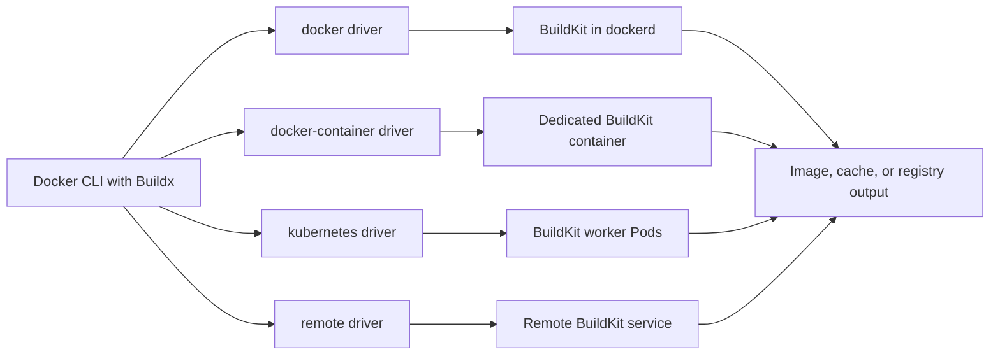
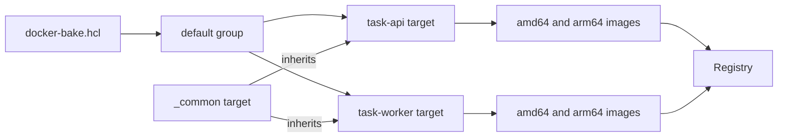
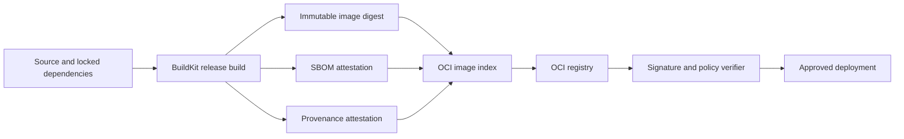

# Chapter 25 — Docker Build Deep Dive

> **Learning Objectives**
>
> By the end of this chapter, you will be able to:
>
> - Create Buildx builders and pick the right driver for where your builds should run
> - Describe several related builds once in `docker-bake.hcl` instead of repeating commands
> - Publish one image name that works on more than one kind of CPU
> - Choose where reusable build work is stored, locally or in a registry or in CI
> - Produce and keep the records that say what is in an image and how it was built
> - Work out why a build produced no image, ran slowly, or reused the wrong cache

## 25.1 From Recipe to Build Factory

A Dockerfile is a recipe. A production image pipeline is a factory. The recipe lists the steps. The factory decides where those steps run, how many kinds of machine the result must work on, which work gets saved for next time, and what paperwork ships alongside the finished product.

Two pieces of software do this work in Docker Engine 29.x. **BuildKit** is the engine that actually performs a build. **Buildx** is the part of the `docker` command that talks to it. Keeping them separate is what makes the rest of this chapter possible: the same build definition can be sent to the builder inside your local Docker daemon, to a dedicated container, to a set of Pods in Kubernetes, or to a shared build service somewhere else entirely.

The output is also bigger than "an image on my laptop." One build can produce images for several CPU types, a cache other builds will reuse, and machine-readable records of what went into the result.

That gives a production build four separate concerns:

1. **Execution** — which builder and driver perform the work?
2. **Coordination** — which targets, variables, and platforms belong together?
3. **Acceleration** — where can BuildKit import and export reusable cache?
4. **Evidence** — which SBOM and provenance attestations travel with the image?

## 25.2 Buildx Builders and Drivers

### In plain terms

A **builder** is a BuildKit worker your Docker client can send work to. A **driver** is how that worker is hosted and reached — inside the Docker daemon, in its own container, in Kubernetes, or over the network.

Why does this need to be configurable? Because the default builder cannot do everything. It is fine for building an image for your own laptop. It struggles when you need images for two CPU types, or a cache shared with your CI system, or a build machine larger than the one on your desk. Choosing a different driver changes what is possible, and it never requires touching the Dockerfile.

Think of Buildx as a dispatcher at a depot. The work order stays the same. The dispatcher decides which crew does the job and where.

The principal drivers are:

| Driver | Where BuildKit runs | Typical use |
|--------|---------------------|-------------|
| `docker` | Inside the Docker daemon | Simple local builds |
| `docker-container` | In a dedicated container | Configurable local or CI builds |
| `kubernetes` | In Kubernetes Pods | Elastic or shared build capacity |
| `remote` | At an existing BuildKit endpoint | Centrally operated build service |



*Figure 25.1: Buildx dispatches one build definition to workers hosted by four different driver topologies.*

One assumption is worth correcting now. People expect the default `docker` driver to handle everything, then hit a wall when they ask for two CPU architectures or an external cache. For those jobs you usually need the `docker-container` driver or a remote builder.

There is also a bookkeeping trap. Once a team has several builders, different CI jobs quietly start using different ones. Each has its own cache, so builds get slower for no visible reason, and a build that works in one pipeline fails in another. Write down which job uses which builder.

> ⚠️ **Common Pitfall:** Mixing builder instances without documenting which CI job uses which—cache misses and “works on my machine.”

### Under the hood

Here is how you see what you have and create something better. List the available builders and inspect the selected one:

```bash
$ docker buildx ls
NAME/NODE       DRIVER/ENDPOINT   STATUS    BUILDKIT   PLATFORMS
default*        docker
  default       default           running   v0.x       linux/amd64

$ docker buildx inspect --bootstrap
Name:          default
Driver:        docker
Status:        running
```

Create a dedicated builder using the `docker-container` driver:

```bash
$ docker buildx create \
    --name textbook-builder \
    --driver docker-container \
    --use
textbook-builder

$ docker buildx inspect --bootstrap
```

`--bootstrap` starts the BuildKit worker if necessary and discovers its capabilities. `--use` selects the builder for subsequent `docker buildx` commands. You can instead select one per command with `--builder textbook-builder` or set `BUILDX_BUILDER`.

The `docker` driver automatically places a compatible result in the local image store. Other drivers do not automatically load output. Make the destination explicit:

```bash
# Load one platform into the local image store.
$ docker buildx build --load -t task-api:dev .

# Push build output directly to a registry.
$ docker buildx build --push -t registry.example.com/team/task-api:1.0 .
```

`--load` is shorthand for a Docker image exporter and is normally a single-platform workflow. `--push` uses the registry exporter and is the normal choice for multi-platform images and persistent attestations.

### In production

**Ownership:** The platform or CI team owns shared builders and keeps them secure. App teams use the approved builders rather than creating their own.

**Failure mode:** A builder going down turns every pipeline red at once. Detect it with a health check against the builder itself, not just a failing job. Reduce the impact by having more than one builder available and by pinning the BuildKit version so an unexpected upgrade cannot break everyone at once.

| Do | Don't |
|----|-------|
| Document builder per pipeline | Ad-hoc builders with host mounts in CI |
| Pin BuildKit versions | Privileged builders without need |

**Before you leave this section**

- **Understand:** Buildx builders/drivers decide cache and platform capability.
- **Try:** Run `docker buildx ls` and inspect the current builder.
- **Watch in prod:** CI cache misses from builder churn.


## 25.3 Coordinating Builds with Bake

### In plain terms

**Bake** is a tool included with Buildx that reads a file describing several builds and runs them together. Each build it describes is called a **target**.

Why not just run the build command several times? Because real projects build more than one image, and each command grows a long tail of flags: tags, platforms, cache settings, output destinations. Repeat that four times in a shell script and you have four places to update and four chances to get one wrong. Bake puts the shared settings in one place, and lets independent targets run at the same time.

There is a clean division of labor here. The Dockerfile says how *one* image is built. Bake says which images exist, what they are called, which CPU types they cover, and where the result goes.

A shell loop can technically do the same thing, but it re-runs the build machinery from scratch each time. Bake keeps one build graph, so shared work is done once and cache is used properly across targets.

> ⚠️ **Common Pitfall:** Duplicating tags across Bake targets so one target overwrites another’s tag.

### Under the hood

Here is a real file. Create `docker-bake.hcl` at the repository root:

```hcl
variable "REGISTRY" {
  default = "registry.example.com/textbook"
}

variable "VERSION" {
  default = "dev"
}

group "default" {
  targets = ["task-api", "task-worker"]
}

target "_common" {
  context    = "."
  platforms  = ["linux/amd64", "linux/arm64"]
  pull       = true
  provenance = "mode=max"
  sbom       = true
}

target "task-api" {
  inherits   = ["_common"]
  dockerfile = "docker/api.Dockerfile"
  target     = "runtime"
  tags       = ["${REGISTRY}/task-api:${VERSION}"]
}

target "task-worker" {
  inherits   = ["_common"]
  dockerfile = "docker/worker.Dockerfile"
  target     = "runtime"
  tags       = ["${REGISTRY}/task-worker:${VERSION}"]
}
```



*Figure 25.2: Bake expands shared settings into parallel application targets and publishes their platform variants.*

Preview the fully resolved plan before executing it:

```bash
$ VERSION=1.4.0 docker buildx bake --print
$ VERSION=1.4.0 docker buildx bake --push
```

Environment variables override Bake variables of the same name. Command-line `--set` overrides target fields and supports target patterns:

```bash
$ docker buildx bake \
    --set '*.platform=linux/amd64' \
    --set '*.output=type=docker'
```

Bake can read HCL, JSON, and Compose build definitions. HCL is especially useful for inheritance, matrices, and reusable functions. Keep target names stable because CI jobs and developer scripts will depend on them.

### In production

**Ownership:** App teams own the Bake file in their repository. CI names the exact targets it builds rather than building whatever is there.

**Failure mode:** The wrong target gets promoted and an unintended image reaches production. Detect it by logging the resulting digest for every target you build and comparing it against what you meant to ship. Prevent it by listing target names explicitly in the CI job.

| Do | Don't |
|----|-------|
| Named targets per env/artifact | Implicit “build all” in prod promote jobs |
| Log digests from bake | Retag mutable latest as the only pointer |

**Before you leave this section**

- **Understand:** Bake coordinates multi-target BuildKit builds with shared cache.
- **Try:** Add a bake target for Task API and build it.
- **Watch in prod:** Wrong bake target promoted to prod.


## 25.4 Multi-Platform Builds

### In plain terms

A **multi-platform image** is one image name that covers several kinds of CPU. Pull `task-api:1.0` on an Intel server and you get the `linux/amd64` build. Pull the same name on an ARM machine and you get `linux/arm64`. The name is identical; the bytes are not.

Why does this come up? Because your laptop and your servers increasingly disagree about CPU architecture. Apple silicon is ARM. Many cloud node pools are now ARM for cost reasons. Build only for your own machine and the image will fail to start on half the cluster, with an unhelpful "exec format error" that says nothing about architecture.

The mechanism is a small index file. The tag points to an **image index**, a short list that says "for amd64 use this manifest, for arm64 use that one." Each entry underneath is an ordinary image with its own layers. The runtime picks the right entry automatically.

Two things to know before you rely on it. Building for another architecture through emulation works but can be dramatically slower, because the compiler itself is being emulated. And building for an architecture is not the same as testing on it — run at least a smoke test on real hardware for every platform you claim to support.

> ⚠️ **Common Pitfall:** Shipping a single-arch image to an arm64 node pool and wondering about Exec format errors.

### Under the hood

Here is how to build, publish, and verify both variants:

```bash
$ docker buildx build \
    --platform linux/amd64,linux/arm64 \
    --tag registry.example.com/textbook/task-api:1.0 \
    --push .
```

Inspect the published index:

```bash
$ docker buildx imagetools inspect \
    registry.example.com/textbook/task-api:1.0
Name:      registry.example.com/textbook/task-api:1.0
MediaType: application/vnd.oci.image.index.v1+json
Manifests:
  Platform: linux/amd64
  Platform: linux/arm64
```

BuildKit can produce multiple platforms in three ways:

1. **Emulation** uses QEMU through `binfmt_misc`. It is easy to start but may be much slower for compilation.
2. **Multiple native nodes** attach workers of different architectures to one builder.
3. **Cross-compilation** uses a build stage that runs on the builder platform and emits a binary for the target platform.

A cross-compilation Dockerfile can use automatic platform arguments:

```dockerfile
# syntax=docker/dockerfile:1
FROM --platform=$BUILDPLATFORM golang:1.25-alpine AS build
ARG TARGETOS
ARG TARGETARCH
WORKDIR /src
COPY go.mod go.sum ./
RUN go mod download
COPY . .
RUN CGO_ENABLED=0 GOOS=$TARGETOS GOARCH=$TARGETARCH \
    go build -o /out/task-api ./cmd/api

FROM alpine:3.22
RUN adduser -D -u 10001 app
COPY --from=build /out/task-api /usr/local/bin/task-api
USER app
ENTRYPOINT ["task-api"]
```

`BUILDPLATFORM` describes the worker running the build stage. `TARGETOS` and `TARGETARCH` describe the image variant being produced. Pinning the build stage to `$BUILDPLATFORM` avoids emulating the compiler itself.

### In production

**Ownership:** App teams declare which platforms their image supports. The platform team supplies builders capable of producing them.

**Failure mode:** A missing architecture puts Pods into CrashLoopBackOff the moment someone adds a node pool with different CPUs. Detect it by inspecting the published image index in CI and confirming every required platform is present. Prevent it by making that check a gate the pipeline cannot skip.

| Do | Don't |
|----|-------|
| Build and test critical archs | Assume QEMU equals native test |
| Inspect manifest lists before promote | Push only amd64 to mixed clusters |

**Before you leave this section**

- **Understand:** Multi-platform needs explicit platforms and verification.
- **Try:** Build with `--platform linux/amd64,linux/arm64` and inspect the manifest.
- **Watch in prod:** Arch mismatches after node pool changes.


## 25.5 Cache Backends and Cache Design

### In plain terms

**Build cache** is saved work from previous builds. Before running any step, BuildKit checks whether it has already run that exact step with those exact inputs. If so, it reuses the old result instead of doing the work again.

Why give this a whole section? Because of where your builds run. A cache kept inside one builder is fast, but a CI runner is usually a fresh machine with nothing on it, so every build starts cold and installs every dependency from scratch. An **external cache** fixes that: a finished build writes its reusable work somewhere shared, and the next build on a brand-new runner reads it back.

The layout of your Dockerfile decides whether any of this helps. BuildKit invalidates a step and everything after it as soon as an input changes. Put `COPY . .` near the top and every commit changes an input, so every step after it re-runs and the cache buys you nothing. Copy the dependency list first, install dependencies, then copy the source. Now a code change only invalidates the last few steps.

One correctness warning. A faster build is not automatically a better build. Cache a package installation with no key tying it to the package list, and you will keep reusing a months-old set of packages, quietly missing security fixes you believe you installed. Correct beats fast.

> ⚠️ **Common Pitfall:** Caching `COPY . .` layers before dependency install—destroying cache on every commit.

### Under the hood

Here are the places BuildKit can store cache:

- **Inline** — embeds minimal cache metadata in the image; simple but limited.
- **Registry** — stores a separate cache artifact in an OCI registry.
- **Local** — writes cache to a directory.
- **GitHub Actions** — integrates with GitHub Actions cache services.
- **S3 and Azure Blob** — availability may depend on the BuildKit release and configuration.

A registry cache separates release artifacts from reusable build state:

```bash
$ docker buildx build \
    --tag registry.example.com/textbook/task-api:1.0 \
    --cache-from type=registry,ref=registry.example.com/textbook/task-api:buildcache \
    --cache-to type=registry,ref=registry.example.com/textbook/task-api:buildcache,mode=max \
    --push .
```

`mode=min` exports cache needed for the final image path. `mode=max` exports intermediate-stage cache as well, which improves reuse for multi-stage builds but consumes more storage.

For a local cache:

```bash
$ docker buildx build \
    --cache-from type=local,src=.buildx-cache \
    --cache-to type=local,dest=.buildx-cache-new,mode=max \
    --load -t task-api:dev .
```

Dockerfile structure determines cache quality. Copy dependency metadata before frequently changing source:

```dockerfile
# syntax=docker/dockerfile:1
FROM python:3.13-slim AS build
WORKDIR /app
COPY requirements.txt .
RUN --mount=type=cache,target=/root/.cache/pip \
    pip wheel --wheel-dir=/wheels -r requirements.txt
COPY . .
```

The cache mount accelerates package downloads without copying the package-manager cache into the final layer.

### In production

**Ownership:** The CI team keeps the cache backend available and bounded. App teams order their Dockerfiles so the cache actually works.

**Failure mode:** A stale or corrupted cache produces an artifact that does not match its source, and nothing in the build log says so. Detect it by rebuilding from clean periodically and comparing digests. Reduce the risk by using `mode=max` deliberately rather than everywhere, and by forcing the cache to be rebuilt on a schedule.

| Do | Don't |
|----|-------|
| Order Dockerfile for cache | Cache secrets into layers |
| Separate dependency and source layers | Unbounded caches without eviction |

**Before you leave this section**

- **Understand:** Cache backends accelerate builds; Dockerfile order decides hit rate.
- **Try:** Compare a cold vs warm build with registry cache.
- **Watch in prod:** Flaky builds from bad cache keys.


## 25.6 SBOM and Provenance Attestations

### In plain terms

An **SBOM** is a **Software Bill of Materials**: a machine-readable list of every package and library inside an image. **Provenance** is a separate record describing how the image was built — which source commit, which builder, which build steps. An **attestation** is the general term for attaching a statement like this to a specific image.

Why produce these? Because of the question that arrives the morning after a vulnerability is announced. Somebody asks which of your running images contain the affected library. Without an SBOM you find out by rebuilding and grepping, service by service, for hours. With one, it is a query. Provenance answers the second question that always follows: where did this image come from, and can we prove nobody built it by hand on a laptop?

> 💡 **In one line:** An SBOM lists what is inside the image; provenance records how the image was made. One answers "am I affected," the other answers "can I trust this."

Be honest about their limits. These are evidence, not guarantees. An SBOM can miss things a scanner did not recognize. Provenance can accurately describe a build process that was insecure. They become valuable only when you generate them, keep them, check them, and refuse to deploy without them.

That last part is where most teams stop short. Generating an SBOM that nobody ever reads and no gate ever checks is paperwork, not security. And note what the evidence attaches to: an immutable **digest**, the content hash of the image. A tag can be moved to point at different bytes tomorrow. A digest cannot.

> ⚠️ **Common Pitfall:** Generating SBOMs but never gating deploy on them—theater without policy.

### Under the hood

Here is how to produce both while pushing:

```bash
$ docker buildx build \
    --platform linux/amd64,linux/arm64 \
    --tag registry.example.com/textbook/task-api:1.0 \
    --sbom=true \
    --provenance=mode=max \
    --push .
```

The general `--attest` form is useful when configuration becomes more specific:

```bash
$ docker buildx build \
    --attest=type=sbom \
    --attest=type=provenance,mode=max \
    --tag registry.example.com/textbook/task-api:1.0 \
    --push .
```

`--sbom` is shorthand for `--attest=type=sbom`; `--provenance` is shorthand for `--attest=type=provenance`. BuildKit normally creates minimal provenance by default, but explicit release policy avoids depending on defaults.



*Figure 25.3: A release build publishes image bytes and attestations together so downstream policy can verify one immutable subject.*

Attestations are attached through manifests in the image index. With a classic Engine image store, loading an image locally can lose registry-oriented attestation data. Pushing directly preserves it. The containerd image store available in Engine 29.x can retain multi-platform images and attestations locally, but registry publication remains the normal release path.

Be careful with `mode=max`: it provides stronger traceability but may expose build arguments and source metadata. Do not pass secrets as build arguments, and review the generated predicate before making it public.

### In production

**Ownership:** The security and platform teams decide what evidence is required. App teams turn the attestations on in their CI builds.

**Failure mode:** Without provenance you cannot prove what shipped, which turns an audit or an incident into guesswork. Detect the gap by checking the registry for attestations on each digest. Close it by making the promotion job fail when they are missing, rather than warn.

> 🏭 **Production floor:** Promote by digest only. Mutable tags are pointers for humans; the gate that ships to prod must fail closed without SBOM/provenance on that digest.

| Do | Don't |
|----|-------|
| Attest + verify on digest | Promote by mutable tag only |
| Store SBOM with the image | Hand-written dependency lists as SoT |

**Before you leave this section**

- **Understand:** SBOM/provenance attach evidence to digests for supply-chain trust.
- **Try:** Build with attestations and inspect them for an image digest.
- **Watch in prod:** Prod images without provenance after CI changes.


## 25.7 Common Pitfalls

> ⚠️ **Common Pitfall:** Using a `docker-container` builder and expecting the image to appear in `docker image ls`. Use `--load` for a local single-platform result or `--push` for registry output.

> ⚠️ **Common Pitfall:** Combining `--platform linux/amd64,linux/arm64` with `--load`. A classic local image load normally represents one platform; push the multi-platform index to a registry.

> ⚠️ **Common Pitfall:** Assuming QEMU performance matches native compilation. Emulation can make CPU-heavy builds dramatically slower; prefer cross-compilation or native workers.

> ⚠️ **Common Pitfall:** Exporting one writable cache reference from many concurrent jobs. Last-writer behavior can discard useful records. Partition caches or serialize the export.

> ⚠️ **Common Pitfall:** Believing an SBOM or provenance statement is automatically trusted. Evidence must be associated with the expected digest and verified against an approved signer or builder policy.

> ⚠️ **Warning:** `provenance=mode=max` may record build arguments. Secrets never belong in build arguments, even when lower-detail provenance is selected.

## 25.8 Hands-on Exercises

1. **Create a builder.** Create `lab-builder` with the `docker-container` driver. Bootstrap it, inspect supported platforms, build a local image with `--load`, and remove the builder when finished.
2. **Define a Bake plan.** Write a `docker-bake.hcl` with a shared target and two application targets. Use `docker buildx bake --print` to verify inheritance, then override the version through an environment variable.
3. **Publish multiple platforms.** Push `linux/amd64` and `linux/arm64` variants to a registry you control. Inspect the index with `docker buildx imagetools inspect`.
4. **Measure cache reuse.** Run a registry-cached build twice. Change only an application source file and identify which steps remain cached. Then change the dependency lock file and compare.
5. **Attach evidence.** Push an image with `--sbom=true --provenance=mode=max`. Inspect the registry result with tooling available in your environment and record the image index digest.

## 25.9 Check Your Understanding

**Q1.** Why might a team choose the `docker-container` driver instead of the default `docker` driver?

<details>
<summary>Show answer</summary>

It provides a dedicated, configurable BuildKit instance with broad support for exporters, external caches, and multi-platform workflows. The tradeoff is that results are not automatically loaded into the local image store.

</details>

**Q2.** What responsibility belongs in Bake rather than in a Dockerfile?

<details>
<summary>Show answer</summary>

Bake coordinates the build matrix: targets, tags, platforms, cache policy, outputs, variables, and shared settings. The Dockerfile describes how an individual image or stage is constructed.

</details>

**Q3.** Why does a multi-platform image have more than one digest?

<details>
<summary>Show answer</summary>

The image index has its own digest, and it references one platform-specific manifest per variant, each with another digest. Policy and deployment tools must be clear about whether they pin or verify the index or a selected platform manifest.

</details>

**Q4.** What is the difference between `mode=min` and `mode=max` for a registry cache?

<details>
<summary>Show answer</summary>

`mode=min` exports cache associated with the final image path. `mode=max` also exports intermediate-stage cache, which can improve reuse but requires more registry storage.

</details>

**Q5.** Do `--sbom` and `--provenance` sign the image?

<details>
<summary>Show answer</summary>

No. They ask BuildKit to generate and attach evidence. Signing and identity verification are separate supply-chain controls covered in the next chapter.

</details>

## 25.10 Key takeaways

- BuildKit does the building. Buildx is how you talk to it and choose where it runs.
- The default driver cannot do multi-platform or external cache. Create a builder that can.
- With a container driver, nothing lands locally unless you say `--load` or `--push`.
- Bake describes several builds in one file so CI and your laptop run the same thing.
- One image name can cover several CPU types. Ship every architecture your cluster runs.
- Building for an architecture is not testing on it. Smoke test each one.
- Cache order matters more than cache size. Dependencies first, source last.
- An SBOM says what is inside. Provenance says how it was made.
- Evidence attaches to a digest, not a tag, and it only counts if a gate checks it.

## 25.11 Official documentation map

| Topic | Official page |
|-------|---------------|
| Builders | [Docker Build builders](https://docs.docker.com/build/builders/) |
| Build drivers | [Build drivers](https://docs.docker.com/build/builders/drivers/) |
| Bake | [Bake overview](https://docs.docker.com/build/bake/) |
| Bake file reference | [Bake file definition](https://docs.docker.com/build/bake/reference/) |
| Multi-platform builds | [Multi-platform builds](https://docs.docker.com/build/building/multi-platform/) |
| Cache backends | [Cache storage backends](https://docs.docker.com/build/cache/backends/) |
| Build attestations | [Build attestations](https://docs.docker.com/build/metadata/attestations/) |
| Buildx build flags | [`docker buildx build`](https://docs.docker.com/reference/cli/docker/buildx/build/) |

**Previous:** [Chapter 24 — Production Best Practices](24-production-best-practices.md) | **Next:** [Chapter 26 — Supply Chain and Trusted Content](26-supply-chain-and-trusted-content.md)
