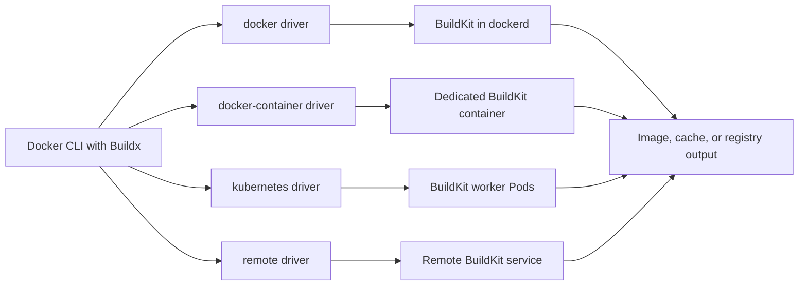
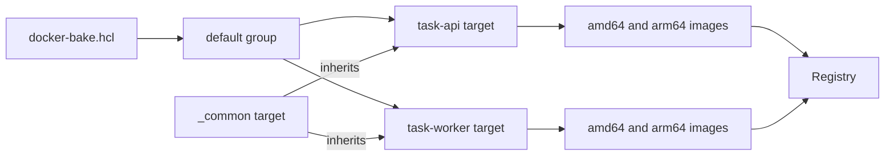
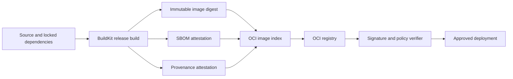

# Chapter 25 — Docker Build Deep Dive

> **Learning Objectives**
>
> By the end of this chapter, you will be able to:
>
> - Create and select Buildx builders backed by appropriate drivers
> - Define repeatable multi-target builds with `docker-bake.hcl`
> - Publish one image reference that supports multiple CPU architectures
> - Choose local, registry, inline, and CI-oriented cache backends
> - Generate and preserve SBOM and provenance attestations
> - Diagnose common BuildKit output, emulation, and cache failures

## 25.1 From Recipe to Build Factory

A Dockerfile is a recipe, but a modern image pipeline is a factory. The recipe describes steps; the factory decides where those steps execute, how many architectures are produced, where reusable work is stored, and which evidence accompanies the result.

Docker Engine 29.x uses BuildKit for builds, and Buildx is the Docker CLI interface to BuildKit's advanced capabilities. This separation matters. A developer can send the same build definition to the Engine-integrated builder, a dedicated BuildKit container, a Kubernetes-backed builder, or a remote BuildKit service.

The build output is also broader than "an image on my laptop." It may be a multi-platform image index in a registry, an OCI archive, a cache export, and signed or unsigned metadata describing contents and origin. A production build therefore has four concerns:

1. **Execution** — which builder and driver perform the work?
2. **Coordination** — which targets, variables, and platforms belong together?
3. **Acceleration** — where can BuildKit import and export reusable cache?
4. **Evidence** — which SBOM and provenance attestations travel with the image?

## 25.2 Buildx Builders and Drivers

### In plain terms

A builder is a BuildKit worker, or a group of workers, available to your Docker client. A driver is the arrangement used to host or reach that worker.

Think of Buildx as a dispatcher. The familiar default builder is convenient for local work. A named builder gives you an isolated build environment that can be configured, upgraded, shared, or removed without changing the application Dockerfile.

The principal drivers are:

| Driver | Where BuildKit runs | Typical use |
|--------|---------------------|-------------|
| `docker` | Inside the Docker daemon | Simple local builds |
| `docker-container` | In a dedicated container | Configurable local or CI builds |
| `kubernetes` | In Kubernetes Pods | Elastic or shared build capacity |
| `remote` | At an existing BuildKit endpoint | Centrally operated build service |



*Figure 25.1: Buildx dispatches one build definition to workers hosted by four different driver topologies.*

Buildx runs BuildKit builds via builders (docker, docker-container, kubernetes, remote). Choose drivers for cache and multi-platform needs. You might think the default docker driver is enough for multi-arch—often you need a container driver or remote builders.

> ⚠️ **Common Pitfall:** Mixing builder instances without documenting which CI job uses which—cache misses and “works on my machine.”

### Under the hood

List the available builders and inspect the selected one:

```bash
$ docker buildx ls
NAME/NODE       DRIVER/ENDPOINT   STATUS    BUILDKIT   PLATFORMS
default*        docker
  default       default           running   v0.x       linux/amd64

$ docker buildx inspect --bootstrap
Name:          default
Driver:        docker
Status:        running
```

Create a dedicated builder using the `docker-container` driver:

```bash
$ docker buildx create \
    --name textbook-builder \
    --driver docker-container \
    --use
textbook-builder

$ docker buildx inspect --bootstrap
```

`--bootstrap` starts the BuildKit worker if necessary and discovers its capabilities. `--use` selects the builder for subsequent `docker buildx` commands. You can instead select one per command with `--builder textbook-builder` or set `BUILDX_BUILDER`.

The `docker` driver automatically places a compatible result in the local image store. Other drivers do not automatically load output. Make the destination explicit:

```bash
# Load one platform into the local image store.
$ docker buildx build --load -t task-api:dev .

# Push build output directly to a registry.
$ docker buildx build --push -t registry.example.com/team/task-api:1.0 .
```

`--load` is shorthand for a Docker image exporter and is normally a single-platform workflow. `--push` uses the registry exporter and is the normal choice for multi-platform images and persistent attestations.

### In production

**Ownership:** Platform/CI owns shared builders and their security; app teams use approved builders.

**Failure mode:** Builder outage → red pipelines. Detect with builder health checks. Mitigate with redundant builders and pinned BuildKit versions.

| Do | Don't |
|----|-------|
| Document builder per pipeline | Ad-hoc builders with host mounts in CI |
| Pin BuildKit versions | Privileged builders without need |

**Before you leave this section**

- **Understand:** Buildx builders/drivers decide cache and platform capability.
- **Try:** Run `docker buildx ls` and inspect the current builder.
- **Watch in prod:** CI cache misses from builder churn.


## 25.3 Coordinating Builds with Bake

### In plain terms

Bake is a build orchestrator included with Buildx. Instead of repeating a long command for every image, you describe targets and shared settings in a file. Bake resolves dependencies, deduplicates common work, and can run independent targets in parallel.

It plays a role similar to a build-system file: the Dockerfile still defines image construction, while Bake defines the build matrix.

Bake files declare multiple targets (images, matrices) as one build graph—like a Makefile for BuildKit. You might think bash loops are equivalent—Bake shares cache and provenance more cleanly.

> ⚠️ **Common Pitfall:** Duplicating tags across Bake targets so one target overwrites another’s tag.

### Under the hood

Create `docker-bake.hcl` at the repository root:

```hcl
variable "REGISTRY" {
  default = "registry.example.com/textbook"
}

variable "VERSION" {
  default = "dev"
}

group "default" {
  targets = ["task-api", "task-worker"]
}

target "_common" {
  context    = "."
  platforms  = ["linux/amd64", "linux/arm64"]
  pull       = true
  provenance = "mode=max"
  sbom       = true
}

target "task-api" {
  inherits   = ["_common"]
  dockerfile = "docker/api.Dockerfile"
  target     = "runtime"
  tags       = ["${REGISTRY}/task-api:${VERSION}"]
}

target "task-worker" {
  inherits   = ["_common"]
  dockerfile = "docker/worker.Dockerfile"
  target     = "runtime"
  tags       = ["${REGISTRY}/task-worker:${VERSION}"]
}
```



*Figure 25.2: Bake expands shared settings into parallel application targets and publishes their platform variants.*

Preview the fully resolved plan before executing it:

```bash
$ VERSION=1.4.0 docker buildx bake --print
$ VERSION=1.4.0 docker buildx bake --push
```

Environment variables override Bake variables of the same name. Command-line `--set` overrides target fields and supports target patterns:

```bash
$ docker buildx bake \
    --set '*.platform=linux/amd64' \
    --set '*.output=type=docker'
```

Bake can read HCL, JSON, and Compose build definitions. HCL is especially useful for inheritance, matrices, and reusable functions. Keep target names stable because CI jobs and developer scripts will depend on them.

### In production

**Ownership:** App teams own bake files in repo; CI invokes pinned targets.

**Failure mode:** Wrong target promoted → bad digest in prod. Detect with bake target naming + digest logs. Mitigate with explicit target lists in CI.

| Do | Don't |
|----|-------|
| Named targets per env/artifact | Implicit “build all” in prod promote jobs |
| Log digests from bake | Retag mutable latest as the only pointer |

**Before you leave this section**

- **Understand:** Bake coordinates multi-target BuildKit builds with shared cache.
- **Try:** Add a bake target for Task API and build it.
- **Watch in prod:** Wrong bake target promoted to prod.


## 25.4 Multi-Platform Builds

### In plain terms

An image tagged `task-api:1.0` can represent several platform-specific images. When a client pulls it, the registry and runtime select the matching variant, such as `linux/amd64` for many servers or `linux/arm64` for ARM systems.

The shared reference points to an OCI image index. Each entry in that index points to a normal image manifest with its own layers and configuration.

Multi-platform images ship manifests for amd64/arm64/etc. Emulation works; native builders are faster. You might think one local arch proves all platforms—test at least one VM per critical arch.

> ⚠️ **Common Pitfall:** Shipping a single-arch image to an arm64 node pool and wondering about Exec format errors.

### Under the hood

Build and push two Linux variants:

```bash
$ docker buildx build \
    --platform linux/amd64,linux/arm64 \
    --tag registry.example.com/textbook/task-api:1.0 \
    --push .
```

Inspect the published index:

```bash
$ docker buildx imagetools inspect \
    registry.example.com/textbook/task-api:1.0
Name:      registry.example.com/textbook/task-api:1.0
MediaType: application/vnd.oci.image.index.v1+json
Manifests:
  Platform: linux/amd64
  Platform: linux/arm64
```

BuildKit can produce multiple platforms in three ways:

1. **Emulation** uses QEMU through `binfmt_misc`. It is easy to start but may be much slower for compilation.
2. **Multiple native nodes** attach workers of different architectures to one builder.
3. **Cross-compilation** uses a build stage that runs on the builder platform and emits a binary for the target platform.

A cross-compilation Dockerfile can use automatic platform arguments:

```dockerfile
# syntax=docker/dockerfile:1
FROM --platform=$BUILDPLATFORM golang:1.25-alpine AS build
ARG TARGETOS
ARG TARGETARCH
WORKDIR /src
COPY go.mod go.sum ./
RUN go mod download
COPY . .
RUN CGO_ENABLED=0 GOOS=$TARGETOS GOARCH=$TARGETARCH \
    go build -o /out/task-api ./cmd/api

FROM alpine:3.22
RUN adduser -D -u 10001 app
COPY --from=build /out/task-api /usr/local/bin/task-api
USER app
ENTRYPOINT ["task-api"]
```

`BUILDPLATFORM` describes the worker running the build stage. `TARGETOS` and `TARGETARCH` describe the image variant being produced. Pinning the build stage to `$BUILDPLATFORM` avoids emulating the compiler itself.

### In production

**Ownership:** App teams declare platforms; platform provides builders that can produce them.

**Failure mode:** Missing arch → CrashLoop on new node pools. Detect with image index inspection in CI. Mitigate with required platforms in gate checks.

| Do | Don't |
|----|-------|
| Build and test critical archs | Assume QEMU equals native test |
| Inspect manifest lists before promote | Push only amd64 to mixed clusters |

**Before you leave this section**

- **Understand:** Multi-platform needs explicit platforms and verification.
- **Try:** Build with `--platform linux/amd64,linux/arm64` and inspect the manifest.
- **Watch in prod:** Arch mismatches after node pool changes.


## 25.5 Cache Backends and Cache Design

### In plain terms

Build cache is saved work. BuildKit calculates whether an operation's inputs match previous inputs; if they do, it can reuse the result instead of running that step again.

An internal builder cache is fast but tied to one builder. An external cache lets fresh CI runners import previous work and lets a completed build publish cache for the next build.

Cache mounts and registry/gha cache backends cut build time. Cache correctness matters more than max hit rate. You might think caching apt packages without keys is fine—stale caches produce surprise CVE drift.

> ⚠️ **Common Pitfall:** Caching `COPY . .` layers before dependency install—destroying cache on every commit.

### Under the hood

The main external backends are:

- **Inline** — embeds minimal cache metadata in the image; simple but limited.
- **Registry** — stores a separate cache artifact in an OCI registry.
- **Local** — writes cache to a directory.
- **GitHub Actions** — integrates with GitHub Actions cache services.
- **S3 and Azure Blob** — availability may depend on the BuildKit release and configuration.

A registry cache separates release artifacts from reusable build state:

```bash
$ docker buildx build \
    --tag registry.example.com/textbook/task-api:1.0 \
    --cache-from type=registry,ref=registry.example.com/textbook/task-api:buildcache \
    --cache-to type=registry,ref=registry.example.com/textbook/task-api:buildcache,mode=max \
    --push .
```

`mode=min` exports cache needed for the final image path. `mode=max` exports intermediate-stage cache as well, which improves reuse for multi-stage builds but consumes more storage.

For a local cache:

```bash
$ docker buildx build \
    --cache-from type=local,src=.buildx-cache \
    --cache-to type=local,dest=.buildx-cache-new,mode=max \
    --load -t task-api:dev .
```

Dockerfile structure determines cache quality. Copy dependency metadata before frequently changing source:

```dockerfile
# syntax=docker/dockerfile:1
FROM python:3.13-slim AS build
WORKDIR /app
COPY requirements.txt .
RUN --mount=type=cache,target=/root/.cache/pip \
    pip wheel --wheel-dir=/wheels -r requirements.txt
COPY . .
```

The cache mount accelerates package downloads without copying the package-manager cache into the final layer.

### In production

**Ownership:** CI owns cache backend reliability; app teams structure Dockerfiles for cache hygiene.

**Failure mode:** Poisoned/stale cache → broken artifacts. Detect with reproducible digest checks. Mitigate with mode=max carefully and periodic cache bust pins.

| Do | Don't |
|----|-------|
| Order Dockerfile for cache | Cache secrets into layers |
| Separate dependency and source layers | Unbounded caches without eviction |

**Before you leave this section**

- **Understand:** Cache backends accelerate builds; Dockerfile order decides hit rate.
- **Try:** Compare a cold vs warm build with registry cache.
- **Watch in prod:** Flaky builds from bad cache keys.


## 25.6 SBOM and Provenance Attestations

### In plain terms

An SBOM answers, "What software is in this image?" Provenance answers, "How and from what inputs was this image built?" An attestation associates such a statement with an image.

These records are evidence, not a guarantee. An SBOM can be incomplete, and provenance can faithfully describe an unsafe process. Their value comes from generation, preservation, verification, and policy use together.

SBOMs list dependencies; provenance attestations record how/where an image was built. Together they support promote-by-digest trust. You might think a tag is enough evidence—tags move; attestations bind to digests.

> ⚠️ **Common Pitfall:** Generating SBOMs but never gating deploy on them—theater without policy.

### Under the hood

Generate SBOM and maximum-detail provenance while pushing:

```bash
$ docker buildx build \
    --platform linux/amd64,linux/arm64 \
    --tag registry.example.com/textbook/task-api:1.0 \
    --sbom=true \
    --provenance=mode=max \
    --push .
```

The general `--attest` form is useful when configuration becomes more specific:

```bash
$ docker buildx build \
    --attest=type=sbom \
    --attest=type=provenance,mode=max \
    --tag registry.example.com/textbook/task-api:1.0 \
    --push .
```

`--sbom` is shorthand for `--attest=type=sbom`; `--provenance` is shorthand for `--attest=type=provenance`. BuildKit normally creates minimal provenance by default, but explicit release policy avoids depending on defaults.



*Figure 25.3: A release build publishes image bytes and attestations together so downstream policy can verify one immutable subject.*

Attestations are attached through manifests in the image index. With a classic Engine image store, loading an image locally can lose registry-oriented attestation data. Pushing directly preserves it. The containerd image store available in Engine 29.x can retain multi-platform images and attestations locally, but registry publication remains the normal release path.

Be careful with `mode=max`: it provides stronger traceability but may expose build arguments and source metadata. Do not pass secrets as build arguments, and review the generated predicate before making it public.

### In production

**Ownership:** Security/platform own attestation policy; app teams enable BuildKit attestations in CI.

**Failure mode:** Missing provenance → cannot prove what shipped. Detect with registry attestation presence checks. Mitigate by failing promote jobs without attestations.

> 🏭 **Production floor:** Promote by digest only. Mutable tags are pointers for humans; the gate that ships to prod must fail closed without SBOM/provenance on that digest.

| Do | Don't |
|----|-------|
| Attest + verify on digest | Promote by mutable tag only |
| Store SBOM with the image | Hand-written dependency lists as SoT |

**Before you leave this section**

- **Understand:** SBOM/provenance attach evidence to digests for supply-chain trust.
- **Try:** Build with attestations and inspect them for an image digest.
- **Watch in prod:** Prod images without provenance after CI changes.


## 25.7 Common Pitfalls

> ⚠️ **Common Pitfall:** Using a `docker-container` builder and expecting the image to appear in `docker image ls`. Use `--load` for a local single-platform result or `--push` for registry output.

> ⚠️ **Common Pitfall:** Combining `--platform linux/amd64,linux/arm64` with `--load`. A classic local image load normally represents one platform; push the multi-platform index to a registry.

> ⚠️ **Common Pitfall:** Assuming QEMU performance matches native compilation. Emulation can make CPU-heavy builds dramatically slower; prefer cross-compilation or native workers.

> ⚠️ **Common Pitfall:** Exporting one writable cache reference from many concurrent jobs. Last-writer behavior can discard useful records. Partition caches or serialize the export.

> ⚠️ **Common Pitfall:** Believing an SBOM or provenance statement is automatically trusted. Evidence must be associated with the expected digest and verified against an approved signer or builder policy.

> ⚠️ **Warning:** `provenance=mode=max` may record build arguments. Secrets never belong in build arguments, even when lower-detail provenance is selected.

## 25.8 Hands-on Exercises

1. **Create a builder.** Create `lab-builder` with the `docker-container` driver. Bootstrap it, inspect supported platforms, build a local image with `--load`, and remove the builder when finished.
2. **Define a Bake plan.** Write a `docker-bake.hcl` with a shared target and two application targets. Use `docker buildx bake --print` to verify inheritance, then override the version through an environment variable.
3. **Publish multiple platforms.** Push `linux/amd64` and `linux/arm64` variants to a registry you control. Inspect the index with `docker buildx imagetools inspect`.
4. **Measure cache reuse.** Run a registry-cached build twice. Change only an application source file and identify which steps remain cached. Then change the dependency lock file and compare.
5. **Attach evidence.** Push an image with `--sbom=true --provenance=mode=max`. Inspect the registry result with tooling available in your environment and record the image index digest.

## 25.9 Check Your Understanding

**Q1.** Why might a team choose the `docker-container` driver instead of the default `docker` driver?

<details>
<summary>Show answer</summary>

It provides a dedicated, configurable BuildKit instance with broad support for exporters, external caches, and multi-platform workflows. The tradeoff is that results are not automatically loaded into the local image store.

</details>

**Q2.** What responsibility belongs in Bake rather than in a Dockerfile?

<details>
<summary>Show answer</summary>

Bake coordinates the build matrix: targets, tags, platforms, cache policy, outputs, variables, and shared settings. The Dockerfile describes how an individual image or stage is constructed.

</details>

**Q3.** Why does a multi-platform image have more than one digest?

<details>
<summary>Show answer</summary>

The image index has its own digest, and it references one platform-specific manifest per variant, each with another digest. Policy and deployment tools must be clear about whether they pin or verify the index or a selected platform manifest.

</details>

**Q4.** What is the difference between `mode=min` and `mode=max` for a registry cache?

<details>
<summary>Show answer</summary>

`mode=min` exports cache associated with the final image path. `mode=max` also exports intermediate-stage cache, which can improve reuse but requires more registry storage.

</details>

**Q5.** Do `--sbom` and `--provenance` sign the image?

<details>
<summary>Show answer</summary>

No. They ask BuildKit to generate and attach evidence. Signing and identity verification are separate supply-chain controls covered in the next chapter.

</details>

## 25.10 Key takeaways

- Buildx decouples the Docker client from named BuildKit builders.
- Driver choice controls configuration, scale, output behavior, and operational responsibility.
- Bake makes multi-target build policy repeatable and reviewable.
- Multi-platform publication creates an image index containing platform-specific manifests.
- External caches speed ephemeral CI runners, but require isolation, retention, and careful Dockerfile design.
- SBOM and provenance attestations become useful when preserved, verified, and enforced against immutable digests.

## 25.11 Official documentation map

| Topic | Official page |
|-------|---------------|
| Builders | [Docker Build builders](https://docs.docker.com/build/builders/) |
| Build drivers | [Build drivers](https://docs.docker.com/build/builders/drivers/) |
| Bake | [Bake overview](https://docs.docker.com/build/bake/) |
| Bake file reference | [Bake file definition](https://docs.docker.com/build/bake/reference/) |
| Multi-platform builds | [Multi-platform builds](https://docs.docker.com/build/building/multi-platform/) |
| Cache backends | [Cache storage backends](https://docs.docker.com/build/cache/backends/) |
| Build attestations | [Build attestations](https://docs.docker.com/build/metadata/attestations/) |
| Buildx build flags | [`docker buildx build`](https://docs.docker.com/reference/cli/docker/buildx/build/) |

**Previous:** [Chapter 24 — Production Best Practices](24-production-best-practices.md) | **Next:** [Chapter 26 — Supply Chain and Trusted Content](26-supply-chain-and-trusted-content.md)
