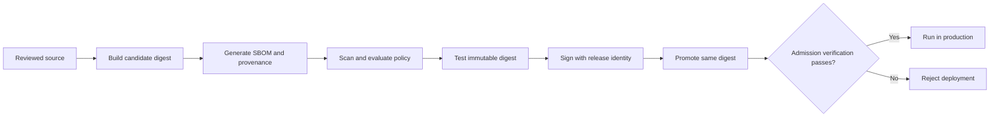
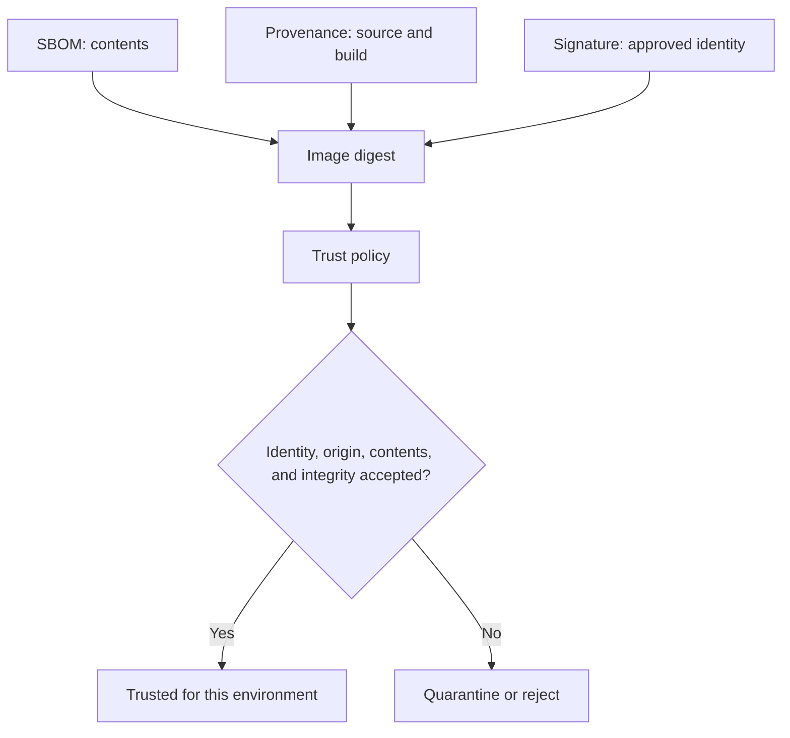
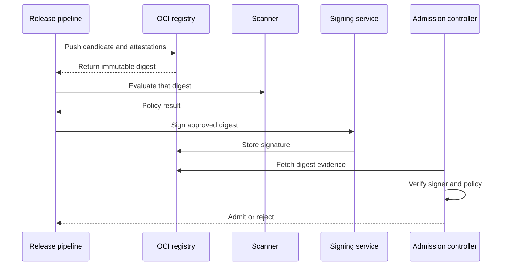

# Chapter 26 — Supply Chain and Trusted Content

> **Learning Objectives**
>
> By the end of this chapter, you will be able to:
>
> - Use Docker Scout to see what is wrong with an image and how a new release compares
> - Explain when a hardened base image helps and what it still leaves you to do
> - Tell signing apart from SBOM and provenance, and say what each one proves
> - Check that an image was signed by the identity you expect, using Cosign or Notation
> - Build gates that let only approved images reach production, keyed to the digest
> - Use an SBOM to answer "are we affected?" during a security incident

## 26.1 Trust Is a Chain of Evidence

An image can start up, pass every test, serve traffic correctly, and still have no business running in production.

It might contain a library with a serious known flaw. It might have been built on somebody's laptop instead of by your pipeline. It might sit on a base image nobody approved. Or the tag you reviewed last week might now point at completely different bytes.

None of that shows up when you run it. The container works. That is the whole problem: correctness and trustworthiness are separate questions, and only one of them is answered by "it starts."

**Supply-chain security** is the practice of answering the second question with evidence instead of assumption. It replaces "we built this, it should be fine" with a set of claims you can actually test:

1. **Identity** — which immutable digest is being evaluated?
2. **Origin** — which source, builder, and process produced it?
3. **Contents** — which operating-system and application packages are present?
4. **Integrity** — has the referenced content changed?
5. **Authorization** — did an approved person or workload sign it?
6. **Policy** — does the evidence satisfy this environment's rules?

No single tool answers all six. Docker Scout looks at what is inside an image and whether it meets your rules. Docker Hardened Images give you a maintained base with evidence already attached. Cosign and Notation check signatures and who created them. Registries and admission controllers are where the decision gets enforced, before anything runs.



*Figure 26.1: Trust accumulates through build, evidence, scan, test, signature, promotion, and admission gates.*

> 💡 **Tip:** Tags are convenient names; digests are content identities. Evaluate, sign, promote, and deploy by digest whenever the decision must remain stable.


## 26.2 Docker Scout


### In plain terms

**Docker Scout** lists every package inside an image and matches those packages against published vulnerability data. A **CVE** is one such published flaw — Common Vulnerabilities and Exposures, the industry's shared numbering system for security bugs.

Why run it? Because you did not write most of what is in your image. A Python service is a few hundred lines of your code sitting on top of thousands of packages from a base image and a dependency list. Scout tells you which of those have known problems, which ones already have a fix available, and whether a newer base image would clear several at once.

What it will not do is fix anything. Scout is a report. Turning the report into safety requires you to rebuild, retest, and redeploy — and that gap is where most of the real work lives.

Resist reading the output as a single number. "Four criticals" tells you almost nothing. What matters is whether the vulnerable code is reachable from outside, whether a fix exists yet, whether it came from your base image or your own dependency list, and how a new release compares with the one already running.

One more thing to check, and it is the one people miss. Scanning `task-api:latest` on your laptop tells you about whatever bytes that tag pointed at when you pulled it. Production may be running something else entirely. Scan the exact digest you intend to deploy.

> ⚠️ **Common Pitfall:** Scanning `:latest` locally while prod runs an older digest.

### Under the hood

Here are the commands, from a quick look to a full policy check. Analyze a local or registry image:

```bash
$ docker scout quickview registry.example.com/textbook/task-api:1.4.0
$ docker scout cves registry.example.com/textbook/task-api:1.4.0
```

Filter a detailed report to vulnerabilities with fixes:

```bash
$ docker scout cves \
    --only-fixed \
    registry.example.com/textbook/task-api:1.4.0
```

Compare a candidate with the current production image:

```bash
$ docker scout compare \
    --to registry.example.com/textbook/task-api:1.3.2 \
    registry.example.com/textbook/task-api:1.4.0
```

The comparison matters more than an isolated score. A release may fix one remotely exploitable issue while adding several low-impact findings, or it may inherit a better base image despite unchanged application code.

Where Docker Scout organization policies are configured, evaluate them from automation:

```bash
$ docker scout policy \
    --org textbook \
    registry.example.com/textbook/task-api@sha256:REPLACE_WITH_DIGEST
```

Replace the placeholder with a real digest resolved by the build. Policy capabilities and entitlements vary by Docker subscription and integration, so test the exact CLI and organization configuration used by your pipeline.

### In production

**Ownership:** App teams fix the findings in their own images. The security team sets the severity thresholds that CI enforces.

**Failure mode:** A critical vulnerability is disclosed for something already running in production. Detect it by continuously rescanning the digests that are actually deployed, not just the ones being built. Respond with a promotion path that moves one tested digest forward and an agreed deadline for how fast a critical fix must ship.

| Do | Don't |
|----|-------|
| Scan the digest you deploy | Gate only on tags |
| SLA for critical CVE rebuilds | Ignore base image drift |

**Before you leave this section**

- **Understand:** Scout informs risk; digests bind scan results to what runs.
- **Try:** Scan Task API image and note critical CVEs.
- **Watch in prod:** Prod digests not in the scanned set.


## 26.3 Docker Hardened Images


### In plain terms

**Docker Hardened Images**, or **DHI**, are base images that Docker maintains with security as the main goal. They contain as little as possible, they are updated often, and they ship with signed evidence about their contents already attached.

Why start from one? Because most of the vulnerabilities in a typical image are not yours. They come from the operating system packages in the base — a shell, a package manager, text utilities, libraries your app never calls. Remove what you do not need and two things improve at once: there is less for an attacker to use after a break-in, and there are far fewer findings for your team to triage every week.

Some of these bases are **distroless**, meaning they contain the runtime for your language and essentially nothing else. No shell. No package manager. That is the point, and it is also the surprise.

Two consequences follow, and both cost people a rollout. Anything in your setup that quietly assumed a shell stops working — a health check written as a shell command, an entrypoint that runs a small script, a container you were used to opening with `exec` to look around. And changing base image is not a one-line edit; it is a rebuild plus a real test cycle. Plan how you will debug before you remove the shell, not after.

> ⚠️ **Common Pitfall:** Moving to distroless without fixing shell-based healthchecks and entrypoints.

### Under the hood

Here is the pattern that makes a minimal runtime work, plus how to check its evidence.

DHI repositories are distributed through Docker's hardened-image service and include variants suited to different build and runtime needs. A minimal runtime variant may omit a shell and package manager. That removes tools an attacker could abuse, but it also changes debugging and installation assumptions.

A multi-stage pattern keeps compilers in the build stage and copies only the runtime artifact:

```dockerfile
# syntax=docker/dockerfile:1
FROM golang:1.25 AS build
WORKDIR /src
COPY go.mod go.sum ./
RUN go mod download
COPY . .
RUN CGO_ENABLED=0 go build -trimpath -o /out/task-api ./cmd/api

# Replace this example reference with the approved DHI runtime
# reference from your organization's catalog.
FROM dhi.io/static:20250725
COPY --from=build /out/task-api /task-api
USER 65532:65532
ENTRYPOINT ["/task-api"]
```

The concrete repository, variant, and tag must come from the DHI catalog available to your organization. Pin the approved result by digest in a release Dockerfile or lock mechanism.

DHI publishes signed metadata that can include SBOM, provenance, vulnerability, VEX, and other attestations depending on the image variant. List and verify available evidence with Docker Scout:

```bash
$ docker scout attest list dhi.io/IMAGE:TAG
$ docker scout attest get \
    --predicate-type https://scout.docker.com/sbom \
    --verify \
    dhi.io/IMAGE:TAG
```


### In production

**Ownership:** The platform team publishes the list of approved base images. App teams move to them and test the result.

**Failure mode:** After changing base images the entrypoint or health check breaks, and the rollout fails. Catch it during a soak period in staging rather than in production. Reduce the risk with a maintained catalog of approved bases and a short compatibility checklist covering shell use, user IDs, and file paths.

| Do | Don't |
|----|-------|
| Use approved hardened bases | Random minimal images without support |
| Test probes after rebase | Assume shell exists in distroless |

**Before you leave this section**

- **Understand:** Hardened bases shrink surface; rebases need test discipline.
- **Try:** Compare package count of a hardened vs fat base.
- **Watch in prod:** Healthcheck failures after distroless moves.


## 26.4 Signing and Verification


### In plain terms

A **signature** is a cryptographic mark that ties a known identity to one exact image. **Verification** is the check that runs later, and it has two halves: is the signature mathematically valid, and is the signer someone you actually approved?

Why is a signature worth adding on top of everything else? Because scanning and provenance both describe an image, and neither one says "we agreed to ship this." A signature is the endorsement. It is how a cluster can tell an image your release pipeline produced from an identical-looking image somebody pushed by hand.

Keep the three straight, because they answer three different questions. An SBOM says *what is inside*. Provenance says *how it was made*. A signature says *who approved it*. You want all three, and none substitutes for another.

One thing a signature explicitly does not mean: that the code is good. It proves the publisher is who they claim to be. A trusted publisher can sign an image full of bugs, and the signature will verify perfectly.



*Figure 26.2: SBOM, provenance, and signature answer different questions that policy combines into one decision.*

Two tools dominate. **Cosign** is part of the Sigstore project and supports both traditional keys and **keyless signing**, where a short-lived certificate is issued to a verified workload identity so there is no private key sitting around to be stolen. **Notation** comes from the CNCF Notary Project and implements its own signature model. Both store signatures in the registry alongside the image, but their trust policies are written differently and are not interchangeable.

Here is the mistake that makes all of this pointless. Teams sign images in CI, verify the signature in the very next CI step, and consider themselves done — while the cluster happily runs whatever image a manifest names. Signing is worth nothing without verification at the moment something is admitted to run.

> ⚠️ **Common Pitfall:** Verifying signatures only in CI while the cluster admits unsigned digests.

### Under the hood

Here is the sequence with both tools. First resolve and retain the immutable digest after pushing:

```bash
$ docker buildx imagetools inspect \
    registry.example.com/textbook/task-api:1.4.0
```

With Cosign, a keyless signing flow can be:

```bash
$ cosign sign \
    registry.example.com/textbook/task-api@sha256:REPLACE_WITH_DIGEST
```

Keyless signing authenticates through an OpenID Connect identity and normally records certificate information through Sigstore infrastructure. Verification must constrain the expected identity and issuer:

```bash
$ cosign verify \
    --certificate-identity-regexp='^https://github.com/example/task-api/' \
    --certificate-oidc-issuer='https://token.actions.githubusercontent.com' \
    registry.example.com/textbook/task-api@sha256:REPLACE_WITH_DIGEST
```

For key-based operation, protect the private key in a hardware-backed or managed signing service where possible:

```bash
$ cosign verify \
    --key cosign.pub \
    registry.example.com/textbook/task-api@sha256:REPLACE_WITH_DIGEST
```

Notation uses a configured signing key and trust policy:

```bash
$ notation sign \
    registry.example.com/textbook/task-api@sha256:REPLACE_WITH_DIGEST

$ notation verify \
    registry.example.com/textbook/task-api@sha256:REPLACE_WITH_DIGEST
```

`notation verify` is meaningful only after the verifier has a trust store and `trustpolicy.json` defining accepted registry scopes, identities, and verification levels. Do not interpret command success under a permissive test policy as production trust.

### In production

**Ownership:** The security and platform teams own the signing keys and the verification rule at admission. CI does the signing as part of the release build.

**Failure mode:** An unsigned image, or one signed by the wrong identity, gets admitted and runs. Detect it by watching admission denials and by auditing what the registry actually holds. Roll the control out by warning first, fixing what breaks, then switching to enforce.

| Do | Don't |
|----|-------|
| Sign and verify the same digest | Sign tags that move |
| Protect signing keys like prod secrets | Share CI signing keys widely |

**Before you leave this section**

- **Understand:** Signatures attest publisher identity on digests; verify at deploy.
- **Try:** Sign a lab image and verify before run.
- **Watch in prod:** Cluster admitting unsigned images.


## 26.5 Registry and Deployment Policy Gates


### In plain terms

A **policy gate** is the point where all that evidence turns into a decision: allow it, warn about it, quarantine it, or refuse it outright. Without a gate, everything earlier in this chapter is just data collection.

**Digest promotion** is the practice these gates protect. You build an image once, and from then on you move that exact digest through your environments — dev, then staging, then production — instead of rebuilding at each stage.

> 💡 **In one line:** Build once and promote the same digest everywhere, because the moment you rebuild for production you are shipping bytes nobody scanned, tested, or signed.

Why does rebuilding break things? Because a rebuild produces different bytes. Base images shift, package mirrors update, timestamps change. The result may be fine, but it is not the artifact your tests passed against, and your scan result and signature both belong to the old one. Promotion keeps the evidence and the artifact attached to each other.

Where the gate lives matters too. Registry permissions control who can push, but they cannot stop a cluster from pulling something unapproved. You need a check at admission, right before a Pod is allowed to start.

Finally, keep the rules consistent across environments. When staging enforces something production does not, or the other way round, people learn to route around whichever one is stricter. Same evidence, same gates, one promotion path.

> ⚠️ **Common Pitfall:** Different rules in staging vs prod without a promotion path—teams learn to bypass staging.

### Under the hood

Here is what a release policy actually checks:

```text
Identity:
  Image is referenced by digest.
Origin:
  Provenance identifies the approved source repository and CI builder.
Signature:
  Digest is signed by the release workflow identity.
Contents:
  SBOM exists and can be parsed.
Vulnerabilities:
  No unexpired policy violation above the agreed threshold.
Base:
  Base image belongs to the approved catalog.
Platform:
  Required amd64 and arm64 manifests exist.
```

Docker Scout policy results can fail a CI stage before promotion. Registry webhooks or native scanning can quarantine content, while a Kubernetes admission controller can verify signatures and attestations before Pods are admitted.

A robust sequence is:

1. Build and push a candidate digest with SBOM and provenance.
2. Scan the candidate and evaluate organization policy.
3. Run functional and platform tests against that digest.
4. Sign the digest using the release identity.
5. Promote the same digest.
6. Verify again at admission or deployment.

Pass the digest between stages as a machine-readable artifact. Do not resolve the tag independently in every stage because a concurrent push can create a time-of-check/time-of-use race.



*Figure 26.3: Every release stage passes the same digest, preventing a mutable tag from changing between review and admission.*

### In production

**Ownership:** The platform team owns the gates and keeps them enforcing. App teams fix whatever evidence is missing rather than asking for an exception.

**Failure mode:** Someone routes around the gate and an unreviewed image reaches production. Detect it by auditing what admission actually allowed, not what the pipeline claims it shipped. Keep the emergency path safe by making the break-glass route log who used it and expire on its own.

| Do | Don't |
|----|-------|
| Same digest promoted across envs | Rebuild per environment with different digests |
| Warn then enforce gates | Silent bypass aliases |

**Before you leave this section**

- **Understand:** Policy gates enforce evidence before deploy.
- **Try:** Trace one image from CI scan to cluster admission rule.
- **Watch in prod:** Env-specific rebuilds breaking provenance.

> 🏭 **Production floor:** **Digest promote** is the artifact SOP: CI builds once → scan/sign/attest → promote the *same digest* dev→stage→prod. Tickets must include digest, scanner result, signature ID. Never retag `latest` as the promote mechanism.


## 26.6 Consuming SBOMs


### In plain terms

Producing an SBOM is the easy half. **Consuming** one means using that list to answer a real question under time pressure: are we affected by this vulnerability, which image contains this package, do we ship a license our lawyers prohibit, what changed between these two releases?

Why does this deserve its own section? Because the difference between a two-minute answer and a two-day answer is entirely about preparation. At 9 a.m. a serious flaw is announced in a common library. If your SBOMs are stored next to your images and searchable by digest, someone runs a query and names the affected services before the first meeting. If they are not, every team starts grepping their own dependency files.

Note what does and does not go stale here. The list of packages in a fixed set of bytes never changes. What changes is the outside world's knowledge about those packages. That is why you keep the SBOM and rescan it later, rather than regenerating it.

The common failure is storage. An SBOM attached to a CI job log is gone in two weeks. The image it describes may run for two years. Store it where the image lives, keyed to the digest, and make sure your on-call runbook says exactly how to fetch it.

> ⚠️ **Common Pitfall:** SBOMs in CI logs that expire in 14 days while images live for years.

### Under the hood

Here is how to retrieve and search one. Common formats include SPDX and CycloneDX. Tools differ in package coverage and identifiers, so preserve format, generator, version, subject digest, and creation time.

Docker Scout can retrieve SBOM-related attestations where available:

```bash
$ docker scout attest list \
    registry.example.com/textbook/task-api@sha256:REPLACE_WITH_DIGEST

$ docker scout attest get \
    --predicate-type https://scout.docker.com/sbom \
    --predicate \
    --output task-api.sbom.json \
    registry.example.com/textbook/task-api@sha256:REPLACE_WITH_DIGEST
```

Predicate types vary by producer. List attestations first rather than assuming that every image uses Docker Scout's predicate URI.

During an incident, query the SBOM for package names, package URLs, versions, and file evidence. A name-only match can produce false positives because ecosystems reuse names. Package URL, namespace, version, architecture, and dependency path provide stronger identification.

**VEX** stands for Vulnerability Exploitability eXchange. It is a companion statement that says whether a known vulnerability actually affects this product, given how the product uses the vulnerable code. It is useful, and it is still only a claim: check who issued it and whether it is signed. VEX explains a finding. It does not delete one.

### In production

**Ownership:** The security team owns how long SBOMs are kept and where. App teams make sure their builds produce them in the first place.

**Failure mode:** A widely reported vulnerability lands and nobody can say which services are affected. Detect the exposure in advance by reporting which production digests have no SBOM stored. Close it by keeping SBOMs in the registry beside the image and linking the lookup steps directly from the on-call runbook.

| Do | Don't |
|----|-------|
| Retain SBOM with digest lifetime | Only CI log attachments |
| Practice CVE lookup drill | Hand-maintained spreadsheets as SoT |

**Before you leave this section**

- **Understand:** SBOMs are incident evidence keyed by digest.
- **Try:** Fetch an SBOM for an image and find one dependency version.
- **Watch in prod:** Missing SBOMs during CVE response.


## 26.7 Common Pitfalls

> ⚠️ **Common Pitfall:** Blocking releases solely on the number of CVEs. Severity, reachability, fixes, compensating controls, and exception age all matter.

> ⚠️ **Common Pitfall:** Scanning a tag in CI and deploying the same tag later. Resolve one digest and carry it through scanning, signing, promotion, and deployment.

> ⚠️ **Common Pitfall:** Treating minimal or hardened images as invulnerable. Application dependencies and configuration can still introduce critical risk.

> ⚠️ **Common Pitfall:** Running `cosign verify` without constraining the certificate identity and issuer. Cryptographic validity is not the same as approval.

> ⚠️ **Common Pitfall:** Generating an SBOM that no inventory or incident process can search. Evidence without a consumer does not shorten response time.

> ⚠️ **Common Pitfall:** Copying signatures but not attestations during registry promotion. Verify all required OCI artifacts at the destination.


## 26.8 Hands-on Exercises

1. **Scout an image.** Run `docker scout quickview` and `docker scout cves` against an application image. Identify the base image, one fixable finding, and one finding inherited from an application dependency.
2. **Compare releases.** Compare two immutable image digests with `docker scout compare`. Write a release recommendation based on changes, not only total counts.
3. **Verify trusted content.** If you have DHI access, list and verify attestations for an approved DHI. Otherwise, use another signed test image and document its signer and predicate types.
4. **Sign a digest.** In a non-production registry, sign an image digest with Cosign or Notation. Verify it with a narrowly scoped identity or trust policy, then demonstrate that a different unsigned digest fails.
5. **Draft a gate.** Express five release requirements as pass/fail statements. Include signature identity, SBOM presence, provenance origin, vulnerability policy, and digest pinning.
6. **Run an SBOM query.** Export an SBOM and locate one package by package URL or ecosystem plus version. Trace it back to the image digest and owning application.


## 26.9 Check Your Understanding

**Q1.** Why should a Scout policy evaluate a digest instead of only a tag?

Show answer

A digest identifies immutable content. A tag can be moved after evaluation, causing deployment to use bytes that were never scanned or approved.

**Q2.** What security work remains after adopting a Docker Hardened Image?

Show answer

Teams must still secure application dependencies, configuration, secrets, runtime permissions, networking, updates, testing, and deployment policy. DHI improves the base and its evidence; it does not secure everything layered above it.

**Q3.** How do SBOM, provenance, and signature differ?

Show answer

An SBOM inventories contents, provenance describes build origin and process, and a signature binds an approved identity or key to a digest or statement. A mature policy commonly uses all three.

**Q4.** Why is a valid keyless Cosign signature insufficient without identity constraints?

Show answer

Many identities can create valid signatures. Verification must require the expected OIDC issuer and workload or repository identity so cryptographic validity becomes authorization.

**Q5.** Where should policy enforcement occur?

Show answer

Use layered gates: CI before promotion, registry monitoring or quarantine, and deployment-time admission. Each catches a different failure or race, and no single gate sees the entire lifecycle.

**Q6.** What makes an SBOM operationally useful during an incident?

Show answer

It must be linked to an immutable digest, searchable using reliable package identifiers, and connected to deployment inventory and ownership. That lets responders find affected running workloads rather than merely list registry files.

## 26.10 Key takeaways

- An image that runs correctly can still be unfit to ship. Those are separate questions.
- Scan the digest you will deploy, not a tag you happened to pull.
- Scout reports. It does not fix. The rebuild and redeploy are still yours.
- A smaller base image means fewer findings and less for an attacker to use.
- Distroless removes the shell. Fix your health checks and debug plan before you switch.
- SBOM says what is inside. Provenance says how it was made. A signature says who approved it.
- A signature proves the publisher, not that the code is good.
- Build once, promote that digest everywhere. Rebuilding for production discards your evidence.
- Verifying only in CI is not verifying. The gate belongs at admission.
- Store SBOMs beside the image, keyed to the digest, for as long as the image lives.


## 26.11 Official documentation map


| Topic                  | Official page                                                                                         |
| ---------------------- | ----------------------------------------------------------------------------------------------------- |
| Docker Scout           | [Docker Scout overview](https://docs.docker.com/scout/)                                               |
| Scout quickstart       | [Docker Scout quickstart](https://docs.docker.com/scout/quickstart/)                                  |
| Scout policies         | [Policy evaluation](https://docs.docker.com/scout/policy/)                                            |
| Docker Hardened Images | [Docker Hardened Images](https://docs.docker.com/dhi/)                                                |
| DHI signatures         | [Code signing](https://docs.docker.com/dhi/core-concepts/signatures/)                                 |
| DHI attestations       | [Attestations](https://docs.docker.com/dhi/core-concepts/attestations/)                               |
| DHI verification       | [Verify Docker Hardened Images](https://docs.docker.com/dhi/how-to/verify/)                           |
| Build attestations     | [Build attestations](https://docs.docker.com/build/metadata/attestations/)                            |
| Scout attestation CLI  | `[docker scout attestation get](https://docs.docker.com/reference/cli/docker/scout/attestation/get/)` |


**Previous:** [Chapter 25 — Docker Build Deep Dive](25-docker-build-deep-dive.md) | **Next:** [Chapter 27 — Docker Engine Operations](27-docker-engine-operations.md)